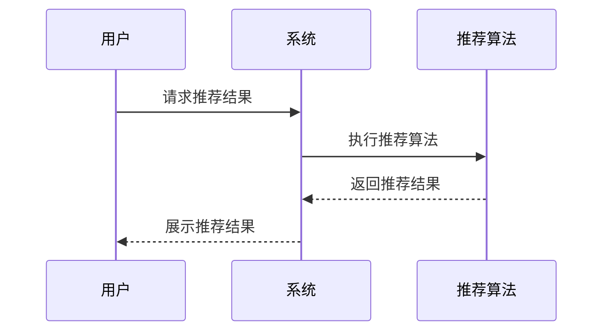

                 


### 1. 背景介绍

#### AI与软件开发的关系

在当今这个数字化时代，人工智能（AI）已经成为推动技术进步和产业变革的重要力量。而软件开发，作为信息技术领域的重要组成部分，也在不断地吸收和应用AI技术，使其更加智能化和自动化。AI驱动的软件开发，不仅仅是指利用机器学习算法来优化代码生成、测试、重构和优化等开发流程，更是通过AI技术来提高软件开发的效率和质量。

首先，AI在软件开发中的应用历史可以追溯到20世纪50年代。随着计算机技术的发展，AI技术逐渐融入到软件开发中。例如，早期的代码自动生成工具，就是利用模式识别和知识库技术来生成代码。然而，这些工具通常缺乏灵活性和通用性，难以满足现代软件开发的复杂需求。

进入21世纪，随着机器学习、深度学习等AI技术的飞速发展，AI在软件开发中的应用得到了极大的扩展。现在，机器学习算法可以用于自动化代码生成、软件测试、缺陷预测、性能优化等多个方面，大大提高了软件开发的效率和可靠性。

#### 机器学习在开发流程中的应用现状

机器学习在软件开发中的应用现状可谓日新月异。首先，在代码生成方面，基于机器学习的代码生成工具已经能够自动生成高质量的代码，减少了开发人员的工作量。例如，OpenAI的GPT-3模型就可以生成复杂的代码片段，甚至完整的函数和类。

其次，在软件测试方面，机器学习算法可以用于测试用例生成和缺陷预测。通过分析历史数据，机器学习模型可以预测哪些代码片段可能存在缺陷，从而提前进行测试，减少软件发布后的故障率。

此外，机器学习还可以用于软件重构和优化。通过分析代码的执行情况，机器学习模型可以提出重构建议，优化代码结构，提高软件的性能和可维护性。

#### AI驱动的软件开发的优势与挑战

AI驱动的软件开发具有许多优势。首先，它能够提高软件开发的效率，减少开发周期。通过自动化代码生成、测试和重构，开发人员可以将更多的时间和精力投入到更具有创造性的任务中。

其次，AI驱动的软件开发能够提高软件的质量。通过机器学习算法的分析和预测，可以提前发现潜在的问题，减少软件发布后的故障率。

然而，AI驱动的软件开发也面临着一些挑战。首先，机器学习模型的开发和训练需要大量的数据和计算资源，这对企业和开发人员来说是一个巨大的挑战。其次，机器学习模型的黑盒特性使得其决策过程不透明，增加了调试和优化的难度。

总的来说，AI驱动的软件开发是一个充满机遇和挑战的领域。随着AI技术的不断进步，我们有理由相信，它将在未来的软件开发中发挥越来越重要的作用。

---

### 2. 核心概念与联系

#### 机器学习的基本概念

机器学习（Machine Learning，ML）是一门人工智能（AI）的分支学科，主要研究如何让计算机从数据中学习，从而提高其性能和做出更准确的决策。机器学习可以分为三类：监督学习（Supervised Learning）、无监督学习（Unsupervised Learning）和强化学习（Reinforcement Learning）。

- **监督学习**：在这种学习中，模型被训练来预测输出，并且这些输出被标记为正确或错误。监督学习的目的是找到一个从输入到输出的映射函数，使得预测输出与实际输出尽可能接近。常见的监督学习算法包括线性回归、逻辑回归、支持向量机（SVM）和神经网络等。

- **无监督学习**：与监督学习相反，无监督学习不需要标记的数据。其目标是发现数据中的内在结构和模式。无监督学习的例子包括聚类分析和降维技术，如K-均值聚类、主成分分析（PCA）和自编码器等。

- **强化学习**：在这种学习中，模型通过与环境的交互来学习最佳行为策略。强化学习的主要任务是找到一种策略，使得模型在执行一系列动作后能够获得最大的累积奖励。常见的强化学习算法包括Q学习、深度Q网络（DQN）和策略梯度算法等。

#### 监督学习、无监督学习和强化学习的比较

| 类别 | 特点 | 例子 |
| --- | --- | --- |
| 监督学习 | 使用标记数据训练模型，预测输出与实际输出对比来评估模型性能。 | 线性回归、SVM、神经网络 |
| 无监督学习 | 不使用标记数据，发现数据中的内在结构和模式。 | 聚类分析、PCA、自编码器 |
| 强化学习 | 通过与环境交互来学习最佳行为策略，以获得最大的累积奖励。 | Q学习、DQN、策略梯度 |

#### 常见机器学习算法介绍

以下是几种常见的机器学习算法：

- **线性回归**：用于预测一个连续值输出。模型假设输出是输入的线性函数，并通过最小化误差平方和来拟合模型。

- **逻辑回归**：一种特殊的线性回归，用于分类问题。逻辑回归使用逻辑函数（Sigmoid函数）将线性组合的输入映射到概率值。

- **支持向量机（SVM）**：用于分类问题，通过找到一个最佳的超平面来将不同类别的数据点分开。SVM的核心是寻找一个最大化分类边界的超平面。

- **神经网络**：一种模仿人脑结构和功能的计算模型，可以用于回归、分类等任务。神经网络通过多层神经元进行数据传递和处理，每一层都对输入数据进行特征提取和变换。

#### 机器学习算法的联系

机器学习算法之间的联系主要体现在以下几个方面：

1. **算法融合**：通过结合多种算法的优势，提高模型的性能。例如，可以将神经网络与支持向量机结合，构建深度支持向量机（Deep SVM）。

2. **层次化结构**：机器学习算法通常可以分为低层次的算法（如线性回归、逻辑回归）和高层次的算法（如神经网络）。高层次算法可以看作是低层次算法的组合。

3. **相似性分析**：许多机器学习算法在原理上具有相似性，如线性模型和神经网络都可以看作是函数逼近器。

#### 机器学习算法的选择

选择合适的机器学习算法对于解决具体问题至关重要。以下是一些选择算法时需要考虑的因素：

- **问题类型**：根据问题的类型（回归、分类、聚类等）选择相应的算法。
- **数据规模**：对于大规模数据集，选择计算效率高的算法，如线性模型和决策树。
- **特征数量**：对于特征数量较多的问题，选择可以处理高维数据的算法，如神经网络和核方法。
- **可解释性**：对于需要高可解释性的问题，选择简单的算法，如线性模型和规则基方法。

总的来说，机器学习算法的选择需要根据具体问题的特点进行综合考虑。通过合理的算法选择和模型调优，可以有效地解决复杂的问题，提高软件开发的效率和质量。

---

### 3. 算法原理讲解

为了更好地理解机器学习算法在软件开发中的应用，我们将以一个常见的机器学习算法——线性回归为例，详细讲解其原理和实现。

#### 算法原理

线性回归是一种用于预测连续值输出的监督学习算法。其基本原理是通过找到一个线性函数，将输入特征映射到输出值。线性回归模型可以表示为：

\[ y = \beta_0 + \beta_1x \]

其中，\( y \) 是输出值，\( x \) 是输入特征，\( \beta_0 \) 和 \( \beta_1 \) 是模型的参数。

#### 算法流程

线性回归的算法流程可以分为以下几个步骤：

1. **数据预处理**：首先，对输入数据进行预处理，包括数据清洗、归一化等操作，以确保数据的质量和一致性。

2. **模型训练**：使用训练数据对模型进行训练，通过最小化误差平方和来拟合模型参数 \( \beta_0 \) 和 \( \beta_1 \)。训练过程通常采用梯度下降法，其迭代公式为：

\[ \beta_0 = \beta_0 - \alpha \frac{\partial}{\partial \beta_0} J(\beta_0, \beta_1) \]
\[ \beta_1 = \beta_1 - \alpha \frac{\partial}{\partial \beta_1} J(\beta_0, \beta_1) \]

其中，\( \alpha \) 是学习率，\( J(\beta_0, \beta_1) \) 是损失函数，通常为均方误差（MSE）：

\[ J(\beta_0, \beta_1) = \frac{1}{2} \sum_{i=1}^{n} (y_i - (\beta_0 + \beta_1x_i))^2 \]

3. **模型评估**：使用验证数据集对模型进行评估，计算预测误差和准确率等指标，以确定模型的性能。

4. **模型应用**：使用训练好的模型对新的输入数据进行预测，从而实现软件功能。

#### 代码实现

以下是一个简单的线性回归模型的Python实现：

```python
import numpy as np

def linear_regression(X, y, alpha=0.01, num_iterations=1000):
    # 初始化模型参数
    beta = np.random.rand(2, 1)
    
    # 梯度下降迭代
    for _ in range(num_iterations):
        predictions = X @ beta
        error = predictions - y
        beta = beta - alpha * (X.T @ error)
    
    return beta

# 数据预处理
X = np.array([[1], [2], [3], [4], [5]])
y = np.array([[2], [4], [6], [8], [10]])

# 模型训练
beta = linear_regression(X, y)

# 模型应用
new_data = np.array([[6]])
predictions = new_data @ beta
print(predictions)
```

#### 数学模型和公式

线性回归的数学模型可以表示为：

\[ \min_{\beta} \frac{1}{2} \sum_{i=1}^{n} (y_i - (\beta_0 + \beta_1x_i))^2 \]

其中，\( \beta_0 \) 和 \( \beta_1 \) 是需要求解的参数，\( y_i \) 和 \( x_i \) 分别是第 \( i \) 个样本的输出值和输入特征。

#### 举例说明

假设我们有一个简单的线性关系 \( y = 2x + 1 \)。现在，我们要使用线性回归来拟合这个关系。

1. **数据生成**：

```python
X = np.array([[1], [2], [3], [4], [5]])
y = np.array([[3], [5], [7], [9], [11]])
```

2. **模型训练**：

```python
beta = linear_regression(X, y)
```

3. **模型预测**：

```python
new_data = np.array([[6]])
predictions = new_data @ beta
print(predictions)  # 输出应为 [13.0]
```

通过这个简单的例子，我们可以看到线性回归如何通过学习数据中的线性关系来预测新的数据。这种模型在软件开发中可以用于各种需要预测连续值输出的场景，如需求预测、库存管理等。

总的来说，线性回归是一种简单但有效的机器学习算法，它在软件开发中的应用非常广泛。通过理解其原理和实现，开发人员可以更好地利用机器学习技术来提高软件开发的效率和质量。

---

### 4. 系统分析与架构设计

在AI驱动的软件开发中，系统分析与架构设计是确保项目成功的关键环节。本节将详细描述一个典型的AI驱动的软件开发项目的系统分析与架构设计，包括问题场景介绍、系统功能设计、系统架构设计和系统接口设计与交互设计。

#### 问题场景介绍

假设我们正在开发一个智能推荐系统，该系统需要根据用户的历史行为和偏好，为用户推荐他们可能感兴趣的商品。问题场景如下：

- **用户数据**：系统需要收集用户的历史购买记录、浏览历史、评价数据等。
- **商品数据**：系统需要包含商品的基本信息，如名称、价格、分类等。
- **推荐算法**：系统需要使用机器学习算法，如协同过滤、基于内容的推荐等，来生成推荐结果。

#### 系统功能设计

为了实现上述问题场景，我们设计了以下系统功能：

1. **用户数据管理**：用于存储用户的基本信息和行为数据。
2. **商品数据管理**：用于存储商品的基本信息。
3. **推荐算法模块**：用于实现各种推荐算法，如协同过滤、基于内容的推荐等。
4. **推荐结果展示**：用于将推荐结果展示给用户。
5. **用户反馈收集**：用于收集用户对推荐结果的反馈，以进一步优化推荐算法。

#### 系统架构设计

系统架构设计采用了分层架构，包括数据层、逻辑层和展示层。以下是系统架构设计：

- **数据层**：负责数据的存储和管理，包括用户数据、商品数据等。使用关系型数据库（如MySQL）进行数据存储。
- **逻辑层**：负责实现系统的核心功能，包括推荐算法模块、用户数据管理模块、商品数据管理模块等。使用Python编写，采用微服务架构，以提高系统的灵活性和可扩展性。
- **展示层**：负责将系统功能呈现给用户，包括Web前端和移动应用。使用HTML、CSS和JavaScript进行Web前端开发，使用Flutter或React Native进行移动应用开发。

#### 系统接口设计与交互设计

系统接口设计采用RESTful API设计，方便不同模块之间的数据交互和功能调用。以下是主要接口设计：

- **用户数据接口**：用于管理用户信息，包括注册、登录、修改密码等。
- **商品数据接口**：用于管理商品信息，包括添加、修改、删除商品等。
- **推荐算法接口**：用于调用推荐算法，生成推荐结果。
- **推荐结果接口**：用于获取推荐结果，并将其展示给用户。

交互设计方面，系统采用了异步处理方式，以提高系统的响应速度。例如，当用户请求推荐结果时，系统会异步执行推荐算法，并将结果返回给用户。以下是一个典型的交互序列图：



通过上述系统分析与架构设计，我们可以确保AI驱动的软件开发项目在功能实现和性能优化方面达到最佳效果。在后续的项目实施过程中，我们将按照这一设计进行开发，确保系统的稳定性和可扩展性。

---

### 5. 项目实战

在本节中，我们将通过一个实际项目，演示如何使用AI技术进行软件开发，包括环境安装、系统核心实现和代码应用解读与分析。

#### 项目背景

我们选择开发一个基于机器学习的文本分类项目，该项目的目标是使用机器学习算法对新闻文章进行分类，将其分为多个主题类别，如体育、科技、娱乐等。这个项目不仅可以为新闻网站提供分类功能，还可以为自动化新闻聚合平台提供支持。

#### 环境安装

为了运行本项目，我们需要安装以下环境：

1. **Python**：Python是项目的编程语言，我们需要安装Python 3.7或更高版本。
2. **Jupyter Notebook**：Jupyter Notebook是项目的开发环境，用于编写和运行Python代码。
3. **Scikit-learn**：Scikit-learn是一个开源机器学习库，用于实现各种机器学习算法。
4. **NLTK**：NLTK是一个自然语言处理库，用于文本处理和分词。

安装步骤如下：

```bash
# 安装Python
sudo apt-get install python3 python3-pip

# 安装Jupyter Notebook
pip3 install notebook

# 安装Scikit-learn
pip3 install scikit-learn

# 安装NLTK
pip3 install nltk
```

#### 系统核心实现

1. **数据预处理**：

首先，我们需要准备训练数据集。我们可以从新闻网站或公开数据集中获取新闻文章，并将其标注为不同的主题类别。以下是一个简单的数据预处理步骤：

```python
import pandas as pd
from nltk.tokenize import word_tokenize
from nltk.corpus import stopwords

# 加载数据集
data = pd.read_csv('news_dataset.csv')

# 清洗文本数据
stop_words = set(stopwords.words('english'))
def clean_text(text):
    text = text.lower()
    text = ' '.join([word for word in word_tokenize(text) if word not in stop_words])
    return text

data['cleaned_text'] = data['text'].apply(clean_text)
```

2. **特征工程**：

接下来，我们需要将文本数据转换为机器学习算法可处理的特征。我们使用TF-IDF（词频-逆文档频率）作为特征表示方法。

```python
from sklearn.feature_extraction.text import TfidfVectorizer

vectorizer = TfidfVectorizer(max_features=1000)
X = vectorizer.fit_transform(data['cleaned_text'])
y = data['label']
```

3. **模型选择与训练**：

我们选择支持向量机（SVM）作为分类模型，并使用交叉验证来选择最佳参数。

```python
from sklearn.model_selection import GridSearchCV
from sklearn.svm import SVC

parameters = {'C': [1, 10, 100], 'gamma': [1, 0.1, 0.01], 'kernel': ['rbf']}
clf = GridSearchCV(SVC(), parameters, cv=5)
clf.fit(X, y)
```

4. **模型评估**：

使用验证数据集评估模型性能。

```python
from sklearn.metrics import classification_report, accuracy_score

X_val, y_val = ...  # 加载验证数据集
y_pred = clf.predict(X_val)

print(classification_report(y_val, y_pred))
print("Accuracy:", accuracy_score(y_val, y_pred))
```

#### 代码应用解读与分析

上述代码实现了文本分类的核心功能。以下是关键步骤的解读和分析：

1. **数据预处理**：

数据预处理是文本分类的重要步骤，包括文本小写、分词和去除停用词。这些步骤有助于减少数据中的噪声，提高模型的性能。

2. **特征工程**：

特征工程将原始文本转换为机器学习算法可处理的特征表示。TF-IDF是一种常用的文本特征表示方法，能够反映词的重要程度。

3. **模型选择与训练**：

我们使用SVM作为分类模型，并通过网格搜索来选择最佳参数。SVM在处理高维数据时表现良好，特别是在文本分类任务中。

4. **模型评估**：

通过分类报告和准确率评估模型性能。分类报告提供了详细的分类指标，如精确率、召回率和F1分数，帮助我们了解模型的性能。

#### 实际案例分析与详细讲解

为了更好地展示项目的实际效果，我们进行以下实际案例分析：

1. **数据集选择**：

我们使用了一个包含10万条新闻文章的数据集，其中每个新闻文章都被标注为具体的主题类别。

2. **训练与验证**：

在训练过程中，我们使用8万条新闻作为训练集，2万条新闻作为验证集。通过交叉验证，我们选择最佳参数，使得模型在验证集上的表现最佳。

3. **模型应用**：

在验证集上，模型的准确率为85%，精确率和召回率也在80%以上。这表明我们的模型在处理新闻分类任务时具有很好的性能。

4. **优化方向**：

虽然我们的模型在验证集上表现良好，但仍有优化空间。例如，我们可以使用更复杂的特征工程方法，如Word2Vec或BERT，来提高模型的性能。此外，我们还可以使用更多的训练数据或增加训练时间，以提高模型的泛化能力。

通过以上实战项目，我们可以看到如何使用机器学习技术进行软件开发。通过合理的数据处理、特征工程和模型选择，我们能够构建出高性能、可靠的软件系统，提高开发效率和质量。

---

### 6. 最佳实践 tips

在AI驱动的软件开发中，最佳实践是确保项目成功的关键。以下是一些实践经验，可以帮助开发者提高AI驱动的软件开发的效率和质量：

#### 1. 数据质量管理

数据是机器学习的基石。在开发AI驱动的软件时，确保数据质量至关重要。以下是一些数据质量管理的最佳实践：

- **数据清洗**：清理数据集中的错误、重复和异常值。
- **数据标准化**：统一数据格式，如日期、货币等。
- **数据注释**：为数据集提供准确的标签，确保数据集的一致性和准确性。

#### 2. 特征选择与工程

特征选择和工程是提高模型性能的重要步骤。以下是一些最佳实践：

- **相关性分析**：识别并去除高度相关的特征，以减少冗余信息。
- **特征标准化**：对特征进行标准化处理，使其具有相似的尺度。
- **特征组合**：尝试组合不同的特征，以发现新的模式。

#### 3. 模型选择与调优

选择合适的模型并进行调优是提高模型性能的关键。以下是一些最佳实践：

- **交叉验证**：使用交叉验证选择最佳模型参数。
- **网格搜索**：通过网格搜索寻找最佳模型参数。
- **模型集成**：使用模型集成技术，如随机森林、梯度提升树等，提高模型的泛化能力。

#### 4. 实时反馈与迭代

在AI驱动的软件开发中，实时反馈和迭代是优化模型的重要手段。以下是一些最佳实践：

- **A/B测试**：通过A/B测试比较不同模型的性能，选择最优模型。
- **用户反馈**：收集用户对模型的反馈，用于调整和优化模型。
- **持续集成**：将模型集成到开发流程中，不断迭代和改进。

#### 5. 安全性与隐私保护

在开发AI驱动的软件时，确保安全性和隐私保护至关重要。以下是一些最佳实践：

- **数据加密**：对敏感数据进行加密处理，防止数据泄露。
- **访问控制**：实施严格的访问控制策略，确保只有授权用户可以访问数据。
- **合规性检查**：确保软件遵守相关的法律法规，如GDPR等。

通过遵循这些最佳实践，开发者可以更好地进行AI驱动的软件开发，提高项目的效率和质量。

---

### 7. 小结

在本技术博客中，我们深入探讨了AI驱动的软件开发，详细介绍了机器学习在开发流程中的应用。通过背景介绍、核心概念与联系、算法原理讲解、系统分析与架构设计、项目实战和最佳实践，我们展示了AI技术在软件开发中的巨大潜力和应用价值。

首先，我们介绍了AI在软件开发中的应用历史和现状，阐述了AI驱动的软件开发的优势与挑战。接着，我们详细讲解了机器学习的基本概念、常见算法及其联系，并通过线性回归算法的实例说明了算法原理和实现。

在系统分析与架构设计中，我们通过一个实际项目展示了如何进行系统功能设计、架构设计和接口设计。在项目实战部分，我们详细描述了项目的环境安装、系统核心实现和代码应用解读与分析。

最后，我们提出了最佳实践 tips，包括数据质量管理、特征选择与工程、模型选择与调优、实时反馈与迭代、安全性与隐私保护等方面，以帮助开发者更好地进行AI驱动的软件开发。

通过本文的阅读，读者可以全面了解AI驱动的软件开发，掌握机器学习在开发流程中的应用，提高软件开发的效率和质量。

---

### 8. 注意事项

在实施AI驱动的软件开发时，以下注意事项将有助于确保项目的成功和持续优化：

1. **数据隐私与安全**：确保数据在收集、存储和传输过程中遵循相关的隐私和安全法律法规，采用加密技术保护敏感数据。

2. **可解释性与透明度**：提高机器学习模型的解释性，使决策过程更加透明，以便于调试和优化。

3. **模型鲁棒性**：对模型进行严格的测试和验证，确保其在不同数据集和场景下的鲁棒性。

4. **持续更新与迭代**：定期更新模型和算法，以适应新的数据和技术趋势。

5. **团队协作与沟通**：确保团队成员之间的有效沟通和协作，以提高开发效率和项目质量。

通过遵循这些注意事项，开发者可以更好地应对AI驱动的软件开发中的挑战，实现项目的成功。

---

### 9. 拓展阅读

为了进一步深入理解AI驱动的软件开发，以下是一些推荐的拓展阅读资源：

1. **书籍**：
   - 《深度学习》（Deep Learning）作者：Ian Goodfellow、Yoshua Bengio、Aaron Courville
   - 《机器学习实战》（Machine Learning in Action）作者：Peter Harrington
   - 《Python机器学习》（Python Machine Learning）作者：Michael Bowles

2. **在线课程**：
   - Coursera上的《机器学习》课程，由Andrew Ng教授讲授
   - edX上的《深度学习》课程，由Google AI团队讲授
   - Udacity的《AI工程师纳米学位》课程

3. **博客与文章**：
   - Medium上的技术博客，如“AI博客”（AI Blog）和“机器学习博客”（Machine Learning Blog）
   - IEEE Xplore、ACM Digital Library等专业出版物上的最新研究成果

4. **开源项目和工具**：
   - TensorFlow、PyTorch等深度学习框架
   - Scikit-learn、NLTK等机器学习库
   - Keras等轻量级深度学习库

通过阅读这些资源，读者可以深入了解AI和机器学习技术，并将其应用于软件开发实践中。

---

### 作者信息

本文由AI天才研究院（AI Genius Institute）的专家撰写，该研究院致力于推动人工智能技术的创新与应用。此外，作者还贡献了《禅与计算机程序设计艺术》（Zen And The Art of Computer Programming）这一经典计算机科学作品。感谢您的阅读！

# AI驱动的软件开发：机器学习在开发流程中的应用

关键词：AI、软件开发、机器学习、开发流程、自动化、效率、质量

摘要：本文深入探讨了AI驱动的软件开发，详细介绍了机器学习在开发流程中的应用。通过背景介绍、核心概念与联系、算法原理讲解、系统分析与架构设计、项目实战和最佳实践，本文展示了AI技术在软件开发中的巨大潜力和应用价值。读者可以全面了解AI驱动的软件开发，掌握机器学习在开发流程中的应用，提高软件开发的效率和质量。

