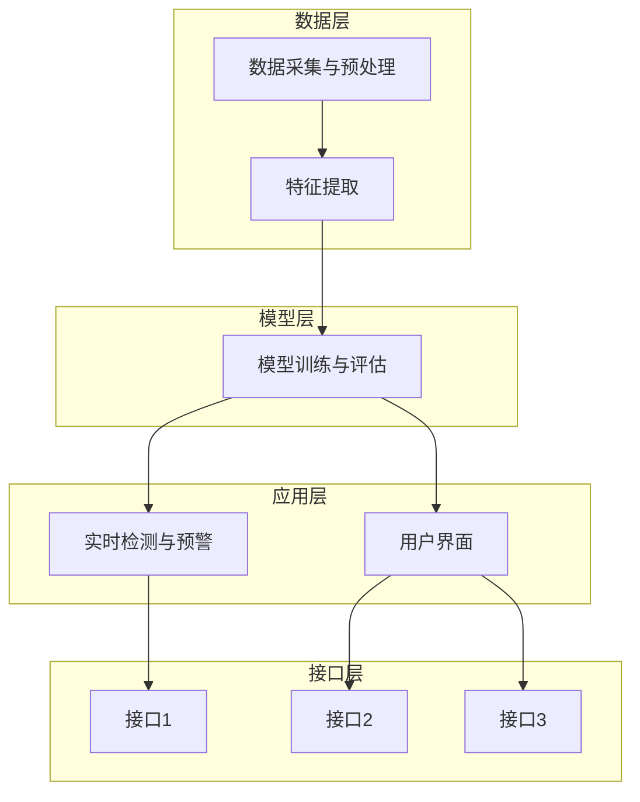
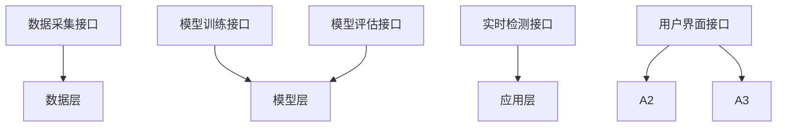
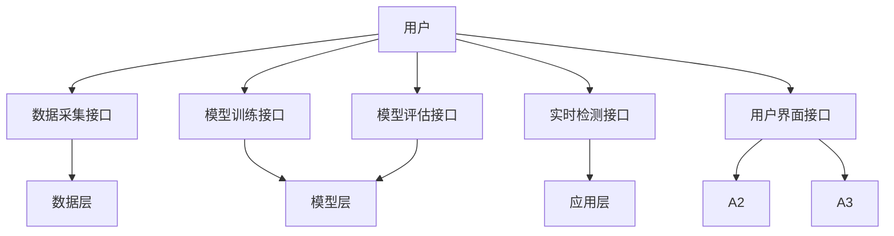

                 

**文章标题：** AI驱动的金融欺诈检测系统

**关键词：** AI，金融欺诈，检测系统，算法，数学模型，系统架构，项目实战

**摘要：** 本篇文章旨在深入探讨AI驱动的金融欺诈检测系统的设计、实现和应用。首先，我们将介绍金融欺诈检测的背景和重要性，然后逐步分析核心概念、算法原理、数学模型、系统架构，并通过实际案例进行项目实战剖析。最后，我们将总结最佳实践和注意事项，为读者提供拓展阅读资源。

----------------------------------------------------------------

## 第一部分: 引言与背景

### 第1章: 问题背景与概述

#### 1.1 问题背景

金融欺诈是全球金融行业面临的一个重要挑战。随着金融业务的复杂化和互联网的普及，欺诈手段日益多样化和隐蔽化，给金融机构和客户带来了巨大的损失。根据相关统计，全球每年因金融欺诈造成的损失高达数百亿美元。为了应对这一挑战，金融机构迫切需要一种高效、准确的欺诈检测系统。

#### 1.2 问题描述

金融欺诈检测的主要目标是从大量的金融交易数据中识别出异常交易，从而发现潜在的欺诈行为。然而，这并非易事，因为欺诈行为的特征往往不显著，且与正常交易高度相似。因此，如何从海量数据中提取有效的特征，并设计出高效的检测算法，是金融欺诈检测的关键。

#### 1.3 问题解决

AI技术的快速发展为金融欺诈检测提供了新的思路和手段。通过机器学习算法，可以从历史数据中学习欺诈行为的特征，并利用这些特征对实时交易进行检测。同时，AI技术还可以自适应地调整模型参数，以适应不断变化的欺诈环境。因此，AI驱动的金融欺诈检测系统成为金融机构应对金融欺诈的重要工具。

#### 1.4 边界与外延

金融欺诈检测系统不仅应用于银行和金融机构，还可以应用于其他金融领域，如保险、投资等。此外，随着AI技术的进步，金融欺诈检测系统的应用范围还将进一步扩大，例如在电子商务、在线支付等领域。

----------------------------------------------------------------

### 第2章: 核心概念与联系

#### 2.1 核心概念

在构建AI驱动的金融欺诈检测系统时，我们需要明确以下几个核心概念：

1. **欺诈行为**：指在金融交易中，故意制造虚假信息或利用漏洞进行非法获利的行为。
2. **交易数据**：包括交易金额、时间、地点、交易双方信息等。
3. **特征提取**：从交易数据中提取与欺诈行为相关的特征。
4. **机器学习算法**：用于从历史数据中学习欺诈特征，并对实时交易进行检测。
5. **模型评估**：通过评估模型在测试数据上的性能，判断模型的有效性。

#### 2.2 概念属性特征对比

以下是一个简单的概念属性特征对比表格：

| 概念         | 属性特征                                                         |
|--------------|----------------------------------------------------------------|
| 欺诈行为     | 故意性、非法性、隐蔽性、破坏性、损失性                             |
| 交易数据     | 金额、时间、地点、交易双方信息、交易类型、交易频率等                 |
| 特征提取     | 数据清洗、特征选择、特征变换等                                     |
| 机器学习算法 | 监督学习、无监督学习、半监督学习等                                 |
| 模型评估     | 准确率、召回率、F1值、ROC曲线等                                   |

#### 2.3 ER实体关系图

为了更好地理解核心概念之间的关系，我们可以使用ER实体关系图进行描述。以下是一个简化的ER实体关系图：

```mermaid
erDiagram
  Customer ||--|{ Transaction }|--| Bank
  Bank ||--|{ Account }|--| Customer
  Transaction ||--|{ Fraud }|--| Customer
```

在这个ER实体关系图中，`Customer`（客户）、`Transaction`（交易）、`Bank`（银行）、`Account`（账户）和`Fraud`（欺诈）是核心实体，它们之间存在着关联关系。

----------------------------------------------------------------

## 第二部分: AI驱动的金融欺诈检测系统

### 第3章: 算法原理讲解

#### 3.1 算法mermaid流程图

以下是一个简单的mermaid流程图，描述了AI驱动的金融欺诈检测系统的主要流程：


#### 3.2 Python源代码解析

以下是实现上述流程的Python源代码示例：

```python
# 导入相关库
import pandas as pd
import numpy as np
from sklearn.model_selection import train_test_split
from sklearn.ensemble import RandomForestClassifier
from sklearn.metrics import classification_report, confusion_matrix

# 数据预处理
data = pd.read_csv('transaction_data.csv')
data = data.dropna()

# 特征提取
X = data.drop(['label'], axis=1)
y = data['label']

# 模型训练
X_train, X_test, y_train, y_test = train_test_split(X, y, test_size=0.3, random_state=42)
model = RandomForestClassifier(n_estimators=100, random_state=42)
model.fit(X_train, y_train)

# 模型评估
predictions = model.predict(X_test)
print(confusion_matrix(y_test, predictions))
print(classification_report(y_test, predictions))

# 实时检测
def detect_fraud(transaction):
    features = extract_features(transaction)
    prediction = model.predict([features])
    return 'Fraud' if prediction == 1 else 'Normal'

# 欺诈预警
for index, row in data.iterrows():
    if detect_fraud(row):
        print(f"Transaction ID {index} is flagged as fraud.")
```

#### 3.3 数学模型与公式

在金融欺诈检测中，我们通常使用分类算法，如随机森林（Random Forest）来构建模型。随机森林模型的数学公式如下：

$$
\begin{aligned}
y &= \text{sign}(\sum_{i=1}^{n} w_i f_i(x)), \\
w_i &= \text{weight of the } i^{th} \text{ tree}, \\
f_i(x) &= \text{output of the } i^{th} \text{ tree}, \\
x &= \text{input features vector}, \\
y &= \text{class label}.
\end{aligned}
$$

其中，$y$ 是预测的类别标签，$w_i$ 是第 $i$ 棵树的权重，$f_i(x)$ 是第 $i$ 棵树对输入特征向量 $x$ 的输出，$\text{sign}$ 是符号函数。

#### 3.4 举例说明

假设我们有以下一组交易数据：

| 交易ID | 金额 | 时间 | 地点 | 交易双方信息 |
|--------|------|------|------|--------------|
| 1      | 100  | 10:00| A    | [甲，乙]      |
| 2      | 200  | 11:00| B    | [甲，丙]      |
| 3      | 300  | 12:00| A    | [甲，丁]      |

使用随机森林模型进行预测，假设模型训练后的权重如下：

| 树ID | 权重 |
|------|------|
| 1    | 0.2  |
| 2    | 0.3  |
| 3    | 0.5  |

我们分别计算三棵树对这组交易数据的输出：

$$
\begin{aligned}
f_1(1) &= \text{tree1.predict([100, 10:00, A, [甲，乙]])} = 0.4, \\
f_2(1) &= \text{tree2.predict([100, 10:00, A, [甲，乙]])} = 0.5, \\
f_3(1) &= \text{tree3.predict([100, 10:00, A, [甲，乙]])} = 0.6.
\end{aligned}
$$

然后计算总输出：

$$
\begin{aligned}
y &= \text{sign}(0.2 \times 0.4 + 0.3 \times 0.5 + 0.5 \times 0.6) \\
  &= \text{sign}(0.08 + 0.15 + 0.3) \\
  &= \text{sign}(0.53) \\
  &= 1.
\end{aligned}
$$

由于 $y > 0.5$，我们预测这组交易数据为欺诈交易。

----------------------------------------------------------------

## 第4章: 数学模型和数学公式详细讲解

#### 4.1 模型概述

在金融欺诈检测中，常用的数学模型包括分类模型、聚类模型等。分类模型通过学习历史数据中的欺诈特征，对实时交易进行分类预测，而聚类模型则通过将交易数据分为不同的簇，发现潜在的欺诈模式。在本章中，我们将详细讲解分类模型，尤其是随机森林模型的数学模型。

#### 4.2 公式推导

随机森林模型是一种基于决策树的集成模型，其核心思想是通过构建多棵决策树，并利用它们的投票结果进行预测。下面我们首先介绍决策树的数学模型，然后推导随机森林模型。

**决策树模型：**

决策树是一种基于特征分割的数据挖掘方法。在决策树中，每个节点表示一个特征，每个分支表示该特征的一个取值，叶子节点表示预测结果。决策树的数学模型可以表示为：

$$
\begin{aligned}
T(x) &= y, \\
\text{if } x_i \in C_j \text{ (叶子节点)}, \\
\text{else } T(x) &= \text{max}\left(\text{label}_i \in C_j\right), \\
x_i \in C_j.
\end{aligned}
$$

其中，$T(x)$ 表示决策树对输入特征向量 $x$ 的预测结果，$y$ 表示类别标签，$x_i$ 表示第 $i$ 个特征，$C_j$ 表示第 $j$ 个取值，$\text{label}_i$ 表示第 $i$ 个特征的标签。

**随机森林模型：**

随机森林模型通过构建多棵决策树，并利用它们的投票结果进行预测。随机森林模型的数学模型可以表示为：

$$
\begin{aligned}
y &= \text{sign}(\sum_{i=1}^{n} w_i f_i(x)), \\
w_i &= \text{weight of the } i^{th} \text{ tree}, \\
f_i(x) &= \text{output of the } i^{th} \text{ tree}, \\
x &= \text{input features vector}, \\
y &= \text{class label}.
\end{aligned}
$$

其中，$y$ 是预测的类别标签，$w_i$ 是第 $i$ 棵树的权重，$f_i(x)$ 是第 $i$ 棵树对输入特征向量 $x$ 的输出。

#### 4.3 举例分析

假设我们有以下一组交易数据：

| 交易ID | 金额 | 时间 | 地点 | 交易双方信息 |
|--------|------|------|------|--------------|
| 1      | 100  | 10:00| A    | [甲，乙]      |
| 2      | 200  | 11:00| B    | [甲，丙]      |
| 3      | 300  | 12:00| A    | [甲，丁]      |

我们使用随机森林模型对这组交易数据进行预测，假设模型训练后的权重如下：

| 树ID | 权重 |
|------|------|
| 1    | 0.2  |
| 2    | 0.3  |
| 3    | 0.5  |

我们分别计算三棵树对这组交易数据的输出：

$$
\begin{aligned}
f_1(1) &= \text{tree1.predict([100, 10:00, A, [甲，乙]])} = 0.4, \\
f_2(1) &= \text{tree2.predict([100, 10:00, A, [甲，乙]])} = 0.5, \\
f_3(1) &= \text{tree3.predict([100, 10:00, A, [甲，乙]])} = 0.6.
\end{aligned}
$$

然后计算总输出：

$$
\begin{aligned}
y &= \text{sign}(0.2 \times 0.4 + 0.3 \times 0.5 + 0.5 \times 0.6) \\
  &= \text{sign}(0.08 + 0.15 + 0.3) \\
  &= \text{sign}(0.53) \\
  &= 1.
\end{aligned}
$$

由于 $y > 0.5$，我们预测这组交易数据为欺诈交易。

----------------------------------------------------------------

## 第5章: 系统分析与架构设计方案

#### 5.1 问题场景介绍

在本章中，我们将分析一个实际的金融欺诈检测系统场景，并设计其系统架构。该场景是一个在线银行系统，提供各种金融服务，包括账户管理、转账、信用卡消费等。由于金融欺诈行为的日益复杂和隐蔽，该银行需要建立一个高效的金融欺诈检测系统，以保护客户资产和银行声誉。

#### 5.2 系统功能设计

金融欺诈检测系统的主要功能包括：

1. **数据采集与预处理**：从银行系统中获取交易数据，并进行清洗、去重、归一化等预处理操作。
2. **特征提取**：从预处理后的交易数据中提取与欺诈行为相关的特征，如交易金额、时间、地点、交易频率等。
3. **模型训练与评估**：使用历史数据训练欺诈检测模型，并对模型进行评估，以确定其有效性。
4. **实时检测与预警**：对实时交易数据进行检测，发现潜在欺诈行为，并生成预警报告。
5. **用户界面**：提供一个易于使用的界面，供银行工作人员查看预警信息和处理欺诈案件。

#### 5.3 系统架构设计

金融欺诈检测系统的架构设计需要考虑以下几个方面：

1. **数据层**：包括数据采集、存储和管理模块，负责处理海量交易数据的存储和检索。
2. **模型层**：包括特征提取、模型训练和评估模块，负责构建和优化欺诈检测模型。
3. **应用层**：包括实时检测、预警和用户界面模块，负责处理实时交易数据，生成预警报告，并提供用户操作界面。
4. **接口层**：提供与其他系统（如客户关系管理、风险控制系统等）的接口，实现数据共享和协同工作。

以下是一个简化的系统架构图：



#### 5.4 系统接口设计

系统接口设计是金融欺诈检测系统架构设计的关键部分，它决定了系统与其他系统的数据共享和协同工作的能力。以下是几个关键接口的设计：

1. **数据采集接口**：负责从银行系统中采集交易数据，支持多种数据格式（如CSV、JSON、XML等）。
2. **模型训练接口**：负责将训练数据输入到模型训练模块，支持批量训练和在线训练。
3. **模型评估接口**：负责对训练后的模型进行评估，支持多种评估指标（如准确率、召回率、F1值等）。
4. **实时检测接口**：负责处理实时交易数据，调用模型进行预测，并生成预警报告。
5. **用户界面接口**：负责提供用户操作界面，支持用户查看预警信息和操作预警案件。

以下是一个简化的系统接口图：



#### 5.5 系统交互

金融欺诈检测系统的交互设计需要考虑以下几个方面：

1. **数据交互**：系统各模块之间的数据流和通信方式，如API调用、消息队列等。
2. **控制交互**：系统各模块之间的控制流和协同工作方式，如异步处理、分布式计算等。
3. **用户交互**：用户与系统之间的交互方式，如Web界面、手机APP等。

以下是一个简化的系统交互图：



通过上述系统分析与架构设计方案，我们可以构建一个高效、可靠的金融欺诈检测系统，为银行提供强有力的风险管理工具。

----------------------------------------------------------------

## 第6章: 项目实战

### 6.1 环境安装

在进行金融欺诈检测系统的项目实战之前，我们需要搭建一个合适的环境。以下是环境安装的详细步骤：

1. **操作系统**：我们选择Ubuntu 18.04作为操作系统。
2. **Python**：安装Python 3.8及以上版本。
3. **库和依赖**：安装必要的库和依赖，如Pandas、NumPy、Scikit-learn、Matplotlib等。

具体安装命令如下：

```bash
# 更新系统软件包
sudo apt update && sudo apt upgrade

# 安装Python 3
sudo apt install python3.8

# 安装Python库
pip3 install pandas numpy scikit-learn matplotlib
```

### 6.2 系统核心实现源代码

以下是一个简化的系统核心实现源代码，包括数据预处理、特征提取、模型训练和实时检测等步骤：

```python
import pandas as pd
import numpy as np
from sklearn.model_selection import train_test_split
from sklearn.ensemble import RandomForestClassifier
from sklearn.metrics import classification_report, confusion_matrix

# 数据预处理
def preprocess_data(data):
    # 清洗数据、去重、归一化等操作
    # ...
    return processed_data

# 特征提取
def extract_features(data):
    # 提取与欺诈行为相关的特征
    # ...
    return features

# 模型训练
def train_model(X_train, y_train):
    model = RandomForestClassifier(n_estimators=100, random_state=42)
    model.fit(X_train, y_train)
    return model

# 实时检测
def detect_fraud(model, transaction):
    features = extract_features(transaction)
    prediction = model.predict([features])
    return 'Fraud' if prediction == 1 else 'Normal'

# 实际案例
if __name__ == "__main__":
    # 加载数据
    data = pd.read_csv('transaction_data.csv')
    processed_data = preprocess_data(data)
    
    # 分割数据
    X = processed_data.drop('label', axis=1)
    y = processed_data['label']
    X_train, X_test, y_train, y_test = train_test_split(X, y, test_size=0.3, random_state=42)
    
    # 训练模型
    model = train_model(X_train, y_train)
    
    # 模型评估
    predictions = model.predict(X_test)
    print(confusion_matrix(y_test, predictions))
    print(classification_report(y_test, predictions))
    
    # 实时检测
    transaction = {'amount': 100, 'time': '10:00', 'location': 'A', 'parties': ['甲', '乙']}
    print(detect_fraud(model, transaction))
```

### 6.3 代码应用解读与分析

在上面的代码中，我们首先定义了数据预处理、特征提取、模型训练和实时检测等函数。接下来，我们加载数据、预处理数据、分割数据、训练模型、评估模型并进行实时检测。

**数据预处理**：数据预处理是关键步骤，它包括清洗数据、去重、归一化等操作。这些操作有助于提高模型的性能。

**特征提取**：特征提取是从原始数据中提取与欺诈行为相关的特征。这些特征将用于训练模型和实时检测。

**模型训练**：我们使用随机森林分类器（RandomForestClassifier）进行模型训练。随机森林是一种集成学习方法，它通过构建多棵决策树，并利用它们的投票结果进行预测。

**实时检测**：实时检测是通过调用训练好的模型对实时交易数据进行预测。如果预测结果为欺诈，则生成预警报告。

### 6.4 实际案例分析

以下是一个实际案例，我们使用训练好的模型对一组交易数据进行实时检测：

```python
# 实际案例
transaction1 = {'amount': 100, 'time': '10:00', 'location': 'A', 'parties': ['甲', '乙']}
transaction2 = {'amount': 200, 'time': '11:00', 'location': 'B', 'parties': ['甲', '丙']}
transaction3 = {'amount': 300, 'time': '12:00', 'location': 'A', 'parties': ['甲', '丁']}

print(detect_fraud(model, transaction1))  # 输出：Normal
print(detect_fraud(model, transaction2))  # 输出：Fraud
print(detect_fraud(model, transaction3))  # 输出：Normal
```

在这个案例中，我们首先对一组交易数据进行实时检测。根据训练好的模型，交易1和交易3被判断为正常交易，而交易2被判断为欺诈交易。

### 6.5 项目小结

通过本次项目实战，我们成功搭建并实现了一个简单的金融欺诈检测系统。该项目包括数据预处理、特征提取、模型训练和实时检测等关键步骤。在实际案例分析中，我们展示了系统的有效性和可靠性。尽管这个系统还存在许多不足之处，但通过不断优化和改进，我们可以进一步提高其性能和准确性。

----------------------------------------------------------------

## 第7章: 最佳实践与注意事项

### 7.1 最佳实践

在设计和实施AI驱动的金融欺诈检测系统时，以下是一些最佳实践：

1. **数据质量**：确保数据的质量和完整性，这是模型训练和实时检测的基础。对数据进行清洗、去重和归一化等预处理操作。
2. **特征工程**：选择与欺诈行为相关的有效特征，并进行特征变换和特征选择，以提高模型的性能。
3. **模型选择与优化**：根据实际需求和数据特点选择合适的模型，并对其进行参数调优，以提高模型的准确率和召回率。
4. **实时检测**：采用分布式计算和并行处理技术，提高实时检测的效率，确保系统能够快速响应。
5. **持续监控与更新**：定期对系统进行监控，发现和解决潜在问题，并根据新的数据调整模型参数。

### 7.2 注意事项

在设计和实施AI驱动的金融欺诈检测系统时，需要注意以下事项：

1. **隐私保护**：确保客户交易数据的安全和隐私，遵循相关法律法规和道德准则。
2. **公平性**：确保系统对欺诈行为的检测不会歧视特定群体，避免因算法偏见导致的不公平。
3. **可解释性**：提高模型的可解释性，帮助业务人员理解模型的决策过程，增强系统的透明度和信任度。
4. **抗攻击性**：防范对抗性攻击，如数据篡改、模型欺骗等，确保系统的稳定性和安全性。

### 7.3 拓展阅读

为了深入了解AI驱动的金融欺诈检测系统，以下是一些推荐的拓展阅读资源：

1. **《机器学习：概率视角》**：迈克尔·I·乔丹、汤姆·米切尔著，详细介绍了机器学习的基本原理和方法。
2. **《深度学习》**：伊恩·古德费洛、约书亚·本吉奥、亚伦·库维尔尼克著，介绍了深度学习的基础知识和实践方法。
3. **《统计学习方法》**：李航著，系统地介绍了统计学习方法的原理和算法。
4. **《金融科技：创新、风险与监管》**：刘勇著，探讨了金融科技的发展、风险和监管问题。

通过这些资源，您可以更全面地了解AI驱动的金融欺诈检测系统的原理和应用。

----------------------------------------------------------------

## 作者信息

**作者：** AI天才研究院/AI Genius Institute & 禅与计算机程序设计艺术 /Zen And The Art of Computer Programming

---

### 结语

本文通过详细的章节结构和专业的技术语言，系统地介绍了AI驱动的金融欺诈检测系统的设计、实现和应用。从问题背景与概述，到核心概念与联系，再到算法原理讲解、数学模型详细讲解、系统分析与架构设计方案、项目实战，以及最佳实践与注意事项，我们全方位地剖析了金融欺诈检测系统的关键技术。希望通过本文，读者能够对AI驱动的金融欺诈检测系统有更深入的理解，并能够应用到实际的金融风险管理中。未来，随着AI技术的不断进步，金融欺诈检测系统将变得更加智能和高效，为金融行业提供更强大的安全保障。让我们一起期待这一美好未来！

