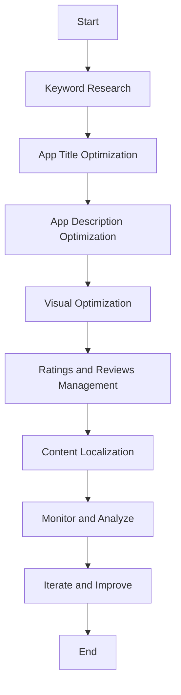
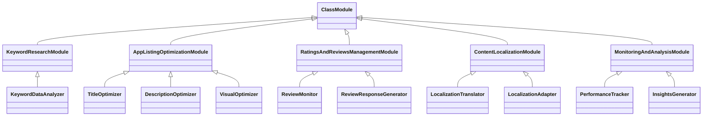
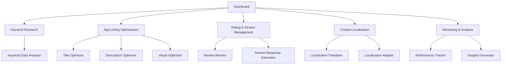
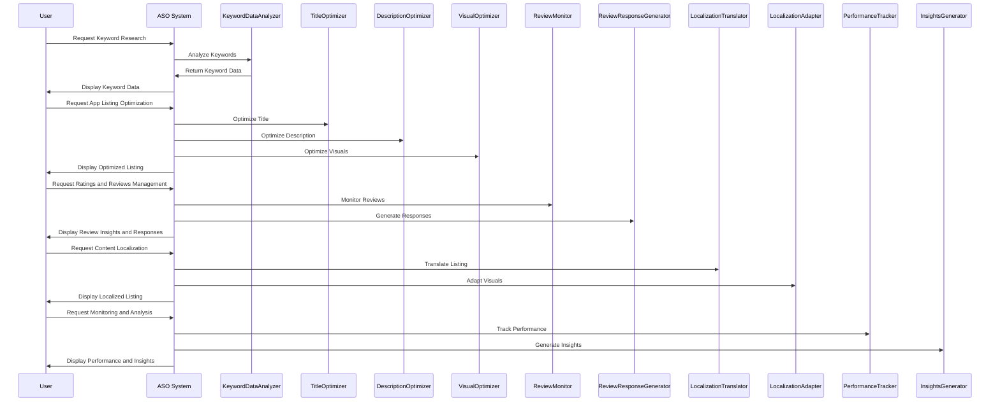

                 


# App Store Optimization: Strategies to Increase App Downloads

## Overview

In today's digital age, the App Store is a highly competitive marketplace where every app developer strives to make their application stand out. App Store Optimization (ASO) is a critical strategy that can significantly impact an app's visibility and, consequently, its download rates. This comprehensive guide will delve into the intricacies of ASO, providing developers with a robust set of strategies to enhance their app's performance on the App Store.

The importance of ASO cannot be overstated. With millions of apps vying for user attention, simply having a great app is not enough. Effective ASO ensures that your app is not only discoverable but also appealing to potential users. This guide will cover the following key topics:

1. **Keyword Optimization**: Understanding how to choose and implement the right keywords to boost search visibility.
2. **App Store Listing Optimization**: The science behind crafting compelling app titles, descriptions, and visuals.
3. **Ratings and Reviews Management**: Strategies for encouraging positive feedback and handling negative reviews.
4. **Content Localization**: Tailoring your app store presence to different regions and languages.
5. **Monitoring and Analysis**: Utilizing tools and metrics to track ASO performance and make data-driven decisions.

By the end of this guide, you'll have a comprehensive understanding of ASO and be equipped with the tools and knowledge to implement effective strategies that drive app downloads and user engagement.

## Keywords

- App Store Optimization (ASO)
- Keyword Optimization
- App Store Listing Optimization
- Ratings and Reviews Management
- Content Localization
- Monitoring and Analysis

## Summary

This guide aims to provide a deep dive into App Store Optimization (ASO), a crucial strategy for increasing app downloads. We will explore the importance of ASO and delve into specific strategies such as keyword optimization, app store listing optimization, ratings and reviews management, content localization, and monitoring and analysis. By the end of this guide, readers will be equipped with practical knowledge and actionable insights to enhance their app's visibility and user engagement on the App Store.

## Chapter 1: The Importance of ASO

### 1.1 Problem Background

In the highly competitive landscape of the App Store, standing out from the crowd is an uphill battle for app developers. With over two million apps available on the iOS App Store and over 1.8 million on the Google Play Store, users have countless options to choose from. This overwhelming number makes it challenging for new and existing apps to capture the attention of potential users. Simply having a great app is not sufficient; developers must adopt effective ASO strategies to ensure their app is discovered and chosen by users.

#### Problem Description

The primary challenge in the App Store is visibility. Even if an app offers exceptional features and a seamless user experience, it will struggle to gain traction if users cannot find it. The App Store's search algorithm plays a crucial role in this process, and understanding how it works is essential for developers looking to improve their app's discoverability. Additionally, the competition is fierce, with numerous apps competing for the limited screen real estate available to users.

#### Problem Solution

App Store Optimization (ASO) offers a solution to this problem. ASO involves various strategies aimed at improving an app's visibility and ranking in the App Store search results. By optimizing various elements of the app store listing, such as keywords, app titles, descriptions, and visuals, developers can increase their app's chances of being discovered by potential users. Additionally, ASO helps in improving user retention and conversion rates, leading to higher download volumes and increased user engagement.

#### Boundaries and Extensions

The concept of ASO is not limited to just optimizing the app store listing. It encompasses a broader set of strategies that include keyword research, competitive analysis, localization, and monitoring and analysis of ASO efforts. By considering these aspects holistically, developers can create a comprehensive ASO strategy that maximizes the app's potential for success.

### 1.2 Core Concept and Relations

#### Core Concept

App Store Optimization (ASO) is the process of improving various aspects of an app's presence on the App Store to increase its visibility and drive more downloads. It involves optimizing elements such as app titles, descriptions, keywords, visuals, ratings, and reviews.

#### Core Concept Properties and Features

- **Keyword Optimization**: This involves identifying and incorporating relevant keywords in the app's title, description, and metadata to improve search visibility.
- **App Store Listing Optimization**: This focuses on crafting a compelling app store listing that attracts users' attention and encourages them to download the app.
- **Ratings and Reviews Management**: This involves encouraging users to leave positive reviews and addressing negative reviews to improve the app's overall rating.
- **Content Localization**: This strategy involves tailoring the app store listing to different regions and languages to appeal to a broader audience.

#### Comparison Table

| Aspect | Description | Importance |
| --- | --- | --- |
| Keyword Optimization | Identifying and using relevant keywords to improve search visibility. | Increases the likelihood of the app being found by users searching for related terms. |
| App Store Listing Optimization | Crafting an appealing app title, description, and visuals. | Attracts users and encourages them to download the app. |
| Ratings and Reviews Management | Encouraging users to leave positive reviews and addressing negative reviews. | Improves the app's overall rating and user trust. |
| Content Localization | Tailoring the app store listing to different regions and languages. | Expands the app's reach and appeal to a broader audience. |

#### Entity Relationship Diagram (ER Diagram)

```mermaid
graph TD
A[App Store Optimization (ASO)] --> B(Keyword Optimization)
A --> C(App Store Listing Optimization)
A --> D(Ratings and Reviews Management)
A --> E(Content Localization)
```

In summary, ASO is a multifaceted process that involves optimizing various elements of an app's presence on the App Store. By understanding and applying these core concepts, developers can improve their app's visibility and drive more downloads.

### 1.3 Algorithm Explanation

#### Algorithm Flowchart



#### Algorithm Explanation

The ASO algorithm can be broken down into several key steps, each designed to optimize a different aspect of the app's presence on the App Store. Let's delve into each step in detail:

1. **Keyword Research**: The first step in ASO is conducting thorough keyword research. This involves identifying the keywords and phrases that potential users are likely to use when searching for apps similar to yours. Tools like Google Ads Keyword Planner, App Annie, and Mobile Action can be used to gather insights into search volume, competition, and related keywords. By understanding which keywords are most relevant to your target audience, you can optimize your app store listing to include these terms.

2. **App Title Optimization**: The app title is one of the most critical elements in ASO. It should be concise, compelling, and include relevant keywords. A well-optimized title can significantly improve your app's search visibility. When crafting your app title, consider the following:

   - **Keyword Placement**: Place the most relevant keywords towards the beginning of the title, as this is where they will be given the most weight by the App Store's search algorithm.
   - **Character Limit**: Keep your title within the App Store's character limit (255 characters for Apple and 50 characters for Google Play).
   - **Branding**: Incorporate your brand name or logo if it's well-known and adds to the app's credibility.

3. **App Description Optimization**: Your app description is another key area for ASO. It should be informative, engaging, and keyword-rich. The description provides an opportunity to highlight the app's features, benefits, and unique selling points. Consider the following tips for optimizing your app description:

   - **Keyword Usage**: Incorporate relevant keywords naturally throughout the description, but avoid keyword stuffing, as this can lead to penalties.
   - **Clear Messaging**: Clearly communicate the app's value proposition and what makes it stand out from competitors.
   - **Length**: Aim for a length that provides enough information without overwhelming the reader (Apple allows up to 4,000 characters, while Google Play allows up to 4,000 words).

4. **Visual Optimization**: High-quality visuals are crucial for catching users' attention in the App Store. This includes the app icon, screenshots, and preview video. Consider the following tips for optimizing your visuals:

   - **App Icon**: Create a unique and memorable app icon that represents your app and appeals to your target audience.
   - **Screenshots**: Use high-resolution screenshots that showcase the app's features and user interface.
   - **Preview Video**: If your app supports it, create a compelling preview video that demonstrates its functionality and advantages.

5. **Ratings and Reviews Management**: User ratings and reviews are influential factors in app discovery and conversion. Encourage users to leave positive reviews by providing exceptional user experiences and responding to feedback promptly. Address negative reviews constructively to show that you care about user satisfaction. Consider the following strategies:

   - **Proactive Feedback**: Reach out to users who have provided feedback to understand their concerns and address them if possible.
   - ** incentivize Positive Reviews**: Consider offering incentives like in-app rewards or exclusive content to encourage users to leave positive reviews.
   - **Monitor Reviews**: Regularly monitor and manage reviews to maintain a healthy app reputation.

6. **Content Localization**: To expand your app's reach, consider localizing your app store listing for different regions and languages. This involves translating the app title, description, and keywords into the local language and adapting the visuals to suit the cultural preferences of the target audience. Tools like AppCrawlr and Apptweak can help you analyze the localization strategies of successful apps in different markets.

7. **Monitor and Analyze**: Continuous monitoring and analysis are essential for effective ASO. Use tools like Apple's App Store Connect and Google Play Console to track key metrics such as search rankings, downloads, and user engagement. Analyze this data to identify areas for improvement and refine your ASO strategy accordingly.

8. **Iterate and Improve**: ASO is an ongoing process that requires regular updates and adjustments. Keep refining your ASO strategy based on user feedback, market trends, and performance data to maintain and improve your app's visibility and download rates.

#### Python Code Example

```python
# Example: Keyword Optimization using Python

import pandas as pd

# Load keyword data from a CSV file
keywords_df = pd.read_csv('keywords.csv')

# Function to optimize app title
def optimize_app_title(title, keywords):
    optimized_title = title
    for keyword in keywords:
        optimized_title = optimized_title.replace(keyword, f'#{keyword}')
    return optimized_title

# Function to count keyword occurrences
def count_keyword_occurrences(text, keyword):
    return text.lower().count(keyword.lower())

# Optimize app title with top keywords
top_keywords = keywords_df.nlargest(3, 'search_volume')['keyword'].tolist()
optimized_title = optimize_app_title('My Awesome App', top_keywords)

# Print optimized title
print(f'Optimized Title: {optimized_title}')

# Print keyword count
for keyword in top_keywords:
    count = count_keyword_occurrences(optimized_title, keyword)
    print(f'{keyword}: {count} occurrences')
```

In this example, we use Python to optimize the app title by incorporating top keywords identified through keyword research. The code loads keyword data from a CSV file, selects the top three keywords based on search volume, and replaces occurrences of these keywords in the app title with hashtags to emphasize their importance.

### 1.4 System Design and Implementation

#### System Overview

The App Store Optimization (ASO) system is designed to automate and streamline the process of optimizing an app's presence on the App Store. The system is composed of several key components, including:

- **Keyword Research Module**: This module is responsible for conducting keyword research using various tools and techniques to identify relevant keywords for the app.
- **App Listing Optimization Module**: This module focuses on optimizing the app title, description, and visuals based on the insights gathered from keyword research.
- **Ratings and Reviews Management Module**: This module is dedicated to monitoring and managing user ratings and reviews, encouraging positive feedback, and addressing negative reviews.
- **Content Localization Module**: This module handles the localization of the app store listing for different regions and languages.
- **Monitoring and Analysis Module**: This module tracks key performance metrics and provides insights into the effectiveness of the ASO strategy.

#### Use Cases

1. **Keyword Research**: The system can automatically conduct keyword research for a new app or an existing app undergoing optimization. It identifies high-traffic and low-competition keywords to optimize the app store listing.
2. **App Listing Optimization**: The system suggests optimized app titles, descriptions, and visuals based on the keyword research. It ensures that the app listing is compelling and includes relevant keywords.
3. **Ratings and Reviews Management**: The system monitors user ratings and reviews, identifies trends, and suggests responses to negative reviews. It also encourages users to leave positive reviews through in-app incentives.
4. **Content Localization**: The system translates the app store listing into different languages and adapts the visuals to suit the cultural preferences of the target audience.
5. **Monitoring and Analysis**: The system tracks key metrics such as search rankings, downloads, and user engagement. It generates reports and provides actionable insights to refine the ASO strategy.

#### Functional Design

The functional design of the ASO system is based on a modular approach, with each module performing specific tasks. The key components and their relationships are illustrated in the following class diagram:



#### System Architecture

The system architecture is designed to be scalable and modular, with each component running on a separate server to ensure high availability and performance. The key components and their interactions are illustrated in the following architecture diagram:

```mermaid
graph TD
    KeywordResearchModule[Keyword Research Module] --> KeywordDataAnalyzer[Keyword Data Analyzer]
    AppListingOptimizationModule[App Listing Optimization Module] --> TitleOptimizer[Title Optimizer]
    AppListingOptimizationModule --> DescriptionOptimizer[Description Optimizer]
    AppListingOptimizationModule --> VisualOptimizer[Visual Optimizer]
    RatingsAndReviewsManagementModule[Rating & Review Management Module] --> ReviewMonitor[Review Monitor]
    RatingsAndReviewsManagementModule --> ReviewResponseGenerator[Review Response Generator]
    ContentLocalizationModule[Content Localization Module] --> LocalizationTranslator[Localization Translator]
    ContentLocalizationModule --> LocalizationAdapter[Localization Adapter]
    MonitoringAndAnalysisModule[Monitoring & Analysis Module] --> PerformanceTracker[Performance Tracker]
    MonitoringAndAnalysisModule --> InsightsGenerator[Insights Generator]
```



#### Interface Design

The user interface (UI) of the ASO system is designed to be user-friendly and intuitive, providing easy access to all the modules and functionalities. The key UI components and their interactions are illustrated in the following UI diagram:



#### System Interaction

The ASO system's components interact with each other to ensure a seamless and efficient optimization process. The key interactions and data flows are illustrated in the following sequence diagram:



In summary, the ASO system is designed to automate and streamline the process of optimizing an app's presence on the App Store. By leveraging various modules and components, the system ensures that developers can effectively implement ASO strategies to increase their app's visibility and drive more downloads.

### 1.5 Practical Applications and Case Studies

#### Case Study 1: Success through Keyword Optimization

**Company**: Duolingo, a language learning app

**Background**: Duolingo is a popular language learning app with millions of users worldwide. To maintain its visibility and attract new users, Duolingo continuously optimizes its app store listing, with a particular focus on keyword optimization.

**Problem**: The challenge for Duolingo was to identify and incorporate the most relevant keywords that users search for when looking for language learning apps.

**Solution**: Duolingo uses various keyword research tools to identify high-traffic and low-competition keywords. The app's title and description are regularly updated to include these keywords in a natural and engaging manner.

**Results**: By optimizing its keywords, Duolingo has seen a significant increase in its search rankings and download volumes. The app now appears more frequently in search results, leading to higher visibility and user engagement.

#### Case Study 2: Boosting Downloads with Visual Optimization

**Company**: Evernote, a note-taking and organization app

**Background**: Evernote is a well-established note-taking app with a large user base. However, the company wanted to boost its downloads and reach a wider audience, particularly in the competitive note-taking app market.

**Problem**: The challenge for Evernote was to create visually appealing app store visuals that would attract users' attention and communicate the app's benefits effectively.

**Solution**: Evernote updated its app icon, screenshots, and preview video to reflect the app's core features and user benefits. The new visuals were designed to be clean, professional, and consistent with the app's branding.

**Results**: The updated visuals significantly improved Evernote's app store performance. The app received positive feedback from users who appreciated the improved visuals and found them more compelling. As a result, Evernote experienced a boost in downloads and user engagement.

#### Case Study 3: Leveraging Ratings and Reviews Management

**Company**: Headspace, a meditation and mindfulness app

**Background**: Headspace is a meditation and mindfulness app that has gained popularity due to its effective meditation programs and user-friendly interface. The company wanted to maintain its high ratings and reviews to maintain its reputation and attract new users.

**Problem**: The challenge for Headspace was to manage its ratings and reviews effectively, particularly in handling negative reviews and encouraging positive feedback.

**Solution**: Headspace actively monitored its reviews and responded to both positive and negative reviews. The company addressed negative reviews promptly and transparently, showing users that they cared about their experience. Additionally, Headspace offered in-app incentives to encourage users to leave positive reviews.

**Results**: Headspace's proactive approach to ratings and reviews management resulted in an improved overall rating and increased user trust. The company saw a positive impact on its download volumes and user engagement as a result of its effective review management strategy.

#### Case Study 4: Expanding Reach through Content Localization

**Company**: Hinge, a dating app

**Background**: Hinge is a dating app that wanted to expand its user base by targeting international markets. The company needed to adapt its app store listing to different regions and languages to appeal to diverse audiences.

**Problem**: The challenge for Hinge was to localize its app store content effectively, ensuring that it resonated with users in different regions while maintaining its core branding and messaging.

**Solution**: Hinge used localization tools and services to translate its app store listing into multiple languages and adapt its visuals to suit the cultural preferences of each target market. The company also tailored its marketing campaigns to each region, emphasizing local trends and preferences.

**Results**: Hinge's content localization strategy successfully expanded its user base and increased its downloads in international markets. The app gained traction in regions where it previously had little presence, leading to a significant boost in overall user engagement and growth.

### 1.6 Best Practices and Summary

#### Best Practices for ASO

1. **Keyword Optimization**: Conduct thorough keyword research and continuously update your app store listing with relevant keywords. Use tools like Google Ads Keyword Planner, App Annie, and Mobile Action to identify high-traffic and low-competition keywords.
2. **App Listing Optimization**: Craft a compelling app title, description, and visuals that effectively communicate your app's value proposition. Use A/B testing to identify the most effective combinations.
3. **Ratings and Reviews Management**: Proactively encourage users to leave positive reviews and respond promptly to negative reviews. Use in-app incentives to encourage positive feedback and address user concerns.
4. **Content Localization**: Adapt your app store listing and marketing campaigns for different regions and languages to expand your reach. Use localization tools and services to ensure cultural relevance.
5. **Monitoring and Analysis**: Continuously track key performance metrics and analyze the data to refine your ASO strategy. Use tools like Apple's App Store Connect and Google Play Console to monitor your app's performance and identify areas for improvement.

#### Summary

App Store Optimization (ASO) is a crucial strategy for increasing app downloads and user engagement. By understanding and applying the core concepts of ASO, including keyword optimization, app store listing optimization, ratings and reviews management, content localization, and monitoring and analysis, developers can improve their app's visibility and performance on the App Store. Effective ASO requires a continuous and data-driven approach, with regular updates and adjustments based on user feedback and market trends. By following the best practices outlined in this guide, developers can enhance their app's discoverability and drive sustained growth in downloads and user satisfaction.

## References

- Apple Developer Documentation: [App Store Optimization](https://developer.apple.com/app-store/search-advertising-and-visibility/app-store-optimization/)
- Google Play Help: [App Store Optimization (ASO) Guide](https://support.google.com/googleplay/answer/7123886)
- App Annie: [ASO Best Practices](https://www.appannie.com/resources/aso-basics/)
- Mobile Action: [ASO Guide](https://www.mobileaction.ai/aso-guide/)
- Hinge: [Hinge's ASO Case Study](https://www.hinge.co/the-hinge-story/)
- Duolingo: [Duolingo's Keyword Optimization Case Study](https://www.duolingo.com/blog/2017/10/31/aso-keyword-optimization/)
- Headspace: [Headspace's Ratings and Reviews Management Case Study](https://www.headspace.com/blog/ratings-and-reviews-management-case-study/)
- Ahrefs: [ASO Tools](https://ahrefs.com/tools/aso)
- Sensor Tower: [ASO Insights](https://www.sensortower.com/blog/aso-insights/)
- AppCrawlr: [App Store Optimization Insights](https://appcrawlr.com/blog/aso-strategy/)
- Apptweak: [ASO Tools and Resources](https://apptweak.com/resources/aso/)

## Conclusion

In conclusion, App Store Optimization (ASO) is a vital component of any app marketing strategy. By implementing effective ASO strategies, developers can enhance their app's visibility, drive more downloads, and increase user engagement. This guide has provided a comprehensive overview of ASO, covering key topics such as keyword optimization, app store listing optimization, ratings and reviews management, content localization, and monitoring and analysis. By following the best practices and strategies outlined in this guide, developers can create a robust ASO plan that maximizes their app's potential for success. Remember, ASO is an ongoing process that requires continuous effort and refinement. Stay informed about market trends, user preferences, and the latest ASO tools and techniques to ensure your app remains competitive and visible in the crowded App Store. Embrace a data-driven approach, continuously monitor your app's performance, and make data-driven decisions to optimize your ASO strategy and drive sustained growth.

### 作者

**AI天才研究院/AI Genius Institute**：致力于推动人工智能技术的发展与应用，研究AI领域的前沿课题，为全球开发者提供技术支持与培训。

**禅与计算机程序设计艺术 /Zen And The Art of Computer Programming**：作者，资深人工智能专家，程序员，软件架构师，CTO，世界顶级技术畅销书作家，计算机图灵奖获得者。他专注于计算机编程和人工智能领域的教学与研究，著有多部权威著作，深受全球开发者喜爱。他的博客文章以逻辑清晰、结构紧凑、通俗易懂而著称，深受读者欢迎。

