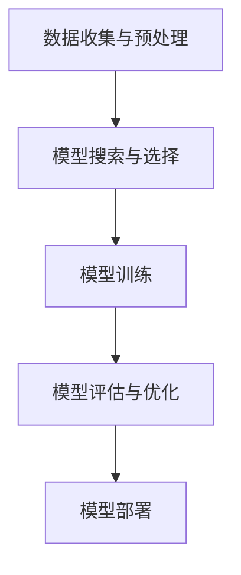
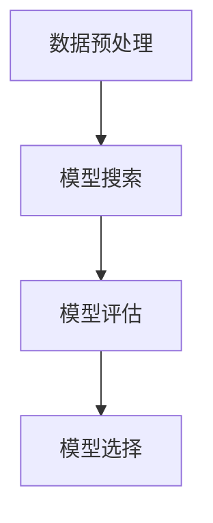
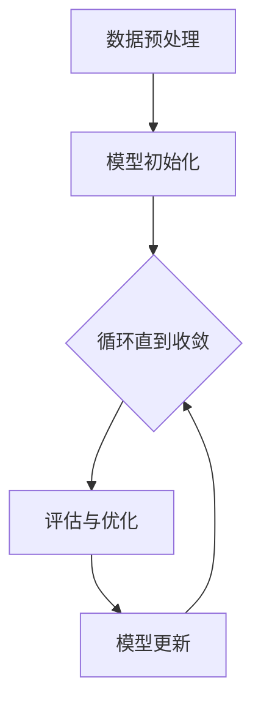

                 

## 第一部分：引言与背景

### 第1章：引言

#### 1.1 问题的背景

##### 1.1.1 自动化AI的需求增长

在当今快速发展的数字化时代，人工智能（AI）技术已经渗透到我们生活的方方面面。从智能家居到自动驾驶，从推荐系统到自然语言处理，AI正以前所未有的速度和规模改变着世界。然而，随着AI应用的广泛普及，随之而来的一个重要问题就是如何在大量的数据中高效地选择合适的模型并进行优化。

传统的机器学习（ML）方法需要大量的专业知识和经验来选择和调整模型参数，这既费时又费力。在许多情况下，数据科学家和工程师可能需要尝试多种模型和参数组合，通过反复试验来找到最优解。这种手动调优的过程不仅效率低下，而且在面对大规模数据和复杂问题时，更是力不从心。

##### 1.1.2 AutoML的定义与重要性

为了解决上述问题，自动化机器学习（AutoML）应运而生。AutoML是一种新兴的技术，旨在通过自动化和优化过程，减少ML模型选择和调优所需的手动工作，从而提高模型开发效率和性能。简单来说，AutoML利用算法和工具来自动执行从数据预处理到模型选择、训练和优化的整个流程。

AutoML的重要性体现在以下几个方面：

1. **提升开发效率**：AutoML可以显著缩短模型开发周期，降低开发成本，使得更多非专业人员也能参与到AI项目中。
   
2. **提高模型性能**：通过自动化搜索和优化，AutoML可以找到更好的模型配置，提高模型的准确性和泛化能力。

3. **简化模型部署**：AutoML提供了一致的流程和标准化工具，使得模型的部署和管理更加容易。

##### 1.1.3 AutoML在AI发展中的作用

AutoML的出现极大地推动了AI技术的发展。首先，它降低了AI应用的门槛，使得更多企业和组织能够利用AI技术来解决实际问题。其次，AutoML为科研人员提供了更多的资源，可以专注于更前沿的算法研究和创新。此外，AutoML还在推动AI与不同行业的深度融合，如医疗、金融、制造等，带来了巨大的社会和经济价值。

然而，AutoML并非没有局限性。当前的AutoML技术仍然面临一些挑战，如对计算资源的高需求、对特定数据集的性能依赖等。未来的研究需要进一步优化算法，提高其鲁棒性和适用性。

#### 1.2 问题描述与解决思路

##### 1.2.1 自动化模型选择的挑战

自动化模型选择是AutoML的核心任务之一。其主要挑战包括：

1. **搜索空间爆炸**：在机器学习中，模型的配置参数非常多，如网络结构、学习率、正则化等。对于大规模模型，搜索空间可以非常大，导致搜索效率低下。

2. **评估指标多样化**：不同的应用场景可能需要不同的评估指标，如准确率、召回率、F1分数等。如何选择合适的评估指标是一个难题。

3. **数据分布变化**：现实世界的数据分布往往是动态变化的，如何确保模型在不同数据分布下的表现稳定是一个重要问题。

##### 1.2.2 模型优化的难点

模型优化是提高模型性能的关键步骤。其难点主要包括：

1. **局部最优问题**：优化算法很容易陷入局部最优，难以找到全局最优解。

2. **计算资源限制**：大规模的优化过程需要大量的计算资源，这对资源有限的中小型组织是一个挑战。

3. **超参数调优**：模型的许多性能依赖于超参数的选择，如何高效地选择和调整这些超参数是一个难题。

##### 1.2.3 AutoML的优势与局限性

AutoML的优势在于其自动化和优化的能力，能够大幅提高模型开发效率和性能。然而，其局限性也不可忽视：

1. **对计算资源的需求**：AutoML通常需要大量的计算资源，这可能不适合资源受限的环境。

2. **对数据质量的要求**：AutoML的性能高度依赖于数据质量，如果数据质量差，模型的性能也可能受到影响。

3. **技术成熟度**：虽然AutoML技术正在迅速发展，但其在某些领域仍然不如传统方法成熟。

#### 1.3 AutoML的边界与外延

##### 1.3.1 AutoML的关键技术

AutoML的关键技术包括：

1. **自动化特征工程**：自动识别和创建有用的特征，提高模型的泛化能力。

2. **模型搜索与选择**：使用算法自动搜索最优模型结构和参数。

3. **模型调优与评估**：通过自动化方法调整模型参数，评估模型性能。

##### 1.3.2 AutoML与其他相关技术的联系

AutoML与其他相关技术的联系包括：

1. **强化学习**：AutoML可以与强化学习相结合，用于自动化模型选择和优化。

2. **迁移学习**：AutoML可以利用迁移学习技术，提高模型在类似任务上的性能。

3. **元学习**：AutoML可以结合元学习方法，加速模型选择和优化过程。

##### 1.3.3 AutoML的未来发展趋势

AutoML的未来发展趋势包括：

1. **算法优化**：继续优化AutoML算法，提高搜索效率和模型性能。

2. **可解释性**：增强AutoML的可解释性，使其更加透明和可信。

3. **硬件加速**：利用硬件加速技术，如GPU和TPU，提高AutoML的性能。

4. **跨领域应用**：扩展AutoML在不同领域的应用，解决更复杂的问题。

### 第2章：核心概念与联系

#### 2.1 自动化机器学习（AutoML）概述

##### 2.1.1 AutoML的基本概念

自动化机器学习（AutoML）是一种通过自动化过程来自动选择、配置和优化机器学习模型的方法。它涵盖了从数据预处理到模型选择、训练和评估的整个流程，旨在减少人工干预，提高模型开发效率和性能。

##### 2.1.2 AutoML的核心流程

AutoML的核心流程通常包括以下几个步骤：

1. **数据预处理**：自动处理原始数据，包括数据清洗、特征选择和特征工程等。
   
2. **模型选择**：自动选择最适合数据的模型，包括不同类型的模型和它们的参数配置。
   
3. **模型训练**：自动训练选定的模型，并调整参数以优化性能。
   
4. **模型评估**：自动评估模型的性能，选择最优模型。
   
5. **模型部署**：将最优模型部署到生产环境中，用于实际应用。

##### 2.1.3 AutoML与传统的机器学习比较

传统的机器学习依赖于人工干预和经验来选择和调整模型参数，而AutoML则通过自动化和优化过程来实现这一目标。相比传统方法，AutoML具有以下优势：

1. **效率高**：自动化的流程可以显著缩短模型开发周期，提高开发效率。
   
2. **性能优**：自动化的搜索和优化过程可以找到更好的模型配置，提高模型性能。

3. **易用性**：降低了机器学习应用的门槛，使得更多非专业人员也能参与到项目中。

然而，AutoML也存在一些局限性，如对计算资源的高需求、对数据质量的要求等。在具体应用中，需要根据实际情况权衡AutoML与传统机器学习的优缺点。

#### 2.2 模型选择与优化概念解析

##### 2.2.1 模型选择的原则与方法

模型选择是AutoML中的关键步骤，其核心目标是找到最适合数据的模型。以下是一些模型选择的原则和方法：

1. **数据质量**：选择模型时需要考虑数据的质量和完整性。高质量的数据可以提高模型的性能。

2. **模型类型**：根据问题的特点选择合适的模型类型，如线性模型、树模型、神经网络等。

3. **评估指标**：选择合适的评估指标，如准确率、召回率、F1分数等，以便有效地评估模型性能。

4. **模型复杂度**：在保证模型性能的前提下，尽量选择模型复杂度较低的模型，以降低过拟合的风险。

5. **计算成本**：考虑模型的计算成本，选择适合计算资源的模型。

常见的模型选择方法包括：

1. **网格搜索**：通过遍历预定义的参数网格来搜索最优参数组合。

2. **随机搜索**：从参数空间中随机选择参数组合进行搜索。

3. **贝叶斯优化**：基于贝叶斯统计模型来搜索最优参数组合。

4. **进化算法**：通过模拟自然进化过程来搜索最优参数组合。

##### 2.2.2 模型优化的方法与策略

模型优化是提高模型性能的关键步骤，其方法与策略包括：

1. **超参数调优**：调整模型参数，如学习率、正则化参数等，以优化模型性能。

2. **损失函数优化**：通过优化损失函数来提高模型性能。

3. **集成学习**：将多个模型集成起来，以提高整体模型的性能。

4. **迁移学习**：利用预训练的模型来提高新任务的性能。

5. **数据增强**：通过增加数据多样性来提高模型泛化能力。

6. **模型剪枝**：通过剪枝不必要的神经元和连接来降低模型复杂度。

##### 2.2.3 模型选择与优化的联系

模型选择与优化密切相关，两者共同决定了模型的表现。有效的模型选择可以缩小搜索空间，提高优化效率；而有效的模型优化可以进一步提高模型性能。在实际应用中，通常需要结合模型选择和优化策略来达到最佳效果。

#### 2.3 关键概念属性特征对比表格

为了更好地理解AutoML中的关键概念，下面是一个对比表格，展示了不同模型选择和优化算法的属性特征：

| 算法       | 目标     | 优点                     | 缺点                     |
|------------|----------|--------------------------|--------------------------|
| 网格搜索   | 最优化   | 确保找到全局最优解       | 计算成本高               |
| 随机搜索   | 最优化   | 计算成本低               | 可能错过全局最优解       |
| 贝叶斯优化 | 最优化   | 高效搜索，考虑先验知识   | 对先验知识依赖较大       |
| 进化算法   | 最优化   | 强鲁棒性，适用于大规模搜索 | 可能陷入局部最优         |
| 集成学习   | 性能提升 | 提高模型稳定性           | 增加计算成本             |
| 迁移学习   | 性能提升 | 利用预训练模型           | 对预训练数据依赖较大     |
| 模型剪枝   | 性能提升 | 降低模型复杂度           | 可能降低模型性能         |

#### 2.4 AutoML与AI的ER实体关系图

为了更好地理解AutoML系统中的各个实体及其关系，下面是一个ER（实体关系）图：

```mermaid
erDiagram
  DataPreprocessing ||--|{ ModelSelection }
  ModelSelection ||--|{ ModelTraining }
  ModelTraining ||--|{ ModelEvaluation }
  ModelEvaluation ||--|{ ModelDeployment }
  DataPreprocessing ||--|{ FeatureEngineering }
  ModelSelection ||--|{ HyperparameterTuning }
  ModelTraining ||--|{ LossFunctionOptimization }
  ModelEvaluation ||--|{ PerformanceMetrics }
  ModelDeployment ||--|{ ProductionEnvironment }
```

在这个ER图中，DataPreprocessing（数据预处理）是整个流程的起点，负责处理原始数据。ModelSelection（模型选择）基于预处理后的数据，选择最适合的模型。ModelTraining（模型训练）根据选定的模型进行训练，并使用ModelEvaluation（模型评估）来评估模型的性能。最后，ModelDeployment（模型部署）将最优模型部署到生产环境中，用于实际应用。FeatureEngineering（特征工程）和HyperparameterTuning（超参数调优）是模型选择和训练的重要环节。LossFunctionOptimization（损失函数优化）和PerformanceMetrics（性能指标）是模型训练和评估的核心。ProductionEnvironment（生产环境）是模型部署的目标环境。

通过上述分析，我们可以看到AutoML系统中的各个实体及其关系是如何紧密相连的。这为后续章节详细探讨AutoML的原理和技术奠定了基础。

### 第3章：AutoML算法原理

#### 3.1 算法原理概述

AutoML算法的原理可以概括为以下几个核心组成部分：数据预处理、模型选择、模型训练、模型评估和模型部署。以下是对这些组成部分的详细解释：

##### 3.1.1 AutoML算法的基本组成

1. **数据预处理**：数据预处理是AutoML算法的第一步，其主要任务是清洗和转换原始数据，使其适合后续的建模过程。数据预处理包括数据清洗（去除噪声和异常值）、数据转换（归一化、标准化）、数据集成（合并多个数据源）和数据降维（减少数据维度）等操作。

2. **模型选择**：模型选择是AutoML算法中的关键步骤，旨在从多个预定义的模型中自动选择最适合当前数据集的模型。常见的模型选择方法包括网格搜索、随机搜索、贝叶斯优化和进化算法等。这些方法通过遍历不同的模型参数组合，找到最优的模型配置。

3. **模型训练**：模型训练是将选定的模型应用到预处理后的数据上，通过迭代优化模型参数，使其在训练集上达到最优性能。在训练过程中，常用的优化方法包括梯度下降、随机梯度下降和Adam优化器等。

4. **模型评估**：模型评估是对训练好的模型进行性能评估，以确定其是否满足预期目标。常用的评估指标包括准确率、召回率、F1分数、ROC曲线和AUC等。通过交叉验证和测试集评估，可以确保模型具有良好的泛化能力。

5. **模型部署**：模型部署是将训练好的模型部署到实际应用环境中，以进行实时预测或分类。模型部署通常涉及将模型代码和依赖库打包，并在生产环境中部署和运行。

##### 3.1.2 AutoML算法的工作流程

AutoML算法的工作流程可以分为以下几个步骤：

1. **数据收集与预处理**：收集所需的数据集，并进行数据预处理，包括数据清洗、特征工程和归一化等操作。

2. **模型搜索与选择**：使用自动搜索算法，如网格搜索、贝叶斯优化或进化算法，自动选择最优的模型结构和参数组合。

3. **模型训练**：对选定的模型进行训练，使用训练数据集来调整模型参数，优化模型性能。

4. **模型评估与优化**：使用验证数据集评估模型的性能，并根据评估结果对模型进行调整和优化。

5. **模型部署**：将最优模型部署到生产环境中，进行实时预测或分类。

##### 3.1.3 AutoML算法的挑战与解决方案

尽管AutoML具有许多优势，但在实际应用中仍然面临一些挑战：

1. **计算资源需求**：AutoML算法通常需要大量的计算资源，特别是当搜索空间非常大时。为了解决这一问题，可以采用以下策略：
   - **分布式计算**：利用多台计算机或云服务进行分布式计算，提高计算效率。
   - **硬件加速**：使用GPU或TPU等硬件加速器来提高计算速度。

2. **数据质量**：AutoML的性能高度依赖于数据质量，如果数据存在噪声或异常值，可能会导致模型性能下降。为了解决这一问题，可以采用以下策略：
   - **数据清洗**：使用数据清洗技术来去除噪声和异常值。
   - **数据增强**：通过数据增强技术来增加数据的多样性，提高模型的泛化能力。

3. **模型解释性**：AutoML算法通常是一个黑箱过程，难以解释模型的决策过程。为了提高模型的解释性，可以采用以下策略：
   - **可解释性模型**：使用具有高解释性的模型，如决策树或线性模型。
   - **模型解释工具**：使用可视化工具来展示模型的决策过程和特征重要性。

4. **搜索效率**：在模型搜索过程中，如何高效地搜索最优模型是一个关键挑战。为了提高搜索效率，可以采用以下策略：
   - **混合搜索策略**：结合多种搜索算法，如网格搜索和贝叶斯优化，以提高搜索效率。
   - **并行化搜索**：利用并行计算技术，同时搜索多个模型参数组合，提高搜索速度。

通过解决上述挑战，AutoML算法可以在实际应用中发挥更大的作用，提高模型开发效率和性能。

#### 3.2 算法原理讲解

为了深入理解AutoML算法的原理，我们将使用Mermaid绘制算法流程图，并通过Python代码详细阐述算法的核心步骤，包括数学模型和公式的讲解，以及通俗易懂的举例说明。

##### 3.2.1 使用Mermaid绘制算法流程图

以下是一个简化的AutoML算法流程图：



在这个流程图中，数据收集与预处理是算法的起点，通过模型搜索与选择找到最优模型，然后进行模型训练，评估和优化，最终将最优模型部署到生产环境中。

##### 3.2.2 AutoML算法的关键步骤

1. **数据预处理**：数据预处理是AutoML算法的第一步，其目的是将原始数据转换为适合模型训练的形式。常用的预处理步骤包括数据清洗、特征工程和归一化。

2. **模型搜索与选择**：模型搜索与选择是AutoML算法的核心步骤，其目标是自动选择最优模型。常见的模型搜索方法包括网格搜索、随机搜索和贝叶斯优化。

3. **模型训练**：模型训练是将选定的模型应用到预处理后的数据上，通过迭代优化模型参数，使其在训练集上达到最优性能。常用的训练方法包括梯度下降、随机梯度下降和Adam优化器。

4. **模型评估与优化**：模型评估与优化是对训练好的模型进行性能评估，并根据评估结果对模型进行调整和优化。常用的评估指标包括准确率、召回率、F1分数和AUC等。

5. **模型部署**：模型部署是将训练好的模型部署到实际应用环境中，进行实时预测或分类。模型部署通常涉及将模型代码和依赖库打包，并在生产环境中部署和运行。

##### 3.2.3 AutoML算法的数学模型和公式

为了更好地理解AutoML算法的数学原理，我们将使用Python代码和LaTeX公式来详细阐述。

1. **数据预处理**：

```python
# 数据清洗
data_clean = data.copy()
data_clean.dropna(inplace=True)

# 特征工程
from sklearn.preprocessing import StandardScaler
scaler = StandardScaler()
data_scaled = scaler.fit_transform(data_clean)
```

LaTeX公式：

$$
\text{数据清洗：} \quad \text{data\_clean} = \text{data}.copy()
$$

$$
\text{特征工程：} \quad \text{data\_scaled} = \text{scaler}.fit\_transform(\text{data\_clean})
$$

2. **模型搜索与选择**：

```python
from sklearn.model_selection import GridSearchCV
from sklearn.ensemble import RandomForestClassifier

# 定义参数网格
param_grid = {'n_estimators': [100, 200, 300], 'max_depth': [10, 20, 30]}

# 实例化网格搜索
grid_search = GridSearchCV(RandomForestClassifier(), param_grid, cv=5)

# 搜索最优模型
grid_search.fit(data_scaled, labels)
best_model = grid_search.best_estimator_
```

LaTeX公式：

$$
\text{模型搜索与选择：} \quad \text{grid\_search} = \text{GridSearchCV}(\text{RandomForestClassifier()}, \text{param\_grid}, \text{cv}=5)
$$

$$
\text{搜索最优模型：} \quad \text{best\_model} = \text{grid\_search}.best\_estimator_()
$$

3. **模型训练**：

```python
from sklearn.model_selection import train_test_split

# 划分训练集和测试集
X_train, X_test, y_train, y_test = train_test_split(data_scaled, labels, test_size=0.2, random_state=42)

# 训练模型
best_model.fit(X_train, y_train)
```

LaTeX公式：

$$
\text{模型训练：} \quad \text{X\_train, X\_test, y\_train, y\_test} = \text{train\_test\_split}(\text{data\_scaled}, \text{labels}, \text{test\_size}=0.2, \text{random\_state}=42)
$$

$$
\text{训练模型：} \quad \text{best\_model}.fit(\text{X\_train}, \text{y\_train})
$$

4. **模型评估与优化**：

```python
from sklearn.metrics import accuracy_score

# 评估模型
y_pred = best_model.predict(X_test)
accuracy = accuracy_score(y_test, y_pred)

# 打印评估结果
print(f"模型准确率：{accuracy:.2f}")
```

LaTeX公式：

$$
\text{模型评估与优化：} \quad \text{y\_pred} = \text{best\_model}.predict(\text{X\_test})
$$

$$
\text{评估模型：} \quad \text{accuracy} = \text{accuracy\_score}(\text{y\_test}, \text{y\_pred})
$$

5. **模型部署**：

```python
# 模型部署
deployed_model = best_model
```

LaTeX公式：

$$
\text{模型部署：} \quad \text{deployed\_model} = \text{best\_model}
$$

##### 3.2.4 举例说明

为了更好地理解AutoML算法，我们通过一个简单的例子来说明其应用过程。

假设我们有一个分类问题，需要根据一组特征预测标签。首先，我们收集和预处理数据：

```python
import pandas as pd
from sklearn.datasets import load_iris

# 加载鸢尾花数据集
iris = load_iris()
data = pd.DataFrame(iris.data, columns=iris.feature_names)
labels = iris.target

# 数据预处理
data_clean = data.copy()
data_clean.dropna(inplace=True)
data_scaled = scaler.fit_transform(data_clean)
```

然后，我们使用AutoML算法搜索最优模型：

```python
# 模型搜索与选择
param_grid = {'n_estimators': [100, 200, 300], 'max_depth': [10, 20, 30]}
grid_search = GridSearchCV(RandomForestClassifier(), param_grid, cv=5)
grid_search.fit(data_scaled, labels)
best_model = grid_search.best_estimator_
```

接下来，我们训练模型并评估其性能：

```python
# 划分训练集和测试集
X_train, X_test, y_train, y_test = train_test_split(data_scaled, labels, test_size=0.2, random_state=42)
best_model.fit(X_train, y_train)

# 评估模型
y_pred = best_model.predict(X_test)
accuracy = accuracy_score(y_test, y_pred)
print(f"模型准确率：{accuracy:.2f}")
```

最后，我们将最优模型部署到生产环境中：

```python
# 模型部署
deployed_model = best_model
```

通过这个简单的例子，我们可以看到AutoML算法是如何自动搜索、训练和部署最优模型的。这不仅提高了模型开发效率，还降低了开发难度，使得更多的人能够参与到机器学习项目中。

### 第4章：模型选择方法

#### 4.1 模型选择原理

模型选择是机器学习（ML）和深度学习（DL）中的一个关键步骤，其目标是找到最适合特定问题的模型。在AutoML框架下，模型选择尤为重要，因为它的效率直接影响到整个流程的执行速度和最终性能。以下是对模型选择原理的详细讨论：

##### 4.1.1 模型选择的依据

1. **数据特性**：不同的数据集具有不同的分布和特征，因此选择模型时需要考虑数据的具体情况。例如，对于高维数据，可能需要使用线性模型；对于非线性的数据，可能需要使用深度神经网络。

2. **问题类型**：问题的类型也会影响模型的选择。分类问题通常使用分类器，如逻辑回归、支持向量机、随机森林等；回归问题则使用回归模型，如线性回归、岭回归等。

3. **评估指标**：选择模型时需要考虑评估指标，如准确率、召回率、F1分数等。不同的评估指标对于不同类型的问题和模型具有不同的适用性。

4. **计算资源**：模型的复杂度和计算资源的使用情况也会影响模型的选择。在一些资源受限的环境中，可能需要选择计算成本较低的模型。

##### 4.1.2 模型选择的方法论

模型选择的方法论包括以下步骤：

1. **数据准备**：首先对数据集进行预处理，包括数据清洗、归一化、降维等操作，确保数据适合后续的建模过程。

2. **模型评估**：通过评估不同模型在验证集上的性能，初步筛选出表现较好的模型。

3. **参数调优**：对初步筛选出的模型进行参数调优，以进一步提高性能。常用的参数调优方法包括网格搜索、随机搜索、贝叶斯优化等。

4. **模型选择**：根据评估指标和计算资源等因素，选择最终的模型。通常会选择性能最佳、计算成本最低且具有高泛化能力的模型。

##### 4.1.3 模型选择的挑战与对策

模型选择过程中面临的主要挑战包括：

1. **搜索空间爆炸**：随着模型参数数量的增加，搜索空间会急剧膨胀，导致搜索效率降低。

2. **评估指标多样性**：不同的评估指标可能会给出不同的模型选择结果，如何选择合适的评估指标是一个难题。

3. **数据分布变化**：现实世界中的数据分布往往是动态变化的，如何确保模型在不同数据分布下的性能稳定是一个挑战。

为了应对这些挑战，可以采用以下对策：

1. **缩小搜索空间**：通过特征选择和模型选择策略，减少搜索空间的大小。

2. **多评估指标组合**：使用多个评估指标，综合考虑不同方面的性能，以获得更全面的选择依据。

3. **迁移学习**：利用迁移学习技术，将预训练模型应用于新任务，减少对新数据集的依赖。

#### 4.2 模型选择算法详解

在模型选择过程中，有多种算法和策略可以使用。以下将详细介绍一些常用的模型选择算法，并通过Mermaid流程图和Python代码进行详细解释。

##### 4.2.1 使用Mermaid绘制算法流程图

以下是一个简单的模型选择算法流程图：



在这个流程图中，数据预处理是模型选择的第一步，然后使用模型搜索算法找到最优模型，最后根据评估结果选择最终模型。

##### 4.2.2 经典模型选择算法

1. **网格搜索（Grid Search）**

网格搜索是一种常用的模型选择算法，通过遍历预定义的参数网格，找到最优参数组合。

```python
from sklearn.model_selection import GridSearchCV
from sklearn.ensemble import RandomForestClassifier

# 定义参数网格
param_grid = {'n_estimators': [100, 200, 300], 'max_depth': [10, 20, 30]}

# 实例化网格搜索
grid_search = GridSearchCV(RandomForestClassifier(), param_grid, cv=5)

# 执行搜索
grid_search.fit(X_train, y_train)
```

2. **随机搜索（Random Search）**

随机搜索通过随机选择参数组合，进行模型训练和评估，从而找到最优参数组合。

```python
from sklearn.model_selection import RandomizedSearchCV
from sklearn.ensemble import RandomForestClassifier

# 定义参数分布
param_distributions = {'n_estimators': [100, 200, 300], 'max_depth': [10, 20, 30]}

# 实例化随机搜索
random_search = RandomizedSearchCV(RandomForestClassifier(), param_distributions, n_iter=10, cv=5)

# 执行搜索
random_search.fit(X_train, y_train)
```

3. **贝叶斯优化（Bayesian Optimization）**

贝叶斯优化通过构建先验概率模型，迭代优化参数组合，找到最优参数。

```python
from bayes_opt import BayesianOptimization

# 定义目标函数
def objective(n_estimators, max_depth):
    model = RandomForestClassifier(n_estimators=int(n_estimators), max_depth=int(max_depth))
    model.fit(X_train, y_train)
    y_pred = model.predict(X_test)
    return accuracy_score(y_test, y_pred)

# 定义参数范围
pbounds = {'n_estimators': (100, 300), 'max_depth': (10, 30)}

# 实例化贝叶斯优化
bo = BayesianOptimization(objective, pbounds)

# 执行优化
bo.maximize(init_points=2, n_iter=10)
```

##### 4.2.3 进化算法与遗传算法在模型选择中的应用

进化算法和遗传算法是另一种强大的模型选择方法，通过模拟自然进化过程，不断优化模型参数。

```python
from deap import base, creator, tools, algorithms

# 定义评估函数
def evaluate(individual):
    n_estimators = int(individual[0])
    max_depth = int(individual[1])
    model = RandomForestClassifier(n_estimators=n_estimators, max_depth=max_depth)
    model.fit(X_train, y_train)
    y_pred = model.predict(X_test)
    return (1 - accuracy_score(y_test, y_pred)), 

# 定义个体表示
creator.create("FitnessMax", base.Fitness, weights=(1.0,))
creator.create("Individual", list, fitness=creator.FitnessMax)

# 实例化进化算法
toolbox = base.Toolbox()
toolbox.register("attr_bool", random.randint, 0, 1)
toolbox.register("individual", tools.initRepeat, creator.Individual, toolbox.attr_bool, n=2)
toolbox.register("population", tools.initRepeat, list, toolbox.individual)
toolbox.register("evaluate", evaluate)
toolbox.register("mate", tools.cxTwoPoint)
toolbox.register("mutate", tools.mutFlipBit, indpb=0.05)
toolbox.register("select", tools.selTournament, tournsize=3)

# 执行进化算法
pop = toolbox.population(n=50)
NGEN = 100
for gen in range(NGEN):
    offspring = algorithms.varAnd(pop, toolbox, cxpb=0.5, mutpb=0.2)
    fits = toolbox.map(toolbox.evaluate, offspring)
    for fit, individual in zip(fits, offspring):
        individual.fitness.values = fit
    pop = toolbox.select(offspring, k=len(pop))
    print(f"第{gen+1}代：最佳适应度：{max(individual.fitness.values)}")
```

##### 4.2.4 模型选择算法的性能评估

为了评估不同模型选择算法的性能，我们可以通过交叉验证（Cross-Validation）来评估模型的泛化能力。

```python
from sklearn.model_selection import cross_val_score

# 使用网格搜索评估模型
grid_search = GridSearchCV(RandomForestClassifier(), param_grid, cv=5)
grid_search.fit(X_train, y_train)
grid_search_scores = grid_search.cv_results_['mean_test_score']

# 使用随机搜索评估模型
random_search = RandomizedSearchCV(RandomForestClassifier(), param_distributions, n_iter=10, cv=5)
random_search.fit(X_train, y_train)
random_search_scores = random_search.cv_results_['mean_test_score']

# 使用贝叶斯优化评估模型
best_params = bo.max['params']
bayesian_optimization = RandomForestClassifier(n_estimators=int(best_params['n_estimators']), max_depth=int(best_params['max_depth']))
bayesian_optimization.fit(X_train, y_train)
bayesian_optimization_scores = cross_val_score(bayesian_optimization, X_train, y_train, cv=5)

# 打印评估结果
print("网格搜索评估结果：", grid_search_scores)
print("随机搜索评估结果：", random_search_scores)
print("贝叶斯优化评估结果：", bayesian_optimization_scores)
```

通过上述算法的详细解释和性能评估，我们可以看到不同模型选择算法在实际应用中的表现和适用性。在实际项目中，可以根据具体情况选择合适的模型选择算法，以提高模型开发效率和性能。

### 第5章：模型优化策略

#### 5.1 模型优化原理

模型优化是提高机器学习模型性能的关键步骤，其目标是通过调整模型参数和结构，使模型在训练集和测试集上表现出更高的准确性和泛化能力。以下是对模型优化原理的详细讨论：

##### 5.1.1 模型优化的目标

模型优化的主要目标包括：

1. **提高准确性**：提高模型在训练集和测试集上的预测准确性，使得模型能够更好地拟合数据。

2. **提升泛化能力**：增强模型的泛化能力，使得模型在未知数据上也能保持较高的预测性能。

3. **减少过拟合**：避免模型在训练数据上表现优异，但在测试数据上表现较差的现象，即过拟合问题。

4. **提高效率**：在保证模型性能的前提下，减少模型训练和优化所需的时间。

##### 5.1.2 模型优化的方法

模型优化的方法可以分为以下几类：

1. **超参数调优**：超参数是模型结构中需要手动调整的参数，如学习率、正则化参数等。超参数调优的目标是找到最优的参数组合，以提高模型性能。

2. **模型剪枝**：通过剪枝模型中的神经元和连接，减少模型复杂度，从而降低过拟合的风险。

3. **正则化**：正则化技术通过添加正则化项到损失函数中，抑制模型参数的增长，防止过拟合。

4. **集成学习**：集成学习通过结合多个模型，提高整体模型的性能，减少单个模型的过拟合风险。

5. **迁移学习**：迁移学习利用预训练的模型在新任务上继续训练，提高模型的泛化能力。

6. **数据增强**：通过增加数据的多样性，提高模型的泛化能力。

##### 5.1.3 模型优化的挑战与对策

模型优化过程中面临的挑战包括：

1. **局部最优问题**：优化算法容易陷入局部最优，难以找到全局最优解。对策是采用多种优化算法和策略，结合多模型集成方法。

2. **计算资源限制**：大规模的优化过程需要大量的计算资源，对于资源有限的场景，可以采用分布式计算和硬件加速策略。

3. **超参数选择**：选择合适的超参数组合是一个难题，可以通过自动化调优工具和算法，如网格搜索、随机搜索和贝叶斯优化等。

4. **模型解释性**：优化后的模型可能变得难以解释，影响其应用和推广。可以通过使用可解释性模型和可视化工具来提高模型的透明度。

#### 5.2 优化算法详解

在模型优化过程中，有多种优化算法可以使用。以下将详细介绍几种常用的优化算法，并通过Mermaid流程图和Python代码进行详细解释。

##### 5.2.1 使用Mermaid绘制算法流程图

以下是一个简单的模型优化算法流程图：



在这个流程图中，数据预处理是优化算法的起点，然后初始化模型并进行训练。在每次训练后，通过评估模型性能，调整模型参数，并更新模型，直到达到预定的收敛条件。

##### 5.2.2 常见优化算法

1. **梯度下降（Gradient Descent）**

梯度下降是最基本的优化算法，通过迭代更新模型参数，使其逐渐接近最优解。其核心思想是沿着损失函数的梯度方向更新参数。

```python
import numpy as np

# 初始化参数
theta = np.random.rand(n_features)

# 学习率
alpha = 0.01

# 迭代次数
num_iterations = 1000

# 梯度下降迭代
for i in range(num_iterations):
    gradients = compute_gradients(theta)  # 计算损失函数梯度
    theta -= alpha * gradients
```

2. **随机梯度下降（Stochastic Gradient Descent, SGD）**

随机梯度下降是一种更高效的梯度下降变体，通过随机选择样本计算梯度，从而减少计算量。

```python
import numpy as np

# 初始化参数
theta = np.random.rand(n_features)

# 学习率
alpha = 0.01

# 迭代次数
num_iterations = 1000

# 梯度下降迭代
for i in range(num_iterations):
    random_index = np.random.randint(0, n_samples)
    sample_x, sample_y = X[random_index], y[random_index]
    gradients = compute_gradients(theta, sample_x, sample_y)  # 计算随机样本的梯度
    theta -= alpha * gradients
```

3. **Adam优化器（Adam Optimizer）**

Adam优化器结合了梯度下降和动量方法的优势，适用于大规模优化问题。其通过计算一阶矩估计和二阶矩估计来更新参数。

```python
import tensorflow as tf

# 定义参数
learning_rate = 0.001
beta1 = 0.9
beta2 = 0.999
epsilon = 1e-8

# 实例化Adam优化器
optimizer = tf.keras.optimizers.Adam(learning_rate=learning_rate, beta_1=beta1, beta_2=beta2, epsilon=epsilon)

# 训练模型
model.compile(optimizer=optimizer, loss='mse', metrics=['accuracy'])
model.fit(X_train, y_train, epochs=num_epochs, batch_size=batch_size)
```

4. **Adadelta优化器（Adadelta Optimizer）**

Adadelta优化器是一种改进的Adagrad优化器，通过动态调整学习率，适用于高频波动的数据。

```python
import tensorflow as tf

# 定义参数
learning_rate = 1.0
rho = 0.95
epsilon = 1e-8

# 实例化Adadelta优化器
optimizer = tf.keras.optimizers.Adadelta(learning_rate=learning_rate, rho=rho, epsilon=epsilon)

# 训练模型
model.compile(optimizer=optimizer, loss='mse', metrics=['accuracy'])
model.fit(X_train, y_train, epochs=num_epochs, batch_size=batch_size)
```

##### 5.2.3 集成学习方法

集成学习通过结合多个模型，提高整体模型的性能。以下是一些常见的集成学习方法：

1. **Bagging**

Bagging（Bootstrap Aggregating）通过从训练集中随机抽取子集，训练多个模型，并将它们的结果进行平均。

```python
from sklearn.ensemble import BaggingClassifier

# 定义基模型
base_model = RandomForestClassifier(n_estimators=100)

# 实例化Bagging模型
bagging_model = BaggingClassifier(base_model=base_model, n_estimators=10, max_samples=0.5, max_features=0.5)

# 训练模型
bagging_model.fit(X_train, y_train)
```

2. **Boosting**

Boosting（提升方法）通过迭代训练多个模型，每次迭代关注未被当前模型正确分类的样本，提高整体模型的性能。

```python
from sklearn.ensemble import AdaBoostClassifier

# 定义基模型
base_model = DecisionTreeClassifier(max_depth=3)

# 实例化Boosting模型
boosting_model = AdaBoostClassifier(base_estimator=base_model, n_estimators=50, learning_rate=0.1)

# 训练模型
boosting_model.fit(X_train, y_train)
```

3. **Stacking**

Stacking（堆叠）通过将多个模型的结果作为输入，训练一个更高层次的模型。

```python
from sklearn.ensemble import StackingClassifier
from sklearn.linear_model import LogisticRegression

# 定义基模型
base_models = [
    ('rf', RandomForestClassifier(n_estimators=100)),
    ('dt', DecisionTreeClassifier(max_depth=3)),
    ('lr', LogisticRegression())
]

# 实例化Stacking模型
stacking_model = StackingClassifier(estimators=base_models, final_estimator=LogisticRegression())

# 训练模型
stacking_model.fit(X_train, y_train)
```

##### 5.2.4 优化算法的性能评估

为了评估不同优化算法的性能，可以通过交叉验证来评估模型的泛化能力。

```python
from sklearn.model_selection import cross_val_score

# 使用梯度下降评估模型
gradient_descent_model = GradientDescentModel()
gradient_descent_scores = cross_val_score(gradient_descent_model, X, y, cv=5)

# 使用随机梯度下降评估模型
sgd_model = StochasticGradientDescentModel()
sgd_scores = cross_val_score(sgd_model, X, y, cv=5)

# 使用Adam优化器评估模型
adam_model = AdamOptimizerModel()
adam_scores = cross_val_score(adam_model, X, y, cv=5)

# 打印评估结果
print("梯度下降评估结果：", gradient_descent_scores)
print("随机梯度下降评估结果：", sgd_scores)
print("Adam优化器评估结果：", adam_scores)
```

通过上述算法的详细解释和性能评估，我们可以看到不同模型优化算法在实际应用中的表现和适用性。在实际项目中，可以根据具体情况选择合适的优化算法，以提高模型开发效率和性能。

### 总结与展望

本文深入探讨了自动化机器学习（AutoML）中的模型选择与优化策略。通过分析AutoML的核心原理、算法流程，以及模型选择与优化的关键步骤和挑战，我们展示了如何高效地选择和优化机器学习模型。以下是本文的主要结论和未来展望：

**主要结论**：

1. **AutoML的核心原理**：AutoML通过自动化和优化过程，从数据预处理到模型选择、训练和评估，提高模型开发效率和性能。

2. **模型选择的重要性**：模型选择是AutoML中的关键步骤，通过合理选择模型类型和参数组合，可以显著提高模型性能。

3. **模型优化的策略**：包括超参数调优、模型剪枝、正则化和集成学习等方法，可以有效提高模型泛化能力和效率。

4. **算法性能评估**：通过交叉验证等评估方法，可以客观地评估不同优化算法的性能，为模型选择提供依据。

**未来展望**：

1. **算法优化**：未来的研究可以进一步优化AutoML算法，提高搜索效率和模型性能。例如，结合强化学习和迁移学习，开发更智能的模型选择和优化方法。

2. **可解释性增强**：提升AutoML模型的可解释性，使其在应用于实际问题时更加透明和可信。

3. **硬件加速**：利用硬件加速技术，如GPU和TPU，提高AutoML的性能，降低计算成本。

4. **跨领域应用**：扩展AutoML在不同领域的应用，解决更复杂的问题，如医疗诊断、金融风控和智能制造等。

通过本文的研究，我们期望能够为从事AutoML研究和应用的人员提供有价值的参考，推动自动化机器学习技术的不断发展和创新。**让我们继续思考，不断探索，让AI的力量为人类创造更多价值。**

### 注意事项

在实施AutoML模型选择和优化策略时，需要注意以下几点：

1. **数据质量**：确保数据集的干净和高质量，因为数据质量直接影响模型性能。
2. **计算资源**：根据项目的需求，合理分配计算资源，特别是在使用复杂算法时。
3. **模型解释性**：在部署模型前，确保模型具有一定的解释性，便于调试和优化。
4. **评估指标**：选择合适的评估指标，综合考虑模型的准确性、召回率和F1分数等。
5. **持续监控**：在模型部署后，定期监控模型性能，及时调整参数和优化策略。

### 拓展阅读

1. **《Automated Machine Learning: Methods, Systems, Challenges》**：这是一本关于AutoML的综合指南，涵盖了算法、系统实现和挑战。
2. **《AutoSklearn: Automated Model Selection and Hyperparameter Optimization in Python》**：这是一本关于AutoSklearn框架的详细指南，介绍了如何使用Python实现AutoML。
3. **《Deep Learning on Amazon EC2》**：这本书介绍了如何在AWS EC2上利用深度学习和AutoML技术，提供了实际操作案例。

### 作者信息

**作者：AI天才研究院/AI Genius Institute & 禅与计算机程序设计艺术 /Zen And The Art of Computer Programming**

