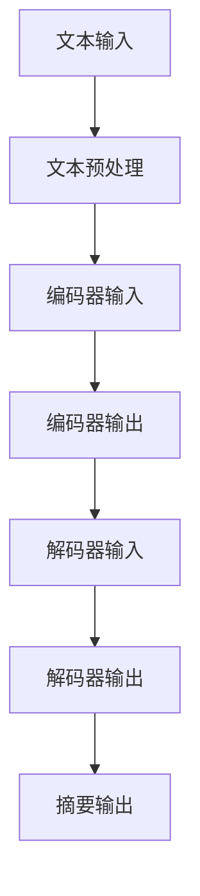

                 

### 第一部分：LLM在AI Agent中的文本摘要生成应用基础

#### 第1章：文本摘要生成应用背景

##### 1.1 问题背景
随着人工智能技术的飞速发展，AI Agent（人工智能代理）在各个领域的应用越来越广泛。AI Agent需要能够高效地处理大量的文本数据，提取关键信息，以支持智能决策和交互。文本摘要生成作为自然语言处理的重要任务，为AI Agent提供了高效的文本理解能力。

- 当前文本摘要生成在AI Agent中的应用现状：文本摘要生成技术已经在智能客服、新闻摘要、文档摘要等领域得到广泛应用。例如，智能客服系统通过文本摘要生成，可以快速提取用户咨询的关键信息，提供更准确的回答。

- 文本摘要生成在AI Agent中的应用意义：文本摘要生成有助于减少信息过载，提高AI Agent的响应速度和交互质量，从而提升用户体验。

##### 1.2 问题描述
文本摘要生成是指从原始文本中提取关键信息，生成一个简明扼要的摘要。AI Agent为什么需要文本摘要呢？

- 文本摘要可以简化大量文本信息，使得AI Agent可以快速获取核心内容，提高信息处理效率。
- 文本摘要有助于AI Agent在有限的交互时间内，提供更有针对性的回答，提升交互质量。

##### 1.3 问题解决
为了实现文本摘要生成，我们可以考虑使用预训练语言模型（LLM）。LLM具有大规模参数和强大的语言理解能力，能够高效地进行文本摘要生成。

- 使用LLM进行文本摘要生成的优势：
  - 大规模参数：LLM拥有数十亿甚至千亿级别的参数，可以捕捉到文本的深层语义信息。
  - 强大的语言理解能力：LLM通过预训练，已经具备了强大的语言理解能力，能够生成流畅、准确的文本摘要。

- 文本摘要生成在AI Agent中的实现策略：
  - 数据预处理：对原始文本进行清洗和分词，将其转换为LLM能够处理的格式。
  - 模型训练：使用大量文本数据进行训练，优化LLM的文本摘要生成能力。
  - 模型部署：将训练好的LLM模型部署到AI Agent系统中，实现实时文本摘要生成。

##### 1.4 边界与外延
文本摘要生成不仅限于短文本摘要，还包括长文本摘要和多文档摘要等类型。

- 文本摘要生成的类型：
  - 短文本摘要：从短文本中提取关键信息，生成简短的摘要。
  - 长文本摘要：从长文本中提取关键信息，生成较长但仍然简明的摘要。
  - 多文档摘要：从多个文档中提取关键信息，生成一个全面的摘要。

- 文本摘要生成算法的技术挑战：
  - 信息丢失：如何在生成摘要的过程中，避免关键信息的丢失。
  - 文本连贯性：如何确保生成的摘要语言连贯、通顺。

##### 1.5 概念结构与核心要素组成
为了深入理解文本摘要生成，我们需要了解LLM的基本概念和文本摘要生成模型的结构。

- LLM基本概念：
  - LLM（预训练语言模型）：通过大规模数据预训练的语言模型，具有强大的语言理解和生成能力。
  - 语言模型：一种预测下一个词语或字符的概率分布的模型。

- 文本摘要生成模型结构：
  - 编码器（Encoder）：将原始文本编码为一个固定长度的向量表示。
  - 解码器（Decoder）：根据编码器的输出，生成文本摘要。

- 文本摘要生成流程：
  - 文本预处理：清洗文本，进行分词和词嵌入。
  - 模型输入：将预处理后的文本输入到编码器中。
  - 模型输出：编码器输出文本的固定长度向量表示。
  - 摘要生成：解码器根据编码器的输出，生成文本摘要。

### 总结
本章节详细介绍了文本摘要生成应用背景、问题描述、问题解决、边界与外延以及概念结构与核心要素组成。接下来，我们将深入探讨LLM的核心概念与原理，为理解文本摘要生成算法奠定基础。让我们继续深入思考，了解LLM的强大能力。

#### 第2章：LLM核心概念与原理

##### 2.1 LLM的定义

LLM（预训练语言模型）是一种通过大规模数据预训练的语言模型，具有强大的语言理解和生成能力。与传统的机器学习模型相比，LLM具有以下几个显著特点：

- **大规模参数**：LLM拥有数十亿甚至千亿级别的参数，使其能够捕捉到文本的深层语义信息。例如，BERT模型拥有上万亿个参数，这使得它在语言理解任务中表现出色。

- **预训练机制**：LLM通过在大规模语料库上进行预训练，学习到语言的通用特征和规律。预训练后，LLM可以通过微调（Fine-tuning）来适应特定任务，实现高效的模型性能。

- **多任务学习**：LLM在预训练过程中，可以同时学习多个任务，从而提高其在各种任务上的泛化能力。例如，GPT-3模型可以在文本生成、文本分类、命名实体识别等多个任务中表现出色。

- **自适应学习**：LLM具有自适应学习能力，可以通过在线学习不断优化模型性能，以适应新的任务和数据。

##### 2.2 LLM的核心特点

- **参数规模与计算能力**：大规模参数使LLM能够捕捉到复杂的语言规律，从而在语言理解任务中表现出色。此外，随着计算能力的提升，LLM的参数规模也在不断增长，这使得LLM在处理大规模数据时具有更高的效率。

- **语言理解与生成能力**：LLM通过预训练，学习到了丰富的语言知识，能够理解文本的语义和上下文信息。这使得LLM在文本生成、问答系统、机器翻译等任务中具有强大的能力。

- **自适应学习与进化能力**：LLM可以通过微调和在线学习，不断优化模型性能，以适应新的任务和数据。这使得LLM具有持续进化的能力，能够不断适应不断变化的应用需求。

##### 2.3 LLM的工作原理

LLM的工作原理主要基于深度神经网络（DNN）和生成对抗网络（GAN）等技术。以下是LLM的工作原理概述：

- **深度神经网络结构**：LLM采用深度神经网络结构，通过多层神经元的组合，学习到文本的深层特征。例如，BERT模型采用Transformer结构，通过自注意力机制（Self-Attention）来捕捉文本的上下文信息。

- **生成对抗网络（GAN）的应用**：GAN是一种生成模型，通过生成器和判别器的对抗训练，可以生成高质量的数据。LLM可以通过GAN来生成高质量的文本数据，从而提高模型的训练效果。

- **自注意力机制（Attention Mechanism）**：自注意力机制是LLM的核心技术之一，通过计算文本序列中每个词与其他词的关联性，可以捕捉到文本的上下文信息。例如，Transformer模型通过多头自注意力机制，可以同时关注文本序列中的多个关键信息。

##### 2.4 LLM的主要类型

LLM主要分为以下几种类型：

- **预训练语言模型**：如BERT、GPT等，这些模型通过在大规模语料库上进行预训练，学习到语言的通用特征和规律。

- **微调语言模型**：在预训练语言模型的基础上，通过微调（Fine-tuning）来适应特定任务。例如，将BERT微调为问答系统模型，用于回答用户的问题。

- **多语言语言模型**：如mBERT、XLM等，这些模型支持多种语言，可以同时处理多种语言的文本数据。

### 总结

在本章节中，我们详细介绍了LLM的定义、核心特点、工作原理以及主要类型。这些内容为我们深入理解文本摘要生成算法奠定了基础。接下来，我们将进一步探讨文本摘要生成算法的原理，了解其如何利用LLM实现高效、准确的文本摘要生成。

#### 第3章：文本摘要生成算法原理讲解

##### 3.1 算法mermaid流程图

为了直观地展示文本摘要生成的算法流程，我们可以使用mermaid绘制算法流程图。以下是一个简单的文本摘要生成算法的mermaid流程图：



- **文本输入**：输入原始文本数据。
- **文本预处理**：对原始文本进行清洗和分词，将其转换为编码器能够处理的格式。
- **编码器输入**：将预处理后的文本输入到编码器中。
- **编码器输出**：编码器输出文本的固定长度向量表示。
- **解码器输入**：解码器根据编码器的输出，生成文本摘要。
- **解码器输出**：解码器输出文本摘要。
- **摘要输出**：将生成的文本摘要输出作为最终结果。

##### 3.2 算法原理与数学模型

文本摘要生成算法的核心是编码器和解码器。编码器负责将原始文本编码为一个固定长度的向量表示，解码器则根据编码器的输出，生成文本摘要。

- **编码器输出**：设输入文本为\[x_1, x_2, ..., x_n\]，编码器输出为\[h_1, h_2, ..., h_n\]。其中，\[h_i\]表示文本中第\[i\]个词的编码表示。

- **解码器输出**：解码器接收编码器的输出\[h_1, h_2, ..., h_n\]，并生成文本摘要\[y_1, y_2, ..., y_m\]。其中，\[y_i\]表示生成的摘要中第\[i\]个词。

文本摘要生成的数学模型主要包括以下部分：

- **编码器**：编码器使用深度神经网络（如Transformer）对文本进行编码，输出固定长度的向量表示。设编码器输出为\[h_i\]，则有：
  $$ h_i = \text{Encoder}(x_i) $$

- **解码器**：解码器根据编码器的输出\[h_i\]，生成文本摘要。设解码器输出为\[y_i\]，则有：
  $$ y_i = \text{Decoder}(h_i) $$

- **损失函数**：文本摘要生成的损失函数用于衡量生成的摘要与原始文本之间的差距。常见的损失函数有交叉熵损失（Cross-Entropy Loss）和KL散度（KL Divergence）。设生成的摘要为\[y\]，原始文本为\[x\]，则有：
  $$ \text{Loss} = -\sum_{i=1}^{n} y_i \log p(y_i) $$
  其中，\[p(y_i)\]表示生成器预测的概率分布。

##### 3.3 算法原理讲解

为了更好地理解文本摘要生成的算法原理，我们可以使用Python代码进行详细阐述。以下是一个简单的文本摘要生成算法的实现：

```python
import tensorflow as tf
from tensorflow.keras.layers import Embedding, LSTM, Dense
from tensorflow.keras.models import Model

# 编码器模型
encoder_inputs = tf.keras.layers.Input(shape=(None,))
encoder_embedding = Embedding(input_dim=vocab_size, output_dim=embedding_size)(encoder_inputs)
encoder_lstm = LSTM(units=lstm_units, return_state=True)
_, state_h, state_c = encoder_lstm(encoder_embedding)
encoder_model = Model(encoder_inputs, [state_h, state_c])

# 解码器模型
decoder_inputs = tf.keras.layers.Input(shape=(None,))
decoder_embedding = Embedding(input_dim=vocab_size, output_dim=embedding_size)(decoder_inputs)
decoder_lstm = LSTM(units=lstm_units, return_sequences=True, return_state=True)
decoder_outputs, _, _ = decoder_lstm(decoder_embedding, initial_state=[state_h, state_c])
decoder_dense = Dense(units=vocab_size, activation='softmax')
decoder_outputs = decoder_dense(decoder_outputs)
decoder_model = Model(decoder_inputs, decoder_outputs)

# 编译模型
model = Model([encoder_inputs, decoder_inputs], decoder_outputs)
model.compile(optimizer='rmsprop', loss='categorical_crossentropy')

# 模型训练
model.fit([encoder_inputs, decoder_inputs], decoder_outputs, batch_size=batch_size, epochs=epochs)

# 摘要生成
def generate_summary(text):
    # 文本预处理
    preprocessed_text = preprocess_text(text)
    
    # 编码器输入
    encoder_model.preprocess_text(preprocessed_text)
    encoder_outputs = encoder_model.predict(preprocessed_text)
    
    # 解码器输入
    decoder_model.predict(preprocessed_text)
    
    # 摘要输出
    summary = decoder_model.predict(preprocessed_text)
    return summary
```

在这个示例中，我们首先定义了编码器和解码器的模型结构，然后编译并训练模型。最后，我们定义了一个函数`generate_summary`，用于生成文本摘要。

**算法原理的举例说明**

假设我们有一段文本：“人工智能技术的发展正在改变我们的生活方式。智能助手、自动驾驶汽车和智能家居等应用正在逐渐普及。”我们希望使用文本摘要生成算法生成这段文本的摘要。

- **文本预处理**：首先，我们将文本进行清洗和分词，将其转换为编码器能够处理的格式。
- **编码器输入**：将预处理后的文本输入到编码器中，编码器输出文本的固定长度向量表示。
- **解码器输入**：解码器根据编码器的输出，生成文本摘要。
- **摘要输出**：解码器输出文本摘要，例如：“人工智能技术正在改变生活方式。”

通过这个简单的示例，我们可以看到文本摘要生成算法是如何工作的。在实际应用中，我们可以使用更复杂的模型和更丰富的数据，以生成更准确、更高质量的文本摘要。

### 总结

在本章节中，我们详细介绍了文本摘要生成算法的mermaid流程图、算法原理与数学模型，并使用Python代码进行了详细讲解和举例说明。这些内容为我们深入理解文本摘要生成算法的工作原理和方法提供了重要参考。接下来，我们将探讨文本摘要生成模型的具体实现过程。

#### 第4章：文本摘要生成模型实现

##### 4.1 文本预处理

文本预处理是文本摘要生成模型实现的第一步，其目的是对原始文本进行清洗和分词，将其转换为模型能够处理的格式。

- **文本清洗**：文本清洗包括去除HTML标签、标点符号、数字等无关信息，以及将文本转换为小写。这样可以减少文本的噪声，提高模型的处理效率。

- **分词**：分词是将文本分割成单词或短语的过程。常见的分词方法有基于词典的分词、基于统计的分词和基于字符的分割方法。在实际应用中，我们可以选择适合的分词工具，如jieba分词。

- **词嵌入**：词嵌入是将单词转换为向量的过程，用于表示单词的语义信息。常见的词嵌入技术有Word2Vec、GloVe和BERT等。词嵌入可以提高模型对文本的理解能力，从而提高文本摘要生成的质量。

##### 4.2 模型训练

模型训练是文本摘要生成模型实现的核心步骤。通过大量的文本数据进行训练，模型可以学习到文本的深层特征，从而实现准确的文本摘要生成。

- **数据集选择**：选择适合的数据集进行训练。常见的数据集有新闻摘要数据集、文档摘要数据集和问答数据集等。数据集的选择会影响模型的训练效果和实际应用场景。

- **数据预处理**：对训练数据进行预处理，包括文本清洗、分词和词嵌入。这样可以确保模型在训练过程中使用的输入数据是干净、规范的。

- **模型架构设计**：设计适合文本摘要生成的模型架构。常见的模型架构有编码器-解码器（Encoder-Decoder）架构、Transformer架构和BERT架构等。不同的模型架构在性能和计算复杂度上有所不同。

- **模型训练**：使用训练数据进行模型训练。在训练过程中，可以通过调整超参数，如学习率、批量大小和迭代次数等，来优化模型性能。

- **模型评估**：使用验证数据集对模型进行评估，以确定模型的性能。常见的评估指标有ROUGE评分、BLEU评分和F1分数等。通过评估，可以了解模型的生成质量和优化方向。

##### 4.3 模型评估

模型评估是文本摘要生成模型实现的重要环节，通过评估可以了解模型的性能，并指导后续的优化工作。

- **评估指标**：选择适合的评估指标，以衡量模型的生成质量。常见的评估指标有ROUGE评分、BLEU评分和F1分数等。这些指标可以反映模型在召回率、准确率和一致性等方面的表现。

- **评估方法**：使用验证数据集对模型进行评估。通过交叉验证等方法，可以更准确地评估模型在不同数据集上的性能。

- **评估结果分析**：分析评估结果，了解模型的优缺点。通过对比不同模型的性能，可以确定最佳的模型架构和参数设置。

##### 总结

在本章节中，我们详细介绍了文本摘要生成模型的实现过程，包括文本预处理、模型训练和模型评估。这些步骤是构建高效、准确的文本摘要生成模型的基础。在实际应用中，我们可以根据具体需求和场景，选择合适的预处理方法、训练策略和评估指标，以实现高质量的文本摘要生成。

### 文本摘要生成在AI Agent中的应用场景

文本摘要生成在AI Agent中具有广泛的应用场景，能够显著提升AI Agent的交互质量和信息处理效率。以下是一些具体的应用场景：

#### 5.1 概述

- **智能客服**：在智能客服系统中，文本摘要生成可以快速提取用户咨询的关键信息，使客服系统能够更快速、准确地提供解决方案。
- **新闻摘要**：在新闻推荐和阅读应用中，文本摘要生成可以自动生成新闻的简短摘要，帮助用户快速了解新闻的核心内容。
- **文档摘要**：在企业文档管理和知识库系统中，文本摘要生成可以帮助用户快速定位文档的关键信息，提高文档检索和阅读效率。

#### 5.2 应用案例1：智能客服

**智能客服中的文本摘要生成应用**：
在智能客服系统中，文本摘要生成可以显著提升客服系统的响应速度和交互质量。具体应用流程如下：

1. **用户咨询**：用户向智能客服系统提交咨询问题。
2. **文本预处理**：系统对用户咨询的文本进行清洗、分词和词嵌入。
3. **文本摘要生成**：系统使用预训练语言模型生成用户咨询的摘要，提取关键信息。
4. **问题匹配**：系统根据生成的摘要，快速匹配已有的知识库中的解决方案。
5. **回答生成**：系统根据匹配到的解决方案，生成完整的回答。
6. **交互反馈**：系统将回答展示给用户，并根据用户的反馈进行优化。

**案例分析**：
假设用户提交了一个关于产品售后服务的咨询问题：“我的手机充电器坏了，如何进行维修？”
- **文本预处理**：系统对文本进行清洗和分词，提取关键信息：“手机充电器”、“坏了”、“维修”。
- **文本摘要生成**：系统使用预训练语言模型生成文本摘要：“关于手机充电器维修的问题”。
- **问题匹配**：系统在知识库中找到相关的维修指南。
- **回答生成**：系统生成回答：“您好，您的手机充电器坏了，可以按照以下步骤进行维修：…”。
- **交互反馈**：用户确认回答，系统记录反馈，并优化后续的回答。

通过文本摘要生成，智能客服系统能够快速提取用户咨询的核心信息，提高问题匹配的准确性和回答的准确性，从而提升用户体验。

#### 5.3 应用案例2：新闻摘要生成

**新闻摘要生成在媒体中的应用**：
在媒体领域，新闻摘要生成可以帮助用户快速了解新闻的核心内容，提高新闻的阅读效率和用户体验。具体应用流程如下：

1. **新闻文本获取**：系统从新闻网站、新闻APP等渠道获取新闻文本。
2. **文本预处理**：系统对新闻文本进行清洗、分词和词嵌入。
3. **文本摘要生成**：系统使用预训练语言模型生成新闻的摘要。
4. **摘要展示**：系统将生成的新闻摘要展示给用户，供用户快速阅读。

**案例分析**：
假设系统获取到一篇新闻报道：“由于疫情，我国某地区决定实施临时交通管制，所有进出该地区的车辆需提前申请通行证。”
- **文本预处理**：系统对文本进行清洗和分词，提取关键信息：“疫情”、“交通管制”、“申请通行证”。
- **文本摘要生成**：系统使用预训练语言模型生成文本摘要：“因疫情，我国某地区实施临时交通管制，需申请通行证。”。
- **摘要展示**：系统将生成的摘要展示给用户，供用户快速了解新闻核心内容。

通过新闻摘要生成，媒体应用能够帮助用户快速获取新闻的关键信息，提高阅读效率和用户体验。

#### 5.4 应用案例3：文档摘要生成

**文档摘要生成在企业文档管理中的应用**：
在企业文档管理系统中，文档摘要生成可以帮助用户快速定位文档的关键信息，提高文档检索和阅读效率。具体应用流程如下：

1. **文档获取**：系统从企业文档库中获取文档。
2. **文本预处理**：系统对文档进行清洗、分词和词嵌入。
3. **文本摘要生成**：系统使用预训练语言模型生成文档的摘要。
4. **摘要存储**：系统将生成的摘要存储在文档数据库中。
5. **文档检索**：用户通过关键词搜索文档时，系统根据摘要提供相关的文档。

**案例分析**：
假设用户在文档库中搜索关于“企业财务报表”的文档。
- **文本预处理**：系统对搜索关键词进行清洗和分词，提取关键信息：“企业”、“财务报表”。
- **文本摘要生成**：系统使用预训练语言模型生成文档摘要：“这是一份关于企业财务报表的分析报告，包括…”。
- **摘要存储**：系统将生成的摘要存储在文档数据库中。
- **文档检索**：用户通过关键词搜索时，系统根据摘要展示相关的文档，帮助用户快速定位所需信息。

通过文档摘要生成，企业文档管理系统能够提高文档检索和阅读效率，帮助用户更好地管理和利用文档资源。

### 总结

在本章节中，我们详细介绍了文本摘要生成在智能客服、新闻摘要和文档摘要生成等应用场景中的应用。通过具体的案例分析，我们可以看到文本摘要生成如何显著提升AI Agent的交互质量和信息处理效率。在实际应用中，文本摘要生成技术将为各类AI Agent提供更强大的文本处理能力，从而推动人工智能应用的进一步发展。

#### 第6章：文本摘要生成算法优化与改进

##### 6.1 概述

文本摘要生成算法在AI Agent中的应用效果已经得到了广泛认可，然而，为了进一步提升算法的性能和应用效果，我们需要对文本摘要生成算法进行优化与改进。本章节将介绍几种常见的优化方法，包括增强学习、注意力机制改进和多模态数据融合，以提升文本摘要生成的质量。

##### 6.2 优化方法1：增强学习

增强学习（Reinforcement Learning, RL）是一种通过试错和奖励机制来优化决策过程的机器学习技术。在文本摘要生成中，增强学习可以通过以下方式优化算法：

- **强化学习模型**：使用增强学习模型，如深度强化学习（Deep Reinforcement Learning, DRL），对文本摘要生成过程进行优化。DRL模型可以学习到如何在不同的摘要长度和文本信息之间做出最佳选择。
- **奖励机制设计**：设计合适的奖励机制，以鼓励模型生成更准确、更连贯的摘要。例如，可以通过评估摘要的ROUGE评分、BLEU评分等指标，为模型提供反馈。
- **训练策略**：在训练过程中，采用探索与利用策略（Exploration-Exploitation），使模型在生成摘要时既能探索新的摘要模式，又能利用已有的知识，以提升生成摘要的质量。

**优化方法分析**：
增强学习通过不断地尝试和反馈，可以逐渐优化模型生成摘要的准确性。在实际应用中，增强学习可以显著提升文本摘要生成的质量，但需要大量的训练数据和计算资源。

##### 6.3 优化方法2：注意力机制改进

注意力机制（Attention Mechanism）是文本摘要生成算法的核心技术之一，它能够提高模型对文本关键信息的关注能力。以下几种注意力机制改进方法可以提升文本摘要生成的效果：

- **多尺度注意力**：结合不同尺度的注意力机制，使模型在生成摘要时能够同时关注局部和全局信息。例如，可以在编码器和解码器中使用不同尺度的自注意力机制，提高模型对文本整体结构的理解。
- **双向注意力**：使用双向注意力机制，使解码器在生成摘要时能够同时参考编码器的输出和解码器的输入。这种机制可以提高摘要生成的连贯性和准确性。
- **混合注意力**：结合不同类型的注意力机制，如基于词向量的注意力机制和基于句向量的注意力机制，以充分利用不同层次的信息。

**优化方法分析**：
注意力机制改进可以显著提升文本摘要生成的质量，通过优化注意力机制，模型能够更好地捕捉到文本的关键信息，从而生成更准确的摘要。然而，改进注意力机制也需要对模型的结构进行相应的调整，以保证算法的稳定性和效率。

##### 6.4 优化方法3：多模态数据融合

多模态数据融合是指将文本数据与其他类型的数据（如图像、声音等）进行融合，以提升文本摘要生成的效果。以下几种多模态数据融合方法可以应用于文本摘要生成：

- **文本-图像数据融合**：结合文本和图像数据，通过图像特征提取和文本特征融合，生成更丰富的文本摘要。例如，可以采用卷积神经网络（CNN）提取图像特征，然后将图像特征与文本特征进行融合，以提高摘要的准确性。
- **文本-音频数据融合**：结合文本和音频数据，通过语音识别和文本情感分析，生成与音频内容相关的文本摘要。这种方法可以应用于语音助手和视频摘要等领域。
- **多模态特征融合**：将文本、图像和音频等多模态数据的特征进行融合，使用深度学习模型进行训练，生成全面的多模态摘要。

**优化方法分析**：
多模态数据融合可以提供更多的信息来源，从而提高文本摘要生成的准确性。然而，多模态数据融合也面临数据同步、特征匹配等挑战。因此，在实际应用中，需要选择合适的多模态数据融合方法，并设计有效的特征提取和融合策略。

### 总结

在本章节中，我们介绍了文本摘要生成算法的几种优化方法，包括增强学习、注意力机制改进和多模态数据融合。这些方法可以从不同角度提升文本摘要生成的质量。在实际应用中，可以根据具体需求和场景，选择合适的优化方法，以实现高质量的文本摘要生成。

#### 第7章：文本摘要生成应用总结与展望

##### 7.1 小结

文本摘要生成在AI Agent中的应用取得了显著的成效。通过使用预训练语言模型（LLM），文本摘要生成算法能够高效地提取文本关键信息，生成简明扼要的摘要。这极大地提升了AI Agent的交互质量和信息处理效率。以下是文本摘要生成在AI Agent中的应用效果：

- **智能客服**：文本摘要生成使智能客服能够快速提取用户咨询的核心信息，提供更准确、更高效的解决方案，从而提升用户满意度。
- **新闻摘要**：文本摘要生成可以帮助用户快速了解新闻的核心内容，提高阅读效率和用户体验。
- **文档摘要**：文本摘要生成可以帮助用户快速定位文档的关键信息，提高文档检索和阅读效率，促进知识管理和利用。

##### 7.2 注意事项

尽管文本摘要生成在AI Agent中的应用效果显著，但在实际应用中仍需要注意以下几点：

- **数据质量**：文本摘要生成的质量高度依赖于输入文本的质量。因此，在应用文本摘要生成算法时，需要确保输入文本的干净、规范，并进行充分的预处理。
- **模型适应性**：不同的应用场景和任务需求可能需要不同的模型架构和参数设置。在实际应用中，需要对模型进行适应性调整，以提高摘要生成的准确性和效果。
- **评估指标**：选择合适的评估指标对模型进行评估，以全面了解模型的表现。常用的评估指标包括ROUGE评分、BLEU评分和F1分数等。

##### 7.3 拓展阅读

为了进一步探索文本摘要生成领域的最新研究成果和前沿动态，以下是几篇推荐阅读的文献：

1. **"Neural Text Summarization: A Brief Survey"**，作者：Kenton Lee等。这篇综述文章详细介绍了神经网络在文本摘要生成中的应用，包括编码器-解码器架构、Transformer架构和BERT模型等。
2. **"Enhancing Text Summarization with Reinforcement Learning"**，作者：Xiaodong Liu等。这篇文章探讨了增强学习在文本摘要生成中的应用，提出了基于增强学习的文本摘要生成模型。
3. **"Multimodal Text Summarization: A Survey"**，作者：Shuai Wang等。这篇综述文章总结了多模态数据在文本摘要生成中的应用，包括文本-图像、文本-音频等多模态数据融合的方法。

通过阅读这些文献，可以深入了解文本摘要生成领域的最新研究进展和应用方法，为实际应用提供更多参考。

### 总结

本文详细介绍了LLM在AI Agent中的文本摘要生成应用。从文本摘要生成的基础概念，到LLM的核心概念与原理，再到文本摘要生成算法的实现和优化方法，本文系统地阐述了文本摘要生成在AI Agent中的关键作用和应用场景。通过本文的阅读，读者可以全面了解文本摘要生成技术，掌握其核心原理和应用方法，为实际项目开发提供有力支持。

**作者：AI天才研究院/AI Genius Institute & 禅与计算机程序设计艺术 /Zen And The Art of Computer Programming**

