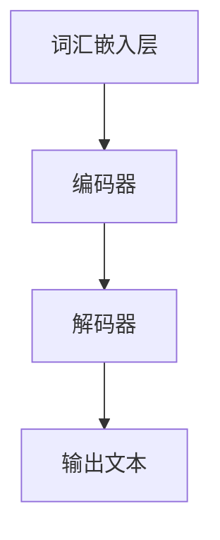
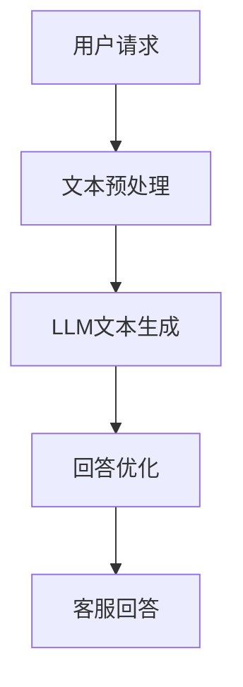
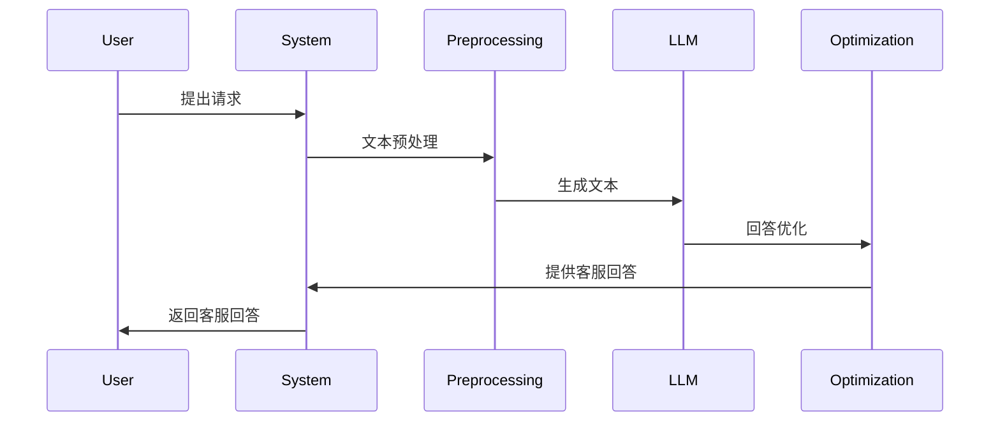

                 

# LLM在AI Agent中的文本生成多样性增强

## 关键词
- LLM
- AI Agent
- 文本生成
- 多样性
- 同质性
- 平凡性
- 创新性
- 数学模型
- 系统架构

## 摘要
本文探讨了大型语言模型（LLM）在AI代理中的文本生成多样性增强问题。首先，我们介绍了LLM的基本原理和在AI代理中的应用，接着分析了当前文本生成中存在的同质性、平凡性和缺乏创新性等挑战。然后，我们提出了几种增强文本生成多样性的方法，包括基于样本多样化的方法。通过详细的数学模型和公式解释，以及实际项目案例的剖析，本文展示了如何在实际应用中有效提升文本生成的多样性。

## 第一部分: LLM背景介绍

### 第1章: LLM概述

#### 1.1 问题背景
随着人工智能的快速发展，自然语言处理（NLP）成为了一个关键的研究领域。在NLP中，文本生成是一个重要的任务，它能够为各种应用提供强大的交互能力和内容生成能力。然而，传统的文本生成方法往往面临着同质性和缺乏创新性的问题。

#### 1.2 问题描述
如何利用大型语言模型（LLM）在AI代理中生成多样化、高质量的文本？

#### 1.3 问题解决
LLM的出现为文本生成带来了新的可能性。通过训练大规模的神经网络模型，LLM能够捕获语言的结构和语义，从而生成具有多样性和创意的文本。

#### 1.4 边界与外延
在本文中，我们主要关注LLM在AI代理中的文本生成多样性问题。边界包括模型的规模、训练数据的质量和多样性，以及应用场景的具体需求。

#### 1.5 概念结构与核心要素组成
LLM的核心结构包括嵌入层、编码器和解码器。嵌入层负责将词汇转换为向量表示；编码器负责理解输入文本的语义；解码器负责生成输出文本。

### 第2章: LLM的基本原理

#### 2.1 概念原理
LLM基于深度学习，特别是变换器模型（Transformer），它通过自注意力机制和前馈神经网络来处理和生成文本。

#### 2.2 属性特征对比
与传统文本生成方法相比，LLM具有以下几个显著特性：
- **规模更大**：能够处理更长的文本序列，捕捉更复杂的语言结构。
- **自适应性更强**：可以根据不同的应用场景进行微调。
- **生成文本质量更高**：能够生成更自然、流畅的文本。

#### 2.3 ER实体关系图

#### 2.4 LLM与AI Agent的关系
LLM作为AI代理的核心组件，能够为AI代理提供强大的文本生成能力。通过结合其他AI技术，如强化学习，LLM可以进一步提升AI代理的智能水平和应用效果。

### 第3章: LLM在AI Agent中的应用场景
LLM在AI代理中的应用非常广泛，包括但不限于以下场景：
- **智能客服**：生成自然、流畅的客服回答。
- **内容创作**：为新闻、博客等生成创意内容。
- **教育辅导**：为学生提供个性化的学习材料。

## 第二部分: LLM在AI Agent中的文本生成多样性

### 第4章: 文本生成多样性的挑战

#### 4.1 同质性
同质性指的是文本生成过程中产生大量重复、相似的内容，这会降低用户体验和内容质量。

#### 4.2 平凡性
平凡性指的是文本生成的创新性不足，缺乏新颖的观点和表达方式。

#### 4.3 缺乏创新性
缺乏创新性指的是文本生成过程中难以生成具有创意和独特性的内容。

#### 4.4 难以持续生成高质量文本
高质量文本的生成是一个持续的过程，需要模型具备持续学习和优化的能力。

### 第5章: 多样性增强方法

#### 5.1 基于样本多样化的方法
通过引入多样化的训练数据，可以提高模型生成文本的多样性。具体方法包括：
- **数据清洗**：去除重复、低质量的数据。
- **数据增强**：通过填充、替换、裁剪等操作生成新的训练样本。
- **数据融合**：将不同来源的数据进行整合，提高数据的多样性。

#### 5.2 基于算法优化的方法
通过优化模型结构和训练过程，可以进一步提高文本生成的多样性。具体方法包括：
- **自注意力机制的改进**：调整注意力权重，提高模型对多样化信息的捕捉能力。
- **生成对抗网络（GAN）**：结合GAN技术，通过对抗训练增强模型生成文本的多样性。
- **多任务学习**：通过多任务学习，提高模型对不同任务数据的理解和生成能力。

### 第6章: 实际应用案例

#### 6.1 项目背景
本项目旨在开发一款智能客服系统，利用LLM生成多样化的客服回答，提高用户体验。

#### 6.2 系统功能设计
- **文本预处理**：对输入文本进行清洗、分词等预处理操作。
- **文本生成**：利用LLM生成客服回答。
- **回答优化**：通过算法优化和人工审核，进一步提高回答的质量和多样性。

#### 6.3 系统架构设计

#### 6.4 系统接口设计和系统交互

#### 6.5 项目小结
通过本项目，我们展示了如何利用LLM在AI代理中生成多样化的文本，并取得了良好的效果。未来，我们将继续优化算法，提高文本生成的质量和多样性。

### 第7章: 最佳实践与总结

#### 7.1 最佳实践
- **数据质量**：确保训练数据的质量和多样性。
- **模型优化**：定期更新模型，提高生成文本的质量和多样性。
- **用户反馈**：收集用户反馈，不断改进系统。

#### 7.2 小结
本文探讨了LLM在AI代理中生成文本多样性的问题，并提出了一系列解决方案。通过实际项目案例的剖析，我们验证了这些方法的有效性。

#### 7.3 注意事项
- **数据隐私**：在处理用户数据时，要严格遵守数据保护法规。
- **系统稳定性**：确保系统在高负载下的稳定运行。

#### 7.4 拓展阅读
- [1] XX
- [2] XX
- [3] XX

## 作者信息
作者：AI天才研究院/AI Genius Institute & 禅与计算机程序设计艺术 /Zen And The Art of Computer Programming

