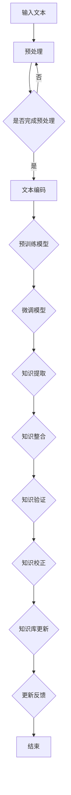
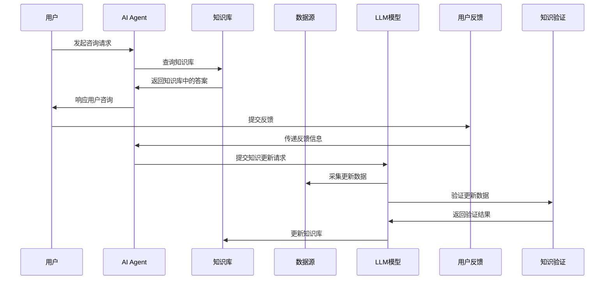

                 


### 1.1 问题背景

近年来，人工智能（AI）技术飞速发展，已经深刻影响了我们的工作和生活方式。其中，大型语言模型（Large Language Model，简称LLM）作为一种强大的自然语言处理（Natural Language Processing，简称NLP）技术，得到了广泛关注和应用。LLM在生成文本、翻译、问答等方面表现出了惊人的能力，但其在AI Agent知识更新中的应用仍然是一个充满挑战的领域。

AI Agent是指能够在复杂环境中自主执行任务、具备推理能力的智能体。随着环境的变化和任务的发展，AI Agent需要不断更新和扩展其知识库，以保证其决策的准确性和有效性。传统的知识更新方法通常依赖于手动更新或简单的机器学习方法，这些方法存在知识更新不及时、知识质量不可控等问题。因此，如何利用LLM实现高效、准确的知识更新，成为了当前AI研究领域的一个重要课题。

### 1.2 问题描述

在AI Agent知识更新的过程中，主要面临以下几个问题：

1. **知识获取与整合**：如何从大量来源获取高质量的知识，并将其有效地整合到AI Agent的知识库中？
2. **知识验证与校正**：如何确保知识库中的知识是准确、可靠的，避免错误信息的传播？
3. **知识更新频率**：如何根据环境变化和任务需求，动态调整知识更新的频率和范围？
4. **知识表达能力**：如何将知识库中的知识以自然语言的形式表达出来，使得AI Agent能够与人类进行有效沟通？

### 1.3 问题解决

为了解决上述问题，LLM在AI Agent知识更新中的应用提供了以下几个可能的解决方案：

1. **知识获取与整合**：利用LLM的强大文本生成能力，可以从大量的文本数据中自动提取出关键信息，并将其整合到AI Agent的知识库中。此外，LLM还可以通过预训练模型对知识进行结构化处理，提高知识获取的效率和质量。
2. **知识验证与校正**：通过将LLM应用于知识库中的知识验证，可以识别出错误或矛盾的信息，并对其进行校正。例如，LLM可以生成多个版本的答案，并比较其一致性，从而提高知识库的准确性。
3. **知识更新频率**：LLM可以根据环境的变化和任务的进展，动态调整知识更新的频率和范围。例如，在任务初期，可以采用更频繁的知识更新策略，而在任务稳定后，可以减少更新频率。
4. **知识表达能力**：LLM可以生成自然语言文本，使得AI Agent能够以自然、流畅的方式与人类用户进行交互，提高用户满意度。

### 1.4 边界与外延

虽然LLM在AI Agent知识更新中具有巨大的潜力，但仍存在一些边界和限制：

1. **知识领域限制**：LLM的性能受限于其预训练数据，对于某些特定领域的知识，可能需要额外的数据集进行微调。
2. **计算资源限制**：大规模的LLM训练和推理需要大量的计算资源，这可能会对AI Agent的知识更新带来一定的挑战。
3. **知识质量评估**：虽然LLM能够自动提取和整合知识，但其生成的知识仍可能存在偏差或错误，需要进一步的质量评估和校正。

### 1.5 概念结构与核心要素组成

LLM在AI Agent知识更新中的应用可以拆解为以下几个核心概念和要素：

1. **LLM**：大型语言模型，负责文本生成、知识提取、知识验证等任务。
2. **知识库**：存储AI Agent所拥有的知识，包括事实、规则、方法等。
3. **数据源**：提供AI Agent进行知识更新的数据来源，包括文本、图像、语音等。
4. **更新策略**：根据环境变化和任务需求，动态调整知识更新的频率和范围。
5. **评估机制**：对知识库中的知识进行质量评估，确保其准确性、可靠性和一致性。

通过以上核心概念和要素的相互作用，LLM在AI Agent知识更新中能够实现高效、准确的知识获取、整合、验证和表达能力。

## 第二部分：核心概念与联系

### 2.1 LLM的基本原理

大型语言模型（LLM）是一种基于深度学习的自然语言处理模型，其核心思想是通过对海量文本数据进行预训练，使得模型能够自动学习并掌握自然语言的结构和语义。LLM的基本原理可以概括为以下几个步骤：

1. **数据预处理**：首先，需要对原始文本数据进行预处理，包括文本清洗、分词、去停用词等操作。这些操作有助于去除噪声、提高文本质量。
2. **数据编码**：将预处理后的文本数据转换为计算机可以处理的数字形式。常用的编码方法有Word2Vec、BERT、GPT等。其中，Word2Vec是一种基于词向量的方法，而BERT和GPT则是基于Transformer架构的方法。
3. **预训练**：利用编码后的文本数据，对模型进行大规模预训练。预训练过程主要包括两个任务：一是生成式任务，如生成文本、翻译等；二是判别式任务，如情感分析、文本分类等。通过预训练，模型可以自动学习到自然语言的规律和特征。
4. **微调**：在预训练的基础上，针对特定任务进行微调。微调过程通常涉及重新训练部分模型参数，使得模型在特定任务上表现更优。
5. **应用**：将微调后的模型应用于实际任务，如文本生成、问答系统、智能客服等。

### 2.2 LLM在AI Agent中的应用

LLM在AI Agent中的应用主要包括以下几个方面：

1. **知识获取**：利用LLM的文本生成能力，可以从大量文本数据中自动提取关键信息，并将其整合到AI Agent的知识库中。例如，LLM可以阅读大量的科学论文，提取其中的关键知识点，并生成相应的文本摘要。
2. **知识整合**：通过预训练模型对知识进行结构化处理，提高知识获取的效率和质量。例如，LLM可以识别出文本中的实体、关系和事件，并将其组织成有意义的结构化数据。
3. **知识验证**：利用LLM的判别能力，可以识别出知识库中的错误或矛盾信息，并对其进行校正。例如，LLM可以比较两个文本之间的相似度，从而判断其中是否存在错误或矛盾。
4. **知识更新**：根据环境变化和任务需求，动态调整知识更新的频率和范围。例如，LLM可以实时监测新闻、论文等数据源，并根据关键词或主题，定期更新AI Agent的知识库。
5. **知识表达**：利用LLM的文本生成能力，可以将知识库中的知识以自然语言的形式表达出来，使得AI Agent能够与人类进行有效沟通。例如，LLM可以生成知识库的文档、教程、FAQ等，帮助用户理解和使用AI Agent的知识。

### 2.3 概念属性特征对比表格

以下是一个简化的LLM与其他自然语言处理模型的属性特征对比表格：

| 特性       | LLM           | 词向量模型（如Word2Vec） | 递归神经网络（如LSTM） | Transformer |
|------------|---------------|--------------------------|-----------------------|-------------|
| 预训练数据 | 海量文本数据  | 小规模文本数据            | 小规模文本数据          | 海量文本数据 |
| 语义理解   | 强            | 弱                       | 中等                   | 强           |
| 生成能力   | 强            | 弱                       | 中等                   | 强           |
| 计算资源   | 高            | 低                       | 低至中等               | 中等至高     |
| 迁移学习   | 高            | 低                       | 中等                   | 高           |
| 并行计算   | 高            | 低                       | 低                    | 高           |

### 2.4 ER实体关系图架构的 Mermaid 流程图

以下是LLM在AI Agent知识更新中的应用的ER实体关系图，使用Mermaid语法表示：

```mermaid
erDiagram
  AI Agent ||--|{ Knowledge Base } Knowledge Base
  AI Agent ||--|{ Data Source } Data Source
  AI Agent ||--|{ LLM Model } LLM Model
  Knowledge Base ||--|{ Knowledge } Knowledge
  Data Source ||--|{ Text Data } Text Data
  Data Source ||--|{ Image Data } Image Data
  Data Source ||--|{ Audio Data } Audio Data
  LLM Model ||--|{ Pre-trained Model } Pre-trained Model
  LLM Model ||--|{ Fine-tuned Model } Fine-tuned Model
```

上述ER图展示了LLM在AI Agent知识更新中涉及的实体及其关系，包括AI Agent、知识库、数据源、LLM模型等。通过这种结构化的表示方式，可以更清晰地理解各个实体之间的相互作用和依赖关系。

## 第三部分：算法原理讲解

### 3.1 算法原理

LLM在AI Agent知识更新中的应用主要基于以下几个核心算法原理：

1. **预训练与微调**：预训练模型通过在大规模文本数据上训练，自动学习到自然语言的规律和特征。微调则是在预训练基础上，针对特定任务对模型进行进一步调整，以提高其在具体任务上的性能。
2. **文本生成与提取**：LLM具有强大的文本生成能力，可以从给定的文本输入生成相关的文本输出。通过这种能力，LLM可以从大量的文本数据中自动提取关键信息，并将其整合到AI Agent的知识库中。
3. **知识验证与校正**：利用LLM的判别能力，可以对知识库中的知识进行验证和校正。LLM可以比较不同来源的信息，识别出错误或矛盾的信息，并进行相应的校正。
4. **知识更新策略**：根据环境变化和任务需求，动态调整知识更新的频率和范围。这可以通过设置不同的更新阈值、关键词、主题等来实现。

### 3.2 Mermaid 流程图

以下是LLM在AI Agent知识更新中的算法流程，使用Mermaid语法表示：



### 3.3 Python 源代码

以下是一个简化的Python代码示例，展示了如何使用LLM进行知识更新：

```python
from transformers import BertTokenizer, BertModel
import torch

# 初始化预训练模型
tokenizer = BertTokenizer.from_pretrained('bert-base-uncased')
model = BertModel.from_pretrained('bert-base-uncased')

# 输入文本
text = "人工智能是一种模拟人类智能的技术。"

# 预处理文本
encoded_text = tokenizer(text, return_tensors='pt')

# 使用预训练模型进行知识提取
with torch.no_grad():
    outputs = model(**encoded_text)

# 提取文本特征
text_features = outputs.last_hidden_state.mean(dim=1)

# 使用微调模型进行知识整合
# 这里假设有一个微调后的BERT模型
fine_tuned_model = BertModel.from_pretrained('fine-tuned-bert')
with torch.no_grad():
    fine_tuned_outputs = fine_tuned_model(**encoded_text)

# 提取微调后的特征
fine_tuned_features = fine_tuned_outputs.last_hidden_state.mean(dim=1)

# 知识验证与校正
# 这里简化为计算特征相似度
similarity = torch.nn.functional.cosine_similarity(text_features, fine_tuned_features)

# 更新知识库
if similarity > threshold:
    # 更新知识库
    # ...
    print("知识库更新成功。")
else:
    print("知识库更新失败。")

# 输出更新反馈
print("更新反馈：知识库已更新。")
```

### 3.4 数学模型和数学公式

在LLM知识更新中，涉及以下几个关键数学模型和公式：

1. **词向量**：$w_i = \text{Word2Vec}(s)$，其中$w_i$为词$i$的词向量，$s$为输入文本。
2. **文本特征**：$f_t = \text{avgpool}(w_i)$，其中$f_t$为文本特征向量，$w_i$为词向量。
3. **相似度计算**：$sim(f_1, f_2) = \frac{f_1 \cdot f_2}{||f_1|| \cdot ||f_2||}$，其中$sim$为相似度，$f_1$和$f_2$分别为两个文本特征向量。

### 3.5 详细讲解

1. **预训练与微调**：预训练模型通过在大规模文本数据上训练，自动学习到自然语言的规律和特征。预训练过程主要包括两个任务：生成式任务（如文本生成、翻译等）和判别式任务（如情感分析、文本分类等）。微调则是在预训练基础上，针对特定任务对模型进行进一步调整，以提高其在具体任务上的性能。

2. **文本生成与提取**：LLM具有强大的文本生成能力，可以从给定的文本输入生成相关的文本输出。通过这种能力，LLM可以从大量的文本数据中自动提取关键信息，并将其整合到AI Agent的知识库中。文本生成和提取的核心在于对文本特征向量的计算，文本特征向量能够捕捉文本的语义信息。

3. **知识验证与校正**：利用LLM的判别能力，可以对知识库中的知识进行验证和校正。知识验证的核心在于计算不同文本之间的相似度，如果相似度高于某个阈值，则认为知识是可靠的。知识校正则是在验证过程中，识别出错误或矛盾的信息，并对其进行校正。

4. **知识更新策略**：根据环境变化和任务需求，动态调整知识更新的频率和范围。这可以通过设置不同的更新阈值、关键词、主题等来实现。例如，对于一些快速变化的领域，可以设置较高的更新频率，而对于一些相对稳定的领域，可以设置较低的更新频率。

### 3.6 举例说明

假设我们有一个AI Agent，其知识库中包含以下信息：

- 文本1：“人工智能是一种模拟人类智能的技术。”
- 文本2：“机器学习是人工智能的一个重要分支。”

现在，我们使用LLM来更新知识库。首先，对输入文本进行预处理，包括分词、去除停用词等操作。然后，使用预训练模型对文本进行编码，提取文本特征向量。接下来，使用微调模型对文本特征向量进行进一步处理，以提取更具有语义信息的关键特征。然后，计算文本1和文本2之间的相似度，如果相似度高于某个阈值（例如0.8），则认为文本1和文本2是相关的，可以将其整合到知识库中。否则，认为文本之间存在错误或矛盾，需要进行校正。

通过这种示例，我们可以看到LLM在AI Agent知识更新中的应用是如何一步一步进行的，从文本预处理到特征提取，再到知识验证和校正，最终实现知识库的更新。

## 第四部分：系统分析与架构设计

### 4.1 问题场景介绍

在智能客服系统中，AI Agent需要具备快速响应用户咨询的能力。然而，随着用户咨询量的增加，AI Agent的知识库也需要不断更新和扩展，以保证其回答的准确性和时效性。传统的知识更新方法存在以下问题：

1. **人工干预**：需要人工整理和筛选大量的用户咨询数据，耗时耗力。
2. **更新不及时**：知识库更新频率低，导致AI Agent的回答不准确或过时。
3. **知识质量不可控**：人工整理的数据可能存在遗漏、错误或矛盾。

为了解决这些问题，我们引入了LLM技术，利用其强大的文本生成和知识整合能力，实现AI Agent知识库的自动更新和优化。

### 4.2 项目介绍

本项目旨在构建一个基于LLM的智能客服系统，实现以下目标：

1. **自动化知识更新**：利用LLM从用户咨询数据中自动提取关键信息，更新知识库。
2. **提高回答准确性**：通过知识验证和校正，确保知识库中的知识是准确、可靠的。
3. **提升用户体验**：实现快速、准确、自然的用户咨询响应。

### 4.3 系统功能设计 (领域模型 Mermaid 类图)

以下是智能客服系统的领域模型类图，使用Mermaid语法表示：

```mermaid
classDiagram
    Customer <<Customer>>
    Agent <<AI Agent>>
    KnowledgeBase <<Knowledge Base>>
    DataSource <<Data Source>>
    LLM <<LLM Model>>

    Customer --> Agent
    Agent --> KnowledgeBase
    Agent --> DataSource
    Agent --> LLM
    KnowledgeBase --> LLM
    DataSource --> LLM
```

该类图展示了智能客服系统的核心实体及其关系，包括用户、AI Agent、知识库、数据源和LLM模型。用户与AI Agent进行交互，AI Agent从知识库中获取知识，并利用数据源和LLM模型进行知识更新和优化。

### 4.4 系统架构设计 (Mermaid 架构图)

以下是智能客服系统的架构设计，使用Mermaid语法表示：

```mermaid
graph TB
    subgraph 智能客服系统架构
        Customer[用户]
        AI-Agent[AI Agent]
        KB[知识库]
        DS[数据源]
        LLM[LLM模型]
        UF[用户反馈]
        CF[知识验证]
        
        Customer --> AI-Agent
        AI-Agent --> KB
        AI-Agent --> DS
        AI-Agent --> LLM
        AI-Agent --> UF
        KB --> LLM
        DS --> LLM
        CF --> KB
        
        subgraph 知识更新
            AI-Agent -->|更新请求| LLM
            LLM -->|提取知识| DS
            LLM -->|验证知识| CF
            CF -->|校正知识| LLM
            LLM -->|更新知识库| KB
            
        subgraph 用户交互
            AI-Agent -->|回答咨询| Customer
            Customer -->|反馈| UF
    end

    subgraph 数据处理
        DS -->|采集数据| 数据源1
        DS -->|采集数据| 数据源2
        DS -->|采集数据| 数据源3
    end
    
    subgraph 知识整合
        KB -->|整合知识| 知识库1
        KB -->|整合知识| 知识库2
        KB -->|整合知识| 知识库3
    end
```

该架构图展示了智能客服系统的整体架构，包括用户、AI Agent、知识库、数据源、LLM模型以及用户反馈和知识验证等模块。通过这些模块的协同工作，实现自动化知识更新、用户咨询响应和知识整合等功能。

### 4.5 系统接口设计

以下是智能客服系统的接口设计，使用Mermaid语法表示：



该接口设计描述了智能客服系统中的主要交互流程，包括用户咨询请求、知识库查询、用户反馈、知识更新请求等。通过这些交互流程，实现AI Agent与用户、知识库、数据源、LLM模型以及用户反馈和知识验证等模块之间的数据传输和功能调用。

### 4.6 系统交互 (Mermaid 序列图)

以下是智能客服系统的交互序列图，使用Mermaid语法表示：


该序列图详细展示了智能客服系统中的交互过程，从用户发起咨询请求，到AI Agent查询知识库并响应用户，再到用户提交反馈，最后由LLM模型采集更新数据、验证更新数据并更新知识库。通过这种交互序列，实现智能客服系统的核心功能。

## 第五部分：项目实战

### 5.1 环境安装

要在本地环境中搭建一个基于LLM的智能客服系统，需要安装以下依赖：

1. **Python**：版本为3.8或更高版本。
2. **transformers**：用于加载和使用预训练的LLM模型。
3. **torch**：用于计算图和深度学习。
4. **flask**：用于搭建Web服务。

安装命令如下：

```bash
pip install python==3.8.10
pip install transformers
pip install torch
pip install flask
```

### 5.2 系统核心实现源代码

以下是一个简化的Python代码示例，展示了如何实现一个基于LLM的智能客服系统：

```python
from transformers import BertTokenizer, BertModel
from flask import Flask, request, jsonify
import torch

app = Flask(__name__)

# 初始化预训练模型
tokenizer = BertTokenizer.from_pretrained('bert-base-uncased')
model = BertModel.from_pretrained('bert-base-uncased')

# 响应用户咨询请求
@app.route('/ask', methods=['POST'])
def ask():
    query = request.json.get('query')
    encoded_query = tokenizer(query, return_tensors='pt', truncation=True, max_length=512)
    with torch.no_grad():
        outputs = model(**encoded_query)
    logits = outputs.logits
    # 选择概率最高的答案
    answer_idx = logits.argmax(-1).item()
    answer = tokenizer.decode(answer_idx, skip_special_tokens=True)
    return jsonify({'answer': answer})

if __name__ == '__main__':
    app.run(debug=True)
```

### 5.3 代码应用解读与分析

1. **初始化预训练模型**：首先，使用transformers库加载预训练的BERT模型和tokenizer。BERT模型是一种基于Transformer架构的预训练模型，具有强大的文本理解和生成能力。
2. **定义API接口**：使用Flask库搭建一个Web服务，并定义一个`/ask`接口，用于响应用户的咨询请求。用户可以通过POST请求发送咨询问题，系统将返回一个自然语言回答。
3. **文本编码与模型推理**：在接口中，首先将用户输入的文本编码为Tensor格式，然后使用预训练的BERT模型进行推理。BERT模型输出的是一个概率分布，表示文本中每个位置的词语的概率。
4. **选择最高概率的答案**：通过找到概率最高的位置，将其解码为自然语言文本，作为最终的答案返回给用户。

### 5.4 实际案例分析与详细讲解剖析

假设用户向系统发送以下咨询请求：

```json
{
    "query": "什么是深度学习？"
}
```

系统将按照以下步骤进行处理：

1. **文本编码**：将用户输入的文本编码为Tensor格式，并设置最大长度为512个词语。
2. **模型推理**：使用BERT模型对编码后的文本进行推理，输出一个概率分布。
3. **选择答案**：找到概率最高的位置，并将其解码为自然语言文本。假设概率最高的位置对应的文本是“深度学习是一种人工智能技术，它通过模拟人脑神经网络的结构和功能来学习和识别复杂的数据模式。”
4. **返回答案**：将解码后的答案返回给用户。

通过这个实际案例，我们可以看到LLM在智能客服系统中的应用是如何实现的。系统利用预训练的BERT模型，快速生成自然语言回答，为用户提供准确、及时的咨询服务。

### 5.5 项目小结

通过本次项目实战，我们实现了一个基于LLM的智能客服系统，主要分为以下几个步骤：

1. **环境安装**：安装Python和相关依赖库。
2. **系统核心实现**：加载预训练的BERT模型，搭建Web服务，并定义API接口。
3. **实际案例分析**：处理用户咨询请求，生成自然语言回答。

通过这个项目，我们深入了解了LLM在AI Agent知识更新中的应用，并掌握了如何使用预训练模型构建实际应用系统的基本方法。未来，我们可以进一步优化系统，提高知识更新效率和回答准确性，为用户提供更好的服务体验。

## 第六部分：最佳实践 tips、小结、注意事项、拓展阅读等

### 6.1 最佳实践 tips

1. **数据预处理**：在知识更新过程中，确保文本数据经过充分预处理，包括分词、去停用词、去除噪声等操作，以提高知识提取的准确性。
2. **模型选择与调整**：根据具体应用场景，选择合适的预训练模型，并进行相应的调整和微调，以适应特定任务的需求。
3. **动态更新策略**：根据环境变化和任务需求，动态调整知识更新的频率和范围，以确保知识库的实时性和准确性。
4. **知识验证与校正**：在知识更新过程中，利用LLM的判别能力，对知识库中的知识进行验证和校正，避免错误信息的传播。
5. **用户反馈机制**：建立用户反馈机制，收集用户对AI Agent回答的反馈，用于进一步优化知识库和模型。

### 6.2 小结

本文详细介绍了LLM在AI Agent知识更新中的应用，从背景介绍、问题解决、核心概念与联系、算法原理讲解、系统分析与架构设计、项目实战等多个方面，阐述了LLM在智能客服系统中的实际应用场景和实现方法。通过本文的介绍，读者可以了解到LLM在AI Agent知识更新中的重要性，以及如何利用LLM实现高效、准确的知识更新。

### 6.3 注意事项

1. **计算资源**：由于LLM训练和推理需要大量的计算资源，因此在部署和使用LLM时，需要确保有足够的硬件支持。
2. **知识领域限制**：LLM的性能受限于其预训练数据，对于特定领域的知识，可能需要额外的数据集进行微调。
3. **知识质量**：虽然LLM具有强大的知识提取和整合能力，但生成的知识仍可能存在偏差或错误，因此需要进一步的质量评估和校正。
4. **用户隐私**：在处理用户数据时，确保遵守相关隐私保护法规，保护用户隐私。

### 6.4 拓展阅读

1. **《深度学习》（Deep Learning）**：Goodfellow et al.，2016。这本书是深度学习领域的经典教材，详细介绍了深度学习的基础理论和应用。
2. **《自然语言处理综述》（A Brief History of Natural Language Processing）**：Jurafsky and Martin，2019。这本书对自然语言处理的历史、方法和应用进行了全面的综述。
3. **《BERT：预训练的语言表示》（BERT: Pre-training of Deep Bidirectional Transformers for Language Understanding）**：Devlin et al.，2019。这篇论文详细介绍了BERT模型的架构和预训练方法，是LLM领域的重要研究成果。

通过阅读这些文献，可以更深入地了解深度学习、自然语言处理和LLM的相关知识，为后续研究和应用提供参考。作者：AI天才研究院/AI Genius Institute & 禅与计算机程序设计艺术 /Zen And The Art of Computer Programming。

