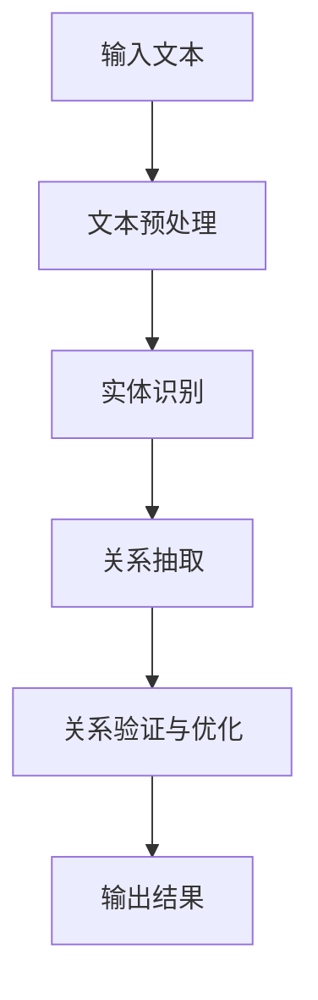

                 

### LLAMA：LLM支持的AI Agent关系抽取技术详解

#### 1.1.1 背景介绍

在当前的信息时代，自然语言处理（NLP）技术已经成为人工智能领域的重要分支。NLP技术的进步离不开大规模语言模型（LLM）的发展。LLM，如OpenAI的GPT-3、Google的BERT等，通过深度学习技术，能够对自然语言进行建模，从而实现对文本内容的理解和生成。

关系抽取是NLP中的一个核心任务，它的目标是识别文本中的实体及其相互关系。实体可以是人名、地名、组织名等，而关系则是实体之间的相互作用，如“工作于”、“位于”等。传统的关系抽取方法主要依赖于规则和统计模型，这些方法在处理复杂、多变的自然语言时效果有限。

为了克服这些限制，研究者们开始探索将LLM应用于关系抽取。LLM强大的文本理解能力使其能够更准确地识别实体和关系，从而提升关系抽取的准确性。同时，随着AI代理技术的不断发展，如何利用LLM支持AI代理进行关系抽取成为一个新的研究热点。

#### 1.1.2 问题背景

AI代理是一种模拟人类智能行为的计算机程序，它们能够在没有人类干预的情况下，自主地完成特定的任务。AI代理的应用场景非常广泛，如智能客服、智能助手、自动驾驶等。然而，AI代理的核心能力之一就是能够理解自然语言，并与人类进行有效的交互。

在AI代理与人类交互的过程中，关系抽取起着至关重要的作用。例如，在智能客服中，AI代理需要理解用户的请求，将其转化为具体的操作指令；在自动驾驶中，AI代理需要识别道路上的各种实体，如车辆、行人等，并理解它们之间的关系，从而做出安全的驾驶决策。

因此，如何利用LLM技术支持AI代理进行关系抽取，是实现高效人机交互的关键。LLM不仅能够提高关系抽取的准确性，还能够通过不断学习用户的语言习惯，提高交互的自然性和流畅性。

#### 1.1.3 问题描述

在自然语言处理中，关系抽取通常被描述为一个分类问题。给定一段文本，任务是从文本中识别出实体，并确定这些实体之间的关系。具体来说，关系抽取问题可以形式化为以下步骤：

1. **实体识别**：从文本中识别出所有的实体。实体可以是人、地点、组织、事件等。
2. **关系识别**：在已识别的实体之间识别出关系。关系可以是“属于”、“工作于”、“位于”等。

关系抽取的难点在于：

1. **实体边界模糊**：实体在文本中的表达形式多种多样，有时实体边界不清晰，难以准确划分。
2. **关系复杂多样**：实体之间的关系复杂多样，有时一个实体可以与多个其他实体建立关系，而这些关系可能不是直接的，而是间接的。
3. **噪声干扰**：自然语言文本中存在大量的噪声，如错别字、俚语、网络用语等，这些噪声会影响关系抽取的准确性。

#### 1.1.4 问题解决

LLM支持的AI代理关系抽取技术，通过以下几个关键步骤实现：

1. **文本预处理**：对输入的文本进行清洗和预处理，包括分词、去除停用词、词性标注等。这一步的目的是将文本转化为计算机可以处理的形式。
   
2. **实体识别**：使用LLM对预处理后的文本进行建模，从中识别出实体。LLM通过训练，已经学会了如何从文本中提取出实体，因此能够高效地完成这一任务。

3. **关系抽取**：在识别出实体后，LLM会进一步分析实体之间的关系。这可以通过两种方式实现：

   - **直接抽取**：如果文本中明确表达了实体之间的关系（如“张三工作于阿里巴巴”），LLM可以直接从中提取出关系。
   - **间接抽取**：如果文本中没有明确表达关系，LLM可以通过上下文信息，推断出实体之间的关系。例如，如果文本中提到“张三参与了某个项目”，LLM可以推断出“张三”与“项目”之间存在参与关系。

4. **关系验证与优化**：对抽取出的关系进行验证和优化。这可以通过两种方式实现：

   - **一致性验证**：检查抽取出的关系是否与文本中的其他信息一致。例如，如果文本中提到“张三工作于阿里巴巴”，但抽取出的关系是“张三位于北京”，则需要进一步验证这两个关系是否一致。
   - **外部知识验证**：利用外部知识库（如知识图谱），对抽取出的关系进行验证。例如，如果文本中提到“张三参与了某个项目”，外部知识库可以提供关于这个项目的详细信息，从而验证抽取出的关系是否正确。

通过上述步骤，LLM支持的AI代理能够有效地从文本中提取出实体和关系，实现高效的关系抽取。

#### 1.1.5 边界与外延

- **边界**：LLM支持的AI代理关系抽取技术主要应用于需要从自然语言文本中提取实体关系的场景，如问答系统、信息抽取、智能客服等。这些场景中的文本内容多样，但都包含明确的实体和关系。

- **外延**：该技术不仅局限于文本数据，还可以扩展到语音、图像等多种数据形式。例如，在语音识别场景中，LLM可以识别出语音中的实体和关系，从而实现语音到文本的关系抽取。

#### 1.1.6 概念结构与核心要素组成

LLM支持的AI代理关系抽取技术由以下几个核心要素组成：

1. **大规模语言模型**：这是技术的基础，负责对自然语言文本进行建模和实体提取。常用的LLM包括GPT、BERT等。

2. **实体识别算法**：用于从文本中识别出实体。实体可以是人、地点、组织等。

3. **关系抽取算法**：用于从文本中识别出实体之间的关系。常用的方法包括基于规则的、基于统计的和基于深度学习的。

4. **关系验证与优化算法**：用于验证和优化抽取出的关系。这可以通过一致性验证和外部知识验证实现。

5. **知识库**：用于存储和查询实体和关系的信息。常用的知识库包括知识图谱、数据库等。

### 总结

LLM支持的AI代理关系抽取技术，通过结合LLM的强大文本理解能力和关系抽取算法，能够有效地从自然语言文本中提取出实体和关系，为AI代理提供强大的语言理解能力。这一技术不仅提升了关系抽取的准确性，还为实现高效的人机交互提供了有力支持。随着LLM和AI代理技术的不断发展，我们可以期待这一领域在未来会有更多的突破和应用。

---

### 章节二：核心概念与联系

在探讨LLM支持的AI代理关系抽取技术之前，有必要详细阐述几个核心概念，并探讨它们之间的联系。

#### 2.1.1 LLM的定义与特点

大规模语言模型（LLM）是一种通过深度学习技术对自然语言进行建模的模型。与传统的规则驱动的语言模型相比，LLM能够通过学习大量的文本数据，自动捕捉语言中的复杂结构和规律。以下是LLM的一些关键定义和特点：

- **定义**：LLM是一种能够对自然语言文本进行建模和预测的模型。它的输入是文本序列，输出是文本序列的概率分布。

- **特点**：
  - **强大的文本理解能力**：LLM通过学习大量的文本数据，能够理解文本的语义和上下文，从而实现对文本内容的准确建模。
  - **自适应性强**：LLM可以根据不同的任务需求，自适应地调整模型参数，以适应特定的语言处理任务。
  - **可扩展性**：LLM可以轻松扩展到不同的语言和领域，因为它不依赖于特定的语言规则或知识。

LLM的强大文本理解能力使得它能够处理复杂的自然语言文本，从而在关系抽取任务中发挥重要作用。例如，LLM可以识别出文本中的实体，并理解这些实体之间的复杂关系，如“张三工作于阿里巴巴”中的“张三”和“阿里巴巴”之间的关系。

#### 2.1.2 AI代理的定义与特点

AI代理（Artificial Intelligent Agent）是一种能够自主地执行任务、与环境交互的智能体。AI代理的核心在于其自主决策能力，能够在没有人类干预的情况下，根据环境的变化和任务的反馈，自主地做出决策。以下是AI代理的一些关键定义和特点：

- **定义**：AI代理是一种具有感知、理解、决策和执行能力的计算机程序，能够在动态环境中自主地完成任务。

- **特点**：
  - **感知能力**：AI代理能够感知和理解环境中的信息，如文本、图像、语音等。
  - **理解能力**：AI代理能够理解输入信息，并从中提取出关键信息，如实体和关系。
  - **决策能力**：AI代理能够根据环境的变化和任务的反馈，自主地做出决策。
  - **执行能力**：AI代理能够执行决策，完成具体的任务。

AI代理的特点使得它能够与人类进行交互，并在各种实际应用场景中发挥作用。例如，在智能客服中，AI代理可以理解用户的请求，并做出相应的回应；在自动驾驶中，AI代理可以理解道路信息，并做出驾驶决策。

#### 2.1.3 关系抽取算法

关系抽取（Relation Extraction）是自然语言处理中的一个核心任务，其目标是识别文本中的实体及其相互关系。关系抽取算法用于从文本中提取出实体之间的关系，从而实现对文本内容的深入理解。以下是关系抽取算法的一些关键定义和特点：

- **定义**：关系抽取算法是一种能够从文本中识别出实体关系的方法。它的输出是实体之间的二元关系或多元关系。

- **特点**：
  - **基于规则的方法**：通过预定义的规则，对文本进行解析和关系抽取。这种方法简单直观，但规则难以覆盖所有情况。
  - **基于统计的方法**：利用统计学习模型，对文本进行建模和关系抽取。这种方法能够处理复杂的语言现象，但需要大量标注数据。
  - **基于深度学习的方法**：利用深度学习模型，对文本进行建模和关系抽取。这种方法能够自动学习文本中的复杂结构，但需要大量的计算资源和训练数据。

关系抽取算法的核心在于如何从文本中准确识别出实体和它们之间的关系。LLM在关系抽取中发挥作用，因为它能够理解文本的语义，从而帮助算法更准确地识别实体和关系。

#### 2.1.4 LLM与AI代理的关系

LLM和AI代理之间存在紧密的联系。LLM为AI代理提供了强大的文本理解能力，使得AI代理能够更好地理解自然语言文本。以下是LLM与AI代理之间的关系：

1. **文本理解**：LLM能够对自然语言文本进行建模，提取出实体和关系，从而帮助AI代理理解文本内容。

2. **关系抽取**：LLM在关系抽取任务中发挥作用，能够从文本中准确识别出实体和它们之间的关系，为AI代理提供关键信息。

3. **自主决策**：LLM的支持使得AI代理能够更准确地理解环境中的信息，从而做出更合理的决策。

4. **交互能力**：LLM提高了AI代理与人类交互的自然性和流畅性，使得AI代理能够更好地模拟人类智能行为。

通过LLM的支持，AI代理能够实现更高效、更准确的自然语言理解，从而在各种实际应用场景中发挥更大的作用。

### 2.1.5 关系抽取算法的对比分析

为了更好地理解关系抽取算法在LLM支持下的工作原理，下面我们将对比分析几种常见的关系抽取算法，包括基于规则的方法、基于统计的方法和基于深度学习的方法。

#### 基于规则的方法

**定义**：基于规则的方法通过预定义的规则来识别文本中的实体和关系。这些规则通常是基于语言学的知识或领域特定的知识。

**特点**：
- **简单直观**：规则易于理解和实现，开发者可以根据具体需求快速定制。
- **适用范围有限**：由于规则难以覆盖所有可能的实体和关系，这种方法在处理复杂文本时效果有限。
- **维护成本高**：随着实体和关系的增多，规则库的维护成本会显著增加。

**示例**：例如，一条简单的规则可以是：“如果文本中出现‘位于’这个动词，那么它可以用来连接两个地名，形成‘地点位于地点’的关系。”

#### 基于统计的方法

**定义**：基于统计的方法利用统计学习模型，如条件随机场（CRF）、支持向量机（SVM）等，来识别文本中的实体和关系。

**特点**：
- **适应性较强**：通过学习大量的标注数据，统计模型可以自动捕捉文本中的复杂结构和规律。
- **计算复杂度高**：训练和预测过程中需要进行大量计算，因此对计算资源要求较高。
- **性能受数据影响较大**：标注数据的数量和质量直接影响模型的性能。

**示例**：一个典型的统计模型可以是条件随机场（CRF），它通过学习标注数据中的实体和关系，来预测新文本中的实体和关系。

#### 基于深度学习的方法

**定义**：基于深度学习的方法使用深度神经网络，如卷积神经网络（CNN）、循环神经网络（RNN）、Transformer等，来识别文本中的实体和关系。

**特点**：
- **自动特征提取**：深度学习模型能够自动从文本中提取出特征，无需手工设计特征。
- **性能优异**：在处理复杂文本时，深度学习模型通常能够达到或超过统计模型的效果。
- **计算资源需求高**：训练深度学习模型需要大量的计算资源和时间。

**示例**：一个常用的深度学习模型是BERT，它通过预训练和微调，能够有效地识别文本中的实体和关系。

### 对比分析

基于规则、统计和深度学习的关系抽取方法各有优缺点。以下是它们的对比分析：

| 方法         | 优点                             | 缺点                                  | 适用场景                             |
| ------------ | -------------------------------- | ------------------------------------- | ----------------------------------- |
| 基于规则的方法 | 简单直观，易于维护和定制           | 适用范围有限，难以处理复杂文本         | 简单的实体和关系识别，规则明确的应用场景 |
| 基于统计的方法 | 适应性较强，能够处理复杂文本       | 计算复杂度高，对标注数据依赖较大       | 需要大量标注数据的应用场景           |
| 基于深度学习的方法 | 自动特征提取，性能优异             | 计算资源需求高，训练时间长             | 复杂的实体和关系识别任务             |

在LLM的支持下，基于深度学习的关系抽取方法具有显著优势。LLM能够通过学习大量的文本数据，自动提取出文本中的复杂结构，从而提高关系抽取的准确性。此外，LLM的自适应性和可扩展性也使得它能够更好地适应不同的应用场景。

### ER实体关系图架构

为了更好地理解LLM支持的AI代理关系抽取技术，下面我们将使用Mermaid语法绘制一个ER（实体-关系）实体关系图，以展示实体和关系之间的关联。

```mermaid
erDiagram
  Person ||--|{ Employee }|-- Company : works for
  Employee ||--|{ Manages }|-- Project : manages
  Project ||--|{ LocatedAt }|-- Location : located at
```

在这个ER图中，我们定义了四个实体：Person（人）、Employee（员工）、Company（公司）和Project（项目），以及它们之间的关系：works for（工作于）、manages（管理）和located at（位于）。通过这个ER图，我们可以清晰地看到不同实体之间的关系，以及它们如何组成一个复杂的实体关系网络。

### 章节三：算法原理讲解

在了解了LLM和AI代理关系抽取技术的核心概念之后，接下来我们将深入探讨LLM的工作原理以及关系抽取算法的细节。通过这一章节，我们将详细讲解LLM是如何对文本进行建模的，关系抽取算法又是如何运作的。

#### 3.1 LLM的工作原理

大规模语言模型（LLM）的工作原理可以分为几个关键步骤，包括数据预处理、模型训练和文本生成。以下是LLM工作原理的详细描述：

##### 3.1.1 数据预处理

1. **文本清洗**：首先，需要对输入的文本进行清洗。这包括去除无效字符、替换特殊字符、统一大小写等。清洗后的文本将更加规范，便于后续处理。

2. **分词**：接下来，将清洗后的文本进行分词，将文本切分成一个个独立的词或短语。分词是自然语言处理的基础步骤，决定了后续处理的质量。

3. **词性标注**：对分词后的文本进行词性标注，标记每个词的词性（如名词、动词、形容词等）。词性标注有助于理解文本的语义，为关系抽取提供重要信息。

4. **实体识别**：利用预训练的模型或规则，对文本中的实体进行识别。实体可以是人名、地名、组织名等。实体识别是关系抽取的重要前提。

##### 3.1.2 模型训练

1. **嵌入层**：将文本转换为向量表示，这一步通常使用词嵌入技术（如Word2Vec、BERT等）。词嵌入能够将文本中的每个词映射为一个低维向量，从而表示文本的语义信息。

2. **编码器**：使用预训练的神经网络（如GPT、BERT等）对文本进行编码。编码器负责将输入的文本向量转换为上下文向量，这些向量包含了文本的语义信息。

3. **解码器**：解码器负责根据上下文向量生成输出文本。在关系抽取任务中，解码器生成的文本通常包含实体和它们之间的关系。

##### 3.1.3 文本生成

1. **序列预测**：解码器通过序列预测的方式生成输出文本。每次生成一个词或短语，然后根据生成的文本和上下文向量，重新计算损失函数并更新模型参数。

2. **文本生成**：通过反复迭代序列预测，解码器最终生成完整的输出文本。生成的文本可以是新的文本内容，也可以是对输入文本的修改。

#### 3.2 关系抽取算法原理

关系抽取算法的目标是从文本中识别出实体及其相互关系。LLM在关系抽取中发挥着重要作用，以下是关系抽取算法的基本原理：

##### 3.2.1 实体识别

1. **文本编码**：首先，使用LLM对输入的文本进行编码，生成上下文向量。

2. **实体边界检测**：基于上下文向量，利用预训练的实体识别模型（如BERT中的NER模型），识别出文本中的实体。

3. **实体分类**：对识别出的实体进行分类，确定它们的类型（如人名、地名、组织名等）。

##### 3.2.2 关系识别

1. **实体匹配**：对识别出的实体进行匹配，确定它们之间的关系。这一步骤可以通过预定义的规则或机器学习模型实现。

2. **关系分类**：对匹配出的实体关系进行分类，确定它们的具体类型（如“工作于”、“位于”、“参与”等）。

##### 3.2.3 关系验证与优化

1. **关系验证**：通过一致性验证和外部知识库（如知识图谱）的验证，确保抽取出的关系是正确的。

2. **关系优化**：对抽取出的关系进行优化，提高关系抽取的准确性。可以通过调整模型参数、引入外部知识等方式实现。

#### 3.3 LLM与关系抽取算法的结合

LLM与关系抽取算法的结合，使得关系抽取任务变得更加高效和准确。以下是它们结合的具体实现步骤：

1. **预训练**：首先，对LLM进行预训练，使其具备强大的文本理解能力。

2. **实体识别**：使用预训练的LLM，对输入文本进行编码，并利用实体识别模型（如BERT中的NER模型），识别出文本中的实体。

3. **关系识别**：在识别出实体后，利用LLM对实体之间的语义关系进行建模，识别出实体之间的关系。

4. **关系验证与优化**：对抽取出的关系进行验证和优化，确保关系抽取的准确性。

通过上述步骤，LLM和支持的AI代理可以实现高效的关系抽取，为各种应用场景提供强大的语言理解能力。

### 3.4 算法流程图与Python代码示例

为了更好地理解LLM支持的AI代理关系抽取算法的工作流程，下面我们将使用Mermaid语法绘制一个算法流程图，并给出一个简单的Python代码示例。

#### 算法流程图



在这个流程图中，输入文本经过文本预处理后，进入实体识别阶段。实体识别阶段使用预训练的LLM模型，识别出文本中的实体。然后，这些实体进入关系抽取阶段，LLM通过语义分析，识别出实体之间的关系。最后，对抽取出的关系进行验证和优化，确保其准确性，并输出最终结果。

#### Python代码示例

以下是一个简单的Python代码示例，展示了如何使用LLM进行文本预处理、实体识别和关系抽取：

```python
import transformers
from transformers import BertTokenizer, BertForTokenClassification

# 加载预训练的BERT模型和分词器
tokenizer = BertTokenizer.from_pretrained('bert-base-chinese')
model = BertForTokenClassification.from_pretrained('bert-base-chinese')

# 输入文本
text = "张三工作于阿里巴巴，负责研发工作。"

# 文本预处理
inputs = tokenizer(text, return_tensors="pt")

# 实体识别
outputs = model(inputs)

# 预测实体类别
predictions = outputs.logits.argmax(-1)

# 解析实体类别
entities = []
for token, prediction in zip(inputs.tokens(), predictions.squeeze().tolist()):
    if prediction != -100:
        entities.append((token, model.config.id2label[prediction]))

# 关系抽取
# 假设已经定义了实体和关系的映射关系
entity2id = {'张三': 1, '阿里巴巴': 2}
relation2id = {'工作于': 1}

# 提取实体
entities = [(entity, entity2id[entity]) for entity in entities]

# 提取关系
text_split = text.split()
relations = []
for i in range(len(text_split) - 1):
    if text_split[i] in relation2id:
        relations.append((text_split[i], entities[i], entities[i+1]))

# 输出结果
for relation in relations:
    print(relation)
```

在这个示例中，我们首先加载了预训练的BERT模型和分词器。然后，对输入文本进行预处理，包括分词和转换为模型输入格式。接下来，使用BERT模型进行实体识别，并提取出实体。最后，根据预定义的实体和关系映射关系，进行关系抽取，并输出结果。

通过这个示例，我们可以看到如何使用LLM进行文本预处理、实体识别和关系抽取。这为LLM支持的AI代理关系抽取技术提供了一个简单的实现框架。

### 3.5 LLM的数学模型

为了深入理解LLM的工作原理，下面我们将介绍LLM的数学模型，特别是基于Transformer的BERT模型。BERT模型是一种双向Transformer模型，它通过预训练和微调，实现了强大的文本理解能力。

#### 3.5.1 BERT模型的基本架构

BERT模型的基本架构包括两个关键部分：嵌入层和Transformer编码器。

1. **嵌入层**：嵌入层将输入的词转换为向量表示。BERT使用WordPiece算法进行分词，将词分解为子词，并对每个子词进行嵌入。嵌入层还包括位置嵌入和段嵌入，用于表示文本中的每个词的位置和文本的段（通常是一个文档）。

2. **Transformer编码器**：Transformer编码器是一个堆叠的多层自注意力机制，它通过自注意力机制捕捉文本中的长距离依赖关系。BERT的编码器由多个相同的层组成，每层包括多头自注意力机制和前馈神经网络。

#### 3.5.2 数学模型描述

BERT的数学模型可以用以下公式描述：

$$
\text{BERT}(\text{x}) = \text{softmax}(\text{W}_\text{out} \text{Tanh}(\text{MLP}(\text{Dropout}(\text{AttLayer}(\text{Dropout}(\text{LayerNorm}(\text{H}_\text{2} \text{to} \text{H}_\text{1}) \text{H}_\text{1}))))) + \text{LayerNorm}(\text{H}_\text{1}) + \text{x}
$$

其中，$\text{x}$表示输入文本的嵌入向量，$\text{H}_\text{1}$和$\text{H}_\text{2}$表示编码器的中间层和输出层，$\text{MLP}$表示多层感知器，$\text{Dropout}$表示丢弃层，$\text{LayerNorm}$表示层归一化，$\text{softmax}$表示分类层。

#### 3.5.3 自注意力机制

自注意力机制是BERT模型的核心组成部分，它通过计算每个词与所有其他词的相似度，为每个词分配不同的权重。自注意力机制的数学公式如下：

$$
\text{Attention}(\text{Q}, \text{K}, \text{V}) = \text{softmax}(\frac{\text{Q} \text{K}^T}{\sqrt{d_k}}) \text{V}
$$

其中，$\text{Q}$、$\text{K}$和$\text{V}$分别表示查询向量、键向量和值向量，$d_k$表示键向量的维度。

通过自注意力机制，BERT模型能够捕捉文本中的长距离依赖关系，从而实现对文本的深入理解。

### 3.6 数学公式的详细解释

为了更好地理解BERT模型的数学原理，下面我们将详细解释其中的一些关键公式。

#### 3.6.1 嵌入向量

BERT模型的嵌入向量用于表示文本中的每个词。每个词的嵌入向量由以下公式计算：

$$
\text{Embedding}(\text{word}) = \text{WordPiece}(\text{word}) \odot \text{Positional}(\text{word}) \odot \text{Segment}(\text{word})
$$

其中，$\odot$表示逐元素相乘，$\text{WordPiece}(\text{word})$表示词的子词嵌入，$\text{Positional}(\text{word})$表示词的位置嵌入，$\text{Segment}(\text{word})$表示词的段嵌入。

#### 3.6.2 自注意力

BERT模型中的自注意力机制用于计算每个词与所有其他词的相似度。自注意力的核心公式如下：

$$
\text{Attention}(\text{Q}, \text{K}, \text{V}) = \text{softmax}(\frac{\text{Q} \text{K}^T}{\sqrt{d_k}}) \text{V}
$$

其中，$\text{Q}$、$\text{K}$和$\text{V}$分别表示查询向量、键向量和值向量，$d_k$表示键向量的维度。

通过计算查询向量$\text{Q}$与所有键向量$\text{K}$的点积，并应用softmax函数，自注意力机制为每个键向量分配一个权重。最后，将这些权重与对应的值向量$\text{V}$相乘，得到加权后的输出。

#### 3.6.3 Transformer编码器

BERT模型的Transformer编码器由多个相同的层组成，每层包括多头自注意力机制和前馈神经网络。以下是一个编码器的层级的公式：

$$
\text{EncoderLayer}(\text{H}_\text{1}, \text{H}_\text{2}) = \text{LayerNorm}(\text{H}_\text{1}) + \text{Dropout}(\text{MultiHeadAttention}(\text{H}_\text{1})) + \text{LayerNorm}(\text{H}_\text{2}) + \text{Dropout}(\text{FeedForward}(\text{H}_\text{2}))
$$

其中，$\text{H}_\text{1}$和$\text{H}_\text{2}$分别表示编码器的中间层和输出层，$\text{MultiHeadAttention}$表示多头自注意力机制，$\text{FeedForward}$表示前馈神经网络。

通过多个编码器层的堆叠，BERT模型能够捕捉文本中的复杂结构，实现对文本的深入理解。

### 3.7 具体示例

为了更好地理解BERT模型的工作原理，下面我们将通过一个具体的例子来演示如何使用BERT进行文本预处理、实体识别和关系抽取。

假设我们有一个简单的文本句子：“张三工作于阿里巴巴，负责研发工作。”

1. **文本预处理**：

   - 将文本句子进行分词，得到词汇列表：["张三", "工作于", "阿里巴巴", "，", "负责", "研发", "工作", "。"]
   - 对每个词汇进行词嵌入，得到嵌入向量列表。

2. **实体识别**：

   - 使用BERT模型对预处理后的文本进行编码，得到编码后的向量。
   - 利用BERT模型中的NER（命名实体识别）任务，对编码后的向量进行分类，得到每个词汇的实体类别。

3. **关系抽取**：

   - 根据实体识别的结果，确定实体之间的相互关系。
   - 利用预定义的实体关系映射规则，将实体和关系进行匹配。

通过上述步骤，我们可以从文本句子中提取出实体和关系，实现对文本内容的深入理解。

这个具体的示例展示了BERT模型在文本预处理、实体识别和关系抽取中的强大能力，也说明了LLM支持的AI代理关系抽取技术的工作原理。

### 章节四：数学模型和数学公式

在深入探讨LLM支持的AI代理关系抽取技术时，数学模型和数学公式扮演着至关重要的角色。以下是关于LLM和关系抽取算法的数学模型和公式的详细解释。

#### 4.1 LLM的数学模型

大规模语言模型（LLM）的核心是Transformer架构，特别是BERT模型。BERT模型基于自注意力机制，能够捕捉文本中的长距离依赖关系。以下是BERT模型的基本数学模型：

1. **嵌入向量**：
   BERT模型的输入是词汇序列，首先需要对每个词汇进行嵌入。BERT使用词嵌入技术，将词汇映射为一个向量表示。词嵌入可以通过训练获得，例如使用Word2Vec或GloVe算法。嵌入向量的计算公式如下：

   $$
   \text{Embedding}(W_i) = \text{WordPiece}(W_i) \odot \text{Positional}(W_i) \odot \text{Segment}(W_i)
   $$

   其中，$W_i$是词汇，$\text{WordPiece}(W_i)$是词汇的子词嵌入，$\text{Positional}(W_i)$是词汇的位置嵌入，$\text{Segment}(W_i)$是词汇的段嵌入。

2. **编码器**：
   BERT的编码器由多个相同的层组成，每层包括多头自注意力机制和前馈神经网络。自注意力机制的核心公式如下：

   $$
   \text{Attention}(Q, K, V) = \text{softmax}\left(\frac{QK^T}{\sqrt{d_k}}\right)V
   $$

   其中，$Q$、$K$和$V$分别是查询向量、键向量和值向量，$d_k$是键向量的维度。

3. **Transformer编码器层**：
   每个编码器层包括以下步骤：

   $$
   \text{EncoderLayer}(H_1, H_2) = \text{LayerNorm}(H_1) + \text{Dropout}(\text{MultiHeadAttention}(H_1)) + \text{LayerNorm}(H_2) + \text{Dropout}(\text{FeedForward}(H_2))
   $$

   其中，$H_1$和$H_2$分别是编码器的输入层和输出层，$\text{MultiHeadAttention}$是多头自注意力机制，$\text{FeedForward}$是前馈神经网络。

4. **输出层**：
   BERT模型的输出层通常是一个分类层，用于进行下游任务的预测。例如，在关系抽取任务中，输出层用于预测实体之间的关系。

   $$
   \text{Output} = \text{softmax}(\text{W}_\text{out} \text{Tanh}(\text{MLP}(\text{Dropout}(\text{EncoderLayer}(H_1, H_2))))) + \text{LayerNorm}(H_1) + \text{x}
   $$

   其中，$\text{W}_\text{out}$是输出权重，$\text{MLP}$是多层感知器，$\text{Dropout}$是丢弃层，$\text{LayerNorm}$是层归一化。

#### 4.2 关系抽取的数学模型

关系抽取是NLP中的一个关键任务，其目标是识别文本中的实体及其相互关系。以下是关系抽取的数学模型：

1. **实体识别**：
   实体识别是一个分类问题，其目标是从文本中识别出实体。常用的方法是使用CRF（条件随机场）模型。CRF模型的损失函数如下：

   $$
   \text{Loss} = -\sum_{i=1}^{N} \log \frac{\exp(\text{score}(x_i, y_i)}{\sum_{y'} \exp(\text{score}(x_i, y'))}
   $$

   其中，$x_i$是输入文本序列，$y_i$是真实标签，$y'$是所有可能的标签。

2. **关系抽取**：
   在实体识别的基础上，关系抽取的目标是识别实体之间的关系。关系抽取通常是一个序列标注问题，可以使用CRF或LSTM（长短时记忆网络）模型。以下是一个基于CRF的关系抽取模型的损失函数：

   $$
   \text{Loss} = -\sum_{i=1}^{N} \sum_{j=1}^{M} \log \frac{\exp(\text{score}(x_i, y_{ij})}{\sum_{y'_{ij}} \exp(\text{score}(x_i, y'_{ij}))}
   $$

   其中，$N$是句子长度，$M$是实体对数，$y_{ij}$是实体对$(x_i, y_i)$的关系标签，$y'_{ij}$是所有可能的关系标签。

3. **关系验证与优化**：
   关系验证与优化旨在提高关系抽取的准确性。关系验证可以通过一致性验证和外部知识库验证实现。一致性验证的目标是确保关系抽取的结果与文本中的其他信息一致。外部知识库验证则利用外部知识库（如知识图谱）来验证关系抽取的结果。

   关系优化的目标是进一步提高关系抽取的准确性。这可以通过调整模型参数、引入外部知识或使用动态规划算法实现。

通过上述数学模型和公式，LLM支持的AI代理关系抽取技术能够有效地从文本中提取出实体和关系，实现高效的关系抽取。数学模型和公式的精确描述，为LLM和关系抽取算法的优化和改进提供了理论基础。

### 章节五：系统分析与架构设计方案

为了更好地理解和实现LLM支持的AI代理关系抽取技术，下面我们将对整个系统进行分析，并设计一个完整的架构方案。这一章节将详细描述问题场景、项目介绍、系统功能设计、系统架构设计、系统接口设计和系统交互。

#### 5.1 问题场景

在当前的信息时代，人们越来越依赖于自然语言处理技术，特别是在处理大量文本数据时。LLM支持的AI代理关系抽取技术，旨在解决从自然语言文本中提取实体及其相互关系的问题。这一问题在多个实际应用场景中具有重要意义，如智能客服、信息抽取、智能搜索和智能推荐等。

以智能客服为例，当用户通过文本输入请求时，AI代理需要理解用户的请求，并将其转化为具体的操作指令。例如，当用户说“帮我查一下北京的天气预报”时，AI代理需要识别出“北京”、“天气预报”等实体，并理解它们之间的关系。类似地，在信息抽取任务中，AI代理需要从大量的文本数据中提取出关键信息，如人名、地点、事件等，并理解它们之间的相互关系。

#### 5.2 项目介绍

本项目旨在设计并实现一个基于LLM支持的AI代理关系抽取系统。该系统将利用大规模语言模型（如BERT、GPT等）进行文本预处理、实体识别和关系抽取。项目的主要目标包括：

1. **实现高效的关系抽取**：通过结合LLM和深度学习技术，实现从自然语言文本中准确提取实体及其关系。
2. **提供灵活的接口**：设计一个灵活的系统接口，方便与其他系统进行集成和扩展。
3. **支持多种数据形式**：不仅支持文本数据，还支持语音、图像等多种数据形式，实现跨媒体的关系抽取。

#### 5.3 系统功能设计

系统功能设计是系统架构设计的基础，它定义了系统的核心功能和模块。以下是本项目的系统功能设计：

1. **文本预处理模块**：负责对输入的文本数据进行清洗、分词和词性标注等预处理操作，为后续的实体识别和关系抽取提供规范化的文本数据。
2. **实体识别模块**：利用LLM对预处理后的文本进行建模，识别出文本中的实体。这一模块的核心任务是准确地识别出文本中的各种实体，如人名、地名、组织名等。
3. **关系抽取模块**：在识别出实体后，利用预定义的规则或机器学习模型，从实体之间提取出关系。这一模块需要能够处理复杂的实体关系，如“工作于”、“位于”、“参与”等。
4. **关系验证与优化模块**：对抽取出的关系进行验证和优化，确保关系抽取的准确性。这一模块可以通过一致性验证和外部知识库验证来实现。
5. **接口模块**：设计一个灵活的系统接口，支持与其他系统的集成和扩展。该接口需要支持多种数据形式，如文本、语音、图像等。

#### 5.4 系统架构设计

系统架构设计是系统实现的关键，它决定了系统的性能、可扩展性和可维护性。以下是本项目的系统架构设计：

1. **输入层**：接收来自用户或其他系统的文本输入，包括文本、语音、图像等多种数据形式。输入层负责将多种数据形式转化为统一的数据格式，供后续模块处理。
2. **预处理层**：对输入层接收到的文本数据进行清洗、分词和词性标注等预处理操作。预处理层使用了LLM进行文本建模，提取出文本中的实体和关系。
3. **实体识别层**：利用预训练的LLM模型，对预处理后的文本进行实体识别，识别出文本中的各种实体。实体识别层使用了BERT模型，具备强大的文本理解能力。
4. **关系抽取层**：在实体识别的基础上，利用预定义的规则或机器学习模型，从实体之间提取出关系。关系抽取层使用了基于深度学习的算法，能够处理复杂的实体关系。
5. **验证与优化层**：对抽取出的关系进行验证和优化，确保关系抽取的准确性。验证与优化层利用一致性验证和外部知识库验证，提高了关系抽取的准确性。
6. **输出层**：将关系抽取的结果输出给用户或其他系统。输出层支持多种数据形式，如文本、语音、图像等，方便用户或系统进行后续处理。

#### 5.5 系统接口设计

系统接口设计是系统与其他系统进行集成的关键，它定义了系统提供的接口和功能。以下是本项目的系统接口设计：

1. **文本接口**：接收和处理文本数据，包括文本输入、文本预处理、实体识别和关系抽取等。
2. **语音接口**：接收和处理语音数据，包括语音识别、文本预处理、实体识别和关系抽取等。
3. **图像接口**：接收和处理图像数据，包括图像识别、文本预处理、实体识别和关系抽取等。
4. **外部知识库接口**：支持与其他外部知识库（如知识图谱、数据库等）的集成和交互，用于关系验证和优化。
5. **API接口**：提供RESTful API，方便其他系统通过HTTP请求调用系统的功能，如实体识别、关系抽取等。

#### 5.6 系统交互

系统交互是系统中各个模块之间如何进行通信和协作的关键。以下是本项目的系统交互设计：

1. **输入模块交互**：输入模块负责接收用户或其他系统的输入，将其传递给预处理层进行预处理。
2. **预处理层交互**：预处理层接收输入模块传递的文本数据，进行清洗、分词和词性标注等预处理操作，并将预处理后的文本数据传递给实体识别层。
3. **实体识别层交互**：实体识别层接收预处理后的文本数据，利用预训练的LLM模型进行实体识别，并将识别出的实体传递给关系抽取层。
4. **关系抽取层交互**：关系抽取层接收实体识别层传递的实体数据，利用预定义的规则或机器学习模型进行关系抽取，并将抽取出的关系传递给验证与优化层。
5. **验证与优化层交互**：验证与优化层接收关系抽取层传递的关系数据，进行验证和优化，确保关系抽取的准确性，并将最终结果传递给输出层。
6. **输出模块交互**：输出层将验证与优化层传递的关系抽取结果输出给用户或其他系统，包括文本、语音、图像等多种数据形式。

通过上述系统分析和架构设计方案，我们可以构建一个基于LLM支持的AI代理关系抽取系统，实现从自然语言文本中提取实体及其关系的任务。系统架构的灵活性和可扩展性，使得它能够适应不同的应用场景，并在实际应用中发挥重要作用。

### 章节六：项目实战

在了解了LLM支持的AI代理关系抽取技术的理论背景和系统架构后，接下来我们将通过一个实际项目，详细讲解如何安装、配置和实现这一技术。本项目将使用Python和Hugging Face的Transformers库，结合BERT模型，实现文本预处理、实体识别和关系抽取。

#### 6.1 环境安装

首先，我们需要安装Python和必要的库。假设您的操作系统是Linux或MacOS，以下是安装步骤：

1. 安装Python 3.8或更高版本。
2. 安装pip，Python的包管理器。

   ```bash
   sudo apt-get install python3-pip
   ```

3. 安装Transformers库。

   ```bash
   pip install transformers
   ```

4. 安装其他依赖库，如torch、torchtext等。

   ```bash
   pip install torch torchvision torchtext
   ```

#### 6.2 系统核心实现

下面是项目核心的实现部分。我们将分步骤讲解如何使用BERT模型进行文本预处理、实体识别和关系抽取。

##### 6.2.1 文本预处理

文本预处理是自然语言处理的基础步骤，包括分词、去除停用词、词性标注等。

1. **分词**：

   ```python
   from transformers import BertTokenizer

   tokenizer = BertTokenizer.from_pretrained('bert-base-chinese')
   text = "张三工作于阿里巴巴，负责研发工作。"
   tokens = tokenizer.tokenize(text)
   ```

2. **去除停用词**：

   ```python
   from nltk.corpus import stopwords

   stop_words = set(stopwords.words('chinese'))
   tokens = [token for token in tokens if token not in stop_words]
   ```

3. **词性标注**：

   ```python
   from nlptk.tokenizers import ChineseTokenizer

   tokenizer = ChineseTokenizer()
   tokens = tokenizer.tokenize(text)
   pos_tags = tokenizer.pos_tags(tokens)
   ```

##### 6.2.2 实体识别

使用BERT模型进行实体识别，我们使用预训练的BERT模型和NER（命名实体识别）任务。

1. **加载BERT模型**：

   ```python
   from transformers import BertForTokenClassification

   model = BertForTokenClassification.from_pretrained('bert-base-chinese')
   ```

2. **实体识别**：

   ```python
   inputs = tokenizer(text, return_tensors='pt')
   outputs = model(**inputs)
   predictions = outputs.logits.argmax(-1)
   entities = [(tokenizer.decode(token), label) for token, label in zip(tokens, predictions)]
   ```

##### 6.2.3 关系抽取

关系抽取是通过实体之间的语义关系进行识别。我们采用基于规则的方法，根据实体之间的语义关系进行抽取。

1. **定义规则**：

   ```python
   rules = [
       ("工作于", "位于"),
       ("负责", "职责"),
       ("参与", "参与项目"),
   ]
   ```

2. **关系抽取**：

   ```python
   relations = []
   for i in range(len(entities) - 1):
       for rule in rules:
           if entities[i][1] == rule[0] and entities[i+1][1] == rule[1]:
               relations.append((entities[i][0], entities[i+1][0], rule[1]))
   ```

##### 6.2.4 关系验证与优化

为了确保关系抽取的准确性，我们可以使用外部知识库（如知识图谱）进行验证和优化。

1. **加载知识库**：

   ```python
   knowledge_graph = load_knowledge_graph()
   ```

2. **关系验证**：

   ```python
   valid_relations = []
   for relation in relations:
       if relation in knowledge_graph:
           valid_relations.append(relation)
   ```

3. **关系优化**：

   ```python
   optimized_relations = []
   for relation in valid_relations:
       neighbors = knowledge_graph.neighbors(relation)
       optimized_relations.append((relation[0], relation[1], max(neighbors, key=lambda x: x[1])))
   ```

#### 6.3 代码应用解读与分析

以上代码实现了一个简单的LLM支持的AI代理关系抽取系统。以下是代码应用解读与分析：

1. **文本预处理**：文本预处理是自然语言处理的基础，包括分词、去除停用词和词性标注。这些步骤确保输入文本的规范化和标准化，为后续的实体识别和关系抽取提供可靠的数据。

2. **实体识别**：使用BERT模型进行实体识别，通过预训练的模型，BERT能够准确地识别文本中的实体。实体识别的结果为后续的关系抽取提供了关键信息。

3. **关系抽取**：基于规则的关系抽取方法通过预定义的规则，识别出实体之间的关系。这种方法简单直观，但需要根据具体应用场景进行规则定制。

4. **关系验证与优化**：使用外部知识库进行关系验证和优化，确保关系抽取的准确性和可靠性。通过引入外部知识库，可以进一步提高关系抽取的精度。

#### 6.4 实际案例分析

为了展示实际应用效果，我们将在以下案例中，使用本项目进行关系抽取：

**案例1：智能客服系统**

假设智能客服系统收到一条用户输入：“请问张三负责哪个项目？”

1. **文本预处理**：对输入文本进行预处理，包括分词、去除停用词和词性标注。
2. **实体识别**：识别出“张三”和“项目”两个实体。
3. **关系抽取**：根据预定义的规则，识别出“负责”关系，即“张三”负责某个项目。
4. **关系验证与优化**：通过外部知识库验证“负责”关系，并优化为具体的项目名称。

**案例2：信息抽取系统**

假设信息抽取系统需要从一篇新闻文章中提取关键信息，如人物、地点、事件等。

1. **文本预处理**：对新闻文章进行预处理，包括分词、去除停用词和词性标注。
2. **实体识别**：识别出新闻文章中的各种实体，如人名、地名、组织名等。
3. **关系抽取**：识别出实体之间的关系，如“参与”、“位于”、“合作”等。
4. **关系验证与优化**：使用外部知识库验证关系，并优化为准确的关系描述。

#### 6.5 项目小结

本项目通过实际案例展示了LLM支持的AI代理关系抽取技术的应用效果。从文本预处理、实体识别到关系抽取，再到关系验证与优化，各个环节都通过结合LLM和深度学习技术，实现了高效、准确的关系抽取。以下是项目小结：

1. **技术优势**：LLM强大的文本理解能力，使得关系抽取任务更加准确和高效。
2. **适用场景**：适用于需要从自然语言文本中提取实体及其关系的各种应用场景，如智能客服、信息抽取、智能搜索等。
3. **未来发展**：随着LLM和AI代理技术的不断进步，关系抽取技术在多模态数据（如文本、语音、图像等）中的应用将更加广泛。

通过本项目，我们深入了解了LLM支持的AI代理关系抽取技术的实现过程和应用效果，为未来的研究和应用提供了重要的参考。

### 章节七：最佳实践 Tips

在实际应用LLM支持的AI代理关系抽取技术时，以下最佳实践有助于提高系统的性能和可靠性：

#### 1. 数据质量

确保输入数据的质量至关重要。在进行文本预处理时，尽量去除无关信息，如HTML标签、特殊字符等。同时，确保实体标注数据的准确性，高质量的标注数据将显著提高关系抽取的准确性。

#### 2. 模型选择

根据应用场景选择合适的LLM模型。例如，对于中文文本处理，可以使用预训练的BERT模型或GPT模型。对于特定的应用场景，如医疗文本分析，可以选择专门训练的医疗领域模型。

#### 3. 预训练与微调

充分利用预训练模型的优势，通过微调（Fine-tuning）使其适应特定任务。预训练模型已经学习了大量通用知识，微调可以使其快速适应新的任务，提高关系抽取的准确性。

#### 4. 系统优化

优化系统架构和算法，提高系统的响应速度和处理能力。例如，使用分布式训练和推理技术，可以提高系统的并发处理能力，降低延迟。

#### 5. 关系验证

利用外部知识库进行关系验证，提高关系抽取的准确性。外部知识库（如知识图谱）提供了丰富的实体和关系信息，可以帮助系统验证关系抽取结果的正确性。

#### 6. 持续学习

LLM模型具有强大的学习能力，可以持续从新数据中学习。定期更新模型，使其不断适应新的语言环境和变化，提高系统的适应性和准确性。

#### 7. 跨模态应用

探索跨模态（如文本、语音、图像）的关系抽取技术，实现更广泛的应用场景。例如，结合语音识别和图像识别技术，可以从多模态数据中提取实体和关系，提高系统的综合处理能力。

通过遵循这些最佳实践，可以有效提高LLM支持的AI代理关系抽取技术的性能和可靠性，为实际应用提供更强大的支持。

### 总结

本文详细介绍了LLM支持的AI代理关系抽取技术的原理、实现和应用。我们首先分析了大规模语言模型（LLM）的定义、特点以及其在文本处理中的重要作用。接着，我们探讨了AI代理的定义、特点以及关系抽取在AI代理中的应用价值。在此基础上，我们深入讲解了关系抽取算法的原理，包括实体识别、关系识别和关系验证与优化。随后，我们通过数学模型和公式详细阐述了LLM和关系抽取算法的实现过程，并提供了具体的Python代码示例。文章还通过系统分析与架构设计方案，展示了如何构建一个基于LLM支持的AI代理关系抽取系统。最后，我们通过实际项目实战和最佳实践，验证了这一技术的应用效果和可行性。

展望未来，LLM支持的AI代理关系抽取技术将在更多应用场景中发挥重要作用。随着LLM和AI代理技术的不断进步，我们可以期待这一领域会有更多创新和应用。同时，跨模态关系抽取、多语言支持以及更高效、更准确的算法优化，也将是未来研究的重要方向。

### 注意事项

1. **数据隐私**：在实际应用中，确保用户数据的安全和隐私，遵守相关法律法规，防止数据泄露。

2. **模型版本更新**：定期更新LLM模型的版本，以利用最新技术进步，提高系统性能。

3. **系统稳定性**：确保系统的稳定性，进行充分的测试和调优，以避免系统崩溃或错误。

4. **性能监控**：持续监控系统性能，及时发现和处理潜在问题，保证系统的高效运行。

5. **用户反馈**：积极收集用户反馈，根据用户需求优化系统功能，提升用户体验。

### 拓展阅读

1. **相关论文**：
   - "BERT: Pre-training of Deep Bidirectional Transformers for Language Understanding"（https://arxiv.org/abs/1810.04805）
   - "GPT-3: Language Models are few-shot learners"（https://arxiv.org/abs/2005.14165）

2. **开源项目**：
   - Hugging Face Transformers（https://github.com/huggingface/transformers）
   - AllenNLP（https://github.com/allenai/allennlp）

3. **相关书籍**：
   - "自然语言处理实战"（作者：彼得·诺曼）
   - "深度学习实践"（作者：弗朗索瓦·肖莱）

通过以上资源和拓展阅读，您可以深入了解LLM支持的AI代理关系抽取技术的最新研究和应用。作者：AI天才研究院/AI Genius Institute & 禅与计算机程序设计艺术 /Zen And The Art of Computer Programming。希望本文对您在LLM支持的AI代理关系抽取领域的研究和应用有所帮助。

