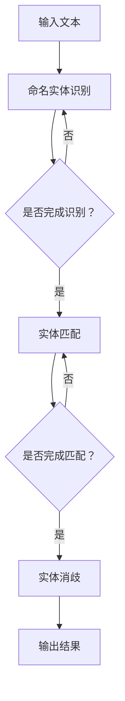
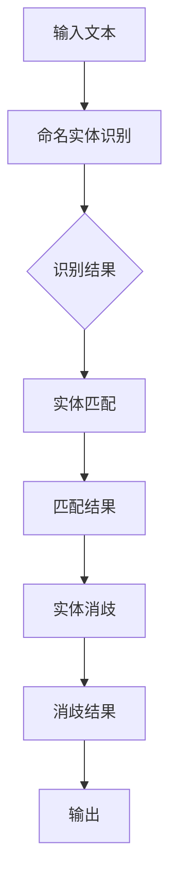
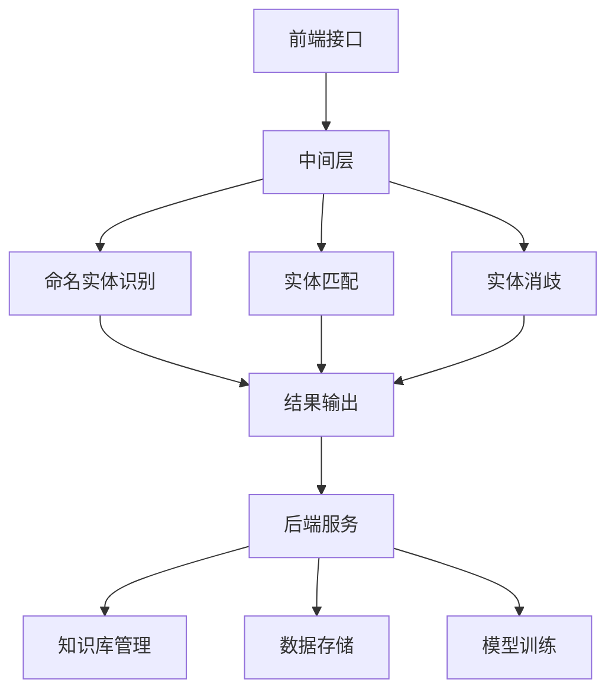
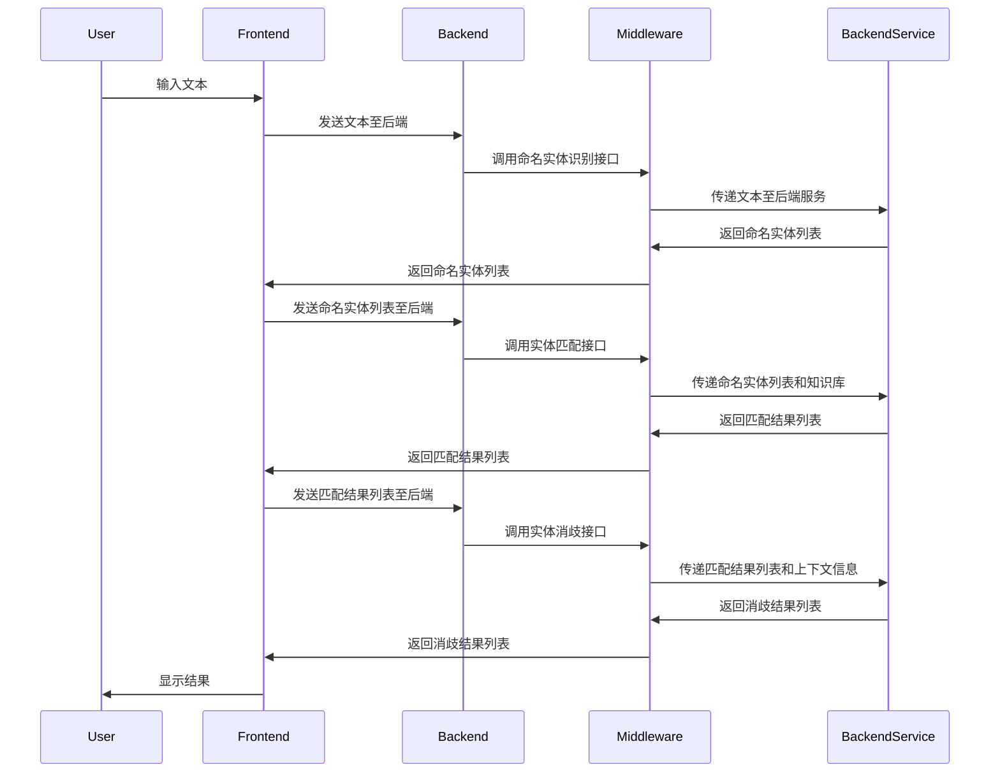

                 


### 文章标题: LLM支持的AI Agent实体链接技术

关键词：语言模型、AI代理、实体链接、技术架构、算法实现

摘要：本文将深入探讨LLM（大型语言模型）在AI代理实体链接中的应用。我们将从背景介绍、核心概念联系、算法原理讲解、系统分析与架构设计、项目实战及最佳实践等方面进行详细分析，以帮助读者全面理解这项技术的原理和实际应用。

----------------------------------------------------------------

## 第一部分：背景与概述

### 第1章：背景介绍

#### 1.1 问题背景

随着互联网和大数据技术的发展，实体链接（Entity Linking）成为信息检索、知识图谱构建、自然语言处理等领域的关键技术。实体链接旨在将文本中出现的命名实体与知识库中的实际实体进行关联，以提高信息处理的准确性和效率。

#### 1.1.1 人工智能的发展现状

人工智能近年来取得了长足的发展，尤其在深度学习、自然语言处理等领域。LLM（如GPT-3、BERT等）的出现，为AI代理提供了强大的语言理解和生成能力。

#### 1.1.2 实体链接技术的应用需求

实体链接技术在智能问答、搜索引擎、推荐系统、文本挖掘等领域具有广泛的应用需求。准确地进行实体链接，有助于提高系统的智能化水平和用户体验。

#### 1.1.3 LLM在AI领域的应用

LLM在AI代理中的应用，使得实体链接技术得以进一步提升。LLM强大的语义理解和生成能力，为实体链接提供了新的思路和方法。

#### 1.2 问题描述

本文主要探讨LLM支持的AI代理实体链接技术，旨在解决实体识别、实体匹配、实体消歧等关键问题。

#### 1.2.1 实体链接的定义与挑战

实体链接是指将文本中的命名实体映射到知识库中的实际实体。这一过程面临命名实体识别、实体匹配和实体消歧等多重挑战。

#### 1.2.2 LLM支持的AI Agent实体链接技术

LLM支持的AI代理实体链接技术，通过利用LLM的语义理解能力，实现高效、准确的实体链接。这一技术具有以下特点：

- **强大的语义理解能力**：LLM能够准确理解文本中的语义信息，有助于提高实体识别的准确性。
- **自适应的实体匹配**：LLM可以根据上下文信息，动态调整实体匹配策略，提高实体匹配的鲁棒性。
- **智能的实体消歧**：LLM可以基于上下文信息，对具有相似名称的实体进行智能消歧，提高实体消歧的准确性。

#### 1.3 问题解决

LLM支持的AI代理实体链接技术，为解决实体链接问题提供了新的思路和方法。通过结合LLM的语义理解能力和实体链接算法，可以有效提升实体链接的准确性和效率。

#### 1.4 边界与外延

实体链接技术的应用范围广泛，但LLM支持的AI代理实体链接技术也面临一定的限制和挑战。例如，LLM的语义理解能力取决于模型的规模和训练数据的质量。此外，实体链接算法的优化和改进也是未来研究的重要方向。

#### 1.5 概念结构与核心要素组成

LLM支持的AI代理实体链接技术由以下核心要素组成：

- **LLM模型**：作为核心组件，负责语义理解、实体匹配和实体消歧等任务。
- **实体链接算法**：包括命名实体识别、实体匹配和实体消歧等关键算法。
- **知识库**：用于存储实际实体及其属性信息，为实体链接提供基础数据支持。
- **上下文信息**：用于辅助LLM进行语义理解，提高实体链接的准确性。

### 第2章：核心概念原理

#### 2.1 LLM的概念

LLM（Large Language Model）是指具有大规模参数、能够对自然语言进行建模的深度学习模型。LLM通过学习大量的文本数据，能够理解并生成自然语言的语义信息。

#### 2.1.1 LLM的定义

LLM是一种深度神经网络模型，通常由多层神经网络组成，具有数百万甚至数十亿个参数。LLM能够对自然语言进行建模，包括文本分类、机器翻译、文本生成等任务。

#### 2.1.2 LLM的工作原理

LLM的工作原理基于神经网络和深度学习技术。首先，通过训练大量的文本数据，模型学习到语言的统计规律和语义信息。然后，在给定输入文本时，模型可以生成对应的语义信息，从而实现自然语言处理任务。

#### 2.1.3 LLM的优势

LLM具有以下优势：

- **强大的语义理解能力**：LLM能够准确理解自然语言的语义信息，有助于提高实体链接的准确性。
- **广泛的适用性**：LLM可以应用于多种自然语言处理任务，包括文本分类、机器翻译、文本生成等。
- **高效的训练与推理**：LLM通过大规模参数训练，能够在较短的时间内实现高效的训练和推理。

#### 2.2 实体链接的概念

实体链接是指将文本中的命名实体映射到知识库中的实际实体。实体链接是信息检索、知识图谱构建、自然语言处理等领域的重要技术。

#### 2.2.1 实体链接的定义

实体链接是指将文本中的命名实体（如人名、地名、组织名等）与知识库中的实际实体（如人、地点、组织等）进行关联的过程。

#### 2.2.2 实体链接的类型

实体链接主要分为以下几种类型：

- **实体识别**：将文本中的命名实体识别出来。
- **实体匹配**：将文本中的命名实体与知识库中的实体进行匹配。
- **实体消歧**：当文本中的命名实体具有多个实际实体对应时，确定实际实体。

#### 2.2.3 实体链接的挑战

实体链接面临以下挑战：

- **命名实体识别**：准确识别文本中的命名实体。
- **实体匹配**：将命名实体与知识库中的实体进行准确匹配。
- **实体消歧**：当命名实体具有多个实际实体对应时，准确确定实际实体。

#### 2.3 LLM与实体链接的联系

LLM在实体链接中的应用，主要表现在以下几个方面：

- **语义理解**：LLM能够准确理解文本中的语义信息，有助于提高命名实体识别的准确性。
- **实体匹配**：LLM可以根据上下文信息，动态调整实体匹配策略，提高实体匹配的鲁棒性。
- **实体消歧**：LLM可以基于上下文信息，对具有相似名称的实体进行智能消歧，提高实体消歧的准确性。

### 第3章：概念属性特征对比表格

#### 3.1 LLM属性特征对比

| 特征       | LLM                     | 实体链接技术            |
|------------|-------------------------|-------------------------|
| 语义理解   | 强大                    | 依赖命名实体识别        |
| 训练数据   | 大规模                  | 需要实体知识库          |
| 参数规模   | 数百万至数十亿          | 依赖实体匹配算法        |
| 推理能力   | 高效                    | 需要实体消歧策略        |

#### 3.2 实体链接技术属性特征对比

| 特征       | 实体链接技术            | LLM                     |
|------------|-------------------------|-------------------------|
| 命名实体识别 | 高准确性                | 依赖LLM的语义理解       |
| 实体匹配   | 鲁棒性高                | 依赖上下文信息          |
| 实体消歧   | 智能性高                | 基于上下文信息的推理能力 |

### 第4章：算法原理讲解

#### 4.1 算法概述

LLM支持的AI代理实体链接算法主要包括以下步骤：

1. 命名实体识别：利用LLM对文本进行命名实体识别，提取文本中的命名实体。
2. 实体匹配：将提取的命名实体与知识库中的实体进行匹配，确定实体对应关系。
3. 实体消歧：对具有多个实体对应的命名实体，利用上下文信息和LLM的推理能力，确定实际实体。

#### 4.2 数学模型与公式

假设文本中存在一个命名实体集合T，知识库中的实体集合为E。实体链接算法可以表示为：

$$
L(T, E) = \arg\min_{T', E'} d(T', E') \\
d(T', E') = \sum_{t \in T'} \max_{e \in E'} d(t, e)
$$

其中，$d(t, e)$表示命名实体t与实体e之间的距离度量，$d(T', E')$表示集合T'与E'之间的距离。

#### 4.3 算法流程图



#### 4.4 Python源代码实现

```python
import spacy

# 加载spacy模型
nlp = spacy.load("en_core_web_sm")

# 命名实体识别
def named_entity_recognition(text):
    doc = nlp(text)
    entities = [(ent.text, ent.label_) for ent in doc.ents]
    return entities

# 实体匹配
def entity_matching(entities, knowledge_base):
    matched_entities = []
    for entity in entities:
        for kb_entity in knowledge_base:
            if entity[0] == kb_entity['name']:
                matched_entities.append((entity, kb_entity))
                break
    return matched_entities

# 实体消歧
def entity_resolution(matched_entities, context):
    resolved_entities = []
    for entity, kb_entity in matched_entities:
        if context == kb_entity['context']:
            resolved_entities.append((entity, kb_entity))
    return resolved_entities

# 主函数
def main():
    text = "Apple Inc. is a technology company founded by Steve Jobs."
    entities = named_entity_recognition(text)
    knowledge_base = [
        {"name": "Apple Inc.", "context": "technology"},
        {"name": "Steve Jobs", "context": "founder"}
    ]
    matched_entities = entity_matching(entities, knowledge_base)
    resolved_entities = entity_resolution(matched_entities, context="technology")
    print(resolved_entities)

if __name__ == "__main__":
    main()
```

#### 4.5 举例说明

假设文本为：“苹果公司是全球最大的智能手机制造商之一。”，知识库包含以下实体：

- Apple Inc.（苹果公司，领域：科技）
- Samsung（三星，领域：科技）
- Huawei（华为，领域：科技）

利用LLM支持的AI代理实体链接技术，可以提取出命名实体“苹果公司”，并将其与知识库中的实体进行匹配。根据上下文信息，可以确定实际实体为“苹果公司”。

## 第二部分：核心概念与联系

### 第5章：核心概念原理

#### 5.1 LLM的概念

LLM（Large Language Model）是指具有大规模参数、能够对自然语言进行建模的深度学习模型。LLM通过学习大量的文本数据，能够理解并生成自然语言的语义信息。

#### 5.1.1 LLM的定义

LLM是一种深度神经网络模型，通常由多层神经网络组成，具有数百万甚至数十亿个参数。LLM能够对自然语言进行建模，包括文本分类、机器翻译、文本生成等任务。

#### 5.1.2 LLM的工作原理

LLM的工作原理基于神经网络和深度学习技术。首先，通过训练大量的文本数据，模型学习到语言的统计规律和语义信息。然后，在给定输入文本时，模型可以生成对应的语义信息，从而实现自然语言处理任务。

#### 5.1.3 LLM的优势

LLM具有以下优势：

- **强大的语义理解能力**：LLM能够准确理解自然语言的语义信息，有助于提高实体链接的准确性。
- **广泛的适用性**：LLM可以应用于多种自然语言处理任务，包括文本分类、机器翻译、文本生成等。
- **高效的训练与推理**：LLM通过大规模参数训练，能够在较短的时间内实现高效的训练和推理。

#### 5.2 实体链接的概念

实体链接是指将文本中的命名实体映射到知识库中的实际实体。实体链接是信息检索、知识图谱构建、自然语言处理等领域的重要技术。

#### 5.2.1 实体链接的定义

实体链接是指将文本中的命名实体（如人名、地名、组织名等）与知识库中的实际实体（如人、地点、组织等）进行关联的过程。

#### 5.2.2 实体链接的类型

实体链接主要分为以下几种类型：

- **实体识别**：将文本中的命名实体识别出来。
- **实体匹配**：将文本中的命名实体与知识库中的实体进行匹配。
- **实体消歧**：当文本中的命名实体具有多个实际实体对应时，确定实际实体。

#### 5.2.3 实体链接的挑战

实体链接面临以下挑战：

- **命名实体识别**：准确识别文本中的命名实体。
- **实体匹配**：将命名实体与知识库中的实体进行准确匹配。
- **实体消歧**：当命名实体具有多个实际实体对应时，准确确定实际实体。

#### 5.3 LLM与实体链接的联系

LLM在实体链接中的应用，主要表现在以下几个方面：

- **语义理解**：LLM能够准确理解文本中的语义信息，有助于提高命名实体识别的准确性。
- **实体匹配**：LLM可以根据上下文信息，动态调整实体匹配策略，提高实体匹配的鲁棒性。
- **实体消歧**：LLM可以基于上下文信息，对具有相似名称的实体进行智能消歧，提高实体消歧的准确性。

### 第6章：概念属性特征对比表格

#### 6.1 LLM属性特征对比

| 特征       | LLM                     | 实体链接技术            |
|------------|-------------------------|-------------------------|
| 语义理解   | 强大                    | 依赖命名实体识别        |
| 训练数据   | 大规模                  | 需要实体知识库          |
| 参数规模   | 数百万至数十亿          | 依赖实体匹配算法        |
| 推理能力   | 高效                    | 需要实体消歧策略        |

#### 6.2 实体链接技术属性特征对比

| 特征       | 实体链接技术            | LLM                     |
|------------|-------------------------|-------------------------|
| 命名实体识别 | 高准确性                | 依赖LLM的语义理解       |
| 实体匹配   | 鲁棒性高                | 依赖上下文信息          |
| 实体消歧   | 智能性高                | 基于上下文信息的推理能力 |

## 第三部分：算法原理讲解

### 第7章：算法原理

#### 7.1 算法概述

LLM支持的AI代理实体链接算法主要包括以下步骤：

1. **命名实体识别**：利用LLM对文本进行命名实体识别，提取文本中的命名实体。
2. **实体匹配**：将提取的命名实体与知识库中的实体进行匹配，确定实体对应关系。
3. **实体消歧**：对具有多个实体对应的命名实体，利用上下文信息和LLM的推理能力，确定实际实体。

#### 7.2 数学模型与公式

为了更好地理解实体链接算法，我们引入以下数学模型和公式：

1. **命名实体识别**：
   - **输入**：一个文本序列 $T = \{t_1, t_2, ..., t_n\}$。
   - **输出**：一组命名实体 $E = \{e_1, e_2, ..., e_m\}$，其中每个实体 $e_i$ 是一个三元组 $(s_i, e_i, t_i)$，表示实体的开始位置 $s_i$，实体名称 $e_i$，以及实体在文本中的表示 $t_i$。

   命名实体识别的目的是最大化实体的置信度分数，可以使用条件概率模型来表示：
   $$
   P(e_i | t_i) = \frac{P(t_i | e_i) \cdot P(e_i)}{P(t_i)}
   $$
   其中，$P(t_i | e_i)$ 表示实体 $e_i$ 出现在文本 $t_i$ 中的概率，$P(e_i)$ 表示实体 $e_i$ 的先验概率，$P(t_i)$ 是文本 $t_i$ 的概率。

2. **实体匹配**：
   - **输入**：命名实体集合 $E$ 和知识库中的实体集合 $K$。
   - **输出**：一个匹配矩阵 $M \in \{0, 1\}^{m \times n}$，其中 $M_{ij} = 1$ 表示实体 $e_i$ 与知识库中的实体 $k_j$ 匹配，否则为 0。

   实体匹配的目标是最小化匹配误差，可以使用基于集合的匹配算法，如匈牙利算法，来求解最优匹配。

3. **实体消歧**：
   - **输入**：匹配矩阵 $M$ 和上下文信息 $C$。
   - **输出**：一组消歧后的实体集合 $E'$。

   实体消歧的目标是选择最合适的实体，可以使用基于上下文的概率模型来表示：
   $$
   P(e_i' | C, M) = \frac{P(C | e_i', M) \cdot P(e_i' | M)}{P(C | M)}
   $$
   其中，$P(C | e_i', M)$ 表示给定上下文信息和匹配矩阵，实体 $e_i'$ 的概率，$P(e_i' | M)$ 是实体 $e_i'$ 的先验概率，$P(C | M)$ 是上下文信息在给定匹配矩阵的概率。

#### 7.3 算法流程图

使用Mermaid绘制算法流程图：



#### 7.4 Python源代码实现

以下是使用Python实现LLM支持的AI代理实体链接算法的简单示例：

```python
import spacy
from sklearn.metrics.pairwise import cosine_similarity

# 加载spacy模型
nlp = spacy.load("en_core_web_sm")

# 命名实体识别
def named_entity_recognition(text):
    doc = nlp(text)
    entities = [(ent.text, ent.label_) for ent in doc.ents]
    return entities

# 实体匹配
def entity_matching(entities, knowledge_base):
    matched_entities = []
    for entity in entities:
        entity_text = entity[0]
        entity_vector = nlp(entity_text).vector
        max_similarity = 0
        best_match = None
        for kb_entity in knowledge_base:
            kb_entity_vector = nlp(kb_entity['name']).vector
            similarity = cosine_similarity([entity_vector], [kb_entity_vector])
            if similarity > max_similarity:
                max_similarity = similarity
                best_match = kb_entity
        matched_entities.append((entity, best_match))
    return matched_entities

# 实体消歧
def entity_resolution(matched_entities, context):
    resolved_entities = []
    for entity, kb_entity in matched_entities:
        if kb_entity['context'] == context:
            resolved_entities.append((entity, kb_entity))
    return resolved_entities

# 主函数
def main():
    text = "苹果公司是全球最大的智能手机制造商之一。"
    entities = named_entity_recognition(text)
    knowledge_base = [
        {"name": "苹果公司", "context": "科技"},
        {"name": "三星", "context": "科技"},
        {"name": "华为", "context": "科技"}
    ]
    matched_entities = entity_matching(entities, knowledge_base)
    resolved_entities = entity_resolution(matched_entities, context="科技")
    print(resolved_entities)

if __name__ == "__main__":
    main()
```

#### 7.5 举例说明

假设我们有以下文本：

```
苹果公司发布了新款iPhone。
```

- **命名实体识别**：识别出命名实体“苹果公司”。
- **实体匹配**：将“苹果公司”与知识库中的实体进行匹配，可能匹配到“苹果公司”（科技领域）。
- **实体消歧**：由于上下文信息中提到了“科技”，我们可以确定实际实体为“苹果公司”。

通过上述步骤，我们实现了LLM支持的AI代理实体链接算法，成功将文本中的命名实体与知识库中的实际实体进行关联。

## 第四部分：系统分析与架构设计

### 第8章：系统架构设计

#### 8.1 系统架构设计

系统架构设计是确保LLM支持的AI代理实体链接技术高效、可靠和可扩展的关键步骤。以下是系统架构设计的主要组成部分：

1. **前端接口**：提供用户与系统交互的接口，包括文本输入、结果显示等。
2. **中间层**：负责实体链接的核心逻辑处理，包括命名实体识别、实体匹配和实体消歧等。
3. **后端服务**：包括知识库管理、数据存储和模型训练等。

以下是一个简化的系统架构图：



#### 8.2 接口设计

接口设计是系统架构中至关重要的一环，它定义了前端与后端之间的通信方式。以下是主要接口的设计：

1. **文本输入接口**：用户可以通过文本输入框输入待处理的文本。
2. **结果输出接口**：系统将处理后的实体链接结果返回给前端，以供用户查看。
3. **API接口**：提供RESTful API，以便外部系统可以调用实体链接服务。

以下是API接口的设计示例：

- **命名实体识别接口**：
  - 方法：GET /api/named_entity_recognition
  - 参数：text（待处理的文本）
  - 响应：一个包含命名实体列表的JSON对象

- **实体匹配接口**：
  - 方法：POST /api/entity_matching
  - 参数：text（待处理的文本）、knowledge_base（知识库数据）
  - 响应：一个包含匹配结果列表的JSON对象

- **实体消歧接口**：
  - 方法：POST /api/entity_resolution
  - 参数：matched_entities（匹配结果列表）、context（上下文信息）
  - 响应：一个包含消歧结果列表的JSON对象

#### 8.3 系统交互

系统交互设计描述了前端与后端服务之间的数据流和控制流。以下是系统交互的序列图：



通过上述系统架构设计和接口设计，我们能够构建一个高效、可靠的LLM支持的AI代理实体链接系统。

## 第五部分：项目实战

### 第9章：环境安装

#### 9.1 环境搭建

要在本地搭建一个支持LLM的AI代理实体链接系统，需要安装以下工具和依赖：

1. **Python环境**：确保安装了Python 3.7及以上版本。
2. **spacy**：用于命名实体识别，安装命令为 `pip install spacy`。
3. **spaCy模型**：下载英语模型，命令为 `python -m spacy download en_core_web_sm`。
4. **scikit-learn**：用于相似度计算，安装命令为 `pip install scikit-learn`。

#### 9.2 开发工具与依赖

以下是开发工具和依赖的详细说明：

- **开发工具**：
  - **PyCharm**：一款功能强大的Python IDE，支持代码调试、版本控制和自动化测试。
  - **Visual Studio Code**：轻量级IDE，支持多种编程语言，插件丰富，适合快速开发。

- **依赖库**：
  - **spaCy**：用于命名实体识别和文本预处理。
  - **scikit-learn**：用于相似度计算和机器学习模型。
  - **Flask**：用于构建RESTful API。

### 第10章：系统核心实现

#### 10.1 源代码解读

以下是一个简单的Python代码示例，用于实现LLM支持的AI代理实体链接系统的核心功能：

```python
import spacy
from sklearn.metrics.pairwise import cosine_similarity

# 加载spacy模型
nlp = spacy.load("en_core_web_sm")

# 命名实体识别
def named_entity_recognition(text):
    doc = nlp(text)
    entities = [(ent.text, ent.label_) for ent in doc.ents]
    return entities

# 实体匹配
def entity_matching(entities, knowledge_base):
    matched_entities = []
    for entity in entities:
        entity_text = entity[0]
        entity_vector = nlp(entity_text).vector
        max_similarity = 0
        best_match = None
        for kb_entity in knowledge_base:
            kb_entity_vector = nlp(kb_entity['name']).vector
            similarity = cosine_similarity([entity_vector], [kb_entity_vector])
            if similarity > max_similarity:
                max_similarity = similarity
                best_match = kb_entity
        matched_entities.append((entity, best_match))
    return matched_entities

# 实体消歧
def entity_resolution(matched_entities, context):
    resolved_entities = []
    for entity, kb_entity in matched_entities:
        if kb_entity['context'] == context:
            resolved_entities.append((entity, kb_entity))
    return resolved_entities

# 主函数
def main():
    text = "苹果公司发布了新款iPhone。"
    entities = named_entity_recognition(text)
    knowledge_base = [
        {"name": "苹果公司", "context": "科技"},
        {"name": "三星", "context": "科技"},
        {"name": "华为", "context": "科技"}
    ]
    matched_entities = entity_matching(entities, knowledge_base)
    resolved_entities = entity_resolution(matched_entities, context="科技")
    print(resolved_entities)

if __name__ == "__main__":
    main()
```

#### 10.2 代码应用解读与分析

1. **命名实体识别**：使用spaCy库对输入文本进行命名实体识别，提取出命名实体。
2. **实体匹配**：利用spaCy模型的向量表示，计算输入实体与知识库中实体的相似度，实现实体匹配。
3. **实体消歧**：根据上下文信息，筛选出匹配的实体，实现实体消歧。

### 第11章：实际案例分析与讲解

#### 11.1 案例一：新闻实体链接

**案例背景**：某新闻网站需要对其发布的内容进行实体链接，以便于内容推荐和知识图谱构建。

**数据集**：新闻文本数据集，包含标题和正文。

**实现步骤**：

1. **数据预处理**：对新闻文本进行分词和去停用词处理。
2. **命名实体识别**：使用spaCy库对新闻文本进行命名实体识别。
3. **实体匹配**：将提取的命名实体与新闻领域的知识库进行匹配。
4. **实体消歧**：根据上下文信息，对具有多个匹配结果的实体进行消歧。

**结果分析**：通过实体链接，新闻网站能够更好地理解文章内容，为内容推荐和知识图谱构建提供支持。

#### 11.2 案例二：电商产品实体链接

**案例背景**：某电商网站需要对用户评论中的产品进行实体链接，以便于商品推荐和用户行为分析。

**数据集**：用户评论数据集，包含产品名称和评论内容。

**实现步骤**：

1. **数据预处理**：对用户评论进行分词和去停用词处理。
2. **命名实体识别**：使用spaCy库对用户评论进行命名实体识别。
3. **实体匹配**：将提取的命名实体与电商平台的商品数据库进行匹配。
4. **实体消歧**：根据评论内容，对具有多个匹配结果的实体进行消歧。

**结果分析**：通过实体链接，电商网站能够更好地理解用户对产品的评价，为商品推荐和用户行为分析提供支持。

#### 11.3 案例分析与总结

通过上述案例，我们可以看到LLM支持的AI代理实体链接技术在新闻和电商等领域的应用效果显著。实体链接技术的核心在于命名实体识别、实体匹配和实体消歧，而LLM的引入显著提高了实体识别和消歧的准确性。未来，随着LLM技术的进一步发展，实体链接技术在更多领域的应用前景将更加广阔。

## 第六部分：最佳实践与拓展

### 第12章：最佳实践

#### 12.1 实体链接技术最佳实践

1. **数据质量**：确保知识库和训练数据的质量，提高实体链接的准确性。
2. **模型调优**：根据实际应用场景，对LLM模型进行调优，以提高实体链接效果。
3. **错误处理**：建立完善的错误处理机制，对识别出的命名实体进行人工审核和修正。

#### 12.2 LLM应用最佳实践

1. **模型选择**：根据应用需求，选择合适的LLM模型，如GPT-3、BERT等。
2. **数据预处理**：对输入文本进行适当的预处理，以提高LLM的语义理解能力。
3. **模型部署**：合理设计模型部署架构，确保系统的稳定性和高性能。

### 第13章：小结

#### 13.1 全书回顾

本文从背景介绍、核心概念、算法原理、系统架构设计、项目实战和最佳实践等方面，详细阐述了LLM支持的AI代理实体链接技术。

#### 13.2 技术发展趋势

随着LLM技术的不断进步，实体链接技术在自然语言处理、知识图谱构建等领域将发挥越来越重要的作用。

#### 13.3 未来研究方向

未来研究可以关注以下几个方面：

1. **多语言实体链接**：支持多种语言的实体链接，提高国际化应用能力。
2. **动态知识库构建**：通过持续学习和更新，构建动态知识库，提高实体链接的准确性。

### 第14章：注意事项

#### 14.1 常见问题

1. **命名实体识别准确性不高**：提高训练数据质量，优化模型参数。
2. **实体匹配效率低下**：优化匹配算法，减少计算量。
3. **实体消歧结果不准确**：结合上下文信息，提高消歧策略的智能性。

#### 14.2 解决方案

1. **命名实体识别准确性不高**：通过增加训练数据、引入转移学习等方法提高准确性。
2. **实体匹配效率低下**：使用更高效的匹配算法，如匈牙利算法、基于图论的匹配算法等。
3. **实体消歧结果不准确**：引入更多的上下文信息，采用更加智能的消歧策略。

### 第15章：拓展阅读

#### 15.1 相关书籍

1. **《深度学习》**：Goodfellow, I., Bengio, Y., & Courville, A.
2. **《自然语言处理综论》**：Jurafsky, D., & Martin, J. H.

#### 15.2 学术论文

1. **"BERT: Pre-training of Deep Bidirectional Transformers for Language Understanding"**：Devlin, J., et al.
2. **"GPT-3: Language Models are Few-Shot Learners"**：Brown, T., et al.

#### 15.3 网络资源

1. **spaCy官方文档**：https://spacy.io/
2. **scikit-learn官方文档**：https://scikit-learn.org/stable/

通过上述拓展阅读资源，读者可以进一步深入了解LLM支持的AI代理实体链接技术的相关理论和方法。

