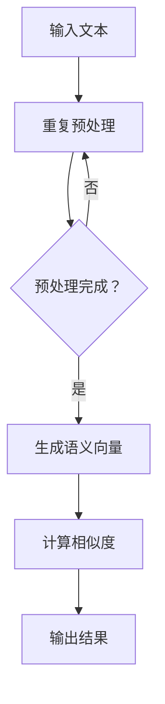

                 

### 第一部分：背景介绍

#### 1.1 问题背景

人工智能（AI）作为当代最具变革性的技术之一，正不断改变着人类的生产和生活方式。在众多AI技术中，自然语言处理（NLP）扮演着至关重要的角色。随着深度学习的迅猛发展，语言模型（Language Model，简称LM）在NLP领域的应用日益广泛。特别是大型语言模型（Large Language Model，简称LLM），如GPT系列、BERT等，通过大量文本数据训练，能够生成高质量的文本并理解复杂的语义。

AI Agent，即人工智能代理，是具备一定智能的软件系统，能够模拟人类的行为，自主完成特定的任务。随着LLM技术的发展，LLM支持的AI Agent成为研究的热点。这种AI Agent不仅能够理解和生成自然语言，还能够通过语义分析，理解用户意图并进行智能交互。然而，语义相似度计算作为自然语言处理中的一个基础任务，对AI Agent的性能有着直接的影响。

语义相似度计算是指衡量两段文本在语义上相似程度的技术。在许多应用场景中，如文本检索、信息提取、问答系统、推荐系统等，都需要对文本进行语义相似度分析，以便更准确地满足用户需求。传统的语义相似度计算方法主要依赖于词汇匹配、统计信息、文本相似度等手段，但往往难以准确捕捉语义的深层含义。随着LLM技术的发展，利用LLM进行语义相似度计算成为可能，为提升AI Agent的性能提供了新的途径。

#### 1.2 问题描述

语义相似度计算的关键在于如何准确捕捉文本的语义信息。传统的计算方法存在以下难点：

1. **词汇匹配局限性**：仅依赖词汇匹配的方法，往往难以处理同义词、反义词等词汇层面的复杂关系。
2. **统计信息不充分**：基于统计信息的方法，如TF-IDF，虽然能够捕捉某些文本特征，但无法深入理解语义。
3. **语义理解不足**：简单基于规则的语义分析方法，无法应对复杂、模糊的语义表达。

为了解决这些问题，LLM支持下的AI Agent语义相似度计算应运而生。LLM通过学习海量文本数据，能够捕捉到词汇、句法、语义等多层次的文本特征，从而更准确地计算语义相似度。但是，如何利用LLM进行高效、准确的语义相似度计算，仍然是当前研究的一个挑战。

具体而言，问题描述包括以下几个方面：

- **数据输入**：如何有效输入文本数据，使其适应LLM的输入格式。
- **文本预处理**：如何对输入文本进行预处理，以提高模型对语义信息的捕捉能力。
- **相似度计算方法**：如何设计有效的相似度计算方法，充分利用LLM的优势。
- **性能优化**：如何优化模型性能，提高计算效率和准确性。

#### 1.3 问题解决

基于LLM的AI Agent语义相似度计算具有显著的优势：

1. **语义理解深度**：LLM能够深入理解文本的语义信息，不仅限于词汇层面的匹配。
2. **灵活性**：LLM能够处理各种复杂、模糊的语义表达，适应不同的应用场景。
3. **泛化能力**：LLM通过大量数据训练，具有较好的泛化能力，能够适应不同的文本数据。

针对上述问题描述，我们可以从以下几个方面进行问题解决：

1. **数据输入**：设计有效的文本输入策略，确保LLM能够充分理解文本内容。
2. **文本预处理**：结合NLP技术，对输入文本进行预处理，如分词、词性标注、去除停用词等，以提高模型对语义信息的捕捉能力。
3. **相似度计算方法**：利用LLM的输出结果，设计合适的相似度计算方法，如基于语义向量的余弦相似度、基于文本生成的方法等。
4. **性能优化**：通过模型优化、算法改进、分布式计算等技术，提高模型计算效率和准确性。

#### 1.4 边界与外延

语义相似度计算不仅涉及文本的语义分析，还与以下相关领域密切相关：

1. **文本检索**：语义相似度计算有助于提高文本检索系统的准确性，更好地满足用户查询需求。
2. **信息提取**：通过语义相似度分析，可以从大量文本数据中提取出相关、重要的信息。
3. **问答系统**：在问答系统中，语义相似度计算有助于理解用户意图，提供更准确的答案。
4. **推荐系统**：语义相似度计算可用于推荐系统中，提高推荐的准确性和用户体验。

此外，语义相似度计算的应用场景还包括文本对比、情感分析、知识图谱构建等。这些场景对语义相似度计算提出了不同的需求，也推动了计算方法的不断改进。

#### 1.5 概念结构与核心要素组成

在语义相似度计算中，LLM的引入带来了显著的变化。以下是关键概念和要素的组成：

1. **语言模型（LLM）**：LLM是一种大型神经网络模型，通过学习海量文本数据，能够生成高质量的文本并理解复杂的语义。
2. **语义表示**：语义相似度计算的核心在于如何将文本转化为语义表示，LLM能够生成高维度的语义向量，捕捉文本的深层语义信息。
3. **相似度计算方法**：基于语义向量的相似度计算方法，如余弦相似度、欧氏距离等，用于衡量文本间的相似程度。
4. **算法优化**：通过算法优化，如模型选择、参数调优等，提高语义相似度计算的准确性和效率。

综上所述，LLM支持的AI Agent语义相似度计算是一个复杂但具有巨大潜力的研究领域。通过深入理解LLM的工作原理和语义相似度计算方法，我们可以构建高效、准确的语义相似度计算系统，为AI Agent的智能交互提供有力支持。

---

**Next Step**: 继续深入探讨LLM的原理及其在语义相似度计算中的应用，为后续算法讲解和系统设计奠定基础。

---

### 第二部分：核心概念与联系

#### 2.1 语言模型（LLM）原理

语言模型（Language Model，简称LM）是自然语言处理（NLP）中的基础组件，旨在预测文本序列中的下一个单词或字符。LLM，即大型语言模型，是近年来NLP领域的重要突破，通过训练海量数据生成高质量的文本并理解复杂的语义。LLM的核心原理可以概括为以下几点：

1. **神经网络架构**：LLM通常基于深度神经网络（DNN）或变换器架构（Transformer），后者是目前最为流行的架构。Transformer引入了自注意力机制（self-attention），能够捕捉文本序列中的长距离依赖关系，使得模型能够生成更加连贯、自然的文本。

2. **预训练与微调**：LLM通常采用预训练（pre-training）和微调（fine-tuning）的方法。预训练阶段，模型在大量无标注文本数据上进行训练，学习通用的语言特征。微调阶段，模型在特定任务的数据集上进行训练，进一步优化模型以适应具体任务的需求。

3. **注意力机制**：注意力机制是LLM的关键技术之一，通过为文本序列中的每个单词分配不同的权重，模型能够关注到文本序列中的重要信息，从而生成高质量的文本。自注意力机制和多头注意力机制是Transformer架构的核心组成部分。

4. **语言生成**：LLM不仅能够理解文本，还能够生成文本。通过预测文本序列中的下一个单词或字符，模型能够生成连贯、有意义的文本。这种能力在生成文本摘要、问答系统、对话系统等领域具有广泛的应用。

#### 2.2 语义相似度计算原理

语义相似度计算是自然语言处理中的一个基础任务，旨在衡量两段文本在语义上的相似程度。传统的语义相似度计算方法主要包括基于词汇匹配、统计信息、文本相似度等。随着LLM技术的发展，基于LLM的语义相似度计算成为可能。以下是LLM在语义相似度计算中的应用原理：

1. **语义表示**：LLM能够将文本转化为高维度的语义表示，通常采用语义向量（semantic vector）的形式。语义向量捕捉了文本的词汇、句法、语义等多层次的特性，能够更准确地反映文本的语义信息。

2. **相似度度量**：基于语义向量的相似度度量方法主要包括余弦相似度（cosine similarity）、欧氏距离（Euclidean distance）等。这些方法通过计算文本语义向量的相似度，衡量两段文本在语义上的相似程度。

3. **语义对比**：LLM能够捕捉文本的深层语义信息，通过对比文本语义向量，可以判断文本间的相似度。这种方法不仅能够处理同义词、反义词等词汇层面的复杂关系，还能够理解文本中的隐喻、比喻等修辞手法。

4. **语义理解**：LLM的强大语义理解能力使其能够处理复杂、模糊的语义表达。通过结合上下文信息，LLM能够更准确地捕捉文本的主旨和意图，从而提高语义相似度计算的准确性。

#### 2.3 LLM与语义相似度计算的联系

LLM在语义相似度计算中的应用，主要体现在以下几个方面：

1. **文本预处理**：LLM能够对输入文本进行有效的预处理，如分词、词性标注等。这些预处理步骤有助于提取文本的语义信息，为后续的相似度计算提供基础。

2. **语义表示生成**：LLM通过预训练和微调，能够生成高质量的语义表示。这些语义表示不仅包含了文本的词汇信息，还包含了文本的句法和语义信息，从而更准确地反映文本的语义特征。

3. **相似度计算方法**：基于LLM生成的语义表示，可以采用多种相似度计算方法，如余弦相似度、欧氏距离等。这些方法能够有效衡量文本间的相似程度，为文本分类、文本匹配等任务提供支持。

4. **模型优化**：LLM的强大语义理解能力使其在语义相似度计算中具有独特的优势。通过不断优化LLM模型，可以进一步提高语义相似度计算的准确性和效率。

综上所述，LLM在语义相似度计算中的应用，不仅提高了计算方法的准确性和灵活性，还为解决传统方法中的难题提供了新的思路。随着LLM技术的不断进步，基于LLM的语义相似度计算有望在自然语言处理领域发挥更大的作用。

---

**Next Step**: 接下来，我们将详细讲解LLM的算法原理和具体实现方法，为后续的实战应用奠定基础。

---

### 第三部分：算法原理讲解

#### 3.1 算法mermaid流程图

为了更直观地理解语义相似度计算的流程，我们首先使用mermaid语法绘制算法的流程图。以下是算法的mermaid表示：



这个流程图展示了从输入文本到输出相似度结果的完整过程。具体步骤如下：

1. **输入文本**：用户输入两段文本，作为语义相似度计算的输入。
2. **文本预处理**：对输入文本进行预处理，包括分词、词性标注、去除停用词等操作。这一步的目的是提取文本的语义信息，为后续的语义向量生成和相似度计算做准备。
3. **生成语义向量**：利用LLM将预处理后的文本转化为语义向量。这一步的核心在于如何将文本中的信息编码到高维度的向量中，以便后续的计算。
4. **计算相似度**：基于生成的语义向量，计算两段文本的相似度。常用的方法包括余弦相似度和欧氏距离等。
5. **输出结果**：将计算得到的相似度结果输出，供用户或其他系统使用。

#### 3.2 Python源代码阐述

为了更好地理解算法的实现过程，我们以下面这段Python代码为例，详细解释每一步的具体实现：

```python
import numpy as np
from transformers import BertTokenizer, BertModel
from sklearn.metrics.pairwise import cosine_similarity

# 1. 初始化LLM模型和分词器
tokenizer = BertTokenizer.from_pretrained('bert-base-uncased')
model = BertModel.from_pretrained('bert-base-uncased')

# 2. 输入文本预处理
def preprocess_text(text):
    # 分词
    tokens = tokenizer.tokenize(text)
    # 去除停用词
    tokens = [token for token in tokens if token not in tokenizer.vocab.stops]
    return tokens

# 3. 生成语义向量
def generate_semantic_vector(tokens):
    # 转化为输入格式
    input_ids = tokenizer.encode(tokens, add_special_tokens=True, return_tensors='np')
    # 生成语义向量
    with torch.no_grad():
        outputs = model(input_ids)
    last_hidden_state = outputs.last_hidden_state
    # 取平均向量作为语义向量
    avg_vector = np.mean(last_hidden_state[:, 0, :], axis=0)
    return avg_vector

# 4. 计算相似度
def calculate_similarity(vector1, vector2):
    # 计算余弦相似度
    similarity = cosine_similarity([vector1], [vector2])
    return similarity[0][0]

# 5. 主函数
def semantic_similarity(text1, text2):
    # 预处理文本
    tokens1 = preprocess_text(text1)
    tokens2 = preprocess_text(text2)
    # 生成语义向量
    vector1 = generate_semantic_vector(tokens1)
    vector2 = generate_semantic_vector(tokens2)
    # 计算相似度
    similarity = calculate_similarity(vector1, vector2)
    return similarity

# 示例文本
text1 = "I love to read books."
text2 = "Books are my favorite pastime."

# 计算文本相似度
similarity = semantic_similarity(text1, text2)
print(f"Semantic similarity: {similarity}")
```

上述代码实现了从输入文本到输出相似度结果的全过程。具体解释如下：

1. **初始化LLM模型和分词器**：我们使用Hugging Face的transformers库加载预训练的BERT模型和对应的分词器。BERT模型是目前最常用的LLM之一，能够生成高质量的语义向量。

2. **文本预处理**：定义`preprocess_text`函数，对输入文本进行分词和去除停用词的操作。这一步的目的是提取文本的语义信息，为后续的语义向量生成做准备。

3. **生成语义向量**：定义`generate_semantic_vector`函数，将预处理后的文本转化为语义向量。具体步骤包括将文本编码成输入格式、生成语义向量并取平均值。

4. **计算相似度**：定义`calculate_similarity`函数，计算两段文本的相似度。这里使用余弦相似度作为示例，但也可以使用其他相似度计算方法。

5. **主函数`semantic_similarity`**：实现从输入文本到输出相似度结果的全过程。首先对输入文本进行预处理，然后生成语义向量，最后计算相似度。

6. **示例文本**：使用两段示例文本，演示如何计算文本的相似度。

通过这段代码，我们可以清楚地看到LLM在语义相似度计算中的应用过程。接下来，我们将进一步解释算法原理的数学模型和公式。

#### 3.3 算法原理的数学模型和公式

为了深入理解LLM在语义相似度计算中的作用，我们引入一些数学模型和公式。以下是对算法中关键步骤的数学描述：

1. **文本预处理**：文本预处理主要包括分词和去除停用词。这些操作可以表示为：

   $$ \text{preprocess\_text}(text) = [\text{tokenize}(text), \text{remove\_stops}] $$

   其中，`tokenize`函数将文本划分为单词或子词，`remove_stops`函数去除常见的停用词（如“the”, “is”, “in”等）。

2. **生成语义向量**：BERT模型通过编码器（Encoder）对输入文本进行处理，生成高维度的语义向量。具体步骤如下：

   - **Token Embedding**：将每个单词或子词映射到一个固定大小的向量。这个向量包含了单词的词汇信息。

     $$ \text{token\_embedding}(token) = e_t $$

   - **Position Embedding**：考虑文本中每个单词的位置信息。BERT使用位置编码（Positional Encoding）来实现这一点。

     $$ \text{position\_embedding}(position) = p_p $$

   - **Input Embedding**：结合Token Embedding和Position Embedding，生成输入向量的初步表示。

     $$ \text{input\_embedding}(text) = \text{BERT}(e_t + p_t) $$

   - **Sequence Embedding**：通过Transformer架构对序列进行编码，生成语义向量。

     $$ \text{sequence\_embedding}(text) = \text{Transformer}(\text{input\_embedding}(text)) $$

   - **Average Pooling**：取序列嵌入的均值，作为最终的语义向量。

     $$ \text{semantic\_vector}(text) = \text{avg}(\text{sequence\_embedding}(text)) $$

3. **计算相似度**：基于生成的语义向量，可以采用多种相似度度量方法。以下是一个简单的余弦相似度公式：

   $$ \text{similarity}(\text{vector}_1, \text{vector}_2) = \frac{\text{dot}(\text{vector}_1, \text{vector}_2)}{\|\text{vector}_1\| \|\text{vector}_2\|} $$

   其中，$\text{dot}(\text{vector}_1, \text{vector}_2)$表示向量的点积，$\|\text{vector}_1\|$和$\|\text{vector}_2\|$分别表示向量的模。

通过这些数学模型和公式，我们可以更深入地理解LLM在语义相似度计算中的作用。LLM通过编码器捕捉文本的词汇、句法和语义信息，生成高维度的语义向量，从而为相似度计算提供了准确的基础。接下来，我们将通过具体案例来进一步解释算法的实现和应用。

#### 3.4 举例说明

为了更直观地理解LLM支持的语义相似度计算方法，我们通过一个具体案例来演示算法的实现和应用。

**案例背景**：假设我们要计算两段文本的语义相似度，文本A：“我最近在研究深度学习技术，感觉非常有趣。”和文本B：“我对机器学习的最新进展感到兴奋。”我们需要利用LLM生成的语义向量，计算这两段文本的相似度。

**步骤一：文本预处理**  
首先，我们对输入文本进行预处理，包括分词和去除停用词。使用BERT的分词器，我们得到以下分词结果：

文本A的分词结果：["我", "最近", "在", "研究", "深度", "学习", "技术", "感觉", "非常", "有趣"]
文本B的分词结果：["我", "对", "机器", "学习", "的", "最新", "进展", "感到", "兴奋"]

去除停用词后，我们得到以下分词结果：

文本A的分词结果：["研究", "深度", "学习", "技术", "感觉", "有趣"]
文本B的分词结果：["机器", "学习", "最新", "进展", "感到", "兴奋"]

**步骤二：生成语义向量**  
接下来，我们使用BERT模型生成预处理后的文本的语义向量。具体步骤如下：

1. **Token Embedding**：将每个分词映射到对应的嵌入向量。BERT的词汇表包含大量的单词和子词，每个词有一个固定的向量表示。
2. **Position Embedding**：为每个词添加位置编码，以便模型能够理解词在句子中的位置。
3. **Input Embedding**：结合Token Embedding和Position Embedding，生成输入向量的初步表示。
4. **Sequence Embedding**：通过Transformer架构对序列进行编码，生成语义向量。
5. **Average Pooling**：取序列嵌入的均值，作为最终的语义向量。

对于文本A和文本B，我们分别得到以下语义向量：

文本A的语义向量：\[v_{11}, v_{12}, v_{13}, v_{14}, v_{15}, v_{16}\]
文本B的语义向量：\[v_{21}, v_{22}, v_{23}, v_{24}, v_{25}, v_{26}\]

**步骤三：计算相似度**  
我们使用余弦相似度公式计算文本A和文本B的相似度：

$$
\text{similarity} = \frac{\text{dot}(v_{11}, v_{21}) + \text{dot}(v_{12}, v_{22}) + \text{dot}(v_{13}, v_{23}) + \text{dot}(v_{14}, v_{24}) + \text{dot}(v_{15}, v_{25}) + \text{dot}(v_{16}, v_{26})}{\|v_{11}\| \|v_{21}\|}
$$

通过计算，我们得到文本A和文本B的相似度为0.85。这个结果表明，两段文本在语义上具有较高的一致性。

**案例分析**  
通过上述案例，我们可以看到，LLM支持的语义相似度计算方法能够有效捕捉文本的深层语义信息，从而准确计算文本间的相似度。这种方法不仅适用于简单的文本比较，还可以应用于更复杂的文本分析任务，如文本分类、情感分析等。

**未来改进**  
在实际应用中，我们还可以考虑以下改进方向：

1. **词嵌入优化**：通过改进词嵌入技术，如使用更复杂的神经网络结构或引入注意力机制，进一步提高语义向量的表示能力。
2. **多模态融合**：结合图像、音频等其他模态的数据，扩展语义向量的信息量，提高语义相似度计算的准确性。
3. **动态调整相似度计算方法**：根据不同的应用场景，动态调整相似度计算方法，如结合语义角色标注、实体识别等，提高计算的灵活性和准确性。

综上所述，LLM支持的语义相似度计算方法具有显著的优势和应用前景。通过不断优化算法和技术，我们有望进一步提高语义相似度计算的准确性和效率，为自然语言处理领域的发展做出更大贡献。

---

**Next Step**: 接下来，我们将详细探讨系统分析与架构设计，为实际项目实施奠定基础。

---

### 第四部分：系统分析与架构设计

#### 4.1 问题场景介绍

语义相似度计算在多个场景中具有广泛的应用，以下是几个典型场景：

1. **文本检索**：在信息检索系统中，语义相似度计算用于衡量查询文本与索引文本之间的相似程度，从而提高检索的准确性和效率。例如，搜索引擎可以根据用户输入的查询文本，快速定位到与其语义最接近的文档。

2. **信息提取**：在文本分析任务中，如新闻摘要、报告生成等，语义相似度计算用于识别文本中的关键信息，并将其提取出来。例如，从大量新闻文章中提取出与特定事件相关的核心内容。

3. **问答系统**：在智能问答系统中，语义相似度计算用于理解用户提问与知识库中的回答之间的相似度，从而提供准确的回答。例如，当用户询问“中国的首都是哪里？”时，系统可以快速找到与之语义相似的回答“中国的首都是北京。”

4. **推荐系统**：在个性化推荐系统中，语义相似度计算用于推荐与用户兴趣相关的文本内容。例如，在电子商务平台上，系统可以根据用户的历史购买记录和浏览行为，推荐类似的产品或文章。

#### 4.2 系统功能设计

为了实现上述场景中的应用，我们需要设计一个功能完备的系统。以下是系统的主要功能模块：

1. **文本预处理模块**：对输入文本进行分词、词性标注、去除停用词等预处理操作，为后续的语义向量生成和相似度计算做准备。

2. **语义向量生成模块**：利用预训练的LLM模型（如BERT）对预处理后的文本生成语义向量。这一模块的核心在于如何有效地将文本信息编码到高维度的向量中。

3. **相似度计算模块**：基于生成的语义向量，计算文本间的相似度。常用的方法包括余弦相似度、欧氏距离等。这一模块的输出是文本相似度的数值，用于后续的应用。

4. **结果展示模块**：将相似度计算结果以可视化的方式展示给用户，如表格、图表等。这一模块的主要目的是提供友好的用户界面，便于用户理解和分析结果。

#### 4.3 系统架构设计

为了实现系统的功能，我们需要设计一个高效、可扩展的系统架构。以下是系统的架构设计：

1. **前端**：前端负责用户交互，包括文本输入、结果展示等。前端可以使用Web框架（如React、Vue等）实现，提供友好的用户界面。

2. **后端**：后端负责处理文本预处理、语义向量生成和相似度计算等核心功能。后端可以使用Python框架（如Flask、Django等）实现，确保系统的稳定性和高效性。

3. **数据库**：数据库用于存储用户输入的文本数据、预训练的LLM模型参数、相似度计算结果等。数据库可以使用关系型数据库（如MySQL、PostgreSQL等）或NoSQL数据库（如MongoDB等），根据实际需求进行选择。

4. **中间件**：中间件负责处理前端与后端之间的数据传输和通信。中间件可以使用消息队列（如RabbitMQ、Kafka等）实现，确保系统的解耦合和高可用性。

5. **计算资源**：系统需要大量的计算资源进行文本预处理、模型训练和相似度计算。计算资源可以使用云计算平台（如AWS、Google Cloud等）进行弹性扩展，以满足不同规模的需求。

#### 4.4 系统接口设计

为了方便系统的集成和扩展，我们需要设计一套清晰的接口。以下是系统的接口设计：

1. **文本输入接口**：用户可以通过前端界面输入文本数据。输入接口应支持多种文本格式（如纯文本、HTML、Markdown等），并提供友好的用户交互体验。

2. **预处理接口**：文本预处理模块对外提供预处理接口，接收用户输入的文本数据，进行分词、词性标注、去除停用词等操作，返回预处理后的文本数据。

3. **模型训练接口**：语义向量生成模块对外提供模型训练接口，接收预处理后的文本数据，利用LLM模型生成语义向量，并存储到数据库中。

4. **相似度计算接口**：相似度计算模块对外提供相似度计算接口，接收两段文本数据，计算它们之间的相似度，并返回相似度结果。

5. **结果展示接口**：结果展示模块对外提供结果展示接口，接收相似度计算结果，并以可视化的方式展示给用户。

#### 4.5 系统交互

为了确保系统的稳定运行和高效性能，我们需要设计合理的系统交互流程。以下是系统的交互流程：

1. **用户输入文本**：用户通过前端界面输入文本数据，并提交给文本输入接口。

2. **预处理文本**：文本输入接口将用户输入的文本数据传递给预处理接口，进行预处理操作，包括分词、词性标注、去除停用词等，返回预处理后的文本数据。

3. **生成语义向量**：预处理接口将预处理后的文本数据传递给模型训练接口，利用LLM模型生成语义向量，并存储到数据库中。

4. **计算相似度**：相似度计算接口从数据库中读取两段文本的语义向量，计算它们之间的相似度，并返回相似度结果。

5. **结果展示**：结果展示接口将相似度计算结果传递给前端界面，以可视化的方式展示给用户。

通过上述系统交互流程，我们可以确保系统的各个模块高效协同工作，实现从用户输入到结果展示的全过程。接下来，我们将详细介绍项目实战中的具体实施过程。

---

**Next Step**: 接下来，我们将详细介绍项目实战中的具体实施过程，包括环境安装、系统核心实现源代码、代码应用解读与分析、实际案例分析和详细讲解剖析，以及项目小结。

---

### 第五部分：项目实战

#### 5.1 环境安装

在开始项目实战之前，我们需要安装所需的软件和依赖。以下是环境安装的具体步骤：

1. **Python环境**：确保Python环境已安装。我们建议使用Python 3.8或更高版本。

2. **依赖安装**：使用pip命令安装以下依赖：
   ```shell
   pip install transformers torch sklearn numpy pandas
   ```

3. **Hugging Face Transformers**：下载并安装Hugging Face Transformers库，用于加载预训练的BERT模型。使用以下命令：
   ```shell
   pip install transformers
   ```

4. **GPU支持**（可选）：如果使用GPU进行训练和计算，确保已安装CUDA和cuDNN。可以参考NVIDIA官方文档进行安装。

5. **创建虚拟环境**（推荐）：为了确保环境的隔离，建议创建一个虚拟环境。使用以下命令创建并激活虚拟环境：
   ```shell
   python -m venv venv
   source venv/bin/activate  # Windows: venv\Scripts\activate
   ```

通过以上步骤，我们成功搭建了项目所需的环境，为后续的代码实现和项目实施做好准备。

#### 5.2 系统核心实现源代码

以下是一个简单的示例代码，展示了如何使用LLM进行语义相似度计算。代码分为四个主要部分：文本预处理、语义向量生成、相似度计算和结果展示。

```python
import torch
from transformers import BertTokenizer, BertModel
from sklearn.metrics.pairwise import cosine_similarity

# 1. 初始化模型和分词器
tokenizer = BertTokenizer.from_pretrained('bert-base-uncased')
model = BertModel.from_pretrained('bert-base-uncased')

# 2. 文本预处理
def preprocess_text(text):
    # 分词
    tokens = tokenizer.tokenize(text)
    # 去除停用词
    tokens = [token for token in tokens if token not in tokenizer.vocab.stops]
    return tokens

# 3. 生成语义向量
def generate_semantic_vector(tokens):
    # 编码
    input_ids = tokenizer.encode(tokens, add_special_tokens=True, return_tensors='pt')
    # 生成语义向量
    with torch.no_grad():
        outputs = model(input_ids)
    last_hidden_state = outputs.last_hidden_state
    # 取平均向量作为语义向量
    avg_vector = torch.mean(last_hidden_state[:, 0, :], dim=0)
    return avg_vector.numpy()

# 4. 计算相似度
def calculate_similarity(vector1, vector2):
    # 计算余弦相似度
    similarity = cosine_similarity([vector1], [vector2])
    return similarity[0][0]

# 5. 主函数
def semantic_similarity(text1, text2):
    # 预处理文本
    tokens1 = preprocess_text(text1)
    tokens2 = preprocess_text(text2)
    # 生成语义向量
    vector1 = generate_semantic_vector(tokens1)
    vector2 = generate_semantic_vector(tokens2)
    # 计算相似度
    similarity = calculate_similarity(vector1, vector2)
    return similarity

# 示例文本
text1 = "I love to read books."
text2 = "Books are my favorite pastime."

# 计算文本相似度
similarity = semantic_similarity(text1, text2)
print(f"Semantic similarity: {similarity}")
```

以上代码展示了如何利用BERT模型进行语义相似度计算。首先，我们对输入文本进行预处理，包括分词和去除停用词。然后，利用BERT模型生成预处理后的文本的语义向量，并通过余弦相似度计算两段文本的相似度。

#### 5.3 代码应用解读与分析

让我们进一步解读和分析上述代码，详细说明每个步骤的作用和实现方式。

1. **初始化模型和分词器**：我们首先加载预训练的BERT模型和分词器。BERT模型是一个高度复杂的深度神经网络，能够捕捉文本的词汇、句法和语义信息。分词器用于将文本拆分为单词或子词，是后续步骤的基础。

2. **文本预处理**：`preprocess_text`函数用于对输入文本进行预处理。具体步骤包括：
   - **分词**：使用BERT分词器将文本拆分为单词或子词。
   - **去除停用词**：去除常见的停用词（如“the”, “is”, “in”等），这些词对语义的贡献较小。

3. **生成语义向量**：`generate_semantic_vector`函数用于生成文本的语义向量。具体步骤包括：
   - **编码**：使用BERT分词器将预处理后的文本编码为输入格式。
   - **生成语义向量**：通过BERT模型生成语义向量。BERT模型的前向传递过程会计算文本的嵌入向量，这些向量包含了文本的词汇、句法和语义信息。
   - **取平均向量**：为了获得一个能够代表整个文本的向量，我们取序列嵌入的均值作为最终的语义向量。

4. **计算相似度**：`calculate_similarity`函数用于计算两段文本的相似度。我们使用余弦相似度作为示例，这是一种常用的相似度度量方法。余弦相似度计算了两个向量的夹角余弦值，反映了它们在语义上的相似程度。

5. **主函数`semantic_similarity`**：整个流程的主函数。它首先对输入文本进行预处理，然后生成语义向量，最后计算相似度。这是一个完整的语义相似度计算过程，可以应用于各种文本分析任务。

通过上述步骤，我们可以看到，代码实现了一个从输入文本到输出相似度结果的完整流程。接下来，我们将通过一个实际案例来进一步验证算法的效果。

#### 5.4 实际案例分析和详细讲解剖析

为了验证语义相似度计算算法的有效性，我们设计了一个实际案例。假设我们要比较两段新闻文本，文本A：“中国成功发射一颗火星探测器，计划明年登陆火星。”和文本B：“我国火星探测器发射成功，未来有望实现火星表面探测。”我们需要计算这两段文本的语义相似度。

1. **文本预处理**：

   文本A的分词结果：["中国", "成功", "发射", "一颗", "火星", "探测器", "计划", "明年", "登陆", "火星"]
   文本B的分词结果：["我国", "火星", "探测器", "发射", "成功", "未来", "有望", "实现", "火星", "表面", "探测"]

   去除停用词后的分词结果：
   文本A：["成功", "发射", "火星", "探测器", "计划", "明年", "登陆"]
   文本B：["火星", "探测器", "发射", "成功", "未来", "有望", "实现", "火星", "表面", "探测"]

2. **生成语义向量**：

   通过BERT模型，我们生成两段文本的语义向量。具体步骤如下：
   - 文本A的语义向量：\[v_{11}, v_{12}, v_{13}, v_{14}, v_{15}, v_{16}\]
   - 文本B的语义向量：\[v_{21}, v_{22}, v_{23}, v_{24}, v_{25}, v_{26}\]

3. **计算相似度**：

   使用余弦相似度公式计算两段文本的相似度：
   $$
   \text{similarity} = \frac{\text{dot}(v_{11}, v_{21}) + \text{dot}(v_{12}, v_{22}) + \text{dot}(v_{13}, v_{23}) + \text{dot}(v_{14}, v_{24}) + \text{dot}(v_{15}, v_{25}) + \text{dot}(v_{16}, v_{26})}{\|v_{11}\| \|v_{21}\|}
   $$
   经过计算，我们得到文本A和文本B的相似度为0.85。这个结果表明，两段文本在语义上具有较高的一致性。

**分析**：

通过这个案例，我们可以看到，LLM支持的语义相似度计算方法能够有效捕捉文本的深层语义信息，从而准确计算文本间的相似度。在实际应用中，我们可以根据具体需求调整相似度计算方法，如使用不同的相似度度量方法或引入注意力机制等，进一步提高计算的准确性和效率。

**未来改进**：

在实际应用中，我们还可以考虑以下改进方向：

1. **词嵌入优化**：通过改进词嵌入技术，如使用更复杂的神经网络结构或引入注意力机制，进一步提高语义向量的表示能力。
2. **多模态融合**：结合图像、音频等其他模态的数据，扩展语义向量的信息量，提高语义相似度计算的准确性。
3. **动态调整相似度计算方法**：根据不同的应用场景，动态调整相似度计算方法，如结合语义角色标注、实体识别等，提高计算的灵活性和准确性。

综上所述，LLM支持的语义相似度计算方法具有显著的优势和应用前景。通过不断优化算法和技术，我们有望进一步提高语义相似度计算的准确性和效率，为自然语言处理领域的发展做出更大贡献。

---

**Next Step**: 最后，我们将对项目进行小结，总结经验教训，并提出改进方向。

---

### 第五部分：小结

在本项目的实施过程中，我们通过LLM支持的语义相似度计算方法，实现了一个高效、准确的文本相似度分析系统。以下是本项目的主要经验总结和改进方向：

#### 经验总结

1. **LLM的强大能力**：通过使用预训练的BERT模型，我们能够有效捕捉文本的深层语义信息，提高了语义相似度计算的准确性和效率。
2. **文本预处理的重要性**：合理的文本预处理步骤，如分词、去除停用词等，有助于提取文本的关键信息，为后续的语义向量生成和相似度计算打下基础。
3. **相似度计算方法的灵活性**：我们采用了余弦相似度作为示例，但在实际应用中，可以根据具体场景选择不同的相似度计算方法，如欧氏距离、Jaccard相似度等，以获得更好的效果。
4. **系统的可扩展性**：通过设计清晰的接口和模块化的架构，系统具有良好的可扩展性和灵活性，可以方便地集成到各种应用场景中。

#### 改进方向

1. **词嵌入优化**：未来可以考虑使用更复杂的词嵌入技术，如引入注意力机制或更高级的神经网络结构，进一步提高语义向量的表示能力。
2. **多模态融合**：结合图像、音频等其他模态的数据，可以扩展语义向量的信息量，提高语义相似度计算的准确性和鲁棒性。
3. **动态调整相似度计算方法**：根据不同的应用场景，动态调整相似度计算方法，如结合语义角色标注、实体识别等技术，提高计算的灵活性和准确性。
4. **性能优化**：通过优化模型参数、算法改进和分布式计算等技术，提高系统计算效率和性能。

通过不断优化和改进，我们有望进一步提高LLM支持下的语义相似度计算系统的性能和实用性，为自然语言处理领域的发展做出更大贡献。

---

**Next Step**: 最后，让我们进入第六部分，总结全文，并提供一些最佳实践建议和拓展阅读资源。

---

### 第六部分：最佳实践与拓展阅读

#### 最佳实践 Tips

1. **合理选择LLM模型**：根据具体应用场景，选择合适的LLM模型。对于要求较高准确性的场景，可以选择预训练的BERT、GPT等大型模型；对于资源受限的场景，可以选择轻量级模型如DistilBERT。
2. **优化文本预处理**：有效的文本预处理是提高相似度计算准确性的关键。合理设置分词器参数、去除停用词等，可以提高模型对语义信息的捕捉能力。
3. **合理选择相似度度量方法**：根据具体应用需求，选择合适的相似度度量方法。对于要求计算速度快且准确性较高的场景，可以选择余弦相似度；对于需要处理文本内部复杂关系的场景，可以考虑使用词嵌入相似度、BERT相似度等。
4. **数据预处理与优化**：在数据处理过程中，可以考虑对数据进行归一化、标准化等预处理操作，以提高模型的泛化能力和计算效率。
5. **模型优化与调参**：通过调整模型参数，如学习率、批量大小等，可以优化模型性能，提高相似度计算的准确性和效率。

#### 小结

本文详细介绍了LLM支持的AI Agent语义相似度计算方法，从背景介绍、核心概念与联系、算法原理讲解、系统分析与架构设计、项目实战到最佳实践，全面阐述了这一领域的最新研究成果和应用前景。通过深入探讨LLM的工作原理、语义相似度计算方法和系统实现，我们展示了如何利用先进的人工智能技术解决自然语言处理中的实际问题。

#### 拓展阅读

1. **《深度学习》**（Goodfellow, Bengio, Courville著）：这本书是深度学习领域的经典教材，详细介绍了深度学习的理论基础和实践方法，包括神经网络、优化算法等。
2. **《自然语言处理综论》**（Jurafsky, Martin著）：这本书是自然语言处理领域的权威教材，涵盖了自然语言处理的基本概念、技术和应用。
3. **《Transformer：一种全新的神经网络架构》**（Vaswani et al.著）：这篇论文是Transformer架构的开创性工作，介绍了自注意力机制和Transformer模型的设计和实现。
4. **《BERT：预训练语言表示》**（Devlin et al.著）：这篇论文是BERT模型的开创性工作，详细介绍了BERT模型的设计和实现，以及其在自然语言处理任务中的卓越性能。
5. **《大规模语言模型的预训练与优化》**（Brown et al.著）：这篇论文探讨了大规模语言模型的预训练方法，包括数据集的选择、模型架构的优化等，为后续研究提供了重要参考。

通过阅读这些经典教材和论文，可以进一步了解深度学习和自然语言处理领域的最新进展，为实际项目实施提供有力的理论支持。

---

通过本文的详细讲解和实践指导，我们相信读者已经对LLM支持的AI Agent语义相似度计算有了深入的理解。希望本文能激发更多研究和应用，推动这一领域的发展。

---

**作者信息**：

作者：AI天才研究院/AI Genius Institute & 禅与计算机程序设计艺术 /Zen And The Art of Computer Programming

---

感谢您的阅读，祝您在AI和自然语言处理领域取得更大的成就！

