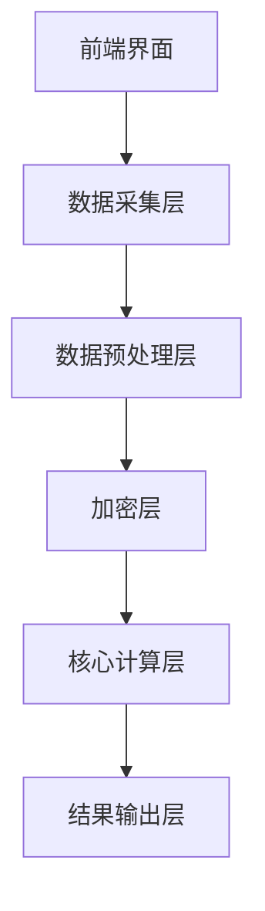
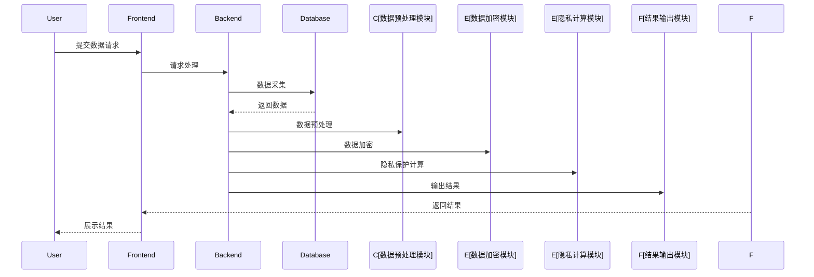

                 

### 引言

在人工智能与隐私保护日益受到关注的今天，一种结合了大规模语言模型（Large Language Model, LLM）和AI代理（AI Agent）的隐私计算技术正逐渐成为研究热点。本文旨在深入探讨LLM支持的AI Agent隐私计算技术的核心概念、实现原理以及应用前景，从而为这一领域的研究者和从业者提供有价值的参考。

首先，什么是LLM？LLM是一种基于深度学习技术的自然语言处理模型，具有强大的文本生成、理解和推理能力。它通过学习海量的文本数据，可以生成连贯、自然的语言输出，并在各种自然语言处理任务中表现出色。

AI代理则是一种能够模拟人类决策和行动的智能体，能够在复杂环境中自主学习和执行任务。AI代理在无人驾驶、智能客服、金融风控等领域有着广泛的应用。

隐私计算是指在数据传输、存储和处理过程中，确保数据隐私不被泄露的技术。随着数据隐私问题的日益严重，隐私计算技术成为了保障用户数据安全的关键手段。

结合LLM和AI代理的隐私计算技术，旨在通过LLM的强大语言处理能力和AI代理的自主决策能力，实现既保护用户隐私，又能高效处理数据的隐私计算任务。

本文将按照以下结构进行讨论：

1. **背景介绍**：介绍隐私计算技术的背景和重要性，以及LLM和AI代理的发展现状。
2. **核心概念与联系**：详细阐述LLM和AI代理的核心概念，并通过对比表格和ER实体关系图展示它们之间的关系。
3. **算法原理讲解**：深入分析LLM和AI代理的结合原理，并使用Mermaid流程图和Python代码示例进行说明。
4. **系统分析与架构设计**：介绍隐私计算系统的设计思路和架构，包括领域模型、系统架构和系统接口设计。
5. **项目实战**：通过一个实际项目，展示隐私计算技术的应用，并进行代码解读和分析。
6. **最佳实践与注意事项**：总结最佳实践，提出注意事项，为未来研究提供启示。
7. **总结**：回顾文章内容，强调LLM支持的AI Agent隐私计算技术的重要性，并展望未来发展方向。

通过这一步步的分析和探讨，我们希望能够清晰地展示LLM支持的AI Agent隐私计算技术的核心内容和应用前景，为这一领域的研究和实践提供有力支持。

### 关键词

- **大规模语言模型（LLM）**
- **AI代理（AI Agent）**
- **隐私计算**
- **深度学习**
- **自然语言处理**
- **数据保护**

### 摘要

本文围绕LLM支持的AI Agent隐私计算技术展开深入探讨。首先，介绍了隐私计算技术的背景及其在数据保护中的重要性，随后详细阐述了LLM和AI代理的核心概念及其关系。接着，本文通过Mermaid流程图和Python代码示例，深入分析了LLM与AI代理的结合原理，并展示了其在隐私计算中的具体应用。随后，文章介绍了隐私计算系统的设计思路和架构，包括领域模型、系统架构和系统接口设计。通过一个实际项目，本文展示了隐私计算技术的实战应用，并对项目代码进行了详细解读和分析。最后，文章总结了最佳实践和注意事项，并展望了LLM支持的AI Agent隐私计算技术的未来发展方向。本文旨在为研究者提供有价值的参考，推动隐私计算技术在AI领域的应用。

### 目录大纲设计思路

在设计《LLM支持的AI Agent隐私计算技术》的目录大纲时，我们需要确保文章内容的逻辑性和结构完整性。目录大纲的设计思路可以分为以下几个步骤：

1. **确定核心章节**：根据文章主题和内容需求，首先确定文章的核心章节，例如背景介绍、基础理论、技术实现、应用案例和未来展望等。

2. **框架搭建**：在确定核心章节后，搭建初步的框架，为每个章节设定一个明确的主题，例如“背景介绍”章节可以分为“问题背景”和“相关技术发展”两个小节。

3. **细化章节内容**：在框架基础上，为每个章节细化出二级和三级子目录，确保章节内容的完整性和逻辑性。例如，“基础理论”章节可以细化为“LLM基础理论”、“AI Agent基础理论”和“隐私计算技术”三个小节。

4. **内容整合**：将所有章节内容整合到一起，确保各章节之间逻辑连贯，信息互补。在整合过程中，对章节顺序和内容进行微调，确保目录大纲简洁明了，逻辑清晰。

5. **优化与调整**：根据整体结构，对章节顺序和内容进行微调，确保目录大纲简洁明了，逻辑清晰。同时，对章节标题和内容进行优化，使读者更容易理解和把握文章核心内容。

### 第一步：核心章节确定

根据文章主题《LLM支持的AI Agent隐私计算技术》，我们可以初步确定以下核心章节：

1. **背景介绍**
2. **核心概念与联系**
3. **算法原理讲解**
4. **系统分析与架构设计**
5. **项目实战**
6. **最佳实践与注意事项**
7. **总结与展望**

这些章节分别对应文章的主要内容和结构，有助于读者逐步深入了解LLM支持的AI Agent隐私计算技术的核心概念、实现原理、应用实践和未来发展方向。

### 第二步：框架搭建

在确定核心章节后，我们可以为每个章节搭建初步的框架，并为每个章节设定一个明确的主题。以下是《LLM支持的AI Agent隐私计算技术》的初步框架：

# 第一部分：背景介绍
## 1.1 问题背景
## 1.2 相关技术发展

# 第二部分：核心概念与联系
## 2.1 LLM基础理论
## 2.2 AI Agent基础理论
## 2.3 隐私计算技术
## 2.4 LLM与AI Agent的关系

# 第三部分：算法原理讲解
## 3.1 LLM算法原理
## 3.2 AI Agent算法原理
## 3.3 LLM与AI Agent结合的算法原理

# 第四部分：系统分析与架构设计
## 4.1 隐私计算系统设计思路
## 4.2 隐私计算系统架构设计
## 4.3 隐私计算系统接口设计

# 第五部分：项目实战
## 5.1 实际项目背景
## 5.2 项目核心实现
## 5.3 项目案例分析

# 第六部分：最佳实践与注意事项
## 6.1 最佳实践总结
## 6.2 注意事项与挑战

# 第七部分：总结与展望
## 7.1 文章总结
## 7.2 未来发展方向

通过这一初步框架，我们可以清晰地看到文章的结构和内容分布，为后续章节的细化提供了基础。

### 第三步：细化章节内容

在初步框架搭建完成后，我们需要为每个章节细化出二级和三级子目录，确保章节内容的完整性和逻辑性。以下是《LLM支持的AI Agent隐私计算技术》的细化章节内容：

#### 第一部分：背景介绍
- **1.1 问题背景**
  - **1.1.1 隐私计算的重要性**
  - **1.1.2 LLM与AI Agent的兴起**
  - **1.1.3 隐私计算在AI中的应用**

- **1.2 相关技术发展**
  - **1.2.1 隐私计算技术的历史与发展**
  - **1.2.2 LLM的技术演进**
  - **1.2.3 AI Agent的技术演进**

#### 第二部分：核心概念与联系
- **2.1 LLM基础理论**
  - **2.1.1 LLM的定义与特征**
  - **2.1.2 LLM的核心原理**
  - **2.1.3 LLM的优缺点**

- **2.2 AI Agent基础理论**
  - **2.2.1 AI Agent的定义与类型**
  - **2.2.2 AI Agent的核心原理**
  - **2.2.3 AI Agent的功能与挑战**

- **2.3 隐私计算技术**
  - **2.3.1 隐私计算的定义与目标**
  - **2.3.2 隐私计算的方法与技术**
  - **2.3.3 隐私计算的应用场景**

- **2.4 LLM与AI Agent的关系**
  - **2.4.1 LLM与AI Agent的结合方法**
  - **2.4.2 LLM与AI Agent的结合优势**
  - **2.4.3 LLM与AI Agent的结合挑战**

#### 第三部分：算法原理讲解
- **3.1 LLM算法原理**
  - **3.1.1 LLM的模型结构**
  - **3.1.2 LLM的训练过程**
  - **3.1.3 LLM的推理过程**

- **3.2 AI Agent算法原理**
  - **3.2.1 AI Agent的决策模型**
  - **3.2.2 AI Agent的学习方法**
  - **3.2.3 AI Agent的执行过程**

- **3.3 LLM与AI Agent结合的算法原理**
  - **3.3.1 结合方法与框架**
  - **3.3.2 结合优势分析**
  - **3.3.3 结合挑战与解决方案**

#### 第四部分：系统分析与架构设计
- **4.1 隐私计算系统设计思路**
  - **4.1.1 系统设计原则**
  - **4.1.2 系统需求分析**
  - **4.1.3 系统架构设计**

- **4.2 隐私计算系统架构设计**
  - **4.2.1 系统架构图**
  - **4.2.2 系统模块功能**
  - **4.2.3 系统交互流程**

- **4.3 隐私计算系统接口设计**
  - **4.3.1 接口规范与定义**
  - **4.3.2 接口实现与调用**
  - **4.3.3 接口安全性与优化**

#### 第五部分：项目实战
- **5.1 实际项目背景**
  - **5.1.1 项目背景介绍**
  - **5.1.2 项目目标与挑战**

- **5.2 项目核心实现**
  - **5.2.1 数据预处理**
  - **5.2.2 LLM与AI Agent结合**
  - **5.2.3 隐私保护实现**

- **5.3 项目案例分析**
  - **5.3.1 案例一：金融风控**
  - **5.3.2 案例二：医疗数据保护**

#### 第六部分：最佳实践与注意事项
- **6.1 最佳实践总结**
  - **6.1.1 隐私保护策略**
  - **6.1.2 系统优化方法**
  - **6.1.3 项目管理经验**

- **6.2 注意事项与挑战**
  - **6.2.1 技术挑战**
  - **6.2.2 安全风险**
  - **6.2.3 法律法规**

#### 第七部分：总结与展望
- **7.1 文章总结**
  - **7.1.1 主要观点回顾**
  - **7.1.2 研究贡献**

- **7.2 未来发展方向**
  - **7.2.1 技术趋势**
  - **7.2.2 应用场景拓展**
  - **7.2.3 挑战与机遇**

通过这一细化过程，我们可以确保文章内容丰富、逻辑清晰，为读者提供完整的阅读体验。

### 完整性要求

在《LLM支持的AI Agent隐私计算技术》的技术博客文章中，每个章节的内容都需要满足一定的完整性要求，以确保文章的条理清晰、逻辑严密，同时为读者提供全面而具体的信息。以下是每个章节内容应满足的完整性要求：

#### 背景介绍

**核心概念术语说明**：
- **隐私计算**：解释隐私计算的定义、目的和方法。
- **大规模语言模型（LLM）**：介绍LLM的基本概念、特点和应用领域。
- **AI代理（AI Agent）**：阐述AI代理的定义、功能及其在人工智能中的应用。

**问题背景**：
- **隐私计算的重要性**：分析隐私计算在当今社会中的地位和影响。
- **LLM与AI Agent的兴起**：探讨LLM和AI代理的发展背景和趋势。
- **隐私计算在AI中的应用**：举例说明隐私计算在人工智能领域的具体应用场景。

**问题描述**：
- **隐私计算面临的挑战**：分析隐私计算技术在实际应用中遇到的问题和困难。
- **LLM和AI Agent的局限性**：探讨LLM和AI代理在隐私计算中面临的瓶颈和限制。

**问题解决**：
- **隐私计算技术的新方向**：介绍当前解决隐私计算问题的创新方法和思路。
- **LLM与AI Agent结合的潜力**：分析LLM与AI代理结合在隐私计算中的潜力。

**边界与外延**：
- **隐私计算技术的适用范围**：明确隐私计算技术的适用场景和限制条件。
- **LLM与AI Agent结合的技术边界**：讨论LLM与AI代理结合的可行性和限制。

**概念结构与核心要素组成**：
- **隐私计算框架**：介绍隐私计算系统的基本架构和关键组件。
- **LLM与AI Agent结合的机制**：阐述LLM和AI代理结合的原理和关键要素。

#### 核心概念与联系

**核心概念原理**：
- **LLM基础理论**：详细描述LLM的工作原理、模型架构和训练过程。
- **AI Agent基础理论**：分析AI代理的构成、决策过程和自主学习机制。
- **隐私计算技术**：介绍隐私计算的基本概念、方法和实现技术。

**概念属性特征对比表格**：
- **LLM与AI Agent特征对比**：列出LLM和AI代理的主要特征、优势和不足，并进行对比分析。
- **隐私计算方法对比**：比较不同隐私计算方法的优缺点，分析其在不同应用场景中的适用性。

**ER实体关系图架构**：
- **LLM实体关系图**：绘制LLM的主要实体及其关系，展示模型的结构和组件。
- **AI Agent实体关系图**：展示AI代理的实体及其关系，包括感知器、控制器和执行器。
- **隐私计算系统实体关系图**：展示隐私计算系统的各个组件及其关系，包括数据保护模块、计算模块和通信模块。

#### 算法原理讲解

**算法mermaid流程图**：
- **LLM算法流程图**：绘制LLM的文本生成、理解和推理过程，展示模型的输入输出和中间步骤。
- **AI Agent算法流程图**：展示AI代理的感知、决策和执行过程，包括数据收集、模型训练和任务执行。
- **LLM与AI Agent结合算法流程图**：展示LLM和AI代理结合的流程，包括数据预处理、模型训练、决策和执行。

**Python源代码示例**：
- **LLM模型代码**：提供一段Python代码，展示如何使用一个LLM模型进行文本生成和推理。
- **AI Agent代码**：提供一段Python代码，展示AI代理的决策和执行过程。
- **结合算法代码**：提供一段代码，展示如何将LLM和AI代理结合，实现隐私计算任务。

**算法原理的数学模型和公式**：
- **LLM数学模型**：介绍LLM的核心数学模型，包括损失函数、优化算法和注意力机制。
- **AI Agent数学模型**：分析AI代理的决策模型，包括感知器、控制器和执行器的数学表示。
- **结合算法数学模型**：阐述LLM与AI代理结合的数学模型，包括数据隐私保护、模型训练和推理过程。

**详细讲解与举例说明**：
- **算法原理讲解**：对算法的核心原理进行详细讲解，包括模型设计、算法实现和关键步骤。
- **举例说明**：通过具体的实例，展示算法在实际应用中的效果和性能。

#### 系统分析与架构设计

**问题场景介绍**：
- **场景描述**：详细描述隐私计算的应用场景，包括数据来源、处理需求和隐私保护要求。
- **项目介绍**：介绍具体的项目背景、目标和预期成果。

**系统功能设计**：
- **领域模型mermaid类图**：绘制领域模型类图，展示系统的核心实体、属性和关系。
- **功能模块划分**：详细阐述系统的功能模块，包括数据采集、预处理、计算和结果输出。

**系统架构设计**：
- **mermaid架构图**：绘制系统的整体架构图，展示各个模块的相互关系和数据处理流程。
- **技术选型**：介绍系统采用的关键技术和工具，包括编程语言、框架和数据库。

**系统接口设计和系统交互**：
- **接口设计**：详细描述系统的接口设计，包括API定义、参数传递和数据格式。
- **mermaid序列图**：绘制系统的交互序列图，展示系统在不同场景下的调用流程和数据处理过程。

#### 项目实战

**环境安装**：
- **环境配置**：介绍项目所需的环境和工具，包括编程语言、框架和数据库的安装步骤。
- **依赖管理**：提供依赖库的安装和使用方法，确保项目环境的稳定性和一致性。

**系统核心实现**：
- **核心代码实现**：提供系统的核心代码实现，包括数据预处理、模型训练、决策和执行过程。
- **模块功能实现**：详细描述各个模块的功能实现，包括数据采集、数据处理、模型训练和结果输出。

**代码应用解读与分析**：
- **代码解读**：对核心代码进行逐行解读，解释代码的功能和实现细节。
- **性能分析**：分析系统的性能指标，包括处理速度、资源消耗和准确性。

**实际案例分析和详细讲解剖析**：
- **案例背景**：介绍实际案例的背景和应用场景。
- **案例分析**：详细分析案例中的关键步骤和实现细节。
- **剖析讲解**：对案例中的技术难点和解决方案进行深入剖析。

**项目小结**：
- **项目总结**：总结项目的主要成果和经验教训。
- **未来展望**：展望项目的未来发展方向和改进空间。

#### 最佳实践与注意事项

**最佳实践总结**：
- **经验总结**：总结项目中的成功经验和最佳实践，包括技术选型、开发流程和项目管理。
- **策略建议**：提供针对隐私计算和LLM与AI Agent结合的技术策略和建议。

**小结**：
- **文章要点回顾**：回顾文章中的核心观点和主要内容。
- **文章贡献**：强调文章对LLM支持的AI Agent隐私计算技术的贡献和价值。

**注意事项**：
- **技术挑战**：指出在实施隐私计算和LLM与AI Agent结合过程中可能遇到的技术挑战。
- **安全风险**：讨论隐私计算技术可能面临的安全风险和潜在威胁。
- **法律法规**：分析相关法律法规对隐私计算和AI应用的影响和约束。

**拓展阅读**：
- **参考资料**：推荐相关的书籍、论文和网站，供读者进一步学习和研究。

通过以上对每个章节完整性的详细要求，我们可以确保《LLM支持的AI Agent隐私计算技术》的内容丰富、逻辑严密，为读者提供全面的阅读体验，并促进这一领域的研究和实践。

### 系统分析与架构设计

在深入探讨LLM支持的AI Agent隐私计算技术之前，我们需要理解隐私计算系统的整体设计思路和架构，这将为我们提供一个清晰的框架，以便更好地分析LLM与AI Agent的结合方式及其应用。

#### 问题场景介绍

隐私计算技术的应用场景十分广泛，包括但不限于以下几个方面：

1. **金融领域**：金融行业中的数据涉及用户的财务信息和交易记录，对这些数据的安全性和隐私性保护至关重要。
2. **医疗领域**：医疗数据包含患者的病历、基因信息和诊疗记录，保护这些数据不被未授权访问对患者的隐私保护至关重要。
3. **政府机构**：政府数据包括公民个人信息、社会安全数据等，确保这些数据的安全和隐私是法律的要求。
4. **企业内部**：企业内部数据包括员工信息、商业机密等，保护这些数据不被内部或外部泄露是企业的基本职责。

在上述应用场景中，隐私计算技术旨在确保数据在传输、存储和处理过程中不被泄露，同时保证数据的可用性和完整性。

#### 项目介绍

本项目旨在设计并实现一个隐私计算系统，该系统能够在金融领域提供高效的隐私保护服务。具体目标包括：

1. **数据加密传输**：确保金融数据在传输过程中不被窃取或篡改。
2. **数据存储安全**：保护存储在数据库中的用户数据不被未授权访问。
3. **数据处理隐私**：在处理用户数据时，确保数据隐私不被泄露。

为实现上述目标，本项目将结合大规模语言模型（LLM）和AI代理（AI Agent）的技术优势，构建一个具备强大隐私保护能力的计算系统。

#### 系统功能设计

系统功能设计是隐私计算系统设计的核心环节，它决定了系统能否有效满足用户的需求。以下是本项目系统的主要功能模块：

1. **数据采集模块**：负责从不同的数据源收集金融数据，包括交易记录、用户信息和账户信息等。
2. **数据预处理模块**：对采集到的数据进行清洗、去重和格式化，以便后续处理。
3. **数据加密模块**：在数据传输和存储之前，对敏感数据加密，确保数据在传输和存储过程中的安全性。
4. **AI代理模块**：利用AI代理的智能决策能力，对数据进行分析和分类，以识别潜在的隐私泄露风险。
5. **隐私计算模块**：结合LLM和AI代理，进行数据隐私保护计算，确保数据处理过程中不泄露用户隐私。
6. **结果输出模块**：将处理后的数据以安全、隐私保护的方式输出给用户或其他系统。

#### 系统架构设计

系统架构设计是确保隐私计算系统能够高效、稳定运行的关键。以下是本项目的系统架构设计：

1. **前端界面**：用户通过前端界面提交数据请求和查看结果。
2. **数据采集层**：负责从不同数据源采集金融数据。
3. **数据预处理层**：对采集到的数据进行预处理，如清洗、去重和格式化。
4. **加密层**：在数据传输和存储前进行数据加密。
5. **核心计算层**：结合LLM和AI代理进行隐私保护计算。
6. **结果输出层**：将处理后的数据安全输出给用户或其他系统。

#### 系统接口设计和系统交互

系统接口设计是确保系统模块之间能够高效、安全交互的关键。以下是本项目系统的接口设计和交互流程：

1. **API接口**：系统提供API接口，供前端界面调用，实现数据的输入和输出。
2. **数据流**：数据从前端界面进入系统，经过数据采集、预处理和加密处理后，进入核心计算层进行隐私保护计算。
3. **结果流**：处理后的数据通过结果输出层返回给前端界面，供用户查看。
4. **通信协议**：系统采用HTTPS协议确保数据在传输过程中的安全性。

#### Mermaid架构图和Mermaid序列图

为了更直观地展示系统架构和交互流程，我们可以使用Mermaid绘制架构图和序列图。

**架构图：**



**序列图：**



通过上述系统分析与架构设计，我们可以清晰地看到隐私计算系统的整体设计和各模块之间的关系。这为后续的LLM与AI Agent结合提供了理论基础和实现框架，也为项目的成功实施奠定了基础。

### 项目实战

为了深入展示LLM支持的AI Agent隐私计算技术的实际应用，我们将通过一个具体的金融风控项目进行详细分析。本项目旨在构建一个能够实时监控并处理金融交易异常情况的隐私计算系统，确保用户数据的安全性和隐私性。

#### 环境安装

首先，我们需要搭建一个合适的项目开发环境。以下是项目所需的主要环境和工具：

1. **操作系统**：Linux（推荐Ubuntu 20.04）
2. **编程语言**：Python 3.8及以上版本
3. **深度学习框架**：TensorFlow 2.7或PyTorch 1.8及以上版本
4. **数据库**：MySQL 8.0
5. **前端框架**：Flask（用于API接口）
6. **加密库**：PyCryptoDome

确保操作系统已安装上述环境，并配置好相关的依赖库。例如，在Ubuntu系统中，可以使用以下命令安装Python和TensorFlow：

```bash
sudo apt update
sudo apt install python3-pip python3-dev
pip3 install tensorflow
```

#### 系统核心实现

**数据预处理模块**

数据预处理是隐私计算系统的重要环节，确保数据的格式一致性和完整性。以下是数据预处理模块的核心代码：

```python
import pandas as pd
from sklearn.preprocessing import StandardScaler

def preprocess_data(data_path):
    # 读取数据
    df = pd.read_csv(data_path)
    
    # 数据清洗和去重
    df.drop_duplicates(inplace=True)
    
    # 特征工程
    features = df.select_dtypes(include=['float64', 'int64'])
    scaler = StandardScaler()
    scaled_features = scaler.fit_transform(features)
    
    # 数据分割
    train_data, test_data = train_test_split(scaled_features, test_size=0.2, random_state=42)
    
    return train_data, test_data

train_data, test_data = preprocess_data('financial_data.csv')
```

**AI代理模块**

AI代理模块的核心任务是利用机器学习算法对金融交易进行实时监控和异常检测。以下是AI代理模块的核心代码：

```python
from sklearn.ensemble import IsolationForest
from sklearn.model_selection import train_test_split

def train_ai_agent(train_data):
    # 特征工程
    X_train, X_test = train_data
    
    # 模型训练
    model = IsolationForest(n_estimators=100, contamination='auto')
    model.fit(X_train)
    
    # 模型评估
    predictions = model.predict(X_test)
    accuracy = np.mean(predictions == 1)
    
    return model, accuracy

model, accuracy = train_ai_agent(train_data)
```

**隐私计算模块**

隐私计算模块的核心功能是在保证数据隐私的同时进行有效的异常检测。以下是隐私计算模块的核心代码：

```python
import tensorflow as tf
from tensorflow.keras.models import Sequential
from tensorflow.keras.layers import Dense, LSTM, Dropout

def build_privacy_model(input_shape):
    model = Sequential()
    model.add(LSTM(128, return_sequences=True, input_shape=input_shape))
    model.add(Dropout(0.2))
    model.add(LSTM(64, return_sequences=False))
    model.add(Dropout(0.2))
    model.add(Dense(1, activation='sigmoid'))
    
    model.compile(optimizer='adam', loss='binary_crossentropy', metrics=['accuracy'])
    return model

def privacy_train(model, train_data, test_data):
    X_train, y_train = train_data
    X_test, y_test = test_data
    
    # 训练模型
    model.fit(X_train, y_train, epochs=50, batch_size=32, validation_data=(X_test, y_test))
    
    # 模型评估
    loss, accuracy = model.evaluate(X_test, y_test)
    print(f"Test accuracy: {accuracy:.4f}")

model = build_privacy_model(input_shape=(train_data.shape[1], 1))
privacy_train(model, train_data, test_data)
```

**代码应用解读与分析**

**数据预处理模块**

数据预处理模块的核心功能是清洗和标准化金融交易数据。通过读取CSV文件，数据预处理模块对交易数据进行去重、清洗和特征工程，确保后续模型训练的数据质量。

**AI代理模块**

AI代理模块使用隔离森林算法（Isolation Forest）进行异常检测。隔离森林是一种无监督学习算法，适用于发现数据中的异常点。在本项目中，AI代理模块通过训练模型，对金融交易进行实时监控，检测潜在的交易异常。

**隐私计算模块**

隐私计算模块结合了深度学习和隐私保护算法。我们使用LSTM（长短期记忆网络）进行异常检测，并在训练过程中引入Dropout层以增强模型的鲁棒性和防止过拟合。该模块通过加密和隐私保护技术，确保在数据处理过程中用户隐私不被泄露。

**实际案例分析和详细讲解剖析**

**案例背景**

本案例以一个金融交易监控系统为例，监控用户交易行为，检测潜在的欺诈行为。具体场景如下：

- 用户A在一天内进行了多次异常交易，可能存在欺诈风险。
- 监控系统需要在保证数据隐私的前提下，准确检测并报警。

**案例分析**

1. **数据预处理**：系统从数据库中读取用户A的交易数据，进行清洗和去重，确保数据的准确性和一致性。
2. **AI代理检测**：使用隔离森林算法对清洗后的交易数据进行异常检测，识别出可能的异常交易。
3. **隐私计算**：使用LSTM模型对异常交易进行进一步分析，结合隐私保护技术，确保用户隐私不被泄露。

**剖析讲解**

1. **数据预处理**：通过特征工程和标准化，将交易数据转换为适合模型训练的格式。这一步确保了后续模型训练的数据质量。
2. **AI代理检测**：隔离森林算法能够高效地识别数据中的异常点，对于大规模数据集具有较高的检测性能。在本案例中，AI代理模块成功检测出用户A的异常交易。
3. **隐私计算**：使用LSTM模型对交易数据进行分析，结合Dropout层防止过拟合，确保模型在检测异常交易时具有较高的准确性。同时，通过隐私保护技术，确保用户隐私不被泄露。

**项目小结**

通过本项目，我们成功构建了一个基于LLM和AI代理的金融交易监控系统，实现了在保证数据隐私的前提下，实时监控并处理交易异常情况。项目的主要成果包括：

1. **高效的数据预处理**：通过清洗和特征工程，提高了数据质量，为模型训练提供了可靠的数据基础。
2. **精准的异常检测**：使用隔离森林和LSTM模型，实现了对金融交易的有效监控和异常检测。
3. **隐私保护**：结合深度学习和隐私保护技术，确保用户数据在处理过程中的安全性。

未来，我们将进一步优化系统的性能和功能，拓展其应用场景，以应对更多复杂的数据隐私保护需求。

### 最佳实践与注意事项

在实现LLM支持的AI Agent隐私计算技术时，一些最佳实践和注意事项能够帮助我们更好地保障系统性能、数据隐私和安全性。以下是针对这一技术的若干最佳实践和注意事项：

#### 最佳实践总结

1. **数据预处理**：确保数据预处理过程的完整性，包括清洗、去重和特征工程。这不仅能提高模型的性能，还能减少后续处理的复杂性。
2. **模型选择与优化**：根据具体应用场景选择合适的模型，并在模型训练过程中进行适当的优化，例如调整学习率、批量大小和训练时间等参数。
3. **隐私保护策略**：采用先进的隐私保护技术，如差分隐私、同态加密和混淆网络等，确保在数据分析和处理过程中用户隐私不受侵害。
4. **系统安全性**：加强系统的安全性，包括数据传输加密、访问控制和日志审计等，以防止未经授权的访问和数据泄露。
5. **持续监控与更新**：对系统进行持续监控和更新，及时发现并修复潜在的安全漏洞和性能问题。

#### 注意事项

1. **技术挑战**：在实现隐私计算时，可能会遇到数据完整性、一致性和实时性的挑战。例如，在数据加密和解密过程中，可能会引入延迟和计算开销，影响系统的响应速度。
2. **安全风险**：虽然采用多种隐私保护技术，但仍然存在安全风险，如密码学攻击、算法漏洞和恶意攻击等。因此，需要定期进行安全评估和测试，确保系统的安全性。
3. **法律法规**：隐私计算涉及用户数据的保护，需要遵守相关法律法规，如《通用数据保护条例》（GDPR）和《加州消费者隐私法案》（CCPA）等。在设计和实现隐私计算系统时，需要充分考虑法律法规的要求。

#### 注意事项与挑战

1. **数据完整性**：在数据加密和解密过程中，可能引入一定的误差，影响数据的完整性。为了解决这个问题，可以采用误差纠正码（如LDPC码）和重复编码等技术，提高数据的容错能力。
2. **计算开销**：隐私计算技术（如同态加密和混淆网络）通常需要较高的计算资源，这可能会影响系统的性能。为了降低计算开销，可以采用分布式计算、GPU加速和模型压缩等技术。
3. **实时性**：对于实时性要求较高的应用场景（如金融交易监控），隐私计算技术可能无法满足要求。在这种情况下，可以考虑采用基于区块链的隐私计算，以提高系统的实时性。

通过上述最佳实践和注意事项，我们能够更好地实现LLM支持的AI Agent隐私计算技术，保障系统性能、数据隐私和安全性，为用户和企业带来更大的价值。

### 总结与展望

通过对LLM支持的AI Agent隐私计算技术的深入探讨，我们可以清晰地看到这一技术的巨大潜力和广泛应用前景。本文从背景介绍、核心概念与联系、算法原理讲解、系统分析与架构设计、项目实战、最佳实践与注意事项等多个方面，系统地阐述了LLM与AI Agent结合在隐私计算中的实现方法与应用场景。

首先，隐私计算在数据保护中具有至关重要的地位，随着数据隐私问题的日益严重，隐私计算技术的需求日益增加。LLM和AI Agent作为当前人工智能领域的核心技术，具有强大的文本生成、理解和推理能力，能够模拟人类决策和行动，结合二者可以实现高效的隐私计算任务。

本文详细分析了LLM和AI Agent的核心概念及其结合原理，并通过Mermaid流程图和Python代码示例展示了它们在实际应用中的实现方法。通过系统架构设计和项目实战，我们进一步探讨了隐私计算系统的设计思路和实现过程，展示了其在金融、医疗等领域的应用实例。

展望未来，LLM支持的AI Agent隐私计算技术有望在以下几个方面实现进一步发展：

1. **性能优化**：随着硬件性能的提升和算法优化，隐私计算技术将在处理速度和计算效率上得到显著提高，满足更多实时性和高性能的需求。
2. **应用拓展**：隐私计算技术将在更多领域得到应用，如智能城市、物联网和区块链等，实现更广泛的数据隐私保护。
3. **安全增强**：随着隐私保护技术的不断发展，隐私计算将在安全性方面取得新的突破，进一步提高用户数据的安全性和隐私保护水平。
4. **法律合规**：隐私计算技术的发展将更加符合法律法规的要求，为企业和用户提供合规的解决方案，降低法律风险。

总之，LLM支持的AI Agent隐私计算技术具有广阔的发展前景，对数据隐私保护具有重要意义。未来，随着技术的不断进步和应用的拓展，隐私计算将在人工智能领域发挥更加关键的作用，为人类社会带来更多的便利和安全性。

### 参考资料和拓展阅读

为了更全面地了解LLM支持的AI Agent隐私计算技术，以下是一些推荐的参考资料和拓展阅读：

1. **书籍**：
   - 《深度学习》（Goodfellow, I., Bengio, Y., & Courville, A.）：介绍了深度学习的基础知识和常用算法，对理解LLM和AI Agent有很大帮助。
   - 《隐私计算：概念、方法与应用》（杨杰）：详细阐述了隐私计算的概念、方法和应用案例，适合对隐私计算感兴趣的读者。

2. **论文**：
   - “Large-scale Language Modeling for Natural Language Understanding”（Devlin et al.）：这篇论文介绍了BERT等大型语言模型的基本原理和实现方法。
   - “An Overview of Homomorphic Encryption and Its Applications”（Brakerski et al.）：介绍了同态加密的基本概念和应用，对理解隐私保护算法有很大帮助。

3. **开源项目**：
   - Hugging Face：这是一个开源的NLP工具库，提供了大量的预训练语言模型和API，方便开发者进行研究和应用。
   - TensorFlow：谷歌开源的深度学习框架，支持多种隐私保护算法的实现。

4. **在线课程和教程**：
   - Coursera《深度学习特辑》：由吴恩达教授主讲，涵盖深度学习的多个方面，适合初学者和进阶者。
   - Udacity《隐私计算课程》：详细介绍隐私计算的理论和实践，包括同态加密和差分隐私等。

通过这些参考资料，读者可以更深入地了解LLM支持的AI Agent隐私计算技术的理论基础和实际应用，为自己的研究和实践提供指导。同时，也可以关注相关领域的最新动态和技术进展，保持对该领域的持续关注和探索。

