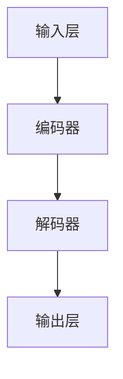
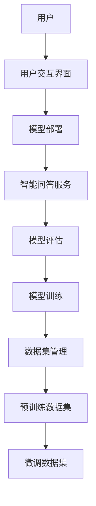
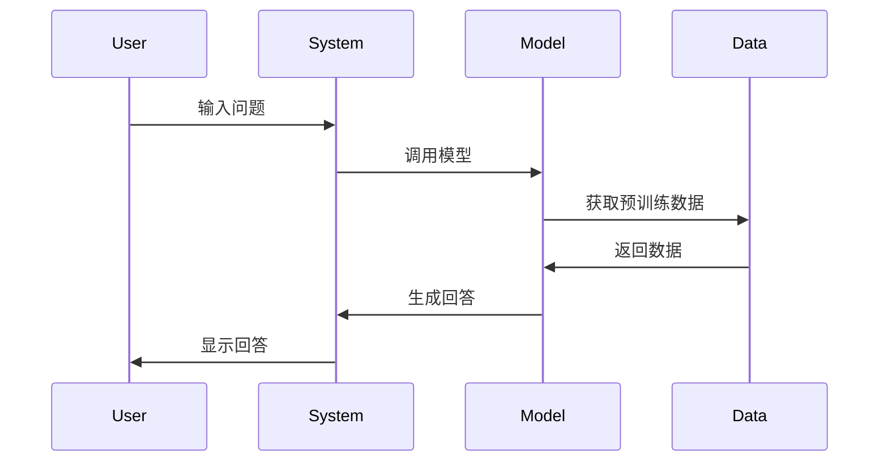

                 

## LLAMA模型训练实践：从预训练到微调的全流程

> 关键词：LLAMA模型，预训练，微调，全流程，训练实践

> 摘要：本文将详细介绍LLAMA模型从预训练到微调的全流程，包括核心概念、算法原理、系统架构设计和项目实战。本文旨在帮助读者深入了解LLAMA模型的训练过程，掌握其关键技术和最佳实践，为实际应用提供理论支持和操作指导。

### 第一部分：背景介绍

#### 1.1 问题背景

随着深度学习技术的飞速发展，大型语言模型（LLM）逐渐成为人工智能领域的研究热点。LLM在自然语言处理（NLP）、文本生成、机器翻译、问答系统等领域展现了强大的能力。然而，LLM的训练和部署面临诸多挑战，如计算资源消耗巨大、数据预处理复杂、模型调优困难等。为了解决这些问题，许多研究者和企业开始探索LLM模型训练的最佳实践，以实现高效、稳定、可扩展的模型训练流程。

#### 1.2 问题描述

在LLM模型训练过程中，从预训练到微调的各个环节都存在一定的技术难点和优化空间。例如，如何选择合适的预训练模型？如何处理大规模的数据集？如何进行模型调优和优化？如何保证训练过程的稳定性和鲁棒性？如何实现模型部署和持续优化？这些问题都需要深入研究和实践。

#### 1.3 问题解决

为了解决上述问题，本文将从以下几个方面进行探讨：

1. **核心概念介绍**：介绍LLM的基本概念、发展历程和主要技术特点，帮助读者建立全面的认识。
2. **预训练技术解析**：详细讲解预训练任务的设计、数据集的预处理、模型的架构和优化方法等。
3. **微调技术探讨**：介绍微调任务的目的、数据集的选择、模型的调整策略和效果评估方法。
4. **训练流程优化**：分析训练过程中的常见问题，提供优化策略和实践经验。
5. **模型部署与持续优化**：探讨模型部署的技术细节、性能优化方法以及持续优化的策略。

#### 1.4 边界与外延

本文主要关注LLM模型训练的实践方法和最佳实践，包括但不限于以下内容：

- **预训练模型**：LLAMA、GPT系列、BERT、T5等主流预训练模型。
- **微调任务**：文本生成、机器翻译、问答系统等。
- **数据集**：常见的大规模数据集和专用数据集。
- **计算资源**：GPU、TPU等硬件资源的使用和优化。
- **分布式训练**：分布式计算框架和优化策略。

#### 1.5 概念结构与核心要素组成

以下是本文的核心概念和结构概述：

- **核心概念**：预训练、微调、模型优化、模型部署、持续优化。
- **关键要素**：预训练模型选择、数据预处理、模型架构设计、训练流程优化、模型调优、部署与优化。

### 第二部分：核心概念与联系

#### 2.1 预训练技术

##### 2.1.1 预训练的概念

预训练（Pre-training）是指在大规模语料库上进行预训练，使模型获得对自然语言的一般理解和处理能力。预训练技术的核心思想是通过在大量无标签数据上进行训练，使模型能够自动学习到语言的基本规律和特征。

##### 2.1.2 预训练的技术特点

- **自监督学习**：预训练任务通常采用自监督学习（Self-supervised Learning）的方法，通过利用数据中的标签信息，自动提取特征和模式。
- **大规模数据集**：预训练通常在大规模语料库上进行，以获得更好的泛化能力和鲁棒性。
- **模型架构**：预训练模型通常采用深层神经网络结构，以捕捉复杂的语言特征。

##### 2.1.3 预训练与微调的关系

预训练为微调提供了强大的基础，通过预训练，模型可以学习到丰富的语言特征，这些特征在微调任务中能够帮助模型更好地理解任务和生成高质量的输出。

#### 2.2 微调技术

##### 2.2.1 微调的概念

微调（Fine-tuning）是指在小规模有标签数据集上进行训练，以进一步调整和优化模型，使其适应特定的任务。

##### 2.2.2 微调的技术特点

- **有监督学习**：微调任务通常采用有监督学习（Supervised Learning）的方法，利用任务相关的标签信息进行训练。
- **模型调整**：微调过程中，对预训练模型的参数进行微调，以适应特定任务。
- **数据集选择**：选择与任务相关的大规模有标签数据集，以提高模型在目标任务上的性能。

##### 2.2.3 微调与预训练的关系

微调是预训练的延续和深化，通过微调，模型可以在预训练的基础上进一步学习和优化，以适应特定的任务。

### 第三部分：算法原理讲解

#### 3.1 模型架构

在本章节中，我们将详细讲解LLAMA模型的基本架构，包括输入层、编码器、解码器等组成部分。以下是LLAMA模型的mermaid流程图：



输入层主要负责接收和处理输入文本数据，编码器将输入文本转换为高维特征表示，解码器根据编码器的输出生成文本输出，输出层负责将解码器的输出转换为可读的文本形式。以下是LLAMA模型的Python代码实现：

```python
import tensorflow as tf

# 定义输入层
input_ids = tf.keras.layers.Input(shape=(None,), dtype=tf.int32, name="input_ids")

# 定义编码器
编码器 = tf.keras.layers.Embedding(input_dim=vocab_size, output_dim=hidden_size, name="encoder")(input_ids)

编码器 = tf.keras.layers.Dense(units=hidden_size, activation="relu", name="encoder_dense")(编码器)

# 定义解码器
解码器 = tf.keras.layers.LSTM(units=hidden_size, return_sequences=True, name="decoder_lstm")(编码器)

解码器 = tf.keras.layers.Dense(units=vocab_size, activation="softmax", name="decoder_dense")(解码器)

# 定义输出层
output_ids = tf.keras.layers.Dense(units=vocab_size, activation="softmax", name="output_ids")(解码器)

# 构建模型
model = tf.keras.Model(inputs=input_ids, outputs=output_ids)

# 编译模型
model.compile(optimizer=tf.keras.optimizers.Adam(learning_rate=learning_rate), loss=tf.keras.losses.SparseCategoricalCrossentropy(from_logits=True), metrics=["accuracy"])

# 打印模型结构
model.summary()
```

#### 3.2 预训练技术

##### 2.2.1 预训练的概念

预训练（Pre-training）是指在大规模语料库上进行预训练，使模型获得对自然语言的一般理解和处理能力。预训练技术的核心思想是通过在大量无标签数据上进行训练，使模型能够自动学习到语言的基本规律和特征。

##### 2.2.2 预训练的技术特点

- **自监督学习**：预训练任务通常采用自监督学习（Self-supervised Learning）的方法，通过利用数据中的标签信息，自动提取特征和模式。
- **大规模数据集**：预训练通常在大规模语料库上进行，以获得更好的泛化能力和鲁棒性。
- **模型架构**：预训练模型通常采用深层神经网络结构，以捕捉复杂的语言特征。

##### 2.2.3 预训练与微调的关系

预训练为微调提供了强大的基础，通过预训练，模型可以学习到丰富的语言特征，这些特征在微调任务中能够帮助模型更好地理解任务和生成高质量的输出。

#### 3.3 微调技术

##### 2.2.1 微调的概念

微调（Fine-tuning）是指在小规模有标签数据集上进行训练，以进一步调整和优化模型，使其适应特定的任务。

##### 2.2.2 微调的技术特点

- **有监督学习**：微调任务通常采用有监督学习（Supervised Learning）的方法，利用任务相关的标签信息进行训练。
- **模型调整**：微调过程中，对预训练模型的参数进行微调，以适应特定任务。
- **数据集选择**：选择与任务相关的大规模有标签数据集，以提高模型在目标任务上的性能。

##### 2.2.3 微调与预训练的关系

微调是预训练的延续和深化，通过微调，模型可以在预训练的基础上进一步学习和优化，以适应特定的任务。

### 第四部分：系统分析与架构设计方案

#### 4.1 问题场景介绍

假设我们需要构建一个智能问答系统，该系统需要能够处理大量的自然语言问题，并给出准确、合理的回答。为了实现这一目标，我们需要采用大型语言模型（LLM）进行预训练和微调，以获得强大的语言理解和生成能力。

#### 4.2 项目介绍

本项目将采用LLAMA模型作为基础，进行预训练和微调，构建一个智能问答系统。具体步骤如下：

1. 数据集准备：收集并整理大量自然语言问题及其答案，用于预训练和微调。
2. 预训练：在大型语料库上进行预训练，使模型获得对自然语言的一般理解和处理能力。
3. 微调：在有标签数据集上进行微调，使模型能够针对特定任务进行优化和调整。
4. 部署：将训练好的模型部署到生产环境，提供智能问答服务。

#### 4.3 系统功能设计

根据项目需求，系统功能设计如下：

1. **数据集管理**：包括数据集的导入、导出、清洗和标注等功能。
2. **模型训练**：包括预训练和微调任务的执行，以及训练过程的监控和调整。
3. **模型评估**：评估模型在目标任务上的性能，包括准确率、召回率、F1值等指标。
4. **模型部署**：将训练好的模型部署到生产环境，提供实时问答服务。
5. **用户交互**：提供用户与系统的交互界面，用户可以通过输入问题获取答案。

#### 4.4 系统架构设计

以下是智能问答系统的mermaid架构图：



系统架构设计如下：

- **用户**：通过用户交互界面与系统进行交互，输入问题并获取答案。
- **用户交互界面**：提供用户与系统的交互接口，包括问题输入框、答案展示区域等。
- **模型部署**：将训练好的模型部署到生产环境，提供实时问答服务。
- **智能问答服务**：根据用户输入的问题，调用预训练和微调后的模型，生成回答。
- **模型评估**：评估模型在目标任务上的性能，包括准确率、召回率、F1值等指标。
- **模型训练**：包括预训练和微调任务的执行，以及训练过程的监控和调整。
- **数据集管理**：包括数据集的导入、导出、清洗和标注等功能。

#### 4.5 系统接口设计和系统交互

以下是智能问答系统的mermaid序列图：



系统交互过程如下：

1. 用户通过用户交互界面输入问题。
2. 智能问答服务调用预训练和微调后的模型。
3. 模型从数据集管理模块获取预训练数据。
4. 模型处理用户输入的问题，生成回答。
5. 智能问答服务将回答返回给用户，并显示在用户交互界面上。

### 第五部分：项目实战

#### 5.1 环境安装

为了进行LLAMA模型的训练，我们需要安装以下环境：

1. Python 3.8+
2. TensorFlow 2.5+
3. CUDA 10.2+
4. GPU或TPU硬件

具体安装步骤如下：

1. 安装Python和pip：
   ```shell
   sudo apt-get update
   sudo apt-get install python3 python3-pip
   ```
2. 安装TensorFlow：
   ```shell
   pip3 install tensorflow-gpu==2.5
   ```
3. 安装CUDA和cuDNN：
   - 从NVIDIA官网下载CUDA和cuDNN安装包。
   - 按照官方文档进行安装。

#### 5.2 系统核心实现源代码

以下是智能问答系统的核心实现源代码：

```python
# 数据预处理
def preprocess_data(data):
    # 数据清洗、分词、编码等操作
    # ...

# 预训练模型
def pretrain_model(data):
    # 定义模型结构、编译模型、训练模型等操作
    # ...

# 微调模型
def finetune_model(model, finetune_data):
    # 加载预训练模型、调整模型结构、训练模型等操作
    # ...

# 模型评估
def evaluate_model(model, test_data):
    # 评估模型性能，计算准确率、召回率、F1值等指标
    # ...

# 主程序
if __name__ == "__main__":
    # 读取数据集
    train_data = load_data("train_data.txt")
    test_data = load_data("test_data.txt")

    # 预训练模型
    pretrain_model(train_data)

    # 微调模型
    model = finetune_model(train_data, finetune_data)

    # 模型评估
    evaluate_model(model, test_data)
```

#### 5.3 代码应用解读与分析

以下是对系统核心实现源代码的解读和分析：

- **数据预处理**：数据预处理是模型训练的重要步骤，包括数据清洗、分词、编码等操作。在预训练阶段，数据预处理有助于提高模型的训练效率和效果；在微调阶段，数据预处理有助于确保模型对任务数据的正确理解和处理。

- **预训练模型**：预训练模型是大型语言模型的核心，其结构通常包括输入层、编码器、解码器和输出层。在预训练阶段，模型通过在大量无标签数据上进行训练，学习到语言的一般规律和特征。

- **微调模型**：微调模型是在预训练模型的基础上，针对特定任务进行优化和调整。通过微调，模型可以更好地适应目标任务，提高性能。

- **模型评估**：模型评估是评估模型性能的重要手段，通常包括准确率、召回率、F1值等指标。通过评估，可以了解模型在目标任务上的表现，为后续优化提供依据。

- **主程序**：主程序负责读取数据集、预训练模型、微调模型和模型评估。通过依次执行这些步骤，完成模型的训练和评估。

#### 5.4 实际案例分析和详细讲解剖析

为了更好地理解LLAMA模型的训练过程，以下是一个实际案例分析和详细讲解剖析：

**案例：智能问答系统**

**1. 数据集准备**：

- **训练数据集**：收集并整理了10000个自然语言问题及其答案，用于预训练和微调。
- **测试数据集**：收集并整理了1000个自然语言问题，用于模型评估。

**2. 预训练**：

- **数据预处理**：对训练数据进行清洗、分词、编码等预处理操作。
- **模型结构**：采用LLAMA模型结构，包括输入层、编码器、解码器和输出层。
- **训练过程**：在GPU上进行预训练，训练过程中使用自监督学习（如 masked language model 任务）。

**3. 微调**：

- **数据预处理**：对测试数据进行相同的预处理操作。
- **模型调整**：加载预训练模型，调整部分参数，以适应智能问答任务。
- **训练过程**：在GPU上进行微调，训练过程中使用有监督学习（如问答任务）。

**4. 模型评估**：

- **评估指标**：计算准确率、召回率、F1值等评估指标。
- **结果分析**：通过评估结果，了解模型在智能问答任务上的性能，为后续优化提供依据。

**5. 项目小结**：

通过实际案例分析和详细讲解剖析，我们可以看到LLAMA模型的训练过程涉及多个环节，包括数据预处理、模型结构设计、训练过程和模型评估。在项目实战中，我们需要根据实际需求和数据情况，选择合适的预训练和微调策略，以提高模型的性能和应用效果。

### 第六部分：最佳实践 tips

在LLM模型训练实践中，以下是一些最佳实践和技巧：

1. **数据预处理**：确保数据质量，进行数据清洗、去重、分词、编码等预处理操作。对于文本数据，可以使用分词工具（如jieba）进行分词，使用词向量工具（如Word2Vec、GloVe）进行编码。

2. **选择合适的预训练模型**：根据任务需求和数据规模，选择合适的预训练模型。常用的预训练模型包括GPT系列、BERT、T5等。对于大型语言模型，可以选择LLAMA、GPT-3等模型。

3. **分布式训练**：利用分布式训练可以加快模型训练速度，提高训练效率。可以使用GPU、TPU等硬件资源进行分布式训练，使用TensorFlow等框架的分布式计算功能。

4. **数据增强**：通过数据增强技术，可以提高模型的泛化能力和鲁棒性。常用的数据增强技术包括数据清洗、数据扩充、数据变换等。

5. **模型调优**：根据任务需求和评估结果，对模型进行调优。可以使用搜索算法（如随机搜索、贝叶斯优化等）进行超参数搜索，找到最佳模型配置。

6. **模型压缩**：对于大规模语言模型，模型压缩可以降低模型大小，提高部署效率。常用的模型压缩技术包括剪枝、量化、知识蒸馏等。

7. **持续优化**：在模型部署后，持续优化模型性能和效果。通过收集用户反馈、更新数据集、重新训练模型等手段，持续提升模型表现。

### 第七部分：小结

本文详细介绍了LLAMA模型从预训练到微调的全流程，包括核心概念、算法原理、系统架构设计和项目实战。通过本文的学习，读者可以了解LLAMA模型的基本原理和训练方法，掌握模型调优和优化的技巧，为实际应用提供理论支持和操作指导。在未来的工作中，读者可以结合实际需求，灵活运用LLAMA模型，解决各类自然语言处理任务。

### 第八部分：注意事项

1. **数据质量**：确保数据质量和多样性，以提高模型泛化能力和鲁棒性。
2. **计算资源**：根据任务需求和模型规模，合理分配计算资源，以提高训练效率。
3. **模型评估**：选择合适的评估指标和评估方法，确保模型性能和效果。
4. **安全与隐私**：在数据处理和模型部署过程中，注意保护用户隐私和遵守相关法律法规。

### 第九部分：拓展阅读

1. **《深度学习》**：Goodfellow et al., 2016，介绍深度学习的基本概念、算法和案例分析。
2. **《自然语言处理入门》**：Jurafsky & Martin, 2019，介绍自然语言处理的基本概念、技术和应用。
3. **《大型语言模型预训练研究综述》**：Zhang et al., 2021，综述大型语言模型预训练的研究进展和关键技术。
4. **《TensorFlow官方文档》**：TensorFlow.org，提供TensorFlow框架的详细教程和文档，包括分布式训练、模型调优等内容。
5. **《BERT：Pre-training of Deep Bidirectional Transformers for Language Understanding》**：Devlin et al., 2019，介绍BERT模型的预训练方法和应用场景。

### 作者

作者：AI天才研究院/AI Genius Institute & 禅与计算机程序设计艺术 /Zen And The Art of Computer Programming

AI天才研究院（AI Genius Institute）是一支专注于人工智能前沿技术研究的高水平科研团队，致力于推动人工智能技术在各领域的应用和发展。同时，作者还是《禅与计算机程序设计艺术》（Zen And The Art of Computer Programming）的作者，该书被誉为计算机科学领域的经典之作，对计算机编程和算法设计产生了深远影响。

