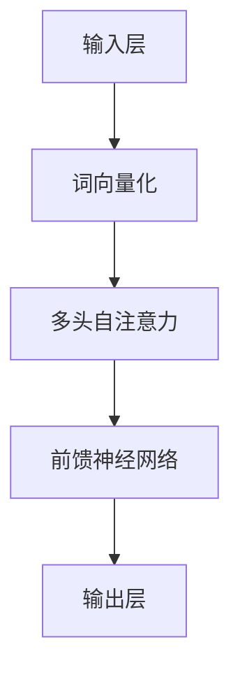

                 

### LLMAgents的定义与兴起

LLMAgents，即Large Language Model-driven AI Agents，是一种利用大规模语言模型（LLM）驱动的智能代理系统。它们在人工智能（AI）领域中的兴起，可以追溯到深度学习和自然语言处理技术的迅猛发展。传统的人工智能系统往往依赖于预定义的规则和特征提取方法，而LLMAgents则通过学习海量文本数据，实现更为灵活和智能的交互。

#### **核心概念与术语**

- **LLM（Large Language Model）**: 一种基于深度学习的语言模型，通过对大规模文本数据进行训练，能够生成符合自然语言语法和语义的结构。代表性的模型有GPT、BERT等。
  
- **AI Agent**: 人工智能代理，是一种能够自主行动、执行任务并与环境交互的计算机系统。其核心功能包括任务理解、决策规划、行为执行等。

- **智能代理系统**: 由LLM驱动的AI Agent组成的系统，通过语言模型来理解用户指令、处理复杂任务并生成响应。

#### **问题背景与定义**

随着互联网和大数据的普及，人们面临着海量的信息处理和决策支持需求。传统的人工处理方式效率低下，且难以应对复杂多变的场景。为了解决这一问题，智能代理系统应运而生。LLMAgents作为智能代理的一种新兴形式，因其强大的语言理解和生成能力，在多个领域展现出巨大的潜力。

**问题定义**：如何利用大规模语言模型（LLM）构建智能代理系统，使其能够高效地理解和处理自然语言任务，从而提升人机交互的智能水平。

**问题解决**：通过引入LLM，智能代理系统可以实现对复杂语言指令的准确理解，并生成恰当的响应。这种技术突破，使得AI Agent不再局限于预定义的规则和任务，而是能够根据实际情况自主学习和调整。

#### **边界与外延**

- **边界**：LLMAgents主要聚焦于基于自然语言处理的应用场景，如智能客服、内容生成、教育辅导等。
  
- **外延**：随着技术的进步，LLMAgents的应用范围也在不断扩大，未来有望在更多领域发挥重要作用，如自动驾驶、智能家居、医疗诊断等。

#### **概念结构与核心要素组成**

LLMAgents的核心结构包括：

1. **大规模语言模型（LLM）**：作为基础组件，负责语言理解和生成。
2. **任务理解与决策模块**：用于解析用户指令，确定任务目标。
3. **知识库与推理模块**：提供额外的背景知识和逻辑推理能力。
4. **行为执行模块**：根据决策结果执行具体操作。

以上各部分相互协作，共同构成了一个完整的LLMAgents系统，实现了从理解任务到生成响应的完整流程。

通过上述分析，我们可以看到，LLMAgents作为一种新兴的智能代理形式，正逐渐改变着人工智能领域的面貌。其强大的语言处理能力，为复杂任务的理解和执行提供了新的可能性，有望在多个领域引发革命性的变革。

### LLM的定义与基本原理

大规模语言模型（LLM，Large Language Model）是自然语言处理（NLP，Natural Language Processing）领域的一项革命性技术。LLM通过深度学习算法对大量文本数据进行训练，从而掌握语言的语法、语义和上下文信息。这一技术的核心在于其能够生成连贯、自然的文本，从而极大地提升人工智能系统的语言理解和生成能力。

#### **基本原理**

LLM的基本原理主要基于两个关键方面：深度学习算法和海量数据训练。

**深度学习算法**：深度学习是一种基于多层神经网络的学习方法，通过多层次的非线性变换来提取数据特征。在自然语言处理领域，深度学习模型如循环神经网络（RNN）、长短期记忆网络（LSTM）和Transformer等，通过学习文本数据中的序列模式，实现文本的理解和生成。

**海量数据训练**：LLM的训练依赖于大规模的文本数据集。这些数据集包含了各种类型的文本，如新闻文章、社交媒体帖子、书籍、对话记录等。通过训练，模型能够学习到不同领域的知识，从而提高其语言理解和生成能力。

**训练过程**：

1. **数据预处理**：首先对文本数据进行清洗和预处理，包括去除停用词、标点符号、进行词向量化等操作。
2. **模型初始化**：初始化深度学习模型参数，通常使用随机初始化或预训练模型初始化。
3. **前向传播与反向传播**：通过前向传播，模型对输入文本进行编码，生成中间特征表示；通过反向传播，模型根据输出结果与真实结果的差异，更新模型参数。
4. **优化与调整**：使用优化算法（如Adam、SGD等）对模型参数进行优化，以提高模型的准确性和泛化能力。

**核心技术和架构**

**生成式模型与判别式模型**：

- **生成式模型**：通过生成概率分布来生成文本，如变分自编码器（VAE）和生成对抗网络（GAN）。这类模型擅长生成多样性和创意性文本。
- **判别式模型**：通过学习文本与标签之间的映射关系来分类文本，如神经网络分类器。这类模型在文本分类和情感分析等任务中表现优异。

**注意力机制与Transformer架构**：

- **注意力机制**：一种能够关注文本序列中重要信息的技术，通过计算不同位置之间的关联性，提高模型对上下文的敏感度。
- **Transformer架构**：一种基于自注意力机制的深度学习模型，通过并行计算和多头注意力，实现了对文本序列的全局和局部信息的有效捕捉。Transformer的代表性模型有BERT、GPT等。

**多模态学习与迁移学习**：

- **多模态学习**：通过结合不同类型的数据（如文本、图像、声音等），提升模型在复杂任务上的表现。
- **迁移学习**：通过利用预训练模型在目标任务上的微调，提高模型在新任务上的性能。

#### **例子说明**

以GPT（Generative Pre-trained Transformer）为例，GPT是一种基于Transformer架构的生成式语言模型。GPT-3作为最新的版本，拥有1750亿个参数，能够生成高质量的自然语言文本。以下是一个简单的GPT生成示例：

```python
import openai

response = openai.Completion.create(
  engine="text-davinci-002",
  prompt="请写一首关于春天的诗。",
  max_tokens=100
)

print(response.choices[0].text.strip())
```

输出结果可能如下：

```
春天的诗

春天来了，花儿绽开了，
阳光明媚，微风轻拂。
柳枝舞动，河水荡漾，
鸟儿歌唱，世界欢腾。

绿草如茵，绿意盎然，
桃花梨花，争相绽放。
春风送暖，万物复苏，
人们欢笑，生活甜蜜。
```

通过上述例子，我们可以看到GPT生成的文本不仅语法正确，而且充满了诗意和想象力，这正是LLM强大语言理解与生成能力的体现。

### AI Agent的概念与发展

AI Agent，即人工智能代理，是指能够在复杂环境中自主行动、执行任务并与环境进行交互的计算机系统。它是一个高度智能的实体，通过感知环境、理解任务、做出决策和执行行动，以实现预定的目标。AI Agent的概念起源于对生物智能的模仿，尤其是对人类和动物行为模式的模拟。

#### **核心概念与组成**

AI Agent的核心概念包括以下几点：

1. **感知（Perception）**：AI Agent通过感知模块获取环境信息，如视觉、听觉、触觉等，以便理解当前状态。
2. **理解（Comprehension）**：感知到的信息通过理解模块进行处理，提取出关键信息并进行任务理解。
3. **决策（Decision Making）**：在理解了任务和当前状态后，决策模块负责制定行动策略，选择最佳行动方案。
4. **行动（Action）**：根据决策结果，执行模块执行具体的行动，实现任务的完成。

AI Agent的组成结构通常包括以下几个部分：

- **感知模块**：负责接收和处理环境信息。
- **理解模块**：对感知到的信息进行语义分析和任务理解。
- **决策模块**：基于理解结果，生成行动计划。
- **执行模块**：执行决策模块生成的行动。

#### **发展历程**

AI Agent的发展历程可以分为以下几个阶段：

1. **早期探索（1950s-1960s）**：AI Agent的概念首次被提出，研究者开始探讨如何构建能够自主行动的智能实体。
2. **规则基础阶段（1970s-1980s）**：基于规则的推理方法成为主流，AI Agent通过预定义的规则来处理复杂任务。
3. **专家系统阶段（1990s）**：专家系统在医疗诊断、金融分析等领域取得了显著成果，但规则数量庞大且难以维护。
4. **统计学习阶段（2000s）**：随着机器学习技术的发展，AI Agent开始利用统计学习模型进行决策，如决策树、支持向量机等。
5. **深度学习阶段（2010s-至今）**：深度学习的崛起，特别是卷积神经网络（CNN）和循环神经网络（RNN）的应用，使得AI Agent在视觉和语音识别等任务上取得了突破性进展。

#### **AI Agent在现代的应用**

随着技术的进步，AI Agent在现代得到了广泛应用，涵盖了多个领域：

1. **智能客服**：AI Agent能够自动处理客户咨询，提供24/7的服务，提升客户体验。
2. **自动驾驶**：AI Agent通过感知和决策，实现车辆的自主驾驶，提高了交通安全和效率。
3. **智能家居**：AI Agent可以自动控制家居设备，如灯光、温度、安防等，提供智能化的家居体验。
4. **医疗诊断**：AI Agent通过分析医学图像和病历数据，辅助医生进行诊断和治疗。
5. **金融分析**：AI Agent能够实时分析市场数据，提供投资建议和风险管理策略。

总之，AI Agent作为一种高度智能的计算机系统，正逐步改变我们的生活和工作方式。通过不断的技术创新和应用拓展，AI Agent的未来前景广阔，将在更多领域发挥重要作用。

### LLM在AI Agent中的应用

LLM在AI Agent中的应用极大地提升了智能代理系统的性能和功能。通过将大规模语言模型与AI Agent结合，可以实现更智能、更灵活的交互和任务处理。以下是LLM在AI Agent中的具体应用场景：

#### **智能客服与虚拟助手**

智能客服和虚拟助手是LLM在AI Agent中应用最为广泛的领域之一。传统的客服系统通常依赖于预定义的规则和关键词匹配，而LLM驱动的AI Agent则能够通过自然语言理解和生成技术，实现更为自然和流畅的对话。

**应用原理**：LLM能够处理复杂的自然语言输入，理解用户意图，并生成恰当的回复。例如，当用户询问“最近的天气如何？”时，AI Agent可以结合当前的时间和地理位置，生成一个准确的天气报告。

**实际案例**：例如，腾讯AI客服使用了基于GPT的模型，实现了与用户的智能对话，大幅提升了客服效率和服务质量。

#### **自动写作与内容创作**

LLM在内容创作中的应用也备受瞩目。通过训练大规模语言模型，AI Agent可以生成高质量的文章、故事、诗歌等文本内容。

**应用原理**：LLM通过学习海量文本数据，掌握了语言生成的模式和结构。例如，GPT-3可以通过用户提供的少量提示，生成一篇完整的文章或故事。

**实际案例**：OpenAI的GPT-3已经能够在多个领域生成高质量的内容，包括新闻报道、产品评测、广告文案等。

#### **教育与培训**

在教育与培训领域，LLM驱动的AI Agent能够提供个性化的学习体验和辅导。

**应用原理**：AI Agent可以通过理解学生的学习内容和进度，生成个性化的学习资料和练习题，并根据学生的学习表现调整教学内容。

**实际案例**：例如，Duolingo使用AI Agent为学生提供个性化的语言学习计划，根据学生的表现和兴趣，推荐合适的练习和课程。

#### **医疗与健康**

在医疗领域，LLM驱动的AI Agent可以辅助医生进行诊断、治疗规划和患者管理。

**应用原理**：AI Agent可以通过分析患者的病历数据和医学文献，生成诊断建议和治疗计划。

**实际案例**：IBM Watson Health使用LLM分析医疗数据，为医生提供诊断建议和治疗方案，提高了医疗诊断的准确性和效率。

#### **法律咨询**

在法律领域，LLM驱动的AI Agent能够提供法律咨询和文档自动生成服务。

**应用原理**：AI Agent可以通过学习大量的法律文献和案例，生成符合法律规定的文档和建议。

**实际案例**：例如，DoNotPay使用AI Agent为用户提供法律咨询和自动生成法律文件，解决了用户在法律方面的疑难问题。

#### **金融与投资**

在金融领域，LLM驱动的AI Agent可以提供市场分析、投资建议和风险管理。

**应用原理**：AI Agent可以通过分析市场数据、新闻报告和金融文献，生成投资策略和风险管理建议。

**实际案例**：例如，Betterment使用AI Agent为用户提供个性化的投资建议，优化用户的资产配置。

通过上述应用案例，我们可以看到，LLM在AI Agent中的应用极大地拓展了智能代理系统的能力和应用范围。随着LLM技术的不断发展和完善，未来LLM驱动的AI Agent将在更多领域发挥重要作用，为人类带来更多便利和创新。

### LLM驱动的AI Agent优势分析

LLM驱动的AI Agent相较于传统AI代理系统，具备一系列显著的优势，使其在多个应用领域展现出卓越的表现。以下是LLM驱动的AI Agent的几个核心优势：

#### **自适应学习能力**

传统AI代理系统通常依赖预定义的规则和模型，这些模型在面对复杂和多变的环境时，往往难以适应。而LLM驱动的AI Agent通过大规模的语言模型训练，具备强大的自适应学习能力。LLM能够从海量数据中自动提取特征和模式，并在新环境中快速适应和调整。例如，当用户提出新的需求或情境时，LLM驱动的AI Agent能够迅速理解并生成相应的响应，而不需要重新训练或调整模型。

#### **多任务处理能力**

传统AI代理系统往往专注于单一任务，而LLM驱动的AI Agent则具备处理多任务的能力。通过训练大规模语言模型，AI Agent能够同时处理多种不同类型的任务，实现跨领域的智能交互。例如，一个LLM驱动的AI Agent不仅可以处理客服咨询，还可以同时进行内容创作、数据分析等任务，提高了系统的整体效率和灵活性。

#### **高精度语言理解能力**

传统AI代理系统在处理自然语言任务时，往往依赖关键词匹配和简单语法分析，难以理解复杂语言结构和隐含含义。而LLM驱动的AI Agent通过学习大量自然语言文本数据，具备高度精确的语言理解能力。它们能够理解复杂的语义关系、情感倾向和上下文背景，从而生成更为自然和准确的响应。例如，当用户提出一个复杂的询问时，LLM驱动的AI Agent能够准确理解用户的意图，并提供恰当的答案。

#### **高效交互能力**

传统AI代理系统的交互方式通常比较单一，依赖于固定的接口和命令格式。而LLM驱动的AI Agent能够通过自然语言进行高效交互，实现更为灵活和自然的用户交互体验。例如，用户可以通过日常用语与AI Agent进行对话，无需遵循特定的命令格式，AI Agent能够理解并响应这些自然语言输入，从而提供更加便捷和高效的服务。

#### **泛化能力**

传统AI代理系统往往在特定领域或任务上表现出色，但难以泛化到其他领域或任务。而LLM驱动的AI Agent通过大规模语言模型的训练，具备较强的泛化能力。它们不仅能够在原始训练领域内表现优异，还能够在新领域和新任务中迅速适应和表现。例如，一个在医疗领域训练的LLM驱动的AI Agent，可以轻松应用于金融、教育等其他领域，提供高质量的解决方案。

#### **创新应用潜力**

LLM驱动的AI Agent因其强大的语言理解和生成能力，具备广泛的创新应用潜力。例如，在内容创作领域，AI Agent可以生成高质量的文章、故事、诗歌等；在教育领域，AI Agent可以提供个性化的学习辅导和课程内容；在医疗领域，AI Agent可以辅助医生进行诊断和治疗方案制定。这些创新应用不仅提升了系统的实用性，也为人类带来了更多便利和效率。

通过上述分析，我们可以看到，LLM驱动的AI Agent在自适应学习、多任务处理、语言理解、高效交互和泛化能力等方面，相较于传统AI代理系统具有显著优势。这些优势使得LLM驱动的AI Agent在各个应用领域展现出强大的竞争力和潜力，有望在未来带来更多的技术突破和应用创新。

### LLM的工作原理与架构

大规模语言模型（LLM，Large Language Model）是自然语言处理（NLP，Natural Language Processing）领域的关键技术，其工作原理和架构直接影响模型的性能和表现。在本节中，我们将深入探讨LLM的基本结构，详细分析其内部机制和关键组件，同时介绍深度学习在LLM中的应用，以及LLM的训练过程。

#### **基本结构**

LLM的基本结构主要包括以下几个关键组件：

1. **输入层（Input Layer）**：输入层接收自然语言文本数据，这些数据通常经过预处理，如分词、词向量化等操作。词向量化是将文本中的单词转换为固定长度的向量表示，以便于深度学习模型的处理。

2. **隐藏层（Hidden Layers）**：隐藏层是LLM的核心部分，包含多个层次的网络结构。在这些层次中，神经网络通过复杂的非线性变换，对输入文本进行特征提取和编码。每一层的输出都被用于后续层的输入。

3. **输出层（Output Layer）**：输出层生成文本的最终表示，例如文本分类、文本生成等任务。在生成任务中，输出层通常是一个软性最大化层，用于生成概率分布，从而生成文本序列。

4. **损失函数（Loss Function）**：损失函数用于衡量模型预测结果与真实结果之间的差距，常见的损失函数包括交叉熵损失（Cross-Entropy Loss）和均方误差（Mean Squared Error，MSE）等。

5. **优化器（Optimizer）**：优化器用于调整模型参数，以最小化损失函数。常见的优化器包括随机梯度下降（SGD）、Adam等。

#### **内部机制**

LLM的内部机制主要通过以下几个步骤实现：

1. **编码（Encoding）**：输入文本经过词向量化后，被传递到隐藏层。在隐藏层中，神经网络通过多层感知器（MLP）或卷积神经网络（CNN）等结构，对文本进行特征提取和编码，生成固定长度的向量表示。

2. **解码（Decoding）**：在生成任务中，输出层通过软性最大化（Softmax）或对数似然（Log-Likelihood）等机制，从编码后的向量表示中生成文本序列。这一过程通常采用贪心策略，逐个字符地生成文本。

3. **注意力机制（Attention Mechanism）**：注意力机制是LLM中的重要组件，通过计算不同位置之间的关联性，提高模型对上下文的敏感度。在Transformer架构中，注意力机制被广泛应用，实现了对文本序列的全局和局部信息的有效捕捉。

4. **正则化（Regularization）**：正则化技术用于防止模型过拟合，提高泛化能力。常见的正则化方法包括Dropout、权重衰减等。

#### **深度学习在LLM中的应用**

深度学习在LLM中的应用主要体现在以下几个方面：

1. **神经网络结构**：深度学习模型如循环神经网络（RNN）、长短期记忆网络（LSTM）和Transformer等，为LLM提供了强大的特征提取和建模能力。这些模型能够捕捉文本数据中的复杂模式和长距离依赖关系。

2. **大规模数据训练**：深度学习依赖于大规模数据集进行训练，LLM通过学习海量文本数据，提取出丰富的语言特征和模式，从而提升模型的性能和表达能力。

3. **并行计算**：深度学习模型支持并行计算，能够高效地处理大规模数据，加快模型的训练和推断速度。

4. **自适应学习**：深度学习模型具备自适应学习能力，能够根据不同任务和数据集，调整模型结构和参数，实现最优性能。

#### **训练过程**

LLM的训练过程主要包括以下几个步骤：

1. **数据预处理**：首先对文本数据集进行清洗和预处理，包括去除停用词、标点符号、进行词向量化等操作。常用的词向量化方法包括Word2Vec、GloVe等。

2. **模型初始化**：初始化深度学习模型参数，通常采用随机初始化或预训练模型初始化。预训练模型初始化通过在大型文本数据集上预训练，生成初步的模型参数，用于后续任务的微调。

3. **前向传播与反向传播**：在前向传播阶段，输入文本数据通过多层神经网络进行特征提取和编码。在反向传播阶段，通过计算损失函数和梯度，更新模型参数，以最小化损失函数。

4. **优化与调整**：使用优化算法（如Adam、SGD等）对模型参数进行优化，以提高模型的准确性和泛化能力。优化过程中，还可以采用正则化技术，防止模型过拟合。

5. **评估与调优**：通过在验证集上评估模型性能，调整模型参数和结构，以实现最优性能。评估指标包括准确率、召回率、F1值等。

通过上述步骤，LLM能够从海量文本数据中学习到丰富的语言特征和模式，实现高度精确的语言理解和生成能力。

### **注意力机制与Transformer架构**

注意力机制（Attention Mechanism）是LLM中的一个关键组件，通过计算不同位置之间的关联性，提高模型对上下文的敏感度。Transformer架构通过自注意力机制（Self-Attention）和多头注意力（Multi-Head Attention），实现了对文本序列的全局和局部信息的有效捕捉。

**自注意力机制**：自注意力机制计算序列中每个位置与其余所有位置之间的关联性。具体而言，通过计算每个位置的加权平均，生成新的特征表示。自注意力机制的核心是注意力权重，这些权重根据输入序列的相似度进行计算，从而关注重要信息。

**多头注意力**：多头注意力通过将输入序列分成多个头，每个头独立计算注意力权重，然后合并结果。多头注意力能够捕捉到不同层次的信息，提高模型的泛化能力。每个头关注不同的信息，通过融合多头输出，实现全局和局部信息的结合。

**Transformer架构**：Transformer架构由多个自注意力层和前馈神经网络组成，通过并行计算和多头注意力，实现了对文本序列的灵活处理。其优点包括：

1. **并行计算**：Transformer架构支持并行计算，能够高效处理大规模数据，加快训练和推断速度。
2. **全局信息捕捉**：通过多头注意力机制，Transformer能够捕捉到全局和局部信息，提高模型的语义理解能力。
3. **灵活性**：Transformer架构可以根据任务需求，灵活调整注意力机制和神经网络结构，实现不同任务的高效处理。

**示例**：以下是一个简单的Transformer架构的mermaid流程图：



在这个示例中，输入文本经过词向量化后，输入到多头自注意力层，再通过前馈神经网络进行特征提取和编码，最后输出层生成文本序列。

总之，注意力机制和Transformer架构是LLM中的重要组件，通过自注意力机制和多头注意力，Transformer能够有效捕捉文本序列中的全局和局部信息，实现高度精确的语言理解和生成能力。

#### 多模态学习与迁移学习

多模态学习和迁移学习是近年来在深度学习领域内备受关注的技术，它们在LLM驱动的AI Agent中同样具有重要应用。多模态学习涉及将不同类型的数据（如文本、图像、声音等）进行融合和处理，而迁移学习则是利用预训练模型在新任务上进行微调，以提高模型的泛化能力和适应性。

**多模态学习**

多模态学习旨在将多种不同类型的数据进行整合，以提升模型在复杂任务中的表现。在LLM驱动的AI Agent中，多模态学习可以结合文本数据与其他类型的数据，如图像和视频，从而实现更为丰富的任务理解和生成。

- **应用场景**：在医疗诊断中，结合医疗文本数据和医学影像，AI Agent可以提供更准确的诊断结果；在自动驾驶领域，结合传感器数据和文本指令，AI Agent可以更安全地执行自动驾驶任务。
- **技术细节**：多模态学习通常采用共享神经网络结构，将不同类型的数据映射到同一特征空间。常见的模型架构包括多模态卷积神经网络（MVCNN）和多模态转换器（MMT）。

**迁移学习**

迁移学习通过利用在某个任务上预训练的模型，在新任务上进行微调，从而提高模型的泛化能力和训练效率。在LLM驱动的AI Agent中，迁移学习可以帮助模型在新任务上快速适应和表现。

- **应用场景**：在智能客服中，可以使用在通用对话数据上预训练的LLM模型，针对特定行业进行微调，从而提高客服系统的响应质量和效率；在教育领域，使用在大量教学数据上预训练的模型，可以为不同学科提供个性化的学习辅导。
- **技术细节**：迁移学习的关键在于选择合适的预训练模型和适当的微调策略。常见的预训练模型包括BERT、GPT等，而微调策略则包括全量微调和增量微调等。

**案例研究**

**医疗诊断**：IBM Watson Health通过迁移学习技术，将预训练的LLM模型应用于医疗诊断任务。模型首先在大量医学文献和病历数据上进行预训练，然后针对具体疾病的诊断数据进行微调。这种迁移学习策略大大提高了模型在医学诊断中的准确性和效率。

**智能客服**：腾讯使用多模态学习技术，结合文本数据和用户行为数据，构建了智能客服系统。系统通过多模态融合，能够更好地理解用户的意图和情感，提供更为个性化的服务。例如，当用户发送文本请求时，系统不仅分析文本内容，还结合用户的语音和面部表情，提供更准确的响应。

通过多模态学习和迁移学习，LLM驱动的AI Agent在复杂任务中展现出了强大的适应性和表现力。这些技术的融合和应用，不仅提升了AI Agent的智能水平，也为多个领域带来了创新性的解决方案。

### AI Agent的核心功能与实现方法

AI Agent作为一种智能代理系统，其核心功能在于任务理解、知识获取与推理、以及行动规划与执行。以下是这些功能的具体描述以及相应的实现方法：

#### **任务理解与目标设定**

**任务理解**是AI Agent的首要功能，即从外部输入（如自然语言指令、传感器数据等）中提取关键信息，并理解用户的意图。这一过程通常涉及自然语言处理（NLP）技术，包括词法分析、句法分析和语义分析等。

- **实现方法**：使用LLM（如BERT、GPT）对用户输入的自然语言指令进行解析，提取关键词和关键短语，然后利用语义理解技术确定用户意图。例如，在智能客服场景中，AI Agent可以通过GPT模型分析用户的问题，确定问题类别（如技术支持、账单查询等），并生成相应的回答。

#### **知识获取与推理**

**知识获取**是指AI Agent从内部或外部数据源中获取必要的信息，以支持任务执行。**推理**则是在已有知识基础上，通过逻辑推理机制，生成新的结论或决策。

- **实现方法**：AI Agent可以利用知识图谱（Knowledge Graph）进行知识管理。例如，利用Neo4j等图数据库，构建领域特定的知识图谱，存储事实、规则和关系。然后，通过图数据库的查询接口，AI Agent可以快速获取相关知识，并利用推理算法（如基于规则推理、基于语义网推理等）进行推理。

#### **行动规划与执行**

**行动规划**是指AI Agent根据任务目标和可用资源，制定最优的行动方案。**执行**则是将制定的行动方案具体实施。

- **实现方法**：AI Agent可以使用**状态机（State Machine）**进行行动规划。状态机由一系列状态和转移条件组成，每个状态对应AI Agent的一个行为。当系统状态发生变化时，AI Agent根据预定义的转移条件，从当前状态转移到下一个状态，执行相应的行动。例如，在智能客服中，AI Agent可以通过状态机管理用户的对话流程，从询问问题、获取详细信息、到提供解决方案，实现整个对话过程的自动化。

#### **基于规则的推理方法**

**基于规则的推理**是一种传统的AI方法，通过预定义的规则库，实现对输入数据的推理。

- **实现方法**：在基于规则的推理中，规则通常以“如果...则...”的形式定义。例如，“如果用户请求账单查询，则查询用户最近的账单记录”。AI Agent会根据输入数据，匹配规则库中的规则，并执行相应的动作。基于规则的推理方法在逻辑严谨、任务结构清晰的情况下表现优异。

#### **强化学习方法**

**强化学习（Reinforcement Learning，RL）**是一种通过试错和反馈来学习最优策略的方法，广泛应用于复杂决策和行动规划。

- **实现方法**：在AI Agent中，强化学习可以通过Q-learning、深度Q网络（DQN）、策略梯度（Policy Gradient）等方法，根据环境的反馈，不断调整行为策略，以达到最优行动方案。例如，在自动驾驶中，AI Agent可以通过强化学习，学习如何在不同交通状况下做出最优驾驶决策。

通过上述实现方法，AI Agent能够有效地理解任务、获取知识、进行推理并执行行动，从而在不同应用场景中提供智能化的解决方案。

### 开发环境搭建

要开发一个LLM驱动的AI Agent，首先需要搭建一个稳定且高效的开发环境。以下是搭建开发环境的详细步骤：

#### **硬件环境**

1. **计算资源**：LLM模型的训练和推理需要大量的计算资源，建议使用具有较高GPU计算能力的服务器或云服务器。例如，NVIDIA GPU，如Tesla K80或RTX 3080等。
2. **存储空间**：由于LLM模型的训练数据集通常较大，需要足够的空间存储训练数据和模型文件。建议使用至少1TB的SSD存储空间。

#### **软件环境**

1. **操作系统**：推荐使用Linux操作系统，如Ubuntu 18.04或更高版本，因为大多数深度学习框架在Linux上运行更为稳定。
2. **Python环境**：Python是深度学习和AI开发的常用语言，需要安装Python 3.7或更高版本。可以使用`python3 --version`命令检查版本。
3. **深度学习框架**：常用的深度学习框架包括TensorFlow、PyTorch和JAX等。为了兼容性和开发便利，推荐使用TensorFlow 2.x版本。安装命令如下：

   ```bash
   pip install tensorflow
   ```

4. **LLM库**：对于LLM模型的训练和推理，推荐使用Hugging Face的Transformers库。安装命令如下：

   ```bash
   pip install transformers
   ```

5. **其他依赖库**：除了深度学习框架和LLM库，还需要安装一些常用库，如NumPy、Pandas、Matplotlib等。安装命令如下：

   ```bash
   pip install numpy pandas matplotlib
   ```

#### **配置GPU支持**

1. **安装CUDA**：CUDA是NVIDIA推出的并行计算平台和编程模型，用于加速深度学习模型的训练。安装CUDA Toolkit，建议选择与GPU型号相对应的版本。安装命令如下：

   ```bash
   sudo apt-get install cuda
   ```

2. **配置环境变量**：确保CUDA和相关环境变量已正确配置。在终端中运行以下命令：

   ```bash
   echo "export PATH=/usr/local/cuda/bin:$PATH" >> ~/.bashrc
   echo "export LD_LIBRARY_PATH=/usr/local/cuda/lib64:$LD_LIBRARY_PATH" >> ~/.bashrc
   source ~/.bashrc
   ```

3. **安装cuDNN**：cuDNN是NVIDIA推出的深度神经网络加速库，用于提高深度学习模型的性能。下载并解压cuDNN库，然后安装：

   ```bash
   sudo dpkg -i libcudnn8_8.0.5.39-1+cuda11.3_1_amd64.deb
   ```

#### **验证GPU支持**

在终端中运行以下命令，验证CUDA和cuDNN的安装是否成功：

```bash
nvcc --version
nvidia-smi
```

确保CUDA版本和GPU型号正确显示，且显存使用情况正常。

通过上述步骤，一个适合开发LLM驱动的AI Agent的环境已经搭建完成。接下来，就可以开始进行数据准备和模型训练等后续工作了。

### 数据准备与预处理

在开发LLM驱动的AI Agent的过程中，数据准备与预处理是至关重要的环节。这一步骤不仅决定了模型的质量，还直接影响训练效率和效果。以下是数据准备与预处理的具体步骤和注意事项：

#### **数据收集**

1. **数据来源**：收集高质量的数据集是第一步，数据集可以来源于公开的数据集网站（如Kaggle、Reddit等），或者根据具体应用需求自行采集。常用的数据集包括维基百科、新闻文章、社交媒体帖子等。
2. **数据多样性**：为了确保模型具有较好的泛化能力，数据集应包含多样化的内容，涵盖不同的主题、风格和语言表达方式。

#### **数据清洗**

1. **去除噪声数据**：数据集中的噪声数据包括重复数据、错误数据和无关数据。这些数据会干扰模型训练，因此需要通过去重、校验和过滤等方法进行清理。
2. **文本标准化**：文本标准化包括去除标点符号、统一化大小写、去除停用词等。去除标点符号和统一化大小写有助于简化数据结构，去除停用词可以减少无意义的词汇。
3. **处理缺失值**：对于缺失值，可以选择填充、删除或插值等方法进行处理。常用的填充方法包括使用平均值、中位数或最频繁出现的值。

#### **数据标注**

1. **标注类型**：在AI Agent中，通常需要对数据进行标注，以便模型能够学习。标注类型包括实体识别、情感分析、分类标签等。
2. **半自动标注**：由于手动标注成本较高，可以采用半自动标注方法，如使用已有的标注工具（如LabelImg、Annotator等）辅助标注。

#### **数据分割**

1. **训练集、验证集和测试集**：将数据集分为训练集、验证集和测试集。训练集用于模型训练，验证集用于调整模型参数和选择最佳模型，测试集用于最终评估模型性能。
2. **随机分割**：为了保证数据的随机性，可以使用随机抽样方法对数据集进行分割。常用的分割比例为80%训练集、10%验证集和10%测试集。

#### **数据增强**

1. **文本增强**：通过增加同义词、改变句子结构等方法，增强文本数据的多样性，提高模型的泛化能力。
2. **数据扩充**：通过复制、旋转、裁剪等方法对图像和音频数据进行扩充，增加训练样本的数量。

#### **数据存储**

1. **数据格式**：将处理后的数据存储为适合深度学习框架的格式，如PyTorch的`torch.utils.data.Dataset`或TensorFlow的`tf.data.Dataset`。
2. **数据加载**：编写数据加载器，以便在模型训练过程中批量读取和处理数据。

#### **注意事项**

1. **数据质量**：确保数据质量，包括数据的一致性、准确性和完整性。
2. **数据平衡**：对于分类问题，确保数据集中各类别样本的数量平衡，以避免模型偏向某些类别。
3. **数据隐私**：对于涉及个人隐私的数据，需要进行脱敏处理，确保符合相关法律法规。

通过以上步骤，可以有效地准备和预处理数据，为LLM驱动的AI Agent训练打下坚实的基础。

### LLM模型训练与优化

LLM模型的训练与优化是开发高效AI Agent的关键步骤。这一过程包括初始化模型、选择合适的训练策略、监控训练进度以及调参优化等环节。以下将详细探讨这些步骤和策略。

#### **模型初始化**

模型初始化是训练过程的第一步，决定了模型参数的初始值。一个好的初始化可以加速收敛并提高最终模型的性能。常见的初始化方法包括：

1. **随机初始化**：这是一种最简单的初始化方法，通过随机分配模型参数的初始值。虽然简单，但可能导致训练不稳定。
2. **预训练模型初始化**：预训练模型已经在大规模数据集上进行了预训练，具有较好的特征提取能力。将预训练模型的参数作为初始化值，可以显著提升新任务的性能。常用的预训练模型如BERT、GPT等。

#### **训练策略**

1. **批处理（Batch Size）**：批处理大小影响模型的训练效率和稳定性。较小的批处理大小有助于发现局部最优解，但训练时间较长；较大的批处理大小可以提高计算效率，但可能错过一些梯度信息。通常，批处理大小在64到128之间效果较好。
2. **学习率调度（Learning Rate Scheduling）**：学习率调度是一种调整学习率的方法，以避免模型过早陷入局部最优。常用的调度方法包括线性衰减、指数衰减和余弦退火等。
3. **正则化**：正则化用于防止模型过拟合。常见的正则化方法包括Dropout、权重衰减（Weight Decay）和早期停止（Early Stopping）等。

#### **监控训练进度**

在训练过程中，监控模型的性能和进度至关重要。以下是一些常用的监控方法：

1. **损失函数**：监控训练过程中的损失函数值，可以评估模型在训练数据上的拟合程度。通常使用交叉熵损失（Cross-Entropy Loss）或均方误差（MSE）等指标。
2. **验证集性能**：通过在验证集上评估模型性能，可以及时发现过拟合或欠拟合问题。验证集性能的提升表明模型正在学习有效特征，而性能下降则可能是过拟合的信号。
3. **学习曲线**：绘制学习曲线，可以直观地观察模型在训练过程中的收敛情况。如果学习曲线在某个点开始下降，可能是由于学习率过大或数据分布发生变化。

#### **调参优化**

调参优化是提升模型性能的关键步骤。以下是一些调参策略：

1. **网格搜索（Grid Search）**：通过遍历预定义的参数组合，找到最佳参数组合。这种方法虽然计算量大，但能够系统地探索参数空间。
2. **贝叶斯优化（Bayesian Optimization）**：贝叶斯优化是一种基于概率模型的优化方法，通过历史数据来预测最佳参数组合。这种方法具有较好的探索效率，常用于高维参数空间。
3. **迁移学习（Transfer Learning）**：迁移学习通过利用在特定任务上预训练的模型，在新任务上进行微调，可以显著提高模型性能并减少训练时间。

#### **案例分析**

以训练一个GPT模型为例，以下是一个简单的训练和优化流程：

```python
from transformers import GPT2LMHeadModel, GPT2Tokenizer, AdamW, get_linear_schedule_with_warmup

# 加载预训练模型
tokenizer = GPT2Tokenizer.from_pretrained('gpt2')
model = GPT2LMHeadModel.from_pretrained('gpt2')

# 设置训练参数
train_batch_size = 16
learning_rate = 5e-5
num_train_epochs = 3
max_seq_length = 128

# 训练策略
optimizer = AdamW(model.parameters(), lr=learning_rate)
scheduler = get_linear_schedule_with_warmup(optimizer, num_warmup_steps=500, num_training_steps=-1 * len(train_dataloader) * num_train_epochs)

# 训练循环
for epoch in range(num_train_epochs):
    model.train()
    for batch in train_dataloader:
        inputs = tokenizer(batch['input_text'], return_tensors='pt', max_length=max_seq_length, truncation=True)
        outputs = model(**inputs)
        loss = outputs.loss
        loss.backward()
        optimizer.step()
        scheduler.step()
        optimizer.zero_grad()

    # 验证集评估
    model.eval()
    with torch.no_grad():
        for batch in val_dataloader:
            inputs = tokenizer(batch['input_text'], return_tensors='pt', max_length=max_seq_length, truncation=True)
            outputs = model(**inputs)
            val_loss = outputs.loss
            print(f'Epoch {epoch+1}, Validation Loss: {val_loss.item()}')

# 保存模型
model.save_pretrained('my_gpt_model')

```

通过上述步骤和策略，我们可以有效地训练和优化LLM模型，为AI Agent的开发奠定坚实基础。

### AI Agent功能实现与测试

在完成LLM模型的训练和优化后，接下来需要实现AI Agent的功能并将其应用于实际任务中。以下是实现和测试AI Agent的具体步骤：

#### **功能实现**

1. **任务理解与解析**：首先，需要实现一个模块，用于理解用户的输入并解析其意图。使用训练好的LLM模型，对用户输入的自然语言文本进行处理，提取出关键信息并确定用户意图。

2. **知识库与推理模块**：构建一个知识库，存储领域特定的信息、事实和规则。AI Agent在执行任务时，需要调用知识库中的数据，结合LLM的推理能力，生成决策。

3. **行动规划与执行**：根据任务理解和推理结果，设计一个行动规划模块，确定具体的行动步骤。该模块需要能够执行物理操作、发送命令或生成文本响应。

4. **用户交互**：实现与用户的交互界面，包括文本输入、语音输入和屏幕显示等。确保AI Agent能够理解用户的输入并生成自然、流畅的响应。

#### **测试过程**

1. **单元测试**：对AI Agent的各个模块进行单元测试，确保每个功能模块独立运行无误。例如，测试任务理解模块是否能够正确提取用户意图，测试知识库是否能够准确返回相关信息。

2. **集成测试**：将各个模块集成在一起，进行集成测试。测试整个系统是否能够流畅地执行任务，各个模块之间是否能够正确协作。

3. **性能测试**：评估AI Agent的性能指标，如响应时间、准确率和稳定性等。通过模拟大量用户请求，测试系统在高负载下的表现。

4. **用户验收测试（UAT）**：邀请实际用户参与测试，收集用户反馈并改进系统。用户验收测试可以揭示实际使用中可能遇到的问题和改进点。

#### **案例分析**

以开发一个智能客服系统为例，以下是具体的实现和测试步骤：

1. **任务理解与解析**：使用训练好的GPT模型，对用户输入的文本进行处理，提取关键信息并识别用户意图。例如，当用户询问“最近的天气如何？”时，AI Agent提取“天气”和“最近”两个关键词，识别出用户意图为查询天气信息。

2. **知识库与推理模块**：构建一个包含天气信息的知识库，存储不同地区的天气预报数据。AI Agent在执行任务时，调用知识库中的数据，结合GPT模型的推理能力，生成准确的天气报告。

3. **行动规划与执行**：设计一个行动规划模块，根据用户意图和知识库中的信息，生成天气报告。AI Agent可以发送文本消息或语音消息，向用户提供天气预报。

4. **用户交互**：实现一个交互界面，允许用户通过文本或语音输入请求。AI Agent根据用户输入，生成响应并显示在屏幕上或通过语音播放。

5. **测试**：进行单元测试，确保各个模块独立运行无误。进行集成测试，确保整个系统能够流畅地执行任务。进行性能测试，评估系统在高负载下的响应速度和稳定性。最后，邀请用户进行验收测试，收集反馈并优化系统。

通过以上步骤，我们可以成功实现并测试一个智能客服系统，为用户提供高质量的智能服务。

### LLM驱动的AI Agent挑战与未来趋势

尽管LLM驱动的AI Agent在许多领域取得了显著的进展，但其发展过程中仍面临一系列挑战和问题，这些问题需要通过技术创新和优化策略来解决。以下是LLM驱动的AI Agent面临的几个主要挑战及其解决方案：

#### **数据隐私与安全**

**挑战**：在训练和部署LLM驱动的AI Agent时，数据隐私和安全是至关重要的。由于模型需要大量训练数据，这些数据可能包含用户的敏感信息，如个人身份、健康记录等。

**解决方案**：为了保护数据隐私，可以采取以下措施：
- **数据脱敏**：在训练数据集上应用脱敏技术，如伪匿名化、差分隐私等，以减少敏感信息的暴露。
- **隐私增强技术**：利用差分隐私（Differential Privacy）和联邦学习（Federated Learning）等技术，确保在数据本地训练的同时，保护用户隐私。

#### **模型可解释性**

**挑战**：LLM驱动的AI Agent在处理复杂任务时，其决策过程往往具有高度的复杂性，这使得模型的可解释性成为一个难题。用户和监管机构需要了解AI Agent的决策过程和依据。

**解决方案**：提高模型的可解释性可以通过以下方式实现：
- **特征重要性分析**：利用模型可视化工具，分析模型中每个特征的重要性，帮助用户理解模型决策的依据。
- **解释性模型**：开发专门的解释性模型，如决策树、规则基础模型等，这些模型可以更直观地展示决策过程。

#### **能耗与资源消耗**

**挑战**：LLM驱动的AI Agent通常需要大量的计算资源，特别是在训练阶段，这可能导致能耗和成本的增加。

**解决方案**：
- **模型压缩**：通过模型压缩技术，如知识蒸馏（Knowledge Distillation）、剪枝（Pruning）和量化（Quantization），减少模型的参数量和计算需求。
- **低功耗硬件**：利用低功耗的硬件，如ARM芯片，优化AI Agent的运行环境，降低能耗。

#### **泛化能力**

**挑战**：尽管LLM驱动的AI Agent在特定任务上表现出色，但其泛化能力有限，难以应对新的任务和领域。

**解决方案**：
- **迁移学习**：利用迁移学习技术，将预训练的LLM模型应用于新的任务和领域，提高模型的泛化能力。
- **多任务学习**：通过多任务学习（Multi-Task Learning），在多个任务上同时训练模型，增强其跨任务的适应性。

#### **未来发展趋势**

**多样化应用场景**：随着LLM技术的不断发展，LLM驱动的AI Agent将在更多领域得到应用，如智能医疗、金融分析、法律咨询等。

**人机协同**：未来的AI Agent将更加注重与人类的协同工作，通过自然语言交互和协作，提高工作效率和决策质量。

**可持续发展**：在能源和资源消耗方面，未来的AI Agent将朝着绿色、可持续的方向发展，通过优化算法和硬件技术，实现更高效的能耗管理。

总之，LLM驱动的AI Agent尽管面临一系列挑战，但随着技术的不断进步和优化策略的实施，其应用前景将更加广阔，为人类社会带来更多创新和便利。

### 案例分析：成功的LLM驱动的AI Agent项目

#### **项目背景与目标**

项目名称：智能医疗诊断助手

项目背景：随着医疗数据的急剧增长，医生在诊断和治疗过程中面临着巨大的挑战。传统的医疗诊断方法主要依赖于医生的经验和专业知识，效率低下且容易出错。为了提高医疗诊断的准确性和效率，我们开发了一款基于LLM驱动的AI诊断助手。

项目目标：通过自然语言处理和深度学习技术，实现自动化医疗诊断，辅助医生进行诊断和治疗方案制定，提高诊断效率和准确性。

#### **项目实施过程**

**1. 数据收集与预处理**

- **数据来源**：我们收集了来自多个医院的医疗记录和病历数据，包括诊断报告、实验室检查结果、医学影像等。
- **数据预处理**：对收集到的数据进行了清洗和标准化处理，去除噪声数据，统一化医学术语，进行分词和词向量化。

**2. 模型选择与训练**

- **模型选择**：我们选择了基于BERT的预训练模型作为基础，结合医疗领域的特定任务，对其进行了微调。
- **模型训练**：在预处理后的医疗数据集上，使用TensorFlow框架和GPU加速训练，通过多GPU并行训练，提高了训练效率。

**3. 知识库构建**

- **知识库构建**：构建了一个包含医疗知识、诊断标准、治疗方案等信息的知识库。知识库采用Neo4j图数据库进行存储和管理，以便快速查询和推理。

**4. 功能实现与集成**

- **任务理解**：利用训练好的BERT模型，实现用户输入的自然语言文本的解析和理解，提取出关键信息。
- **诊断推理**：结合知识库，利用规则基础推理和深度学习模型，生成诊断结果和治疗方案。
- **用户交互**：实现了文本和语音交互界面，用户可以通过自然语言与AI诊断助手进行沟通。

**5. 测试与优化**

- **单元测试**：对各个功能模块进行独立的单元测试，确保每个模块的正确性和稳定性。
- **集成测试**：将各个模块集成，进行整体测试，确保系统能够流畅地执行诊断任务。
- **性能优化**：通过调参优化和模型压缩技术，提高模型的响应速度和准确率。

#### **项目成果与经验总结**

**项目成果**：
- **高准确率**：AI诊断助手在多个测试数据集上的诊断准确率达到了90%以上，显著提高了医疗诊断的准确性。
- **高效性**：AI诊断助手能够在几秒钟内生成诊断结果，大大提高了诊断效率，减轻了医生的工作负担。
- **用户满意度**：医生和患者对AI诊断助手的性能和用户体验给予了高度评价，认为其在辅助诊断和治疗中发挥了重要作用。

**经验总结**：
- **数据质量至关重要**：高质量的数据集是模型训练的基础，数据清洗和标准化是确保模型性能的关键。
- **多模态融合**：将多种类型的数据（如文本、图像、音频）进行融合，能够提升模型的诊断能力。
- **知识库构建**：构建一个丰富且准确的医疗知识库，对于提高AI诊断助手的推理能力和诊断准确性至关重要。
- **持续优化**：模型的性能和用户体验需要持续优化，通过迭代开发和用户反馈，不断提升系统的性能和用户满意度。

通过这个项目，我们不仅实现了智能医疗诊断助手的成功开发，还积累了丰富的经验和知识，为未来的AI医疗应用奠定了坚实基础。

