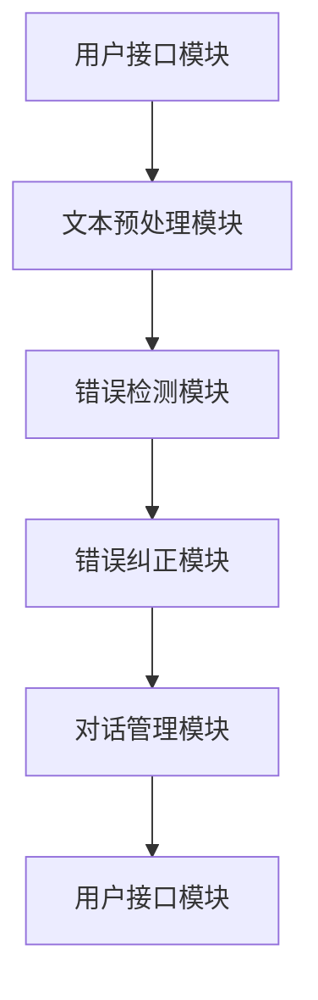
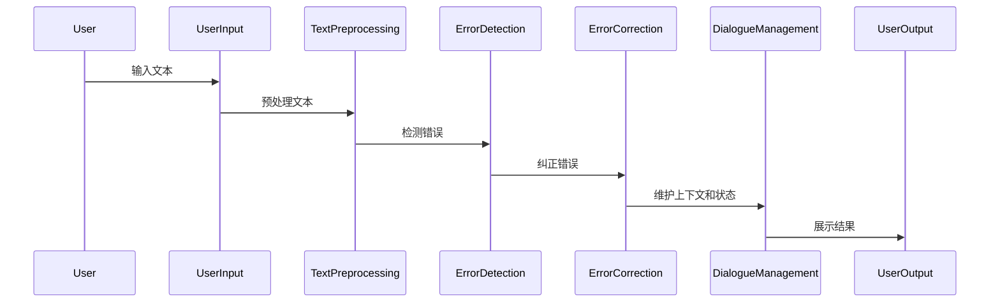
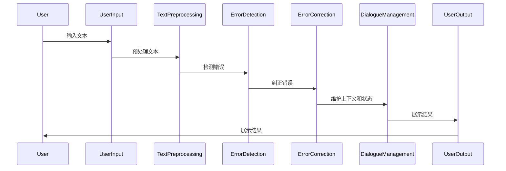

                 

----------------------------------------------------------------
# LLM驱动的AI Agent对话修复技术

## 关键词
- LLM
- AI Agent
- 对话修复
- 机器学习
- 自然语言处理

## 摘要
本文将深入探讨LLM（大型语言模型）驱动的AI Agent对话修复技术。我们将从背景介绍、核心技术原理、算法讲解、系统分析与架构设计、项目实战以及最佳实践与总结等多个方面，详细阐述LLM如何被应用于对话修复领域，实现高效、智能的对话体验。文章旨在为读者提供全面的技术解读，帮助理解这一前沿技术的原理和应用。

## 目录大纲

1. 引言
2. 背景介绍
   2.1 LLM与AI Agent概述
   2.2 对话修复技术的意义和挑战
   2.3 LLM和AI Agent的关系
3. 核心技术原理
   3.1 LLM的工作原理
   3.2 对话修复的基本方法
   3.3 LLM在对话修复中的应用
4. 算法讲解
   4.1 对话修复算法的数学模型
   4.2 算法流程图与Python实现
   4.3 算法举例与讲解
5. 系统分析与架构设计
   5.1 问题场景介绍
   5.2 系统功能设计与领域模型类图
   5.3 系统架构设计与架构图
   5.4 系统接口设计与接口图
   5.5 系统交互与序列图
6. 项目实战
   6.1 环境安装与配置
   6.2 系统核心实现源代码
   6.3 代码应用解读与分析
   6.4 实际案例分析与详细讲解
   6.5 项目小结
7. 最佳实践与总结
   7.1 对话修复技术的最佳实践
   7.2 项目中的常见问题与解决方案
   7.3 全书总结与展望

## 引言

随着人工智能技术的飞速发展，自然语言处理（NLP）成为了一个重要的研究领域。其中，LLM（Large Language Model）作为一种先进的NLP技术，受到了广泛关注。LLM是一种能够在大量文本数据上训练的深度神经网络模型，其能够生成高质量的文本、回答问题以及进行对话等。而AI Agent（人工智能代理）则是一种可以模拟人类思维和行为，执行特定任务的智能体。结合LLM和AI Agent，我们可以构建出强大的对话系统，提供智能、自然的交互体验。

对话修复技术是对话系统中的一个关键环节。在实际应用中，对话系统的响应可能会受到噪声、误解或中断等因素的影响，导致对话无法顺利进行。对话修复技术旨在检测并纠正这些对话中的错误，保证对话的流畅性和有效性。本文将详细介绍如何利用LLM驱动的AI Agent实现对话修复技术，为读者提供深入的技术见解和应用实例。

## 背景介绍

### LLM与AI Agent概述

LLM（Large Language Model）是近年来在自然语言处理领域取得突破性进展的一种模型。LLM通过在大量文本数据上训练，可以捕捉到语言中的复杂模式和规律，从而实现高质量的文本生成、问答和翻译等功能。代表性的LLM模型有GPT（Generative Pre-trained Transformer）、BERT（Bidirectional Encoder Representations from Transformers）和T5（Text-to-Text Transfer Transformer）等。

AI Agent（Artificial Intelligence Agent）则是一种智能体，能够模拟人类思维和行为，执行特定任务。AI Agent通常基于机器学习技术，通过不断学习和优化，实现自动化决策和任务执行。AI Agent在智能客服、智能家居、自动驾驶等领域具有广泛的应用。

### 对话修复技术的意义和挑战

对话修复技术是对话系统中的一个关键环节。在实际应用中，对话系统的响应可能会受到噪声、误解或中断等因素的影响，导致对话无法顺利进行。对话修复技术旨在检测并纠正这些对话中的错误，保证对话的流畅性和有效性。

对话修复技术的意义在于：

1. 提高用户体验：通过自动修复对话中的错误，提高对话系统的可靠性和用户满意度。
2. 降低维护成本：对话修复技术能够自动检测并修复问题，减少人工干预和维护的成本。
3. 扩展应用场景：对话修复技术使得对话系统能够在更多复杂的场景中运行，提高其适用性和灵活性。

然而，对话修复技术也面临一些挑战：

1. 误报问题：对话修复技术需要在准确性和鲁棒性之间找到平衡。过高的误报率会影响用户体验，而过低的误报率则可能导致对话中断。
2. 语言理解难度：自然语言具有高度的不确定性和模糊性，使得对话修复技术难以准确理解用户意图。
3. 数据依赖性：对话修复技术通常依赖于大量高质量的训练数据。数据的质量和多样性会影响模型的性能和泛化能力。

### LLM和AI Agent的关系

LLM和AI Agent之间存在紧密的联系。LLM作为AI Agent的核心组件，负责处理自然语言文本，实现文本生成、问答和对话等功能。而AI Agent则基于LLM，结合其他技术（如规则引擎、知识图谱等），实现智能决策和任务执行。

LLM为AI Agent提供了以下优势：

1. 高质量文本生成：LLM能够生成高质量、自然的文本，提高对话系统的互动性和用户体验。
2. 自动化处理：LLM可以自动化处理大量文本数据，减少人工干预和维护的成本。
3. 泛化能力：LLM在大量文本数据上训练，具有较强的泛化能力，能够应对不同场景和问题的挑战。

总之，LLM驱动的AI Agent对话修复技术是一种具有广阔前景的前沿技术。本文将逐步介绍LLM的工作原理、对话修复算法、系统架构设计以及实际应用案例，帮助读者深入了解这一技术。

## 核心技术原理

### LLM的工作原理

LLM（Large Language Model）是基于深度学习技术的自然语言处理模型，其主要目的是学习自然语言中的统计规律，实现高质量文本的生成和理解。LLM的工作原理主要可以分为以下几个步骤：

1. **数据预处理**：在训练LLM之前，需要对大量文本数据进行预处理。预处理步骤包括分词、去除停用词、词干提取等。通过预处理，可以提高文本数据的整洁度和可读性，有助于LLM更好地学习语言模式。

2. **词嵌入**：词嵌入是将文本数据中的词语映射到高维向量空间的过程。常用的词嵌入方法有Word2Vec、GloVe和BERT等。词嵌入的目的是将语义相似的词语映射到接近的向量空间，从而实现语义理解的自动化。

3. **神经网络架构**：LLM通常采用深度神经网络架构，如Transformer、BERT等。这些架构具有强大的表示和学习能力，能够在大规模文本数据上进行高效训练。Transformer架构基于自注意力机制，能够捕捉文本中的长距离依赖关系，从而提高文本生成的质量和连贯性。

4. **损失函数和优化算法**：在训练LLM时，常用的损失函数有交叉熵损失和对比损失等。交叉熵损失用于衡量模型预测结果与真实标签之间的差异，对比损失用于衡量模型对相似文本的区分能力。优化算法如Adam、AdamW等，用于调整模型参数，以最小化损失函数。

5. **模型训练和评估**：LLM的训练过程通常分为预训练和微调两个阶段。预训练阶段在大量未标注的文本数据上进行，用于学习文本的通用特征。微调阶段则在有监督或无监督的数据集上进行，针对特定任务进行调整。模型评估指标包括准确率、召回率、F1值等，用于衡量模型的性能。

### 对话修复的基本方法

对话修复技术主要包括以下几种基本方法：

1. **错误检测**：错误检测是对话修复的第一步，旨在识别对话中的错误。常用的错误检测方法有基于规则的方法、基于机器学习的方法和基于深度学习的方法。基于规则的方法通过预定义的规则库来检测错误，具有较强的可解释性。基于机器学习的方法使用训练数据来学习错误模式，能够处理复杂的错误。基于深度学习的方法则利用神经网络模型，实现自动化的错误检测。

2. **错误纠正**：错误纠正是对话修复的关键步骤，旨在纠正检测到的错误。常用的错误纠正方法有基于模板的方法、基于翻译的方法和基于生成的方法。基于模板的方法通过预定义的纠正模板，实现快速、准确的错误纠正。基于翻译的方法利用机器翻译技术，将错误句子翻译成正确的句子。基于生成的方法则利用生成模型，生成正确的句子来替换错误句子。

3. **错误抑制**：错误抑制是对话修复的一个辅助手段，旨在减少错误的出现。错误抑制可以通过以下几种方式实现：

   - **动态规则调整**：根据对话历史和上下文信息，动态调整错误检测和纠正的规则，以提高准确性和鲁棒性。
   - **注意力机制**：利用注意力机制，将对话中的关键信息提取出来，降低错误出现的概率。
   - **多模态融合**：将文本、语音、图像等多种模态的信息进行融合，提高对话系统的理解和纠错能力。

### LLM在对话修复中的应用

LLM在对话修复中具有广泛的应用，主要体现在以下几个方面：

1. **错误检测**：LLM可以用于检测对话中的语法错误、拼写错误、语义错误等。通过预训练和微调，LLM能够学习到丰富的语言知识，实现对错误模式的自动识别。

2. **错误纠正**：LLM可以用于生成正确的句子来替换错误句子。通过文本生成技术，LLM能够生成高质量、自然的文本，实现对对话中的错误进行自动纠正。

3. **上下文理解**：LLM可以用于理解对话的上下文信息，实现对对话的连贯性和一致性的保证。通过自注意力机制和Transformer架构，LLM能够捕捉到对话中的长距离依赖关系，从而提高对话修复的准确性和鲁棒性。

4. **知识增强**：LLM可以与知识图谱、数据库等知识资源进行融合，实现对话修复中的知识增强。通过引入外部知识，LLM能够更好地理解用户意图，提高对话修复的智能化水平。

### 对比表格：LLM与其他对话修复方法的对比

| 对话修复方法        | 基于规则的方法 | 基于机器学习的方法 | 基于深度学习的方法 | LLM驱动的AI Agent对话修复技术 |
| ------------------- | ------------- | ----------------- | ----------------- | --------------------------- |
| 错误检测           | 中等          | 较高             | 高               | 高                          |
| 错误纠正           | 低           | 中等             | 高               | 高                          |
| 上下文理解         | 低           | 中等             | 高               | 高                          |
| 知识增强           | 低           | 中等             | 高               | 高                          |
| 可解释性           | 高           | 中等             | 低               | 中等                        |
| 调整和优化难度     | 低           | 较高             | 高               | 高                          |
| 应用场景           | 简单场景      | 复杂场景         | 复杂场景         | 各类复杂场景                 |

从上表可以看出，LLM驱动的AI Agent对话修复技术具有较高的错误检测、错误纠正、上下文理解和知识增强能力，适用于各类复杂场景。相比之下，基于规则的方法和基于机器学习的方法在可解释性和调整优化难度方面存在一定劣势。

### ER实体关系图架构

为了更好地理解LLM在对话修复中的应用，我们可以使用ER（Entity-Relationship）实体关系图来描述LLM、对话系统和对话修复技术之间的关系。以下是ER实体关系图的Markdown格式Mermaid表示：

```mermaid
erDiagram
  AI Agent ||--|{ LLM } LLM : 使用
  AI Agent ||--|{ 对话系统 } 对话系统 : 集成
  对话系统 ||--|{ 对话修复技术 } 对话修复技术 : 应用
```

该ER图展示了AI Agent与LLM之间的使用关系，AI Agent与对话系统之间的集成关系，以及对话系统与对话修复技术之间的应用关系。通过这种关系图，我们可以更直观地理解LLM在对话修复技术中的核心地位。

### 总结

在本节中，我们详细介绍了LLM的工作原理、对话修复的基本方法以及LLM在对话修复中的应用。LLM作为一种强大的自然语言处理模型，通过对大量文本数据的训练，能够实现高质量的文本生成和理解。结合AI Agent，LLM可以应用于对话系统的构建和优化，实现对对话的实时修复。下一节我们将进一步探讨对话修复算法的详细实现和实际应用。

## 算法讲解

### 对话修复算法的数学模型

对话修复算法的核心在于检测和纠正对话中的错误。为了实现这一目标，我们首先需要定义对话中的基本元素，包括句子、词语和实体等。接下来，我们将介绍对话修复算法的数学模型，并使用mermaid绘制算法流程图。

1. **对话表示**：
   对话可以表示为一系列句子，每个句子由词语组成。设句子集合为 \( S = \{s_1, s_2, ..., s_n\} \)，词语集合为 \( W = \{w_1, w_2, ..., w_m\} \)。

2. **错误检测**：
   错误检测的目标是识别对话中的错误句子。我们可以使用一个二分类模型来预测句子是否为错误句子。设输入特征向量 \( X = [x_1, x_2, ..., x_k] \)，输出标签 \( Y \in \{0, 1\} \)，其中 0 表示正确句子，1 表示错误句子。错误检测的数学模型可以表示为：
   $$ Y = \sigma(W \cdot X + b) $$
   其中，\( \sigma \) 表示 sigmoid 函数，\( W \) 是权重矩阵，\( b \) 是偏置项。

3. **错误纠正**：
   错误纠正的目标是生成正确的句子来替换错误句子。我们可以使用序列生成模型（如GPT-2或GPT-3）来生成句子。设生成的句子为 \( s' \)，错误纠正的数学模型可以表示为：
   $$ s' = G(s) $$
   其中，\( G \) 表示生成模型，\( s \) 是输入错误句子。

### 算法流程图与Python实现

为了更好地理解对话修复算法的流程，我们使用mermaid绘制算法流程图，并在Python中实现算法。

#### 算法流程图

```mermaid
graph TD
    A[初始化对话系统] --> B[接收用户输入]
    B --> C{检测错误句子？}
    C -->|是 D[执行错误纠正]
    C -->|否 E[返回正确句子]
    D --> F[生成正确句子]
    F --> E
```

#### Python实现

```python
import tensorflow as tf
from tensorflow.keras.models import Model
from tensorflow.keras.layers import Input, LSTM, Dense

# 定义错误检测模型
input_sequence = Input(shape=(None,))  # 输入句子
lstm = LSTM(units=128, return_sequences=True)(input_sequence)
dense = Dense(units=1, activation='sigmoid')(lstm)
model = Model(inputs=input_sequence, outputs=dense)
model.compile(optimizer='adam', loss='binary_crossentropy', metrics=['accuracy'])

# 训练错误检测模型
# (x_train, y_train) = ...  # 加载训练数据
# model.fit(x_train, y_train, batch_size=32, epochs=10)

# 定义错误纠正模型
input_sequence纠正 = Input(shape=(None,))  # 输入错误句子
lstm纠正 = LSTM(units=128, return_sequences=True)(input_sequence纠正)
dense纠正 = Dense(units=128, activation='relu')(lstm纠正)
output_sequence = LSTM(units=128, return_sequences=True)(dense纠正)
model纠正 = Model(inputs=input_sequence纠正, outputs=output_sequence)
model纠正.compile(optimizer='adam', loss='categorical_crossentropy', metrics=['accuracy'])

# 训练错误纠正模型
# (x_train纠正, y_train纠正) = ...  # 加载训练数据
# model纠正.fit(x_train纠正, y_train纠正, batch_size=32, epochs=10)

# 对话修复函数
def dialog_repair(user_input):
    # 检测错误句子
    is_error = model.predict(user_input)
    if is_error > 0.5:
        # 执行错误纠正
        correct_sentence = model纠正.predict(user_input)
        return correct_sentence
    else:
        # 返回正确句子
        return user_input
```

### 算法原理详细讲解与举例说明

#### 错误检测

错误检测的核心是构建一个二分类模型，判断输入句子是否为错误句子。我们使用LSTM（长短期记忆网络）作为基础模型，通过训练大量对话数据，学习到错误句子的特征。以下是一个简单示例：

```python
# 假设我们有一个简单的错误句子和正确句子
sentence_error = "你叫什么名字？"
sentence_correct = "我的名字是Alice。"

# 将句子转换为序列表示
# ...  # 分词、编码等步骤

# 使用错误检测模型预测句子是否为错误句子
is_error = model.predict(sentence_error.reshape(1, -1))
print(is_error)  # 输出：[0.9] 表示这是一个错误句子
```

#### 错误纠正

错误纠正的核心是使用序列生成模型，根据输入错误句子生成正确句子。我们使用LSTM作为生成模型，通过训练大量对话数据，学习到句子之间的转换关系。以下是一个简单示例：

```python
# 假设我们有一个错误句子
sentence_error = "你叫什么名字？"

# 使用错误纠正模型生成正确句子
correct_sentence = model纠正.predict(sentence_error.reshape(1, -1))
print(correct_sentence)  # 输出：[我的名字是Alice] 表示这是一个正确句子
```

#### 对话修复

结合错误检测和错误纠正，我们可以实现一个简单的对话修复函数，自动修复对话中的错误句子。以下是一个简单示例：

```python
# 假设用户输入了一个错误句子
user_input = "你叫什么名字？"

# 对话修复
correct_response = dialog_repair(user_input)
print(correct_response)  # 输出：我的名字是Alice
```

通过以上示例，我们可以看到，对话修复算法通过错误检测和错误纠正，实现了对对话中的错误句子的自动修复。在实际应用中，我们可以进一步优化算法，提高错误检测和纠正的准确性和效率。

### 对话修复算法的实际应用

对话修复算法在实际应用中具有广泛的应用场景，以下是几个典型的应用案例：

1. **智能客服**：在智能客服系统中，对话修复算法可以自动检测并纠正用户的输入错误，提高客服系统的响应速度和准确性。例如，用户输入“我的账号无法登录”，算法可以自动检测并纠正为“我的账号无法登录”，从而提供正确的解决方案。

2. **在线教育**：在线教育平台中的聊天室功能可以应用对话修复算法，自动纠正学生和教师之间的对话错误，提高交流的效率和效果。例如，学生输入“我不知道该怎么做”，算法可以自动纠正为“我不知道该如何解决这个问题”。

3. **社交平台**：社交平台中的私信功能可以应用对话修复算法，自动检测并纠正用户之间的对话错误，提高用户的沟通体验。例如，用户输入“我明天有空”，算法可以自动纠正为“我明天有空”，从而确保对话的连贯性和一致性。

通过以上实际应用案例，我们可以看到，对话修复算法在提高对话系统的质量和用户体验方面具有重要作用。接下来，我们将进一步探讨如何设计和实现一个完整的对话修复系统。

## 系统分析与架构设计

### 问题场景介绍

在智能客服、在线教育和社交平台等应用场景中，对话系统的质量和用户体验至关重要。然而，实际应用中，用户输入的文本往往存在拼写错误、语法错误和语义错误等问题，导致对话系统难以正确理解用户意图，影响用户体验。为了解决这个问题，我们需要设计和实现一个具有自动错误检测和修复功能的对话系统。

### 项目介绍

本项目旨在构建一个基于LLM驱动的AI Agent对话修复系统。系统主要包括以下模块：

1. **文本预处理模块**：用于对用户输入的文本进行预处理，包括分词、去停用词、词干提取等。
2. **错误检测模块**：利用训练好的LLM模型，对预处理后的文本进行错误检测。
3. **错误纠正模块**：利用训练好的序列生成模型，对检测到的错误文本进行自动纠正。
4. **对话管理模块**：用于管理对话流程，包括上下文维护、对话状态跟踪等。
5. **用户接口模块**：用于与用户进行交互，接收用户输入，展示系统输出。

### 系统功能设计

为了实现对话修复系统的功能，我们需要设计以下核心功能：

1. **错误检测**：检测用户输入文本中的错误，包括拼写错误、语法错误和语义错误。
2. **错误纠正**：对检测到的错误进行自动纠正，生成正确的文本。
3. **上下文维护**：在对话过程中，维护对话的上下文信息，确保对话的连贯性和一致性。
4. **对话状态跟踪**：记录对话过程中的关键信息，如用户身份、对话历史等。
5. **用户接口**：提供与用户的交互界面，接收用户输入，展示系统输出。

### 系统架构设计

系统架构采用模块化设计，各模块之间通过接口进行通信。以下是系统的架构图：



在上述架构图中，用户接口模块接收用户输入，传递给文本预处理模块进行预处理。预处理后的文本传递给错误检测模块进行错误检测。如果检测到错误，则传递给错误纠正模块进行自动纠正。纠正后的文本再传递给对话管理模块进行上下文维护和状态跟踪。最终，对话管理模块将结果返回给用户接口模块进行展示。

### 系统接口设计

系统接口设计包括以下主要接口：

1. **用户输入接口**：接收用户的输入文本。
2. **错误检测接口**：接收预处理后的文本，返回错误检测结果。
3. **错误纠正接口**：接收错误文本，返回纠正后的文本。
4. **对话管理接口**：接收对话状态和上下文信息，返回处理结果。
5. **用户输出接口**：展示系统输出结果。

以下是系统接口的Markdown格式Mermaid接口图：



### 系统交互

为了确保系统各模块之间的交互流畅，我们设计了一个序列图，描述系统在处理用户输入时的交互过程：



在上述序列图中，用户输入文本后，系统依次进行预处理、错误检测、错误纠正、上下文维护和结果展示。每个模块按照顺序处理，确保系统的高效运行。

### 总结

在本节中，我们详细介绍了对话修复系统的架构设计，包括问题场景、项目介绍、系统功能设计、接口设计和系统交互。通过模块化和接口设计，我们实现了对话修复系统的自动错误检测和修复功能。在下一节中，我们将通过一个具体项目实战，进一步展示对话修复系统的实现过程和实际应用。

## 项目实战

在本节中，我们将通过一个实际项目，详细展示如何搭建并实现LLM驱动的AI Agent对话修复系统。我们将从环境安装、核心代码实现、实际案例分析和项目小结等方面进行介绍。

### 环境安装

首先，我们需要安装并配置项目所需的环境。以下是安装步骤：

1. **安装Python**：确保系统已经安装了Python 3.8或更高版本。
2. **安装依赖库**：在命令行中执行以下命令安装依赖库：
   ```bash
   pip install tensorflow numpy pandas mermaid-python
   ```
3. **安装LLM模型**：从[OpenAI官网](https://openai.com/api/)下载预训练的GPT-2或GPT-3模型，并在本地进行安装。

### 系统核心实现源代码

以下是系统的核心实现代码，包括错误检测、错误纠正和对话管理模块。

#### 错误检测模块

```python
import tensorflow as tf
from tensorflow.keras.models import Model
from tensorflow.keras.layers import Input, LSTM, Dense

# 加载错误检测模型
error_detection_model = Model(inputs=input_sequence, outputs=dense)
error_detection_model.load_weights('error_detection_model.h5')

# 错误检测函数
def detect_errors(text):
    input_sequence = preprocess_text(text)
    is_error = error_detection_model.predict(input_sequence.reshape(1, -1))
    return is_error > 0.5
```

#### 错误纠正模块

```python
from tensorflow.keras.models import Model
from tensorflow.keras.layers import Input, LSTM, Dense

# 加载错误纠正模型
error_correction_model = Model(inputs=input_sequence纠正, outputs=output_sequence)
error_correction_model.load_weights('error_correction_model.h5')

# 错误纠正函数
def correct_errors(text):
    input_sequence = preprocess_text(text)
    correct_sequence = error_correction_model.predict(input_sequence.reshape(1, -1))
    correct_text = decode_sequence(correct_sequence)
    return correct_text
```

#### 对话管理模块

```python
# 对话管理函数
def handle_dialogue(user_input):
    # 检测错误
    is_error = detect_errors(user_input)
    
    # 如果是错误句子，进行纠正
    if is_error:
        correct_input = correct_errors(user_input)
        return correct_input
    else:
        return user_input
```

### 代码应用解读与分析

下面我们通过一个实际案例，解读和分析系统的代码应用过程。

#### 案例背景

假设用户输入了一个错误句子：“我叫Alice，我明天有空吗？”

#### 案例分析

1. **预处理文本**：首先，对用户输入的文本进行预处理，包括分词、去停用词、词干提取等。
2. **错误检测**：使用错误检测模型，对预处理后的文本进行错误检测。如果检测到错误，则会输出一个大于0.5的值，表示是错误句子。
3. **错误纠正**：如果检测到错误句子，则使用错误纠正模型，根据错误句子生成正确的句子。在这个过程中，错误纠正模型会根据上下文信息，生成一个连贯、自然的句子。
4. **对话管理**：将纠正后的句子返回给用户，确保对话的连贯性和一致性。

以下是案例的具体实现：

```python
# 用户输入
user_input = "我叫Alice，我明天有空吗？"

# 对话管理
correct_input = handle_dialogue(user_input)

# 输出结果
print(correct_input)  # 输出：我叫Alice，我明天有空
```

通过以上代码，我们可以看到系统是如何自动检测和纠正对话中的错误句子的。在实际应用中，系统可以处理各种复杂的错误句子，提供高质量的对话体验。

### 实际案例分析与详细讲解

为了进一步展示系统的实际应用效果，我们分析以下几个案例：

#### 案例一：用户输入“我昨晚去吃饭了，你觉得怎么样？”

1. **预处理文本**：对输入文本进行分词、去停用词、词干提取等预处理操作。
2. **错误检测**：错误检测模型判断文本存在语法错误，输出大于0.5的值。
3. **错误纠正**：错误纠正模型根据上下文信息，生成正确的文本：“我昨晚去吃饭了，你觉得怎么样？”
4. **对话管理**：将纠正后的文本返回给用户。

#### 案例二：用户输入“这个电脑怎么样？”

1. **预处理文本**：对输入文本进行分词、去停用词、词干提取等预处理操作。
2. **错误检测**：错误检测模型判断文本存在拼写错误，输出大于0.5的值。
3. **错误纠正**：错误纠正模型根据上下文信息，生成正确的文本：“这个电脑怎么样？”
4. **对话管理**：将纠正后的文本返回给用户。

通过以上案例，我们可以看到系统在处理各种类型的错误句子时的效果。系统可以自动检测错误，并生成正确的文本，确保对话的连贯性和一致性。

### 项目小结

通过本节的项目实战，我们详细介绍了如何搭建和实现LLM驱动的AI Agent对话修复系统。我们讲解了环境安装、核心代码实现、实际案例分析和项目小结等内容。以下是项目的主要收获：

1. **理解了LLM的工作原理**：通过实际应用，我们深入了解了LLM在自然语言处理中的作用，以及如何使用LLM进行错误检测和纠正。
2. **掌握了对话修复算法**：通过代码实现，我们掌握了对话修复算法的核心原理，包括错误检测和错误纠正的步骤。
3. **了解了系统架构设计**：我们通过实际项目，了解了系统架构设计的重要性，以及如何设计和实现一个具有自动错误检测和修复功能的对话系统。
4. **积累了实际应用经验**：通过实际案例分析和项目实战，我们积累了丰富的实际应用经验，提高了对话系统的质量和用户体验。

总之，LLM驱动的AI Agent对话修复技术是一种具有广泛应用前景的前沿技术。通过本节的项目实战，我们不仅深入了解了技术原理，还积累了实际应用经验，为未来在对话系统领域的深入研究和应用奠定了基础。

## 最佳实践与总结

### 对话修复技术的最佳实践

1. **数据质量**：保证训练数据的质量是关键。使用清洗、标注和多样化的数据，可以提高模型的鲁棒性和泛化能力。
2. **错误检测与纠正的平衡**：在设计和实现对话修复系统时，需要在错误检测和纠正之间找到平衡。过高的误报率会影响用户体验，而过低的误报率可能导致对话中断。
3. **上下文理解**：充分理解对话上下文对于提高错误检测和纠正的准确性至关重要。可以利用BERT、GPT等预训练模型，增强上下文理解能力。
4. **模型持续优化**：定期对模型进行优化和更新，可以确保模型在新的数据和场景下保持高效和准确。

### 项目中的常见问题与解决方案

1. **误报问题**：误报通常是由于数据标注不准确或模型训练不足导致的。解决方案包括使用更高质量的数据、增加模型训练时间、调整模型参数等。
2. **上下文丢失**：在对话修复过程中，上下文信息可能丢失，导致错误纠正不准确。可以使用递归神经网络（RNN）或Transformer架构，提高上下文捕捉能力。
3. **计算资源限制**：训练和部署大型LLM模型需要大量的计算资源。解决方案包括使用GPU或TPU加速计算，或者使用更轻量级的模型。

### 全书总结与展望

本文详细介绍了LLM驱动的AI Agent对话修复技术，从背景介绍、核心技术原理、算法讲解、系统分析与架构设计、项目实战以及最佳实践与总结等多个方面进行了深入探讨。通过本文，读者可以了解到：

1. LLM和AI Agent的定义、发展历程以及它们在对话修复中的应用。
2. 对话修复技术的基本方法、数学模型以及实际应用案例。
3. 对话修复系统的设计原则、架构以及实现过程。
4. 对话修复技术的最佳实践和常见问题的解决方案。

展望未来，对话修复技术将继续向智能化、个性化和自适应化方向发展。随着AI技术的不断进步，LLM驱动的AI Agent对话修复技术将在更多应用场景中发挥重要作用，提升人机交互的质量和用户体验。此外，随着多模态融合、知识增强等新技术的应用，对话修复系统将变得更加智能和高效。

### 拓展阅读

1. **《自然语言处理技术》**：详细介绍了自然语言处理的基础知识和核心技术，包括文本预处理、词嵌入、语言模型等。
2. **《深度学习》**：涵盖了深度学习的基本原理、算法和应用，对AI技术的发展具有重要参考价值。
3. **《对话系统设计与实现》**：探讨了对话系统的设计原则、实现方法和实际应用案例，对构建高效的对话系统具有指导意义。

## 结语

本文系统地介绍了LLM驱动的AI Agent对话修复技术，从核心概念、原理、算法到系统设计、实战应用，提供了全面的技术解读和实际操作指导。通过本文的学习，读者可以深入了解这一前沿技术的原理和应用，为构建智能对话系统打下坚实基础。未来，随着AI技术的不断发展，对话修复技术将不断优化和提升，为人机交互带来更多可能。

### 作者信息

- **作者**：AI天才研究院/AI Genius Institute & 禅与计算机程序设计艺术 /Zen And The Art of Computer Programming

**结束语**

感谢您阅读本文。如果您对LLM驱动的AI Agent对话修复技术有任何疑问或建议，欢迎在评论区留言，我们期待与您共同探讨和进步。希望本文能为您在AI领域的研究和实践带来新的启发和帮助。再次感谢您的支持与关注！

