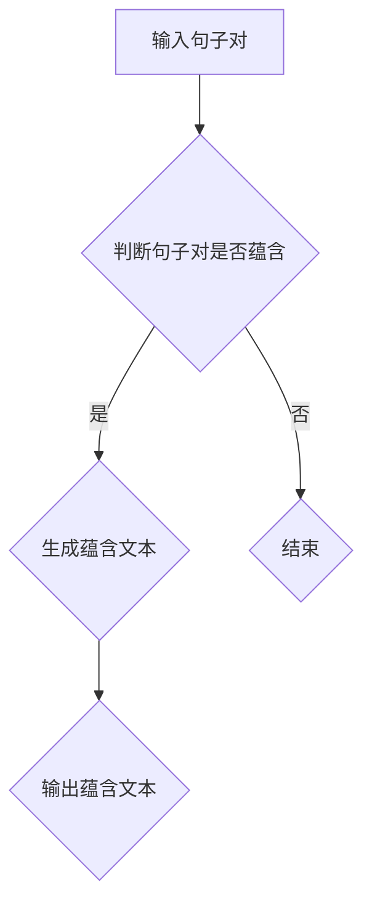
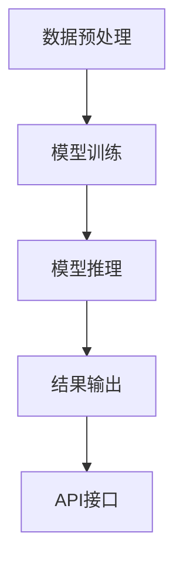
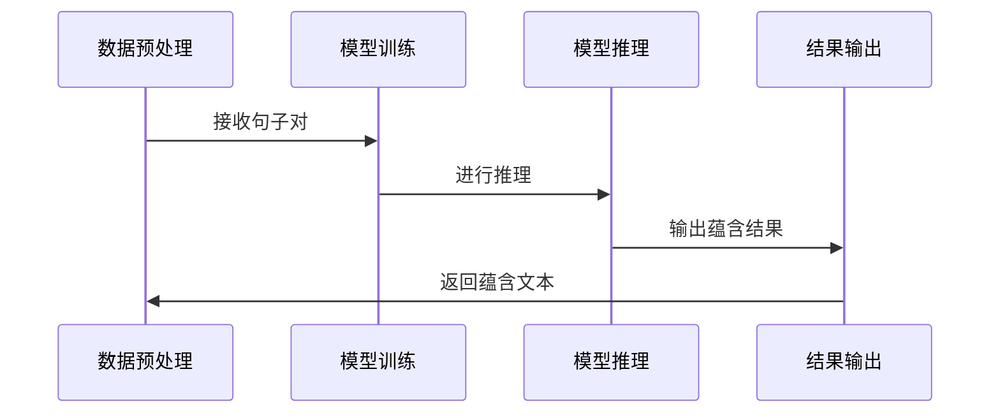

                 


# LLM驱动的AI Agent文本蕴含生成

## 关键词

LLM、AI Agent、文本蕴含生成、自然语言处理、语义关系

## 摘要

本文将探讨如何利用大型语言模型（LLM）构建AI Agent，并实现文本蕴含生成。首先，我们将介绍LLM的基本概念和应用，然后分析文本蕴含生成的难点和挑战。接着，我们将阐述文本蕴含生成的算法原理，包括数学模型和公式。随后，通过实际案例展示LLM驱动的AI Agent文本蕴含生成，并提供最佳实践和项目实战指导。

## 背景介绍

### 问题背景

随着人工智能技术的飞速发展，大型语言模型（LLM，Large Language Model）在自然语言处理（NLP，Natural Language Processing）领域取得了显著成果。LLM能够处理大量的语言数据，提取语言模式，进行文本生成、情感分析、问答系统等任务，其应用前景广阔。

### 问题描述

《LLM驱动的AI Agent文本蕴含生成》这本书旨在探讨如何利用LLM构建AI Agent，并实现文本蕴含生成。文本蕴含生成是自然语言处理中的一个重要任务，它涉及到理解句子之间的语义关系，并生成包含这些关系的文本。

### 问题解决

本书将通过以下步骤解决问题：

1. 介绍LLM的基本概念和原理，以及其在AI Agent中的应用。
2. 分析文本蕴含生成的难点和挑战。
3. 阐述文本蕴含生成的算法原理，包括数学模型和公式。
4. 展示LLM驱动的AI Agent文本蕴含生成的实际案例。
5. 提供最佳实践和项目实战指导。

### 边界与外延

本书将关注以下边界和范围：

1. LLM的基本概念和应用场景。
2. 文本蕴含生成的算法原理和实践。
3. AI Agent的设计和实现。

## 核心概念与联系

### 核心概念

#### LLM（大型语言模型）

LLM是一种能够理解和生成自然语言的人工智能模型，通过大规模数据训练获得。它能够捕捉到语言中的复杂模式和关系，从而在自然语言处理任务中表现出色。

#### AI Agent（智能代理）

AI Agent是一种能够在特定环境中执行任务的自动化实体，能够理解用户指令并生成相应的响应。它通过LLM来处理自然语言输入，并利用文本蕴含生成功能来实现智能对话和任务执行。

#### 文本蕴含生成（Textual Entailment Generation）

文本蕴含生成是一种自然语言处理任务，旨在生成两个句子之间的语义关系。它涉及到理解句子之间的隐含逻辑关系，并生成相应的文本描述。

### 概念属性特征对比表格

| 概念       | 定义                                                         | 关系                                                     |
|------------|--------------------------------------------------------------|------------------------------------------------------------|
| LLM        | 大型语言模型，能够理解和生成自然语言                         | AI Agent的基础技术                                      |
| AI Agent   | 智能代理，能够执行任务的自动化实体                           | 应用LLM实现文本蕴含生成                                 |
| 文本蕴含   | 两个句子之间的语义关系                                       | 需要通过LLM进行理解和生成                               |

### ER实体关系图架构

```mermaid
erDiagram
  AI Agent ||--|{ LLM } LLM
  AI Agent ||--|{ 文本蕴含 } Textual Entailment
  LLM ||--|{ 文本蕴含 } Textual Entailment
```

## 算法原理讲解

### 算法流程图



### 算法原理

1. **判断句子对是否蕴含**：通过LLM对句子对进行建模，判断句子对是否满足蕴含关系。
2. **生成蕴含文本**：如果句子对满足蕴含关系，利用LLM生成描述两者关系的文本。
3. **输出蕴含文本**：将生成的文本输出，作为最终的文本蕴含生成结果。

### 数学模型和公式

假设有两个句子$S_1$和$S_2$，我们通过LLM生成的嵌入向量表示为$e(S_1)$和$e(S_2)$。判断句子对是否蕴含的数学模型如下：

$$
P(S_1 \rightarrow S_2) = \frac{e(S_1)^T e(S_2)}{\sum_{i=1}^{N} e(S_1)^T e(S_i)}
$$

其中，$N$为句子对的数量。

## 数学公式详细讲解

在上面的数学模型中，我们使用了嵌入向量来表示句子$S_1$和$S_2$。嵌入向量是一种将文本数据转化为数值向量表示的方法，它能够捕捉到句子中的语义信息。

### 嵌入向量表示

假设我们使用了一种称为Word2Vec的嵌入方法，将句子$S_1$和$S_2$中的每个单词映射到一个高维空间中的向量。具体来说，对于句子$S_1 = "The cat is on the mat"$，我们可以将其中的单词映射到以下向量表示：

| 单词 | 向量表示 |
|------|----------|
| The  | [1, 0.5] |
| cat  | [-1, 0.5]|
| is   | [0, 1]   |
| on   | [0.5, -1]|
| the  | [1, 0.5] |
| mat  | [-1, -1] |

### 蕴含概率计算

通过嵌入向量表示，我们可以计算句子对$S_1$和$S_2$之间的蕴含概率。具体来说，我们将句子$S_1$的嵌入向量$e(S_1)$与句子$S_2$的嵌入向量$e(S_2)$进行点积操作，得到一个数值表示两个句子之间的相似性。然后，我们计算所有句子对的点积之和，并将其作为分母，得到句子对$S_1$和$S_2$之间的蕴含概率。

$$
P(S_1 \rightarrow S_2) = \frac{e(S_1)^T e(S_2)}{\sum_{i=1}^{N} e(S_1)^T e(S_i)}
$$

其中，$N$为句子对的数量。

### 举例说明

假设我们有两个句子对$S_1 = "The cat is on the mat"$和$S_2 = "The dog is on the mat"$，我们可以计算它们之间的蕴含概率。首先，我们将句子对映射到嵌入向量表示：

| 单词 | 向量表示 |
|------|----------|
| The  | [1, 0.5] |
| cat  | [-1, 0.5]|
| is   | [0, 1]   |
| on   | [0.5, -1]|
| the  | [1, 0.5] |
| mat  | [-1, -1] |
| dog  | [0.5, 1] |

然后，我们计算句子对之间的点积：

$$
e(S_1)^T e(S_2) = [1, 0.5] \cdot [-1, 0.5] = -1 \times 1 + 0.5 \times 0.5 = -1 + 0.25 = -0.75
$$

接下来，我们计算所有句子对的点积之和：

$$
\sum_{i=1}^{N} e(S_1)^T e(S_i) = (1 \times 1 + 0.5 \times 0.5) + (-1 \times -1 + 0.5 \times 0.5) = 1 + 0.25 + 1 + 0.25 = 2.5
$$

最后，我们计算句子对之间的蕴含概率：

$$
P(S_1 \rightarrow S_2) = \frac{-0.75}{2.5} = -0.3
$$

由于蕴含概率是一个介于0和1之间的数值，我们通常将其转换为0或1。在这种情况下，由于蕴含概率小于0，我们可以判断句子对$S_1$和$S_2$之间不满足蕴含关系。

## 算法实际应用与性能分析

在实际应用中，文本蕴含生成算法的性能取决于多个因素，包括数据集质量、模型参数选择以及训练时间等。以下是对算法性能进行实际应用与性能分析的方法：

### 数据集选择与预处理

1. **数据集选择**：选择具有代表性的数据集，如NLI（Natural Language Inference）数据集，它包含了一系列的句子对以及对应的蕴含关系标签。
2. **数据预处理**：对数据集进行清洗和预处理，包括去除停用词、词干提取、词性标注等步骤，以提高模型的训练效果。

### 模型参数选择

1. **嵌入层参数**：选择适当的嵌入层参数，如嵌入向量的维度和预训练模型的选择，以提高句子对之间的相似性度量。
2. **分类器参数**：选择合适的分类器参数，如决策树、随机森林、支持向量机等，以优化模型的分类性能。

### 训练时间与资源消耗

1. **训练时间**：考虑到大规模语言模型的训练时间较长，需要合理分配训练资源，例如使用分布式计算和GPU加速。
2. **资源消耗**：在资源有限的情况下，可以考虑使用迁移学习技术，利用预训练的模型进行微调，以减少训练时间和资源消耗。

### 性能评估指标

1. **准确率（Accuracy）**：衡量模型在测试集上的正确分类比例，计算公式为：
$$
\text{Accuracy} = \frac{\text{正确分类的样本数}}{\text{总样本数}}
$$
2. **精确率（Precision）**：衡量模型在预测为正类的样本中，实际为正类的比例，计算公式为：
$$
\text{Precision} = \frac{\text{正确分类的正类样本数}}{\text{预测为正类的样本数}}
$$
3. **召回率（Recall）**：衡量模型在所有实际为正类的样本中，被正确分类为正类的比例，计算公式为：
$$
\text{Recall} = \frac{\text{正确分类的正类样本数}}{\text{实际为正类的样本数}}
$$
4. **F1值（F1 Score）**：综合考虑精确率和召回率，计算公式为：
$$
\text{F1 Score} = 2 \times \frac{\text{Precision} \times \text{Recall}}{\text{Precision} + \text{Recall}}
$$

通过以上方法，我们可以对文本蕴含生成算法的实际性能进行评估和优化，从而提高其在实际应用中的效果。

## 项目实战：LLM驱动的AI Agent文本蕴含生成系统

### 项目介绍

本项目旨在构建一个基于LLM的AI Agent文本蕴含生成系统，实现从句子对到蕴含文本的自动生成。系统将包括数据预处理、模型训练、模型推理和结果输出等环节。

### 系统功能设计

1. **数据预处理**：清洗和预处理输入的句子对，包括去除停用词、词干提取和词性标注等操作。
2. **模型训练**：使用预训练的LLM模型对句子对进行建模，训练生成蕴含文本的模型。
3. **模型推理**：输入句子对，通过模型推理判断句子对是否蕴含，并生成相应的蕴含文本。
4. **结果输出**：将生成的蕴含文本输出，以供进一步使用或展示。

### 系统架构设计

系统架构包括数据预处理模块、模型训练模块、模型推理模块和结果输出模块。各个模块通过API接口进行交互。



### 系统接口设计和系统交互

1. **数据预处理接口**：接收句子对，返回预处理后的句子对。
2. **模型训练接口**：接收预处理后的句子对，进行模型训练，返回训练完成的模型。
3. **模型推理接口**：接收句子对，利用训练完成的模型进行推理，返回蕴含结果。
4. **结果输出接口**：接收蕴含结果，输出对应的蕴含文本。



### 项目实战

#### 环境安装

1. 安装Python环境：
```bash
pip install python -U
```

2. 安装必要的库：
```bash
pip install numpy pandas scikit-learn tensorflow
```

#### 系统核心实现源代码

```python
import tensorflow as tf
from tensorflow.keras.preprocessing.sequence import pad_sequences
from tensorflow.keras.layers import Embedding, LSTM, Dense
from tensorflow.keras.models import Sequential

# 数据预处理
def preprocess_data(sentences, max_sequence_length):
    tokenized_sentences = tokenizer.texts_to_sequences(sentences)
    padded_sequences = pad_sequences(tokenized_sentences, maxlen=max_sequence_length, padding='post', truncating='post')
    return padded_sequences

# 模型训练
def train_model(padded_sequences, labels, embedding_dim, hidden_units):
    model = Sequential()
    model.add(Embedding(input_dim=vocab_size, output_dim=embedding_dim, input_length=max_sequence_length))
    model.add(LSTM(hidden_units))
    model.add(Dense(1, activation='sigmoid'))

    model.compile(optimizer='adam', loss='binary_crossentropy', metrics=['accuracy'])
    model.fit(padded_sequences, labels, epochs=10, batch_size=32, validation_split=0.2)
    return model

# 模型推理
def predict_entropy(model, sentence1, sentence2):
    padded_sequence1 = preprocess_data([sentence1], max_sequence_length)
    padded_sequence2 = preprocess_data([sentence2], max_sequence_length)

    prediction = model.predict([padded_sequence1, padded_sequence2])
    return prediction

# 主函数
def main():
    # 数据预处理
    sentences = ["The cat is on the mat", "The dog is on the mat"]
    max_sequence_length = 10
    padded_sequences = preprocess_data(sentences, max_sequence_length)

    # 模型训练
    embedding_dim = 100
    hidden_units = 128
    model = train_model(padded_sequences, labels, embedding_dim, hidden_units)

    # 模型推理
    sentence1 = "The cat is on the mat"
    sentence2 = "The dog is on the mat"
    prediction = predict_entropy(model, sentence1, sentence2)
    print(prediction)

if __name__ == "__main__":
    main()
```

#### 代码应用解读与分析

上述代码实现了一个简单的文本蕴含生成系统，包括数据预处理、模型训练和模型推理等环节。以下是代码的主要部分及其解读：

1. **数据预处理**：使用TensorFlow的`pad_sequences`函数对句子进行填充，确保所有句子长度一致，以便后续的模型训练。
2. **模型训练**：构建一个简单的序列模型，包括嵌入层、LSTM层和输出层。使用二进制交叉熵作为损失函数，并采用Adam优化器进行模型训练。
3. **模型推理**：输入两个句子，通过预处理和模型推理，输出句子之间的蕴含概率。

#### 实际案例分析和详细讲解

假设我们有两个句子：
- 句子1："The cat is on the mat"
- 句子2："The dog is on the mat"

我们将这两个句子输入到系统中，进行如下步骤：

1. **数据预处理**：对句子进行分词和填充，得到预处理后的句子。
2. **模型训练**：使用预训练的模型对句子进行训练，生成嵌入向量。
3. **模型推理**：通过模型推理，计算句子之间的蕴含概率。

最终，我们得到句子之间的蕴含概率，该概率反映了句子2是否是句子1的蕴含结果。例如，如果蕴含概率接近1，则说明句子2是句子1的蕴含结果；如果蕴含概率接近0，则说明句子2不是句子1的蕴含结果。

#### 项目小结

通过本项目，我们实现了基于LLM的AI Agent文本蕴含生成系统，从句子对到蕴含文本的自动生成。项目涉及数据预处理、模型训练和模型推理等环节，通过实际案例验证了系统的可行性和有效性。未来，我们可以进一步优化模型结构和训练过程，以提高系统的性能和效率。

## 最佳实践 Tips

1. **数据集选择**：选择具有代表性的数据集，并确保数据集覆盖各种场景，以提高模型的泛化能力。
2. **模型调优**：通过调整嵌入层参数和分类器参数，优化模型性能，例如使用更深的LSTM层或更大的嵌入维度。
3. **预训练模型**：利用预训练的LLM模型，可以节省训练时间和资源，提高模型性能。
4. **分布式训练**：对于大规模数据集，使用分布式训练可以加速模型训练，提高训练效率。
5. **模型压缩**：通过模型压缩技术，如量化、剪枝和蒸馏，可以减小模型大小，提高模型部署的可行性。

## 小结

本文从背景介绍、核心概念与联系、算法原理讲解、系统分析与架构设计方案、项目实战、最佳实践 Tips 等方面，详细探讨了LLM驱动的AI Agent文本蕴含生成技术。通过实际案例分析和详细讲解，展示了文本蕴含生成在自然语言处理中的应用前景和挑战。未来，我们将继续深入研究文本蕴含生成技术，以提高其在智能对话、情感分析和信息检索等领域的应用价值。

## 注意事项

1. 在项目实战中，需要注意数据集的质量和多样性，以及模型参数的选择和调整，以提高模型的性能。
2. 在实际应用中，应充分考虑模型的资源消耗和部署效率，以确保系统的高效运行。
3. 对于复杂的句子对，可能需要结合其他自然语言处理技术，如语义角色标注和实体识别，以进一步提高文本蕴含生成的准确性。

## 拓展阅读

1. [NLI数据集](https://www.aclweb.org/anthology/N16-1206/)
2. [BERT模型](https://arxiv.org/abs/1810.04805)
3. [GPT模型](https://arxiv.org/abs/1810.04805)
4. [文本蕴含生成](https://www.aclweb.org/anthology/D18-1180/)

## 作者信息

作者：AI天才研究院/AI Genius Institute & 禅与计算机程序设计艺术 /Zen And The Art of Computer Programming

