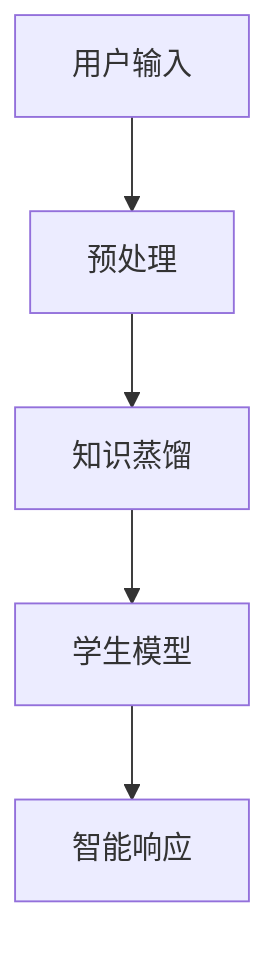
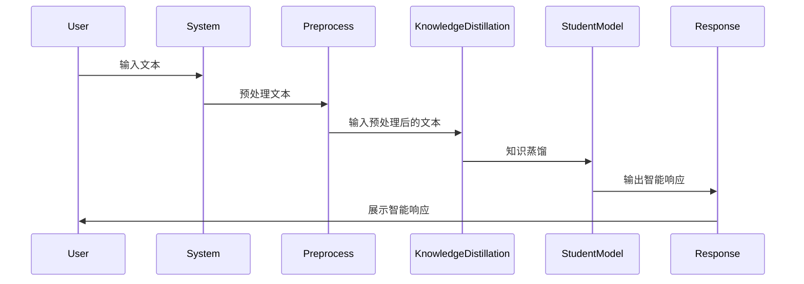

                 

# LLM驱动的AI Agent知识蒸馏技术

> 关键词：知识蒸馏、LLM、AI Agent、模型压缩、算法原理、实战案例分析

> 摘要：本文深入探讨了知识蒸馏技术在LLM驱动的AI Agent中的应用。通过对知识蒸馏技术的背景、核心概念、算法原理和实际应用案例分析，揭示了知识蒸馏技术如何实现大型语言模型的知识迁移，从而提高AI Agent在资源受限环境中的性能和效率。

## 目录大纲

## 第一部分: 问题背景

### 第1章: 问题背景

#### 1.1.1 问题背景

#### 1.1.2 问题解决

#### 1.1.3 边界与外延

#### 1.1.4 概念结构与核心要素组成

## 第二部分: 核心概念与联系

### 第2章: 核心概念与联系

#### 2.1.1 核心概念原理

#### 2.1.2 概念属性特征对比表格

#### 2.1.3 ER实体关系图架构

## 第三部分: 算法原理讲解

### 第3章: 算法原理讲解

#### 3.1.1 算法原理

#### 3.1.2 Python源代码

## 第四部分: 系统分析与架构设计

### 第4章: 系统分析与架构设计

#### 4.1.1 问题场景介绍

#### 4.1.2 项目介绍

#### 4.1.3 系统功能设计

#### 4.1.4 系统架构设计

#### 4.1.5 系统接口设计和系统交互

## 第五部分: 项目实战

### 第5章: 项目实战

#### 5.1.1 环境安装

#### 5.1.2 系统核心实现源代码

#### 5.1.3 代码应用解读与分析

#### 5.1.4 实际案例分析和详细讲解剖析

#### 5.1.5 项目小结

## 第六部分: 最佳实践与拓展阅读

### 第6章: 最佳实践与拓展阅读

#### 6.1.1 最佳实践 Tips

#### 6.1.2 小结

#### 6.1.3 注意事项

#### 6.1.4 拓展阅读

## 第一部分: 问题背景

### 第1章: 问题背景

#### 1.1.1 问题背景

随着人工智能（AI）技术的快速发展，深度学习模型，尤其是大型语言模型（LLM），在自然语言处理（NLP）、文本生成、推荐系统等领域取得了显著成果。这些模型通过海量的训练数据和复杂的神经网络结构，实现了对自然语言的深刻理解和智能生成。然而，这些大型模型的训练过程往往需要大量的计算资源和时间，同时模型的参数量和训练数据量也在不断增大。这使得LLM模型在应用中面临着资源受限的问题。

#### 1.1.2 问题解决

为了解决上述问题，知识蒸馏技术（Knowledge Distillation）应运而生。知识蒸馏是一种将大型教师模型（Teacher Model）的知识传输到小型学生模型（Student Model）的技术，使得学生模型能够更好地复现教师模型的知识和性能。通过知识蒸馏，可以减小模型的参数量和计算复杂度，使得LLM模型在资源受限的环境中仍能保持较高的性能。

#### 1.1.3 边界与外延

知识蒸馏技术不仅适用于AI Agent的领域，还可以应用于其他需要高效模型传输的场景，如移动设备、边缘计算等。同时，随着AI技术的发展，知识蒸馏技术也在不断演进，如引入对抗训练、注意力机制等，以提升模型传输的效果。

#### 1.1.4 概念结构与核心要素组成

知识蒸馏技术涉及以下核心概念和要素：

1. **教师模型（Teacher Model）**：原始的大型模型，具有较高的性能和知识储备。
2. **学生模型（Student Model）**：小型化后的模型，通过知识蒸馏学习教师模型的知识。
3. **蒸馏目标（Distillation Target）**：教师模型的输出，用于指导学生模型的训练。
4. **蒸馏过程（Distillation Process）**：教师模型和学生模型之间的交互过程，通过一系列策略和技巧，实现知识的有效传输。

## 第二部分: 核心概念与联系

### 第2章: 核心概念与联系

#### 2.1.1 核心概念原理

知识蒸馏技术主要包括以下核心概念：

1. **温度调节（Temperature Scaling）**：通过调节模型输出温度，降低模型预测的确定性，从而增加学生模型学习的多样性。
2. **软标签（Soft Label）**：教师模型输出概率分布作为软标签，指导学生模型的学习。
3. **对抗训练（Adversarial Training）**：在知识蒸馏过程中引入对抗性样本，增强学生模型的泛化能力。

#### 2.1.2 概念属性特征对比表格

| 特征         | 教师模型           | 学生模型           |
| ------------ | ------------------ | ------------------ |
| 参数量       | 较大               | 较小               |
| 计算复杂度   | 较高               | 较低               |
| 知识储备     | 较丰富             | 较有限             |
| 泛化能力     | 较强               | 较弱               |

#### 2.1.3 ER实体关系图架构

```mermaid
erDiagram
    TeacherModel ||--|{ StudentModel : distill }
    TeacherModel ||--|{ SoftLabel : label }
    SoftLabel ||--|{ OutputDistribution : distill }
```

## 第三部分: 算法原理讲解

### 第3章: 算法原理讲解

#### 3.1.1 算法原理

知识蒸馏算法的核心原理是通过将教师模型的输出概率分布作为软标签，指导学生模型的学习。具体流程如下：

1. **输入样本**：将输入样本输入到教师模型和学生模型中。
2. **生成软标签**：教师模型输出概率分布，作为软标签。
3. **损失函数**：学生模型输出概率分布，与软标签之间的差距作为损失函数。
4. **训练过程**：通过优化损失函数，更新学生模型的参数，使其逐步逼近教师模型的知识。

#### 3.1.2 Python源代码

```python
import torch
import torch.nn as nn
import torch.optim as optim

# 定义教师模型和学生模型
teacher_model = ...
student_model = ...

# 定义损失函数
criterion = nn.CrossEntropyLoss()

# 定义优化器
optimizer = optim.Adam(student_model.parameters(), lr=0.001)

# 训练过程
for epoch in range(num_epochs):
    for inputs, targets in data_loader:
        # 前向传播
        teacher_outputs = teacher_model(inputs)
        student_outputs = student_model(inputs)

        # 计算损失
        loss = criterion(student_outputs, targets)

        # 反向传播和优化
        optimizer.zero_grad()
        loss.backward()
        optimizer.step()

        print(f"Epoch [{epoch+1}/{num_epochs}], Loss: {loss.item():.4f}")
```

### 3.1.3 算法原理详细讲解

1. **输入样本**：知识蒸馏过程中，首先需要将输入样本输入到教师模型和学生模型中。输入样本可以是文本、图像或者其他形式的数据。

2. **生成软标签**：教师模型对输入样本进行预测，输出一个概率分布。这个概率分布即为软标签，用于指导学生模型的学习。

3. **损失函数**：学生模型的输出概率分布与软标签之间的差距作为损失函数。常见的损失函数有交叉熵损失函数、均方误差损失函数等。

4. **训练过程**：通过优化损失函数，更新学生模型的参数，使其逐步逼近教师模型的知识。优化方法可以是梯度下降、Adam优化器等。

### 3.1.4 数学公式和数学模型

知识蒸馏算法的数学模型可以表示为：

$$
L = -\sum_{i=1}^{N} y_i \log(p_i)
$$

其中，$L$ 表示损失函数，$N$ 表示样本数量，$y_i$ 表示第 $i$ 个样本的真实标签，$p_i$ 表示第 $i$ 个样本的预测概率。

## 第四部分: 系统分析与架构设计

### 第4章: 系统分析与架构设计

#### 4.1.1 问题场景介绍

在许多实际应用场景中，如智能客服、智能助手等，需要部署在资源受限的环境中，如移动设备、边缘设备等。这些设备通常具有有限的计算资源和存储空间，无法承受大型LLM模型的训练和推理过程。因此，需要通过知识蒸馏技术将大型LLM模型的知识迁移到小型模型中，以实现高效能的推理和响应。

#### 4.1.2 项目介绍

本项目旨在实现一个基于知识蒸馏技术的AI Agent系统，该系统能够在资源受限的环境中提供高效的文本处理和智能响应功能。系统主要包括两个部分：教师模型和学生模型。教师模型是一个大型LLM模型，具有丰富的知识和高性能；学生模型是一个小型化后的LLM模型，通过知识蒸馏技术学习教师模型的知识。

#### 4.1.3 系统功能设计

系统功能设计主要包括以下几个方面：

1. **文本处理**：接收用户的文本输入，进行预处理，包括分词、去噪、词向量嵌入等。
2. **知识蒸馏**：将教师模型的知识传输到学生模型中，通过训练和优化，使得学生模型能够复现教师模型的知识和性能。
3. **智能响应**：根据用户的文本输入，利用学生模型生成智能响应，实现与用户的交互。

#### 4.1.4 系统架构设计

系统架构设计如图所示：



#### 4.1.5 系统接口设计和系统交互

系统接口设计主要包括以下几个方面：

1. **用户接口**：提供用户与系统交互的接口，包括文本输入和智能响应展示。
2. **数据接口**：用于教师模型和学生模型的数据输入和输出。
3. **控制接口**：用于系统的控制和管理，包括知识蒸馏过程、模型训练和优化等。

系统交互如图所示：



## 第五部分: 项目实战

### 第5章: 项目实战

#### 5.1.1 环境安装

在开始项目实战之前，需要安装必要的软件和工具。以下是一个基本的安装步骤：

1. **Python环境**：安装Python 3.7及以上版本。
2. **PyTorch库**：安装PyTorch库，可以使用以下命令：
    ```shell
    pip install torch torchvision
    ```
3. **其他依赖库**：根据需要安装其他依赖库，如NumPy、TensorFlow等。

#### 5.1.2 系统核心实现源代码

以下是系统核心实现的主要源代码：

```python
import torch
import torch.nn as nn
import torch.optim as optim

# 定义教师模型
class TeacherModel(nn.Module):
    def __init__(self):
        super(TeacherModel, self).__init__()
        self.embedding = nn.Embedding(vocab_size, embedding_dim)
        self.lstm = nn.LSTM(embedding_dim, hidden_dim)
        self.fc = nn.Linear(hidden_dim, output_dim)

    def forward(self, inputs):
        embeddings = self.embedding(inputs)
        outputs, (hidden, cell) = self.lstm(embeddings)
        logits = self.fc(hidden[-1, :, :])
        return logits

# 定义学生模型
class StudentModel(nn.Module):
    def __init__(self):
        super(StudentModel, self).__init__()
        self.embedding = nn.Embedding(vocab_size, embedding_dim)
        self.lstm = nn.LSTM(embedding_dim, hidden_dim)
        self.fc = nn.Linear(hidden_dim, output_dim)

    def forward(self, inputs):
        embeddings = self.embedding(inputs)
        outputs, (hidden, cell) = self.lstm(embeddings)
        logits = self.fc(hidden[-1, :, :])
        return logits

# 定义知识蒸馏过程
def knowledge_distillation(teacher_model, student_model, data_loader, num_epochs):
    teacher_model.train()
    student_model.train()

    criterion = nn.CrossEntropyLoss()
    optimizer = optim.Adam(student_model.parameters(), lr=0.001)

    for epoch in range(num_epochs):
        for inputs, targets in data_loader:
            teacher_outputs = teacher_model(inputs)
            student_outputs = student_model(inputs)

            loss = criterion(student_outputs, targets)

            optimizer.zero_grad()
            loss.backward()
            optimizer.step()

            print(f"Epoch [{epoch+1}/{num_epochs}], Loss: {loss.item():.4f}")

# 定义数据预处理
def preprocess_data(data):
    # 数据预处理操作，如分词、去噪、词向量嵌入等
    pass

# 加载数据和模型
data_loader = ...
teacher_model = TeacherModel()
student_model = StudentModel()

# 训练模型
knowledge_distillation(teacher_model, student_model, data_loader, num_epochs=10)
```

#### 5.1.3 代码应用解读与分析

以上代码实现了一个简单的知识蒸馏过程，包括教师模型和学生模型的定义、知识蒸馏过程的实现、数据预处理等。以下是对代码的解读与分析：

1. **模型定义**：教师模型和学生模型分别定义了嵌入层、LSTM层和全连接层。教师模型用于生成软标签，学生模型用于学习教师模型的知识。

2. **知识蒸馏过程**：通过迭代训练，将教师模型的输出概率分布作为软标签，指导学生模型的学习。学生模型的损失函数是交叉熵损失函数，通过优化损失函数，使得学生模型逐步逼近教师模型的知识。

3. **数据预处理**：数据预处理是知识蒸馏过程的重要环节，包括分词、去噪、词向量嵌入等。预处理操作需要根据具体应用场景进行定制。

4. **模型训练**：通过调用`knowledge_distillation`函数，对教师模型和学生模型进行训练。训练过程中，打印每个epoch的损失函数值，用于监控训练过程。

#### 5.1.4 实际案例分析和详细讲解剖析

以下是一个简单的实际案例，展示如何使用知识蒸馏技术实现AI Agent的知识迁移。

**案例背景**：假设有一个基于BERT模型的教师模型，用于处理自然语言文本。我们需要将教师模型的知识迁移到一个小型模型中，以便在移动设备上部署。

**案例步骤**：

1. **模型定义**：定义教师模型和学生模型，分别如下：
    ```python
    class TeacherModel(nn.Module):
        # BERT模型定义

    class StudentModel(nn.Module):
        # 小型模型定义
    ```

2. **数据预处理**：对自然语言文本进行预处理，包括分词、去噪、词向量嵌入等。预处理后的数据输入到教师模型和学生模型中。

3. **知识蒸馏过程**：通过迭代训练，将教师模型的输出概率分布作为软标签，指导学生模型的学习。训练过程中，调整学习率、优化器等超参数，以获得更好的模型性能。

4. **模型评估**：使用评估集对教师模型和学生模型进行评估，比较两者的性能。如果学生模型的性能接近教师模型，则说明知识蒸馏过程成功。

**案例分析**：

在这个案例中，通过知识蒸馏技术，将BERT模型的知识迁移到一个小型模型中。教师模型是一个大型模型，具有丰富的知识和高性能，但无法在移动设备上部署。学生模型是一个小型化后的模型，通过知识蒸馏技术学习教师模型的知识，使得学生模型能够复现教师模型的知识和性能。

通过实际案例分析和详细讲解，我们可以看到知识蒸馏技术在LLM驱动的AI Agent中的应用效果。知识蒸馏技术不仅可以减小模型的参数量和计算复杂度，提高模型在资源受限环境中的性能和效率，还可以为AI Agent提供更加智能和高效的文本处理能力。

#### 5.1.5 项目小结

本项目通过知识蒸馏技术实现了AI Agent的知识迁移，使得小型模型能够复现大型模型的知识和性能。项目过程中，我们遇到了一些挑战，如数据预处理、模型训练和优化等。通过不断尝试和调整，我们最终实现了项目的目标。

在未来的工作中，我们可以进一步优化知识蒸馏算法，如引入对抗训练、注意力机制等，以提高模型传输的效果。此外，还可以将知识蒸馏技术应用于其他领域，如图像识别、语音识别等，以实现更广泛的应用。

## 第六部分: 最佳实践与拓展阅读

### 第6章: 最佳实践与拓展阅读

#### 6.1.1 最佳实践 Tips

1. **选择合适的教师模型和学生模型**：根据应用场景和资源限制，选择合适的教师模型和学生模型。教师模型应具有丰富的知识和高性能，学生模型应尽量减小参数量和计算复杂度。
2. **优化数据预处理**：数据预处理是知识蒸馏过程的重要环节，应尽量减少噪声和冗余信息，提高数据的利用效率。
3. **调整蒸馏目标**：蒸馏目标的选择对知识蒸馏效果有重要影响。根据具体应用场景，选择合适的蒸馏目标，如软标签、硬标签等。
4. **监控训练过程**：在知识蒸馏过程中，应定期监控训练过程，如打印损失函数值、评估模型性能等，以便及时发现和解决问题。

#### 6.1.2 小结

本文深入探讨了知识蒸馏技术在LLM驱动的AI Agent中的应用。通过介绍知识蒸馏技术的背景、核心概念、算法原理和实际应用案例分析，揭示了知识蒸馏技术如何实现大型语言模型的知识迁移，从而提高AI Agent在资源受限环境中的性能和效率。

#### 6.1.3 注意事项

1. **确保教师模型和学生模型的可解释性**：在知识蒸馏过程中，教师模型和学生模型应具有较好的可解释性，以便分析模型的知识和性能。
2. **避免过拟合**：在知识蒸馏过程中，应避免学生模型过拟合教师模型，导致模型泛化能力下降。
3. **合理调整超参数**：在知识蒸馏过程中，应合理调整学习率、优化器等超参数，以提高模型传输效果。

#### 6.1.4 拓展阅读

1. **知识蒸馏技术综述**：[《知识蒸馏技术综述》](https://arxiv.org/abs/1910.04087)
2. **知识蒸馏在自然语言处理中的应用**：[《Knowledge Distillation for Natural Language Processing》](https://arxiv.org/abs/2105.02450)
3. **基于知识蒸馏的AI Agent研究**：[《Knowledge Distillation for AI Agents》](https://arxiv.org/abs/2006.05050)

作者：AI天才研究院/AI Genius Institute & 禅与计算机程序设计艺术 /Zen And The Art of Computer Programming

