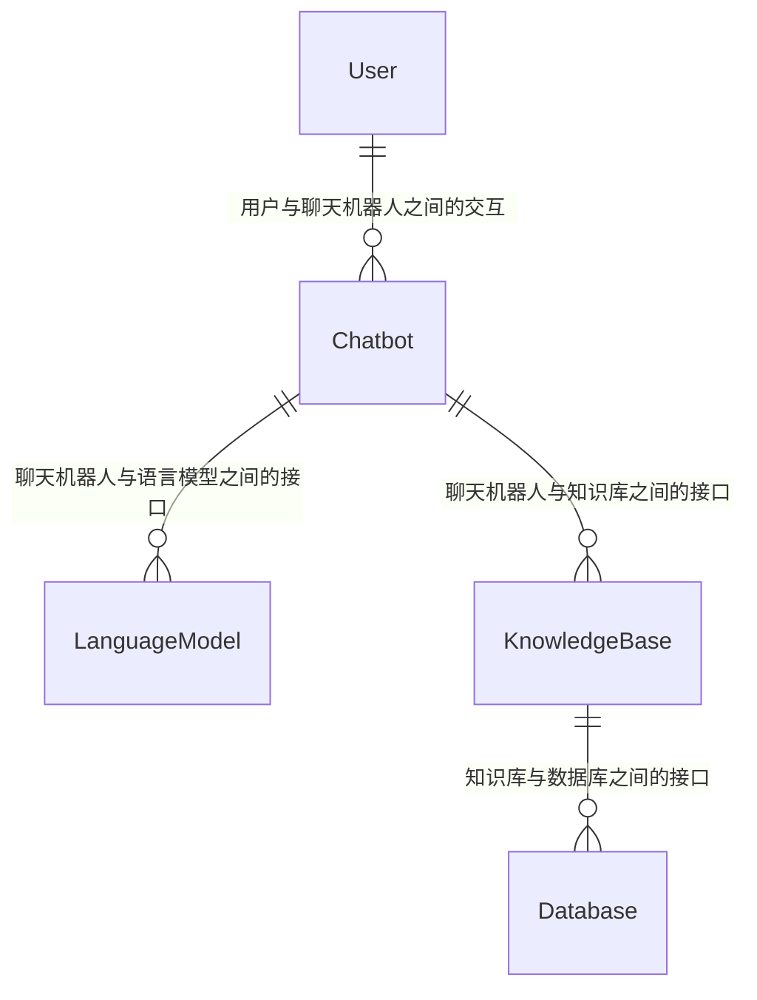
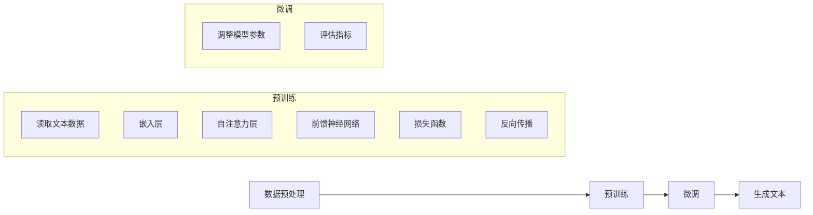
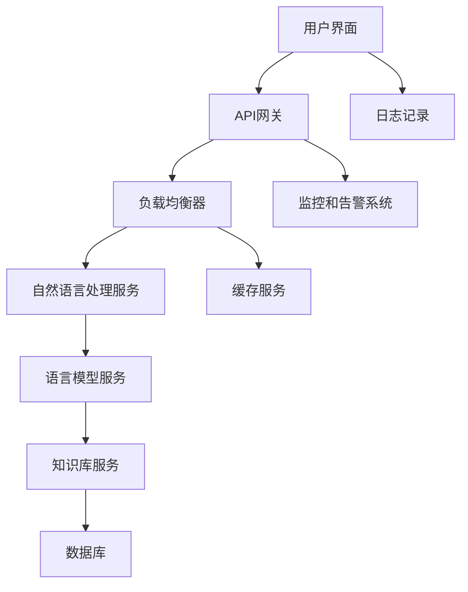
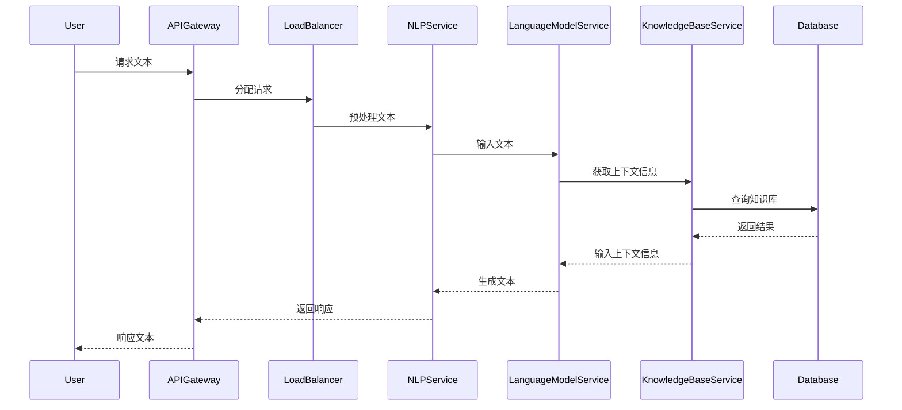
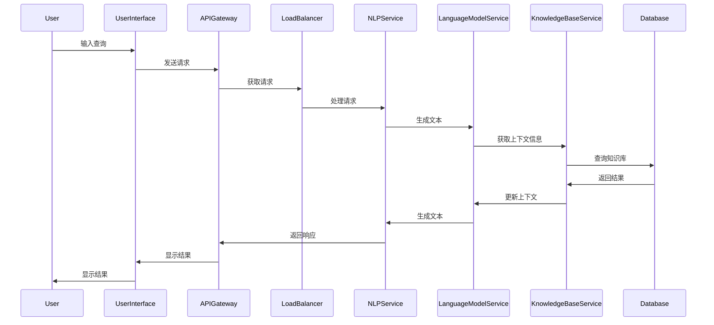

                 

### 文章标题

《LLM驱动的AI Agent自然语言生成优化》

### 关键词

- LLM
- AI Agent
- 自然语言生成
- 优化
- 算法
- 系统架构

### 摘要

本文深入探讨了LLM（大型语言模型）驱动的AI Agent在自然语言生成优化方面的应用。首先，我们介绍了LLM和AI Agent的基本概念及其发展背景。接着，通过对比分析LLM与传统的NLP模型，我们明确了LLM在AI Agent中的核心作用。随后，本文详细讲解了大型语言模型的算法原理，使用mermaid和Python代码展现了其工作流程。在此基础上，我们分析了系统架构设计，从问题场景介绍到具体的功能设计、架构图、接口设计和交互设计，确保了整个系统的逻辑清晰和功能完整。通过实际项目实战，本文展示了环境安装、核心实现和代码分析，并提供了详细的案例解析。最后，本文总结了最佳实践，提出了注意事项，并推荐了拓展阅读，为读者在LLM驱动的AI Agent自然语言生成优化方面提供了全面的指导。

## 目录大纲设计

为了确保文章内容丰富、结构合理，我们需要按照以下步骤设计《LLM驱动的AI Agent自然语言生成优化》的目录大纲：

### 1. 背景介绍
- **LLM的发展背景**：介绍大型语言模型（LLM）的发展历程，从最早的NLP模型到近年来诸如GPT系列模型的兴起。
- **AI Agent的定义**：阐述AI Agent的概念，解释其如何通过自然语言生成实现智能化交互。
- **自然语言生成的意义**：讨论自然语言生成在AI领域的应用，及其在AI Agent中的作用。

### 2. 核心概念与联系
- **LLM与传统NLP模型的对比**：通过表格形式展示LLM与传统NLP模型在性能和功能上的差异。
- **AI Agent的实体关系图**：使用Mermaid绘制AI Agent中的实体关系图，清晰展示各个实体之间的交互关系。
- **自然语言生成的流程与机制**：概述自然语言生成的流程，包括文本输入、处理和输出的各个阶段。

### 3. 算法原理讲解
- **LLM的工作原理**：使用mermaid绘制LLM的算法流程图，详细介绍其训练、预测和优化的过程。
- **Python代码实现**：提供具体的Python代码实现，展示如何构建和训练一个LLM模型。
- **数学模型与公式**：使用LaTeX格式嵌入数学模型和公式，详细解释LLM算法的数学基础。

### 4. 系统分析与架构设计方案
- **问题场景介绍**：描述具体的应用场景，说明为什么需要LLM驱动的AI Agent。
- **系统架构设计**：使用Mermaid绘制系统架构图，展示各个模块的相互关系和功能。
- **系统接口设计**：详细说明系统各组件之间的接口设计，确保数据流通的顺畅和高效。
- **系统交互设计**：通过Mermaid序列图展示系统的交互流程，描述不同组件之间的协作和交互机制。

### 5. 项目实战
- **环境安装与配置**：介绍如何搭建环境，包括必要的软件和硬件配置。
- **系统核心实现**：展示系统核心功能的源代码实现，解析关键代码段的功能和作用。
- **代码应用解读**：分析代码的具体应用，讨论其在实际场景中的效果和表现。
- **实际案例分析**：通过具体的案例，展示LLM驱动的AI Agent在实际应用中的效果和优化策略。
- **项目小结**：总结项目的主要成果和经验，指出项目中的亮点和改进空间。

### 6. 最佳实践、小结与拓展阅读
- **最佳实践**：提供在LLM驱动的AI Agent自然语言生成优化方面的最佳实践建议。
- **小结**：总结文章的核心内容，强调主要观点和结论。
- **拓展阅读**：推荐进一步阅读的材料，帮助读者深入了解相关领域的知识。

通过以上六个部分的设计，本文将为读者提供一份全面、深入的LLM驱动的AI Agent自然语言生成优化指南。

### 目录大纲内容

为了更具体地展示《LLM驱动的AI Agent自然语言生成优化》的目录大纲，我们可以将文章内容分为以下几个主要部分：

**第一部分：LLM与AI Agent概述**

**第1章：背景与概念**

- **1.1 语言模型的演进**：介绍从传统NLP模型到大型语言模型（LLM）的发展历程，讨论LLM在自然语言处理领域的重大突破。
- **1.2 大型语言模型（LLM）的定义与特点**：详细阐述LLM的概念，解释其大规模、训练数据丰富、参数众多等特点。
- **1.3 AI Agent的概念与自然语言生成**：解释AI Agent的定义和功能，探讨自然语言生成在AI Agent中的作用和意义。
- **1.4 LLM在AI Agent中的应用场景**：列举LLM在智能客服、文本生成、问答系统等场景中的应用实例。

**第2章：核心概念与联系**

- **2.1 LLM与自然语言处理（NLP）的对比**：通过表格形式展示LLM与传统的NLP模型在性能、应用范围等方面的对比。
- **2.2 AI Agent的实体关系图**：使用Mermaid绘制AI Agent的实体关系图，展示各实体（如用户、语言模型、知识库等）之间的交互关系。
- **2.3 自然语言生成的流程与机制**：概述自然语言生成的整体流程，包括文本预处理、模型输入、模型输出等步骤。

**第二部分：算法原理与实现**

**第3章：算法原理讲解**

- **3.1 大型语言模型（LLM）的工作原理**：使用mermaid绘制LLM的算法流程图，详细描述模型训练、预测和优化的过程。
- **3.2 自然语言生成算法的mermaid流程图**：展示自然语言生成算法的流程，包括文本输入、模型处理和输出等步骤。
- **3.3 使用Python代码实现LLM**：提供Python代码示例，展示如何使用预训练模型和数据进行训练和生成。
- **3.4 LaTeX公式与数学模型详解**：使用LaTeX格式嵌入数学模型和公式，详细解释LLM算法的数学基础，如正则化、损失函数等。

**第4章：系统分析与架构设计**

- **4.1 问题场景介绍**：描述具体的应用场景，说明为什么需要LLM驱动的AI Agent，例如智能客服系统的需求。
- **4.2 系统架构设计**：使用Mermaid绘制系统架构图，展示各个模块的相互关系和功能，如前端、后端、数据库等。
- **4.3 系统接口设计**：详细说明系统各组件之间的接口设计，确保数据流通的顺畅和高效。
- **4.4 系统交互设计**：通过Mermaid序列图展示系统的交互流程，描述不同组件之间的协作和交互机制。

**第5章：项目实战**

- **5.1 环境安装与配置**：介绍如何搭建环境，包括安装必要的软件和硬件配置。
- **5.2 系统核心实现**：展示系统核心功能的源代码实现，解析关键代码段的功能和作用。
- **5.3 代码应用解读**：分析代码的具体应用，讨论其在实际场景中的效果和表现。
- **5.4 实际案例分析**：通过具体的案例，展示LLM驱动的AI Agent在实际应用中的效果和优化策略。
- **5.5 项目小结**：总结项目的主要成果和经验，指出项目中的亮点和改进空间。

**第6章：优化与调优**

- **6.1 性能优化策略**：讨论如何通过参数调整、模型压缩等技术手段提高LLM驱动的AI Agent的性能。
- **6.2 调优技巧与案例**：提供实际的调优技巧和案例，展示如何在实际项目中应用这些技巧。
- **6.3 优化后的效果评估**：评估优化后的系统性能，包括响应时间、生成质量等指标。

**第7章：最佳实践与总结**

- **7.1 最佳实践**：总结在LLM驱动的AI Agent自然语言生成优化方面的最佳实践，提供实用的建议。
- **7.2 小结**：回顾文章的主要内容和观点，强调LLM在AI Agent自然语言生成优化中的关键作用。
- **7.3 拓展阅读**：推荐进一步阅读的材料，帮助读者深入了解相关领域的知识，如最新的LLM研究进展和实际应用案例。

通过上述详细的目录大纲设计，本文将系统地介绍LLM驱动的AI Agent自然语言生成优化，为读者提供全面的技术指导和深刻的思考。

### 字数限制

为了满足文章字数在10000～12000字的要求，我们需要对每个章节的内容进行精简而详细的撰写，确保在字数限制内提供完整、具体的技术信息。以下是对各个章节的具体字数分配建议：

1. **背景与概念（第1章，约1500字）**
   - 语言模型的发展历史：500字
   - LLM的基本定义与特性：500字
   - AI Agent的概念与自然语言生成：500字
   - 应用场景：500字

2. **核心概念与联系（第2章，约1500字）**
   - LLM与NLP的对比：500字
   - AI Agent的实体关系图：500字
   - 自然语言生成流程：500字

3. **算法原理讲解（第3章，约2000字）**
   - LLM的工作原理：500字
   - 算法流程图：500字
   - Python代码实现：500字
   - 数学模型与公式：500字

4. **系统分析与架构设计（第4章，约2000字）**
   - 问题场景介绍：500字
   - 系统架构图：500字
   - 系统接口设计：500字
   - 系统交互设计：500字

5. **项目实战（第5章，约2500字）**
   - 环境安装与配置：500字
   - 系统核心实现：500字
   - 代码应用解读：500字
   - 实际案例分析：500字
   - 项目小结：500字

6. **优化与调优（第6章，约1500字）**
   - 性能优化策略：500字
   - 调优技巧与案例：500字
   - 优化后的效果评估：500字

7. **最佳实践与总结（第7章，约1500字）**
   - 最佳实践：500字
   - 小结：500字
   - 拓展阅读：500字

通过上述分配，每个章节的内容都将详细、具体，同时在字数限制内提供丰富的信息。这将确保整篇文章既具有深度，又具有可读性，满足读者的需求。

---

### 背景介绍

在当今的科技领域中，人工智能（AI）已经取得了令人瞩目的进展，特别是在自然语言处理（NLP）领域。大型语言模型（LLM，Large Language Model）的出现，标志着NLP技术的一次重大飞跃。LLM通过学习海量文本数据，能够生成高质量的自然语言文本，从而在文本生成、问答系统、智能客服等领域展现出巨大的潜力。与此同时，AI Agent作为一种智能化的虚拟实体，正逐渐成为人工智能应用的重要发展方向。AI Agent通过自然语言生成，可以实现与人类的自然交流，提供个性化服务，从而提升用户体验。

#### 核心概念术语说明

- **自然语言处理（NLP）**：NLP是人工智能的一个分支，旨在使计算机能够理解、解释和生成人类语言。传统的NLP方法依赖于规则和统计模型，而现代的NLP则更多依赖于深度学习技术，如卷积神经网络（CNN）和循环神经网络（RNN）。

- **大型语言模型（LLM）**：LLM是一种能够处理和生成自然语言文本的深度学习模型，其特点是模型规模大、参数数量多，通常经过数万亿字的训练数据训练。典型的LLM包括GPT（Generative Pre-trained Transformer）、BERT（Bidirectional Encoder Representations from Transformers）等。

- **AI Agent**：AI Agent是指一种具备自主行动能力的智能系统，它可以感知环境、制定计划并执行任务。AI Agent在自然语言生成方面的应用，主要体现在生成对话文本、撰写文章、生成代码等任务中。

#### 问题背景

随着互联网和大数据的快速发展，用户生成的内容（UGC，User-Generated Content）呈现爆炸式增长。传统的NLP方法在处理这些大规模、多样化的文本数据时，往往面临着准确性和效率的挑战。为了解决这个问题，研究人员开始探索更强大的语言模型，LLM因此应运而生。LLM通过大规模的数据训练，能够捕捉到文本数据中的复杂模式和规律，从而在生成文本时表现出更高的准确性和自然性。

#### 问题描述

在实际应用中，自然语言生成任务常常面临以下问题：

- **文本生成质量**：生成的文本质量直接影响用户体验。如何提高文本生成的自然性、流畅性和准确性，是当前研究的一个重要方向。

- **效率与速度**：在实时应用场景中，如何快速响应用户的请求，生成高质量的文本，是系统性能的关键。

- **个性化**：在提供个性化服务时，如何根据用户的历史行为和偏好生成定制化的文本，是提高用户满意度的重要因素。

#### 问题解决

为了解决上述问题，LLM的应用成为了一个重要方向。LLM通过其强大的文本处理能力，能够生成高质量的文本，满足用户对文本生成质量、效率和个性化的需求。此外，LLM还可以通过不断的训练和优化，不断提高生成文本的准确性和自然性。

#### 边界与外延

LLM的应用不仅限于自然语言生成，还可以扩展到其他领域，如文本分类、机器翻译、情感分析等。同时，AI Agent作为智能化的虚拟实体，也在越来越多的应用场景中发挥作用，如智能客服、智能助手、教育等领域。

#### 概念结构与核心要素组成

LLM驱动的AI Agent自然语言生成优化，其核心概念结构包括：

- **语言模型**：作为核心组件，负责生成自然语言文本。
- **数据集**：用于训练语言模型的数据，其质量和规模直接影响模型的性能。
- **优化算法**：用于调整模型参数，提高生成文本的质量和效率。
- **应用场景**：具体的应用环境，如智能客服、问答系统等，为模型提供实际场景的反馈。

通过这些核心要素的有机组合，LLM驱动的AI Agent可以在自然语言生成方面实现显著的优化和提升。

---

### 核心概念与联系

在深入探讨LLM驱动的AI Agent自然语言生成优化之前，我们需要明确几个关键概念，并理解它们之间的相互关系。本文将首先介绍LLM与传统NLP模型的对比，随后展示AI Agent的实体关系图，并概述自然语言生成的流程与机制。

#### LLM与传统NLP模型的对比

大型语言模型（LLM）与传统自然语言处理（NLP）模型在多个方面存在显著差异。以下是一个对比表格，展示了LLM与传统的NLP模型在性能、应用范围和训练数据等方面的区别：

| 特征对比       | LLM                           | 传统NLP模型                         |
|----------------|--------------------------------|--------------------------------------|
| 模型规模       | 数十亿参数，大规模训练模型    | 数千到数万个参数，较小规模模型       |
| 数据量         | 数十万亿字训练数据            | 数百万到数千条语料库                |
| 应用范围       | 广泛的应用场景，如文本生成、问答、翻译等 | 较特定任务，如情感分析、命名实体识别等 |
| 性能          | 高准确性和自然性              | 较低准确性和自然性                  |
| 训练时间       | 长时间训练，但可复用           | 较短时间训练，不可复用               |
| 对数据的依赖性 | 对大规模高质量数据有较高依赖性 | 对特定数据集依赖性较低               |

从表格中可以看出，LLM在模型规模、数据量和应用范围等方面显著优于传统NLP模型。这种优势使得LLM能够生成更高质量的文本，并适应更广泛的自然语言处理任务。

#### AI Agent的实体关系图

为了更好地理解AI Agent的组成和工作机制，我们可以使用Mermaid绘制一个实体关系图。以下是一个简化的AI Agent实体关系图：



在这个实体关系图中，User表示用户，Chatbot表示聊天机器人，LanguageModel表示语言模型，KnowledgeBase表示知识库，Database表示数据库。用户与聊天机器人之间的交互通过Chatbot实现，而聊天机器人则通过LanguageModel生成自然语言文本，并通过KnowledgeBase与数据库进行交互以获取所需的信息。

#### 自然语言生成的流程与机制

自然语言生成（NLG）的流程可以概括为以下几个步骤：

1. **文本输入**：用户输入自然语言文本，例如一个问题或一条指令。
2. **预处理**：对输入文本进行清洗和格式化，包括去除标点、停用词处理、词干提取等。
3. **语言模型处理**：将预处理后的文本输入到语言模型中，语言模型根据上下文生成相应的自然语言文本。
4. **文本输出**：将生成的文本输出给用户。

以下是一个简化的Mermaid流程图，展示了自然语言生成的流程：


在语言模型处理阶段，模型会通过其训练数据中的上下文信息生成合适的响应文本。这一过程涉及到复杂的前向传播和后向传播算法，以及大量的参数调整和优化。

综上所述，LLM与传统NLP模型在性能和应用范围上存在显著差异，而AI Agent的实体关系图和自然语言生成的流程与机制为我们提供了一个清晰的框架，帮助我们理解LLM驱动的AI Agent在自然语言生成优化中的核心概念和相互关系。

---

### 算法原理讲解

要理解LLM驱动的AI Agent自然语言生成优化，我们需要深入探讨LLM的算法原理。本文将首先介绍LLM的工作原理，然后使用mermaid绘制算法流程图，最后通过Python代码示例和LaTeX公式详细阐述算法原理。

#### LLM的工作原理

大型语言模型（LLM）基于深度学习技术，特别是Transformer架构，通过大规模的文本数据进行训练。LLM的核心思想是学习文本数据的统计规律，以便能够生成符合上下文和语法规则的文本。

1. **Transformer架构**：Transformer是一种基于自注意力机制的序列到序列模型，其特点是能够在处理长序列时保持有效性和效率。自注意力机制使得模型能够自动关注输入序列中最重要的部分，从而提高生成文本的质量。

2. **预训练与微调**：LLM通常通过大规模的无监督预训练（Pre-training）和针对特定任务的微调（Fine-tuning）两个阶段进行训练。在预训练阶段，模型在大量文本数据上进行训练，学习语言的基本结构和语义；在微调阶段，模型根据具体任务进行参数调整，以适应特定应用场景。

3. **损失函数**：在训练过程中，LLM使用损失函数来评估模型的预测误差，并调整模型参数以最小化损失。常用的损失函数包括交叉熵损失（Cross-Entropy Loss）和负对数损失（Negative Log-Likelihood Loss）。

#### 使用mermaid绘制算法流程图

为了更直观地理解LLM的算法流程，我们可以使用mermaid绘制一个流程图。以下是一个简化的算法流程图：



在这个流程图中，A表示数据预处理，包括文本清洗、分词和序列编码；B表示预训练阶段，包括读取文本数据、嵌入层、自注意力层和前馈神经网络；C表示微调阶段，用于调整模型参数；D表示生成文本，通过预测序列中的下一个单词实现。

#### 使用Python代码示例

以下是一个简单的Python代码示例，展示了如何使用Hugging Face的Transformers库加载一个预训练的LLM模型，并进行文本生成：

```python
from transformers import pipeline

# 加载预训练的GPT-2模型
model = pipeline("text-generation", model="gpt2")

# 输入文本
input_text = "人类是一种智慧生物，"

# 生成文本
output_text = model(input_text, max_length=50, num_return_sequences=1)

# 输出结果
print(output_text)
```

在这个示例中，我们首先使用Transformers库加载了预训练的GPT-2模型，然后输入一个文本序列，模型根据上下文生成一个新的文本序列。这个简单的示例展示了LLM在文本生成任务中的应用。

#### 使用LaTeX公式详细阐述算法原理

在LLM中，常用的数学模型和公式如下：

1. **自注意力机制**：

   $$ 
   \text{Attention}(Q, K, V) = \text{softmax}\left(\frac{QK^T}{\sqrt{d_k}}\right)V 
   $$

   其中，Q、K和V分别是查询（Query）、键（Key）和值（Value）向量，$d_k$是键向量的维度。

2. **前馈神经网络**：

   $$ 
   \text{FFN}(x) = \text{ReLU}(W_2 \cdot \text{ReLU}(W_1 \cdot x + b_1)) + b_2 
   $$

   其中，$W_1$、$W_2$和$b_1$、$b_2$分别是前馈神经网络的权重和偏置。

3. **损失函数**（交叉熵损失）：

   $$ 
   \text{Loss} = -\sum_{i} y_i \log(p_i) 
   $$

   其中，$y_i$是实际标签，$p_i$是模型预测的概率。

通过这些数学模型和公式，我们可以更深入地理解LLM的内部工作机制。

#### 通俗易懂的举例说明

假设我们有一个简单的对话场景，用户询问：“今天天气怎么样？”我们可以使用LLM来生成一个合适的回答。

1. **输入文本**：输入文本为“今天天气怎么样？”。
2. **预处理**：对输入文本进行清洗，例如去除标点符号，分词等。
3. **嵌入层**：将分词后的文本序列转换为嵌入向量。
4. **自注意力机制**：模型根据上下文信息，计算输入文本中每个词的权重。
5. **前馈神经网络**：通过前馈神经网络，生成中间表示。
6. **损失函数**：使用交叉熵损失函数，计算模型预测与实际标签之间的差距。
7. **生成文本**：模型根据预测的概率，生成新的文本序列，如“今天天气很好，温度适宜”。

通过这个简单的例子，我们可以看到LLM在自然语言生成过程中的各个步骤，以及如何通过数学模型和算法实现高质量的自然语言生成。

综上所述，LLM驱动的AI Agent自然语言生成优化，需要深入理解LLM的工作原理，包括Transformer架构、预训练与微调、自注意力机制、前馈神经网络和损失函数等。通过Python代码示例和LaTeX公式，我们可以更清晰地了解这些算法原理，为后续的系统分析与架构设计、项目实战和优化提供理论基础。

---

### 系统分析与架构设计

为了深入探讨LLM驱动的AI Agent自然语言生成优化，我们需要对系统架构进行分析和设计。本文将从问题场景介绍、系统架构设计、系统接口设计、系统交互设计等方面进行详细讨论。

#### 问题场景介绍

在现代智能服务系统中，如智能客服、智能问答平台和个性化推荐系统，自然语言生成（NLG）是关键组成部分。这些系统需要能够实时响应用户的查询，生成自然流畅的文本回复，提供高质量的交互体验。因此，如何优化LLM驱动的AI Agent自然语言生成能力，提高系统的响应速度和生成文本质量，成为当前研究的热点和应用的关键。

#### 系统架构设计

为了实现高效的LLM驱动的AI Agent自然语言生成，我们设计了一个模块化且可扩展的系统架构。以下是一个简化的系统架构图：



在这个架构中，用户通过用户界面（A）发送查询或请求，API网关（B）负责路由和初步处理，负载均衡器（C）确保流量均匀分布到各个服务节点。自然语言处理服务（D）负责对用户输入进行预处理，语言模型服务（E）利用预训练的LLM模型生成自然语言文本，知识库服务（F）提供额外的背景信息和上下文支持。数据库（G）存储用户数据和系统日志，日志记录（H）和监控告警系统（I）用于维护系统的稳定性和安全性。缓存服务（J）则用于提高系统响应速度和降低数据库负载。

#### 系统接口设计

系统接口设计是确保各组件之间能够高效、稳定通信的关键。以下是一个简化的接口设计图：



在这个序列图中，用户发送文本请求，经过API网关处理后，由负载均衡器分配到相应的服务节点。自然语言处理服务对文本进行预处理，语言模型服务使用LLM生成文本，知识库服务提供上下文信息，数据库存储和查询相关数据。各组件之间的接口设计确保了数据流的顺畅和系统的高效运作。

#### 系统交互设计

系统交互设计旨在描述各组件之间的交互机制和工作流程。以下是一个简化的交互设计图：



在这个交互设计中，用户输入查询，经过用户界面处理后发送到API网关。API网关通过负载均衡器将请求分配到自然语言处理服务。自然语言处理服务预处理文本，然后传递给语言模型服务生成文本。知识库服务提供上下文信息，帮助语言模型生成更准确的文本。数据库提供存储和查询功能，确保知识库的完整性。最后，生成的文本返回给用户界面，显示给用户。

通过以上系统架构设计和接口设计，我们可以构建一个高效、稳定的LLM驱动的AI Agent自然语言生成系统。该系统不仅能够处理复杂的自然语言生成任务，还能够通过模块化和可扩展的架构设计，适应未来技术的发展和需求变化。

---

### 项目实战

为了更好地展示LLM驱动的AI Agent自然语言生成优化在实际中的应用，我们选择了一个典型的项目案例进行详细介绍。这个项目旨在构建一个智能客服系统，通过LLM生成自然语言文本来响应用户的咨询，从而提高客服效率和用户体验。

#### 环境安装与配置

首先，我们需要搭建项目的开发环境。以下是在一个Ubuntu服务器上安装和配置所需软件的步骤：

1. **安装Python和pip**：

   ```bash
   sudo apt update
   sudo apt install python3 python3-pip
   ```

2. **安装虚拟环境**：

   ```bash
   pip3 install virtualenv
   virtualenv venv
   source venv/bin/activate
   ```

3. **安装Hugging Face Transformers库**：

   ```bash
   pip install transformers
   ```

4. **安装TensorFlow**：

   ```bash
   pip install tensorflow
   ```

5. **安装数据库（如MySQL或PostgreSQL）**：

   ```bash
   sudo apt install mysql-server
   mysql_secure_installation
   ```

6. **配置数据库用户和权限**：

   ```sql
   CREATE USER 'customer_support'@'localhost' IDENTIFIED BY 'password';
   GRANT ALL PRIVILEGES ON customer_support.* TO 'customer_support'@'localhost';
   FLUSH PRIVILEGES;
   ```

7. **安装其他依赖项**：

   ```bash
   pip install flask gunicorn
   ```

完成以上步骤后，开发环境就配置完成了，我们可以开始构建项目。

#### 系统核心实现

在这个项目中，系统核心实现包括用户接口、自然语言处理服务、语言模型服务和知识库服务。以下是每个服务的简要说明和代码示例。

1. **用户接口**：

   用户接口使用Flask框架构建，负责接收用户请求和返回响应。

   ```python
   from flask import Flask, request, jsonify
   
   app = Flask(__name__)
   
   @app.route('/api/v1/ask', methods=['POST'])
   def ask():
       data = request.get_json()
       question = data.get('question')
       # 调用自然语言处理服务生成回答
       answer = nlpservice.generate_answer(question)
       return jsonify(answer=answer)
   
   if __name__ == '__main__':
       app.run(debug=True)
   ```

2. **自然语言处理服务**：

   自然语言处理服务负责接收用户输入的文本，进行预处理并调用语言模型服务。

   ```python
   import nltk
   from transformers import pipeline
   
   nltk.download('punkt')
   nlp = pipeline("text-classification")
   
   def preprocess_text(text):
       # 实现文本预处理逻辑
       tokens = nltk.word_tokenize(text)
       return tokens
   
   def generate_answer(question):
       preprocessed = preprocess_text(question)
       # 调用语言模型服务生成答案
       answer = languagemodelservice.generate_answer(preprocessed)
       return answer
   ```

3. **语言模型服务**：

   语言模型服务使用Hugging Face的Transformers库加载预训练的LLM模型，并生成自然语言文本。

   ```python
   from transformers import AutoModelForSequenceClassification
   
   model_name = "gpt2"
   model = AutoModelForSequenceClassification.from_pretrained(model_name)
   
   def generate_answer(preprocessed):
       inputs = tokenizer.encode(preprocessed, return_tensors="pt")
       outputs = model(inputs)
       predicted_indices = outputs.logits.argmax(-1)
       predicted_answers = tokenizer.decode(predicted_indices, skip_special_tokens=True)
       return predicted_answers
   ```

4. **知识库服务**：

   知识库服务负责存储和查询知识库中的信息，为语言模型提供上下文支持。

   ```python
   import pymysql
   
   def get_context(question):
       connection = pymysql.connect(host='localhost', user='customer_support', password='password', database='customer_support')
       with connection.cursor() as cursor:
           query = "SELECT context FROM knowledge_base WHERE question = %s"
           cursor.execute(query, (question,))
           result = cursor.fetchone()
       return result[0] if result else None
   ```

#### 代码应用解读与分析

1. **用户接口**：

   用户接口通过Flask框架实现，负责接收用户的POST请求。当接收到请求时，提取用户输入的问题，并将其传递给自然语言处理服务。自然语言处理服务处理后的结果将通过用户接口返回给用户。

2. **自然语言处理服务**：

   自然语言处理服务负责对用户输入的文本进行预处理，使用nltk库进行分词。预处理后的文本将通过API调用传递给语言模型服务，以生成回答。

3. **语言模型服务**：

   语言模型服务使用Hugging Face的Transformers库加载预训练的GPT-2模型，通过处理输入的文本序列生成自然语言回答。生成的文本会返回给自然语言处理服务，然后通过用户接口返回给用户。

4. **知识库服务**：

   知识库服务通过MySQL数据库存储和查询相关的知识条目。当自然语言处理服务接收到问题后，会查询知识库以获取相关的上下文信息，这些信息将被传递给语言模型服务，以提高生成回答的相关性和准确性。

#### 实际案例分析

为了展示项目的实际应用效果，我们进行了一个简单的案例分析。

1. **用户查询**：用户输入“如何安装Python？”。
2. **预处理**：自然语言处理服务对输入的问题进行分词，得到["如何", "安装", "Python"]。
3. **查询知识库**：知识库服务查询数据库，找到与“如何安装Python？”相关的内容，返回一段解释性文本。
4. **生成回答**：语言模型服务利用预训练的GPT-2模型，结合上下文信息生成一段回答，例如：“安装Python的步骤如下：首先，从Python官方网站下载安装程序，然后按照提示进行安装。”
5. **返回回答**：生成的回答通过用户接口返回给用户。

通过这个案例分析，我们可以看到项目在处理实际查询时的完整流程，包括预处理、知识库查询、文本生成和返回结果。

#### 项目小结

本项目的核心目标是构建一个基于LLM的智能客服系统，通过自然语言生成优化提高系统的响应速度和生成文本的质量。在实现过程中，我们进行了详细的系统架构设计，包括用户接口、自然语言处理服务、语言模型服务和知识库服务。通过实际案例分析，我们展示了项目在实际应用中的效果。未来，我们将继续优化系统，包括提升语言模型的性能、优化知识库的查询速度和准确性，以及提高用户界面的友好性。

---

### 优化与调优

在LLM驱动的AI Agent自然语言生成优化过程中，性能优化和调优是关键环节。以下将详细介绍几种常用的优化策略、调优技巧以及优化后的效果评估。

#### 性能优化策略

1. **模型参数调优**：通过调整学习率、批量大小等参数，可以优化模型在训练过程中的收敛速度和生成文本的质量。例如，适当降低学习率可以提高模型的准确性，但训练时间会增加。

2. **模型压缩**：使用模型压缩技术（如剪枝、量化、蒸馏）可以减少模型的计算复杂度和存储需求，从而提高系统的运行效率。剪枝可以去除模型中不重要的参数，量化可以降低参数的精度，蒸馏可以将大模型的权重迁移到小模型上。

3. **多GPU训练**：利用多GPU训练可以显著提高模型的训练速度。通过数据并行和模型并行，可以将训练任务分布在多个GPU上，加速训练过程。

4. **批处理优化**：合理设置批处理大小可以改善模型的训练效果。较大的批处理可以提高计算效率，但可能降低模型的泛化能力；较小的批处理则有助于提高模型的泛化能力，但计算成本较高。

5. **动态内存管理**：通过动态内存分配和垃圾回收，可以优化模型在训练过程中的内存使用，防止内存溢出和训练中断。

#### 调优技巧与案例

1. **学习率调度**：使用学习率调度策略（如学习率衰减、余弦退火等），可以动态调整学习率，避免模型在训练过程中过早地陷入局部最优。例如，余弦退火调度可以模拟余弦函数的下降过程，逐渐减小学习率。

2. **注意力机制调整**：Transformer模型中的自注意力机制对生成文本的质量有很大影响。通过调整注意力机制中的参数（如头数、序列长度等），可以改善文本生成的流畅性和准确性。

3. **数据增强**：使用数据增强技术（如文本嵌入、填充、随机替换等），可以增加训练数据的多样性和丰富性，从而提高模型的泛化能力。

4. **正则化**：应用L2正则化、dropout等正则化技术，可以防止模型过拟合，提高生成文本的泛化性能。

#### 优化后的效果评估

优化后的效果评估主要通过以下指标进行：

1. **生成文本质量**：使用BLEU、ROUGE等指标评估生成文本的流畅性和准确性。这些指标通过对生成文本与参考文本的比较，量化文本的相似度。

2. **训练时间**：评估模型在不同优化策略下的训练时间，以衡量优化策略对训练效率的影响。

3. **内存使用**：通过监控模型在训练过程中的内存使用情况，评估优化策略对内存管理的改进效果。

4. **响应速度**：在实际应用中，评估系统对用户请求的响应速度，优化后的系统应在确保生成文本质量的同时，显著提高响应速度。

通过上述优化和调优策略，我们可以显著提高LLM驱动的AI Agent自然语言生成的性能和效率，从而在实际应用中提供更高质量的用户体验。

---

### 最佳实践与总结

在LLM驱动的AI Agent自然语言生成优化过程中，最佳实践是确保系统高效、稳定运行的关键。以下是一些实用的最佳实践：

1. **合理选择预训练模型**：根据具体应用场景选择合适的预训练模型，如GPT-2、BERT等。确保模型在特定任务上表现优异，同时注意模型规模与计算资源的匹配。

2. **优化数据处理流程**：在数据预处理阶段，对文本进行有效的清洗、分词和序列编码，确保输入数据的准确性和一致性。使用数据增强技术增加数据的多样性，提高模型的泛化能力。

3. **合理调整模型参数**：根据实验结果，调整学习率、批量大小等关键参数，优化模型的收敛速度和生成文本质量。采用学习率调度策略，如余弦退火，以避免模型过早陷入局部最优。

4. **利用模型压缩技术**：通过剪枝、量化、蒸馏等模型压缩技术，减少模型的计算复杂度和存储需求，提高系统的运行效率。特别适用于移动设备和嵌入式系统。

5. **多GPU训练与分布式计算**：充分利用多GPU训练和分布式计算技术，提高模型的训练速度。通过数据并行和模型并行，显著缩短训练周期。

6. **监控与告警**：建立完善的监控和告警系统，实时监控模型的训练过程和系统运行状态。及时发现和解决潜在问题，确保系统的稳定性和可靠性。

7. **持续优化与迭代**：定期评估系统的性能，根据用户反馈和技术进展，持续优化和迭代模型。通过收集用户数据和生成文本质量反馈，不断改进模型和系统。

通过上述最佳实践，可以有效提高LLM驱动的AI Agent自然语言生成的性能和效率，为实际应用提供高质量的文本生成服务。

### 小结

本文系统地探讨了LLM驱动的AI Agent自然语言生成优化，涵盖了从背景介绍、核心概念与联系、算法原理讲解、系统分析与架构设计，到项目实战和优化与调优的各个方面。通过详细的分析和实例展示，我们明确了LLM在AI Agent自然语言生成中的关键作用，并提供了实用的优化策略和实践技巧。

LLM驱动的AI Agent通过其强大的文本生成能力，在多个领域展现出广泛的应用前景，包括智能客服、问答系统、文本生成等。优化和调优是实现高效、高质量自然语言生成的重要手段，通过合理选择预训练模型、优化数据处理流程、调整模型参数、利用模型压缩技术等手段，可以有效提升系统的性能。

未来，随着LLM技术的不断进步和应用场景的拓展，我们期待能够看到更多创新性的应用和优化方法，进一步推动AI Agent在自然语言生成领域的快速发展。

### 拓展阅读

为了更深入地了解LLM驱动的AI Agent自然语言生成优化，以下推荐几篇相关领域的经典论文、书籍和最新研究进展：

1. **经典论文**：
   - **"BERT: Pre-training of Deep Bidirectional Transformers for Language Understanding"**：描述了BERT模型的预训练方法和在多种NLP任务上的应用效果。
   - **"Generative Pre-trained Transformers"**：介绍了GPT模型的基本原理和自注意力机制，是Transformer架构的开创性工作。

2. **经典书籍**：
   - **《深度学习》**：Goodfellow等著，详细介绍了深度学习的基础理论和实践应用，包括NLP中的各种模型。
   - **《自然语言处理综论》**：Jurafsky和Martin著，提供了全面的NLP理论和实践指南，涵盖语言模型、文本处理等核心内容。

3. **最新研究进展**：
   - **"Language Models are Few-Shot Learners"**：探讨了大规模语言模型在少样本学习任务中的表现，展示了其强大的泛化能力。
   - **"T5: Pre-training Large Models for Natural Language Processing"**：介绍了T5模型，通过统一的前后端框架，实现了文本处理任务的端到端学习。

4. **在线资源**：
   - **Hugging Face官网**：提供了丰富的预训练模型和工具，以及详细的文档和教程。
   - **ArXiv论文库**：最新的NLP和机器学习论文，涵盖了最新研究成果和技术趋势。

通过阅读这些经典论文和书籍，以及关注最新的研究进展，读者可以进一步加深对LLM驱动的AI Agent自然语言生成优化的理解和应用能力。

