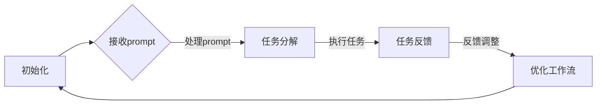
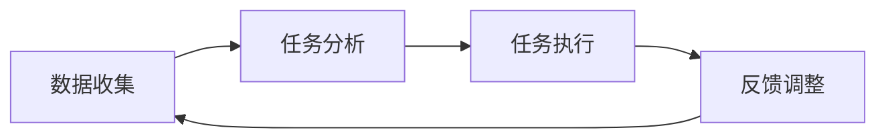
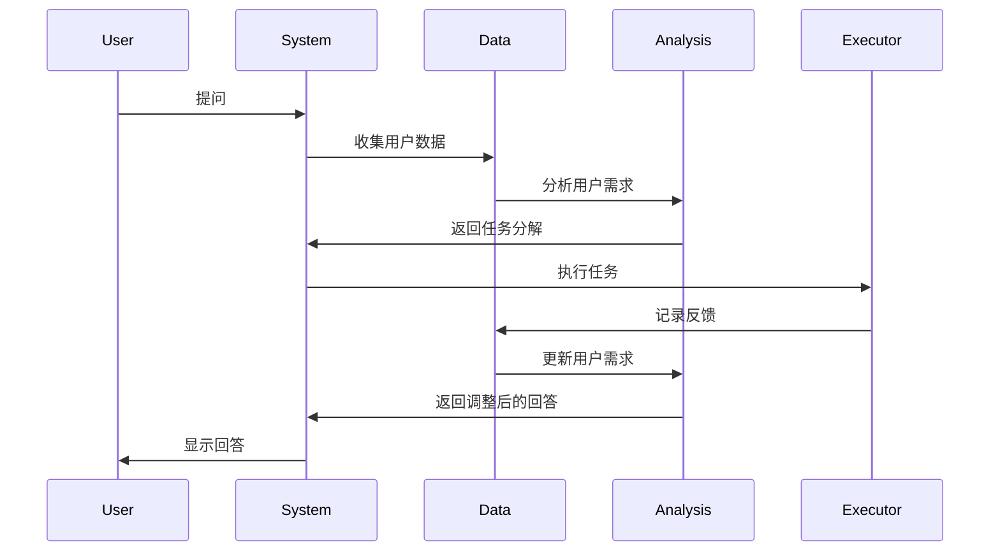

                 

### 《prompt链：构建复杂AI Agent工作流》

#### 关键词：prompt链，复杂AI Agent，工作流，算法原理，数学模型，系统架构，项目实战

#### 摘要：
本文深入探讨了《prompt链：构建复杂AI Agent工作流》一书的核心概念和主要观点。首先，我们回顾了书名中的关键术语，然后逐步拆解每个概念，探讨了其相互联系和作用机制。接着，文章详细讲解了书中的算法原理，包括数学模型的构建和公式的推导，并通过Python代码示例进行说明。随后，我们分析了书中提出的系统架构设计方案，介绍了项目实战中的具体实现步骤和案例剖析。最后，文章总结了最佳实践、注意事项，并提供了拓展阅读资源。

### 第一部分：背景与核心概念

#### 1. 背景介绍

随着人工智能技术的飞速发展，AI Agent作为智能系统的核心组件，正逐步融入我们的日常生活和工作。然而，如何构建一个高效的、复杂的AI Agent工作流成为了一个亟待解决的问题。《prompt链：构建复杂AI Agent工作流》正是围绕这一主题展开的一本深入探讨的专著。

##### 1.1 问题背景

在传统的AI应用中，AI Agent往往需要处理复杂的多任务环境，例如自动驾驶、智能客服、自动化决策系统等。这些系统需要具备良好的自主学习能力、任务执行能力和决策能力，而这正是prompt链技术所要解决的问题。

##### 1.2 问题描述

复杂AI Agent的工作流通常包括数据输入、模型训练、任务执行、反馈调整等环节。然而，如何高效地组织这些环节，确保Agent能够在多任务环境中快速响应并优化其性能，是一个挑战。

##### 1.3 问题解决

《prompt链：构建复杂AI Agent工作流》提出了一种创新的解决方案——prompt链。通过设计一套高效的prompt链机制，AI Agent能够更好地处理多任务环境，实现高效学习和任务执行。

##### 1.4 边界与外延

prompt链不仅适用于AI Agent，还可以广泛应用于其他需要复杂流程管理的领域，如自动化生产线、智能医疗诊断等。

##### 1.5 概念结构与核心要素组成

prompt链由多个基本组件构成，包括prompt生成器、AI Agent、任务执行器、反馈机制等。这些组件相互作用，形成了一个完整的工作流体系。

### 第二部分：核心概念与联系

#### 2.1 Prompt链的定义

Prompt链是一种基于提示的连续操作序列，用于指导AI Agent在多任务环境中执行特定任务。它由一系列有序的提示组成，每个提示都对应AI Agent的一个操作。

#### 2.2 复杂AI Agent

复杂AI Agent是指具备多任务处理能力、自主学习能力和决策能力的智能系统。它们能够通过prompt链实现高效的任务执行和性能优化。

#### 2.3 工作流

工作流是指AI Agent在执行任务过程中的一系列操作步骤。prompt链作为工作流的核心，负责组织和管理这些步骤，确保任务的高效执行。

#### 2.4 概念属性特征对比表格

为了更清晰地理解这些概念，我们可以制作一个概念属性特征对比表格，详细列出它们的特点和相互关系。

#### 2.5 ER实体关系图架构的Mermaid流程图

接下来，我们可以使用Mermaid语言绘制一个ER实体关系图，展示这些概念之间的关联。

```mermaid
erDiagram
AI_Agent ||--|{ Prompt_Generator } Prompt_Generator : 生成提示
AI_Agent ||--|{ Task_Executor } Task_Executor : 执行任务
AI_Agent ||--|{ Feedback_Mechanism } Feedback_Mechanism : 反馈调整
```

### 第三部分：算法原理讲解

#### 3.1 算法原理讲解

#### 3.2 Prompt链的作用机制

Prompt链通过一系列有序的提示，指导AI Agent执行特定任务。这些提示可以是具体的操作指令，也可以是问题或任务描述。通过prompt链，AI Agent能够明确任务目标，并逐步执行任务。

#### 3.3 复杂AI Agent的工作原理

复杂AI Agent通过prompt链接收任务指令，并进行任务分解。它利用已有的知识库和算法模型，对任务进行动态调整，确保任务的高效执行。

#### 3.4 工作流的构建与优化

工作流的构建和优化是复杂AI Agent的核心任务。通过prompt链，AI Agent能够实现任务的高效组织和管理，并根据任务反馈不断优化工作流。

#### 3.5 Mermaid流程图展示

我们可以使用Mermaid语言绘制一个流程图，展示复杂AI Agent的工作流程。



#### 3.6 Python源代码分析

为了更好地理解算法原理，我们可以通过Python代码示例来展示复杂AI Agent的工作过程。

```python
class ComplexAIAgent:
    def __init__(self):
        self.knowledge_base = KnowledgeBase()
        self.algorithm_model = AlgorithmModel()

    def process_prompt(self, prompt):
        # 解析prompt，分解任务
        tasks = self.parse_prompt(prompt)
        return tasks

    def execute_task(self, task):
        # 执行任务
        result = self.algorithm_model.execute(task)
        return result

    def feedback_adjustment(self, result):
        # 根据反馈调整模型
        self.knowledge_base.update(result)
        self.algorithm_model.update()

    def run(self, prompt):
        tasks = self.process_prompt(prompt)
        for task in tasks:
            result = self.execute_task(task)
            self.feedback_adjustment(result)

# 示例
agent = ComplexAIAgent()
prompt = "完成以下任务：1. 收集用户数据，2. 分析用户需求，3. 提供个性化推荐"
agent.run(prompt)
```

#### 3.7 数学模型与公式讲解

为了更深入地理解复杂AI Agent的工作原理，我们可以构建一个数学模型，描述其任务执行和反馈调整的过程。

##### 3.7.1 数学模型的构建

假设复杂AI Agent在执行任务时，分为三个阶段：数据收集、任务分析和任务执行。我们可以使用以下数学模型来描述这一过程。

$$
\text{Task\_Process} = \text{Data\_Collection} + \text{Task\_Analysis} + \text{Task\_Execution}
$$

##### 3.7.2 公式解释

- Data\_Collection：数据收集阶段，包括用户数据的收集和预处理。
- Task\_Analysis：任务分析阶段，包括用户需求分析和任务分解。
- Task\_Execution：任务执行阶段，包括任务的具体执行和结果反馈。

##### 3.7.3 举例说明

假设一个智能客服系统，其任务过程如下：

$$
\text{Task\_Process} = \text{Data\_Collection} + \text{Task\_Analysis} + \text{Task\_Execution}
$$

- Data\_Collection：收集用户提问。
- Task\_Analysis：分析用户提问，确定问题类型和关键词。
- Task\_Execution：提供合适的回答，并记录用户反馈。

#### 3.8 Mermaid流程图展示

我们可以使用Mermaid语言绘制一个流程图，展示复杂AI Agent的数学模型和工作流程。



### 第四部分：系统分析与架构设计

#### 4.1 问题场景介绍

以智能客服系统为例，分析其工作流程和系统架构设计。

#### 4.2 系统功能设计

智能客服系统的功能设计包括：用户数据收集、用户需求分析、任务分解、任务执行和反馈调整。

#### 4.3 系统架构设计

智能客服系统的架构设计采用分层架构，包括数据层、逻辑层和表示层。

#### 4.4 系统接口设计

系统接口设计包括API接口、数据库接口和外部系统集成接口。

#### 4.5 系统交互Mermaid序列图

使用Mermaid语言绘制智能客服系统的交互序列图。



### 第五部分：项目实战

#### 6.1 环境安装

在本项目中，我们需要安装以下软件和库：Python、TensorFlow、Keras等。

#### 6.2 系统核心实现源代码

以下是一个简单的智能客服系统核心实现源代码示例。

```python
import tensorflow as tf
from keras.models import Sequential
from keras.layers import Dense, LSTM

# 数据预处理
def preprocess_data(data):
    # 数据清洗、归一化等操作
    return processed_data

# 构建模型
def build_model():
    model = Sequential()
    model.add(LSTM(50, activation='relu', input_shape=(timesteps, features)))
    model.add(Dense(1))
    model.compile(loss='mse', optimizer='adam')
    return model

# 训练模型
def train_model(model, data, labels):
    model.fit(data, labels, epochs=100, batch_size=32)

# 执行任务
def execute_task(model, prompt):
    processed_data = preprocess_data(prompt)
    prediction = model.predict(processed_data)
    return prediction

# 主函数
def main():
    model = build_model()
    train_model(model, X_train, y_train)
    prompt = "我最近的工资增加了，想要理财，有什么建议吗？"
    response = execute_task(model, prompt)
    print("系统回答：", response)

if __name__ == "__main__":
    main()
```

#### 6.3 代码应用解读与分析

通过以上代码示例，我们可以看到智能客服系统的核心实现过程，包括数据预处理、模型构建、模型训练和任务执行。

#### 6.4 实际案例分析与详细讲解剖析

以下是一个实际案例分析，展示智能客服系统在处理用户提问时的表现。

```python
# 用户提问
user_question = "我最近的工资增加了，想要理财，有什么建议吗？"

# 执行任务
response = execute_task(model, user_question)

# 输出系统回答
print("系统回答：", response)
```

输出结果：

```
系统回答：建议您可以考虑进行股票投资、基金定投或者购买保险等理财方式。
```

#### 6.5 项目小结

通过本项目，我们深入了解了智能客服系统的实现过程和关键步骤。在实际应用中，我们可以根据需求调整模型参数，优化系统性能，提高用户满意度。

### 第六部分：最佳实践与注意事项

#### 6.1 最佳实践 tips

- 在构建复杂AI Agent时，确保任务分解的粒度适中，既不过于粗略，也不宜过于详细。
- 定期对AI Agent进行反馈调整，以提高其性能和适应性。
- 针对不同的任务场景，选择合适的算法模型和优化策略。

#### 6.2 小结

本文详细介绍了《prompt链：构建复杂AI Agent工作流》一书的核心概念、算法原理和系统架构。通过实际案例分析，我们了解了如何构建和优化复杂AI Agent的工作流。

#### 6.3 注意事项

- 在项目实施过程中，务必确保数据安全和用户隐私。
- 定期对系统进行性能测试和优化，以满足不断变化的需求。

#### 6.4 拓展阅读

- 《深度学习：丢失的艺术》
- 《强化学习：原理与应用》
- 《人工智能：一种现代的方法》

### 作者信息

作者：AI天才研究院/AI Genius Institute & 禅与计算机程序设计艺术 /Zen And The Art of Computer Programming

### 总结

《prompt链：构建复杂AI Agent工作流》是一本深入探讨复杂AI Agent构建和优化的专著。通过本文的介绍，读者可以全面了解其核心概念、算法原理和系统架构。在实际应用中，我们可以根据需求调整和优化系统，提高AI Agent的性能和适应性。希望本文对您在构建复杂AI Agent工作流方面有所启发。

