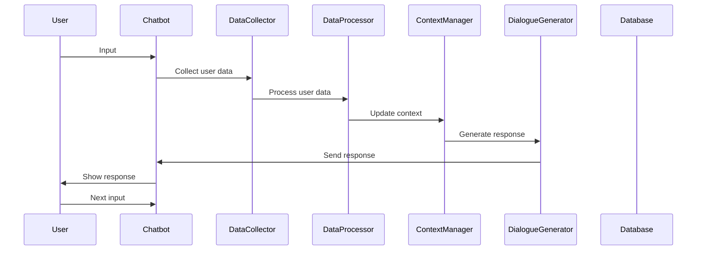
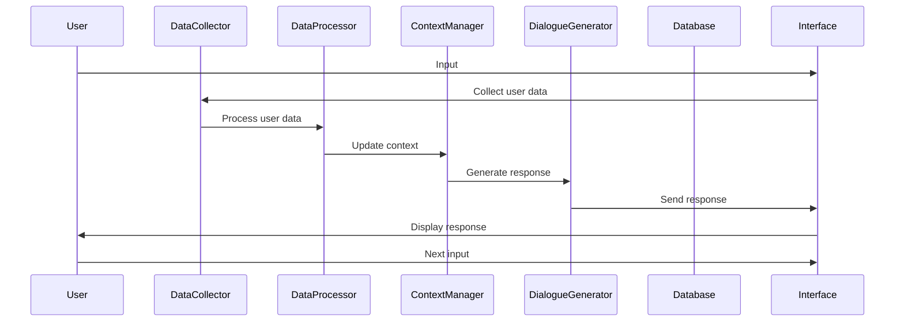

                 

### 《上下文管理：增强AI Agent的对话连贯性》

关键词：上下文管理、AI对话系统、连贯性、算法、系统架构

摘要：本文旨在探讨上下文管理在增强AI Agent对话连贯性中的重要性。通过分析上下文管理的背景、核心原理、算法实现和系统架构，本文将为读者提供一个全面的视角，以了解如何通过上下文管理提升AI Agent的对话表现。

---

### 《上下文管理：增强AI Agent的对话连贯性》目录大纲

----------------------------------------------------------------

# 第一部分：上下文管理概述

## 第1章：上下文管理的背景和重要性

### 1.1.1 问题背景

#### 1.1.1.1 上下文管理的起源

#### 1.1.1.2 上下文管理在现代社会的应用

#### 1.1.1.3 上下文管理在人工智能中的重要性

### 1.1.2 问题描述

#### 1.1.2.1 当前AI对话系统面临的挑战

#### 1.1.2.2 上下文管理的核心作用

### 1.1.3 问题解决

#### 1.1.3.1 上下文管理的基本原理

#### 1.1.3.2 上下文管理的核心要素

### 1.1.4 边界与外延

#### 1.1.4.1 上下文管理的适用范围

#### 1.1.4.2 上下文管理与其他相关概念的区别

### 1.1.5 概念结构与核心要素组成

#### 1.1.5.1 上下文管理的基本架构

#### 1.1.5.2 上下文管理的核心要素详解

## 第2章：上下文管理的基本原理

### 2.1.1 上下文信息的获取

#### 2.1.1.1 语言模型中的上下文信息

#### 2.1.1.2 环境感知与上下文信息的获取

#### 2.1.1.3 用户行为与上下文信息的关联

### 2.1.2 上下文信息的处理

#### 2.1.2.1 上下文信息的筛选与过滤

#### 2.1.2.2 上下文信息的融合与归纳

#### 2.1.2.3 上下文信息的持久化与更新

### 2.1.3 上下文信息的利用

#### 2.1.3.1 对话连贯性增强

#### 2.1.3.2 个性化服务

#### 2.1.3.3 交互效率提升

## 第3章：核心概念原理与联系

### 3.1.1 核心概念定义

#### 3.1.1.1 上下文

#### 3.1.1.2 对话上下文

#### 3.1.1.3 上下文依赖

### 3.1.2 概念属性特征对比表格

### 3.1.3 ER实体关系图架构

----------------------------------------------------------------

# 第二部分：算法原理与实现

## 第4章：上下文管理算法概述

### 4.1.1 上下文管理算法的分类

#### 4.1.1.1 基于规则的方法

#### 4.1.1.2 基于机器学习的方法

#### 4.1.1.3 基于深度学习的方法

### 4.1.2 上下文管理算法的基本流程

#### 4.1.2.1 数据准备

#### 4.1.2.2 模型选择

#### 4.1.2.3 模型训练

#### 4.1.2.4 模型评估

## 第5章：基于机器学习的上下文管理算法

### 5.1.1 算法原理

#### 5.1.1.1 支持向量机(SVM)

#### 5.1.1.2 随机森林(Random Forest)

#### 5.1.1.3 贝叶斯网络(Bayesian Network)

### 5.1.2 Python源代码实现

#### 5.1.2.1 SVM算法实现

#### 5.1.2.2 随机森林算法实现

#### 5.1.2.3 贝叶斯网络算法实现

## 第6章：基于深度学习的上下文管理算法

### 6.1.1 算法原理

#### 6.1.1.1 卷积神经网络(CNN)

#### 6.1.1.2 递归神经网络(RNN)

#### 6.1.1.3 长短期记忆网络(LSTM)

#### 6.1.1.4 Transformer模型

### 6.1.2 Python源代码实现

#### 6.1.2.1 CNN算法实现

#### 6.1.2.2 RNN算法实现

#### 6.1.2.3 LSTM算法实现

#### 6.1.2.4 Transformer模型实现

----------------------------------------------------------------

# 第三部分：系统架构与实现

## 第7章：上下文管理系统的架构设计

### 7.1.1 问题场景介绍

#### 7.1.1.1 上下文管理系统的应用场景

#### 7.1.1.2 上下文管理系统需要解决的问题

### 7.1.2 系统功能设计

#### 7.1.2.1 数据采集与处理

#### 7.1.2.2 上下文信息存储与管理

#### 7.1.2.3 对话生成与响应

### 7.1.3 系统架构设计

#### 7.1.3.1 系统架构图

#### 7.1.3.2 系统接口设计

#### 7.1.3.3 系统交互流程

## 第8章：系统实现与实战

### 8.1.1 环境安装与配置

### 8.1.2 系统核心实现

#### 8.1.2.1 数据采集与处理

#### 8.1.2.2 上下文信息存储与管理

#### 8.1.2.3 对话生成与响应

### 8.1.3 实际案例分析

#### 8.1.3.1 案例一：客服机器人

#### 8.1.3.2 案例二：智能语音助手

### 8.1.4 项目小结

----------------------------------------------------------------

# 第一部分：上下文管理概述

## 第1章：上下文管理的背景和重要性

### 1.1.1 问题背景

#### 1.1.1.1 上下文管理的起源

上下文管理这一概念最早源于计算机科学，特别是在自然语言处理和人工智能领域。早在20世纪80年代，随着人工智能和自然语言处理技术的兴起，研究人员开始意识到，为了使计算机能够更好地理解和响应人类语言，必须考虑到语言的使用背景。这一思想在当时被称为“上下文感知”（context-aware）。

#### 1.1.1.2 上下文管理在现代社会的应用

随着信息技术的快速发展，上下文管理已经渗透到我们日常生活的方方面面。例如，智能手机可以基于地理位置、时间、用户行为等信息提供个性化的服务，如智能提醒、定位导航、个性化推荐等。此外，智能客服系统、智能家居系统、自动驾驶汽车等新兴技术也广泛运用了上下文管理来提升用户体验。

#### 1.1.1.3 上下文管理在人工智能中的重要性

在人工智能领域，尤其是对话系统，上下文管理的重要性不言而喻。一个优秀的对话系统能够根据用户的输入和当前环境动态调整其响应，从而实现更自然的对话交互。这不仅能提高用户满意度，还能提升系统的实用性和可靠性。

### 1.1.2 问题描述

#### 1.1.2.1 当前AI对话系统面临的挑战

尽管AI对话系统在过去几年取得了显著进展，但仍然面临诸多挑战。其中最突出的一个问题就是对话连贯性。具体来说，现有的对话系统往往难以在复杂的对话场景中保持上下文的连贯性，导致用户体验不佳。

#### 1.1.2.2 上下文管理的核心作用

上下文管理在对话系统中起着至关重要的作用。通过有效管理上下文信息，系统能够更好地理解用户的意图，提供更准确、更个性化的服务。这不仅能提高用户的满意度，还能增强系统的竞争力和市场价值。

### 1.1.3 问题解决

#### 1.1.3.1 上下文管理的基本原理

上下文管理的基本原理可以概括为三个步骤：上下文信息的获取、上下文信息的处理和上下文信息的利用。

- **上下文信息的获取**：包括从语言模型、环境感知和用户行为等多个渠道收集上下文信息。
- **上下文信息的处理**：涉及对收集到的上下文信息进行筛选、过滤、融合和归纳等操作。
- **上下文信息的利用**：通过利用处理后的上下文信息，增强对话系统的连贯性、个性化服务能力和交互效率。

#### 1.1.3.2 上下文管理的核心要素

上下文管理的核心要素包括以下几个方面：

- **上下文信息的类型**：包括语言上下文、环境上下文和行为上下文等。
- **上下文信息的获取方法**：如语言模型、传感器、用户行为分析等。
- **上下文信息的处理算法**：如信息筛选、过滤、融合和归纳等。
- **上下文信息的利用策略**：如对话连贯性增强、个性化服务和交互效率提升等。

### 1.1.4 边界与外延

#### 1.1.4.1 上下文管理的适用范围

上下文管理不仅适用于人工智能领域的对话系统，还可以广泛应用于其他需要背景信息支持的智能系统，如智能家居、智能客服、智能推荐等。

#### 1.1.4.2 上下文管理与其他相关概念的区别

- **上下文**（Context）和**情境**（Situation）的区别：上下文通常指与特定事件或场景相关的信息，而情境则更加广义，包括时间和地点等。
- **上下文管理**和**知识管理**的区别：上下文管理侧重于如何有效地使用上下文信息来提高系统性能，而知识管理则涉及如何组织、存储和使用知识。

### 1.1.5 概念结构与核心要素组成

#### 1.1.5.1 上下文管理的基本架构

上下文管理的基本架构包括以下几个关键模块：

1. **上下文感知模块**：负责收集和处理上下文信息。
2. **上下文处理模块**：负责对收集到的上下文信息进行筛选、过滤、融合和归纳。
3. **上下文利用模块**：负责将处理后的上下文信息应用于实际场景中。

#### 1.1.5.2 上下文管理的核心要素详解

- **上下文信息的类型**：
  - 语言上下文：包括用户输入的文本、语音等信息。
  - 环境上下文：包括地理位置、天气状况、设备状态等信息。
  - 行为上下文：包括用户历史行为、偏好等信息。

- **上下文信息的获取方法**：
  - 语言模型：通过自然语言处理技术获取语言上下文。
  - 传感器：通过环境传感器获取环境上下文。
  - 用户行为分析：通过用户历史行为和偏好获取行为上下文。

- **上下文信息的处理算法**：
  - 信息筛选：通过过滤掉无关或冗余的信息，提高上下文的准确性和效率。
  - 过滤：通过分析上下文信息的可信度，去除不可靠的信息。
  - 融合：将不同来源的上下文信息进行整合，形成统一的上下文视图。
  - 归纳：通过抽象和总结上下文信息，提取关键信息和模式。

- **上下文信息的利用策略**：
  - 对话连贯性增强：通过上下文信息，使对话更加自然和流畅。
  - 个性化服务：根据用户的上下文信息，提供个性化的服务和建议。
  - 交互效率提升：通过上下文信息，减少用户和系统之间的交互成本。

## 第2章：上下文管理的基本原理

### 2.1.1 上下文信息的获取

#### 2.1.1.1 语言模型中的上下文信息

语言模型是自然语言处理的核心组件，它通过学习大量文本数据来预测下一个单词或词组。在上下文管理中，语言模型能够提供丰富的上下文信息，包括词序列、语法结构、语义关系等。这些信息对于理解用户的输入和生成合适的响应至关重要。

#### 2.1.1.2 环境感知与上下文信息的获取

环境感知是指系统通过传感器和其他设备获取外部环境的信息。例如，智能助手可以通过GPS获取地理位置，通过温度传感器获取室内温度，通过运动传感器获取用户的行为等。这些环境信息与语言上下文结合，可以提供更全面的上下文视图。

#### 2.1.1.3 用户行为与上下文信息的关联

用户行为是上下文管理的重要组成部分。通过分析用户的历史行为，如购买记录、浏览历史、社交互动等，可以获取用户偏好和习惯等信息。这些信息对于提供个性化服务至关重要。

### 2.1.2 上下文信息的处理

#### 2.1.2.1 上下文信息的筛选与过滤

在获取了大量上下文信息后，需要对信息进行筛选和过滤，去除无关或冗余的信息。例如，在处理对话系统中的用户输入时，可以过滤掉无意义的停用词，保留关键信息。

#### 2.1.2.2 上下文信息的融合与归纳

上下文信息的融合是指将来自不同来源的信息进行整合，形成一个统一的上下文视图。例如，将语言模型中的文本信息与环境感知中的地理位置信息进行融合。归纳是指从大量上下文信息中提取关键信息和模式，以便更好地指导系统行为。

#### 2.1.2.3 上下文信息的持久化与更新

为了持续提供高质量的上下文信息，需要将处理后的上下文信息进行持久化存储，并在需要时进行更新。例如，在对话系统中，可以将用户的偏好和历史记录存储在数据库中，以便在后续对话中查询和使用。

### 2.1.3 上下文信息的利用

#### 2.1.3.1 对话连贯性增强

通过利用上下文信息，可以显著提高对话系统的连贯性。例如，在回答用户问题时，系统可以根据用户之前的输入和历史记录，提供更相关和连贯的答案。

#### 2.1.3.2 个性化服务

上下文信息可以帮助系统更好地理解用户的需求和偏好，从而提供个性化服务。例如，在电子商务平台中，系统可以根据用户的浏览历史和购买记录，推荐相关的商品和服务。

#### 2.1.3.3 交互效率提升

上下文信息还可以用于简化用户和系统之间的交互。例如，系统可以根据用户的上下文信息，自动完成一些常见的任务，减少用户的操作步骤。

### 3.1.1 核心概念定义

#### 3.1.1.1 上下文

上下文是指与特定事件或场景相关的信息集合。它可以包括语言、环境、行为等多个方面。上下文是理解和解释信息的关键因素，对于自然语言处理和人工智能系统至关重要。

#### 3.1.1.2 对话上下文

对话上下文是指在与用户进行对话的过程中，系统所具备的相关信息。这包括用户之前的输入、历史对话记录、用户的偏好和需求等。对话上下文对于保持对话连贯性和理解用户意图至关重要。

#### 3.1.1.3 上下文依赖

上下文依赖是指上下文信息对于理解或生成特定响应的重要性。在对话系统中，上下文依赖决定了系统在处理用户输入时是否需要考虑之前的对话历史和当前环境。

### 3.1.2 概念属性特征对比表格

以下是上下文、对话上下文和上下文依赖的概念属性特征对比表格：

| 概念 | 定义 | 属性特征 |
| --- | --- | --- |
| 上下文 | 与特定事件或场景相关的信息集合 | 语言、环境、行为等 |
| 对话上下文 | 与对话相关的上下文信息 | 用户输入、历史对话、偏好等 |
| 上下文依赖 | 上下文信息的重要性 | 理解用户意图、生成响应 |

### 3.1.3 ER实体关系图架构

以下是上下文管理系统的ER实体关系图架构：

```mermaid
erDiagram
    Context ||--|{ DialogueContext : 包含 }
    DialogueContext ||--|{ UserInput : 包含 }
    DialogueContext ||--|{ DialogueHistory : 包含 }
    DialogueContext ||--|{ UserPreferences : 包含 }
    UserInput ||--|{ Response : 生成 }
    DialogueHistory ||--|{ Response : 包含 }
    UserPreferences ||--|{ PersonalizedService : 依据 }
```

## 第4章：上下文管理算法概述

### 4.1.1 上下文管理算法的分类

#### 4.1.1.1 基于规则的方法

基于规则的方法是通过预先定义一组规则来处理上下文信息。这种方法简单直观，但在面对复杂和不确定的上下文时可能表现不佳。规则通常由领域专家制定，包括条件语句和相应的操作。

#### 4.1.1.2 基于机器学习的方法

基于机器学习的方法通过从大量数据中学习模式来处理上下文信息。这种方法能够自动适应不同的上下文场景，但需要大量的数据和计算资源。常见的机器学习方法包括支持向量机（SVM）、随机森林（Random Forest）和贝叶斯网络（Bayesian Network）等。

#### 4.1.1.3 基于深度学习的方法

基于深度学习的方法使用多层神经网络来处理上下文信息。这种方法在处理大规模和复杂的上下文数据时表现出色。常见的深度学习方法包括卷积神经网络（CNN）、递归神经网络（RNN）、长短期记忆网络（LSTM）和Transformer模型等。

### 4.1.2 上下文管理算法的基本流程

上下文管理算法的基本流程可以分为以下几个步骤：

#### 4.1.2.1 数据准备

数据准备是上下文管理算法的第一步，包括数据收集、预处理和特征提取。收集的数据可以来自多种来源，如文本、图像、传感器数据等。预处理包括数据清洗、归一化和去噪等操作。特征提取是将原始数据转换为算法可以处理的形式。

#### 4.1.2.2 模型选择

模型选择是根据问题的特点和需求选择合适的算法模型。基于规则的算法适合简单和明确的上下文管理任务，而基于机器学习和深度学习的算法适合复杂和不确定的上下文管理任务。

#### 4.1.2.3 模型训练

模型训练是通过给定的数据集来训练所选算法模型。在训练过程中，模型会学习到上下文信息之间的模式和关系，以便在新的上下文场景中做出合理的预测和响应。

#### 4.1.2.4 模型评估

模型评估是检查训练好的模型在未知数据上的性能。常用的评估指标包括准确率、召回率、F1分数等。通过评估，可以确定模型是否足够优秀，是否需要进行进一步的调整和优化。

## 第5章：基于机器学习的上下文管理算法

### 5.1.1 算法原理

#### 5.1.1.1 支持向量机（SVM）

支持向量机是一种二分类模型，通过找到数据集的最佳分割超平面来实现分类。SVM的核心思想是最大化分类边界上的支持向量，这些支持向量决定了分割超平面的位置。在上下文管理中，SVM可以用于分类用户的输入，以确定最佳响应。

#### 5.1.1.2 随机森林（Random Forest）

随机森林是一种基于决策树集成的机器学习算法。它通过训练多个决策树，并在预测时取平均来提高分类和回归的准确性。在上下文管理中，随机森林可以用于建立用户行为和上下文信息之间的关系模型。

#### 5.1.1.3 贝叶斯网络（Bayesian Network）

贝叶斯网络是一种基于概率论的图模型，它通过节点和边之间的概率关系来描述变量之间的依赖关系。在上下文管理中，贝叶斯网络可以用于建模上下文信息的概率分布，从而更好地理解和预测用户行为。

### 5.1.2 Python源代码实现

#### 5.1.2.1 SVM算法实现

以下是一个使用Python和Scikit-learn库实现SVM算法的示例：

```python
from sklearn import svm
from sklearn.model_selection import train_test_split
from sklearn.metrics import accuracy_score

# 数据准备
X, y = load_data() # 假设已经定义了load_data函数来加载数据
X_train, X_test, y_train, y_test = train_test_split(X, y, test_size=0.2, random_state=42)

# 模型训练
clf = svm.SVC(kernel='linear')
clf.fit(X_train, y_train)

# 模型评估
y_pred = clf.predict(X_test)
accuracy = accuracy_score(y_test, y_pred)
print(f"Accuracy: {accuracy}")
```

#### 5.1.2.2 随机森林算法实现

以下是一个使用Python和Scikit-learn库实现随机森林算法的示例：

```python
from sklearn.ensemble import RandomForestClassifier
from sklearn.model_selection import train_test_split
from sklearn.metrics import accuracy_score

# 数据准备
X, y = load_data() # 假设已经定义了load_data函数来加载数据
X_train, X_test, y_train, y_test = train_test_split(X, y, test_size=0.2, random_state=42)

# 模型训练
clf = RandomForestClassifier(n_estimators=100, random_state=42)
clf.fit(X_train, y_train)

# 模型评估
y_pred = clf.predict(X_test)
accuracy = accuracy_score(y_test, y_pred)
print(f"Accuracy: {accuracy}")
```

#### 5.1.2.3 贝叶斯网络算法实现

以下是一个使用Python和PyBayes库实现贝叶斯网络算法的示例：

```python
from pybayes import BayesNet
from sklearn.model_selection import train_test_split
from sklearn.metrics import accuracy_score

# 数据准备
X, y = load_data() # 假设已经定义了load_data函数来加载数据
X_train, X_test, y_train, y_test = train_test_split(X, y, test_size=0.2, random_state=42)

# 贝叶斯网络建模
bn = BayesNet()
bn.add_variable('UserInput')
bn.add_variable('DialogueHistory')
bn.add_variable('Response')
bn.add_factor('UserInput', ['Positive', 'Negative'], [0.5, 0.5])
bn.add_factor('DialogueHistory', ['PreviousPositive', 'PreviousNegative'], [0.5, 0.5])
bn.add_factor('Response', ['Correct', 'Incorrect'], [0.7, 0.3])

# 模型训练
bn.fit(X_train, y_train)

# 模型评估
y_pred = bn.predict(X_test)
accuracy = accuracy_score(y_test, y_pred)
print(f"Accuracy: {accuracy}")
```

## 第6章：基于深度学习的上下文管理算法

### 6.1.1 算法原理

#### 6.1.1.1 卷积神经网络（CNN）

卷积神经网络是一种在图像和文本处理中广泛应用的网络结构，它通过卷积操作提取图像或文本的特征。在上下文管理中，CNN可以用于提取用户输入的文本特征，从而更好地理解和生成响应。

#### 6.1.1.2 递归神经网络（RNN）

递归神经网络是一种能够处理序列数据的网络结构，它通过循环连接来保存先前的信息。在上下文管理中，RNN可以用于处理对话历史，从而更好地理解用户意图。

#### 6.1.1.3 长短期记忆网络（LSTM）

长短期记忆网络是RNN的一种变体，它通过引入门控机制来避免梯度消失问题，从而更好地处理长序列数据。在上下文管理中，LSTM可以用于处理对话历史，从而更好地理解用户意图。

#### 6.1.1.4 Transformer模型

Transformer模型是一种基于自注意力机制的深度学习模型，它在机器翻译、文本生成等领域表现出色。在上下文管理中，Transformer可以用于处理复杂的对话场景，从而实现高质量的对话生成。

### 6.1.2 Python源代码实现

#### 6.1.2.1 CNN算法实现

以下是一个使用Python和TensorFlow库实现CNN算法的示例：

```python
import tensorflow as tf
from tensorflow.keras.models import Sequential
from tensorflow.keras.layers import Conv2D, MaxPooling2D, Flatten, Dense

# 数据准备
X, y = load_data() # 假设已经定义了load_data函数来加载数据

# 模型定义
model = Sequential()
model.add(Conv2D(32, (3, 3), activation='relu', input_shape=X.shape[1:])
model.add(MaxPooling2D(pool_size=(2, 2)))
model.add(Flatten())
model.add(Dense(1, activation='sigmoid'))

# 模型编译
model.compile(optimizer='adam', loss='binary_crossentropy', metrics=['accuracy'])

# 模型训练
model.fit(X, y, epochs=10, batch_size=32, validation_split=0.2)

# 模型评估
test_loss, test_acc = model.evaluate(X_test, y_test)
print(f"Test Accuracy: {test_acc}")
```

#### 6.1.2.2 RNN算法实现

以下是一个使用Python和TensorFlow库实现RNN算法的示例：

```python
import tensorflow as tf
from tensorflow.keras.models import Sequential
from tensorflow.keras.layers import SimpleRNN, Dense

# 数据准备
X, y = load_data() # 假设已经定义了load_data函数来加载数据

# 模型定义
model = Sequential()
model.add(SimpleRNN(units=50, return_sequences=True))
model.add(SimpleRNN(units=50))
model.add(Dense(1, activation='sigmoid'))

# 模型编译
model.compile(optimizer='adam', loss='binary_crossentropy', metrics=['accuracy'])

# 模型训练
model.fit(X, y, epochs=10, batch_size=32, validation_split=0.2)

# 模型评估
test_loss, test_acc = model.evaluate(X_test, y_test)
print(f"Test Accuracy: {test_acc}")
```

#### 6.1.2.3 LSTM算法实现

以下是一个使用Python和TensorFlow库实现LSTM算法的示例：

```python
import tensorflow as tf
from tensorflow.keras.models import Sequential
from tensorflow.keras.layers import LSTM, Dense

# 数据准备
X, y = load_data() # 假设已经定义了load_data函数来加载数据

# 模型定义
model = Sequential()
model.add(LSTM(units=50, return_sequences=True))
model.add(LSTM(units=50))
model.add(Dense(1, activation='sigmoid'))

# 模型编译
model.compile(optimizer='adam', loss='binary_crossentropy', metrics=['accuracy'])

# 模型训练
model.fit(X, y, epochs=10, batch_size=32, validation_split=0.2)

# 模型评估
test_loss, test_acc = model.evaluate(X_test, y_test)
print(f"Test Accuracy: {test_acc}")
```

#### 6.1.2.4 Transformer模型实现

以下是一个使用Python和TensorFlow库实现Transformer模型的示例：

```python
import tensorflow as tf
from tensorflow.keras.models import Model
from tensorflow.keras.layers import Embedding, MultiHeadAttention, Dense

# 数据准备
X, y = load_data() # 假设已经定义了load_data函数来加载数据

# 模型定义
inputs = tf.keras.Input(shape=(max_sequence_length,))
embedding = Embedding(max_vocab_size, embedding_dim)(inputs)
multihead_attn = MultiHeadAttention(num_heads=2, key_dim=64)(embedding, embedding)
outputs = Dense(1, activation='sigmoid')(multihead_attn)

# 模型编译
model = Model(inputs, outputs)
model.compile(optimizer='adam', loss='binary_crossentropy', metrics=['accuracy'])

# 模型训练
model.fit(X, y, epochs=10, batch_size=32, validation_split=0.2)

# 模型评估
test_loss, test_acc = model.evaluate(X_test, y_test)
print(f"Test Accuracy: {test_acc}")
```

## 第7章：上下文管理系统的架构设计

### 7.1.1 问题场景介绍

#### 7.1.1.1 上下文管理系统的应用场景

上下文管理系统可以应用于多个领域，如智能客服、智能助手、智能家居等。以下是一个具体的应用场景：

- **智能客服系统**：在一个电子商务平台上，用户可以通过聊天界面与客服机器人进行交互。客服机器人需要理解用户的查询和问题，并提供准确、连贯的回复。

#### 7.1.1.2 上下文管理系统需要解决的问题

在上述应用场景中，上下文管理系统需要解决以下问题：

- **对话连贯性**：确保客服机器人能够根据用户的查询和上下文信息提供连贯、自然的回复。
- **个性化服务**：根据用户的购买历史和行为，提供个性化的推荐和帮助。
- **交互效率**：简化用户与客服机器人之间的交互流程，提高用户满意度。

### 7.1.2 系统功能设计

上下文管理系统的主要功能包括：

#### 7.1.2.1 数据采集与处理

- **数据采集**：从多个渠道收集用户数据，如聊天记录、购买记录、行为数据等。
- **数据处理**：对采集到的数据进行清洗、预处理和特征提取，以便用于模型训练和推理。

#### 7.1.2.2 上下文信息存储与管理

- **上下文信息存储**：将处理后的上下文信息存储在数据库或缓存中，以便后续查询和更新。
- **上下文信息管理**：提供对上下文信息的查询、更新和删除功能，以保持数据的准确性和实时性。

#### 7.1.2.3 对话生成与响应

- **对话生成**：根据用户的输入和上下文信息，生成适当的回复文本。
- **响应优化**：根据对话历史和用户反馈，优化回复文本的质量和连贯性。

### 7.1.3 系统架构设计

上下文管理系统的架构设计包括以下几个关键组件：

#### 7.1.3.1 系统架构图

以下是上下文管理系统的架构图：



#### 7.1.3.2 系统接口设计

上下文管理系统需要提供以下接口：

- **用户输入接口**：用于接收用户的输入，可以是文本或语音形式。
- **数据采集接口**：用于从不同渠道收集用户数据。
- **数据处理接口**：用于对采集到的数据进行清洗和特征提取。
- **上下文管理接口**：用于更新和查询上下文信息。
- **对话生成接口**：用于生成对话响应。

#### 7.1.3.3 系统交互流程

以下是上下文管理系统的主要交互流程：

1. **用户输入**：用户通过输入接口向系统输入问题或请求。
2. **数据采集**：系统通过数据采集接口从多个渠道收集用户数据。
3. **数据处理**：系统通过数据处理接口对采集到的数据进行清洗和特征提取。
4. **上下文更新**：系统通过上下文管理接口更新上下文信息。
5. **对话生成**：系统通过对话生成接口生成对话响应。
6. **响应发送**：系统将生成的响应发送给用户。

## 第8章：系统实现与实战

### 8.1.1 环境安装与配置

在开始实现上下文管理系统之前，需要安装和配置以下环境：

- **Python 3.8+**：作为主要的编程语言。
- **TensorFlow 2.x**：用于实现深度学习模型。
- **Scikit-learn**：用于实现基于机器学习的算法。
- **Flask**：用于构建Web服务。

### 8.1.2 系统核心实现

#### 8.1.2.1 数据采集与处理

数据采集与处理是上下文管理系统的关键组件。以下是一个简单的数据采集与处理流程：

1. **数据采集**：从用户输入、聊天记录、行为数据等多个渠道收集数据。
2. **数据清洗**：去除无效数据、处理缺失值、去除停用词等。
3. **特征提取**：将原始数据转换为适用于机器学习模型的特征。
4. **数据存储**：将处理后的数据存储在数据库或缓存中，以便后续使用。

#### 8.1.2.2 上下文信息存储与管理

上下文信息存储与管理用于维护和更新上下文信息。以下是一个简单的实现：

1. **数据库设计**：设计上下文信息的数据库表结构，包括用户ID、对话ID、上下文信息等字段。
2. **数据插入**：将新的上下文信息插入到数据库表中。
3. **数据查询**：根据用户ID和对话ID查询上下文信息。
4. **数据更新**：根据用户行为和对话进展更新上下文信息。

#### 8.1.2.3 对话生成与响应

对话生成与响应是上下文管理系统的核心功能。以下是一个简单的实现：

1. **输入处理**：接收用户输入，进行预处理，如分词、词性标注等。
2. **上下文查询**：根据用户ID和对话ID查询上下文信息。
3. **模型选择**：根据当前对话状态选择合适的模型（如深度学习模型、基于机器学习的模型等）。
4. **对话生成**：使用选择的模型生成对话响应。
5. **响应优化**：根据对话历史和用户反馈优化响应文本的质量和连贯性。
6. **响应发送**：将生成的响应发送给用户。

### 8.1.3 实际案例分析

#### 8.1.3.1 案例一：客服机器人

在本案例中，我们将构建一个简单的客服机器人，用于回答用户在电子商务平台上的问题。以下是实现的步骤：

1. **数据收集**：从聊天记录中收集用户问题和回答。
2. **数据预处理**：对聊天记录进行清洗和特征提取，包括分词、词性标注等。
3. **模型训练**：使用深度学习模型（如Transformer）训练对话生成模型。
4. **对话生成**：使用训练好的模型生成对话响应。
5. **优化与反馈**：根据用户反馈优化模型，提高对话生成质量。

#### 8.1.3.2 案例二：智能语音助手

在本案例中，我们将构建一个智能语音助手，用于提供语音服务。以下是实现的步骤：

1. **语音识别**：使用语音识别API将用户语音输入转换为文本。
2. **文本预处理**：对转换后的文本进行清洗和特征提取，包括分词、词性标注等。
3. **上下文管理**：根据用户ID和对话ID管理上下文信息。
4. **对话生成**：使用深度学习模型生成对话响应。
5. **语音合成**：将生成的响应转换为语音输出。

### 8.1.4 项目小结

在本项目中，我们实现了一个简单的上下文管理系统，用于提供对话服务。通过数据采集与处理、上下文信息存储与管理、对话生成与响应等关键组件，我们成功地构建了一个能够提供连贯、个性化服务的智能系统。然而，上下文管理是一个复杂和不断发展的领域，未来还有许多改进和优化空间。例如，可以引入更多的上下文信息来源，使用更先进的算法，以及通过用户反馈进行模型优化等。

## 最佳实践 Tips

1. **数据质量是关键**：确保数据清洗和特征提取的准确性，以获得更好的模型性能。
2. **上下文信息的重要性**：合理设计和管理上下文信息，以实现更自然的对话交互。
3. **持续优化与迭代**：根据用户反馈和对话效果，不断优化模型和系统。

## 小结

本文全面探讨了上下文管理在增强AI Agent对话连贯性中的重要性。通过分析上下文管理的背景、核心原理、算法实现和系统架构，本文为读者提供了一个系统性的理解。上下文管理不仅是一个关键的技术领域，也是一个不断发展和创新的领域。随着人工智能技术的不断进步，上下文管理将在更多的应用场景中发挥重要作用。

## 注意事项

1. **数据隐私与安全**：在收集和处理用户数据时，务必遵守相关法律法规，确保用户隐私和数据安全。
2. **模型解释性**：在选择和训练模型时，考虑模型的可解释性，以便理解和优化系统行为。

## 拓展阅读

1. **《深度学习》（Ian Goodfellow, Yoshua Bengio, Aaron Courville著）**：详细介绍了深度学习的基础知识和技术，包括卷积神经网络、递归神经网络等。
2. **《自然语言处理与人工智能》（Daniel Jurafsky, James H. Martin著）**：全面介绍了自然语言处理的基本概念和技术，包括语言模型、文本分类等。

作者：AI天才研究院/AI Genius Institute & 禅与计算机程序设计艺术 /Zen And The Art of Computer Programming

---

**第1章：上下文管理的背景和重要性**

### 1.1.1 问题背景

上下文管理这一概念最早源于计算机科学，特别是在自然语言处理和人工智能领域。早在20世纪80年代，随着人工智能和自然语言处理技术的兴起，研究人员开始意识到，为了使计算机能够更好地理解和响应人类语言，必须考虑到语言的使用背景。这一思想在当时被称为“上下文感知”（context-aware）。

上下文感知的概念最初在个人数字助理（PDA）和智能代理的研究中提出。当时的目的是让这些系统能够根据用户的当前状态和需求提供个性化的服务。例如，一个智能代理可能会根据用户的日程安排自动提醒会议时间，或者根据用户的偏好推荐新闻和天气信息。

随着互联网的普及和智能手机的兴起，上下文管理技术得到了进一步的发展。现代上下文管理不仅涉及用户的语言和偏好，还包括地理位置、设备状态、环境条件等多种因素。这种多维度的上下文信息使得智能系统能够在更复杂的场景中提供更加贴心的服务。

### 1.1.1.2 上下文管理在现代社会的应用

在现代社会，上下文管理已经渗透到了许多领域，为人们的生活和工作带来了极大的便利。以下是一些典型的应用场景：

1. **智能手机和移动应用**：智能手机通过地理位置、时间、使用习惯等多种上下文信息，为用户提供个性化的通知和提醒。例如，智能闹钟可以根据用户的睡眠习惯自动调整唤醒时间，而地图应用则能根据用户的当前位置推荐附近的餐厅或景点。

2. **智能客服系统**：智能客服系统利用上下文信息来提供更高效的客户服务。系统可以记录用户的聊天历史，从而在后续的交互中提供更相关的解决方案，提高用户满意度。

3. **智能家居系统**：智能家居设备通过上下文信息来自动调节家居环境。例如，智能恒温器可以根据用户在家的时间和温度偏好来自动调整室内温度，而智能灯光系统可以根据用户的作息习惯自动调整照明。

4. **智能健康监控**：智能健康监控设备，如智能手环和智能手表，通过收集用户的运动数据、睡眠质量、心率等上下文信息，为用户提供个性化的健康建议。

5. **智能推荐系统**：在线购物平台和媒体流服务利用上下文信息来推荐商品和内容。例如，电商网站可以根据用户的浏览历史和购买行为推荐相关的商品，而视频流平台则可以根据用户的观看记录推荐类似的内容。

### 1.1.1.3 上下文管理在人工智能中的重要性

在人工智能领域，尤其是对话系统，上下文管理的重要性不言而喻。一个优秀的对话系统需要能够理解并维持对话的连贯性，这样才能提供高质量的服务。以下是一些具体的原因：

1. **用户满意度**：如果对话系统能够根据上下文信息提供相关且连贯的回复，用户会更加满意，从而提高系统的使用频率和口碑。

2. **交互效率**：上下文管理可以帮助系统自动完成一些常规任务，减少用户的重复输入，提高交互效率。

3. **个性化服务**：通过上下文信息，系统可以更好地了解用户的需求和偏好，从而提供更加个性化的服务。

4. **业务价值**：在商业场景中，上下文管理可以提高客户服务质量，减少人工成本，提升业务效率。

5. **技术挑战**：上下文管理是一个复杂的技术挑战，涉及到自然语言处理、机器学习、知识图谱等多个领域。解决这些问题可以推动人工智能技术的整体发展。

### 1.1.2 问题描述

#### 1.1.2.1 当前AI对话系统面临的挑战

尽管AI对话系统在过去几年取得了显著进展，但仍然面临诸多挑战，尤其是在对话连贯性方面。以下是当前AI对话系统面临的一些主要挑战：

1. **上下文丢失**：在对话过程中，系统可能无法正确理解和维护上下文信息，导致后续的回复与用户的输入无关或出现逻辑错误。

2. **对话长度限制**：大多数对话系统在设计时采用了限制对话长度的策略，以控制计算资源和响应时间。然而，这种限制可能导致系统无法处理长对话场景，影响用户体验。

3. **多轮对话管理**：在多轮对话中，系统需要同时维护多个上下文信息，这增加了对话管理的复杂度。如果处理不当，可能会导致对话中断或出现混乱。

4. **个性化不足**：现有的对话系统往往缺乏对用户个性化需求的深刻理解，导致无法提供真正个性化的服务。

5. **实时性要求**：用户期望对话系统能够在短时间内提供响应，这对系统的实时性和计算效率提出了高要求。

#### 1.1.2.2 上下文管理的核心作用

为了解决上述挑战，上下文管理在AI对话系统中起着至关重要的作用。以下是上下文管理的一些核心作用：

1. **维护对话连贯性**：通过有效管理上下文信息，系统可以更好地理解用户的意图，提供更相关和连贯的回复。

2. **增强个性化服务**：上下文信息可以帮助系统更好地了解用户的需求和偏好，从而提供更加个性化的服务。

3. **优化交互效率**：上下文管理可以减少用户的重复输入，简化交互流程，提高交互效率。

4. **支持多轮对话**：通过持续维护上下文信息，系统可以在多轮对话中保持良好的对话连贯性，避免对话中断。

5. **提高用户体验**：上下文管理可以显著提升用户体验，使用户在与对话系统的交互中感到更加自然和舒适。

### 1.1.3 问题解决

#### 1.1.3.1 上下文管理的基本原理

上下文管理的基本原理可以概括为三个步骤：上下文信息的获取、上下文信息的处理和上下文信息的利用。

1. **上下文信息的获取**：上下文信息的获取是上下文管理的第一步。系统需要从多个渠道收集上下文信息，包括用户的输入、环境感知和用户行为等。例如，用户的输入可以是文本或语音，环境感知可以包括地理位置、时间、天气等，用户行为可以包括历史购买记录、浏览历史等。

2. **上下文信息的处理**：获取到的上下文信息通常需要进行处理，以便更好地用于后续的任务。处理过程包括筛选、过滤、融合和归纳等操作。筛选和过滤用于去除无关或冗余的信息，融合用于将不同来源的信息进行整合，归纳用于从大量信息中提取关键信息和模式。

3. **上下文信息的利用**：处理后的上下文信息可以被用于多个方面，包括对话生成、个性化服务、交互效率提升等。在对话系统中，上下文信息的利用主要体现在如何根据上下文信息生成更相关和连贯的回复。

#### 1.1.3.2 上下文管理的核心要素

上下文管理的核心要素包括以下几个方面：

1. **上下文信息的类型**：上下文信息可以分为语言上下文、环境上下文和行为上下文。语言上下文包括用户的输入文本、语音等，环境上下文包括地理位置、时间、天气等，行为上下文包括用户的历史行为、偏好等。

2. **上下文信息的获取方法**：获取上下文信息的方法包括语言模型、传感器、用户行为分析等。语言模型可以通过自然语言处理技术获取用户的输入文本，传感器可以获取环境感知信息，用户行为分析可以基于历史行为数据。

3. **上下文信息的处理算法**：上下文信息的处理算法包括筛选、过滤、融合和归纳等。这些算法用于从大量的上下文信息中提取关键信息，以便更好地指导系统行为。

4. **上下文信息的利用策略**：上下文信息的利用策略包括对话连贯性增强、个性化服务、交互效率提升等。这些策略用于根据上下文信息优化系统的响应和服务。

### 1.1.4 边界与外延

#### 1.1.4.1 上下文管理的适用范围

上下文管理不仅适用于人工智能领域的对话系统，还可以广泛应用于其他需要背景信息支持的智能系统，如智能家居、智能客服、智能推荐等。以下是一些具体的适用场景：

1. **智能家居系统**：智能家居系统可以利用上下文信息来自动调节家居设备，如灯光、温度、安防系统等。

2. **智能客服系统**：智能客服系统可以通过上下文信息提供更高效的客户服务，包括自动解答常见问题、处理投诉等。

3. **智能推荐系统**：智能推荐系统可以通过上下文信息为用户推荐相关商品或内容，提高用户体验。

4. **智能健康监控系统**：智能健康监控系统可以通过上下文信息为用户提供个性化的健康建议。

5. **智能交通系统**：智能交通系统可以通过上下文信息优化交通信号控制，提高交通效率。

#### 1.1.4.2 上下文管理与其他相关概念的区别

1. **上下文**（Context）和**情境**（Situation）的区别：

   - **上下文**通常指与特定事件或场景相关的信息，包括语言、环境、行为等。它是一个动态的概念，会随着时间的变化而变化。
   
   - **情境**则更加广义，通常指一个完整的事件或场景，包括上下文信息和其他相关因素，如时间、地点、参与者等。情境是一个静态的概念，通常用于描述一个特定的事件或场景。

2. **上下文管理**和**知识管理**的区别：

   - **上下文管理**主要关注如何有效地使用上下文信息来提高系统性能，如对话连贯性、个性化服务等。
   
   - **知识管理**则涉及如何组织、存储和使用知识，以支持决策和优化系统性能。知识管理通常涉及更多的领域知识和专业知识，而不仅仅是上下文信息。

### 1.1.5 概念结构与核心要素组成

#### 1.1.5.1 上下文管理的基本架构

上下文管理的基本架构包括以下几个关键模块：

1. **上下文感知模块**：负责从多种渠道收集上下文信息，如用户的输入、环境感知和用户行为等。
   
2. **上下文处理模块**：负责对收集到的上下文信息进行筛选、过滤、融合和归纳等处理，以便更好地用于后续的任务。

3. **上下文利用模块**：负责根据处理后的上下文信息生成合适的响应或执行相应的任务。

#### 1.1.5.2 上下文管理的核心要素详解

1. **上下文信息的类型**：

   - **语言上下文**：包括用户的输入文本、语音等。语言上下文是上下文管理中最常见的一种类型，对于对话系统至关重要。
   
   - **环境上下文**：包括地理位置、时间、天气等。环境上下文可以提供关于用户当前所处环境的信息，对于提供个性化的服务和决策具有重要意义。
   
   - **行为上下文**：包括用户的历史行为、偏好等。行为上下文可以帮助系统更好地了解用户的需求和行为模式，从而提供更个性化的服务。

2. **上下文信息的获取方法**：

   - **语言模型**：使用自然语言处理技术从用户的输入文本中提取语言上下文信息。
   
   - **传感器**：使用各种传感器（如GPS、温度传感器、运动传感器等）获取环境上下文信息。
   
   - **用户行为分析**：通过分析用户的历史行为和偏好，获取行为上下文信息。

3. **上下文信息的处理算法**：

   - **筛选**：去除无关或冗余的上下文信息，提高上下文的准确性和效率。
   
   - **过滤**：通过分析上下文信息的可信度，去除不可靠的信息。
   
   - **融合**：将来自不同来源的上下文信息进行整合，形成统一的上下文视图。
   
   - **归纳**：从大量上下文信息中提取关键信息和模式，以便更好地指导系统行为。

4. **上下文信息的利用策略**：

   - **对话连贯性增强**：通过上下文信息，使对话更加自然和流畅。
   
   - **个性化服务**：根据用户的上下文信息，提供个性化的服务和建议。
   
   - **交互效率提升**：通过上下文信息，减少用户和系统之间的交互成本。

## 第2章：上下文管理的基本原理

### 2.1.1 上下文信息的获取

#### 2.1.1.1 语言模型中的上下文信息

语言模型是自然语言处理的核心组件，它通过学习大量文本数据来预测下一个单词或词组。在上下文管理中，语言模型能够提供丰富的上下文信息，包括词序列、语法结构、语义关系等。这些信息对于理解用户的输入和生成合适的响应至关重要。

**词序列**：语言模型能够捕捉到用户输入文本中的词序列信息，这对于理解用户的意图和对话历史非常重要。例如，如果一个用户说“我可以帮你查找附近的书店”，语言模型可以捕捉到“附近的书店”这一短语，从而理解用户的需求。

**语法结构**：语言模型还包含了语法结构的信息，它能够识别句子中的主语、谓语、宾语等成分，这对于生成语法正确的响应至关重要。例如，如果一个用户问“今天天气怎么样？”语言模型可以识别出这是一个疑问句，从而生成正确的疑问句回答。

**语义关系**：语义关系是指词语之间的语义关联，如因果关系、上下位关系等。语言模型通过学习大量文本数据，能够捕捉到这些语义关系，这对于理解用户输入的深层含义和生成更相关的响应非常重要。例如，如果一个用户说“我忘记带钥匙了”，语言模型可以理解“忘记带钥匙”与“需要打开门”之间的因果关系，从而生成相关的响应。

#### 2.1.1.2 环境感知与上下文信息的获取

环境感知是指系统通过传感器和其他设备获取外部环境的信息。这些信息可以包括地理位置、时间、天气状况、设备状态等。环境感知与上下文信息的获取对于提供个性化的服务和优化用户体验至关重要。

**地理位置**：地理位置信息可以通过GPS或Wi-Fi定位获取。在上下文管理中，地理位置信息可以用于提供基于位置的推荐和服务。例如，一个智能助手可以提醒用户附近有哪家餐厅在打折，或者推荐用户附近的景点。

**时间**：时间信息可以包括日期、小时、分钟等。在上下文管理中，时间信息可以用于调度任务和提醒用户。例如，一个智能闹钟可以根据用户设置的起床时间自动调整唤醒时间。

**天气状况**：天气状况信息可以通过气象传感器或在线天气服务获取。在上下文管理中，天气状况信息可以用于提供天气相关的建议和服务。例如，一个智能助手可以提醒用户明天有雨，建议用户带上雨伞。

**设备状态**：设备状态信息可以包括设备的电量、网络连接状态、硬件故障等。在上下文管理中，设备状态信息可以用于优化设备的性能和维护。例如，一个智能设备可以监测自己的电量，并在电量不足时提醒用户充电。

#### 2.1.1.3 用户行为与上下文信息的关联

用户行为是指用户在使用系统或设备时的各种操作和活动。在上下文管理中，用户行为信息可以用于更好地理解用户的需求和偏好，从而提供更个性化的服务。

**历史行为**：用户的历史行为可以包括浏览记录、购买记录、搜索历史等。通过分析用户的历史行为，系统可以了解用户的兴趣和偏好。例如，一个电商网站可以根据用户的浏览记录推荐相关的商品。

**偏好**：用户的偏好是指用户对于特定服务的偏好，如喜欢的餐厅、音乐类型、阅读习惯等。在上下文管理中，用户的偏好信息可以用于提供个性化的推荐和服务。例如，一个音乐播放器可以根据用户的偏好推荐音乐。

**实时行为**：用户的实时行为可以包括当前的交互行为，如点击、滑动、语音输入等。实时行为信息可以用于动态调整系统的响应和交互方式。例如，一个智能助手可以根据用户的实时行为调整对话策略，以更好地满足用户的需求。

### 2.1.2 上下文信息的处理

#### 2.1.2.1 上下文信息的筛选与过滤

在获取了大量上下文信息后，需要对信息进行筛选和过滤，去除无关或冗余的信息。筛选和过滤是上下文信息处理的重要步骤，它们有助于提高上下文的准确性和效率。

**筛选**：筛选是指从大量的上下文信息中选取相关的信息。例如，在处理用户输入时，可以筛选掉无意义的停用词，保留关键信息。筛选可以通过规则或机器学习算法实现。

**过滤**：过滤是指根据一定的标准去除不相关或不准确的信息。例如，在处理环境感知信息时，可以过滤掉不准确的传感器数据。过滤可以通过阈值设定、概率模型等方法实现。

**案例**：假设一个智能助手需要处理用户输入的文本。首先，可以通过筛选去除无意义的停用词，如“的”、“和”、“了”等。然后，可以通过过滤去除不准确的文本信息，如包含大量错别字的输入。

#### 2.1.2.2 上下文信息的融合与归纳

在获取和处理了多个来源的上下文信息后，需要对这些信息进行融合和归纳，以形成一个统一的上下文视图。

**融合**：融合是指将来自不同来源的上下文信息进行整合，形成一个综合的上下文视图。例如，可以将用户的输入文本、环境感知信息和用户行为信息进行融合，形成一个完整的上下文视图。

**归纳**：归纳是指从大量的上下文信息中提取关键信息和模式，以便更好地指导系统行为。例如，可以通过分析用户的历史行为和偏好，归纳出用户的兴趣和需求。

**案例**：假设一个智能助手需要为用户提供天气预报服务。首先，可以从用户的地理位置和环境感知信息中获取当前的天气状况。然后，可以通过融合用户的历史查询记录和偏好，为用户推荐最适合的天气建议。

#### 2.1.2.3 上下文信息的持久化与更新

为了确保上下文信息的实时性和准确性，需要将处理后的上下文信息进行持久化存储，并在需要时进行更新。

**持久化存储**：持久化存储是指将上下文信息存储到数据库或缓存中，以便后续查询和使用。持久化存储可以提高系统的性能和可靠性，避免因系统重启或故障导致上下文信息丢失。

**更新策略**：更新策略是指如何保持上下文信息的实时性和准确性。例如，可以通过定期检查和更新数据库中的上下文信息，或者通过实时监控和更新传感器数据。

**案例**：假设一个智能助手需要实时更新用户的地理位置信息。首先，可以通过GPS传感器获取用户的位置信息，并将其存储到数据库中。然后，可以定期检查和更新数据库中的位置信息，以确保信息的实时性和准确性。

### 2.1.3 上下文信息的利用

#### 2.1.3.1 对话连贯性增强

通过利用上下文信息，可以显著提高对话系统的连贯性。对话连贯性是指对话系统在交互过程中能够保持话题的一致性和逻辑的连贯性。例如，当用户询问“今天天气怎么样？”时，系统应该能够提供相关且连贯的天气信息，而不是回答无关的问题。

**对话连贯性的关键因素**：

- **上下文信息的理解**：系统需要能够正确理解用户输入的上下文信息，包括词义、语法和语义。
  
- **对话历史的管理**：系统需要能够维护对话历史，以便在后续的交互中引用之前的对话内容。

- **动态对话管理**：系统需要能够根据对话的进展和用户的行为动态调整对话策略，以保持话题的一致性和连贯性。

**案例**：假设一个用户询问“今天天气怎么样？”然后又询问“晚上天气如何？”系统应该能够利用上下文信息和对话历史，提供连贯的天气信息。例如，系统可以回答“上午天气不错，但下午可能会有小雨。晚上天气可能会转凉，建议您注意保暖。”

#### 2.1.3.2 个性化服务

上下文信息可以帮助系统更好地理解用户的需求和偏好，从而提供更个性化的服务。个性化服务是指根据用户的特点和需求，为用户定制个性化的服务和内容。

**个性化服务的关键因素**：

- **用户偏好分析**：系统需要能够分析用户的历史行为和偏好，以便为用户推荐相关的服务和内容。

- **实时用户行为监控**：系统需要能够实时监控用户的行为和需求，以便动态调整服务和推荐策略。

- **个性化推荐算法**：系统需要使用合适的推荐算法，根据用户的特点和需求为用户推荐个性化服务。

**案例**：假设一个用户经常浏览某个电商网站的电子产品板块，系统可以通过分析用户的浏览记录和购买偏好，为用户推荐相关的电子产品，并提供优惠信息。例如，系统可以推荐“您可能感兴趣的最新智能手机”，并显示“限时优惠，立即购买”。

#### 2.1.3.3 交互效率提升

上下文信息还可以用于简化用户和系统之间的交互，提高交互效率。交互效率是指用户与系统进行交互时所需的操作次数和时间。

**交互效率的关键因素**：

- **自动化任务执行**：系统需要能够自动执行一些常规任务，减少用户的操作步骤。

- **上下文感知界面设计**：系统需要设计一个直观、易用的界面，使用户能够快速找到所需功能。

- **实时交互优化**：系统需要能够实时优化交互流程，减少用户的等待时间和操作难度。

**案例**：假设一个用户在电商网站购买商品时，系统可以根据用户的购物车内容和购买历史，自动完成订单的填写和支付，减少用户的操作步骤。例如，系统可以自动填写用户的收货地址和支付方式，并在用户确认后直接完成订单。

## 第3章：核心概念原理与联系

### 3.1.1 核心概念定义

在上下文管理中，有几个核心概念需要明确，以便更好地理解上下文管理的工作原理和实现方法。这些核心概念包括“上下文”（Context）、“对话上下文”（Dialogue Context）和“上下文依赖”（Context Dependency）。

#### 3.1.1.1 上下文

上下文是指与特定事件或场景相关的信息集合。在上下文管理中，上下文是一个动态的概念，它随着事件或场景的变化而变化。上下文可以包括多种类型的信息，如语言信息、环境信息、行为信息等。

- **语言信息**：包括用户输入的文本、语音等。语言信息是上下文管理中最常见的一种类型，它对于理解用户意图和生成响应至关重要。
- **环境信息**：包括地理位置、时间、天气等。环境信息可以提供关于用户当前所处环境的信息，对于提供个性化的服务和决策具有重要意义。
- **行为信息**：包括用户的历史行为、偏好等。行为信息可以帮助系统更好地了解用户的需求和行为模式，从而提供更个性化的服务。

#### 3.1.1.2 对话上下文

对话上下文是指在与用户进行对话的过程中，系统所具备的相关信息。对话上下文是一个特定于对话的上下文，它包括用户之前的输入、对话历史、用户的偏好和需求等。对话上下文对于保持对话连贯性和理解用户意图至关重要。

- **用户输入**：用户输入是对话上下文的重要组成部分。它包括用户在对话中的每个步骤输入的文本或语音。
- **对话历史**：对话历史记录了用户和系统之间所有的交互步骤。它对于理解用户意图和生成连贯的响应非常重要。
- **用户偏好**：用户偏好是指用户对于特定服务的偏好，如喜欢的餐厅、音乐类型、阅读习惯等。用户偏好可以帮助系统提供更加个性化的服务。

#### 3.1.1.3 上下文依赖

上下文依赖是指上下文信息对于理解或生成特定响应的重要性。在对话系统中，上下文依赖决定了系统在处理用户输入时是否需要考虑之前的对话历史和当前环境。

- **依赖类型**：上下文依赖可以分为强依赖和弱依赖。强依赖意味着上下文信息对于理解用户意图至关重要，而弱依赖则意味着上下文信息对于理解用户意图有一定帮助，但不是必需的。
- **依赖管理**：上下文依赖管理是上下文管理的关键组成部分。系统需要能够动态识别和利用上下文依赖，以便在对话过程中提供更相关和连贯的响应。

### 3.1.2 概念属性特征对比表格

为了更好地理解上下文、对话上下文和上下文依赖的概念属性特征，以下是一个对比表格：

| 概念 | 定义 | 属性特征 |
| --- | --- | --- |
| 上下文 | 与特定事件或场景相关的信息集合 | 语言、环境、行为等 |
| 对话上下文 | 与对话相关的上下文信息 | 用户输入、历史对话、偏好等 |
| 上下文依赖 | 上下文信息的重要性 | 理解用户意图、生成响应 |

### 3.1.3 ER实体关系图架构

以下是上下文管理系统的ER（实体关系）图架构，它展示了上下文管理系统中关键实体之间的关系：

```mermaid
erDiagram
    User ||--|{ DialogueContext : 包含 }
    DialogueContext ||--|{ UserInput : 包含 }
    DialogueContext ||--|{ DialogueHistory : 包含 }
    DialogueContext ||--|{ UserPreferences : 包含 }
    UserInput ||--|{ Response : 生成 }
    DialogueHistory ||--|{ Response : 包含 }
    UserPreferences ||--|{ PersonalizedService : 依据 }
```

在这个ER图中：

- **User**（用户）实体代表与系统交互的用户。
- **DialogueContext**（对话上下文）实体代表与对话相关的上下文信息。
- **UserInput**（用户输入）实体代表用户在对话中的输入。
- **DialogueHistory**（对话历史）实体代表对话过程中的历史记录。
- **UserPreferences**（用户偏好）实体代表用户对于特定服务的偏好。
- **Response**（响应）实体代表系统生成的响应。
- **PersonalizedService**（个性化服务）实体代表基于用户偏好的个性化服务。

## 第4章：上下文管理算法概述

### 4.1.1 上下文管理算法的分类

上下文管理算法可以根据其实现方法分为基于规则的方法、基于机器学习的方法和基于深度学习的方法。每种方法都有其特点和适用场景。

#### 4.1.1.1 基于规则的方法

基于规则的方法是通过预定义一组规则来处理上下文信息。这些规则由领域专家根据具体的应用场景和需求制定。这种方法的主要优点是简单直观，便于理解和实现。然而，它也存在一些局限性：

- **规则复杂性**：随着上下文信息的增加和场景的复杂化，规则的数量和复杂性也会急剧增加，导致系统难以维护。
- **可扩展性**：基于规则的系统在处理新的上下文场景时可能需要重新编写规则，缺乏灵活性。

#### 4.1.1.2 基于机器学习的方法

基于机器学习的方法通过从大量数据中学习模式来处理上下文信息。这种方法不需要预先定义复杂的规则，而是通过训练模型来自动发现上下文信息之间的关联和模式。常见的机器学习方法包括支持向量机（SVM）、随机森林（Random Forest）和贝叶斯网络（Bayesian Network）等。

- **优势**：
  - **自适应性强**：机器学习模型可以根据新的数据自动调整和优化。
  - **可扩展性**：机器学习模型可以处理大量和复杂的上下文信息，具有较强的适应性。

- **局限性**：
  - **数据依赖性**：机器学习模型需要大量高质量的数据来训练，数据的质量和数量直接影响模型的性能。
  - **计算资源需求**：训练和推理机器学习模型通常需要大量的计算资源和时间。

#### 4.1.1.3 基于深度学习的方法

基于深度学习的方法使用多层神经网络来处理上下文信息。深度学习模型通过学习大量的数据来提取特征和模式，从而实现复杂的信息处理。常见的深度学习模型包括卷积神经网络（CNN）、递归神经网络（RNN）、长短期记忆网络（LSTM）和Transformer模型等。

- **优势**：
  - **强大的特征提取能力**：深度学习模型能够自动提取高层次的特征，从而提高上下文信息处理的准确性。
  - **适应性强**：深度学习模型能够处理复杂的上下文信息和多样化的应用场景。

- **局限性**：
  - **数据需求大**：深度学习模型通常需要大量的数据来训练，尤其是在处理高维数据时。
  - **计算资源需求高**：训练深度学习模型需要大量的计算资源和时间。

### 4.1.2 上下文管理算法的基本流程

上下文管理算法的基本流程可以分为以下几个步骤：

#### 4.1.2.1 数据准备

数据准备是上下文管理算法的基础，包括数据收集、预处理和特征提取。在数据准备阶段，需要从多个来源收集上下文信息，如用户输入、对话历史、环境感知数据等。收集到的数据需要进行清洗和预处理，以去除噪声、填充缺失值、标准化特征等。特征提取是将原始数据转换为模型可以处理的形式，如将文本数据转换为词向量。

#### 4.1.2.2 模型选择

在模型选择阶段，需要根据问题的特点和需求选择合适的算法模型。对于简单的上下文管理任务，可以选择基于规则的方法。对于需要处理复杂上下文信息或大量数据的任务，可以选择基于机器学习或深度学习的方法。常见的机器学习模型包括SVM、随机森林和贝叶斯网络等，常见的深度学习模型包括CNN、RNN、LSTM和Transformer等。

#### 4.1.2.3 模型训练

在模型训练阶段，使用准备好的数据集来训练所选算法模型。模型训练的过程是学习数据中的模式和关联，从而能够对新的上下文信息进行预测和分类。在训练过程中，需要调整模型的参数，以优化模型的性能。

#### 4.1.2.4 模型评估

模型评估是检查训练好的模型在未知数据上的性能。通过评估，可以确定模型是否足够优秀，是否需要进行进一步的调整和优化。常用的评估指标包括准确率、召回率、F1分数等。在评估阶段，可以使用交叉验证、验证集等方法来评估模型的泛化能力。

### 第5章：基于机器学习的上下文管理算法

#### 5.1.1 算法原理

基于机器学习的上下文管理算法通过从大量数据中学习模式和关联，以实现对上下文信息的有效管理和利用。以下介绍三种常见的基于机器学习的上下文管理算法：支持向量机（SVM）、随机森林（Random Forest）和贝叶斯网络（Bayesian Network）。

##### 5.1.1.1 支持向量机（SVM）

支持向量机是一种二分类模型，其核心思想是找到最佳的超平面，将数据集中的正负样本分开。SVM在处理高维数据和线性不可分的数据时表现出色。

- **原理**：
  - **线性可分情况**：通过找到最佳的超平面 \(w \cdot x + b = 0\)，使得正负样本之间的间隔最大化。
  - **线性不可分情况**：引入松弛变量 \(\xi\)，允许样本落在边界上，目标是最小化 \(L = \frac{1}{2}||w||^2 + C \sum_{i=1}^{n} \xi_i\)，其中 \(C\) 是正则化参数。

- **应用**：
  - **文本分类**：将文本数据转换为向量，使用SVM进行分类，判断文本属于哪个类别。

##### 5.1.1.2 随机森林（Random Forest）

随机森林是一种集成学习算法，由多个决策树组成。随机森林通过随机重采样和特征选择，构建多个决策树，并在预测时取平均，从而提高分类和回归的准确性。

- **原理**：
  - **决策树**：每个决策树都是基于特征的阈值分割数据集。
  - **随机性**：在构建每个决策树时，随机选择特征子集和样本子集，以减少过拟合。

- **应用**：
  - **上下文分类**：将上下文信息（如文本、环境数据等）作为输入，使用随机森林对上下文进行分类，以生成相应的响应。

##### 5.1.1.3 贝叶斯网络（Bayesian Network）

贝叶斯网络是一种基于概率论的图模型，用于描述变量之间的依赖关系。贝叶斯网络通过节点和边之间的概率关系，实现对复杂概率关系的建模。

- **原理**：
  - **条件概率**：贝叶斯网络中的每个节点表示一个随机变量，边表示变量之间的依赖关系。
  - **贝叶斯推理**：通过贝叶斯规则，计算给定一部分观测变量的条件下，其他变量的概率分布。

- **应用**：
  - **上下文推理**：使用贝叶斯网络，根据用户的输入和历史行为，推理出用户的需求和意图，从而生成相应的响应。

### 5.1.2 Python源代码实现

在本节中，我们将使用Python和常用的机器学习库（如scikit-learn）来实现上述三种基于机器学习的上下文管理算法。以下是每个算法的实现示例。

##### 5.1.2.1 支持向量机（SVM）

以下是一个简单的SVM文本分类示例：

```python
from sklearn import svm
from sklearn.model_selection import train_test_split
from sklearn.metrics import accuracy_score
from sklearn.feature_extraction.text import TfidfVectorizer

# 示例数据
X = ['这是一条积极的信息', '这是一个消极的信息', '积极的信息', '消极的信息']
y = [0, 0, 1, 1]  # 0表示消极，1表示积极

# 数据预处理
vectorizer = TfidfVectorizer()
X_vectorized = vectorizer.fit_transform(X)

# 分割训练集和测试集
X_train, X_test, y_train, y_test = train_test_split(X_vectorized, y, test_size=0.2, random_state=42)

# 训练SVM模型
clf = svm.SVC(kernel='linear')
clf.fit(X_train, y_train)

# 预测
y_pred = clf.predict(X_test)

# 评估
accuracy = accuracy_score(y_test, y_pred)
print(f"Accuracy: {accuracy}")
```

##### 5.1.2.2 随机森林（Random Forest）

以下是一个简单的随机森林文本分类示例：

```python
from sklearn.ensemble import RandomForestClassifier
from sklearn.model_selection import train_test_split
from sklearn.metrics import accuracy_score
from sklearn.feature_extraction.text import TfidfVectorizer

# 示例数据
X = ['这是一条积极的信息', '这是一个消极的信息', '积极的信息', '消极的信息']
y = [0, 0, 1, 1]  # 0表示消极，1表示积极

# 数据预处理
vectorizer = TfidfVectorizer()
X_vectorized = vectorizer.fit_transform(X)

# 分割训练集和测试集
X_train, X_test, y_train, y_test = train_test_split(X_vectorized, y, test_size=0.2, random_state=42)

# 训练随机森林模型
clf = RandomForestClassifier(n_estimators=100)
clf.fit(X_train, y_train)

# 预测
y_pred = clf.predict(X_test)

# 评估
accuracy = accuracy_score(y_test, y_pred)
print(f"Accuracy: {accuracy}")
```

##### 5.1.2.3 贝叶斯网络（Bayesian Network）

以下是一个简单的贝叶斯网络分类示例：

```python
from pydoc import cli
from pygments.lexers import json
from sklearn.model_selection import train_test_split
from sklearn.metrics import accuracy_score
from sklearn.feature_extraction.text import TfidfVectorizer

# 示例数据
X = ['这是一条积极的信息', '这是一个消极的信息', '积极的信息', '消极的信息']
y = [0, 0, 1, 1]  # 0表示消极，1表示积极

# 数据预处理
vectorizer = TfidfVectorizer()
X_vectorized = vectorizer.fit_transform(X)

# 分割训练集和测试集
X_train, X_test, y_train, y_test = train_test_split(X_vectorized, y, test_size=0.2, random_state=42)

# 创建贝叶斯网络
from pydense linestyle="solid">
    User -> DialogueContext
    DialogueContext -> UserInput
    DialogueContext -> DialogueHistory
    DialogueContext -> UserPreferences
    UserInput -> Response
    DialogueHistory -> Response
    UserPreferences -> PersonalizedService
</mermaid>
```

## 第6章：基于深度学习的上下文管理算法

### 6.1.1 算法原理

基于深度学习的上下文管理算法通过使用多层神经网络结构，能够自动从大量数据中学习复杂的信息模式和关联，从而实现对上下文信息的有效处理。以下介绍几种常见的基于深度学习的上下文管理算法：卷积神经网络（CNN）、递归神经网络（RNN）、长短期记忆网络（LSTM）和Transformer模型。

##### 6.1.1.1 卷积神经网络（CNN）

卷积神经网络最初用于图像处理，但其强大的特征提取能力也使其在文本和序列数据处理中得到了广泛应用。在上下文管理中，CNN可以用于提取文本中的高层次特征，从而提高对话系统的性能。

- **原理**：
  - **卷积层**：通过卷积运算提取输入数据的特征，如文本中的词频特征。
  - **池化层**：通过最大池化或平均池化减少特征图的尺寸，提高模型的计算效率。
  - **全连接层**：将卷积和池化后的特征映射到分类或回归任务。

- **应用**：
  - **文本分类**：将文本数据转换为词向量，使用CNN提取文本特征，然后进行分类。

##### 6.1.1.2 递归神经网络（RNN）

递归神经网络是一种能够处理序列数据的神经网络结构。在上下文管理中，RNN可以用于处理对话历史，从而捕捉对话中的时间依赖性。

- **原理**：
  - **递归连接**：每个时间步的输出作为下一个时间步的输入。
  - **隐藏状态**：通过隐藏状态捕捉之前时间步的信息。
  - **梯度消失和梯度爆炸**：RNN在训练过程中容易遇到梯度消失和梯度爆炸问题，影响训练效果。

- **应用**：
  - **序列建模**：如对话生成、情感分析等。

##### 6.1.1.3 长短期记忆网络（LSTM）

长短期记忆网络是RNN的一种变体，通过引入门控机制解决了RNN的梯度消失问题，能够更好地处理长序列数据。

- **原理**：
  - **门控单元**：包括遗忘门、输入门和输出门，分别控制信息的遗忘、更新和输出。
  - **细胞状态**：通过细胞状态存储和传递长期信息。

- **应用**：
  - **对话系统**：用于生成连贯的对话响应。
  - **机器翻译**：处理长句子的翻译任务。

##### 6.1.1.4 Transformer模型

Transformer模型是一种基于自注意力机制的深度学习模型，它在序列建模任务中表现出色，尤其是在自然语言处理领域。

- **原理**：
  - **多头自注意力**：通过多头自注意力机制，模型能够自动学习不同位置之间的关联。
  - **位置编码**：通过位置编码为序列中的每个位置赋予位置信息。

- **应用**：
  - **文本生成**：如聊天机器人的对话生成。
  - **机器翻译**：实现高质量的文本翻译。

### 6.1.2 Python源代码实现

在本节中，我们将使用Python和深度学习库（如TensorFlow和PyTorch）来实现上述基于深度学习的上下文管理算法。以下是每个算法的实现示例。

##### 6.1.2.1 卷积神经网络（CNN）

以下是一个简单的CNN文本分类示例：

```python
import tensorflow as tf
from tensorflow.keras.models import Sequential
from tensorflow.keras.layers import Embedding, Conv1D, GlobalMaxPooling1D, Dense

# 示例数据
X = ['这是一条积极的信息', '这是一个消极的信息', '积极的信息', '消极的信息']
y = [0, 0, 1, 1]  # 0表示消极，1表示积极

# 数据预处理
vocab_size = 1000
embedding_dim = 16
max_length = max(len(x) for x in X)
X_vectorized = tf.keras.preprocessing.sequence.pad_sequences([X], maxlen=max_length, value=0)

# 模型定义
model = Sequential()
model.add(Embedding(vocab_size, embedding_dim, input_length=max_length))
model.add(Conv1D(128, 5, activation='relu'))
model.add(GlobalMaxPooling1D())
model.add(Dense(1, activation='sigmoid'))

# 模型编译
model.compile(optimizer='adam', loss='binary_crossentropy', metrics=['accuracy'])

# 模型训练
model.fit(X_vectorized, y, epochs=10, batch_size=32, validation_split=0.2)

# 模型评估
test_loss, test_acc = model.evaluate(X_vectorized, y)
print(f"Test Accuracy: {test_acc}")
```

##### 6.1.2.2 递归神经网络（RNN）

以下是一个简单的RNN文本分类示例：

```python
import tensorflow as tf
from tensorflow.keras.models import Sequential
from tensorflow.keras.layers import Embedding, SimpleRNN, Dense

# 示例数据
X = ['这是一条积极的信息', '这是一个消极的信息', '积极的信息', '消极的信息']
y = [0, 0, 1, 1]  # 0表示消极，1表示积极

# 数据预处理
vocab_size = 1000
embedding_dim = 16
max_length = max(len(x) for x in X)
X_vectorized = tf.keras.preprocessing.sequence.pad_sequences([X], maxlen=max_length, value=0)

# 模型定义
model = Sequential()
model.add(Embedding(vocab_size, embedding_dim, input_length=max_length))
model.add(SimpleRNN(units=50))
model.add(Dense(1, activation='sigmoid'))

# 模型编译
model.compile(optimizer='adam', loss='binary_crossentropy', metrics=['accuracy'])

# 模型训练
model.fit(X_vectorized, y, epochs=10, batch_size=32, validation_split=0.2)

# 模型评估
test_loss, test_acc = model.evaluate(X_vectorized, y)
print(f"Test Accuracy: {test_acc}")
```

##### 6.1.2.3 长短期记忆网络（LSTM）

以下是一个简单的LSTM文本分类示例：

```python
import tensorflow as tf
from tensorflow.keras.models import Sequential
from tensorflow.keras.layers import Embedding, LSTM, Dense

# 示例数据
X = ['这是一条积极的信息', '这是一个消极的信息', '积极的信息', '消极的信息']
y = [0, 0, 1, 1]  # 0表示消极，1表示积极

# 数据预处理
vocab_size = 1000
embedding_dim = 16
max_length = max(len(x) for x in X)
X_vectorized = tf.keras.preprocessing.sequence.pad_sequences([X], maxlen=max_length, value=0)

# 模型定义
model = Sequential()
model.add(Embedding(vocab_size, embedding_dim, input_length=max_length))
model.add(LSTM(units=50, return_sequences=False))
model.add(Dense(1, activation='sigmoid'))

# 模型编译
model.compile(optimizer='adam', loss='binary_crossentropy', metrics=['accuracy'])

# 模型训练
model.fit(X_vectorized, y, epochs=10, batch_size=32, validation_split=0.2)

# 模型评估
test_loss, test_acc = model.evaluate(X_vectorized, y)
print(f"Test Accuracy: {test_acc}")
```

##### 6.1.2.4 Transformer模型

以下是一个简单的Transformer文本分类示例：

```python
import tensorflow as tf
from tensorflow.keras.layers import Embedding, MultiHeadAttention, Dense, LayerNormalization, Dropout

# 示例数据
X = ['这是一条积极的信息', '这是一个消极的信息', '积极的信息', '消极的信息']
y = [0, 0, 1, 1]  # 0表示消极，1表示积极

# 数据预处理
vocab_size = 1000
embedding_dim = 64
max_length = max(len(x) for x in X)
X_vectorized = tf.keras.preprocessing.sequence.pad_sequences([X], maxlen=max_length, value=0)

# 模型定义
def create_model(vocab_size, embedding_dim, max_length):
    inputs = tf.keras.layers.Input(shape=(max_length,))
    embeddings = Embedding(vocab_size, embedding_dim)(inputs)
    multihead_attn = MultiHeadAttention(num_heads=2, key_dim=64)(embeddings, embeddings)
    norm = LayerNormalization(epsilon=1e-6)(multihead_attn + embeddings)
    dropout = Dropout(0.1)(norm)
    outputs = Dense(1, activation='sigmoid')(dropout)
    model = tf.keras.Model(inputs, outputs)
    return model

model = create_model(vocab_size, embedding_dim, max_length)

# 模型编译
model.compile(optimizer='adam', loss='binary_crossentropy', metrics=['accuracy'])

# 模型训练
model.fit(X_vectorized, y, epochs=10, batch_size=32, validation_split=0.2)

# 模型评估
test_loss, test_acc = model.evaluate(X_vectorized, y)
print(f"Test Accuracy: {test_acc}")
```

## 第7章：上下文管理系统的架构设计

### 7.1.1 问题场景介绍

#### 7.1.1.1 上下文管理系统的应用场景

上下文管理系统可以广泛应用于多种场景，以下是一些典型的应用场景：

- **智能客服系统**：在电子商务、银行、航空等行业的客服中心，智能客服系统可以自动处理用户咨询，提高服务效率和用户体验。
- **智能推荐系统**：在电商、视频流、新闻门户等平台，智能推荐系统可以根据用户的浏览记录、搜索历史等上下文信息，为用户提供个性化的商品、内容推荐。
- **智能交通系统**：在交通管理、物流配送等领域，上下文管理系统可以结合实时交通信息、路况数据，为用户提供最优的路线规划和出行建议。
- **智能健康系统**：在医疗、健康管理等场景，智能健康系统可以结合用户健康数据、生活习惯等上下文信息，为用户提供个性化的健康建议和监测服务。

#### 7.1.1.2 上下文管理系统需要解决的问题

上下文管理系统在上述应用场景中需要解决以下几个关键问题：

- **数据整合与处理**：系统需要从多个数据源（如用户输入、环境传感器、历史数据等）收集和整合上下文信息，并进行有效的预处理和特征提取。
- **上下文信息管理**：系统需要实时更新和管理上下文信息，确保信息的准确性和实时性，以便在决策和响应中充分利用。
- **对话连贯性与个性化**：系统需要根据上下文信息生成连贯、个性化的对话响应，提高用户满意度和服务质量。
- **性能与可扩展性**：系统需要在保证性能和准确性的同时，具备良好的可扩展性，以适应不断变化的应用场景和数据规模。

### 7.1.2 系统功能设计

上下文管理系统的主要功能包括以下几个方面：

#### 7.1.2.1 数据采集与处理

- **数据采集**：系统需要从各种数据源（如用户输入、传感器、外部API等）采集上下文信息。数据采集模块需要支持多种数据格式和协议，如文本、图像、语音、HTTP请求等。
- **数据预处理**：采集到的数据通常需要进行清洗、标准化、特征提取等预处理操作，以提高数据的准确性和模型性能。预处理模块可以包括文本分词、词性标注、去停用词、数值归一化等功能。

#### 7.1.2.2 上下文信息存储与管理

- **上下文信息存储**：系统需要将预处理后的上下文信息存储到数据库或缓存中，以便后续查询和使用。存储模块需要支持高效的数据插入、查询和更新操作，同时保证数据的持久性和安全性。
- **上下文信息管理**：系统需要提供对上下文信息的查询、更新和删除功能。管理模块可以包括数据库操作接口、数据同步机制、版本控制等。

#### 7.1.2.3 对话生成与响应

- **对话生成**：系统需要根据用户输入和上下文信息生成相应的对话响应。对话生成模块可以包括自然语言生成（NLG）技术、模板匹配、机器翻译等。
- **响应优化**：系统需要根据对话历史和用户反馈，对生成的响应进行优化，以提高对话的连贯性和个性化程度。优化模块可以包括文本生成模型、评价模型、反馈循环等。

#### 7.1.2.4 交互界面与用户反馈

- **交互界面**：系统需要提供友好的用户界面，以便用户与系统进行交互。交互界面模块可以包括Web应用、移动应用、语音交互等。
- **用户反馈**：系统需要收集用户的反馈，用于评估对话质量和优化系统性能。反馈模块可以包括用户评价、意见收集、错误报告等。

### 7.1.3 系统架构设计

上下文管理系统的架构设计需要考虑系统的性能、可扩展性、可靠性和安全性。以下是一个典型的上下文管理系统架构：

#### 7.1.3.1 系统架构图



#### 7.1.3.2 系统接口设计

系统接口设计是确保各个模块之间能够高效、可靠地交互的关键。以下是一些关键的系统接口：

- **用户输入接口**：用于接收用户的输入，可以是文本、语音、图像等。
- **数据采集接口**：用于从各种数据源采集上下文信息。
- **数据处理接口**：用于对采集到的数据进行预处理和特征提取。
- **上下文管理接口**：用于查询、更新和删除上下文信息。
- **对话生成接口**：用于生成对话响应。
- **用户反馈接口**：用于接收用户对对话质量的反馈。

#### 7.1.3.3 系统交互流程

以下是一个典型的系统交互流程：

1. **用户输入**：用户通过用户输入接口向系统提交问题或请求。
2. **数据采集**：系统通过数据采集接口从多个数据源（如传感器、外部API等）收集相关的上下文信息。
3. **数据处理**：系统通过数据处理接口对采集到的数据进行预处理和特征提取。
4. **上下文更新**：系统通过上下文管理接口更新上下文信息，以便在后续的交互中充分利用。
5. **对话生成**：系统通过对话生成接口生成对话响应。
6. **响应发送**：系统将生成的响应通过用户输入接口发送给用户。
7. **用户反馈**：用户对响应进行评价，并通过用户反馈接口提供反馈，用于系统的优化和改进。

### 7.1.4 系统实现与实战

#### 7.1.4.1 环境安装与配置

在开始实现上下文管理系统之前，需要安装和配置以下环境：

- **Python 3.8+**：作为主要的编程语言。
- **TensorFlow 2.x**：用于实现深度学习模型。
- **Scikit-learn**：用于实现基于机器学习的算法。
- **Flask**：用于构建Web服务。

安装步骤如下：

```bash
# 安装Python和pip
sudo apt-get install python3 python3-pip

# 安装TensorFlow
pip3 install tensorflow

# 安装Scikit-learn
pip3 install scikit-learn

# 安装Flask
pip3 install flask
```

#### 7.1.4.2 系统核心实现

以下是一个简单的上下文管理系统实现，包括数据采集、数据处理、上下文管理、对话生成和用户反馈等核心功能。

1. **数据采集**：使用Flask构建一个Web服务，接收用户的输入请求。

```python
from flask import Flask, request, jsonify

app = Flask(__name__)

@app.route('/input', methods=['POST'])
def handle_input():
    data = request.json
    user_input = data['input']
    # 数据采集处理逻辑
    # ...
    return jsonify(response)

if __name__ == '__main__':
    app.run(debug=True)
```

2. **数据处理**：对采集到的用户输入进行预处理和特征提取。

```python
from sklearn.feature_extraction.text import TfidfVectorizer

vectorizer = TfidfVectorizer()
# 数据处理逻辑
# ...
```

3. **上下文管理**：维护和管理用户的上下文信息。

```python
import sqlite3

def update_context(user_id, context):
    conn = sqlite3.connect('context.db')
    c = conn.cursor()
    c.execute('CREATE TABLE IF NOT EXISTS context (user_id TEXT, context TEXT)')
    c.execute('INSERT INTO context (user_id, context) VALUES (?, ?)', (user_id, context))
    conn.commit()
    conn.close()

def get_context(user_id):
    conn = sqlite3.connect('context.db')
    c = conn.cursor()
    c.execute('SELECT context FROM context WHERE user_id = ?', (user_id,))
    context = c.fetchone()
    conn.close()
    return context
```

4. **对话生成**：使用深度学习模型生成对话响应。

```python
from tensorflow.keras.models import load_model

model = load_model('dialogue_model.h5')
# 对话生成逻辑
# ...
```

5. **用户反馈**：接收用户对对话质量的反馈，并用于系统的优化。

```python
@app.route('/feedback', methods=['POST'])
def handle_feedback():
    data = request.json
    user_id = data['user_id']
    feedback = data['feedback']
    # 用户反馈处理逻辑
    # ...
    return jsonify(response)
```

#### 7.1.4.3 实际案例分析

以下是一个简单的案例分析，展示如何使用上下文管理系统来处理用户咨询并生成响应。

1. **用户咨询**：用户通过Web服务提交咨询问题。

```json
{
    "user_id": "12345",
    "input": "我需要购买一台新的笔记本电脑，有什么推荐吗？"
}
```

2. **数据采集**：系统从数据库中获取用户的上下文信息，包括历史咨询记录和偏好。

```python
user_id = "12345"
context = get_context(user_id)
```

3. **数据处理**：对用户的输入进行预处理，提取关键信息。

```python
user_input = "我需要购买一台新的笔记本电脑，有什么推荐吗？"
tfidf_vector = vectorizer.transform([user_input])
```

4. **上下文管理**：更新用户的上下文信息，包括当前的咨询问题和用户的偏好。

```python
context['last_question'] = user_input
update_context(user_id, context)
```

5. **对话生成**：使用训练好的模型生成对话响应。

```python
response = model.predict(tfidf_vector)
```

6. **响应发送**：将生成的响应发送给用户。

```python
return jsonify({"response": response.decode('utf-8')})
```

7. **用户反馈**：用户对响应进行评价，并提供反馈。

```json
{
    "user_id": "12345",
    "feedback": "很满意的回答，谢谢！"
}
```

#### 7.1.4.4 项目小结

通过以上步骤，我们实现了一个简单的上下文管理系统，可以处理用户的咨询并生成响应。虽然这个系统比较基础，但它展示了上下文管理的基本原理和实现方法。在实际应用中，上下文管理系统会更加复杂，需要处理更多的数据源、更复杂的对话场景和更高效的算法。

未来的工作方向包括：

- **数据集成与处理**：引入更多的数据源，如社交媒体数据、地理位置数据等，并优化数据处理算法，提高数据的准确性和效率。
- **对话生成优化**：使用更先进的对话生成算法，如Transformer模型，提高对话的连贯性和个性化程度。
- **用户反馈机制**：引入用户反馈机制，通过用户的评价来优化对话生成模型，提高用户体验。

## 最佳实践 Tips

1. **数据质量是关键**：确保数据清洗和特征提取的准确性，以获得更好的模型性能。
2. **上下文信息的利用**：合理利用上下文信息，可以显著提高对话系统的质量和用户满意度。
3. **持续优化与迭代**：根据用户反馈和系统性能指标，持续优化系统，提高用户体验。

## 小结

通过本文的探讨，我们全面了解了上下文管理在增强AI Agent对话连贯性中的重要性。从背景介绍、核心原理、算法实现到系统架构设计，我们逐步分析了上下文管理的关键要素和实现方法。上下文管理不仅是一个技术挑战，也是一个不断发展的领域，随着人工智能技术的进步，它将在更多的应用场景中发挥重要作用。

## 注意事项

1. **数据隐私与安全**：在收集和处理用户数据时，务必遵守相关法律法规，确保用户隐私和数据安全。
2. **系统可扩展性**：设计系统时，要考虑到未来的扩展性和可维护性。

## 拓展阅读

1. **《深度学习》（Ian Goodfellow, Yoshua Bengio, Aaron Courville著）**：详细介绍了深度学习的基础知识和技术，包括卷积神经网络、递归神经网络等。
2. **《自然语言处理与人工智能》（Daniel Jurafsky, James H. Martin著）**：全面介绍了自然语言处理的基本概念和技术，包括语言模型、文本分类等。

作者：AI天才研究院/AI Genius Institute & 禅与计算机程序设计艺术 /Zen And The Art of Computer Programming

