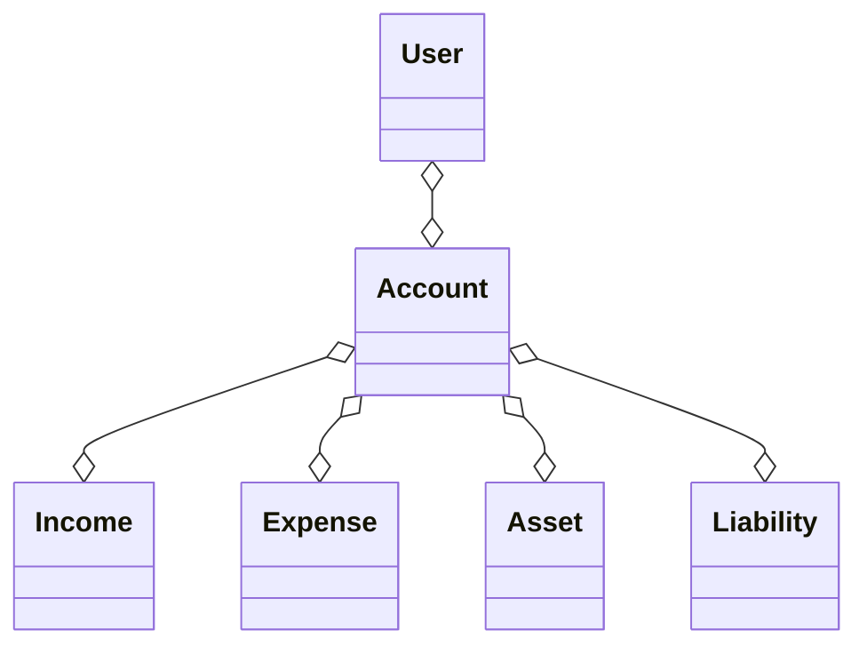
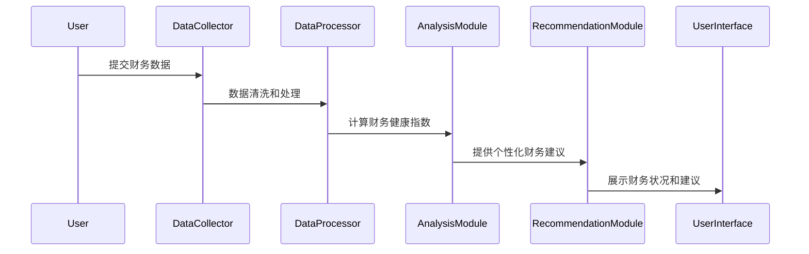
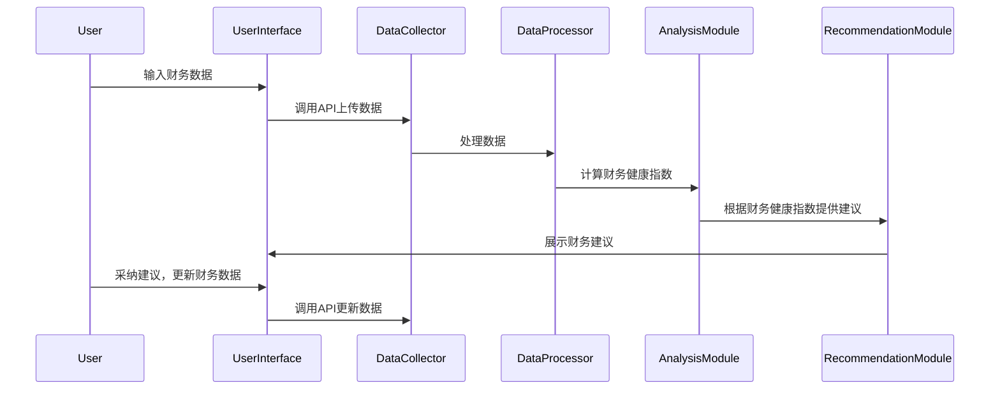

                 

# 个人财务健康指数动态跟踪系统

> 关键词：个人财务管理、财务健康指数、数据分析算法、推荐算法、系统架构设计

> 摘要：本文将探讨个人财务健康指数动态跟踪系统的设计与实现。系统通过分析用户的财务数据，计算个人财务健康指数，并提供个性化的财务建议。本文将详细介绍系统架构、核心算法原理、数学模型以及实际应用案例，帮助读者理解个人财务管理的重要性和方法。

## 引言

### 1.1 问题背景

随着经济的发展，个人财务管理的重要性日益凸显。合理管理个人财务不仅能提高生活质量，还能为未来的规划提供保障。然而，很多人对于如何有效管理个人财务缺乏了解，导致财务状况不佳。为此，本文提出了一种名为“个人财务健康指数动态跟踪系统”的创新解决方案。

### 1.2 问题描述

个人财务健康指数动态跟踪系统是一个集成了多种财务分析工具和算法的系统，旨在帮助用户实时监测和管理个人财务健康。该系统通过分析用户的收入、支出、资产和负债等信息，计算出个人财务健康指数，并根据用户的具体情况提供个性化的财务建议。

### 1.3 问题解决

本文将详细探讨个人财务健康指数动态跟踪系统的设计、实现和部署过程，包括以下方面：

1. **核心概念**：介绍个人财务健康指数的定义、计算方法和影响因素。
2. **系统架构**：描述系统的整体架构，包括数据采集、数据处理、分析模块和用户界面。
3. **算法原理**：讲解系统中的关键算法，如数据清洗算法、财务指标计算算法和推荐算法。
4. **数学模型**：阐述个人财务健康指数的数学模型和公式。
5. **系统实现**：介绍系统的具体实现细节，包括前端界面设计、后端数据处理和算法实现。
6. **项目实战**：通过实际案例展示系统的应用场景和操作流程。
7. **最佳实践**：提供使用该系统的最佳实践和建议。

### 1.4 边界与外延

本文主要关注个人财务健康指数动态跟踪系统的设计和实现，但不涉及具体的商业决策。同时，该系统适用于大多数个人用户，但对于专业投资者和企业财务管理可能会有所限制。

### 1.5 概念结构与核心要素组成

个人财务健康指数动态跟踪系统的核心要素包括：

1. **用户数据**：包括用户的收入、支出、资产和负债等财务数据。
2. **数据分析算法**：用于处理和计算用户财务健康指数的算法。
3. **推荐算法**：根据用户财务状况提供个性化建议的算法。
4. **用户界面**：用于展示用户财务状况和推荐建议的界面。

## 核心概念与联系

### 2.1 个人财务健康指数

#### 2.1.1 定义

个人财务健康指数（Financial Health Index, FHI）是一个衡量个人财务健康状况的综合性指标。它综合考虑了用户的收入、支出、资产和负债等因素，用于评估个人的财务稳定性和未来规划的可行性。

#### 2.1.2 计算方法

个人财务健康指数通常通过以下公式计算：

$$
\text{个人财务健康指数} = \frac{\text{净资产}}{\text{总负债}}
$$

其中，净资产 = 资产 - 负债。

#### 2.1.3 影响因素

影响个人财务健康指数的主要因素包括：

- **收入水平**：收入越高，财务健康指数通常越高。
- **支出水平**：支出越低，财务健康指数通常越高。
- **资产状况**：资产越多，财务健康指数通常越高。
- **负债状况**：负债越少，财务健康指数通常越高。

### 2.2 数据分析算法

#### 2.2.1 数据清洗算法

数据清洗是数据分析的重要步骤。数据清洗算法用于处理不完整、重复、错误或格式不一致的数据，确保数据的准确性和完整性。

#### 2.2.2 财务指标计算算法

财务指标计算算法用于根据用户财务数据计算各项财务指标，如收入、支出、资产和负债等。这些指标是计算个人财务健康指数的基础。

### 2.3 推荐算法

#### 2.3.1 算法概述

推荐算法用于根据用户财务状况和需求，提供个性化的财务建议。常见的推荐算法包括基于内容的推荐、协同过滤推荐和混合推荐等。

#### 2.3.2 算法原理

基于内容的推荐算法根据用户的历史财务数据和兴趣，推荐相似的财务产品和服务。协同过滤推荐算法通过分析用户之间的相似性，推荐用户可能感兴趣的产品和服务。混合推荐算法结合了基于内容和协同过滤推荐算法的优点，提供更精确的推荐结果。

## 系统分析与架构设计

### 3.1 系统场景介绍

个人财务健康指数动态跟踪系统适用于以下场景：

- **个人用户**：用于监测和管理个人财务状况，提供个性化的财务建议。
- **金融机构**：用于分析用户财务数据，提供定制化的金融产品和服务。
- **企业**：用于管理员工财务状况，提高员工财务健康水平，降低财务风险。

### 3.2 系统架构设计

个人财务健康指数动态跟踪系统采用前后端分离的架构设计，主要包括以下模块：

- **数据采集模块**：负责收集用户的财务数据，如收入、支出、资产和负债等。
- **数据处理模块**：负责对采集到的财务数据进行清洗、计算和存储。
- **分析模块**：负责计算个人财务健康指数，并根据用户需求提供个性化财务建议。
- **用户界面模块**：负责展示用户财务状况和推荐建议，提供友好的交互界面。

### 3.3 系统功能设计

#### 3.3.1 领域模型

领域模型是系统功能的核心，它定义了系统涉及的各类实体及其关系。以下是一个简单的领域模型类图（使用Mermaid语法）：



#### 3.3.2 系统架构

系统架构图如下（使用Mermaid语法）：



### 3.4 系统接口设计

系统接口设计包括API接口和数据库接口。以下是一个简单的API接口设计（使用Mermaid语法）：

```mermaid
interface Diagram {
    DataCollector --> AnalysisModule: post /api/financial-data
    AnalysisModule --> RecommendationModule: get /api/financial-advice
    RecommendationModule --> UserInterface: post /api/financial-advice
}
```

### 3.5 系统交互

系统交互主要包括用户与系统之间的交互和数据流。以下是一个简单的系统交互序列图（使用Mermaid语法）：



## 项目实战

### 4.1 环境安装

在开始项目实战之前，我们需要安装必要的开发环境和工具。以下是一个基本的安装步骤：

1. **Python环境**：安装Python 3.8及以上版本。
2. **数据库**：安装MySQL或PostgreSQL数据库。
3. **前端框架**：安装Django或Flask框架。
4. **数据分析库**：安装Pandas、NumPy、Scikit-learn等数据分析库。

### 4.2 系统核心实现

#### 4.2.1 数据采集

以下是一个简单的数据采集示例（Python代码）：

```python
import pandas as pd

def collect_data():
    # 从文件读取财务数据
    data = pd.read_csv('financial_data.csv')
    return data
```

#### 4.2.2 数据处理

以下是一个简单的数据处理示例（Python代码）：

```python
import pandas as pd

def process_data(data):
    # 数据清洗
    data = data.dropna()  # 删除缺失值
    data = data.drop_duplicates()  # 删除重复值
    
    # 数据计算
    data['NetWorth'] = data['Asset'] - data['Liability']
    return data
```

#### 4.2.3 财务健康指数计算

以下是一个简单的财务健康指数计算示例（Python代码）：

```python
import pandas as pd

def calculate_fhi(data):
    fhi = data['NetWorth'] / data['Liability']
    return fhi
```

#### 4.2.4 推荐算法

以下是一个简单的推荐算法示例（Python代码）：

```python
from sklearn.neighbors import NearestNeighbors

def recommend_products(data, user_index):
    # 训练推荐模型
    model = NearestNeighbors()
    model.fit(data)
    
    # 推荐产品
    distances, indices = model.kneighbors(user_index)
    recommended_products = data.iloc[indices]
    return recommended_products
```

### 4.3 实际案例分析和详细讲解剖析

#### 4.3.1 案例背景

假设有一个用户，他的财务数据如下：

| 收入（元） | 支出（元） | 资产（元） | 负债（元） |
| --------- | --------- | --------- | --------- |
| 10000    | 8000      | 5000      | 3000      |

#### 4.3.2 案例分析

1. **数据采集**：用户通过前端界面输入财务数据。
2. **数据处理**：系统对数据进行清洗和计算，得到如下结果：

| 收入（元） | 支出（元） | 资产（元） | 负债（元） | 净资产（元） | 财务健康指数 |
| --------- | --------- | --------- | --------- | --------- | --------- |
| 10000    | 8000      | 5000      | 3000      | 2000      | 0.67      |

3. **财务健康指数计算**：根据财务健康指数的公式，计算得到财务健康指数为0.67。
4. **推荐算法**：系统根据用户的财务健康指数，推荐一些适合该用户的理财产品，如定期存款、基金等。

### 4.4 项目小结

本文介绍了个人财务健康指数动态跟踪系统的设计、实现和部署过程。通过实际案例，展示了系统的应用场景和操作流程。系统帮助用户实时监测和管理个人财务健康，提供个性化的财务建议，对提高个人财务管理能力具有重要意义。

## 最佳实践

### 5.1 数据质量保证

- 定期检查和清洗财务数据，确保数据的准确性和完整性。
- 采用自动化工具进行数据清洗，提高数据处理效率。

### 5.2 个性化推荐

- 根据用户的历史行为和财务状况，提供更加精准的推荐。
- 定期更新推荐算法，以适应市场的变化。

### 5.3 系统性能优化

- 使用缓存技术，提高系统响应速度。
- 优化数据库查询，减少系统开销。

## 小结

个人财务健康指数动态跟踪系统是一种创新的财务管理工具，它通过分析用户的财务数据，计算个人财务健康指数，并提供个性化的财务建议。本文详细介绍了系统的设计、实现和部署过程，并通过实际案例展示了系统的应用效果。通过使用本系统，用户可以更好地管理个人财务，提高生活质量。

## 注意事项

- 系统设计时应充分考虑数据安全和隐私保护。
- 定期更新和维护系统，确保其稳定性和可靠性。

## 拓展阅读

- 《个人财务管理》
- 《数据科学实战》
- 《机器学习实战》

## 作者信息

作者：AI天才研究院/AI Genius Institute & 禅与计算机程序设计艺术 /Zen And The Art of Computer Programming

