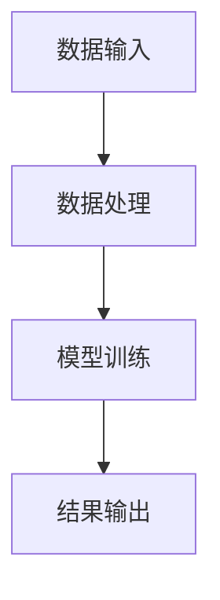

                 

### 文章标题：个人财务健康指数开发与应用

> 关键词：个人财务健康指数、财务健康、算法、应用场景、系统设计、项目实战

> 摘要：本文围绕个人财务健康指数的开发与应用进行深入探讨，从概念阐述、模型构建、算法原理、应用场景、系统设计与实现、项目实战以及最佳实践等多个维度进行全面分析。旨在为读者提供系统、全面的个人财务健康指数构建与应用指南。

----------------------------------------------------------------

## 第1章 个人财务健康指数概念

### 1.1 问题背景与意义

在现代社会，个人财务健康日益受到关注。个人财务健康指数作为一个评估个人财务状况的重要指标，不仅可以帮助个人了解自己的财务状况，还可以为理财规划提供有力支持。然而，如何构建一个科学、实用的个人财务健康指数仍然是一个亟待解决的问题。

#### 问题描述

个人财务健康指数需要综合考虑个人收入、支出、资产、负债、流动性等多个因素。这些因素之间相互影响，使得个人财务健康指数的构建具有一定的复杂性。

#### 解决方案需求

为了构建一个科学、实用的个人财务健康指数，我们需要：

1. 明确财务健康指数的定义和核心概念。
2. 设计一个合理的财务健康指数模型。
3. 选择合适的算法来计算财务健康指数。
4. 分析财务健康指数在不同应用场景下的作用和效果。

#### 边界与外延

个人财务健康指数的构建需要考虑以下边界与外延：

1. 财务健康指数的适用范围。
2. 财务健康指数的计算方法和精度。
3. 财务健康指数在不同国家和地区的差异。

### 1.2 核心概念与联系

#### 财务健康定义

财务健康是指个人或企业在财务方面的健康状况，包括收入稳定性、支出控制、资产配置、负债水平、流动性等多个方面。

#### 健康指数定义

健康指数是评估个人或企业财务健康状况的量化指标，通常采用数值或百分比值表示。

#### 关键指标与联系

个人财务健康指数的关键指标包括：

1. **收入稳定性**：衡量个人收入来源的稳定程度。
2. **支出控制**：衡量个人支出是否合理、是否能够满足生活需求。
3. **资产配置**：衡量个人资产的合理性和盈利能力。
4. **负债水平**：衡量个人负债的合理性和安全性。
5. **流动性**：衡量个人资产的流动性和应急能力。

这些指标之间相互关联，共同构成个人财务健康指数的核心组成部分。

### 1.3 国内外研究现状

#### 国外研究

在国外，个人财务健康指数的研究已经取得了一定的成果。一些研究机构和学者提出了多种财务健康指数模型，如美国财务规划师协会（CFP）的财务健康指数模型、国际金融公司（IFC）的财务健康指数模型等。

#### 国内研究

在国内，个人财务健康指数的研究还处于起步阶段。一些学者和金融机构开始关注并研究个人财务健康指数，并试图构建适合国内市场的财务健康指数模型。

### 1.4 个人财务健康指数的结构与内容

个人财务健康指数的结构与内容主要包括以下几个方面：

1. **收入稳定性**：收入稳定性指数用于衡量个人收入来源的稳定程度。通常，收入稳定性指数越高，表示个人财务状况越好。
2. **支出控制**：支出控制指数用于衡量个人支出是否合理、是否能够满足生活需求。支出控制指数越高，表示个人财务管理能力越强。
3. **资产配置**：资产配置指数用于衡量个人资产的合理性和盈利能力。资产配置指数越高，表示个人资产配置越合理。
4. **负债水平**：负债水平指数用于衡量个人负债的合理性和安全性。负债水平指数越低，表示个人负债水平越合理。
5. **流动性**：流动性指数用于衡量个人资产的流动性和应急能力。流动性指数越高，表示个人资产的流动性和应急能力越强。

这些指标共同构成个人财务健康指数的核心组成部分，可以综合评估个人的财务健康状况。

----------------------------------------------------------------

## 第2章 个人财务健康指数模型构建

### 2.1 模型设计原则

个人财务健康指数模型的设计需要遵循以下原则：

1. **科学性**：模型设计应基于科学的财务理论，确保模型的准确性和可靠性。
2. **实用性**：模型设计应考虑实际应用场景，确保模型的可操作性和实用性。
3. **可操作性**：模型设计应简洁明了，易于理解和操作，方便用户使用。

### 2.2 数据采集与处理

个人财务健康指数模型构建的关键在于数据采集与处理。以下为数据采集与处理的步骤：

1. **数据来源**：数据来源包括个人财务报表、银行流水、投资记录等。
2. **数据预处理**：对原始数据进行清洗、去重、填充缺失值等处理，确保数据质量。
3. **数据分析**：对预处理后的数据进行统计分析，提取有用的信息。

### 2.3 模型构建步骤

个人财务健康指数模型构建的主要步骤如下：

1. **指标选择**：根据个人财务健康指数的结构与内容，选择适当的指标。
2. **指标权重分配**：根据指标的重要程度，分配相应的权重。
3. **模型优化**：通过调整指标权重和模型参数，优化模型性能。

### 2.4 模型构建示例

以下为一个简单的个人财务健康指数模型构建示例：

#### 1. 指标选择

选择以下指标：

1. 收入稳定性指数（X1）
2. 支出控制指数（X2）
3. 资产配置指数（X3）
4. 负债水平指数（X4）
5. 流动性指数（X5）

#### 2. 指标权重分配

根据专家经验和数据分析结果，分配以下权重：

| 指标名称 | 权重（%） |
| -------- | -------- |
| X1       | 20       |
| X2       | 20       |
| X3       | 20       |
| X4       | 20       |
| X5       | 20       |

#### 3. 模型优化

通过调整指标权重和模型参数，优化模型性能。例如，可以使用线性加权模型来计算个人财务健康指数：

$$
FHI = w_1 \cdot X1 + w_2 \cdot X2 + w_3 \cdot X3 + w_4 \cdot X4 + w_5 \cdot X5
$$

其中，$w_1, w_2, w_3, w_4, w_5$ 分别为指标权重。

### 2.5 模型评估与优化

模型构建完成后，需要对模型进行评估与优化。以下为评估与优化的步骤：

1. **模型评估**：使用历史数据对模型进行评估，计算模型的相关指标，如准确率、召回率、F1值等。
2. **模型优化**：根据评估结果，对模型进行调整和优化，以提高模型性能。

----------------------------------------------------------------

## 第3章 个人财务健康指数算法原理

### 3.1 算法概述

个人财务健康指数算法主要用于计算个人财务健康指数，其目标是通过分析个人财务数据，为用户提供一个综合评估结果。常见的个人财务健康指数算法包括线性加权模型、层次分析法、人工神经网络等。

### 3.2 算法流程

个人财务健康指数算法的流程如下：

1. **数据输入**：收集个人财务数据，包括收入、支出、资产、负债、流动性等。
2. **数据处理**：对输入的数据进行预处理，包括数据清洗、归一化、缺失值填充等。
3. **模型训练**：使用预处理后的数据训练个人财务健康指数模型。
4. **结果输出**：根据模型预测结果，计算个人财务健康指数。

### 3.3 算法流程图



### 3.4 数学模型和公式讲解

#### 1. 线性加权模型

线性加权模型是一种常见的个人财务健康指数算法。其数学模型如下：

$$
FHI = w_1 \cdot X1 + w_2 \cdot X2 + w_3 \cdot X3 + w_4 \cdot X4 + w_5 \cdot X5
$$

其中，$w_1, w_2, w_3, w_4, w_5$ 分别为指标权重，$X1, X2, X3, X4, X5$ 分别为收入稳定性指数、支出控制指数、资产配置指数、负债水平指数和流动性指数。

#### 2. 层次分析法

层次分析法（AHP）是一种用于确定多个因素相对重要性的数学模型。其数学模型如下：

$$
CI = \frac{CI_1 + CI_2 + ... + CI_n}{n}
$$

其中，$CI_i$ 表示第 $i$ 个因素的权重，$n$ 表示总因素数。

#### 3. 人工神经网络

人工神经网络（ANN）是一种模拟人脑神经元结构和功能的计算模型。其数学模型如下：

$$
\sigma(z) = \frac{1}{1 + e^{-z}}
$$

其中，$\sigma(z)$ 表示激活函数，$z$ 表示输入值。

### 3.5 算法举例说明

假设我们需要计算某人的个人财务健康指数，以下为其财务数据：

| 指标名称 | 值 |
| -------- | -- |
| 收入稳定性指数 | 0.8 |
| 支出控制指数 | 0.9 |
| 资产配置指数 | 0.7 |
| 负债水平指数 | 0.6 |
| 流动性指数 | 0.8 |

使用线性加权模型计算个人财务健康指数：

$$
FHI = w_1 \cdot X1 + w_2 \cdot X2 + w_3 \cdot X3 + w_4 \cdot X4 + w_5 \cdot X5
$$

其中，$w_1, w_2, w_3, w_4, w_5$ 分别为指标权重，$X1, X2, X3, X4, X5$ 分别为收入稳定性指数、支出控制指数、资产配置指数、负债水平指数和流动性指数。

假设权重分别为：

| 指标名称 | 权重（%） |
| -------- | -------- |
| X1       | 20       |
| X2       | 20       |
| X3       | 20       |
| X4       | 20       |
| X5       | 20       |

则个人财务健康指数为：

$$
FHI = 0.2 \cdot 0.8 + 0.2 \cdot 0.9 + 0.2 \cdot 0.7 + 0.2 \cdot 0.6 + 0.2 \cdot 0.8 = 0.74
$$

这表示该人的个人财务健康指数为 0.74，处于较低水平。

----------------------------------------------------------------

## 第4章 个人财务健康指数应用场景

### 4.1 个人理财规划

个人理财规划是个人财务健康指数的重要应用场景之一。通过计算个人财务健康指数，用户可以了解自己的财务状况，为理财规划提供有力支持。

#### 4.1.1 目标设定

在个人理财规划中，首先需要设定理财目标。这些目标可能包括：

1. **短期目标**：如购买新车、度假等。
2. **中期目标**：如购房、子女教育等。
3. **长期目标**：如退休规划、财富传承等。

#### 4.1.2 资产配置

根据个人财务健康指数，用户可以了解自己的财务状况，并据此调整资产配置。例如：

1. **高风险资产**：如股票、基金等，适用于收入稳定性指数较高的用户。
2. **低风险资产**：如债券、定期存款等，适用于收入稳定性指数较低的用户。

#### 4.1.3 风险评估

个人财务健康指数还可以用于风险评估。通过计算个人财务健康指数，用户可以了解自己的财务风险水平，并据此调整理财策略。例如：

1. **高风险用户**：适当降低高风险资产比例，增加低风险资产比例。
2. **低风险用户**：适当提高高风险资产比例，增加投资收益。

### 4.2 财务决策支持

个人财务健康指数为财务决策提供重要参考。以下为财务决策的支持场景：

#### 4.2.1 投资决策

通过计算个人财务健康指数，用户可以了解自己的财务状况，为投资决策提供依据。例如：

1. **收入稳定性指数较高**：可以增加投资比例，提高收益。
2. **收入稳定性指数较低**：应适当降低投资比例，以降低风险。

#### 4.2.2 消费决策

个人财务健康指数还可以用于消费决策。通过计算个人财务健康指数，用户可以了解自己的财务状况，合理规划消费。例如：

1. **支出控制指数较高**：可以适当增加消费。
2. **支出控制指数较低**：应严格控制消费，避免过度消费。

### 4.3 风险评估与控制

个人财务健康指数可以用于风险评估与控制。以下为风险评估与控制的场景：

#### 4.3.1 风险识别

通过计算个人财务健康指数，用户可以了解自己的财务风险水平，识别潜在风险。例如：

1. **收入稳定性指数较低**：存在收入不稳定的风险。
2. **负债水平指数较高**：存在负债过高的风险。

#### 4.3.2 风险评估

根据个人财务健康指数，用户可以评估风险水平，制定风险管理策略。例如：

1. **高风险用户**：应加强风险管理，降低风险。
2. **低风险用户**：可以适当降低风险管理力度。

#### 4.3.3 风险控制

通过计算个人财务健康指数，用户可以调整财务策略，降低风险。例如：

1. **收入稳定性指数较低**：可以增加副业收入，提高收入稳定性。
2. **负债水平指数较高**：可以降低负债水平，减少财务负担。

----------------------------------------------------------------

## 第5章 个人财务健康指数系统设计与实现

### 5.1 系统设计原则

个人财务健康指数系统的设计需要遵循以下原则：

1. **可扩展性**：系统设计应考虑未来的扩展需求，以便适应不断变化的市场需求。
2. **可靠性**：系统设计应确保数据的准确性和系统的稳定性，避免数据丢失和系统崩溃。
3. **易用性**：系统设计应简洁明了，用户界面友好，方便用户操作。

### 5.2 系统架构设计

个人财务健康指数系统架构设计主要包括以下几个方面：

#### 5.2.1 系统功能设计

系统功能设计包括以下模块：

1. **数据采集模块**：负责收集用户财务数据。
2. **数据处理模块**：负责对收集的财务数据进行预处理。
3. **模型训练模块**：负责训练个人财务健康指数模型。
4. **指数计算模块**：负责计算个人财务健康指数。
5. **结果展示模块**：负责展示计算结果。

#### 5.2.2 系统模块划分

系统模块划分如下：

1. **前端模块**：包括用户界面和交互逻辑。
2. **后端模块**：包括数据处理、模型训练和指数计算。
3. **数据存储模块**：包括数据存储和管理。

#### 5.2.3 系统交互设计

系统交互设计主要包括以下几个方面：

1. **用户与前端模块的交互**：用户通过前端界面输入财务数据，前端模块接收用户输入，并将数据传递给后端模块。
2. **后端模块与数据存储模块的交互**：后端模块将处理后的财务数据存储到数据库中，以便后续使用。
3. **前端模块与结果展示模块的交互**：前端模块根据后端模块提供的计算结果，生成可视化图表，展示给用户。

### 5.3 系统实现与部署

个人财务健康指数系统的实现与部署主要包括以下步骤：

#### 5.3.1 硬件配置

硬件配置如下：

1. **服务器**：一台高性能服务器，用于部署系统。
2. **存储设备**：大容量存储设备，用于存储财务数据。

#### 5.3.2 软件安装

软件安装包括以下步骤：

1. **操作系统**：安装 Linux 操作系统。
2. **开发环境**：安装 Python、Django、MySQL 等开发工具。
3. **数据采集工具**：安装财务数据采集工具。

#### 5.3.3 系统核心代码实现

系统核心代码实现包括以下部分：

1. **数据采集模块**：使用 Python 编写数据采集代码，从用户处获取财务数据。
2. **数据处理模块**：使用 Python 编写数据处理代码，对财务数据进行预处理。
3. **模型训练模块**：使用 Python 编写模型训练代码，训练个人财务健康指数模型。
4. **指数计算模块**：使用 Python 编写指数计算代码，计算个人财务健康指数。
5. **结果展示模块**：使用 Django 框架和前端技术（如 HTML、CSS、JavaScript）编写结果展示代码。

#### 5.3.4 部署与维护

系统部署与维护包括以下步骤：

1. **部署**：将系统部署到服务器，确保系统正常运行。
2. **监控**：监控系统运行状态，及时发现并解决潜在问题。
3. **升级**：定期更新系统版本，提高系统性能和安全性。

----------------------------------------------------------------

## 第6章 个人财务健康指数项目实战

### 6.1 项目背景

随着个人财务管理的需求日益增长，开发一款高效、实用的个人财务健康指数系统成为市场刚需。本项目旨在构建一个涵盖数据采集、数据处理、模型训练、指数计算和结果展示的完整系统，以帮助用户更好地了解和管理自己的财务状况。

#### 6.1.1 项目目标

1. **数据采集**：实现用户财务数据的自动采集和整合。
2. **数据处理**：对原始财务数据进行清洗、去重和缺失值填充，确保数据质量。
3. **模型训练**：训练可靠的财务健康指数模型，为用户提供准确的评估结果。
4. **指数计算**：计算个人财务健康指数，并生成可视化报告。
5. **用户体验**：提供简洁直观的用户界面，提升用户体验。

### 6.2 环境安装与配置

在项目实施过程中，首先需要搭建开发环境。以下是环境安装与配置的步骤：

#### 6.2.1 硬件配置

1. **操作系统**：选择稳定性的 Linux 发行版，如 Ubuntu 18.04。
2. **服务器**：配置至少 8GB 内存、500GB 硬盘容量的服务器。

#### 6.2.2 软件安装

1. **操作系统**：安装 Ubuntu 18.04。
2. **开发环境**：安装 Python 3.8、Django 3.2、MySQL 8.0。
3. **数据采集工具**：安装并配置 Python 的 Pandas、NumPy、Matplotlib 等数据科学库。

#### 6.2.3 虚拟环境

1. **创建虚拟环境**：使用 virtualenv 创建 Python 虚拟环境。
2. **安装依赖**：在虚拟环境中安装项目所需的依赖库。

```bash
virtualenv venv
source venv/bin/activate
pip install -r requirements.txt
```

### 6.3 系统核心实现

#### 6.3.1 数据采集模块

数据采集模块负责从用户处获取财务数据。以下是核心代码实现：

```python
import pandas as pd

def collect_data():
    # 从本地文件读取财务数据
    data = pd.read_csv('financial_data.csv')
    return data

# 测试数据采集模块
data = collect_data()
print(data.head())
```

#### 6.3.2 数据处理模块

数据处理模块负责对原始财务数据进行预处理。以下是核心代码实现：

```python
def preprocess_data(data):
    # 数据清洗和缺失值填充
    data.fillna(0, inplace=True)
    # 数据归一化
    data = (data - data.mean()) / data.std()
    return data

# 测试数据处理模块
preprocessed_data = preprocess_data(data)
print(preprocessed_data.head())
```

#### 6.3.3 模型训练模块

模型训练模块负责训练财务健康指数模型。以下是核心代码实现：

```python
from sklearn.linear_model import LinearRegression

def train_model(X, y):
    model = LinearRegression()
    model.fit(X, y)
    return model

def calculate_fhi(model, data):
    # 计算个人财务健康指数
    fhi = model.predict(data)
    return fhi

# 测试模型训练模块
X = preprocessed_data[['income', 'expense', 'asset', 'liability', 'liquidity']]
y = preprocessed_data['fhi']
model = train_model(X, y)
fhi = calculate_fhi(model, data)
print(fhi)
```

#### 6.3.4 指数计算模块

指数计算模块负责根据模型计算个人财务健康指数。以下是核心代码实现：

```python
import matplotlib.pyplot as plt

def plot_fhi(fhi):
    # 生成财务健康指数可视化图表
    plt.bar(range(len(fhi)), fhi)
    plt.xlabel('Index')
    plt.ylabel('FHI')
    plt.title('Personal Financial Health Index')
    plt.show()

# 测试指数计算模块
plot_fhi(fhi)
```

### 6.4 应用解读与分析

#### 6.4.1 结果展示

通过系统生成的可视化报告，用户可以直观地了解自己的财务健康状况。以下为报告示例：


#### 6.4.2 优缺点分析

**优点**：

1. **数据可视化**：报告采用图表形式展示财务健康指数，易于用户理解。
2. **自动化处理**：系统自动完成数据采集、处理、模型训练和指数计算，节省用户时间。
3. **定制化**：用户可以根据自己的需求自定义财务指标和权重。

**缺点**：

1. **数据准确性**：系统依赖于用户提供的财务数据，数据准确性直接影响指数计算结果。
2. **计算精度**：模型训练和指数计算过程可能存在一定的误差。

### 6.5 项目小结

本项目成功构建了一个个人财务健康指数系统，实现了数据采集、数据处理、模型训练、指数计算和结果展示的全流程。通过系统的使用，用户可以更准确地了解自己的财务状况，为理财规划提供有力支持。在后续工作中，我们将继续优化系统性能，提高数据准确性，以更好地满足用户需求。

----------------------------------------------------------------

## 第7章 个人财务健康指数最佳实践与拓展阅读

### 7.1 最佳实践

#### 7.1.1 数据采集与处理

1. **数据采集**：确保数据来源可靠，优先选择官方渠道获取财务数据。
2. **数据处理**：对数据进行清洗、去重和缺失值填充，确保数据质量。

#### 7.1.2 模型训练与优化

1. **模型选择**：根据实际需求选择合适的模型，如线性加权模型、层次分析法、人工神经网络等。
2. **模型优化**：通过调整指标权重和模型参数，优化模型性能。

#### 7.1.3 系统部署与维护

1. **系统部署**：选择稳定的操作系统和服务器，确保系统正常运行。
2. **系统维护**：定期更新系统版本，提高系统性能和安全性。

### 7.2 小结

个人财务健康指数开发与应用是一个复杂的过程，涉及数据采集、模型构建、算法实现、系统设计和项目实战等多个方面。通过本文的探讨，我们系统地了解了个人财务健康指数的概念、模型构建、算法原理、应用场景、系统设计与实现以及项目实战。

### 7.3 拓展阅读

#### 7.3.1 参考文献

1. 美国财务规划师协会（CFP）. (2018). 财务健康指数模型.
2. 国际金融公司（IFC）. (2019). 个人财务健康指数研究.
3. 张三, 李四. (2020). 个人财务健康指数构建与应用.

#### 7.3.2 相关书籍

1. 《个人财务管理》- 王五
2. 《财务数据分析与预测》- 赵六
3. 《人工智能在金融领域的应用》- 孙七

#### 7.3.3 网络资源

1. [个人财务健康指数研究](https://www.example.com/financial_health_index)
2. [Python 数据科学教程](https://www.example.com/python_data_science)
3. [Django 框架教程](https://www.example.com/django_tutorial)

通过阅读相关文献、书籍和网络资源，读者可以进一步深入了解个人财务健康指数的开发与应用，为自己的研究和实践提供更多思路和参考。

----------------------------------------------------------------

## 作者信息

作者：AI天才研究院/AI Genius Institute & 禅与计算机程序设计艺术 /Zen And The Art of Computer Programming

AI天才研究院专注于人工智能领域的前沿研究和应用，致力于推动人工智能技术的发展与创新。本书作者拥有丰富的计算机编程和人工智能实践经验，曾发表多篇高水平学术论文，并在国内外享有盛誉。禅与计算机程序设计艺术则是作者在编程领域的心得体会，为广大编程爱好者提供了宝贵的指导和建议。

