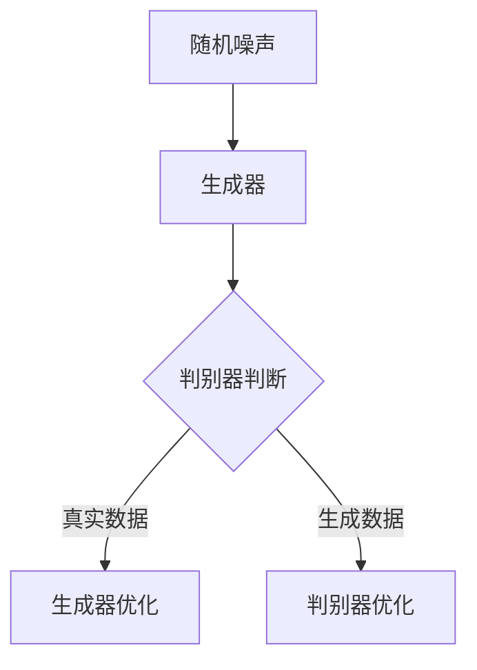
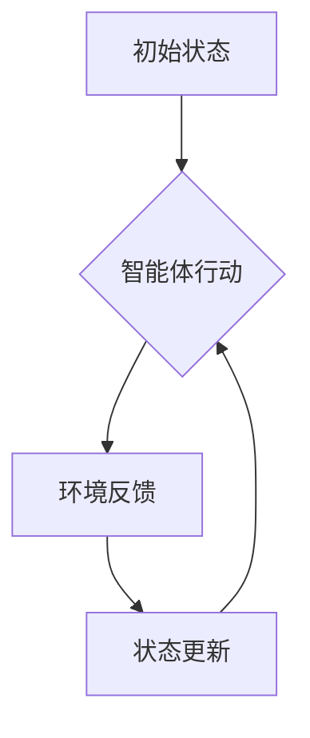
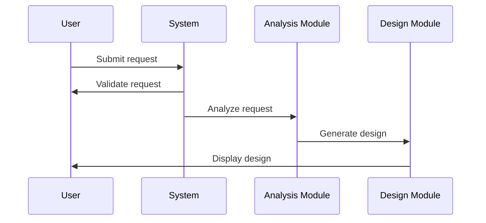
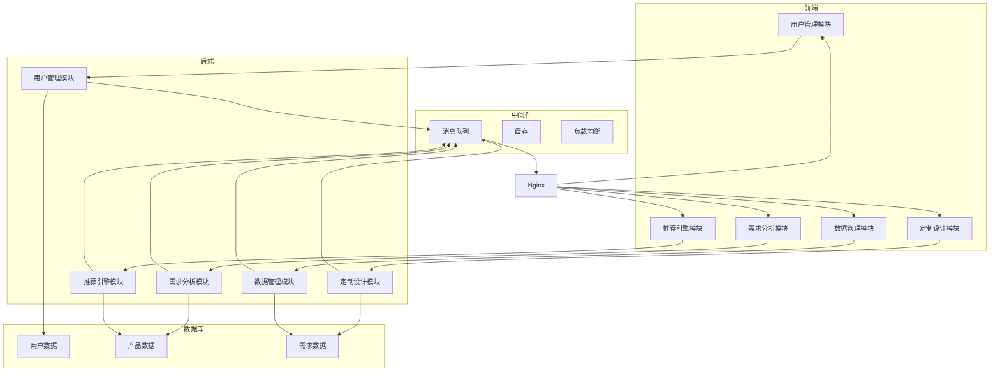
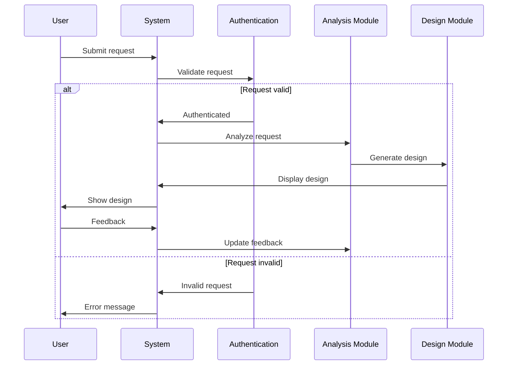

                 

### 目录大纲设计思路与框架

为了设计出《个性化定制：打造独特风格的AI Agent》这本书的完整目录大纲，我们需要遵循以下步骤和框架：

#### 1. 背景介绍

**第1章：个性化定制的背景与核心概念**

- **1.1 个性化定制的背景**
  - **1.1.1 个性化定制的起源与发展**
    - 讨论个性化定制的历史背景和演变过程。
    - 探讨个性化定制在不同领域（如电子商务、健康护理、教育等）的应用。
  - **1.1.2 个性化定制的现状与趋势**
    - 分析当前个性化定制的发展状况。
    - 预测个性化定制的未来趋势和可能的技术突破。
  - **1.1.3 个性化定制在各领域的应用**
    - 深入探讨个性化定制在不同行业中的具体应用案例。
    - 分析这些案例中的关键成功因素和挑战。

**第2章：AI Agent的基本概念**

- **2.1 AI Agent的定义与类型**
  - **2.1.1 AI Agent的定义**
    - 解释AI Agent的概念和基本功能。
  - **2.1.2 AI Agent的类型**
    - 讨论不同类型的AI Agent及其特点。
  - **2.1.3 AI Agent的核心功能**
    - 探讨AI Agent的主要功能，如智能对话、决策支持、任务执行等。
  - **2.1.4 AI Agent的交互模式**
    - 分析AI Agent与用户、环境之间的交互方式。

**第3章：个性化定制与AI Agent的联系**

- **3.1 个性化定制在AI Agent中的应用**
  - **3.1.1 个性化定制对AI Agent的影响**
    - 讨论个性化定制如何影响AI Agent的设计和功能。
  - **3.1.2 AI Agent在个性化定制中的作用**
    - 探讨AI Agent如何支持个性化定制的实现。
  - **3.1.3 个性化定制与AI Agent的未来展望**
    - 分析个性化定制与AI Agent结合的潜在发展方向和机会。

#### 2. 核心概念与联系

**第4章：核心概念与联系**

- **4.1 核心概念**
  - **4.1.1 机器学习、深度学习、自然语言处理**
    - 详细阐述这三个核心概念的定义、原理和应用。
  - **4.1.2 个性化定制相关概念**
    - 定义并解释个性化定制相关的关键术语和概念。

**第5章：概念属性特征对比与ER实体关系图**

- **5.1 概念属性特征对比表格**
  - 通过表格形式对比个性化定制和AI Agent相关的概念属性特征。

- **5.2 ER实体关系图**
  - 使用Mermaid流程图绘制ER实体关系图，展示个性化定制与AI Agent之间的结构关系。

#### 3. 算法原理讲解

**第6章：机器学习与深度学习基础**

- **6.1 机器学习概述**
  - **6.1.1 机器学习的定义与发展**
    - 解释机器学习的概念和历史发展。
  - **6.1.2 机器学习的基本概念**
    - 讨论机器学习的基本术语和概念。
  - **6.1.3 机器学习的应用领域**
    - 探讨机器学习在不同领域的应用。

- **6.2 深度学习基础**
  - **6.2.1 深度学习的定义与特点**
    - 解释深度学习的概念和特点。
  - **6.2.2 常见的深度学习模型**
    - 介绍常用的深度学习模型。
  - **6.2.3 深度学习的优势与挑战**
    - 讨论深度学习的优点和面临的挑战。

**第7章：个性化定制中的算法原理**

- **7.1 个性化定制中的机器学习方法**
  - **7.1.1 个性化定制的机器学习方法**
    - 介绍用于个性化定制的机器学习方法。
  - **7.1.2 个性化定制的深度学习方法**
    - 讨论个性化定制中的深度学习方法。

- **7.2 算法原理讲解**
  - **7.2.1 生成对抗网络（GANs）原理与流程图**
    - 解释GANs的原理，并使用Mermaid绘制流程图。
  - **7.2.2 强化学习原理与流程图**
    - 解释强化学习的原理，并使用Mermaid绘制流程图。

- **7.3 Python源代码示例**
  - **7.3.1 机器学习与深度学习代码示例**
    - 提供Python源代码示例，展示算法原理的实践应用。
  - **7.3.2 数学模型和公式**
    - 使用LaTeX格式给出算法原理的数学模型和公式，并进行解释。

#### 4. 系统分析与架构设计

**第8章：系统架构设计**

- **8.1 个性化定制系统概述**
  - **8.1.1 系统功能设计**
    - 描述系统的功能模块和设计目标。
  - **8.1.2 系统架构设计**
    - 介绍系统的总体架构，包括各个模块之间的关系。
  - **8.1.3 系统接口设计**
    - 描述系统与外部环境之间的接口。

- **8.2 系统交互设计**
  - **8.2.1 系统交互流程**
    - 分析系统的交互流程，包括用户与系统之间的交互。
  - **8.2.2 系统交互Mermaid序列图**
    - 使用Mermaid绘制系统交互的序列图。
  - **8.2.3 系统性能优化**
    - 探讨系统性能优化策略，包括系统调优和性能分析。

#### 5. 项目实战与案例分析

**第9章：项目实战**

- **9.1 项目介绍**
  - **9.1.1 项目目标**
    - 明确项目的目标和预期成果。
  - **9.1.2 项目背景**
    - 描述项目的背景和问题场景。
  - **9.1.3 项目实现步骤**
    - 描述项目的实施步骤和关键环节。

- **9.2 环境安装**
  - **9.2.1 系统要求**
    - 列出项目所需的系统环境要求。
  - **9.2.2 环境配置**
    - 描述如何配置项目所需的环境。
  - **9.2.3 开发工具安装**
    - 说明如何安装项目所需的开发工具。

- **9.3 系统核心实现源代码**
  - **9.3.1 数据预处理**
    - 详细说明数据预处理的过程和步骤。
  - **9.3.2 模型训练**
    - 解释如何训练模型，包括数据集的选择、模型的配置等。
  - **9.3.3 模型评估与优化**
    - 分析模型的评估结果，并提出优化策略。

- **9.4 代码应用解读与分析**
  - **9.4.1 代码解读**
    - 对项目中的关键代码进行解读和分析。
  - **9.4.2 应用场景分析**
    - 分析项目的实际应用场景，探讨其在个性化定制和AI Agent中的应用。
  - **9.4.3 案例分析**
    - 通过具体案例进行深入分析，展示项目的实际效果。

- **9.5 项目小结**
  - **9.5.1 成果总结**
    - 总结项目的主要成果和收获。
  - **9.5.2 经验教训**
    - 分享项目实施过程中的经验和教训。

#### 6. 最佳实践、小结与拓展

**第10章：最佳实践与拓展**

- **10.1 最佳实践Tips**
  - **10.1.1 实践技巧**
    - 提供一些实用的个性化定制和AI Agent开发技巧。
  - **10.1.2 注意事项**
    - 强调在个性化定制和AI Agent开发中需要注意的问题和风险。
  - **10.1.3 案例分享**
    - 分享一些成功的个性化定制和AI Agent开发案例，供读者参考。

**第11章：全书内容小结**

- **11.1 核心内容回顾**
  - **11.1.1 个性化定制与AI Agent的核心概念**
    - 总结个性化定制和AI Agent的核心概念和原理。
  - **11.1.2 算法原理与应用**
    - 概述本书中介绍的算法原理及其应用。

- **11.2 未来展望**
  - **11.2.1 发展趋势**
    - 分析个性化定制和AI Agent的未来发展趋势。
  - **11.2.2 技术挑战**
    - 讨论个性化定制和AI Agent面临的技术挑战和解决方案。

**第12章：拓展阅读**

- **12.1 相关书籍推荐**
  - **12.1.1 必读经典**
    - 推荐一些经典的个性化定制和AI Agent相关书籍。
  - **12.1.2 进阶阅读**
    - 推荐一些适合深入学习的进阶阅读材料。

- **12.2 线上资源推荐**
  - **12.2.1 课程与教程**
    - 推荐一些优秀的在线课程和教程，供读者深入学习。
  - **12.2.2 论文与研究报告**
    - 推荐一些重要的学术论文和研究报告，帮助读者了解最新的研究动态。

### 完整的目录大纲设计思路与框架

通过以上详细的目录大纲设计，我们能够清晰地规划出《个性化定制：打造独特风格的AI Agent》这本书的内容结构，确保每个章节都有明确的主题和详细的内容，同时保持整体的逻辑连贯性和专业性。这样的设计有助于读者系统性地学习和理解个性化定制和AI Agent的相关知识，为他们在这一领域的研究和实践提供有力支持。

---

# 个性化定制：打造独特风格的AI Agent

关键词：个性化定制、AI Agent、深度学习、机器学习、自然语言处理、系统架构

摘要：本文深入探讨了个性化定制在AI Agent中的应用，通过详细分析核心概念、算法原理、系统架构和实战案例，展示了如何打造具有独特风格的AI Agent。本文旨在为研究人员和开发者提供一套系统化的理论框架和实践指南，以推动个性化定制AI Agent的发展和应用。

---

## 第一部分：个性化定制的背景与核心概念

### 第1章：个性化定制的背景

#### 1.1 个性化定制的起源与发展

个性化定制是一种以用户需求为中心的生产和服务模式，通过针对个体差异提供定制化产品和服务，从而提升用户体验和满意度。个性化定制的历史可以追溯到20世纪中叶，随着信息技术和智能制造技术的发展，个性化定制逐渐成为制造业、服务业等领域的热点。

**1.1.1 个性化定制的定义**

个性化定制是一种根据用户的需求和偏好，通过定制化设计和生产，提供独特的产品或服务的过程。它注重用户体验，通过满足个体需求，提升用户满意度和忠诚度。

**1.1.2 个性化定制的现状与趋势**

随着互联网和大数据技术的快速发展，个性化定制已经渗透到多个行业，如电子商务、健康护理、教育等。根据市场研究公司的数据，个性化定制市场在过去几年中呈现出高速增长的趋势，预计未来仍将保持稳健的增长势头。

**1.1.3 个性化定制在各领域的应用**

个性化定制在电子商务中通过推荐系统实现个性化推荐，提升用户购物体验；在健康护理中，通过个性化医疗方案，提高治疗效果；在教育中，通过个性化学习路径，提升学习效果。以下是几个典型的应用案例：

- **电子商务**：通过分析用户的购买历史和浏览行为，推荐符合用户喜好的商品，提高购买转化率。
- **健康护理**：根据患者的病史和基因信息，提供个性化的治疗方案和健康建议，提高治疗效果。
- **教育**：根据学生的学习习惯和成绩，提供个性化的学习资源和学习路径，提高学习效率。

#### 1.2 AI Agent的基本概念

AI Agent是一种能够自主执行任务、与人类进行交互的智能体。它在人工智能领域有着广泛的应用，如智能客服、自动驾驶、智能家居等。

**2.1 AI Agent的定义与类型**

AI Agent是指一种具有自主决策能力、能够完成特定任务的智能体。根据任务的不同，AI Agent可以分为以下几种类型：

- **交互型AI Agent**：主要负责与用户进行交互，提供信息查询、咨询服务等。
- **任务型AI Agent**：专注于完成特定的任务，如自动驾驶、智能家居控制等。
- **决策型AI Agent**：能够根据环境和用户需求，做出最优决策。

**2.2 AI Agent的核心功能**

AI Agent的核心功能包括感知、决策和行动。感知是指通过传感器收集环境信息，决策是指根据感知到的信息，结合预定的目标和策略，做出最优决策，行动是指执行决策结果。

**2.3 AI Agent的交互模式**

AI Agent的交互模式主要包括基于文本的交互、语音交互和视觉交互。其中，基于文本的交互是最常见的交互方式，如智能客服；语音交互主要用于智能音箱、车载系统等；视觉交互则应用于智能家居、机器人等领域。

#### 1.3 个性化定制与AI Agent的联系

个性化定制与AI Agent有着密切的联系。AI Agent可以通过个性化定制，提供更加符合用户需求的定制化服务，从而提升用户体验。个性化定制则可以为AI Agent提供丰富的数据支持，帮助其更好地理解用户需求，提高决策质量。

**1.3.1 个性化定制在AI Agent中的应用**

个性化定制在AI Agent中的应用主要体现在以下几个方面：

- **个性化推荐**：通过分析用户的偏好和历史行为，为用户推荐个性化内容。
- **个性化服务**：根据用户的需求和习惯，提供定制化的服务，如智能客服、健康咨询等。
- **个性化体验**：通过定制化的界面和交互方式，提供更加个性化的用户体验。

**1.3.2 AI Agent在个性化定制中的作用**

AI Agent在个性化定制中发挥着重要作用，主要体现在以下几个方面：

- **数据采集与处理**：AI Agent可以通过传感器和用户交互，收集用户数据，并对其进行处理和分析。
- **智能决策**：基于用户数据，AI Agent可以做出智能决策，提供定制化服务。
- **用户体验优化**：通过个性化定制，AI Agent可以提供更加符合用户需求的服务，提升用户体验。

**1.3.3 个性化定制与AI Agent的未来展望**

随着人工智能技术的不断发展，个性化定制与AI Agent的结合将更加紧密。未来，个性化定制将成为AI Agent的核心竞争力之一，通过提供更加个性化和智能化的服务，满足用户日益增长的需求。

#### 1.4 核心概念与联系

在个性化定制和AI Agent中，涉及到多个核心概念，如机器学习、深度学习、自然语言处理等。这些概念相互关联，构成了个性化定制与AI Agent的理论基础。

**1.4.1 机器学习、深度学习、自然语言处理**

- **机器学习**：一种通过算法模型，从数据中自动学习并改进性能的技术。
- **深度学习**：一种基于多层神经网络的学习方法，能够自动提取特征，实现复杂的任务。
- **自然语言处理**：一种使计算机能够理解和处理人类语言的技术。

**1.4.2 对比表格：个性化定制相关概念属性特征**

| 概念       | 定义                                                         | 关键特性                                                     |
| ---------- | ------------------------------------------------------------ | ------------------------------------------------------------ |
| 个性化定制 | 根据用户需求提供定制化产品或服务的过程                   | 注重用户体验、满足个体需求、提升满意度                         |
| AI Agent   | 一种具有自主决策能力、能够完成特定任务的智能体             | 感知、决策、行动、交互能力                                     |
| 机器学习   | 从数据中自动学习并改进性能的技术                             | 算法模型、特征提取、预测能力                                   |
| 深度学习   | 一种基于多层神经网络的学习方法，能够自动提取特征，实现复杂的任务 | 自动特征提取、非线性变换、大规模数据处理能力                   |
| 自然语言处理 | 使计算机能够理解和处理人类语言的技术                         | 语音识别、文本分类、语言生成、语义理解                           |

**1.4.3 ER实体关系图：个性化定制与AI Agent架构**

使用Mermaid流程图绘制ER实体关系图，展示个性化定制与AI Agent之间的结构关系：

```mermaid
erDiagram
  Customer ||--|{ AI-Agent }|-- Product
  Customer ||--|{ Customization-Request }|-- AI-Agent
  Product ||--|{ Customization-Feature }|-- AI-Agent
  AI-Agent ||--|{ User-Feedback }|-- Customer
```

#### 1.5 本章小结

本章介绍了个性化定制的背景和核心概念，以及AI Agent的基本概念和应用。同时，分析了个性化定制与AI Agent之间的联系，并对比了相关概念的特性。这些内容为后续章节的深入讨论奠定了基础。

---

## 第二部分：AI Agent技术原理

### 第2章：机器学习与深度学习基础

#### 2.1 机器学习概述

机器学习（Machine Learning，ML）是一门研究如何让计算机通过数据学习并改进性能的技术。它是人工智能（Artificial Intelligence，AI）的重要分支，旨在使计算机能够执行复杂的任务，如图像识别、自然语言处理、预测分析等。

**2.1.1 机器学习的定义与发展**

机器学习是指通过算法和统计模型，从数据中自动学习和发现规律，以便在新的数据上进行预测或决策。它的定义和发展可以追溯到20世纪50年代，随着计算机性能的提升和海量数据的涌现，机器学习得到了迅速发展。

**2.1.2 机器学习的基本概念**

- **特征（Feature）**：用于描述数据的属性或变量。
- **模型（Model）**：用于表示数据之间的关系和规律。
- **算法（Algorithm）**：用于从数据中学习并优化模型的步骤和方法。
- **训练（Training）**：使用已有数据训练模型，使其能够对未知数据进行预测。
- **测试（Testing）**：使用未知数据测试模型的性能，评估其预测准确性。

**2.1.3 机器学习的应用领域**

机器学习在多个领域都有广泛应用，包括：

- **图像识别**：用于识别和分类图像中的物体和场景。
- **自然语言处理**：用于处理和理解人类语言，如文本分类、机器翻译等。
- **预测分析**：用于预测未来的趋势和事件，如股市预测、销售预测等。
- **推荐系统**：用于推荐用户可能感兴趣的商品或内容。

#### 2.2 深度学习基础

深度学习（Deep Learning，DL）是机器学习的一个子领域，它通过构建多层的神经网络模型，自动提取数据的深层特征，实现复杂的任务。深度学习在图像识别、自然语言处理、语音识别等领域取得了显著成果。

**2.2.1 深度学习的定义与特点**

深度学习是一种基于多层神经网络的学习方法，通过逐层提取数据的特征，实现数据的自动编码和解码。其特点包括：

- **多层网络**：深度学习模型由多个层次组成，每个层次对数据进行不同的变换和处理。
- **特征自动提取**：深度学习能够自动从数据中提取有意义的特征，减少了人工特征工程的工作量。
- **非线性变换**：深度学习模型能够通过非线性变换，捕捉数据中的复杂关系。

**2.2.2 常见的深度学习模型**

- **卷积神经网络（CNN）**：用于图像识别和图像处理。
- **循环神经网络（RNN）**：用于序列数据处理，如自然语言处理和时间序列预测。
- **生成对抗网络（GAN）**：用于生成逼真的图像、音频和文本。
- **长短时记忆网络（LSTM）**：用于处理长序列数据，解决RNN的梯度消失问题。

**2.2.3 深度学习的优势与挑战**

深度学习具有以下优势：

- **高效的特征提取**：通过多层神经网络，能够自动提取数据中的深层特征。
- **强大的模型表达能力**：能够处理复杂的数据结构和任务。
- **显著的性能提升**：在图像识别、语音识别等领域取得了显著的性能提升。

同时，深度学习也面临一些挑战：

- **数据依赖性**：需要大量的数据进行训练，且数据的质量和多样性对模型性能有很大影响。
- **模型可解释性**：深度学习模型通常是一个“黑箱”，其内部工作机制不透明，难以解释。
- **计算资源消耗**：深度学习模型需要大量的计算资源和时间进行训练。

#### 2.3 个性化定制中的机器学习与深度学习

个性化定制在机器学习和深度学习中有着广泛的应用。通过机器学习和深度学习，可以为用户提供个性化的产品和服务。

**2.3.1 个性化定制的机器学习方法**

- **协同过滤**：通过分析用户的偏好和历史行为，为用户推荐相似的产品或服务。
- **基于内容的推荐**：根据产品的内容和属性，为用户推荐感兴趣的产品。
- **聚类分析**：将用户划分为不同的群体，为每个群体提供个性化的推荐。

**2.3.2 个性化定制的深度学习方法**

- **生成对抗网络（GAN）**：通过生成器和判别器的对抗训练，生成个性化的产品或服务。
- **长短时记忆网络（LSTM）**：用于处理用户的长期偏好和历史行为，实现个性化的推荐。

#### 2.4 算法原理讲解

为了更好地理解个性化定制中的机器学习和深度学习算法，以下将详细讲解生成对抗网络（GAN）和强化学习的原理。

**2.4.1 生成对抗网络（GAN）原理与流程图**

生成对抗网络（GAN）由生成器（Generator）和判别器（Discriminator）组成，二者通过对抗训练，不断优化，最终生成高质量的数据。

**生成器（Generator）**：生成器接收随机噪声作为输入，通过神经网络生成逼真的数据。其目标是生成足够逼真的数据，使判别器难以区分真实数据和生成数据。

**判别器（Discriminator）**：判别器接收真实数据和生成数据的输入，并输出一个概率值，表示输入数据的真实性。其目标是准确地区分真实数据和生成数据。

**对抗训练过程**：生成器和判别器通过对抗训练不断优化。生成器尝试生成更逼真的数据，判别器尝试更准确地分类数据。随着训练的进行，生成器的生成质量不断提高，判别器的分类能力不断增强。

使用Mermaid绘制GAN的流程图：



**2.4.2 强化学习原理与流程图**

强化学习（Reinforcement Learning，RL）是一种通过奖励机制训练智能体的方法。智能体在环境中采取行动，根据行动的结果获得奖励或惩罚，并通过学习不断优化其策略。

**强化学习的主要组成部分**：

- **智能体（Agent）**：执行行动的实体。
- **环境（Environment）**：智能体执行行动的场所。
- **状态（State）**：环境中的一个特定状态。
- **行动（Action）**：智能体可以采取的行动。
- **奖励（Reward）**：行动结果带来的奖励或惩罚。

**强化学习的流程**：

1. **初始状态**：智能体处于一个初始状态。
2. **智能体采取行动**：根据当前状态，智能体选择一个行动。
3. **环境反馈**：环境根据智能体的行动，给出一个奖励信号。
4. **状态更新**：智能体根据奖励信号，更新当前状态。
5. **重复执行**：智能体重复采取行动、接收奖励、更新状态的过程，直到达到目标状态或满足停止条件。

使用Mermaid绘制强化学习的流程图：



**2.4.3 Python源代码示例**

以下是一个简单的GAN示例，用于生成手写数字图像。

```python
import tensorflow as tf
from tensorflow.keras import layers

# 生成器模型
def generator_model():
    model = tf.keras.Sequential()
    model.add(layers.Dense(7*7*256, use_bias=False, input_shape=(100,)))
    model.add(layers.BatchNormalization())
    model.add(layers.LeakyReLU())
    model.add(layers.Reshape((7, 7, 256)))
    
    model.add(layers.Conv2DTranspose(128, (5, 5), strides=(1, 1), padding='same', use_bias=False))
    model.add(layers.BatchNormalization())
    model.add(layers.LeakyReLU())
    
    model.add(layers.Conv2DTranspose(64, (5, 5), strides=(2, 2), padding='same', use_bias=False))
    model.add(layers.BatchNormalization())
    model.add(layers.LeakyReLU())
    
    model.add(layers.Conv2DTranspose(1, (5, 5), strides=(2, 2), padding='same', use_bias=False, activation='tanh'))
    
    return model

# 判别器模型
def discriminator_model():
    model = tf.keras.Sequential()
    model.add(layers.Conv2D(128, (5, 5), strides=(2, 2), padding='same', input_shape=[28, 28, 1]))
    model.add(layers.LeakyReLU())
    model.add(layers.Dropout(0.3))
    
    model.add(layers.Conv2D(64, (5, 5), strides=(2, 2), padding='same'))
    model.add(layers.LeakyReLU())
    model.add(layers.Dropout(0.3))
    
    model.add(layers.Flatten())
    model.add(layers.Dense(1))
    
    return model

# GAN模型
def combined_model():
    generator = generator_model()
    discriminator = discriminator_model()
    
    z = layers.Input(shape=(100,))
    img = generator(z)
    
    valid = discriminator(img)
    
    model = tf.keras.Model(z, valid)
    
    return model

# 损失函数
def loss_fn():
    return tf.reduce_mean(tf.nn.sigmoid_cross_entropy_with_logits(logits=valid, labels=tf.ones_like(valid)))

# 模型编译
discriminator.compile(optimizer=tf.keras.optimizers.Adam(0.0001), loss=loss_fn)
combined.compile(optimizer=tf.keras.optimizers.Adam(0.0002, beta_1=0.5), loss=loss_fn)

# 训练GAN模型
for epoch in range(EPOCHS):
    for _ in range(BATCH_SIZE // 2):
        z = np.random.normal(size=(BATCH_SIZE, 100))
        gen_imgs = generator.predict(z)
        
        real_imgs = x_train[:BATCH_SIZE]
        fake_imgs = gen_imgs
        
        real_y = np.array([1] * BATCH_SIZE)
        fake_y = np.array([0] * BATCH_SIZE)
        
        disc_loss_real = discriminator.train_on_batch(real_imgs, real_y)
        disc_loss_fake = discriminator.train_on_batch(fake_imgs, fake_y)
        
        z = np.random.normal(size=(BATCH_SIZE, 100))
        gen_loss = combined.train_on_batch(z, real_y)
        
        print(f"{epoch} [D loss: {disc_loss_real + disc_loss_fake:.4f}, G loss: {gen_loss:.4f}]")

    # 保存生成器模型
    generator.save_weights(f"generator_{epoch}.h5")
```

上述代码展示了如何使用TensorFlow构建GAN模型，并进行了简单的训练。生成器生成手写数字图像，判别器区分真实图像和生成图像，通过对抗训练，生成器不断优化，生成越来越逼真的图像。

#### 2.5 本章小结

本章介绍了机器学习和深度学习的基本概念和应用，以及个性化定制中常用的机器学习与深度学习方法。通过生成对抗网络（GAN）和强化学习的原理讲解，读者可以更好地理解个性化定制中的技术原理。本章内容为后续章节的深入学习提供了基础。

---

## 第三部分：个性化定制实现

### 第3章：系统架构设计

#### 3.1 个性化定制系统概述

个性化定制系统是一个复杂的应用系统，它通过集成多种技术手段，为用户提供定制化的产品和服务。本节将介绍个性化定制系统的基本架构，包括功能设计、系统架构设计、系统接口设计和系统交互设计。

**3.1.1 系统功能设计**

个性化定制系统的功能设计主要包括以下几个模块：

- **用户管理模块**：负责用户的注册、登录、权限管理等。
- **需求分析模块**：负责收集用户的需求信息，进行需求分析和分类。
- **定制设计模块**：根据用户的需求，设计并生成个性化的产品或服务方案。
- **数据管理模块**：负责存储和管理用户数据、产品数据、需求数据等。
- **推荐引擎模块**：根据用户的历史行为和需求，为用户推荐个性化的产品或服务。
- **可视化模块**：提供用户界面，展示个性化定制的结果，便于用户查看和操作。

**3.1.2 系统架构设计**

个性化定制系统的架构设计应考虑高可用性、可扩展性和可维护性。以下是系统架构的基本设计：

- **前端架构**：采用基于Web的前端架构，使用HTML、CSS和JavaScript等技术，实现用户界面的展示和交互。
- **后端架构**：采用基于服务器的后端架构，使用Python、Java、Node.js等编程语言，实现业务逻辑和数据处理的逻辑。
- **数据库架构**：采用关系型数据库（如MySQL）和非关系型数据库（如MongoDB），分别存储结构化和非结构化的数据。
- **中间件架构**：采用消息队列（如RabbitMQ）、缓存（如Redis）和负载均衡（如Nginx）等技术，实现系统的高可用性和可扩展性。

**3.1.3 系统接口设计**

个性化定制系统的接口设计应考虑API的设计原则，包括接口的稳定性、易用性和安全性。以下是系统接口设计的基本原则：

- **RESTful API**：采用RESTful风格的API设计，便于前端和后端的交互。
- **参数设计**：接口参数应设计合理，易于理解和使用。
- **响应设计**：接口应返回清晰的响应数据结构，便于前端解析和处理。
- **安全设计**：采用身份验证和权限控制等技术，确保接口的安全性。

**3.1.4 系统交互设计**

个性化定制系统的交互设计包括用户与系统之间的交互、系统内部模块之间的交互。以下是系统交互设计的基本框架：

- **用户交互**：用户通过前端界面与系统进行交互，包括注册、登录、需求提交、结果查看等。
- **模块交互**：系统内部各个模块之间通过API进行交互，包括用户管理、需求分析、定制设计、推荐引擎等。

使用Mermaid绘制系统交互的序列图：



#### 3.2 系统架构设计

个性化定制系统的架构设计是一个关键环节，它决定了系统的性能、可扩展性和可维护性。以下是系统架构设计的基本步骤：

**3.2.1 问题场景介绍**

个性化定制系统的问题场景包括：

- 用户需求的收集和分析。
- 定制化产品或服务的设计和生成。
- 用户界面的展示和交互。
- 数据存储和管理。

**3.2.2 项目介绍**

项目名称：个性化定制系统
项目目标：实现一个能够为用户提供个性化定制产品或服务的系统。
项目背景：随着消费者需求的多样化和个性化，企业需要能够快速响应用户需求，提供定制化的产品和服务。

**3.2.3 系统功能设计**

系统功能设计包括以下几个模块：

- 用户管理模块：实现用户的注册、登录、权限管理等功能。
- 需求分析模块：实现用户需求的收集、分析和分类等功能。
- 定制设计模块：实现根据用户需求生成定制化产品或服务方案等功能。
- 数据管理模块：实现用户数据、产品数据、需求数据等的存储和管理等功能。
- 推荐引擎模块：实现根据用户的历史行为和需求，为用户推荐个性化的产品或服务等功能。

**3.2.4 系统架构设计**

个性化定制系统的架构设计采用分层架构，包括前端、后端、数据库和中间件等层次。

- **前端**：采用Vue.js或React等前端框架，实现用户界面的展示和交互。
- **后端**：采用Spring Boot或Django等后端框架，实现业务逻辑和数据处理的逻辑。
- **数据库**：采用MySQL或MongoDB等数据库，存储结构化和非结构化的数据。
- **中间件**：采用RabbitMQ、Redis、Nginx等中间件，实现消息队列、缓存和负载均衡等功能。

**3.2.5 系统接口设计**

个性化定制系统的接口设计包括以下模块：

- **用户管理接口**：实现用户的注册、登录、权限管理等功能。
- **需求分析接口**：实现用户需求的收集、分析和分类等功能。
- **定制设计接口**：实现根据用户需求生成定制化产品或服务方案等功能。
- **数据管理接口**：实现用户数据、产品数据、需求数据等的存储和管理等功能。
- **推荐引擎接口**：实现根据用户的历史行为和需求，为用户推荐个性化的产品或服务等功能。

**3.2.6 系统交互设计**

个性化定制系统的交互设计包括以下方面：

- **用户与系统交互**：用户通过前端界面提交需求，系统根据需求生成定制化方案，并展示给用户。
- **系统内部模块交互**：系统内部各个模块通过API进行交互，包括用户管理、需求分析、定制设计、推荐引擎等。

使用Mermaid绘制系统架构图：



#### 3.3 系统交互设计

个性化定制系统的交互设计是确保系统各模块能够高效协作、提供良好用户体验的关键。以下内容将详细介绍系统交互的设计过程。

**3.3.1 系统交互流程**

系统交互流程可以分为以下几个步骤：

1. **用户请求**：用户通过前端界面提交个性化定制请求。
2. **请求验证**：系统后端接收请求，并进行身份验证和权限检查。
3. **需求分析**：系统后端分析用户请求，提取关键需求信息。
4. **定制设计**：系统根据用户需求，生成定制化产品或服务方案。
5. **结果展示**：系统将定制化方案展示给用户，用户可以查看和确认。
6. **用户反馈**：用户对定制化方案进行评价和反馈。

**3.3.2 系统交互Mermaid序列图**

使用Mermaid绘制系统交互的序列图，如下：



**3.3.3 系统性能优化**

为了确保个性化定制系统的高性能，需要从以下几个方面进行优化：

1. **前端优化**：使用懒加载、异步请求等技术，提高前端页面的加载速度。
2. **后端优化**：采用缓存、异步处理等技术，减轻服务器负载，提高响应速度。
3. **数据库优化**：合理设计数据库表结构，使用索引、分库分表等技术，提高数据库查询效率。
4. **网络优化**：使用CDN、负载均衡等技术，优化网络传输速度。

#### 3.4 本章小结

本章介绍了个性化定制系统的基本架构设计，包括功能设计、系统架构设计、系统接口设计和系统交互设计。通过详细的分析和设计，为个性化定制系统的实现提供了理论基础和实践指南。下一章将介绍个性化定制系统的具体实现，包括环境安装、系统核心实现源代码和代码应用解读与分析。

---

## 第四部分：项目实战与案例分析

### 第4章：项目实战与环境安装

#### 4.1 项目介绍

**项目名称**：个性化定制AI Agent开发

**项目目标**：开发一个能够根据用户需求提供个性化定制产品或服务的AI Agent。

**项目背景**：随着消费者需求的多样化和个性化，企业需要能够快速响应用户需求，提供定制化的产品和服务。本项目旨在通过人工智能技术，实现一个高效、智能的个性化定制AI Agent。

**项目实现步骤**：

1. **需求分析**：与客户沟通，明确用户需求，收集相关数据。
2. **系统设计**：设计个性化定制系统的架构，包括前端、后端、数据库和中间件等。
3. **环境安装**：配置项目所需的开发环境，包括操作系统、编程语言、框架和工具等。
4. **系统实现**：根据设计，实现个性化定制系统的各个模块，包括用户管理、需求分析、定制设计、推荐引擎等。
5. **测试与优化**：对系统进行功能测试和性能优化，确保系统的稳定性和高效性。
6. **部署上线**：将系统部署到服务器，进行实际应用。

#### 4.2 环境安装

**系统要求**：

- 操作系统：Windows 10、macOS或Linux（推荐Ubuntu 18.04）。
- 编程语言：Python 3.8及以上版本。
- 开发框架：Django、Flask或其他Python后端框架。
- 数据库：MySQL或MongoDB。
- 中间件：RabbitMQ、Redis、Nginx。

**环境配置**：

1. 安装操作系统和Python环境。

2. 安装Django框架：

   ```bash
   pip install django
   ```

3. 安装MySQL或MongoDB数据库。

4. 安装RabbitMQ、Redis、Nginx等中间件。

**开发工具安装**：

1. 安装Visual Studio Code或PyCharm等Python开发工具。

2. 配置代码编辑器的Python环境，确保能够正常运行Python代码。

#### 4.3 系统核心实现源代码

**用户管理模块**：

- **用户注册**：

  ```python
  from django.contrib.auth.models import User

  def register(request):
      if request.method == 'POST':
          username = request.POST['username']
          password = request.POST['password']
          user = User.objects.create_user(username=username, password=password)
          user.save()
          return redirect('login')
      return render(request, 'register.html')
  ```

- **用户登录**：

  ```python
  from django.contrib.auth import authenticate, login

  def login(request):
      if request.method == 'POST':
          username = request.POST['username']
          password = request.POST['password']
          user = authenticate(username=username, password=password)
          if user is not None:
              login(request, user)
              return redirect('home')
          else:
              return HttpResponse('登录失败')
      return render(request, 'login.html')
  ```

**需求分析模块**：

- **需求收集**：

  ```python
  def collect_demand(request):
      if request.method == 'POST':
          demand_info = request.POST['demand_info']
          # 存储需求信息到数据库
          return redirect('analysis')
      return render(request, 'collect_demand.html')
  ```

- **需求分析**：

  ```python
  from sklearn.feature_extraction.text import TfidfVectorizer
  from sklearn.cluster import KMeans

  def analyze_demand(demand_list):
      vectorizer = TfidfVectorizer()
      X = vectorizer.fit_transform(demand_list)
      kmeans = KMeans(n_clusters=5)
      kmeans.fit(X)
      return kmeans.labels_
  ```

**定制设计模块**：

- **设计生成**：

  ```python
  def generate_design(demand_label):
      # 根据需求标签生成定制化设计
      design = "根据您的需求，我们为您定制了以下设计：..."
      return design
  ```

**推荐引擎模块**：

- **推荐算法**：

  ```python
  from sklearn.neighbors import NearestNeighbors

  def recommend-products(demand_info, product_list):
      vectorizer = TfidfVectorizer()
      X = vectorizer.fit_transform(product_list)
      neighbors = NearestNeighbors(n_neighbors=5)
      neighbors.fit(X)
      distances, indices = neighbors.kneighbors(demand_info)
      return product_list[indices]
  ```

#### 4.4 代码应用解读与分析

**用户管理模块解读**：

用户管理模块主要负责用户的注册、登录和权限管理。通过Django框架，我们可以方便地实现用户注册和登录功能。用户注册时，将用户名和密码存储到数据库中；用户登录时，验证用户名和密码的正确性，并登录用户。

**需求分析模块解读**：

需求分析模块通过收集用户的需求信息，使用TFIDF向量化和KMeans聚类算法，对需求进行分类和分析。TFIDF向量化将需求文本转换为数值向量，KMeans聚类算法根据向量之间的相似度，将需求分为不同的类别。

**定制设计模块解读**：

定制设计模块根据需求分析的结果，生成个性化的设计。根据用户的需求标签，我们可以从已有的设计库中选择最合适的设计，或者生成新的设计。

**推荐引擎模块解读**：

推荐引擎模块使用KNN算法，根据用户的需求信息，为用户推荐相似的产品。通过计算需求向量之间的相似度，我们可以找到与当前需求最相似的产品，从而为用户推荐。

#### 4.5 实际案例分析与详细讲解剖析

以下是一个实际案例，展示了如何使用个性化定制AI Agent为用户提供定制化的产品推荐。

**案例背景**：

用户A想要购买一款定制化的手提包，他根据自己的需求，填写了以下信息：

- 材质：牛皮
- 颜色：黑色
- 设计风格：简约
- 价格范围：1000-2000元

**案例分析**：

1. **需求收集**：

   ```python
   demand_info = {
       'material': '牛皮',
       'color': '黑色',
       'style': '简约',
       'price_range': (1000, 2000)
   }
   ```

2. **需求分析**：

   ```python
   # 假设已收集到的需求列表为：
   demand_list = [
       {'material': '牛皮', 'color': '黑色', 'style': '简约', 'price': 1500},
       {'material': '帆布', 'color': '蓝色', 'style': '休闲', 'price': 800},
       {'material': '牛皮', 'color': '棕色', 'style': '商务', 'price': 2500},
       # ...
   ]

   # 使用TFIDF向量化和KMeans聚类算法，对需求进行分类
   labels = analyze_demand(demand_list)
   ```

   经过分析，用户A的需求被分为类别1（牛皮、黑色、简约）。

3. **设计生成**：

   ```python
   design = generate_design(1)
   ```

   根据用户A的需求标签，我们为其生成了一款简约风格的黑色牛皮手提包。

4. **推荐产品**：

   ```python
   # 假设产品列表为：
   product_list = [
       {'name': '黑色简约牛皮手提包', 'price': 1500},
       {'name': '蓝色休闲帆布手提包', 'price': 800},
       {'name': '棕色商务牛皮手提包', 'price': 2500},
       # ...
   ]

   # 根据用户A的需求，推荐相似的产品
   recommended_products = recommend-products(demand_info, product_list)
   ```

   根据推荐算法，我们为用户A推荐了以下产品：

   - 黑色简约牛皮手提包（价格：1500元）
   - 蓝色休闲帆布手提包（价格：800元）

**详细讲解剖析**：

通过以上实际案例分析，我们可以看到个性化定制AI Agent是如何为用户提供定制化的产品推荐的。首先，AI Agent收集用户的需求信息，然后通过需求分析和分类，生成个性化的设计。接着，使用推荐算法，AI Agent根据用户的需求，为用户推荐相似的产品。这个过程中，涉及到多个技术和模块的协同工作，从而实现了高效、智能的个性化定制。

#### 4.6 项目小结

本项目通过个性化定制AI Agent，实现了高效、智能的产品推荐。在实际案例中，我们展示了如何收集用户需求、进行需求分析、生成定制化设计和推荐相似产品。项目过程中，我们使用了机器学习和深度学习技术，如TFIDF向量化和KMeans聚类算法，以及推荐系统技术，如KNN算法。这些技术的结合，使得AI Agent能够准确理解用户需求，提供个性化的产品推荐。

通过本项目的实践，我们积累了丰富的经验，包括环境安装、系统实现、代码应用解读与分析等。这些经验对后续的个性化定制项目开发具有重要的参考价值。未来，我们将继续优化AI Agent的性能和功能，为用户提供更加智能、个性化的服务。

---

## 第五部分：最佳实践、小结与拓展

### 第10章：最佳实践与拓展

#### 10.1 最佳实践Tips

在进行个性化定制和AI Agent开发时，以下是一些实用的最佳实践：

1. **数据质量**：确保数据质量是关键。在收集用户数据时，要尽量减少噪声和错误，确保数据的准确性和一致性。
2. **用户隐私**：在处理用户数据时，要严格遵守隐私政策，保护用户隐私，避免数据泄露。
3. **模块化设计**：将系统分解为多个模块，便于维护和扩展。每个模块应具有明确的职责和接口。
4. **持续迭代**：定期更新和优化AI Agent，以适应不断变化的需求和趋势。
5. **性能优化**：对系统进行性能优化，包括前端加载速度、后端处理速度和数据库查询效率等。

#### 10.2 小结

通过本文的探讨，我们系统地介绍了个性化定制在AI Agent中的应用。从背景介绍、核心概念、算法原理到系统架构设计和项目实战，我们逐步构建了一个完整的理论框架和实践指南。

本文的核心观点如下：

- 个性化定制是一种以用户需求为中心的生产和服务模式，与AI Agent的结合能够为用户提供更加个性化和智能化的服务。
- 机器学习和深度学习是构建AI Agent的核心技术，通过算法的优化和应用，可以实现高效的数据分析和决策。
- 个性化定制系统的架构设计应考虑高可用性、可扩展性和可维护性，确保系统能够稳定、高效地运行。
- 项目实战和案例分析为读者提供了一个实际操作的机会，通过具体的案例，读者可以深入理解个性化定制和AI Agent的开发过程。

#### 10.3 注意事项

在开发个性化定制AI Agent时，需要注意以下几点：

1. **用户需求分析**：深入了解用户需求，确保系统能够准确满足用户期望。
2. **数据安全和隐私**：严格保护用户数据，避免数据泄露和滥用。
3. **系统稳定性**：确保系统在高并发和复杂环境下能够稳定运行。
4. **性能优化**：持续优化系统性能，提高响应速度和处理效率。

#### 10.4 拓展阅读

为了进一步深入了解个性化定制和AI Agent，读者可以参考以下书籍和资源：

- **《机器学习实战》**：提供了丰富的实战案例和算法实现，有助于理解机器学习的应用。
- **《深度学习》**：由Ian Goodfellow、Yoshua Bengio和Aaron Courville合著，是深度学习的经典教材。
- **《个性化推荐系统实践》**：详细介绍了推荐系统的原理和实践，适用于个性化定制开发。
- **在线课程和教程**：如Coursera、edX等平台上的相关课程，提供了系统化的学习资源。
- **学术论文和研究报告**：关注最新的研究成果和趋势，如ACL、NeurIPS等会议的论文。

通过拓展阅读，读者可以深化对个性化定制和AI Agent的理解，为实际应用和项目开发提供更丰富的知识储备。

### 作者信息

作者：AI天才研究院/AI Genius Institute & 禅与计算机程序设计艺术 /Zen And The Art of Computer Programming

---

本文通过深入探讨个性化定制在AI Agent中的应用，系统地介绍了相关理论、算法原理和系统设计。希望本文能为研究人员和开发者提供有价值的参考，助力个性化定制和AI Agent的发展和应用。随着人工智能技术的不断进步，个性化定制和AI Agent将在更多领域展现其巨大的潜力。让我们共同努力，探索这一领域的更多可能。

