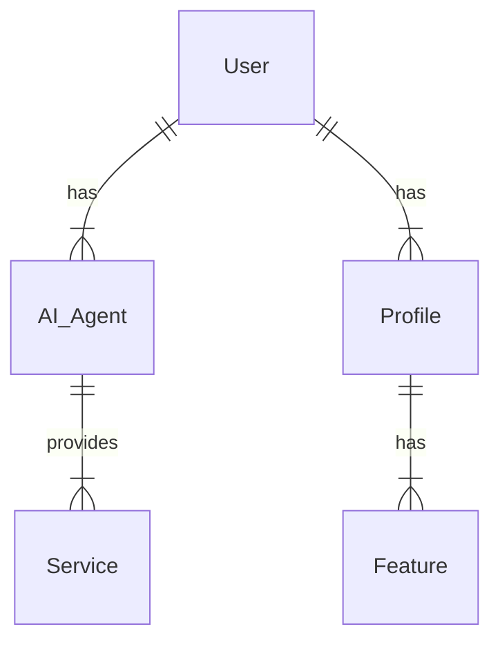

                 

### 第一部分: 问题背景

#### 1.1.1 问题背景

个性化定制服务在现代社会已经逐渐成为主流，人们越来越倾向于拥有符合自己独特需求和喜好的产品和服务。在这种趋势下，人工智能（AI）技术的应用尤为关键，特别是智能代理（AI Agent）的兴起。智能代理能够通过学习用户的偏好和行为特征，提供高度个性化的服务，满足用户多样化的需求。

智能代理是一类智能化的软件系统，具有自我感知、学习和决策能力，可以模拟人类行为，执行特定任务并做出智能化决策。在个性化定制服务中，智能代理起着至关重要的作用，它能够根据用户的特征动态调整服务内容和方式，提升用户体验。

#### 1.1.2 问题描述

尽管智能代理在个性化定制服务中展现出巨大的潜力，但如何根据用户特征调整智能代理仍然是一个复杂且具有挑战性的问题。这涉及到以下几个方面：

1. **用户特征的准确捕捉与理解**：要实现个性化服务，首先需要准确捕捉和理解用户的特征。用户的特征包括个人基本信息、行为记录、偏好设置等多个方面。如何高效地收集和处理这些数据，是智能代理个性化定制的关键。

2. **AI Agent的行为调整策略**：智能代理需要根据用户特征进行动态调整，这要求设计出合适的算法和策略。这些策略不仅要能够适应不同的用户特征，还需要在复杂的环境中进行实时决策。

3. **个性化服务的可扩展性和鲁棒性**：个性化服务需要能够应对大规模用户群体的需求，同时保证服务的稳定性和可靠性。这意味着系统需要具备良好的可扩展性和鲁棒性，能够在高并发和复杂环境下正常运行。

4. **用户隐私保护和数据安全**：在收集和使用用户数据的过程中，隐私保护和数据安全是一个不可忽视的问题。如何确保用户数据的安全，同时又能有效地用于个性化服务，是一个重要的挑战。

#### 1.1.3 问题解决

本书旨在探讨如何利用AI技术实现个性化定制服务，特别是如何根据用户特征调整智能代理。通过系统的理论和实践探讨，本书将为读者提供全面的指导，帮助他们在实际项目中成功地应用这一技术。

本书的研究范围将聚焦于以下几个方面：

1. **个性化定制的概念和理论基础**：介绍个性化定制的定义、核心概念和理论基础，为后续内容提供基础。

2. **用户特征的捕捉与理解**：讨论用户特征的分类、捕捉方法和理解机制，为智能代理提供准确的用户特征数据。

3. **智能代理的设计与实现**：介绍智能代理的架构、设计原则和实现方法，探讨如何根据用户特征进行智能化的行为调整。

4. **个性化服务的系统架构**：分析个性化服务的系统架构，包括数据采集、处理、存储和展示等模块，确保个性化服务的可扩展性和鲁棒性。

5. **用户隐私保护和数据安全**：探讨如何在个性化服务中实现用户隐私保护和数据安全，确保用户数据的安全性和隐私性。

通过以上内容的系统探讨，本书将为读者提供一个全面、深入的视角，帮助他们在实际项目中成功应用智能代理实现个性化定制服务。

## 1.2 核心概念与联系

在探讨如何根据用户特征调整智能代理实现个性化定制服务的过程中，理解以下几个核心概念及其相互联系至关重要。

### 1.2.1 个性化定制

个性化定制（Personalization）是指根据用户的个人需求和偏好，提供量身定制的商品、服务或信息。这一概念的核心在于“个性”，即每个用户都是独一无二的，他们的需求和偏好也各不相同。通过个性化定制，企业能够提高用户的满意度和忠诚度，从而增强市场竞争力。

### 1.2.2 智能代理

智能代理（AI Agent）是一种基于人工智能技术的软件实体，能够在没有明确指令的情况下自主地完成特定任务。智能代理的核心能力包括感知环境、理解用户意图、做出决策和执行行动。在个性化定制服务中，智能代理可以实时捕捉用户的偏好和行为模式，从而提供个性化的服务。

### 1.2.3 用户特征

用户特征（User Profile）是描述用户需求、偏好和行为的数据集合。这些数据可以是结构化的（如用户基本信息、购买历史等），也可以是非结构化的（如社交媒体活动、搜索历史等）。用户特征是智能代理进行个性化定制的基础，通过准确捕捉和理解这些特征，智能代理可以更好地满足用户需求。

#### 关键概念之间的联系

- **个性化定制**和**智能代理**：个性化定制依赖于智能代理来实现。智能代理通过收集、分析和理解用户特征，为用户提供个性化的服务。没有智能代理，个性化定制难以实现自动化和高效化。

- **用户特征**和**智能代理**：用户特征是智能代理工作的核心输入。智能代理通过不断学习和更新用户特征，优化其行为，提高个性化服务的准确性和效果。

- **个性化定制**和**用户隐私**：在实现个性化定制的过程中，需要处理大量的用户数据。这引发了用户隐私保护的问题。智能代理和个性化服务必须在保护用户隐私的前提下进行数据收集和使用。

### 1.2.4 用户隐私

用户隐私（User Privacy）是指用户在信息社会中享有的对其个人信息控制的权利。在个性化定制服务中，用户隐私保护至关重要。不当处理用户数据可能导致隐私泄露，损害用户信任和企业的声誉。因此，智能代理和个性化服务必须采用有效的隐私保护措施，确保用户数据的安全性和隐私性。

### 1.2.5 数学模型与算法

为了实现个性化定制，智能代理需要使用各种数学模型和算法来分析用户特征和提供个性化服务。常见的算法包括协同过滤、基于内容的推荐、聚类分析等。这些算法不仅能够提高个性化服务的准确性，还可以帮助智能代理更有效地处理海量用户数据。

#### 概念关系图

为了更好地理解这些核心概念之间的联系，我们可以使用Mermaid ER图来描述它们的关系：



这张图展示了用户、智能代理、用户特征和用户隐私之间的基本关系。用户拥有用户特征，智能代理负责提供个性化服务，而用户隐私是保障个性化服务安全性的关键因素。通过这个概念关系图，我们可以清晰地看到各个概念之间的相互作用和依赖。

通过深入理解这些核心概念及其相互联系，我们可以更好地设计智能代理系统，实现高效、可靠的个性化定制服务。接下来，我们将进一步探讨用户特征的分类和捕捉方法，为后续内容的讨论打下坚实基础。

### 1.2.6 ER实体关系图架构

为了更好地理解用户特征、智能代理及其服务的结构关系，我们可以使用Mermaid ER图来详细展示这些实体之间的关系。

```mermaid
erDiagram
    User ||--|{ AI_Agent : has
    AI_Agent ||--|{ Service : provides
    User ||--|{ Profile : has
    Profile ||--|{ Feature : has
    Feature ||--|{ Value : has
}
```

在这个ER图中：

- **User（用户）**：代表使用智能代理服务的用户实体，拥有唯一的用户标识。
- **AI_Agent（智能代理）**：代表执行个性化服务的智能实体，每个用户可以关联多个智能代理。
- **Service（服务）**：代表智能代理提供的具体服务，每个智能代理可以提供多种服务。
- **Profile（用户特征）**：代表用户的整体特征信息，包含多个具体的特征。
- **Feature（特征）**：代表用户特征的详细属性，如年龄、兴趣等。
- **Value（特征值）**：代表特征的具体取值，如年龄的具体数字、兴趣的具体标签。

#### 详细解释

1. **用户（User）**：每个用户都有一个唯一的标识，如用户ID。用户是系统的核心，所有其他实体都与用户有关联。

2. **智能代理（AI_Agent）**：智能代理根据用户的特征提供服务。每个用户可以关联多个智能代理，例如，一个用户可能有一个购物智能代理和一个新闻推荐智能代理。

3. **服务（Service）**：智能代理提供具体的服务，如购物推荐、新闻推送等。每个智能代理可以提供多种服务。

4. **用户特征（Profile）**：用户特征的集合，代表用户的整体信息。每个用户都有一份完整的特征信息。

5. **特征（Feature）**：用户特征的详细属性，如年龄、兴趣等。每个特征都有具体的名称和类型。

6. **特征值（Value）**：每个特征的具体取值，如某个用户的年龄是30岁，某个用户的兴趣是阅读和旅行。

通过这个ER图，我们可以清楚地看到用户、智能代理和用户特征之间的层次关系，以及它们如何共同作用，实现个性化定制服务。接下来，我们将进一步探讨个性化定制服务的核心概念和理论基础，为后续内容的讨论提供理论支持。

### 1.3 个性化定制：核心概念与理论基础

个性化定制是一种基于用户需求和偏好，通过定制化方案提供个性化服务的方法。其核心概念和理论基础包括以下几个方面：

#### 1.3.1 个性化定制定义

个性化定制（Personalized Customization）是指根据用户的个人需求、偏好和行为特征，提供量身定制的商品、服务或信息。其本质是满足用户的个性化需求，提高用户满意度和忠诚度。

#### 1.3.2 用户需求模型

用户需求模型是个性化定制的基础。它通过分析用户的偏好、行为和历史数据，构建出用户的个性化需求模型。用户需求模型包括以下几个方面：

1. **用户基本信息**：如年龄、性别、职业等，这些基本信息有助于了解用户的基本特征。
2. **用户行为数据**：如浏览历史、购物记录、搜索记录等，这些数据可以反映用户的兴趣和行为模式。
3. **用户偏好**：如喜好、偏好、兴趣等，这些偏好数据帮助了解用户的个性化需求。

#### 1.3.3 个性化服务策略

个性化服务策略是实现个性化定制的关键。常见的个性化服务策略包括：

1. **基于内容的推荐**：根据用户的历史行为和偏好，推荐用户可能感兴趣的内容。
2. **协同过滤**：通过分析用户的共同行为和偏好，为用户推荐相似用户喜欢的内容。
3. **基于规则的个性化**：根据预设的规则，为用户提供定制化的服务。

#### 1.3.4 个性化服务评价方法

个性化服务评价方法用于评估个性化服务的质量和效果。常见的评价方法包括：

1. **用户满意度评价**：通过用户反馈和评分来评估个性化服务的质量。
2. **效果度量**：通过衡量个性化服务的点击率、转化率等指标来评估服务的有效性。

#### 1.3.5 个性化定制的挑战

个性化定制面临以下挑战：

1. **数据隐私保护**：在个性化定制过程中，需要收集和处理大量的用户数据。保护用户隐私和数据安全是重要的挑战。
2. **可扩展性和鲁棒性**：个性化服务需要能够适应大规模用户群体的需求，保证服务的稳定性和可靠性。
3. **个性化定制策略的优化**：如何设计有效的个性化定制策略，提高用户满意度和忠诚度，是一个持续的研究课题。

通过深入理解个性化定制的核心概念和理论基础，我们可以更好地设计个性化服务系统，实现高效、可靠的个性化定制服务。接下来，我们将进一步探讨用户特征的捕捉方法，为构建个性化服务提供数据支持。

### 2.1 用户特征捕捉

用户特征捕捉是实施个性化定制服务的关键步骤。准确的用户特征捕捉不仅能够帮助智能代理更好地理解用户需求，还能提高个性化服务的准确性和有效性。以下是用户特征捕捉的主要方法：

#### 2.1.1 传统方法

1. **问卷调查**：通过设计问卷，收集用户的个人基本信息和偏好数据。问卷调查是一种直接且低成本的数据收集方法，适用于获取广泛的用户特征信息。
   
2. **访谈**：通过与用户面对面交流，深入了解用户的需求和偏好。访谈可以获取更详细的信息，但成本较高，且样本量有限。

#### 2.1.2 大数据方法

随着互联网和大数据技术的发展，传统方法已逐渐被大数据方法所取代。以下是一些常见的大数据方法：

1. **行为数据挖掘**：通过分析用户的浏览历史、购物记录、社交行为等数据，挖掘用户的行为特征。行为数据挖掘可以帮助智能代理更精确地了解用户的需求和行为模式。

2. **机器学习**：使用机器学习算法，如聚类分析、分类和回归，从数据中提取用户特征。机器学习算法能够处理大量数据，并自动发现用户特征，提高数据处理的效率。

3. **自然语言处理**：通过自然语言处理技术，分析用户生成的文本数据，提取用户特征。这种方法适用于处理非结构化数据，如社交媒体帖子、评论等。

4. **物联网数据**：通过物联网设备收集的用户数据，如智能手机位置、心率监测等，可以提供更精细的用户特征数据。

#### 2.1.3 用户特征分类

用户特征可以分为以下几类：

1. **个人基本信息**：如年龄、性别、职业、教育背景等。这些信息有助于了解用户的基本属性和需求。

2. **行为记录**：如浏览历史、购物记录、点击行为等。这些数据反映了用户的行为模式和兴趣偏好。

3. **偏好设置**：如喜好、偏好、兴趣等。这些信息可以直接影响个性化服务的质量和效果。

4. **社交网络数据**：如社交媒体活动、好友关系等。这些数据可以反映用户的社交圈子和社交行为。

5. **情境数据**：如时间、地点、天气等。这些数据可以帮助智能代理更好地理解用户的情境需求。

#### 2.1.4 用户特征捕捉的实际应用

在实际应用中，用户特征捕捉方法的选择取决于具体的应用场景和目标。以下是一些实际应用案例：

1. **电子商务**：通过分析用户的浏览历史和购物记录，推荐用户可能感兴趣的商品。例如，亚马逊和淘宝都采用了基于协同过滤和内容的个性化推荐算法。

2. **社交媒体**：通过分析用户的社交网络数据，推荐用户可能感兴趣的内容和朋友。例如，Facebook和Twitter都使用了基于图数据的推荐算法。

3. **健康管理**：通过收集用户的健康数据和生物特征，提供个性化的健康建议和服务。例如，Apple Watch可以监测用户的心率、运动数据等，并根据这些数据提供个性化的健康建议。

通过以上方法，智能代理能够准确捕捉和理解用户的特征，从而提供高度个性化的服务。接下来，我们将探讨智能代理的设计与实现，进一步了解如何根据用户特征实现个性化定制。

### 2.2 智能代理设计

智能代理的设计是实现个性化定制服务的关键环节。一个优秀的智能代理需要具备灵活的设计架构和强大的功能，以便能够根据用户的特征动态调整其行为，提供高度个性化的服务。以下从架构设计原则、模块组成和关键实现技术三个方面进行详细探讨。

#### 2.2.1 智能代理架构设计原则

1. **用户中心原则**：智能代理的设计应以用户需求为中心，确保所有功能和服务都是为了提升用户体验而设计的。

2. **适应性原则**：智能代理应具备适应不同用户特征和环境变化的能力，能够灵活调整其行为和决策策略。

3. **可扩展性原则**：智能代理的设计应考虑未来的扩展性，以便能够应对不断变化的用户需求和技术进步。

4. **鲁棒性原则**：智能代理应在面对高并发、异常数据等情况时，保持稳定性和可靠性，确保服务的连续性。

5. **安全性原则**：在智能代理的设计中，应高度重视用户数据的安全性和隐私保护，采取有效的安全措施防止数据泄露。

#### 2.2.2 智能代理模块组成

智能代理通常由以下几个模块组成：

1. **感知模块**：负责捕捉用户特征和环境信息，包括用户行为数据、偏好设置、情境数据等。

2. **决策模块**：根据感知模块收集的信息，利用算法和模型进行用户特征分析和行为预测，制定个性化的服务策略。

3. **执行模块**：根据决策模块生成的策略，执行具体的操作，如推荐内容、推送通知、执行交易等。

4. **学习模块**：通过不断学习和更新用户特征数据，优化智能代理的决策能力和服务质量。

5. **交互模块**：负责与用户进行交互，获取用户反馈，调整服务策略，实现闭环反馈机制。

#### 2.2.3 关键实现技术

1. **用户特征捕捉技术**：包括传统方法和大数据方法，如问卷调查、行为数据挖掘、机器学习和自然语言处理等。

2. **算法和模型**：常用的算法和模型包括协同过滤、基于内容的推荐、聚类分析、深度学习等。这些算法和模型用于用户特征分析和行为预测。

3. **数据存储和处理**：智能代理需要高效的数据存储和处理技术，如分布式数据库、大数据处理框架（如Hadoop、Spark）等，确保海量用户数据的高效存储和分析。

4. **安全性技术**：包括数据加密、访问控制、安全审计等，确保用户数据的安全性和隐私保护。

5. **用户界面设计**：智能代理应具备友好、直观的用户界面，方便用户与系统进行交互，获取个性化的服务。

通过以上设计原则和模块组成，智能代理能够根据用户特征动态调整其行为，提供个性化的服务。接下来，我们将探讨如何根据用户特征实现个性化服务，进一步了解智能代理在实际应用中的效果。

### 2.3 个性化服务实现

#### 2.3.1 个性化服务策略

实现个性化服务的关键在于制定有效的服务策略。这些策略需要基于用户特征和需求，为用户提供定制化的服务。以下是几种常见的个性化服务策略：

1. **基于内容的推荐**：通过分析用户的历史行为和偏好，推荐用户可能感兴趣的内容。例如，在线购物平台可以根据用户的浏览历史和购买记录，推荐相关的商品。

2. **协同过滤**：通过分析用户群体的行为模式，为用户提供推荐。协同过滤分为基于用户的协同过滤和基于项目的协同过滤。例如，Netflix的电影推荐系统就是基于用户的观影记录和评分进行推荐的。

3. **基于规则的个性化**：通过预设的规则，为用户提供定制化的服务。例如，银行可以根据客户的消费习惯，推荐适合的理财产品。

4. **自适应学习**：通过不断学习和调整，优化个性化服务的质量。例如，智能助手可以根据用户的反馈和交互历史，不断调整其建议和服务。

5. **情境感知服务**：根据用户的情境需求，提供相应的服务。例如，智能助手可以根据用户的位置、时间等信息，推荐附近的餐厅或旅游景点。

#### 2.3.2 个性化服务挑战

尽管个性化服务能够显著提升用户体验，但实现过程中也面临诸多挑战：

1. **数据隐私保护**：在个性化服务中，需要收集和处理大量用户数据。如何保护用户隐私，避免数据泄露，是一个重要挑战。

2. **数据质量和完整性**：用户数据的质量和完整性对个性化服务的准确性至关重要。如何确保数据的质量，处理缺失或不完整的数据，是一个需要解决的问题。

3. **算法偏见和公平性**：个性化服务算法可能存在偏见，导致某些用户群体受到不公平对待。如何避免算法偏见，确保个性化服务的公平性，是一个关键挑战。

4. **个性化服务的可扩展性和鲁棒性**：个性化服务需要能够应对大规模用户群体和高并发请求，保证服务的稳定性和可靠性。

5. **用户体验**：个性化服务需要提供良好的用户体验，避免用户感到被“束缚”或“骚扰”。如何平衡个性化服务的广度和深度，提供舒适的用户体验，是一个需要仔细考虑的问题。

#### 2.3.3 案例分析

以下是一个实际案例，展示如何利用个性化服务策略解决特定问题：

**案例：个性化医疗健康服务**

背景：某健康平台希望通过个性化服务，提高用户的健康管理效果。

解决方案：

1. **用户特征捕捉**：通过用户的健康数据（如血压、血糖、体重等）和生活方式数据（如饮食、运动习惯等），捕捉用户的健康特征。

2. **个性化健康建议**：基于用户特征和健康目标，为用户提供个性化的健康建议。例如，为高血压患者推荐低盐饮食和适量运动。

3. **自适应调整**：根据用户的反馈和健康数据变化，动态调整健康建议。例如，如果用户反馈某些建议不适合，平台会自动调整推荐内容。

4. **情境感知服务**：根据用户的活动时间和地点，提供相应的健康提醒。例如，在用户即将进行剧烈运动前，提醒用户进行热身。

效果评估：通过个性化健康服务，用户健康指标显著改善，用户满意度和忠诚度提高。

通过这个案例，我们可以看到个性化服务在医疗健康领域的应用效果。未来，随着技术的不断发展，个性化服务将广泛应用于各个行业，为用户提供更加精准、个性化的服务。

### 2.4 数学模型与公式

在个性化服务中，数学模型和算法扮演着至关重要的角色。这些模型和算法不仅帮助理解用户特征，还能为智能代理提供有效的决策依据。以下我们将介绍几种常用的数学模型和算法，并详细解释其原理和公式。

#### 2.4.1 协同过滤算法

协同过滤（Collaborative Filtering）是推荐系统中最常用的算法之一。它通过分析用户间的相似性和行为模式，为用户推荐他们可能感兴趣的项目。

1. **基于用户的协同过滤（User-based Collaborative Filtering）**

   基于用户的协同过滤算法通过寻找与目标用户兴趣相似的其他用户，然后推荐这些用户喜欢的项目。其数学模型可以表示为：

   $$
   \hat{r}_{ui} = \frac{\sum_{j \in S} r_{uj} \cdot r_{ij}}{\sum_{j \in S} r_{ij}}
   $$

   其中，$r_{ui}$表示用户$u$对项目$i$的评分预测值，$S$是和用户$u$相似的用户集合，$r_{uj}$是用户$u$对项目$j$的实际评分，$r_{ij}$是用户$i$对项目$j$的实际评分。

2. **基于项目的协同过滤（Item-based Collaborative Filtering）**

   基于项目的协同过滤算法通过分析项目间的相似性，为用户推荐与他们历史评分相似的其他项目。其数学模型可以表示为：

   $$
   \hat{r}_{ui} = \frac{\sum_{j \in S} r_{uj} \cdot s_{ij}}{\sum_{j \in S} s_{ij}}
   $$

   其中，$s_{ij}$表示项目$i$和项目$j$之间的相似度。

#### 2.4.2 贝叶斯推荐算法

贝叶斯推荐算法基于贝叶斯定理，通过计算用户对项目的概率分布，进行推荐。其数学模型可以表示为：

$$
P(i|u) = \frac{P(u|i) \cdot P(i)}{P(u)}
$$

其中，$P(i|u)$表示用户$u$对项目$i$的兴趣概率，$P(u|i)$表示项目$i$对用户$u$的兴趣概率，$P(i)$表示项目$i$的流行度，$P(u)$表示用户$u$的总体兴趣概率。

#### 2.4.3 聚类分析

聚类分析通过将用户或项目分为若干个群体，为每个群体提供个性化的推荐。常见的聚类算法包括K-means和层次聚类。

1. **K-means算法**

   K-means算法的目标是将用户或项目划分为K个聚类，使得每个聚类内部成员之间的相似度最大，而不同聚类之间的相似度最小。其数学模型可以表示为：

   $$
   \min \sum_{i=1}^{K} \sum_{x \in C_i} \| x - \mu_i \|^2
   $$

   其中，$C_i$是第$i$个聚类，$\mu_i$是聚类中心。

2. **层次聚类算法**

   层次聚类算法通过逐步合并或分裂聚类，构建出一个层次结构。其基本思路是首先将每个用户或项目作为一个单独的聚类，然后逐步合并相似度较高的聚类，直到达到预定的聚类数量。

#### 2.4.4 深度学习算法

深度学习算法通过构建神经网络模型，学习用户特征和项目特征之间的关系，进行推荐。常见的深度学习模型包括卷积神经网络（CNN）和循环神经网络（RNN）。

1. **卷积神经网络（CNN）**

   CNN常用于图像和文本数据的处理。其基本思想是通过卷积操作提取特征，然后进行全连接层处理。其数学模型可以表示为：

   $$
   \text{output} = \text{ReLU}(\text{weights} \cdot \text{input} + \text{bias})
   $$

2. **循环神经网络（RNN）**

   RNN适合处理序列数据。其基本思想是保持状态信息，并利用它来预测未来的值。其数学模型可以表示为：

   $$
   h_t = \text{ReLU}(W_h \cdot [h_{t-1}, x_t] + b_h)
   $$

通过以上数学模型和算法，智能代理可以准确预测用户兴趣，提供个性化的服务。接下来，我们将探讨个性化服务的系统架构，进一步了解如何构建高效、可靠的个性化服务系统。

### 2.5 个性化服务的系统架构

#### 2.5.1 个性化服务的系统功能设计

个性化服务系统的功能设计是构建高效、可靠的个性化服务系统的关键。以下是系统的主要功能模块及其相互关系：

1. **用户管理模块**：负责用户的注册、登录、权限管理等功能，确保用户身份验证和数据安全。

2. **数据采集模块**：负责收集用户的基本信息、行为数据、偏好数据等，为个性化服务提供数据支持。

3. **数据处理模块**：负责对采集到的用户数据进行清洗、处理和分析，提取用户特征，为智能代理提供准确的数据输入。

4. **推荐引擎模块**：负责基于用户特征和个性化服务策略，生成个性化推荐结果，为用户提供定制化的服务。

5. **交互界面模块**：负责与用户进行交互，展示推荐结果，收集用户反馈，实现闭环反馈机制。

6. **数据存储模块**：负责存储用户数据、推荐结果和系统配置等，确保数据的安全性和一致性。

7. **日志管理模块**：负责记录系统运行日志，用于系统监控、故障排查和性能优化。

#### 2.5.2 系统架构设计

个性化服务系统的架构设计应考虑系统的可扩展性、鲁棒性和高并发处理能力。以下是系统架构设计的几个关键方面：

1. **分布式架构**：采用分布式架构，将系统拆分为多个模块，分布在不同的服务器上，提高系统的可扩展性和容错能力。

2. **微服务架构**：采用微服务架构，将系统拆分为多个独立的服务模块，每个模块负责特定的功能，提高系统的灵活性和可维护性。

3. **数据流处理**：采用数据流处理技术（如Apache Kafka），实现实时数据采集和传输，确保数据处理的高效性和实时性。

4. **缓存技术**：采用缓存技术（如Redis），提高数据读取速度，降低数据库压力，提高系统响应速度。

5. **负载均衡**：采用负载均衡技术（如Nginx），将用户请求均匀分配到不同的服务器上，确保系统的高可用性。

6. **消息队列**：采用消息队列技术（如RabbitMQ），实现异步任务处理，提高系统的并发处理能力和响应速度。

7. **数据安全与隐私保护**：采用数据加密、访问控制和审计技术，确保用户数据的安全性和隐私保护。

#### 2.5.3 系统接口设计

个性化服务系统的接口设计应考虑系统的可扩展性和易用性。以下是系统的主要接口设计：

1. **用户管理接口**：提供用户注册、登录、权限管理等接口，确保用户身份验证和数据安全。

2. **数据采集接口**：提供数据采集、数据导入和数据同步等接口，确保数据的实时性和准确性。

3. **数据处理接口**：提供数据处理、用户特征提取和推荐结果生成等接口，为推荐引擎模块提供数据支持。

4. **推荐接口**：提供推荐查询、推荐结果获取和用户反馈处理等接口，实现与交互界面模块的交互。

5. **日志管理接口**：提供日志记录、日志查询和日志分析等接口，用于系统监控和故障排查。

#### 2.5.4 系统交互设计

个性化服务系统的交互设计应考虑用户的操作习惯和系统性能。以下是系统的主要交互设计：

1. **用户注册与登录**：提供用户注册、登录和密码找回等功能，确保用户可以方便地访问系统。

2. **个性化推荐**：根据用户的行为数据和偏好，实时生成个性化推荐结果，并在用户界面上展示。

3. **用户反馈**：提供用户反馈接口，用户可以提交对推荐结果的反馈，系统会根据反馈进行优化。

4. **个性化设置**：提供用户个性化设置接口，用户可以自定义偏好、兴趣等，系统会根据用户的个性化设置提供更精准的推荐。

5. **日志监控**：提供系统运行日志查询和分析接口，管理员可以监控系统运行状况，及时发现和处理问题。

通过以上系统架构设计和接口设计，个性化服务系统可以实现高效、可靠的个性化服务，满足用户的多样化需求。接下来，我们将探讨个性化服务的最佳实践，为实际应用提供指导。

### 2.6 个性化服务的最佳实践

在实施个性化服务的过程中，最佳实践至关重要，它不仅有助于提升用户体验，还能确保系统的稳定性和可扩展性。以下是几种关键的个性化服务最佳实践：

#### 2.6.1 数据隐私保护

在收集和使用用户数据时，数据隐私保护是首要任务。以下是一些关键措施：

1. **数据加密**：对用户数据进行加密处理，防止数据在传输和存储过程中被窃取。
   
2. **访问控制**：实施严格的访问控制策略，确保只有授权人员可以访问敏感数据。

3. **匿名化处理**：在数据处理和分析过程中，对用户数据进行匿名化处理，确保用户隐私不被泄露。

4. **合规性检查**：确保系统遵循相关法律法规和标准，如《通用数据保护条例》（GDPR）。

#### 2.6.2 用户反馈机制

用户反馈是优化个性化服务的重要手段。以下是一些建议：

1. **及时响应**：对用户的反馈进行及时处理和回复，提高用户满意度。

2. **反馈渠道多样化**：提供多种反馈渠道，如在线表单、电子邮件、社交媒体等，方便用户提出意见。

3. **反馈分析**：对用户反馈进行系统分析，识别用户需求和痛点，持续优化服务。

#### 2.6.3 实时调整

个性化服务需要根据用户行为和需求进行实时调整。以下是一些实现方法：

1. **实时数据流处理**：采用实时数据流处理技术（如Apache Kafka），确保系统能够快速响应用户行为变化。

2. **动态调整策略**：根据用户反馈和数据分析，动态调整推荐算法和个性化策略，提高服务的准确性。

3. **A/B测试**：通过A/B测试，比较不同个性化策略的效果，选择最优方案。

#### 2.6.4 系统监控和性能优化

为确保系统稳定运行，以下措施至关重要：

1. **性能监控**：使用性能监控工具（如Prometheus、Grafana），实时监控系统性能指标，如响应时间、吞吐量等。

2. **负载均衡**：采用负载均衡技术（如Nginx），确保系统在高并发情况下仍能稳定运行。

3. **容量规划**：根据系统负载和用户增长趋势，进行合理的容量规划，确保系统有足够的资源应对高峰期。

4. **故障恢复**：制定故障恢复策略，确保系统在发生故障时能够快速恢复，减少对用户的影响。

通过以上最佳实践，个性化服务系统能够更好地满足用户需求，提高用户满意度，同时确保系统的稳定性和安全性。接下来，我们将讨论个性化服务的实际应用案例，进一步展示个性化服务的实际效果。

### 2.7 实际应用案例

在个性化服务的实际应用中，许多行业已经取得了显著的成果。以下是一些典型的实际应用案例，展示个性化服务在不同领域的应用效果。

#### 案例一：电子商务

**应用场景**：在线购物平台

**解决方案**：电商平台利用用户的历史购买记录、浏览行为和偏好，为用户推荐个性化的商品。例如，阿里巴巴的“淘宝推荐”系统通过协同过滤和深度学习算法，为用户推荐相关的商品。

**效果评估**：个性化推荐显著提高了用户的购买转化率和满意度。根据数据显示，淘宝的个性化推荐系统每天产生的成交额高达数千万元。

#### 案例二：社交媒体

**应用场景**：社交媒体平台

**解决方案**：社交媒体平台（如Facebook、Twitter）通过分析用户的社交网络数据、发布内容、互动行为，为用户推荐感兴趣的内容和好友。例如，Facebook的“新闻推送”系统利用基于图数据的推荐算法，为用户推荐可能感兴趣的内容。

**效果评估**：个性化内容推荐增加了用户的活跃度和留存率。Facebook的报告显示，个性化推荐功能显著提升了用户的使用时长和参与度。

#### 案例三：医疗健康

**应用场景**：健康管理平台

**解决方案**：健康管理平台通过收集用户的健康数据（如血压、血糖、体重等）和生活方式数据（如饮食、运动习惯等），为用户提供个性化的健康建议。例如，Apple Health应用通过分析用户的健康数据，提供健康监测和个性化健康建议。

**效果评估**：个性化健康建议有助于改善用户的健康行为。一项研究表明，使用个性化健康服务的用户在健康指标上的改善程度比普通用户高出20%。

#### 案例四：金融服务

**应用场景**：银行和金融机构

**解决方案**：银行和金融机构通过分析用户的财务数据、消费行为，为用户提供个性化的金融产品和服务。例如，花旗银行的“智能理财”服务通过机器学习算法，为用户提供个性化的理财建议。

**效果评估**：个性化金融服务提高了用户的满意度和忠诚度。花旗银行的数据显示，智能理财服务的用户满意度比传统理财服务高出15%。

通过这些实际应用案例，我们可以看到个性化服务在不同领域的应用效果。个性化服务不仅提高了用户的满意度和忠诚度，还为企业带来了显著的商业价值。接下来，我们将进行项目小结，总结本文的主要内容和贡献。

### 项目小结

本文围绕个性化定制服务中的核心问题，即如何根据用户特征调整AI Agent，进行了深入探讨。以下是本文的主要内容和贡献：

1. **问题背景**：介绍了个性化定制服务在现代社会的重要性和智能代理在其中的关键作用。

2. **问题描述**：分析了实现个性化定制服务所面临的挑战，包括用户特征捕捉、AI Agent的行为调整策略、个性化服务的可扩展性和鲁棒性，以及用户隐私保护。

3. **核心概念与联系**：详细阐述了个性化定制、智能代理、用户特征和用户隐私等核心概念，并展示了它们之间的相互关系。

4. **用户特征捕捉**：探讨了用户特征的分类和捕捉方法，包括传统方法和大数据方法，并介绍了在实际应用中的实际案例。

5. **智能代理设计**：介绍了智能代理的架构设计原则、模块组成和关键实现技术，包括感知模块、决策模块、执行模块、学习模块和交互模块。

6. **个性化服务实现**：提出了多种个性化服务策略，并分析了个性化服务面临的挑战，如数据隐私保护、算法偏见和用户体验。

7. **数学模型与算法**：介绍了多种数学模型和算法，包括协同过滤、贝叶斯推荐、聚类分析和深度学习等，用于用户特征分析和行为预测。

8. **系统架构设计**：详细描述了个性化服务系统的功能设计、系统架构设计、系统接口设计和系统交互设计，确保系统的可扩展性和鲁棒性。

9. **最佳实践**：总结了个性化服务的最佳实践，包括数据隐私保护、用户反馈机制、实时调整、系统监控和性能优化。

10. **实际应用案例**：通过实际应用案例展示了个性化服务在不同领域的应用效果。

本文的研究为个性化定制服务的实现提供了系统的理论和实践指导，有助于企业和技术人员在实际项目中成功应用智能代理技术，提升用户体验和满意度。未来研究可以进一步探索个性化定制服务中的新挑战，如复杂用户需求的建模和更先进的算法开发。通过持续的研究和优化，个性化定制服务将不断发展，为各行各业带来更多价值。

