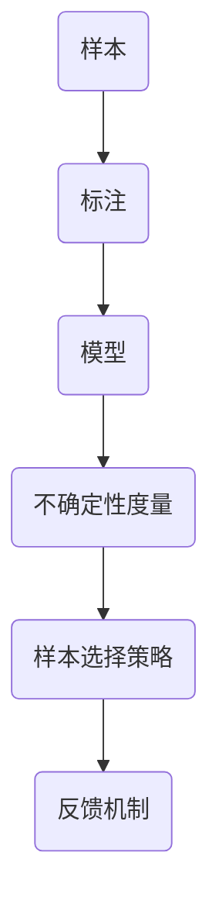
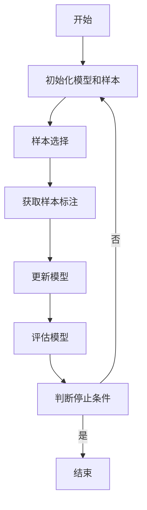
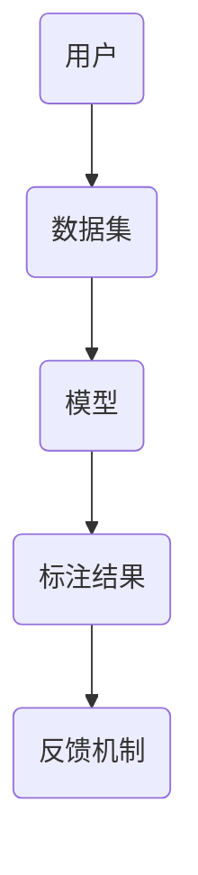
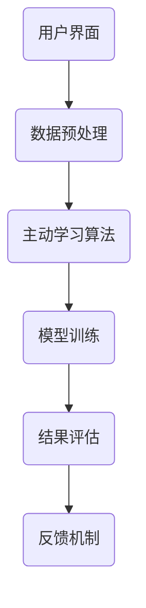
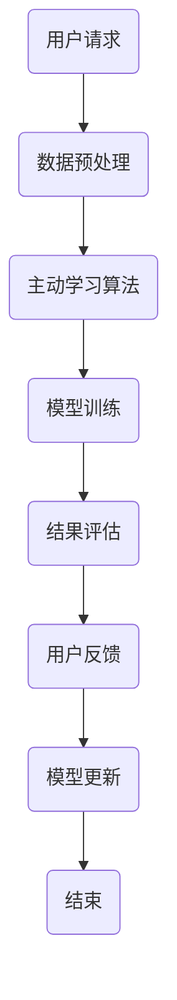

                 

### 第一部分：引言

#### 1.1 问题背景

**1.1.1 人工智能的发展**

人工智能（AI）作为计算机科学的前沿领域，近年来取得了飞速的发展。从最初的规则系统，到基于统计机器学习的模型，再到如今深度学习时代的兴起，AI技术的进步已经深刻地影响了各行各业，从工业自动化、医疗诊断到自动驾驶、智能客服等，AI的应用场景无处不在。

**1.1.2 AI Agent的学习问题**

随着AI技术的广泛应用，AI Agent（即能够执行特定任务的智能体）的研究也日益受到关注。AI Agent需要具备自主学习和适应环境变化的能力，但传统的机器学习方法，尤其是在大量数据集中进行训练的被动学习方式，存在一些固有的问题。首先，大量的数据标注工作既耗时又昂贵，特别是在高维数据和高复杂度的任务中。其次，被动学习方式往往依赖于全量数据的模型训练，数据量的增加会导致计算时间和存储需求的指数级增长，这给实际应用带来了巨大的挑战。

**1.1.3 主动学习的概念**

为了解决上述问题，主动学习（Active Learning）作为一种优化学习过程的方法，应运而生。主动学习是一种有选择地获取信息的机器学习方法，它允许学习算法根据当前模型的表现，主动选择最有价值的数据进行标注。相比被动学习，主动学习通过更有效地利用有限的标注资源，提高了学习效率，减少了数据标注成本。

#### 1.2 问题描述

**1.2.1 传统学习方法与挑战**

传统学习方法，尤其是基于大规模数据集的训练，存在以下几个主要挑战：

1. **数据标注成本高**：特别是在高维数据集或需要专家知识进行标注的情况下，标注数据的成本非常高。
2. **计算资源需求大**：大规模数据集的训练需要大量的计算资源和时间，特别是在处理复杂模型时，计算成本更加显著。
3. **模型泛化能力受限**：过度依赖大量数据可能导致模型过拟合，降低其在未见过的数据上的表现。

**1.2.2 主动学习的必要性**

主动学习能够通过选择最相关的数据进行标注，从而显著降低数据标注的成本。它能够提高学习效率，减少模型训练所需的数据量，这对于数据稀缺或数据获取成本高昂的场景尤为重要。此外，主动学习还可以提高模型在未见过的数据上的泛化能力，从而提升实际应用的性能。

**1.2.3 主动学习的重要性**

主动学习的重要性体现在以下几个方面：

1. **资源优化**：通过主动选择标注样本，优化了标注资源的利用效率。
2. **效率提升**：减少了模型训练所需的数据量，降低了计算时间。
3. **性能增强**：提高了模型在新数据上的表现，增强了模型的泛化能力。

#### 1.3 问题解决

**1.3.1 主动学习的基本原理**

主动学习的基本原理是通过迭代过程，逐步选择最不确定的样本进行标注，然后更新模型，并重复这个过程。这个过程包括以下几个步骤：

1. **样本选择**：根据当前模型的不确定性或误分类率来选择样本。
2. **标注获取**：获取所选样本的标注信息。
3. **模型更新**：使用新获取的标注数据更新模型。
4. **重复迭代**：重复上述步骤，直到满足停止条件。

**1.3.2 主动学习的关键因素**

主动学习的关键因素包括：

1. **样本选择策略**：选择策略决定了哪些样本更有价值进行标注。常见的策略包括不确定性抽样、误分类率抽样和基于聚类的方法。
2. **模型质量**：模型的准确性和泛化能力直接影响到主动学习的效果。
3. **标注质量**：高质量的数据标注对于模型的准确性至关重要。
4. **反馈机制**：反馈机制的效率直接影响到主动学习的循环迭代速度。

**1.3.3 主动学习在AI Agent中的应用**

主动学习在AI Agent中的应用，使得AI Agent能够更加高效地学习和适应环境。例如，在机器人学习中，主动学习可以帮助机器人更快速地适应不同的工作环境和任务需求；在医疗诊断中，主动学习可以帮助医生更精准地诊断疾病，提高诊断效率。

#### 1.4 边界与外延

**1.4.1 主动学习的适用范围**

主动学习适用于以下场景：

1. **数据稀缺**：在数据获取成本高昂或数据量有限的场景中，主动学习能够更有效地利用有限的标注资源。
2. **高维数据**：在高维数据集的标注过程中，主动学习能够通过选择最相关特征的数据进行标注，提高学习效率。
3. **复杂模型**：在处理复杂模型时，主动学习可以减少模型训练所需的数据量，降低计算成本。

**1.4.2 主动学习的限制**

主动学习的限制包括：

1. **数据依赖**：主动学习依赖于初始样本的选择，如果初始样本选择不当，可能导致学习效果不佳。
2. **标注成本**：虽然主动学习能够降低数据标注成本，但在某些场景下，标注成本仍然可能较高。
3. **计算资源**：主动学习过程可能需要大量的计算资源，尤其是在处理大规模数据集时。

**1.4.3 主动学习的未来发展**

随着人工智能技术的不断进步，主动学习未来发展的方向包括：

1. **算法优化**：研究更加高效和鲁棒的主动学习算法，提高学习效率和模型准确性。
2. **跨领域应用**：探索主动学习在不同领域的应用，如自然语言处理、计算机视觉等。
3. **数据隐私**：在保护数据隐私的前提下，研究如何在有限的标注数据上实现高效的主动学习。

#### 1.5 本章小结

本文引言部分首先介绍了人工智能的发展背景和AI Agent的学习问题，然后提出了主动学习的概念和其在优化学习效率中的重要性。接下来，探讨了主动学习的基本原理、关键因素以及应用前景，并指出了主动学习的适用范围和未来发展潜力。本章为后续对主动学习深入探讨奠定了基础。

# 第二部分：核心概念

#### 2.1 核心概念原理

**2.1.1 主动学习的基本概念**

主动学习是一种机器学习方法，通过迭代地选择最有价值的数据进行标注，以优化学习过程。与传统的被动学习（Passive Learning）相比，主动学习不仅依赖于初始数据集，还通过策略性地选择样本来指导数据标注过程。

**2.1.2 主动学习的理论基础**

主动学习的理论基础主要基于概率论和信息论。概率论为不确定性提供了量化方法，信息论则关注于信息的最优化利用。主动学习通过衡量数据对模型预测不确定性的贡献来选择样本，从而最大化信息增益。

**2.1.3 主动学习的核心要素**

主动学习的核心要素包括：

1. **样本选择策略**：决定了哪些样本最有价值进行标注。常见的策略包括不确定性抽样、误分类率抽样和基于聚类的方法。
2. **模型更新**：使用新获取的标注数据更新模型，以逐步提高模型的准确性。
3. **标注质量**：高质量的数据标注对于模型的准确性至关重要。
4. **反馈机制**：反馈机制的效率直接影响到主动学习的循环迭代速度。

#### 2.2 概念属性特征对比

| 概念         | 特征1                         | 特征2                         | 特征3                         |
|--------------|------------------------------|------------------------------|------------------------------|
| 传统学习     | 全量数据集训练                | 高计算成本                    | 低标注效率                    |
| 被动学习     | 数据标注依赖高量数据集        | 数据标注成本高                | 学习效率较低                  |
| 主动学习     | 样本选择策略指导标注          | 标注成本显著降低              | 学习效率显著提升              |

**2.3 ER实体关系图**

**2.4 本章小结**

本部分介绍了主动学习的基本概念、理论基础以及核心要素，并通过与被动学习的对比，展示了主动学习的优势和特点。此外，ER实体关系图直观地展示了主动学习过程中的关键实体及其关系，为进一步理解主动学习提供了直观的框架。

# 第三部分：算法原理

#### 3.1 算法原理讲解

**3.1.1 主动学习算法概述**

主动学习算法是一种迭代式的学习过程，通过选择不确定度较高的样本进行标注，然后更新模型，并重复此过程，以优化学习效率。其基本流程包括样本选择、模型更新和评估三个主要阶段。

**3.1.2 选择策略**

主动学习的核心在于样本选择策略。常见的策略包括以下几种：

1. **随机抽样**：随机选择样本进行标注，不考虑样本的具体特征或模型的不确定性。
2. **误分类率抽样**：根据模型对当前数据集的误分类率来选择样本，误分类率越高的样本越有可能被选中。
3. **不确定性抽样**：根据模型预测的不确定性来选择样本，不确定性越高的样本越有可能被选中。

**3.1.2.1 随机抽样**

随机抽样是最简单的一种策略，它不依赖于模型的状态，随机选择一部分样本进行标注。这种方法的优势在于实现简单，计算成本低，但缺点在于无法充分利用已有知识，可能导致学习效率较低。

**3.1.2.2 误分类率抽样**

误分类率抽样策略基于模型对现有数据的预测结果，选择误分类率较高的样本进行标注。这种方法能够有效减少错误分类的样本，提高模型的整体性能。然而，它可能忽略了一些虽然未分类错误但不确定性较高的样本。

**3.1.2.3 不确定性抽样**

不确定性抽样策略根据模型预测的不确定性来选择样本。不确定性越高的样本，模型对其预测越不自信，因此更可能被选中进行标注。这种方法能够充分利用模型的现有知识，选择最具信息量的样本，从而提高学习效率。

**3.1.3 学习算法**

主动学习算法通常结合传统的机器学习算法，如支持向量机（SVM）、决策树和神经网络等。选择何种学习算法取决于具体的应用场景和数据特点。

**3.1.3.1 传统学习算法**

传统学习算法通常在大规模数据集上进行训练，如支持向量机（SVM）和决策树等。这些算法在数据量大时表现良好，但无法充分利用主动学习的特点，即通过选择性标注提高学习效率。

**3.1.3.2 主动学习算法**

主动学习算法结合了传统学习算法和样本选择策略，通过迭代选择最不确定的样本进行标注，然后更新模型。这种算法能够显著提高学习效率，减少数据标注成本。常见的主动学习算法包括Uncertainty Sampling、Query-by-Committee和Active Learning with Co-Training等。

#### 3.2 算法流程图

**3.3 数学模型和公式**

在主动学习算法中，常用的数学模型包括损失函数、不确定性度量等。以下是一个简单的损失函数示例：

$$
L(\theta; x, y) = -\sum_{i} y_i \log(\hat{y}_i)
$$

其中，$L$ 表示损失函数，$\theta$ 表示模型参数，$x$ 表示样本特征，$y$ 表示样本标签，$\hat{y}_i$ 表示模型对第 $i$ 个样本的预测概率。

**3.4 举例说明**

**3.4.1 随机抽样示例**

假设有一个分类问题，模型需要从100个未标注样本中选择10个进行标注。使用随机抽样策略，可以简单地随机选择10个样本进行标注。

**3.4.2 误分类率抽样示例**

假设模型在现有数据集上的误分类率为10%，选择误分类率最高的10个样本进行标注，以减少错误分类。

**3.4.3 不确定性抽样示例**

假设模型对当前样本的不确定性度量为0.8，选择不确定性最高的10个样本进行标注，以提高模型的不确定性度量。

**3.5 本章小结**

本部分详细介绍了主动学习算法的原理，包括样本选择策略、学习算法和数学模型。通过举例说明，展示了如何在实际应用中选择和标注样本。主动学习算法通过迭代选择最不确定的样本，显著提高了学习效率和模型性能。本部分为理解主动学习算法的实现和应用提供了基础。

# 第四部分：系统分析与架构设计

#### 4.1 问题场景介绍

**4.1.1 AI Agent的学习场景**

AI Agent的学习场景通常涉及复杂的环境和任务。以自动驾驶为例，AI Agent需要在各种交通场景中识别车辆、行人、交通标志等，并做出实时决策。在这种场景下，AI Agent需要具备自主学习和适应环境变化的能力，以便在不断变化的环境中保持高效和准确的表现。

**4.1.2 主动学习在AI Agent中的应用场景**

在自动驾驶场景中，主动学习可以帮助AI Agent更高效地学习环境。例如，通过选择在训练过程中表现不确定的样本进行标注，AI Agent可以更快地适应新场景，提高其在复杂环境中的决策能力。此外，主动学习还可以应用于机器人学习、医疗诊断等领域，通过优化学习过程，提高系统的性能和效率。

#### 4.2 项目介绍

**4.2.1 项目背景**

本项目的背景是基于自动驾驶场景，开发一个能够自适应学习环境的AI Agent。自动驾驶系统需要处理大量的实时数据，并且环境变化快速，传统被动学习方式难以满足系统的需求。因此，本项目旨在通过引入主动学习算法，优化AI Agent的学习过程，提高其在复杂环境中的适应能力。

**4.2.2 项目目标**

本项目的目标包括：

1. **提高学习效率**：通过主动选择样本进行标注，减少数据标注成本，提高学习效率。
2. **增强模型泛化能力**：通过主动学习算法，提高模型在未见过的数据上的表现，增强模型的泛化能力。
3. **实现自适应学习**：使AI Agent能够根据环境变化自适应地调整学习策略，提高系统在复杂环境中的表现。

**4.2.3 项目实现**

本项目的实现分为以下几个步骤：

1. **数据收集与预处理**：收集自动驾驶场景中的实时数据，包括图像、传感器数据等，并进行预处理，如数据清洗、特征提取等。
2. **模型训练与评估**：使用传统机器学习算法对预处理后的数据进行训练，并评估模型在测试集上的性能。
3. **主动学习算法集成**：将主动学习算法集成到模型训练过程中，通过迭代选择不确定的样本进行标注，并更新模型。
4. **系统部署与测试**：将优化后的模型部署到自动驾驶系统中，进行实际场景测试，验证主动学习算法的效果。

#### 4.3 系统功能设计

**4.3.1 功能需求分析**

本系统的功能需求包括：

1. **数据采集与存储**：能够实时采集自动驾驶场景中的数据，并存储在数据库中。
2. **数据预处理**：对采集到的数据进行清洗、特征提取等预处理操作。
3. **模型训练与评估**：使用训练数据对模型进行训练，并评估模型在测试集上的性能。
4. **主动学习**：通过主动学习算法选择不确定的样本进行标注，并更新模型。
5. **系统监控与反馈**：实时监控系统运行状态，并提供反馈机制，以便调整学习策略。

**4.3.2 领域模型类图**

**4.4 系统架构设计**

**4.4.1 架构设计原则**

系统架构设计遵循以下原则：

1. **模块化设计**：将系统功能划分为多个模块，便于开发和维护。
2. **高内聚、低耦合**：确保各模块之间的独立性，降低模块间的依赖性。
3. **可扩展性**：设计时考虑系统的扩展性，以便在未来能够轻松添加新功能。
4. **可靠性**：确保系统在复杂环境中的稳定运行，提高系统的可靠性。

**4.4.2 系统架构图**

**4.5 系统接口设计和系统交互**

**4.5.1 接口设计**

系统接口设计包括：

1. **数据接口**：用于数据的采集、存储和读取。
2. **模型接口**：用于模型的训练、评估和更新。
3. **控制接口**：用于系统的控制和管理。

**4.5.2 系统交互序列图**

**4.6 本章小结**

本部分介绍了AI Agent的学习场景以及主动学习在其中的应用。通过一个自动驾驶项目的实例，详细阐述了项目的背景、目标、实现过程以及系统功能设计。同时，提出了系统架构设计的原则和具体的架构图，并设计了系统接口和交互流程。本部分为主动学习在AI Agent中的应用提供了详细的技术方案。

