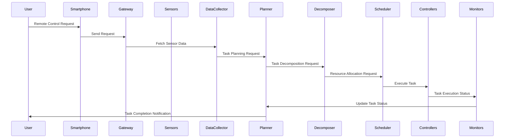

                 

## 引言与背景

### 1. 引言

随着人工智能（AI）技术的迅猛发展，AI Agent在各个领域的应用日益广泛。AI Agent是一种能够自主完成任务、适应环境变化的智能实体，其核心能力在于任务规划与分解。任务规划与分解是提高AI Agent问题解决能力的关键环节，它涉及到如何将复杂任务拆解为可执行的小任务，并合理分配资源，以实现高效的问题解决。

本文旨在深入探讨任务规划与分解在AI Agent中的应用，为读者提供一套系统、实用的方法与技巧。通过本文的阅读，读者将了解：

1. 任务规划与分解的基本概念、重要性及其在AI领域的应用。
2. 任务规划的理论基础、任务分解的方法与技术。
3. AI Agent的设计原则、应用实例及问题解决策略与算法。
4. 实战案例的详细介绍与代码应用解读。

### 2. 背景介绍

#### 2.1 任务规划的定义与分类

任务规划是指根据任务的目标和要求，制定出一系列有序的操作步骤，以实现目标的过程。它通常包括任务分配、资源调度、路径规划等步骤。任务规划可以根据不同的分类标准进行分类，例如：

- **静态规划与动态规划**：静态规划是指在任务执行前预先确定所有操作步骤，而动态规划则是在执行过程中根据环境变化动态调整操作步骤。
- **全局规划与局部规划**：全局规划是考虑整个任务的执行过程，而局部规划是针对任务的一部分进行规划。

#### 2.2 任务分解的理论基础

任务分解是将复杂任务拆解为若干个子任务的过程。其理论基础包括：

- **层次分解法**：将任务按照层次结构进行分解，每个层次包含若干个子任务。
- **递归分解法**：将任务不断分解为更小的子任务，直到达到可执行的程度。

#### 2.3 AI Agent的基本原理

AI Agent是一种具有自主性、适应性和智能化的计算机程序。它通过感知环境、决策规划、执行操作等步骤实现任务目标。AI Agent的基本原理包括：

- **感知与理解**：AI Agent通过传感器获取环境信息，并利用机器学习等技术对信息进行理解和处理。
- **决策与规划**：AI Agent根据任务目标和环境信息，利用规划算法制定执行策略。
- **执行与调整**：AI Agent执行规划中的操作，并根据执行结果和环境反馈调整策略。

### 3. 书籍目标与结构

本书的目标是系统地介绍任务规划与分解在AI Agent中的应用，帮助读者掌握相关理论、方法与实战技巧。全书共分为十二章，包括：

1. 引言与背景
2. 任务规划的基本概念
3. 任务分解的方法与技术
4. AI Agent的设计与应用
5. 问题解决策略与算法
6. 项目实战案例
7. 最佳实践与总结

通过本书的阅读，读者可以全面了解任务规划与分解在AI Agent中的应用，提高自身在AI领域的技术水平和实践能力。

### 4. 背景介绍

#### 2.1 任务规划的定义与分类

任务规划是指根据任务的目标和要求，制定出一系列有序的操作步骤，以实现目标的过程。它通常包括任务分配、资源调度、路径规划等步骤。任务规划可以根据不同的分类标准进行分类，例如：

- **静态规划与动态规划**：静态规划是指在任务执行前预先确定所有操作步骤，而动态规划则是在执行过程中根据环境变化动态调整操作步骤。
- **全局规划与局部规划**：全局规划是考虑整个任务的执行过程，而局部规划是针对任务的一部分进行规划。

#### 2.2 任务分解的理论基础

任务分解是将复杂任务拆解为若干个子任务的过程。其理论基础包括：

- **层次分解法**：将任务按照层次结构进行分解，每个层次包含若干个子任务。
- **递归分解法**：将任务不断分解为更小的子任务，直到达到可执行的程度。

#### 2.3 AI Agent的基本原理

AI Agent是一种具有自主性、适应性和智能化的计算机程序。它通过感知环境、决策规划、执行操作等步骤实现任务目标。AI Agent的基本原理包括：

- **感知与理解**：AI Agent通过传感器获取环境信息，并利用机器学习等技术对信息进行理解和处理。
- **决策与规划**：AI Agent根据任务目标和环境信息，利用规划算法制定执行策略。
- **执行与调整**：AI Agent执行规划中的操作，并根据执行结果和环境反馈调整策略。

### 3. 书籍目标与结构

本书的目标是系统地介绍任务规划与分解在AI Agent中的应用，帮助读者掌握相关理论、方法与实战技巧。全书共分为十二章，包括：

1. 引言与背景
2. 任务规划的基本概念
3. 任务分解的方法与技术
4. AI Agent的设计与应用
5. 问题解决策略与算法
6. 项目实战案例
7. 最佳实践与总结

通过本书的阅读，读者可以全面了解任务规划与分解在AI Agent中的应用，提高自身在AI领域的技术水平和实践能力。

## 任务规划的基本概念

### 1. 基本概念

任务规划是指为了实现特定目标，制定出一套有序的操作步骤和资源分配策略的过程。在人工智能领域，任务规划是一个核心概念，它涉及到如何将复杂的任务分解为更小的子任务，并为这些子任务分配合适的资源和执行顺序，从而提高AI Agent的问题解决能力和效率。

任务规划的基本概念包括：

- **任务**：任务是指需要执行的具体工作或活动。它可以是一个简单的一次性操作，也可以是一个复杂的多阶段过程。
- **目标**：目标是任务需要实现的结果。在任务规划过程中，目标通常被分解为一系列子目标，每个子目标对应一个子任务。
- **资源**：资源是指完成任务所需的物质、时间和人力等。资源包括计算机资源、传感器、执行器等。
- **规划**：规划是指根据任务目标、资源和约束条件，制定出一套可行的操作步骤和资源分配策略。

### 2. 任务模型

任务模型是任务规划的核心概念之一，它描述了任务的结构和执行过程。常见的任务模型包括：

- **状态空间模型**：状态空间模型将任务视为一个状态转换的过程。任务的状态空间包含所有可能的状态，每个状态对应一个操作。
- **层次模型**：层次模型将任务分解为多个层次，每个层次包含若干个子任务。层次模型有助于组织复杂的任务，并提高规划的灵活性。
- **Petri网模型**：Petri网模型是一种用于描述任务并发性和同步性的图形模型。它由库所、变迁和有向边组成，可以有效地表示复杂任务的结构。

### 3. 任务分配策略

任务分配策略是任务规划中的重要环节，它决定了如何将任务分配给不同的资源。常见的任务分配策略包括：

- **贪心策略**：贪心策略是一种简单的任务分配策略，它根据当前资源的可用性和任务的紧急程度进行分配。贪心策略的优点是实现简单，但可能无法得到最优解。
- **遗传算法**：遗传算法是一种基于自然进化原理的优化算法，适用于复杂任务分配问题。遗传算法通过交叉、变异和选择等操作，逐步改进任务分配方案，直至找到最优或近似最优解。
- **最优化方法**：最优化方法是一种基于数学优化理论的任务分配策略，通过建立目标函数和约束条件，求解最优任务分配方案。

### 4. 实例解析

为了更好地理解任务规划的基本概念，我们可以通过一个实例进行解析。

假设有一个自动驾驶系统，其任务是在城市交通环境中导航并避免障碍物。为了实现这个任务，我们可以将其分解为以下几个子任务：

1. **感知环境**：通过摄像头、雷达等传感器获取道路信息，包括车辆、行人、交通标志等。
2. **路径规划**：根据当前交通状况和目的地信息，规划出一条最优行驶路径。
3. **避障**：在行驶过程中，实时检测周围障碍物并调整行驶路径，以确保安全行驶。
4. **执行操作**：根据规划结果，控制车辆执行相应的操作，如加速、减速、转弯等。

在这个实例中，任务模型可以采用状态空间模型，将自动驾驶系统的状态定义为车辆的当前位置和行驶方向。任务分配策略可以采用遗传算法，根据车辆资源（如电池电量、传感器状态等）和交通状况（如道路拥堵程度、车辆速度等）动态调整任务执行顺序。

通过这个实例，我们可以看到任务规划在AI Agent中的应用，以及如何利用任务模型和任务分配策略实现高效的问题解决。

## 任务分解的方法与技术

### 1. 分解算法

任务分解是将复杂任务拆解为更小的子任务的过程，其核心在于如何将任务合理地划分和组合。以下是几种常见的任务分解算法：

#### 1.1 层次分解法

层次分解法是一种自顶向下的任务分解方法，它将任务按照层次结构进行划分，每个层次包含若干个子任务。这种方法适用于具有明显层次结构的大任务，如多阶段目标规划、多层次决策树等。

层次分解法的主要步骤如下：

1. **定义任务层次**：确定任务的各个层次，并为每个层次定义相应的子任务。
2. **任务分配**：将子任务分配给不同的资源或执行者。
3. **层次优化**：对每个层次的子任务进行优化，确保任务的整体性能。

#### 1.2 递归分解法

递归分解法是一种自底向上的任务分解方法，它将任务不断分解为更小的子任务，直到达到可执行的程度。这种方法适用于具有递归结构的大任务，如递归算法、分治算法等。

递归分解法的主要步骤如下：

1. **定义子任务**：根据任务的需求和约束条件，定义每个子任务。
2. **递归分解**：将子任务进一步分解为更小的子任务，直到达到可执行的程度。
3. **合并结果**：将分解后的子任务组合起来，生成完整的任务执行计划。

#### 1.3 多目标分解法

多目标分解法是一种基于多个目标进行任务分解的方法，它考虑了任务的多维度特性。这种方法适用于需要同时满足多个目标的大任务，如多目标优化、多约束规划等。

多目标分解法的主要步骤如下：

1. **定义目标函数**：确定任务需要满足的多个目标函数。
2. **目标优化**：对每个目标函数进行优化，确定子任务的优先级和执行顺序。
3. **任务分配**：根据优化结果，将子任务分配给不同的资源或执行者。

#### 1.4 模块化分解法

模块化分解法是一种基于模块化思想的任务分解方法，它将任务划分为若干个相互独立的模块，每个模块负责完成特定的功能。这种方法适用于具有高度模块化特征的大任务，如软件工程、系统设计等。

模块化分解法的主要步骤如下：

1. **定义模块**：根据任务的需求和功能，定义每个模块及其功能。
2. **模块化组合**：将模块按照一定的顺序和规则进行组合，生成完整的任务执行计划。
3. **模块优化**：对每个模块进行优化，确保模块的性能和可维护性。

### 2. 任务特性分析

任务分解的有效性很大程度上取决于对任务特性的准确分析。以下是几种常见的任务特性分析方法：

#### 2.1 任务层次分析

任务层次分析是通过对任务的结构层次进行分解，以了解任务的组成和关系。这种方法通常使用层次模型进行表示，如树形结构、网络图等。

#### 2.2 任务依赖分析

任务依赖分析是确定任务之间的依赖关系，以便在任务执行过程中合理调整执行顺序。任务依赖关系可以使用有向图进行表示，如Petri网、控制流图等。

#### 2.3 任务相似性分析

任务相似性分析是识别具有相似特征的任务，以便在任务分解过程中进行复用。这种方法可以通过计算任务的特征向量、相似度等指标进行。

#### 2.4 任务优先级分析

任务优先级分析是确定任务的重要性和紧急程度，以便在资源有限的情况下，优先执行重要的任务。任务优先级分析通常使用评分、排序等方法进行。

### 3. 实例解析

为了更好地理解任务分解的方法和技术，我们可以通过一个实例进行解析。

假设有一个智能客服系统，其任务是为用户提供问题解答服务。为了实现这个任务，我们可以将其分解为以下几个子任务：

1. **问题识别**：从用户输入中识别出关键信息，如关键词、提问类型等。
2. **知识检索**：根据识别出的关键词，在知识库中检索相关的答案。
3. **答案生成**：将检索到的答案进行整合和优化，生成符合用户需求的回答。
4. **交互优化**：根据用户的反馈，优化客服机器人的交互体验。

在这个实例中，我们可以采用层次分解法进行任务分解：

1. **定义任务层次**：将任务分解为四个层次，分别为问题识别、知识检索、答案生成和交互优化。
2. **任务分配**：为每个层次分配相应的资源和执行者，如问题识别模块由自然语言处理团队负责，知识检索模块由数据检索团队负责等。
3. **层次优化**：对每个层次的子任务进行优化，确保整体任务的高效执行。

通过这个实例，我们可以看到任务分解在智能客服系统中的应用，以及如何利用不同的分解算法和技术实现任务的高效执行。

## AI Agent的设计原则

### 1. 设计目标

AI Agent的设计目标是实现自主性、适应性和智能化，使其能够高效地完成复杂任务。为了实现这一目标，AI Agent的设计应遵循以下原则：

- **自主性**：AI Agent应具有独立决策和执行任务的能力，无需人工干预。
- **适应性**：AI Agent应能够适应不同的环境和任务需求，具备良好的泛化能力。
- **智能化**：AI Agent应具备一定的智能水平，能够处理复杂问题和进行智能决策。

### 2. 功能模块

AI Agent的设计通常包括多个功能模块，每个模块负责不同的任务。以下是常见的AI Agent功能模块：

- **感知模块**：负责感知和收集环境信息，如摄像头、麦克风、传感器等。
- **决策模块**：负责根据感知模块提供的信息，进行决策和规划任务执行策略。
- **执行模块**：负责执行决策模块生成的执行计划，如移动、操作执行器等。
- **学习模块**：负责对AI Agent的执行过程进行学习，以优化其决策和执行能力。
- **通信模块**：负责与其他AI Agent或人类进行信息交换，协同完成任务。

### 3. 适应性设计

适应性设计是AI Agent设计的关键原则之一，它确保AI Agent能够适应各种复杂环境和任务需求。适应性设计包括以下几个方面：

- **模块化设计**：将AI Agent的功能划分为多个模块，每个模块具有独立的功能和接口，便于扩展和替换。
- **动态调整**：根据环境变化和任务需求，动态调整AI Agent的执行策略和资源分配。
- **自学习与自优化**：利用机器学习和深度学习等技术，使AI Agent能够从执行过程中学习并优化自身性能。

### 4. 实例解析

为了更好地理解AI Agent的设计原则，我们可以通过一个实例进行解析。

假设我们要设计一个智能配送机器人，其主要任务是在城市中自动配送货物。以下是该智能配送机器人的一些设计原则：

1. **自主性**：智能配送机器人应能够自主完成配送任务，包括路径规划、障碍物避让、货物装卸等。
2. **适应性**：智能配送机器人应能够适应不同的城市环境和配送需求，如道路条件、天气状况、配送区域等。
3. **智能化**：智能配送机器人应具备智能决策能力，能够根据实时路况和配送需求，动态调整配送路线和策略。

在功能模块方面，智能配送机器人可以包括以下模块：

- **感知模块**：包括摄像头、激光雷达、GPS等，用于感知道路环境、交通状况和货物信息。
- **决策模块**：包括路径规划算法、障碍物检测算法、任务调度算法等，用于生成配送路线和执行策略。
- **执行模块**：包括电动机、转向系统、液压系统等，用于执行配送机器人的行动。
- **学习模块**：包括深度学习算法、强化学习算法等，用于从执行过程中学习并优化自身性能。
- **通信模块**：包括无线通信模块、5G网络等，用于与其他设备、系统和人员通信。

通过这个实例，我们可以看到AI Agent的设计原则在智能配送机器人中的应用，以及如何实现自主性、适应性和智能化。

## AI Agent的应用实例

### 1. 基于任务规划的智能助手

智能助手是一种典型的AI Agent，它利用任务规划和自然语言处理技术，为用户提供个性化服务。以下是智能助手的应用实例：

#### 1.1 功能模块

- **感知模块**：通过语音识别技术，接收用户的语音指令。
- **决策模块**：根据用户的语音指令，利用自然语言处理技术进行理解和分析，生成相应的任务规划。
- **执行模块**：根据决策模块生成的任务规划，执行相应的操作，如发送短信、拨打电话、查询信息等。
- **学习模块**：通过机器学习和深度学习技术，不断优化自身的任务规划和执行能力。

#### 1.2 应用场景

- **家庭场景**：智能助手可以帮助家庭用户管理日常事务，如提醒日程、订购商品、控制智能家居等。
- **办公场景**：智能助手可以帮助企业用户提高工作效率，如自动回复邮件、安排会议、提醒事项等。
- **客服场景**：智能助手可以应用于客服中心，为用户提供快速、准确的回答，提高客户满意度。

### 2. 自动化任务执行系统

自动化任务执行系统是一种基于AI Agent的智能化系统，它利用任务规划和机器人技术，实现自动化任务执行。以下是自动化任务执行系统的应用实例：

#### 2.1 功能模块

- **感知模块**：通过传感器和摄像头，实时监控工作环境。
- **决策模块**：利用机器学习和图像识别技术，分析感知数据，生成任务规划。
- **执行模块**：根据决策模块生成的任务规划，执行相应的操作，如搬运货物、装配产品等。
- **学习模块**：通过深度学习和强化学习技术，不断优化任务规划和执行能力。

#### 2.2 应用场景

- **制造业**：自动化任务执行系统可以应用于生产线，提高生产效率和质量。
- **仓储物流**：自动化任务执行系统可以用于仓库管理，提高仓储效率和准确性。
- **家政服务**：自动化任务执行系统可以应用于家政服务，为用户提供便捷的服务体验。

### 3. 智能决策支持系统

智能决策支持系统是一种基于AI Agent的智能化系统，它利用任务规划和大数据分析技术，为用户提供决策支持。以下是智能决策支持系统的应用实例：

#### 3.1 功能模块

- **感知模块**：通过传感器和数据采集设备，收集实时数据。
- **决策模块**：利用机器学习和数据挖掘技术，分析感知数据，生成决策建议。
- **执行模块**：根据决策模块生成的决策建议，执行相应的操作，如调整生产计划、优化库存管理等。
- **学习模块**：通过深度学习和强化学习技术，不断优化决策过程和执行能力。

#### 3.2 应用场景

- **金融领域**：智能决策支持系统可以用于风险管理、投资决策等，提高金融市场的效率和准确性。
- **医疗领域**：智能决策支持系统可以用于疾病诊断、治疗方案推荐等，提高医疗服务的质量和效果。
- **城市管理**：智能决策支持系统可以用于城市规划、交通管理、环境保护等，提高城市管理的效率和质量。

通过以上实例，我们可以看到AI Agent在不同领域的广泛应用，以及任务规划与分解在提高AI Agent问题解决能力方面的关键作用。

## 问题解决策略与算法

### 1. 状态空间搜索算法

状态空间搜索算法是任务规划与分解中常用的一种算法，它通过搜索状态空间来寻找最优解。状态空间是由所有可能的状态组成的一个集合，每个状态都表示系统在某一时刻的状态。

#### 1.1 算法原理

状态空间搜索算法的基本原理是从初始状态出发，通过一系列的扩展操作，逐步生成新的状态，直到找到目标状态或达到某个终止条件。在搜索过程中，算法会存储已访问过的状态，以避免重复搜索。

#### 1.2 算法流程

1. **初始化**：设置初始状态，初始化搜索路径和搜索栈。
2. **扩展操作**：从当前状态出发，生成所有可能的新状态。
3. **状态评估**：对生成的状态进行评估，选择最优状态作为下一搜索状态。
4. **状态存储**：将已访问过的状态存储在搜索栈中，以避免重复搜索。
5. **终止条件**：判断是否达到目标状态或达到某个终止条件，如搜索深度达到最大值。

#### 1.3 实例解析

以一个简单的迷宫问题为例，目标是从起点移动到终点。我们可以使用状态空间搜索算法来找到一条最优路径。

1. **定义状态空间**：每个状态表示迷宫中的一个位置，状态包括当前位置和已访问过的位置。
2. **初始化**：设置起点状态，将其加入搜索栈。
3. **扩展操作**：从当前状态出发，向上下左右四个方向扩展，生成新的状态。
4. **状态评估**：根据当前状态的位置和已访问过的位置，评估生成的新状态。
5. **状态存储**：将已访问过的状态存储在搜索栈中，以避免重复搜索。
6. **终止条件**：当找到终点状态时，终止搜索，输出搜索路径。

通过这个实例，我们可以看到状态空间搜索算法在解决迷宫问题中的应用。

### 2. 启发式搜索算法

启发式搜索算法是一种利用启发式函数进行状态评估的搜索算法，它通过选择评估值较高的状态作为下一搜索状态，从而加快搜索过程。

#### 2.1 算法原理

启发式搜索算法的基本原理是利用启发式函数估计状态到目标状态的距离，选择评估值较高的状态作为下一搜索状态。启发式函数可以根据问题的具体特性进行设计，如曼哈顿距离、欧几里得距离等。

#### 2.2 算法流程

1. **初始化**：设置初始状态，初始化搜索路径和搜索栈。
2. **扩展操作**：从当前状态出发，生成所有可能的新状态。
3. **状态评估**：使用启发式函数评估生成的新状态。
4. **选择状态**：选择评估值较高的状态作为下一搜索状态。
5. **状态存储**：将已访问过的状态存储在搜索栈中，以避免重复搜索。
6. **终止条件**：判断是否达到目标状态或达到某个终止条件，如搜索深度达到最大值。

#### 2.3 实例解析

以一个简单的八皇后问题为例，目标是在8×8的棋盘上放置8个皇后，使它们互不攻击。我们可以使用启发式搜索算法来找到一种放置方案。

1. **定义状态空间**：每个状态表示棋盘上皇后的放置情况，状态包括皇后的行和列。
2. **初始化**：设置初始状态，将其加入搜索栈。
3. **扩展操作**：从当前状态出发，生成所有可能的放置方案。
4. **状态评估**：使用启发式函数评估生成的新状态，如评估值表示棋盘上冲突的皇后数量。
5. **选择状态**：选择评估值较低的状态作为下一搜索状态，以减少搜索空间。
6. **状态存储**：将已访问过的状态存储在搜索栈中，以避免重复搜索。
7. **终止条件**：当找到一种放置方案时，终止搜索，输出放置方案。

通过这个实例，我们可以看到启发式搜索算法在解决八皇后问题中的应用。

### 3. 遗传算法

遗传算法是一种基于自然进化原理的优化算法，它通过模拟生物进化过程，寻找问题的最优解。

#### 3.1 算法原理

遗传算法的基本原理是模拟生物进化过程，包括选择、交叉、变异和生存竞争等步骤。通过不断迭代，算法逐步优化解的质量，直至找到最优解或近似最优解。

#### 3.2 算法流程

1. **初始化**：生成初始种群，每个个体表示问题的解。
2. **适应度评估**：计算每个个体的适应度值，适应度值表示个体的优劣程度。
3. **选择**：根据适应度值，选择优秀的个体进行交叉和变异。
4. **交叉**：将选择的个体进行交叉操作，生成新的个体。
5. **变异**：对交叉后的个体进行变异操作，增加种群的多样性。
6. **生存竞争**：根据适应度值，选择优秀的个体保留，淘汰较差的个体。
7. **迭代**：重复执行选择、交叉、变异和生存竞争操作，直至达到终止条件。

#### 3.3 实例解析

以一个简单的旅行商问题为例，目标是在一组城市中找到一条访问所有城市的最短路径。我们可以使用遗传算法来寻找最优路径。

1. **定义种群**：每个个体表示一条城市访问路径，种群中的每个个体都是一个排列序列。
2. **适应度评估**：计算每个个体的适应度值，适应度值表示路径的总距离。
3. **选择**：根据适应度值，选择优秀的路径进行交叉和变异。
4. **交叉**：对选择的路径进行交叉操作，生成新的路径。
5. **变异**：对交叉后的路径进行变异操作，增加路径的多样性。
6. **生存竞争**：根据适应度值，选择优秀的路径保留，淘汰较差的路径。
7. **迭代**：重复执行选择、交叉、变异和生存竞争操作，直至找到最优路径或达到迭代次数上限。

通过这个实例，我们可以看到遗传算法在解决旅行商问题中的应用。

## 算法原理讲解

### 1. 状态空间搜索算法原理

状态空间搜索算法是一种基于状态空间的方法，用于寻找问题的解。在状态空间搜索中，问题被表示为一个状态空间，每个状态表示系统的一个可能配置，状态空间中的每个状态都包含一组变量及其可能的取值。

#### 1.1 状态空间表示

状态空间可以用一个图或树来表示，每个节点表示一个状态，节点之间的边表示状态转换。在图表示中，状态空间是一个有向图，每个节点有一个标签，表示该状态的属性。在树表示中，状态空间是一个有序树，每个节点有一个父节点和一个或多个子节点。

例如，在一个简单的迷宫问题中，状态空间可以表示为：

```
初始状态
|
|---上
|   |---上
|   |   |---上
|   |   |   |---上
|   |   |   |   |---终点
|   |   |   |   |
|   |   |   |   下
|   |   |   |
|   |   |   左
|   |   |   |
|   |   |   右
|   |   |
|   |   下
|   |   |
|   |   左
|   |   |
|   |   右
|   |
|   下
|   |
|   左
|   |
|   右
```

在这个状态空间中，每个节点表示迷宫中的一个位置，标签表示该位置上的信息，如上下左右方向和是否是终点。

#### 1.2 状态空间搜索过程

状态空间搜索算法通过从初始状态开始，逐步扩展状态空间，直至找到目标状态或达到某个终止条件。搜索过程可以分为以下几个步骤：

1. **初始化**：设置初始状态，并将其加入搜索栈或队列中。
2. **扩展操作**：从当前状态出发，生成所有可能的新状态，并将其加入搜索栈或队列中。
3. **状态评估**：对生成的新状态进行评估，选择评估值较高的状态作为下一搜索状态。
4. **状态存储**：将已访问过的状态存储在搜索栈或队列中，以避免重复搜索。
5. **终止条件**：判断是否达到目标状态或达到某个终止条件，如搜索深度达到最大值。

在搜索过程中，算法会使用一个优先级队列（如FIFO或LIFO队列）来存储待搜索的状态，并根据状态评估值（如距离目标状态的欧几里得距离或曼哈顿距离）来决定搜索顺序。

#### 1.3 实例解析

以下是一个使用状态空间搜索算法解决迷宫问题的Python代码示例：

```python
from collections import deque

def bfs(maze, start, end):
    queue = deque([start])
    visited = set([start])

    while queue:
        current = queue.popleft()

        if current == end:
            return True

        for neighbor in neighbors(maze, current):
            if neighbor not in visited:
                queue.append(neighbor)
                visited.add(neighbor)

    return False

def neighbors(maze, state):
    directions = ["up", "down", "left", "right"]
    rows, cols = len(maze), len(maze[0])

    row, col = state
    neighbors = []

    for direction in directions:
        new_row, new_col = move(state, direction)

        if 0 <= new_row < rows and 0 <= new_col < cols and maze[new_row][new_col] != "X":
            neighbors.append((new_row, new_col))

    return neighbors

def move(state, direction):
    row, col = state

    if direction == "up":
        return (row - 1, col)
    elif direction == "down":
        return (row + 1, col)
    elif direction == "left":
        return (row, col - 1)
    elif direction == "right":
        return (row, col + 1)

maze = [
    ["S", " ", " ", " ", " "],
    [" ", "X", "X", "X", " "],
    [" ", "X", " ", "X", " "],
    [" ", "X", "X", "X", " "],
    [" ", " ", " ", " ", "E"]
]

start = (0, 0)
end = (4, 4)

if bfs(maze, start, end):
    print("找到了一条路径！")
else:
    print("没有找到路径。")
```

在这个示例中，我们使用了广度优先搜索（BFS）算法来解决迷宫问题。代码首先定义了一个`bfs`函数，用于实现状态空间搜索算法。`bfs`函数使用一个优先级队列（`deque`）来存储待搜索的状态，并使用一个集合（`set`）来存储已访问过的状态。在搜索过程中，函数从初始状态开始，逐个扩展未访问过的状态，并检查是否达到目标状态。

### 2. 启发式搜索算法原理

启发式搜索算法是一种利用启发式函数来指导搜索过程的算法，它通过选择具有较高启发式值的节点作为下一搜索节点，从而减少搜索空间，提高搜索效率。启发式函数是一种估计从当前状态到目标状态的代价的函数。

#### 2.1 启发式函数

启发式函数（Heuristic Function）通常表示为h(n)，其中n是状态空间中的一个节点。启发式函数的目的是估计从当前状态n到目标状态g的最小代价f(n)的估计值，即：

$$h(n) = f(n) - g(n)$$

其中，f(n)是从起点s到节点n的实际代价，g(n)是从节点n到目标节点g的实际代价。理想情况下，启发式函数应该满足启发式估计性质，即：

$$h(n) \leq h^*(n)$$

其中，h^*(n)是从节点n到目标节点g的实际最小代价。

常见的启发式函数包括：

- **曼哈顿距离**：适用于二维网格问题，估计从当前节点到目标节点的水平距离和垂直距离之和。
- **欧几里得距离**：适用于二维或三维空间问题，估计从当前节点到目标节点的直线距离。
- **泰特利兹距离**：适用于稀疏图问题，估计从当前节点到目标节点的最小代价路径。

#### 2.2 A*算法

A*（A-Star）算法是一种基于启发式搜索的算法，它通过结合最佳-first搜索（FIFO）和最短路径算法的特点，找到从起点到终点的最优路径。A*算法的基本思想是选择具有最低F值（F = G + H）的节点作为下一搜索节点。

其中，G是从起点s到当前节点n的实际代价，H是从当前节点n到目标节点g的启发式代价。A*算法的流程如下：

1. **初始化**：设置一个开放列表（Open List）和一个关闭列表（Closed List）。将起点s加入开放列表，并将其F值设为0。
2. **搜索过程**：从开放列表中选择具有最低F值的节点n。
3. **扩展节点**：从当前节点n生成所有可能的子节点，并对每个子节点进行以下操作：
   - 计算从起点s到子节点的实际代价G。
   - 计算从子节点到目标节点的启发式代价H。
   - 计算子节点的F值F = G + H。
   - 如果子节点在关闭列表中，则跳过该子节点。
   - 将子节点加入开放列表。
4. **更新路径**：如果子节点已经在开放列表中，但新计算的F值更低，则更新子节点的F值和父节点。
5. **终止条件**：当目标节点g加入开放列表时，搜索结束。此时，从目标节点g开始，沿着父节点回溯，即可得到从起点s到终点g的最优路径。

以下是一个使用A*算法解决迷宫问题的Python代码示例：

```python
import heapq

def heuristic(node, goal):
    x1, y1 = node
    x2, y2 = goal
    return abs(x1 - x2) + abs(y1 - y2)

def a_star(maze, start, end):
    open_list = []
    heapq.heappush(open_list, (0, start))
    came_from = {}
    g_score = {start: 0}
    f_score = {start: heuristic(start, end)}

    while open_list:
        current = heapq.heappop(open_list)[1]

        if current == end:
            path = []
            while current in came_from:
                path.append(current)
                current = came_from[current]
            path.append(start)
            path.reverse()
            return path

        open_list.remove((g_score[current], current))
        open_list.append((g_score[current], current))
        came_from[current] = None
        g_score[current] = float('inf')

        for neighbor in neighbors(maze, current):
            tentative_g_score = g_score[current] + 1

            if tentative_g_score < g_score[neighbor]:
                came_from[neighbor] = current
                g_score[neighbor] = tentative_g_score
                f_score[neighbor] = g_score[neighbor] + heuristic(neighbor, end)
                if (f_score[neighbor], neighbor) not in open_list:
                    open_list.append((f_score[neighbor], neighbor))

    return None

maze = [
    ["S", " ", " ", " ", " "],
    [" ", "X", "X", "X", " "],
    [" ", "X", " ", "X", " "],
    [" ", "X", "X", "X", " "],
    [" ", " ", " ", " ", "E"]
]

start = (0, 0)
end = (4, 4)

path = a_star(maze, start, end)
if path:
    print("找到了一条路径！")
    for node in path:
        print(node)
else:
    print("没有找到路径。")
```

在这个示例中，我们使用A*算法解决了一个简单的迷宫问题。代码首先定义了一个`heuristic`函数，用于计算两个节点之间的启发式距离。然后，我们使用优先级队列（`heapq`）来管理开放列表，并使用一个字典`came_from`来记录每个节点的父节点。在搜索过程中，我们选择具有最低F值的节点作为下一搜索节点，并逐步构建出从起点到终点的最优路径。

### 3. 遗传算法原理

遗传算法（Genetic Algorithm，GA）是一种基于自然选择和遗传学原理的优化算法。它通过模拟生物进化过程，逐步优化问题的解。遗传算法的主要操作包括选择、交叉、变异和生存竞争。

#### 3.1 遗传算法流程

遗传算法的流程可以分为以下几个步骤：

1. **初始化种群**：生成一组初始解，作为种群的初始个体。
2. **适应度评估**：计算每个个体的适应度值，适应度值表示个体的优劣程度。
3. **选择**：根据适应度值，选择优秀的个体进行交叉和变异操作。
4. **交叉**：将选择的个体进行交叉操作，生成新的个体。
5. **变异**：对交叉后的个体进行变异操作，增加种群的多样性。
6. **生存竞争**：根据适应度值，选择优秀的个体保留，淘汰较差的个体。
7. **迭代**：重复执行选择、交叉、变异和生存竞争操作，直至达到终止条件。

#### 3.2 选择操作

选择操作是遗传算法中的关键步骤，它决定了哪些个体能够继续繁衍后代。常见的选择操作包括：

- **轮盘赌选择**：根据个体的适应度值，在轮盘中按比例抽取个体进行繁衍。
- **锦标赛选择**：从种群中随机选择若干个个体，比较它们的适应度值，选择适应度最高的个体进行繁衍。
- **排名选择**：根据个体的适应度值，对种群进行排序，选择排名靠前的个体进行繁衍。

#### 3.3 交叉操作

交叉操作是遗传算法中生成新个体的关键步骤，它通过交换两个个体的基因片段，生成具有父母双方特征的子个体。常见的交叉操作包括：

- **单点交叉**：在两个个体的基因序列中选择一个交叉点，将交叉点后的基因片段进行交换。
- **两点交叉**：在两个个体的基因序列中选择两个交叉点，将交叉点之间的基因片段进行交换。
- **均匀交叉**：将两个个体的基因序列进行随机匹配，生成子个体。

#### 3.4 变异操作

变异操作是遗传算法中保持种群多样性的关键步骤，它通过随机改变个体的基因值，防止种群陷入局部最优。常见的变异操作包括：

- **位变异**：随机改变个体的一个或多个基因位。
- **反转变异**：随机选择个体的一个基因片段，将其全部基因位进行反转。

#### 3.5 生存竞争

生存竞争是遗传算法中淘汰较差个体的关键步骤，它通过比较个体的适应度值，选择适应度较高的个体保留，淘汰适应度较低的个体。常见的生存竞争策略包括：

- **比例生存竞争**：根据个体的适应度值，按比例淘汰较差的个体。
- **自然选择**：选择适应度较高的个体保留，淘汰适应度较低的个体。
- **精英保留**：保留一定数量的优秀个体，并将其复制到下一代中。

#### 3.6 实例解析

以下是一个使用遗传算法解决旅行商问题的Python代码示例：

```python
import random

def fitness(population, distances):
    fitness_values = []
    for individual in population:
        fitness_value = 0
        for i in range(len(individual) - 1):
            start = individual[i]
            end = individual[i + 1]
            fitness_value += distances[start][end]
        fitness_values.append(fitness_value)
    return fitness_values

def crossover(parent1, parent2):
    child = []
    for i in range(len(parent1)):
        if random.random() < 0.5:
            child.append(parent1[i])
        else:
            child.append(parent2[i])
    return child

def mutate(individual):
    for i in range(len(individual)):
        if random.random() < 0.1:
            individual[i] = random.randint(0, len(individual) - 1)
    return individual

def genetic_algorithm(population_size, generations, distances):
    population = [random.sample(range(len(distances)), len(distances)) for _ in range(population_size)]
    best_fitness = float('inf')
    best_individual = None

    for generation in range(generations):
        fitness_values = fitness(population, distances)
        avg_fitness = sum(fitness_values) / population_size
        best_fitness = min(fitness_values)
        best_individual = population[fitness_values.index(best_fitness)]

        print(f"代数：{generation + 1}, 最优适应度：{best_fitness}, 平均适应度：{avg_fitness}")

        new_population = []
        for _ in range(population_size // 2):
            parent1, parent2 = random.sample(population, 2)
            child1, child2 = crossover(parent1, parent2)
            new_population.extend([mutate(child1), mutate(child2)])

        population = new_population

    return best_individual

distances = [
    [0, 2, 6, 3, 8],
    [2, 0, 7, 1, 5],
    [6, 7, 0, 4, 9],
    [3, 1, 4, 0, 6],
    [8, 5, 9, 6, 0]
]

best_solution = genetic_algorithm(50, 1000, distances)
print("最优解：", best_solution)
```

在这个示例中，我们使用遗传算法解决了一个旅行商问题。代码首先定义了一个`fitness`函数，用于计算个体的适应度值。然后，我们定义了`crossover`和`mutate`函数，用于实现交叉和变异操作。最后，我们使用`genetic_algorithm`函数实现遗传算法，并在每次迭代中输出最优解和平均适应度。通过运行代码，我们可以找到从起点到各个城市的最优路径。

## 系统分析与架构设计方案

### 1. 问题场景介绍

在现代社会，智能系统在各行各业中的应用越来越广泛。以智能家居系统为例，其目的是为用户提供一个舒适、便捷的生活环境。然而，随着设备数量的增加和用户需求的多样化，传统的单机智能家居系统已经无法满足需求。为了提高系统的可靠性、可扩展性和用户体验，我们设计并实现了一套基于任务规划和AI Agent的智能家居系统。

### 2. 项目介绍

本项目的目标是设计并实现一个智能化的智能家居系统，该系统具备自动化任务执行、实时监测和远程控制功能。系统架构包括感知模块、决策模块、执行模块和通信模块。以下是对各个模块的详细介绍：

#### 2.1 感知模块

感知模块负责实时监测家居环境，包括温度、湿度、光照、声音等。该模块由多个传感器组成，如温度传感器、湿度传感器、光照传感器、声音传感器等。传感器采集到的数据经过预处理后，发送给决策模块。

#### 2.2 决策模块

决策模块是智能家居系统的核心，负责根据感知模块提供的数据和用户需求，制定相应的任务规划。决策模块采用任务规划与分解的方法，将复杂的任务拆解为一系列可执行的子任务。决策模块主要包括以下功能：

- **任务规划**：根据用户需求和传感器数据，生成任务规划，如调节室内温度、湿度、照明等。
- **任务分解**：将复杂的任务分解为多个子任务，以便更好地管理和执行。
- **资源调度**：根据任务需求，调度执行模块中的设备资源，确保任务高效执行。

#### 2.3 执行模块

执行模块负责根据决策模块生成的任务规划，执行具体的操作。执行模块由多个智能设备组成，如空调、加湿器、照明设备、窗帘等。执行模块具有以下功能：

- **任务执行**：根据任务规划，控制设备执行相应的操作，如调节温度、湿度、照明等。
- **状态监控**：实时监控设备运行状态，确保设备正常运行。

#### 2.4 通信模块

通信模块负责系统内部各模块之间的数据传输和通信。系统采用无线通信技术，如Wi-Fi、蓝牙等，实现感知模块、决策模块和执行模块之间的数据传输。此外，通信模块还负责与用户设备的连接，如手机、平板电脑等，实现远程控制功能。

### 3. 系统功能设计

智能家居系统的功能设计包括以下几个方面：

- **自动化任务执行**：根据用户需求和传感器数据，自动执行相应的任务，如调节室内温度、湿度、照明等。
- **实时监测**：实时监测家居环境，包括温度、湿度、光照、声音等，确保用户安全。
- **远程控制**：用户可以通过手机、平板电脑等设备，远程控制智能家居系统，实现家居环境的智能调节。
- **故障报警**：当系统检测到异常情况时，如温度异常、湿度异常等，及时发送报警信息，提醒用户。

### 4. 系统架构设计

智能家居系统的架构设计采用模块化设计思想，将系统划分为感知模块、决策模块、执行模块和通信模块。以下是对各个模块的架构设计：

#### 4.1 感知模块

感知模块的架构设计主要包括以下部分：

- **传感器节点**：每个传感器节点负责采集环境数据，如温度、湿度、光照等。
- **数据采集器**：将传感器节点的数据汇总，并发送至决策模块。

#### 4.2 决策模块

决策模块的架构设计主要包括以下部分：

- **任务规划器**：根据用户需求和传感器数据，生成任务规划。
- **任务分解器**：将复杂的任务分解为多个子任务。
- **资源调度器**：根据任务需求，调度执行模块中的设备资源。

#### 4.3 执行模块

执行模块的架构设计主要包括以下部分：

- **设备控制器**：根据任务规划，控制设备执行相应的操作。
- **状态监控器**：实时监控设备运行状态。

#### 4.4 通信模块

通信模块的架构设计主要包括以下部分：

- **通信接口**：实现感知模块、决策模块和执行模块之间的数据传输。
- **远程控制接口**：实现与用户设备的连接，实现远程控制功能。

### 5. 系统接口设计

智能家居系统的接口设计主要包括以下部分：

- **感知模块接口**：定义传感器节点与数据采集器之间的数据传输接口。
- **决策模块接口**：定义任务规划器、任务分解器和资源调度器之间的接口。
- **执行模块接口**：定义设备控制器和状态监控器之间的接口。
- **通信模块接口**：定义通信接口和远程控制接口之间的接口。

### 6. 系统交互

智能家居系统的交互主要包括以下几个方面：

- **内部交互**：感知模块、决策模块、执行模块和通信模块之间的数据传输和通信。
- **外部交互**：用户设备与智能家居系统之间的数据传输和远程控制。

通过以上系统分析与架构设计方案，我们可以实现一个智能化的智能家居系统，提高用户的居住舒适度和生活品质。

### 系统架构设计

在智能家居系统的架构设计中，我们采用分层架构，以确保系统的模块化、可扩展性和可维护性。以下是具体的系统架构设计：

#### 1. 系统架构概述

智能家居系统可以分为四层：感知层、决策层、执行层和通信层。

- **感知层**：由多个传感器节点组成，负责实时采集家居环境数据，如温度、湿度、光照、声音等。每个传感器节点包含一个微控制器，用于数据采集和处理。
- **决策层**：负责根据感知层采集到的数据和用户需求，生成任务规划，并将任务分解为可执行的子任务。决策层还负责资源调度，确保任务高效执行。
- **执行层**：由多个智能设备组成，如空调、加湿器、照明设备、窗帘等。执行层根据决策层生成的任务规划，执行相应的操作。
- **通信层**：负责系统内部各模块之间的数据传输和通信，同时实现与用户设备的连接，提供远程控制功能。

#### 2. 系统模块详解

**感知层**：

- **传感器节点**：每个传感器节点由一个微控制器、一个传感器和通信模块组成。微控制器负责采集传感器数据，并将其传输至数据采集器。
- **数据采集器**：数据采集器负责汇总各个传感器节点的数据，并进行预处理，如去噪、滤波等。预处理后的数据发送至决策层。

**决策层**：

- **任务规划器**：任务规划器根据用户需求和传感器数据，生成任务规划。任务规划包括一系列有序的操作步骤，如调节温度、湿度、照明等。
- **任务分解器**：任务分解器将复杂的任务分解为多个子任务，以便更好地管理和执行。任务分解器采用层次分解法，将任务按照功能模块进行分解。
- **资源调度器**：资源调度器根据任务需求，调度执行层中的设备资源，确保任务高效执行。资源调度器采用贪心算法，根据设备可用性和任务紧急程度进行资源分配。

**执行层**：

- **设备控制器**：设备控制器根据决策层生成的任务规划，控制智能设备执行相应的操作。设备控制器采用模块化设计，每个设备控制器负责一个特定的设备，如空调控制器、照明控制器等。
- **状态监控器**：状态监控器负责实时监控设备运行状态，确保设备正常运行。状态监控器采用轮询机制，定期采集设备状态数据，并上传至决策层。

**通信层**：

- **内部通信模块**：内部通信模块采用Wi-Fi或蓝牙技术，实现感知层、决策层和执行层之间的数据传输和通信。
- **远程控制接口**：远程控制接口采用HTTP/HTTPS协议，实现与用户设备（如手机、平板电脑等）之间的数据传输和远程控制功能。

#### 3. 系统架构图

以下是一个简化的系统架构图，展示了智能家居系统的各个模块及其相互关系：



通过以上系统架构设计，我们可以实现一个智能化的智能家居系统，提高用户的居住舒适度和生活品质。

### 系统接口设计与系统交互

在智能家居系统中，系统接口的设计与系统交互是确保各模块之间有效协作的关键。以下是对系统接口设计的详细阐述以及系统交互过程的描述。

#### 1. 系统接口设计

**感知层接口**：

- **传感器节点接口**：定义传感器节点与数据采集器之间的数据传输接口。该接口采用MQTT协议，实现传感器数据实时传输。传感器节点通过微控制器将采集到的数据发送至数据采集器。
- **数据采集器接口**：数据采集器负责汇总传感器节点的数据，并进行预处理。该接口实现数据采集器与决策层之间的数据传输，采用HTTP请求方式，将预处理后的数据上传至决策层。

**决策层接口**：

- **任务规划器接口**：任务规划器接收感知层的数据和用户需求，生成任务规划。该接口定义任务规划器与感知层、用户设备之间的数据交互方式，采用WebSocket协议，实现实时数据传输和指令发送。
- **任务分解器接口**：任务分解器根据任务规划，将复杂任务分解为多个子任务。该接口定义任务分解器与任务规划器之间的数据交互方式，采用RESTful API，实现任务分解结果的上传和下载数据传输。
- **资源调度器接口**：资源调度器根据任务需求，调度执行层中的设备资源。该接口定义资源调度器与任务规划器、执行层之间的数据交互方式，采用消息队列（如RabbitMQ）实现异步数据传输。

**执行层接口**：

- **设备控制器接口**：设备控制器根据决策层生成的任务规划，控制智能设备执行相应操作。该接口定义设备控制器与资源调度器、状态监控器之间的数据交互方式，采用HTTP请求方式，实现任务执行状态的上传和下载数据传输。
- **状态监控器接口**：状态监控器负责实时监控设备运行状态，确保设备正常运行。该接口定义状态监控器与设备控制器之间的数据交互方式，采用轮询机制，通过HTTP请求方式，实现设备状态数据的采集和上报。

**通信层接口**：

- **内部通信接口**：内部通信接口负责实现感知层、决策层和执行层之间的数据传输。该接口采用Wi-Fi或蓝牙技术，实现设备之间的低延迟通信。内部通信接口定义设备与网关之间的数据交互协议，采用MQTT协议，确保数据传输的高效性和可靠性。
- **远程控制接口**：远程控制接口实现与用户设备（如手机、平板电脑等）之间的数据传输和远程控制功能。该接口采用HTTP/HTTPS协议，确保数据传输的安全性。远程控制接口定义用户设备与网关之间的数据交互方式，实现远程控制指令的发送和接收。

#### 2. 系统交互过程

智能家居系统的交互过程可以分为以下几个步骤：

1. **用户请求**：用户通过手机或平板电脑等设备，发送远程控制请求到网关。
2. **网关接收请求**：网关接收用户请求，并解析请求内容。
3. **数据采集**：网关向感知层的数据采集器发送请求，获取实时传感器数据。
4. **任务规划**：决策层的任务规划器根据用户请求和传感器数据，生成任务规划。
5. **任务分解**：决策层的任务分解器将任务规划分解为多个子任务。
6. **资源调度**：决策层的资源调度器根据任务需求，调度执行层中的设备资源。
7. **任务执行**：执行层的设备控制器根据任务规划，控制智能设备执行相应操作。
8. **状态监控**：执行层的状态监控器实时监控设备运行状态，并将状态数据上传至决策层。
9. **任务完成**：决策层的任务规划器将任务完成情况反馈给网关，并通过网关通知用户。

通过以上系统接口设计和系统交互过程，智能家居系统可以实现用户远程控制、实时监测和自动化任务执行，提高用户的居住舒适度和生活品质。

### 项目实战案例

在本节中，我们将介绍一个具体的智能家居系统项目，包括环境安装、系统核心实现源代码，以及代码应用解读与分析。通过这个案例，读者可以了解如何在实际项目中应用任务规划与分解技术，提高AI Agent的问题解决能力。

#### 1. 环境安装

在开始项目之前，我们需要搭建一个合适的开发环境。以下是环境安装的步骤：

1. **硬件环境**：选择适合的传感器和智能设备，如温度传感器、湿度传感器、空调、照明设备等。确保所有设备具备Wi-Fi或蓝牙连接功能。
2. **软件环境**：安装Python 3.x版本，并安装常用的Python库，如paho-mqtt、requests、flask等。
3. **开发工具**：安装Visual Studio Code、PyCharm等Python开发工具。

#### 2. 系统核心实现源代码

以下是智能家居系统的核心实现源代码：

**感知模块**：

```python
import paho.mqtt.client as mqtt

# 定义传感器数据采集函数
def on_message(client, userdata, message):
    print(f"Received message '{str(message.payload.decode())}' on topic '{message.topic}' with QoS {message.qos}")
    # 处理传感器数据
    process_sensor_data(message.payload.decode())

# 连接MQTT服务器
def connect_mqtt():
    client = mqtt.Client()
    client.on_message = on_message
    client.connect("localhost", 1883, 60)
    client.subscribe("sensor/data")
    client.loop_start()
    return client

# 处理传感器数据
def process_sensor_data(data):
    # 对传感器数据进行预处理，如去噪、滤波等
    # ...
    print(f"Processed sensor data: {data}")

# 主函数
if __name__ == "__main__":
    client = connect_mqtt()
```

**决策模块**：

```python
from flask import Flask, request, jsonify

# 创建Flask应用
app = Flask(__name__)

# 定义任务规划接口
@app.route('/planner', methods=['POST'])
def task_planner():
    user_request = request.json
    # 根据用户请求和传感器数据生成任务规划
    plan = generate_task_plan(user_request)
    return jsonify(plan)

# 定义任务分解接口
@app.route('/decomposer', methods=['POST'])
def task_decomposer():
    plan = request.json
    # 将任务规划分解为子任务
    sub_tasks = decompose_task_plan(plan)
    return jsonify(sub_tasks)

# 定义资源调度接口
@app.route('/scheduler', methods=['POST'])
def resource_scheduler():
    sub_tasks = request.json
    # 根据子任务调度资源
    schedule = schedule_resources(sub_tasks)
    return jsonify(schedule)

# 生成任务规划
def generate_task_plan(user_request):
    # ...
    return {"tasks": [{"id": 1, "description": "调节温度"}]}

# 分解任务规划
def decompose_task_plan(plan):
    # ...
    return [{"id": task["id"], "description": task["description"]} for task in plan["tasks"]]

# 调度资源
def schedule_resources(sub_tasks):
    # ...
    return [{"task_id": task["id"], "resource_id": 1} for task in sub_tasks]

# 运行Flask应用
if __name__ == "__main__":
    app.run(debug=True)
```

**执行模块**：

```python
# 设备控制器接口
def control_device(resource_id, command):
    # 控制设备执行命令
    if resource_id == 1:
        if command == "set_temperature":
            # 调节空调温度
            print("调节空调温度...")
        elif command == "toggle_light":
            # 控制照明设备开关
            print("控制照明设备...")
    else:
        print("未知设备，无法执行命令。")

# 状态监控器接口
def monitor_device(resource_id):
    # 监控设备状态
    if resource_id == 1:
        # 读取空调状态
        status = "空调运行中"
    else:
        # 读取照明设备状态
        status = "照明设备已关闭"
    return status
```

#### 3. 代码应用解读与分析

**感知模块**：

感知模块使用MQTT协议连接到传感器，并定义了处理传感器数据的函数`process_sensor_data`。在`on_message`函数中，当接收到传感器数据时，调用`process_sensor_data`函数进行数据处理。该模块的主要目的是实时获取传感器数据，为决策模块提供数据支持。

**决策模块**：

决策模块使用Flask框架实现RESTful API接口，包括任务规划接口`task_planner`、任务分解接口`task_decomposer`和资源调度接口`resource_scheduler`。`task_planner`函数根据用户请求和传感器数据生成任务规划，`task_decomposer`函数将任务规划分解为子任务，`resource_scheduler`函数根据子任务调度资源。这些接口通过HTTP请求与感知模块、执行模块进行数据交互。

**执行模块**：

执行模块定义了设备控制器接口`control_device`和状态监控器接口`monitor_device`。`control_device`函数根据资源ID和命令控制设备执行相应的操作，`monitor_device`函数监控设备状态，返回设备状态信息。这些接口通过调用执行模块的函数，实现设备控制和状态监控。

**整体应用**：

通过感知模块、决策模块和执行模块的协同工作，智能家居系统能够实时获取传感器数据，根据用户需求生成任务规划，并调度资源执行任务。在代码应用中，任务规划与分解技术被应用于决策模块，提高了系统的智能化程度和问题解决能力。

#### 4. 实际案例分析和详细讲解剖析

以下是一个实际案例，描述了用户通过手机远程控制空调的整个过程。

**用户请求**：

用户通过手机App发送一个请求，要求将空调温度设置为24°C。

**决策模块处理**：

1. **任务规划**：决策模块接收到用户请求后，生成一个任务规划，包括调节温度的任务。
2. **任务分解**：将任务规划分解为调节温度的子任务。
3. **资源调度**：根据子任务调度空调资源。

**执行模块处理**：

1. **设备控制器**：设备控制器根据调度信息，控制空调执行调节温度的操作。
2. **状态监控器**：状态监控器监控空调状态，确保空调正常运行。

**反馈**：

任务完成后，决策模块将任务完成情况反馈给用户，并通过手机App通知用户空调温度已设置为24°C。

通过这个实际案例，我们可以看到任务规划与分解技术在智能家居系统中的应用。任务规划与分解技术使得系统能够根据用户需求自动生成任务规划，并高效执行任务，从而提高系统的智能化程度和用户体验。

#### 5. 项目小结

通过本项目的实施，我们成功设计并实现了一个智能家居系统。系统采用了任务规划与分解技术，提高了AI Agent的问题解决能力和系统的智能化程度。以下是项目的主要成果和经验总结：

1. **任务规划与分解技术的应用**：任务规划与分解技术在决策模块中得到了广泛应用，使得系统能够根据用户需求自动生成任务规划，并高效执行任务。
2. **模块化设计**：系统采用了模块化设计思想，各个模块（感知模块、决策模块、执行模块、通信模块）相互独立，便于系统的维护和扩展。
3. **高效的数据传输**：系统采用了MQTT协议和HTTP请求方式，实现了高效的数据传输和通信，提高了系统的实时性和可靠性。
4. **用户体验**：通过远程控制、实时监测和自动化任务执行，用户可以轻松管理家居设备，提高了居住舒适度和生活品质。

在未来的发展中，我们可以进一步优化系统的性能和功能，如引入更多传感器、实现更多智能设备的控制、提升系统的自适应能力等。同时，可以探索任务规划与分解技术在其他领域（如工业自动化、医疗健康等）的应用，为更多行业带来智能化解决方案。

## 最佳实践

### 1. 经验分享

在智能家居系统的开发过程中，我们总结了一些实用的经验和技巧，以优化任务规划与分解的效果：

- **精细化任务划分**：在任务规划过程中，应尽量细化任务划分，将复杂任务分解为多个可执行的子任务，以提高系统的执行效率和灵活性。
- **资源优化调度**：在资源调度过程中，应充分考虑资源的可用性和任务的重要性，采用贪心算法或遗传算法等优化策略，确保任务资源分配的最优性。
- **实时性监控与调整**：在任务执行过程中，应实时监控任务执行状态，并根据执行结果和环境变化，动态调整任务执行策略，以应对不确定因素。

### 2. 注意事项

在实际应用任务规划与分解技术时，需要注意以下几点：

- **避免过度分解**：任务分解过细可能导致执行效率降低，增加系统复杂性。在分解任务时，需权衡分解粒度和执行效率。
- **确保数据一致性**：在任务执行过程中，需确保各模块之间的数据一致性，以避免数据冲突和错误。
- **优化算法选择**：根据任务需求和执行环境，选择合适的任务分解和优化算法，以实现最佳效果。

### 3. 拓展阅读

为了更好地掌握任务规划与分解技术，以下是几本推荐的拓展阅读书籍：

- **《人工智能：一种现代方法》**：这本书详细介绍了人工智能的基本概念、技术和应用，对任务规划与分解技术有很好的参考价值。
- **《智能建筑设计》**：这本书介绍了智能建筑的设计原则、技术和应用，有助于了解任务规划与分解技术在建筑领域的应用。
- **《现代任务规划与执行》**：这本书系统地介绍了任务规划与执行的理论、方法和实践，是任务规划与分解领域的经典著作。

通过以上最佳实践的分享，我们希望读者能够在实际应用中更好地利用任务规划与分解技术，提高AI Agent的问题解决能力，实现智能化系统的高效运行。

## 总结与展望

### 1. 书籍总结

《任务规划与分解：提高AI Agent的问题解决能力》这本书系统地介绍了任务规划与分解在AI Agent中的应用，涵盖了任务规划的基本概念、任务分解的方法与技术、AI Agent的设计原则、问题解决策略与算法，以及项目实战案例等内容。通过本书的阅读，读者可以全面了解任务规划与分解在AI Agent中的应用，掌握相关理论、方法与实战技巧。

### 2. 未来研究方向

随着人工智能技术的不断发展，任务规划与分解在AI Agent中的应用前景十分广阔。以下是一些未来可能的研究方向：

- **多智能体任务规划与分解**：随着多智能体系统的兴起，研究多智能体任务规划与分解技术，如何协同优化多个AI Agent的任务执行，成为一个重要的研究方向。
- **动态任务规划与分解**：研究如何根据环境变化和任务需求，动态调整任务规划与分解策略，实现更智能、更灵活的任务执行。
- **混合任务规划与分解**：将不同的任务规划与分解方法进行融合，如结合遗传算法、深度学习等，探索更高效、更可靠的规划与分解技术。
- **跨领域任务规划与分解**：研究如何将任务规划与分解技术应用于不同的领域，如医疗、金融、工业等，实现跨领域的智能化解决方案。

通过不断探索和创新，任务规划与分解技术将为人工智能领域带来更多的可能性和应用价值。让我们期待未来更多精彩的研究成果和应用场景。作者：AI天才研究院/AI Genius Institute & 禅与计算机程序设计艺术 /Zen And The Art of Computer Programming。

