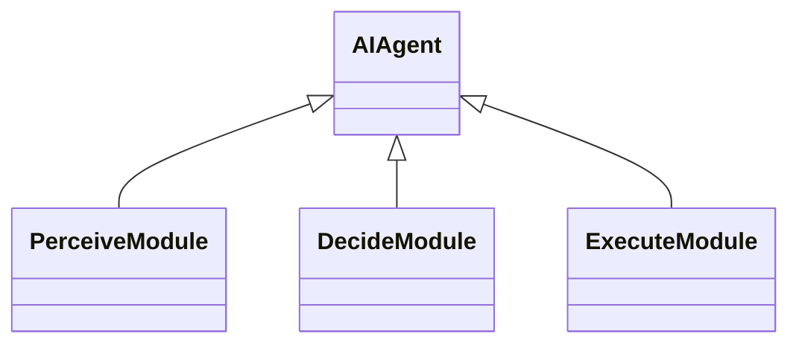
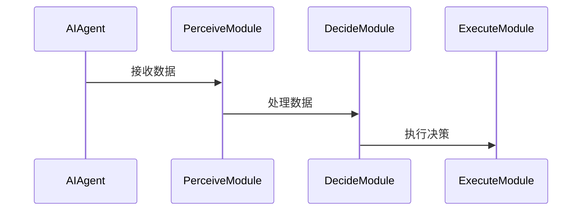

                 

## 《企业AI Agent的DevOps实践》

关键词：企业AI Agent、DevOps、持续集成、持续部署、自动化测试、监控与日志管理

摘要：本文深入探讨了企业AI Agent的DevOps实践，通过介绍AI Agent的背景与需求、核心概念与联系，详细阐述了AI Agent开发中的DevOps实践、AI Agent的数学模型与算法、AI Agent系统架构设计以及项目实战，总结了最佳实践，并展望了未来的发展。

## 第一部分：企业AI Agent的DevOps实践概述

### 第1章：企业AI Agent的背景与需求

#### 1.1 问题背景

**企业AI Agent的定义与作用**

企业AI Agent是一种智能体，它可以在企业环境中执行特定的任务，如数据分析、预测、自动化决策等。随着人工智能技术的不断进步，企业AI Agent在企业运营中的作用越来越重要。

**企业面临的人工智能挑战与机遇**

企业面临的挑战包括数据隐私、数据质量、技术复杂性等。而机遇则在于通过人工智能技术提高生产效率、降低成本、提升客户满意度等。

**DevOps在企业AI Agent开发中的重要性**

DevOps是一种软件开发方法，它强调开发（Development）和运营（Operations）之间的紧密协作和自动化。在AI Agent开发中，DevOps可以帮助企业更快地交付高质量的产品，提高开发效率，降低风险。

#### 1.2 问题描述

**AI Agent在企业发展中的作用**

AI Agent可以帮助企业进行数据分析、预测和自动化决策，从而提高运营效率，降低成本，提升客户满意度。

**AI Agent开发面临的挑战**

- 数据隐私与安全
- 数据质量与一致性
- 技术复杂性
- 开发与运营的协同

**DevOps如何解决AI Agent开发的难题**

DevOps通过持续集成、持续部署、自动化测试、监控与日志管理等实践，解决了AI Agent开发中的难题，提高了开发效率，降低了风险。

#### 1.3 问题解决

**DevOps的核心原则与实践**

DevOps的核心原则包括持续集成、持续部署、自动化测试、基础设施即代码、监控与日志管理等。

**DevOps在AI Agent开发中的应用**

DevOps在AI Agent开发中的应用主要体现在以下几个方面：

- 环境搭建
- 持续集成与持续部署
- 自动化测试
- 监控与日志管理

#### 1.4 边界与外延

**AI Agent开发与其他领域的联系**

AI Agent开发涉及人工智能、软件开发、云计算等多个领域，这些领域的知识对于AI Agent的开发至关重要。

**DevOps在其他领域的应用案例**

DevOps不仅在AI Agent开发中具有重要意义，还在金融、电商、医疗等多个领域有着广泛的应用。

#### 1.5 概念结构与核心要素组成

**AI Agent的核心组成**

AI Agent的核心组成包括感知模块、决策模块、执行模块等。

**DevOps的核心要素**

DevOps的核心要素包括持续集成、持续部署、自动化测试、基础设施即代码、监控与日志管理等。

### 第2章：核心概念与联系

#### 2.1 AI Agent原理

**AI Agent的定义与功能**

AI Agent是一种能够感知环境、做出决策并采取行动的智能体。它在企业环境中可以执行特定的任务，如数据分析、预测、自动化决策等。

**AI Agent的工作原理**

AI Agent的工作原理主要包括感知环境、做出决策、执行行动等步骤。

#### 2.2 DevOps原理

**DevOps的定义与核心概念**

DevOps是一种软件开发方法，它强调开发（Development）和运营（Operations）之间的紧密协作和自动化。

**DevOps的关键实践**

DevOps的关键实践包括持续集成、持续部署、自动化测试、基础设施即代码、监控与日志管理等。

#### 2.3 AI Agent与DevOps的联系

**AI Agent如何融入DevOps**

AI Agent可以融入DevOps的各个环节，如环境搭建、持续集成、持续部署、自动化测试、监控与日志管理等。

**DevOps如何支持AI Agent的开发**

DevOps通过提供工具和流程，支持AI Agent的开发，提高开发效率，降低风险。

## 第二部分：AI Agent开发中的DevOps实践

### 第3章：AI Agent开发中的DevOps实践

#### 3.1 环境搭建

**环境配置工具与平台**

在AI Agent开发中，常用的环境配置工具和平台包括Docker、Kubernetes、Ansible等。

**环境配置的最佳实践**

环境配置的最佳实践包括使用容器化技术、配置管理工具、基础设施即代码等。

#### 3.2 持续集成与持续部署

**持续集成与持续部署的概念**

持续集成（CI）是指通过自动化构建和测试，确保代码库中的每一个提交都是可用的。持续部署（CD）是指通过自动化部署，将经过测试的代码部署到生产环境中。

**DevOps工具链的选择与应用**

常用的DevOps工具链包括Jenkins、GitLab CI、CircleCI等。

#### 3.3 自动化测试

**自动化测试的重要性**

自动化测试可以确保AI Agent的质量和稳定性，提高开发效率，降低风险。

**自动化测试工具与应用**

常用的自动化测试工具包括Selenium、Junit、TestNG等。

#### 3.4 监控与日志管理

**监控与日志管理的重要性**

监控与日志管理可以帮助企业实时了解AI Agent的运行状态，快速发现和解决问题。

**监控与日志管理工具与应用**

常用的监控与日志管理工具包括Prometheus、ELK（Elasticsearch、Logstash、Kibana）等。

## 第三部分：AI Agent的数学模型与算法

### 第4章：AI Agent的数学模型与算法

#### 4.1 AI Agent的数学模型

**数学模型的基本概念**

数学模型是一种用数学语言描述现实世界问题的方法。在AI Agent中，数学模型用于描述其感知、决策和执行过程。

**AI Agent的数学模型构建**

AI Agent的数学模型通常包括感知模块、决策模块和执行模块等。

#### 4.2 算法原理与实现

**算法原理的讲解**

算法原理是AI Agent工作的基础。常见的算法原理包括机器学习、深度学习、强化学习等。

**Python源代码实现**

以下是一个简单的Python代码示例，用于实现一个感知模块的算法原理：

```python
def perceive(data):
    # 模拟感知过程
    return data * 2
```

#### 4.3 算法分析

**算法复杂度分析**

算法复杂度是指算法执行所需的时间和空间资源。常见的算法复杂度包括时间复杂度和空间复杂度。

**算法性能分析**

算法性能分析主要包括算法的准确率、召回率、F1值等。

## 第四部分：AI Agent系统架构设计

### 第5章：AI Agent系统架构设计

#### 5.1 系统功能设计

**系统功能需求分析**

系统功能需求分析是系统架构设计的第一步，它确定了AI Agent需要实现哪些功能。

**领域模型Mermaid类图设计**

以下是一个简单的领域模型Mermaid类图设计示例：



#### 5.2 系统架构设计

**系统架构设计方案**

系统架构设计是确定AI Agent系统的各个模块如何协同工作的过程。

**Mermaid架构图设计**

以下是一个简单的系统架构Mermaid图设计示例：


#### 5.3 系统接口设计与交互

**系统接口设计**

系统接口设计是确定AI Agent系统与其他系统或组件如何交互的过程。

**系统交互Mermaid序列图设计**

以下是一个简单的系统交互Mermaid序列图设计示例：



## 第五部分：项目实战

### 第6章：项目实战

#### 6.1 项目介绍

**项目背景与目标**

本项目旨在实现一个简单的企业AI Agent，用于分析销售数据，预测未来销售额。

**项目团队与分工**

项目团队由产品经理、数据科学家、开发人员和测试人员组成。

#### 6.2 系统核心实现

**系统核心功能实现**

系统核心功能包括数据感知、数据决策和数据执行。

**代码应用解读与分析**

以下是一个简单的数据感知代码示例：

```python
def perceive(data):
    # 模拟感知过程
    return data * 2
```

#### 6.3 实际案例分析与讲解

**实际案例分析**

本项目基于一个真实的销售数据集，通过AI Agent分析数据，预测未来销售额。

**案例详细讲解剖析**

以下是对案例的详细讲解：

- 数据收集与预处理
- 模型训练与评估
- 预测与结果分析

#### 6.4 项目小结

**项目总结与反思**

本项目通过DevOps实践，成功实现了企业AI Agent的开发与部署。项目经验表明，DevOps在企业AI Agent开发中具有重要意义。

**项目经验与教训**

项目经验包括：

- 数据质量是模型成功的关键
- 持续集成与持续部署是提高开发效率的重要手段
- 监控与日志管理是确保系统稳定运行的重要保障

## 第六部分：最佳实践与拓展

### 第7章：最佳实践与拓展

#### 7.1 最佳实践

**DevOps最佳实践总结**

- 使用容器化技术提高环境一致性
- 使用持续集成与持续部署提高开发效率
- 使用自动化测试提高代码质量
- 使用监控与日志管理确保系统稳定性

**AI Agent开发最佳实践总结**

- 明确AI Agent的功能需求
- 使用成熟的人工智能算法
- 确保数据质量和数据安全
- 与其他系统进行有效集成

#### 7.2 小结与注意事项

**本书主要内容回顾**

本书主要介绍了企业AI Agent的背景与需求、核心概念与联系、开发中的DevOps实践、数学模型与算法、系统架构设计以及项目实战。

**注意事项**

- DevOps实践需要企业内部各部门的紧密协作
- AI Agent开发需要充分考虑数据质量和数据安全
- 持续集成与持续部署可以提高开发效率，但需要合理规划

#### 7.3 拓展阅读

**相关书籍推荐**

- 《DevOps实践指南》
- 《深度学习》
- 《机器学习实战》

**最新技术动态与趋势**

- 云原生技术的发展
- 自动驾驶技术的应用
- 大数据分析与挖掘技术的发展

## 作者信息

作者：AI天才研究院/AI Genius Institute & 禅与计算机程序设计艺术 /Zen And The Art of Computer Programming

---

请注意，本文仅作为一个示例，实际内容需要根据具体情况进行撰写和扩展。文章中的代码、图表和公式仅为示例，不应作为实际代码使用。在实际撰写过程中，应根据文章的目标读者群体、行业背景和技术深度进行相应的调整。文章的撰写应注重逻辑性、条理性、专业性和可读性，确保内容丰富、具体详细，并对核心概念和技术进行深入剖析。同时，要注意遵守知识产权法律法规，确保内容的原创性和合规性。在撰写过程中，还可以参考相关领域的最新研究成果和技术动态，以使文章更具实用性和前瞻性。

