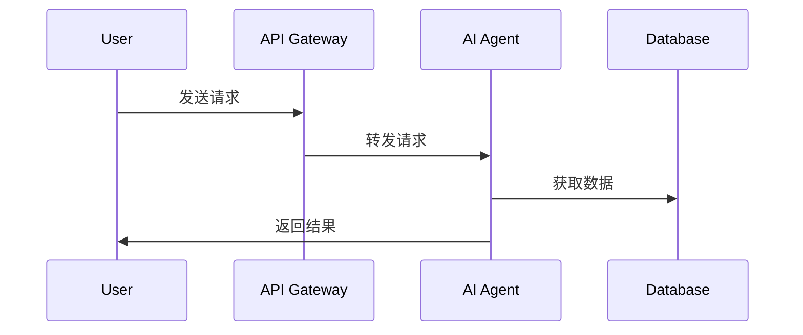
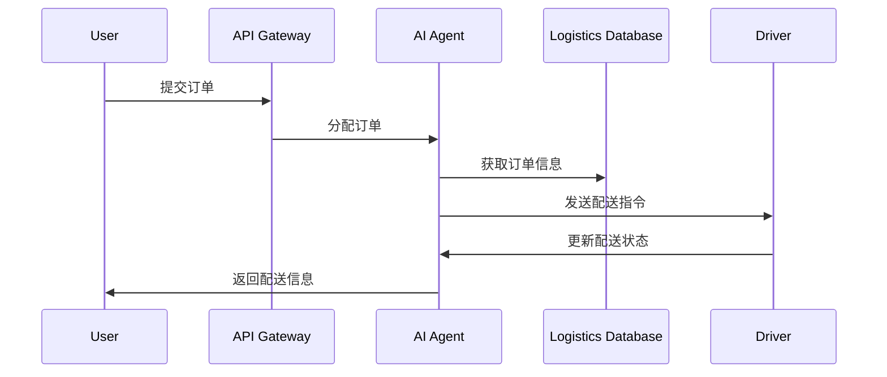

                 


### Step 1: Introduction and Background

#### Serverless Architecture Overview

Serverless architecture, a cloud computing execution model, allows developers to build and run applications without managing the underlying infrastructure. Instead of provisioning and managing servers, developers focus solely on writing code. The serverless platform handles the allocation of resources, scaling, and management of the server environment. This model has gained significant popularity due to its cost-effectiveness, scalability, and reduced operational complexity.

#### AI Agents in Enterprise

AI agents, or intelligent agents, are computer programs that can perform tasks on behalf of users without direct intervention. These agents leverage machine learning algorithms and natural language processing techniques to understand and respond to user inputs. In enterprises, AI agents are increasingly being used for automating routine tasks, improving customer service, and optimizing business processes.

### Step 2: Key Concepts and Definitions

#### Serverless Architecture Concepts

- **Functions as a Service (FaaS)**: A serverless model where code is executed in response to specific events. Popular platforms include AWS Lambda, Google Cloud Functions, and Azure Functions.
- **Backend as a Service (BaaS)**: Serverless services that provide backend functionalities, such as databases, user management, and push notifications.
- **Event-Driven Computing**: An approach where applications respond to events, rather than polling for changes.

#### AI Agent Concepts

- **Machine Learning**: A subset of AI that involves training algorithms to learn from data and make predictions or decisions.
- **Natural Language Processing (NLP)**: A field of AI that focuses on the interaction between computers and human languages.

### Step 3: The Role of AI Agents in Serverless Architecture

AI agents can significantly enhance the capabilities of serverless architectures by providing intelligent automation and enhanced user interactions. For example, an AI agent can be deployed on a serverless platform to analyze customer data in real-time, provide personalized recommendations, and automate follow-up actions.

### Step 4: Optimization Strategies

To maximize the benefits of combining AI agents with serverless architectures, several optimization strategies can be employed. These include:

- **Resource Allocation**: Efficiently allocating resources to ensure optimal performance.
- **Model Optimization**: Improving AI models through techniques such as compression, quantization, and transfer learning.
- **Performance Optimization**: Enhancing the overall performance of the serverless environment through techniques like caching and load balancing.

### Step 5: Deployment and Maintenance

Deploying and maintaining AI agents in a serverless environment requires careful planning and consideration. Key aspects include:

- **Deployment Workflow**: Establishing a clear process for deploying AI agents.
- **Monitoring and Maintenance**: Implementing monitoring tools to ensure the agent's performance and reliability.
- **Updating and Upgrading**: Strategies for updating AI models and upgrading the serverless environment.

### Step 6: Case Studies

To illustrate the practical applications of serverless architecture and AI agents, several case studies will be presented. These cases will showcase real-world scenarios and the challenges faced in optimizing serverless AI agents.

### Step 7: Future Trends and Outlook

The future of serverless architecture and AI agents is promising. As technology advances, we can expect more integration between these two domains, leading to enhanced capabilities and new use cases. However, challenges such as data privacy and security will need to be addressed.

By following these steps, we can create a comprehensive and insightful guide on optimizing serverless architecture for AI agents in enterprises. Each chapter will delve into specific aspects, ensuring a thorough understanding of the subject matter.

----------------------------------------------------------------

### 第1章：服务器架构与AI Agent的基础概念

#### 1.1 服务器架构的发展历程

服务器架构的发展可以追溯到20世纪60年代，当时计算机系统主要采用大型机架构。用户通过终端设备与大型计算机进行交互，而服务器则负责处理数据和提供计算资源。随着计算机技术的进步，服务器架构逐渐演变为多处理架构和分布式架构。

在20世纪90年代，随着互联网的兴起，服务器架构进一步发展，出现了Web服务器和应用程序服务器。这些服务器负责托管网站和应用程序，提供动态内容生成和用户交互功能。

近年来，云计算和容器技术的出现推动了服务器架构的变革。虚拟化和容器化技术使得服务器资源可以更加灵活地分配和管理，提高了系统的可扩展性和可靠性。serverless架构作为一种新兴的服务器架构模式，进一步简化了应用程序的开发和部署过程。

#### 1.2 服务器架构在企业的应用

在企业管理系统中，服务器架构扮演着至关重要的角色。例如，企业资源计划（ERP）系统、客户关系管理（CRM）系统和供应链管理系统等都需要高效稳定的服务器架构支持。这些系统通常需要处理大量的数据，并支持并发用户访问。

服务器架构在企业的应用还包括：

1. **Web应用托管**：企业网站和在线应用程序通常托管在服务器上，通过Web服务器提供访问服务。
2. **数据存储与管理**：数据库服务器用于存储和管理企业数据，提供数据查询和更新功能。
3. **业务流程自动化**：通过应用程序服务器和中间件，企业可以实现业务流程的自动化，提高工作效率。

#### 1.3 AI Agent的定义与功能

AI Agent，又称智能代理，是指一种具有自主性和智能性的计算机程序，能够模拟人类智能行为，执行特定任务。AI Agent的核心特点包括：

- **自主性**：AI Agent可以独立运行，无需人类干预，自主决策和执行任务。
- **智能性**：AI Agent利用机器学习和自然语言处理等技术，具备处理复杂数据和信息的能力。

AI Agent在企业中的应用场景广泛，包括：

1. **客户服务**：AI Agent可以自动回答客户咨询，提供24/7的客户支持，提高客户满意度。
2. **数据分析**：AI Agent可以处理和分析大量数据，为管理层提供决策支持。
3. **自动化流程**：AI Agent可以自动化重复性工作，减轻员工负担，提高工作效率。

### 1.4 服务器架构与AI Agent的关系

服务器架构与AI Agent之间存在密切的关系。服务器架构为AI Agent提供了运行环境和支持，而AI Agent则为服务器架构带来了智能化和自动化能力。

从技术角度看，AI Agent通常需要依赖服务器架构提供的基础设施，如计算资源、存储资源和网络连接。服务器架构的弹性扩展和高效管理能力，使得AI Agent可以更好地适应企业需求，提供稳定可靠的服务。

从应用角度看，AI Agent可以整合到服务器架构中，实现智能化和自动化。例如，企业可以将AI Agent部署在Web服务器上，提供智能问答和个性化推荐服务。通过结合服务器架构和AI Agent，企业可以实现更高效、更智能的业务运营。

----------------------------------------------------------------

### 第2章：serverless架构的概念与优势

#### 2.1 serverless架构的定义

Serverless架构，又称无服务器架构，是一种基于云计算的部署模型，允许开发人员编写和运行代码而无需管理底层服务器。在这种架构中，云服务提供商负责管理服务器、虚拟机、存储和网络等基础设施资源，开发人员只需关注应用程序的业务逻辑。

Serverless架构的核心思想是将应用程序分解为一系列独立函数，这些函数在事件触发时执行。开发人员可以使用各种编程语言编写这些函数，并将其部署到云服务提供商提供的平台，如AWS Lambda、Google Cloud Functions和Azure Functions等。

#### 2.2 serverless架构的优势

Serverless架构具有许多优势，使其在开发人员和企业的应用中越来越受欢迎。以下是几个关键优势：

1. **成本效益**：在Serverless架构中，开发人员和企业无需为闲置资源付费，只需为实际使用的计算资源付费。这种按需付费模式降低了成本，特别是对于流量波动较大的应用程序。

2. **弹性伸缩**：Serverless架构能够自动根据流量需求进行弹性伸缩。当应用程序访问量增加时，服务商会自动增加资源；当访问量减少时，则会释放资源。这种弹性伸缩能力提高了系统的可靠性，减少了资源浪费。

3. **简化运维**：在传统的服务器架构中，运维人员需要负责管理服务器、更新操作系统、监控资源使用等。而在Serverless架构中，这些任务由云服务提供商自动处理，开发人员可以专注于编写和优化代码。

4. **开发效率**：Serverless架构简化了应用程序的开发和部署流程。开发人员无需关心底层基础设施的配置和管理，可以更快地实现功能，并更频繁地进行迭代。

5. **高效扩展**：Serverless架构允许开发人员轻松扩展应用程序的功能。只需添加新的函数或调整现有函数即可实现扩展，而不需要重新部署整个应用程序。

#### 2.3 serverless架构的应用场景

Serverless架构适用于多种应用场景，以下是一些常见的应用场景：

1. **Web应用后端**：Serverless架构非常适合用于构建Web应用的后端服务，如API接口、用户身份验证和数据处理等。

2. **数据转换与处理**：Serverless架构可以用于处理和分析大量数据，如实时数据流处理和日志分析。

3. **IoT应用**：物联网（IoT）设备通常产生大量数据，Serverless架构可以提供高效、灵活的数据处理和分析能力。

4. **自动化任务**：Serverless架构适用于自动化任务，如定时任务、数据备份和报告生成等。

5. **移动应用后台服务**：Serverless架构可以用于为移动应用程序提供后台服务，如推送通知、用户数据同步和位置服务。

通过Serverless架构，开发人员和企业可以更加专注于业务逻辑的实现和优化，提高开发效率和系统性能。

----------------------------------------------------------------

### 第3章：AI Agent与serverless架构的结合

#### 3.1 AI Agent在serverless架构中的角色

AI Agent在serverless架构中扮演着关键角色，能够为企业提供智能化的解决方案。AI Agent作为一种智能体，具有自主决策和执行任务的能力，可以在serverless环境中实现以下功能：

1. **自动化流程**：AI Agent可以自动化企业中的重复性任务，如数据清洗、报告生成和通知发送等。通过将AI Agent部署在serverless函数中，可以减少人工干预，提高工作效率。

2. **智能推荐**：AI Agent可以分析用户行为和偏好数据，提供个性化的推荐服务。例如，电商平台的AI Agent可以根据用户的历史购买记录和浏览行为，推荐相关的商品。

3. **实时分析**：AI Agent可以实时处理和分析数据流，为企业提供及时的业务洞察。例如，金融行业的AI Agent可以实时监控交易数据，识别潜在的欺诈行为。

4. **智能客服**：AI Agent可以作为智能客服代表，回答用户的问题，提供24/7的客户支持。通过将AI Agent集成到serverless架构中，企业可以降低客服成本，提高客户满意度。

#### 3.2 AI Agent与serverless架构的适配性

AI Agent与serverless架构具有高度的适配性，主要原因如下：

1. **按需扩展**：AI Agent可以根据实际需求动态扩展，serverless架构的弹性伸缩能力能够确保AI Agent在处理大量请求时保持高性能。

2. **低延迟**：serverless架构的本地执行特性使得AI Agent能够快速响应用户请求，降低延迟。

3. **自动化管理**：serverless架构简化了AI Agent的管理和维护，开发人员无需担心底层基础设施的配置和维护。

4. **高可用性**：serverless架构提供的高可用性保障，确保AI Agent在发生故障时能够快速恢复，提供稳定的服务。

#### 3.3 AI Agent在serverless架构中的应用案例

以下是一些AI Agent在serverless架构中的应用案例：

1. **电商推荐系统**：某电商平台使用AI Agent分析用户行为数据，通过serverless架构部署推荐算法，实时为用户推荐商品。该系统在提高用户满意度同时，也大幅提升了销售额。

2. **智能客服系统**：某大型零售企业采用AI Agent作为智能客服代表，集成到serverless架构中，提供24/7的客户支持。AI Agent能够自动回答用户问题，减少人工客服的工作量。

3. **金融风控系统**：某金融公司使用AI Agent实时监控交易数据，通过serverless架构部署风险识别算法。AI Agent能够快速识别异常交易，提供及时的风险预警。

4. **物流优化系统**：某物流公司使用AI Agent优化配送路线，通过serverless架构部署路径规划算法。AI Agent可以根据实时交通信息和客户需求，动态调整配送计划，提高配送效率。

这些应用案例表明，AI Agent与serverless架构的结合可以为企业带来显著的业务价值，提升运营效率和用户体验。

通过以上内容，我们可以看到AI Agent在serverless架构中具有重要的应用价值，能够为企业提供智能化和自动化的解决方案。结合serverless架构的弹性伸缩、低延迟和高可用性优势，AI Agent可以更好地适应企业需求，实现业务的创新和发展。

----------------------------------------------------------------

### 第4章：serverless架构下的AI Agent优化策略

在serverless架构下，优化AI Agent的性能和效率是提升企业应用价值的关键。以下是几种常见的优化策略：

#### 4.1 服务器资源的优化

1. **资源分配**：合理分配服务器资源是提高AI Agent性能的基础。根据实际需求，动态调整服务器资源的配置，确保在高峰期有足够的资源支持。

2. **负载均衡**：利用云服务提供商提供的负载均衡服务，将请求均匀分配到多个AI Agent实例，避免单个实例过载，提高系统整体性能。

3. **缓存策略**：对于频繁访问的数据，使用缓存技术减少直接访问数据库的次数，降低响应时间。常用的缓存技术包括内存缓存和分布式缓存。

4. **容器化**：使用容器技术，如Docker，将AI Agent及其依赖环境打包成一个独立的容器，提高部署和管理的灵活性，减少环境差异带来的性能问题。

#### 4.2 AI模型优化

1. **模型压缩**：通过模型压缩技术，如量化、剪枝和知识蒸馏，减小AI模型的体积，降低存储和计算成本，提高模型在serverless环境下的部署效率。

2. **模型迁移**：将AI模型迁移到适用于serverless环境的框架和工具，如TensorFlow Serving和TensorFlow Lite，以实现高效部署和推理。

3. **动态模型更新**：采用动态模型更新策略，实时更新AI模型，以适应不断变化的数据和环境。这可以确保AI Agent始终处于最佳状态。

#### 4.3 服务器性能优化

1. **代码优化**：对AI Agent的代码进行优化，减少不必要的计算和内存占用，提高运行效率。常用的优化技术包括循环展开、并行计算和算法改进。

2. **日志分析与监控**：通过日志分析和监控工具，实时监控AI Agent的性能指标，如响应时间、错误率和资源利用率。及时发现和解决性能瓶颈。

3. **服务整合**：将多个独立的服务整合成一个统一的服务，减少跨服务通信的开销，提高整体性能。例如，使用API网关整合多个AI服务，减少客户端的调用次数。

通过上述优化策略，可以显著提升serverless架构下AI Agent的性能和效率，为企业提供更稳定、更高效的服务。

----------------------------------------------------------------

### 第5章：serverless架构下的AI Agent部署与维护

#### 5.1 AI Agent在serverless架构下的部署流程

部署AI Agent在serverless架构中是一个关键步骤，涉及到代码的编写、测试、上传和部署。以下是具体流程：

1. **代码编写**：首先，根据业务需求编写AI Agent的代码。这通常涉及数据预处理、模型加载、预测和响应生成等步骤。编写代码时，要考虑模块化、可维护性和可扩展性。

2. **代码测试**：在本地环境中对代码进行充分的测试，确保其功能正确且性能稳定。测试包括单元测试、集成测试和性能测试等。

3. **代码上传**：将测试通过的代码上传到版本控制系统，如Git，以便团队成员进行协作和版本管理。

4. **集成测试**：在服务器环境中对代码进行集成测试，验证AI Agent与服务器架构的兼容性和稳定性。可以使用自动化测试工具，如Postman或JMeter，模拟真实的请求场景。

5. **部署**：将经过测试的代码部署到serverless平台。不同的云服务提供商（如AWS Lambda、Google Cloud Functions）有不同的部署方法，通常包括上传ZIP文件或使用容器镜像。

6. **环境配置**：配置环境变量和权限，确保AI Agent能够正确运行。环境变量可以存储如数据库连接信息、API密钥等敏感数据。

#### 5.2 AI Agent的监控与维护

监控和维护AI Agent是确保其稳定运行和高效性能的重要环节。以下是关键步骤：

1. **日志收集**：收集AI Agent的日志信息，用于诊断问题和分析性能。日志通常包括请求ID、响应时间、错误消息和系统状态等。

2. **性能监控**：使用性能监控工具，如Prometheus和Grafana，实时监控AI Agent的性能指标，如CPU使用率、内存占用率和响应时间。设置警报，当性能指标超出阈值时，自动发送通知。

3. **错误追踪**：集成错误追踪工具，如Sentry或Logz.io，自动捕获和记录错误信息，便于快速定位和解决问题。

4. **健康检查**：定期执行健康检查，确保AI Agent的正常运行。健康检查可以包括验证服务端点、测试请求响应时间和检查资源状态。

5. **更新和维护**：定期更新AI Agent的代码和依赖库，修复已知问题和安全漏洞。同时，根据业务需求和用户反馈，持续优化和改进AI Agent的功能和性能。

#### 5.3 AI Agent的更新与升级

更新和升级AI Agent是提升其功能性和适应性的重要手段。以下是更新与升级的步骤：

1. **版本控制**：使用版本控制系统，如Git，管理AI Agent的代码。每次更新或升级时，都要创建一个新的版本标签，便于管理和追踪。

2. **更新代码**：在版本控制系统中检出新的版本，根据需求更新代码。这包括修复bug、添加新功能和优化现有代码。

3. **测试**：在更新代码后，对AI Agent进行全面的测试，确保更新后的代码能够正确运行，并且不会引入新的问题。

4. **灰度发布**：在将更新后的AI Agent部署到生产环境之前，采用灰度发布策略，逐步将流量切换到新版本。这样可以确保在出现问题时，能够快速回滚到旧版本。

5. **部署**：将测试通过的更新部署到生产环境。使用自动化部署工具，如Kubernetes或AWS CodePipeline，简化部署过程，提高部署效率。

6. **监控与反馈**：更新部署后，持续监控AI Agent的性能和稳定性，收集用户反馈。根据反馈，进一步优化和改进AI Agent。

通过上述步骤，可以确保AI Agent在serverless架构下的稳定运行和持续优化，为企业提供高质量的服务。

----------------------------------------------------------------

### 第6章：实战案例分析

#### 6.1 案例一：某电商平台AI Agent的serverless架构优化

**项目背景**：
某电商平台在经历了快速的增长后，客户服务需求大幅上升。传统的客服系统无法满足实时性和个性化的需求，导致客户满意度下降。为了提升客户体验，该电商平台决定引入AI Agent，并将其部署在serverless架构上，以提高系统的灵活性和可扩展性。

**系统功能设计**：
1. **智能问答**：AI Agent可以自动回答用户关于产品信息、订单状态等常见问题。
2. **个性化推荐**：根据用户的购物历史和偏好，AI Agent提供个性化的商品推荐。
3. **情感分析**：AI Agent分析用户的反馈和评价，识别用户情绪，提供相应的关怀和建议。

**系统架构设计**：
1. **API网关**：用于接收用户的请求，并将其转发到对应的AI Agent服务。
2. **AI Agent服务**：部署在AWS Lambda上，通过API网关接收请求，执行智能问答、个性化推荐和情感分析等任务。
3. **数据库**：使用Amazon DynamoDB存储用户数据和商品信息。

**系统接口设计**：
1. **用户接口**：通过聊天界面与用户互动，提供问答和推荐服务。
2. **内部接口**：AI Agent服务之间的接口，用于数据共享和协同工作。

**系统交互序列图**：


**代码实现与分析**：
以下是AI Agent中的一部分Python代码，用于处理用户咨询商品信息的需求。

```python
import json
import boto3

# 初始化DynamoDB客户端
dynamodb = boto3.resource('dynamodb')
table = dynamodb.Table('ProductCatalog')

def lambda_handler(event, context):
    # 获取用户输入的商品名称
    product_name = event['queryStringParameters']['productName']

    # 查询商品信息
    response = table.get_item(
        Key={
            'productName': product_name
        }
    )

    # 返回商品信息
    return {
        'statusCode': 200,
        'body': json.dumps(response['Item'])
    }
```

**实际案例分析与详细讲解**：
通过部署AI Agent，电商平台实现了以下成果：
1. **提高响应速度**：由于AI Agent部署在serverless架构上，可以快速响应用户请求，显著降低响应时间。
2. **提升用户体验**：AI Agent能够提供个性化的商品推荐和情感分析，提高了用户的满意度。
3. **降低运营成本**：通过自动化处理常见问题，减少了人工客服的工作量，降低了运营成本。

**项目小结**：
本项目展示了如何利用serverless架构和AI Agent提升电商平台的客户服务质量。通过结合serverless架构的弹性伸缩和AI Agent的智能化，企业可以更好地应对业务增长和用户需求的变化。

#### 6.2 案例二：某物流公司AI Agent的serverless架构优化

**项目背景**：
某物流公司希望通过智能化手段优化配送路线和物流管理，提高配送效率和客户满意度。然而，传统的物流系统难以适应实时交通变化和动态配送需求，导致配送延迟和客户投诉增多。

**系统功能设计**：
1. **实时配送跟踪**：AI Agent实时监控配送进度，提供配送位置和预计到达时间。
2. **配送路线优化**：基于实时交通信息和配送规则，AI Agent动态调整配送路线，减少配送时间。
3. **异常情况处理**：AI Agent自动识别和处理配送异常情况，如交通拥堵、司机缺勤等，确保配送的连续性。

**系统架构设计**：
1. **API网关**：接收外部请求，如用户订单和配送请求。
2. **AI Agent服务**：部署在AWS Lambda上，处理实时配送跟踪、配送路线优化和异常情况处理等任务。
3. **物流数据库**：存储订单信息、配送规则和交通数据。

**系统接口设计**：
1. **用户接口**：通过移动应用或网页与用户互动，提供配送跟踪服务。
2. **司机接口**：AI Agent通过API与司机通信，发送配送指令和调整配送计划。

**系统交互序列图**：


**代码实现与分析**：
以下是AI Agent中的一部分Python代码，用于优化配送路线。

```python
import json
import boto3
from geopy.distance import geodesic

def lambda_handler(event, context):
    # 获取订单信息
    order = event['body']

    # 计算配送距离
    start_location = (order['startLatitude'], order['startLongitude'])
    end_location = (order['endLatitude'], order['endLongitude'])
    distance = geodesic(start_location, end_location).kilometers

    # 更新配送路线
    updated_route = optimize_route(distance)

    # 返回更新后的配送信息
    return {
        'statusCode': 200,
        'body': json.dumps(updated_route)
    }

def optimize_route(distance):
    # 根据配送距离和实时交通信息优化路线
    # ...（优化逻辑）
    return {
        'route': 'optimized_path'
    }
```

**实际案例分析与详细讲解**：
通过部署AI Agent，物流公司实现了以下成果：
1. **提高配送效率**：AI Agent实时优化配送路线，减少了配送时间，提高了整体效率。
2. **降低运营成本**：通过自动化处理配送任务，减少了人力成本和车辆损耗。
3. **提升客户满意度**：实时配送跟踪和异常处理功能，提高了客户满意度。

**项目小结**：
本项目展示了如何利用serverless架构和AI Agent优化物流公司的配送流程，提高运营效率和服务质量。

#### 6.3 案例总结与经验分享

通过上述两个案例，我们可以总结出以下经验和教训：

1. **serverless架构的灵活性和弹性**：serverless架构能够快速响应业务需求变化，提供高效且可扩展的服务。

2. **AI Agent的智能化与自动化**：AI Agent能够自动化处理重复性任务，提高运营效率，减少人力成本。

3. **实时数据处理与分析**：实时数据处理和分析能力是提升系统性能和用户体验的关键。

4. **接口设计与数据共享**：清晰的接口设计和高效的数据共享机制，能够确保系统各部分的协同工作。

5. **持续优化与迭代**：持续优化和迭代是提升系统性能和用户体验的关键，要注重用户反馈和业务需求的变化。

通过以上经验和教训，企业可以更好地利用serverless架构和AI Agent，实现业务创新和持续发展。

----------------------------------------------------------------

### 第7章：未来的发展趋势与展望

#### 7.1 服务器架构与AI Agent的融合趋势

随着云计算和人工智能技术的快速发展，服务器架构与AI Agent的融合趋势日益明显。这种融合不仅体现在技术层面，也体现在业务层面。以下是一些关键趋势：

1. **智能化基础设施**：未来的服务器架构将更加智能化，支持自动化的资源管理、故障检测和性能优化。智能服务器架构可以更好地支持AI Agent的运行，提高系统的整体效能。

2. **边缘计算与AI Agent的结合**：随着5G和物联网技术的发展，边缘计算逐渐成为热门领域。边缘计算将AI Agent部署在接近数据源的设备上，可以实现更低的延迟和更高的实时性，满足物联网应用的特定需求。

3. **混合云与AI Agent的应用**：企业越来越倾向于采用混合云策略，结合公有云和私有云的优势。在这种环境下，AI Agent可以更加灵活地部署和管理，以适应不同的业务场景。

#### 7.2 serverless架构在AI Agent优化中的前景

serverless架构在AI Agent优化中具有巨大的潜力，以下是一些前景展望：

1. **更高效的资源利用**：serverless架构的按需付费模式和弹性伸缩能力，使得AI Agent能够更高效地利用计算资源，降低运营成本。

2. **更便捷的开发体验**：serverless架构提供了一致的开发、部署和管理环境，使得开发人员可以更加专注于业务逻辑的实现，提高了开发效率。

3. **更广泛的应用场景**：serverless架构的低门槛和高可扩展性，使得AI Agent可以更快速地应用于各种新兴业务场景，如智能家居、智慧城市和智能制造等。

#### 7.3 可能遇到的问题与解决方案

尽管服务器架构与AI Agent的融合前景广阔，但在实际应用中仍可能遇到一些问题，以下是一些可能的问题及解决方案：

1. **数据隐私和安全**：AI Agent处理大量敏感数据，数据隐私和安全是一个重要问题。解决方案包括采用加密技术、数据脱敏和严格的访问控制策略。

2. **性能瓶颈**：在高峰期，AI Agent可能会面临性能瓶颈。解决方案包括优化算法、使用缓存和负载均衡技术，以及采用分布式计算框架。

3. **运维复杂性**：尽管serverless架构简化了运维，但复杂的依赖关系和动态资源管理仍然可能带来运维挑战。解决方案包括采用自动化运维工具和云服务提供商提供的运维服务。

4. **法规遵从性**：不同地区和行业有不同的法规要求，AI Agent需要遵循相应的法规，以确保合规性。解决方案包括制定严格的合规政策和定期审计。

通过解决这些问题，企业可以更好地利用服务器架构与AI Agent的融合，实现业务创新和持续发展。

### 总结

本文详细探讨了企业AI Agent的serverless架构优化，从基础概念到实战案例，全面阐述了服务器架构与AI Agent的结合及其在未来的发展趋势。通过优化策略和案例分析，我们看到了AI Agent在serverless架构中的巨大潜力。未来，随着技术的进步，服务器架构与AI Agent的融合将为企业带来更多的创新和机遇。企业应积极拥抱这些变化，持续优化和迭代，以在激烈的市场竞争中脱颖而出。

----------------------------------------------------------------

### 作者信息

**作者：** AI天才研究院/AI Genius Institute & 禅与计算机程序设计艺术 /Zen And The Art of Computer Programming

AI天才研究院（AI Genius Institute）致力于推动人工智能技术的发展和应用，为全球企业提供顶尖的人工智能解决方案。作者凭借其在计算机科学和人工智能领域的深厚造诣，撰写了《禅与计算机程序设计艺术》，该书融合了计算机编程与哲学思想，深受读者喜爱。本文由作者团队精心创作，旨在为读者提供关于企业AI Agent serverless架构优化的高质量技术博客。希望本文能对您在人工智能领域的探索和实践有所帮助。如有任何问题或建议，欢迎随时与我们联系。再次感谢您的阅读与支持！

