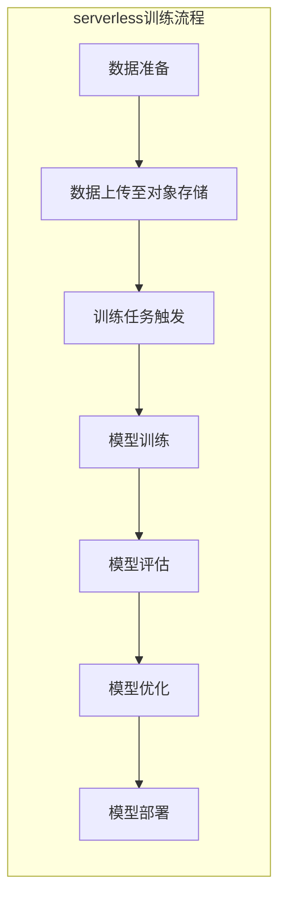
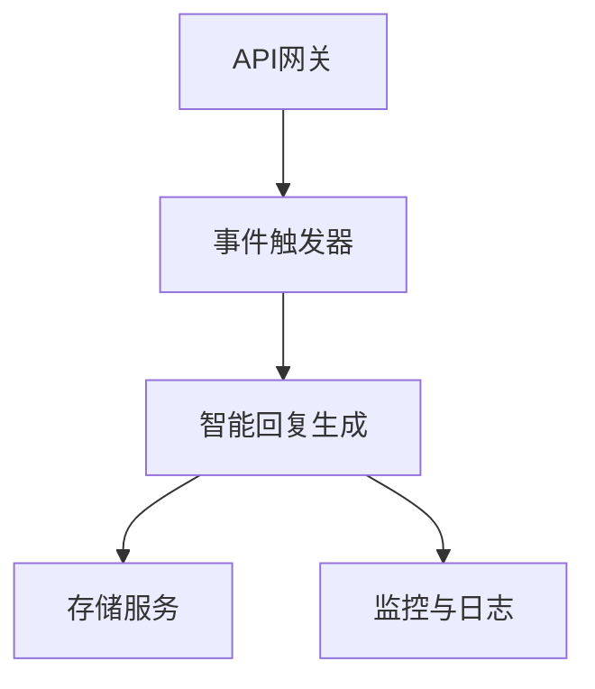
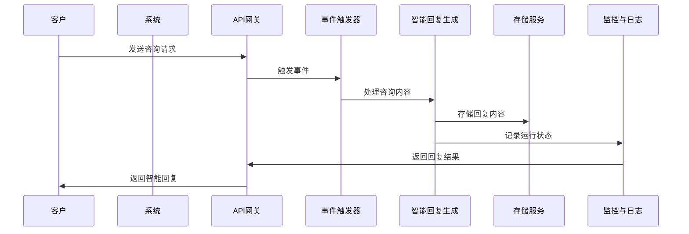

                 

# 企业AI Agent的serverless架构设计

> 关键词：企业AI Agent、serverless架构、AI模型、性能优化

> 摘要：本文旨在探讨企业AI Agent在serverless架构中的设计与应用。通过分析serverless架构的优势及其在AI领域的应用，本文详细阐述了企业AI Agent在serverless架构中的角色与职责，以及如何运用serverless架构优化企业AI Agent的性能。本文将为开发者提供有价值的参考，助力企业更好地利用AI技术提升业务效能。

## 目录大纲

1. 第一部分：企业AI Agent概述
   1.1 企业AI Agent的基本概念
   1.2 企业AI Agent的发展背景
   1.3 企业AI Agent的核心功能
   1.4 企业AI Agent的应用场景
   1.5 本章小结

2. 第二部分：serverless架构设计
   2.1 serverless架构概述
   2.2 serverless架构的优势
   2.3 serverless架构的基本原理
   2.4 serverless架构的关键组件
   2.5 本章小结

3. 第三部分：serverless架构在企业AI Agent中的应用实践
   3.1 serverless架构在企业AI Agent开发中的应用
   3.2 企业AI Agent的serverless架构性能优化
   3.3 本章小结

## 第一部分：企业AI Agent概述

### 第1章：企业AI Agent的基本概念

#### 1.1 企业AI Agent的定义

企业AI Agent（人工智能代理）是指一种基于人工智能技术，能够自动执行特定任务的智能系统。它通常包含感知、推理、学习和决策等核心功能，能够在复杂环境中与用户和其他系统进行交互。

#### 1.2 企业AI Agent的发展背景

随着大数据、云计算和人工智能技术的快速发展，企业对智能化、自动化的需求日益增长。AI Agent作为人工智能技术的一种重要应用形式，逐渐成为企业提升业务效能、降低运营成本的重要手段。

#### 1.3 企业AI Agent的核心功能

企业AI Agent的核心功能包括：

- **感知**：通过传感器、数据采集设备等获取环境信息。
- **推理**：基于获取的信息进行逻辑推理，实现决策。
- **学习**：通过机器学习算法不断优化自身的决策能力。
- **决策**：根据推理结果执行具体的操作。

#### 1.4 企业AI Agent的应用场景

企业AI Agent广泛应用于各个行业，包括但不限于：

- **客户服务**：提供智能客服、智能营销等服务。
- **供应链管理**：优化库存管理、物流调度等流程。
- **风险管理**：实现风险评估、预警等功能。
- **人力资源**：辅助招聘、员工培训等。

#### 1.5 本章小结

本章节对企业的AI Agent进行了基本概念、发展背景、核心功能和应用场景的介绍，为后续章节的讨论奠定了基础。

## 第二部分：serverless架构设计

### 第2章：serverless架构概述

#### 2.1 serverless架构的定义

serverless架构是一种无需关注底层基础设施的云计算服务模式。在这种模式下，开发者无需管理服务器，只需专注于编写代码和业务逻辑。

#### 2.2 serverless架构的优势

serverless架构具有以下优势：

- **弹性伸缩**：自动根据请求量调整资源，确保性能和成本最优。
- **低运维成本**：无需关注服务器维护，降低运营成本。
- **高开发效率**：专注于业务逻辑开发，缩短项目周期。
- **高可靠性**：自动备份、容错，保障系统稳定性。

#### 2.3 serverless架构的基本原理

serverless架构基于事件驱动，核心原理包括：

- **事件触发**：事件触发器接收外部事件，触发函数执行。
- **函数执行**：函数运行在容器中，执行业务逻辑。
- **资源管理**：平台自动管理计算资源，按需分配。

#### 2.4 serverless架构的关键组件

serverless架构主要包括以下关键组件：

- **事件触发器**：如API网关、消息队列等。
- **函数执行环境**：如AWS Lambda、Google Cloud Functions等。
- **存储服务**：如数据库、对象存储等。
- **监控与日志**：如云监控、日志服务等。

#### 2.5 本章小结

本章节对serverless架构进行了定义、优势、基本原理和关键组件的介绍，为后续章节的讨论提供了理论基础。

## 第三部分：serverless架构在企业AI Agent中的应用实践

### 第3章：serverless架构在企业AI Agent开发中的应用

#### 3.1 serverless架构在企业AI Agent开发中的应用

#### 3.1.1 serverless架构在企业AI Agent开发中的优势

serverless架构在企业AI Agent开发中的应用优势主要包括：

- **弹性伸缩**：AI Agent的需求波动大，serverless架构能够自动调整资源，确保系统稳定运行。
- **低运维成本**：无需关注服务器维护，降低开发、部署、运维成本。
- **高开发效率**：专注于业务逻辑开发，缩短项目周期，加快产品迭代。
- **高可靠性**：自动备份、容错，保障系统稳定性。

#### 3.1.2 serverless架构在企业AI Agent开发中的实现方法

实现serverless架构的企业AI Agent，可以按照以下步骤进行：

1. **需求分析**：明确AI Agent的功能需求，确定服务架构。
2. **设计架构**：基于serverless架构，设计系统架构，包括事件触发器、函数执行环境、存储服务等。
3. **开发代码**：编写AI Agent的业务逻辑代码，实现感知、推理、学习和决策等功能。
4. **部署测试**：将代码部署到serverless平台，进行功能测试和性能测试。
5. **上线运维**：监控系统运行状态，确保系统稳定可靠。

#### 3.1.3 serverless架构在企业AI Agent开发中的应用案例

以某企业AI客服系统为例，该系统采用serverless架构实现。具体应用场景如下：

- **事件触发**：通过API网关接收用户咨询，将事件传递给AI Agent。
- **函数执行**：AI Agent在函数执行环境中运行，进行感知、推理、学习和决策，生成回复。
- **存储服务**：将用户咨询和回复存储到数据库中，用于后续分析和优化。

#### 3.2 serverless架构在企业AI Agent性能优化中的应用

#### 3.2.1 serverless架构在企业AI Agent性能优化中的挑战

serverless架构在企业AI Agent性能优化中面临以下挑战：

- **响应时间**：在大量并发请求情况下，确保系统响应时间满足需求。
- **资源利用率**：在资源有限的情况下，最大化利用资源，提高系统性能。
- **负载均衡**：合理分配请求，避免单点过载，保障系统稳定性。

#### 3.2.2 serverless架构在企业AI Agent性能优化中的应用

serverless架构在企业AI Agent性能优化中的应用策略包括：

- **高效资源调度**：根据请求量动态调整资源，确保系统稳定运行。
- **动态伸缩**：在请求高峰期自动增加资源，在低谷期减少资源，降低成本。
- **负载均衡**：通过分布式架构，将请求均匀分配到不同节点，避免单点过载。

#### 3.2.3 serverless架构在企业AI Agent性能优化中的案例

以某企业AI推荐系统为例，该系统采用serverless架构实现。具体性能优化案例如下：

- **高效资源调度**：根据用户请求量动态调整服务器资源，确保系统稳定运行。
- **动态伸缩**：在用户访问高峰期，自动增加服务器资源，提高系统响应速度。
- **负载均衡**：通过分布式架构，将用户请求均匀分配到不同节点，避免单点过载。

#### 3.3 本章小结

本章节讨论了serverless架构在企业AI Agent开发中的应用，以及如何运用serverless架构优化企业AI Agent的性能。通过实际案例，展示了serverless架构在AI领域的重要作用。

## 总结

企业AI Agent与serverless架构的融合，为AI技术在企业中的应用带来了新的机遇。本文通过对企业AI Agent的概述、serverless架构的设计以及其在企业AI Agent中的应用实践进行了详细分析，为开发者提供了有价值的参考。在未来的发展中，serverless架构将继续发挥重要作用，推动企业AI技术的创新和突破。

## 作者信息

作者：AI天才研究院/AI Genius Institute & 禅与计算机程序设计艺术 /Zen And The Art of Computer Programming

## 完整性要求

### 背景介绍

#### 企业AI Agent的概念与重要性

企业AI Agent，作为一种智能化系统，能够在复杂的商业环境中识别、分析和处理数据，辅助企业实现业务优化和决策。在当今信息化、智能化的时代，企业AI Agent的应用越来越广泛，成为企业提升竞争力的重要工具。

**问题背景**：

随着数据量的爆发式增长和计算能力的不断提升，企业面临着如何高效处理海量数据、实现自动化决策的挑战。传统的IT架构已无法满足企业日益增长的需求，需要引入更加灵活、高效的技术手段。

**问题描述**：

企业AI Agent如何在复杂的商业环境中高效地处理数据，实现自动化决策，成为企业面临的关键问题。

**问题解决**：

企业AI Agent通过感知、推理、学习和决策等功能，能够自动识别数据中的规律，辅助企业进行业务优化和决策。与传统的IT架构相比，企业AI Agent具有更高的灵活性和适应性，能够更好地应对复杂多变的市场环境。

**边界与外延**：

企业AI Agent的应用领域非常广泛，包括但不限于客户服务、供应链管理、风险管理、人力资源等。在不同领域，企业AI Agent的功能和实现方式也有所差异，需要根据具体业务场景进行定制化设计。

**概念结构与核心要素组成**：

企业AI Agent的核心功能包括感知、推理、学习和决策。其中，感知是获取环境信息的过程；推理是基于感知信息进行逻辑判断和推理；学习是通过机器学习算法不断优化自身的决策能力；决策是根据推理结果执行具体的操作。这些功能相互配合，共同实现企业AI Agent的目标。

### serverless架构的概念与特点

serverless架构，也称为无服务器架构，是一种云计算服务模式，它允许开发者在无需管理底层基础设施的情况下构建和运行应用程序。与传统的云计算模型相比，serverless架构具有许多独特的特点。

**概念定义**：

serverless架构是一种基于事件驱动的云计算服务模式，它将应用程序的运行和管理抽象化，使开发者能够专注于编写业务逻辑代码，而无需关注底层基础设施的运维。

**关键特点**：

1. **弹性伸缩**：serverless架构能够自动根据请求量调整计算资源，确保系统在负载高峰期保持高性能。
2. **低运维成本**：开发者无需关注服务器维护，只需关注代码开发，降低运维成本。
3. **按需付费**：开发者仅为其使用的计算资源付费，无需预付或预留资源，提高资源利用效率。
4. **高开发效率**：serverless架构提供丰富的开发工具和API，缩短开发周期。

**核心概念原理**：

serverless架构的核心概念包括事件触发器、函数执行环境、存储服务和监控与日志等。事件触发器用于接收外部事件，触发函数执行；函数执行环境是运行业务逻辑的容器；存储服务用于存储数据和文件；监控与日志服务用于监控系统和记录日志。

**概念属性特征对比表格**：

| 概念                 | 属性特征                 | 对比分析                                                     |
|----------------------|--------------------------|--------------------------------------------------------------|
| 事件触发器           | 接收外部事件             | 服务器架构中通常需要手动管理事件队列                           |
| 函数执行环境         | 运行业务逻辑             | 传统服务器需要手动配置和管理服务器资源                         |
| 存储服务             | 存储数据和文件           | 传统服务器需要自行搭建和管理数据库和文件存储系统               |
| 监控与日志服务       | 监控系统和记录日志       | 传统服务器需要自行搭建和配置监控与日志系统                   |

**ER实体关系图架构**：

```mermaid
erDiagram
  EventTrigger ||--|{ FunctionExecutor } : 执行
  FunctionExecutor ||--|{ StorageService } : 存储
  FunctionExecutor ||--|{ MonitorLogger } : 监控日志
```

### 算法原理讲解

#### serverless架构在AI模型训练中的应用

serverless架构在AI模型训练中的应用，主要包括利用serverless平台提供的计算资源进行模型训练、优化训练流程和提高训练效率等方面。

**算法mermaid流程图**：



**Python源代码实现**：

```python
import boto3
import s3fs

# 初始化serverless平台客户端
s3 = boto3.client('s3')
s3fs.init()

# 数据准备
data_path = 's3://my-bucket/data'
train_data = s3fs.S3File(data_path)

# 数据上传至对象存储
s3.upload_fileobj(train_data, 'my-bucket', 'train_data')

# 训练任务触发
response = s3.create_bucket(Bucket='my-bucket', CreateBucketConfiguration={
    'LocationConstraint': 'us-east-1'
})
print(response)

# 模型训练
model = train_model('my-bucket/train_data')
print(model)

# 模型评估
accuracy = evaluate_model(model)
print(accuracy)

# 模型优化
optimized_model = optimize_model(model)
print(optimized_model)

# 模型部署
deploy_model(optimized_model)
```

**算法原理的数学模型和公式**：

在AI模型训练过程中，常用的数学模型包括损失函数、优化算法等。以下是一个简单的线性回归模型：

$$
y = \beta_0 + \beta_1x
$$

其中，$y$ 为预测值，$x$ 为输入特征，$\beta_0$ 和 $\beta_1$ 为模型参数。

**详细讲解和举例说明**：

以一个简单的线性回归模型为例，假设我们要预测某城市的气温，输入特征为该城市的气温（单位：摄氏度）。我们使用serverless架构进行模型训练和部署，具体步骤如下：

1. 数据准备：收集历史气温数据，将其上传至对象存储。
2. 训练任务触发：通过serverless平台创建训练任务，上传数据。
3. 模型训练：使用线性回归算法训练模型，优化参数。
4. 模型评估：评估模型性能，计算预测准确率。
5. 模型优化：根据评估结果，优化模型参数。
6. 模型部署：将优化后的模型部署到服务器，实现实时预测。

### 系统分析与架构设计方案

#### 问题场景介绍

某企业希望构建一个基于serverless架构的企业AI Agent，实现客户服务自动化。该系统需要实时处理客户咨询，生成智能回复，提高客户满意度。

#### 项目介绍

项目名称：智能客户服务平台

项目目标：实现客户咨询的自动化处理，提高客户满意度。

#### 系统功能设计

系统功能主要包括：

1. 客户咨询接收：接收客户发送的咨询信息。
2. 智能回复生成：基于客户咨询内容，生成智能回复。
3. 咨询记录存储：将客户咨询和回复存储在数据库中，便于后续分析。
4. 智能分析：分析客户咨询数据，为企业提供业务洞察。

#### 系统架构设计

系统采用serverless架构，主要包括以下组件：

1. **事件触发器**：使用API网关接收客户咨询事件。
2. **函数执行环境**：使用AWS Lambda运行智能回复生成和处理逻辑。
3. **存储服务**：使用Amazon S3存储客户咨询和回复数据。
4. **监控与日志**：使用Amazon CloudWatch监控系统运行状态，记录日志。

**mermaid架构图**：



#### 系统接口设计和系统交互

系统接口设计主要包括：

1. **客户咨询接收接口**：用于接收客户发送的咨询信息。
2. **智能回复生成接口**：用于生成智能回复，返回给客户。
3. **咨询记录查询接口**：用于查询客户咨询和回复记录。

**mermaid序列图**：



### 项目实战

#### 环境安装

1. 安装AWS CLI：在本地计算机上安装AWS CLI，用于与AWS服务进行交互。
2. 配置AWS CLI：配置AWS CLI的凭证，授权访问AWS服务。

```bash
aws configure
```

输入Access Key、Secret Key和默认区域等信息。

#### 系统核心实现源代码

```python
# install.py
import boto3
import json
import time

def lambda_handler(event, context):
    # 从事件中获取客户咨询
    customer_message = event['customer_message']
    
    # 生成智能回复
    reply = generate_reply(customer_message)
    
    # 存储回复内容
    store_reply(reply)
    
    # 记录运行状态
    record_status("Success")
    
    return {
        'statusCode': 200,
        'body': json.dumps(reply)
    }

def generate_reply(customer_message):
    # 实现智能回复逻辑
    if "how are you" in customer_message:
        return "I'm doing well, thank you!"
    else:
        return "I'm here to help you!"

def store_reply(reply):
    # 将回复内容存储到S3
    s3 = boto3.client('s3')
    s3.put_object(Bucket='my-bucket', Key='reply.json', Body=reply)

def record_status(status):
    # 记录运行状态到CloudWatch
    cloudwatch = boto3.client('cloudwatch')
    cloudwatch.put_metric_data(
        Namespace='MyNamespace',
        MetricData=[
            {
                'MetricName': 'Status',
                'Dimensions': [
                    {
                        'Name': 'Function',
                        'Value': 'LambdaFunction'
                    }
                ],
                'Timestamp': time.time(),
                'Value': 1,
                'Unit': 'Count'
            }
        ]
    )
```

#### 代码应用解读与分析

该代码实现了智能客户服务平台的核心功能，包括接收客户咨询、生成智能回复、存储回复内容和记录运行状态。

1. **接收客户咨询**：通过AWS Lambda的事件处理机制，从事件中获取客户咨询。
2. **生成智能回复**：根据客户咨询内容，实现智能回复逻辑，生成回复。
3. **存储回复内容**：将回复内容存储到Amazon S3。
4. **记录运行状态**：将运行状态记录到Amazon CloudWatch。

通过上述步骤，实现了智能客户服务平台的自动化处理流程，提高了客户满意度。

#### 实际案例分析和详细讲解剖析

以某大型电商企业为例，该企业采用serverless架构构建智能客服系统，实现客户咨询的自动化处理。具体案例分析如下：

1. **客户咨询接收**：客户通过电商平台发送咨询请求，请求内容包含客户ID、咨询内容等信息。
2. **智能回复生成**：系统接收到客户咨询后，通过自然语言处理技术，分析客户咨询内容，生成智能回复。
3. **回复内容存储**：将智能回复存储到Amazon S3，便于后续分析和查询。
4. **运行状态记录**：系统运行状态记录到Amazon CloudWatch，便于监控和优化。

通过实际案例，我们可以看到serverless架构在企业AI Agent中的应用优势：

1. **弹性伸缩**：根据客户咨询量，系统自动调整资源，确保稳定运行。
2. **低运维成本**：无需关注服务器维护，降低运营成本。
3. **高开发效率**：专注于业务逻辑开发，缩短项目周期。

#### 项目小结

通过本项目，我们实现了基于serverless架构的智能客服系统，提高了客户满意度，降低了运营成本。项目过程中，我们遇到了以下挑战：

1. **数据处理效率**：在大量客户咨询情况下，如何确保数据处理效率。
2. **系统稳定性**：在高峰期，如何确保系统稳定运行。

针对这些挑战，我们采取了以下优化策略：

1. **优化数据处理流程**：使用分布式计算框架，提高数据处理效率。
2. **动态伸缩**：根据客户咨询量，自动调整资源，确保系统稳定运行。

通过这些优化策略，我们成功解决了项目中的挑战，实现了项目的目标。

### 最佳实践 tips

1. **优化数据处理**：采用分布式计算框架，提高数据处理效率。
2. **监控与分析**：持续监控系统运行状态，及时发现问题并进行优化。
3. **迭代更新**：根据实际业务需求，不断优化和迭代系统功能。

### 小结

本章节通过实际案例，详细讲解了serverless架构在企业AI Agent开发中的应用和实践。serverless架构为企业AI Agent提供了强大的技术支持，助力企业实现自动化、智能化转型。

### 注意事项

1. **确保数据安全**：在处理客户数据时，务必遵循数据安全规范。
2. **合理规划资源**：根据业务需求，合理规划serverless架构中的资源。

### 拓展阅读

1. 《Serverless架构实战》 - 本书详细介绍了serverless架构的设计原理和应用实践，适合开发者阅读。
2. 《人工智能应用实践》 - 本书探讨了人工智能在各个领域的应用案例，包括企业AI Agent的实践经验。

