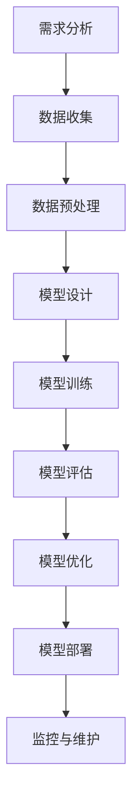
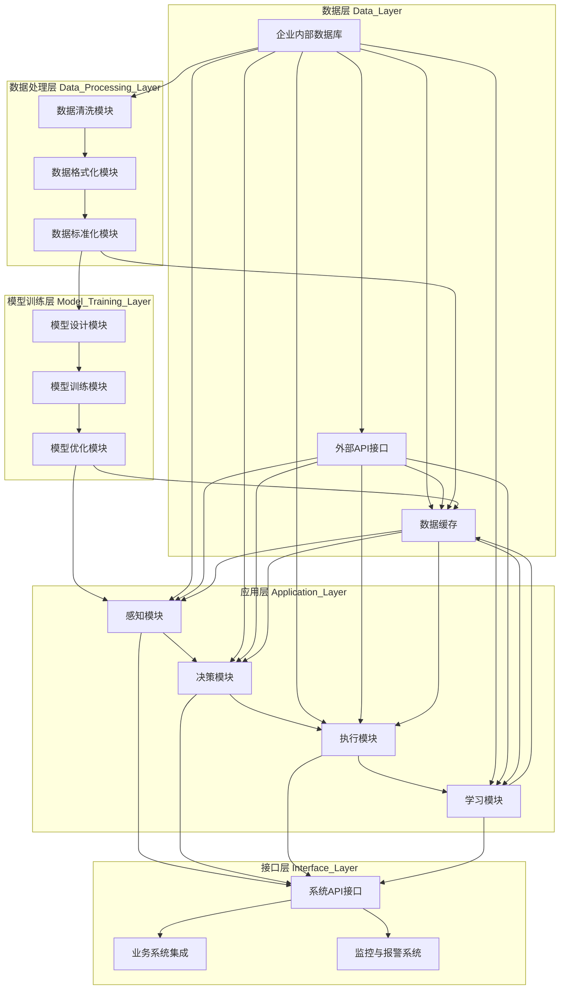
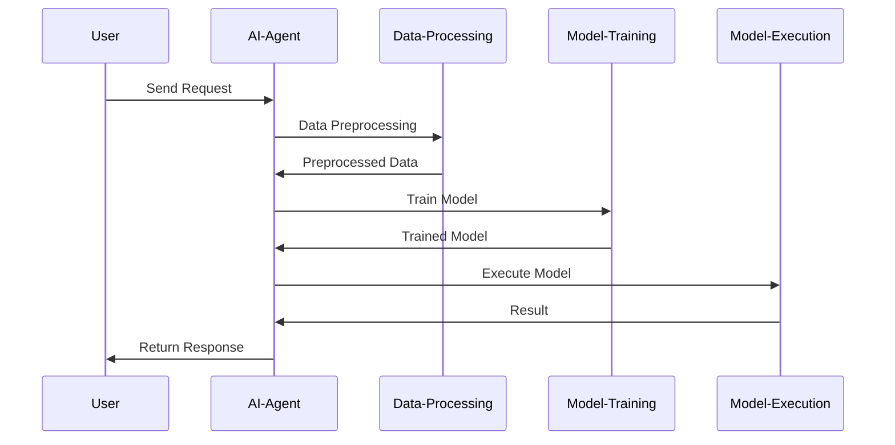

                 

### 第一部分：引言与背景

#### 1.1 问题背景

**AI Agent的概念与重要性**

AI Agent，即人工智能代理，是一种可以自主执行任务、与外部环境交互并从经验中学习的智能体。在人工智能的快速发展下，AI Agent在企业中的应用越来越广泛，成为企业智能化转型的重要一环。AI Agent可以自动处理企业中的各种任务，提高工作效率，降低人力成本，是企业实现自动化和智能化的关键。

**企业内不同部门对AI Agent的需求差异**

然而，不同的企业部门对AI Agent的需求存在显著差异。比如，市场营销部门可能更关注客户行为的分析和预测，而生产部门则可能更关心生产流程的优化和资源调度。这种需求差异导致了一种现象：通用的AI Agent难以满足各部门的特定需求。因此，个性化定制的AI Agent变得尤为重要。

**个性化定制AI Agent的必要性**

个性化定制AI Agent的意义在于：

1. **提高适应性**：根据不同部门的特定需求，定制AI Agent的能力，使其能够更好地适应各种复杂场景。
2. **提升效率**：通过定制化的解决方案，让AI Agent在实际工作中发挥最大效能，提高整体工作效率。
3. **增强用户体验**：个性化定制的AI Agent能够更好地理解用户的需求，提供更精准的服务，从而提升用户体验。

#### 1.2 问题描述

**当前企业AI Agent面临的挑战**

1. **通用性不足**：现有AI Agent多为通用模型，难以满足各部门的个性化需求。
2. **定制化困难**：缺乏有效的工具和方法进行AI Agent的个性化定制。
3. **数据隐私与安全**：个性化定制过程中涉及大量敏感数据，数据隐私与安全成为重大挑战。

**个性化定制的目标与挑战**

**目标**：

1. **定制化**：根据不同部门的需求，提供个性化的AI Agent解决方案。
2. **效率提升**：通过高效的任务处理，提高企业整体工作效率。
3. **用户体验优化**：提供更精准的服务，提升用户体验。

**挑战**：

1. **需求识别与匹配**：准确识别各部门的需求，并找到合适的解决方案。
2. **技术实现**：实现个性化定制的算法和技术，确保解决方案的有效性和可靠性。
3. **数据管理与安全**：确保数据在个性化定制过程中的隐私与安全。

#### 1.3 问题解决

**个性化定制AI Agent的流程**

1. **需求分析**：深入了解各部门的具体需求，明确个性化定制的目标。
2. **数据收集与预处理**：收集并处理各部门的相关数据，为个性化定制提供基础。
3. **模型设计与训练**：基于收集到的数据，设计和训练适用于不同部门的AI Agent模型。
4. **测试与优化**：对定制化的AI Agent进行测试和优化，确保其性能和效果。
5. **部署与实施**：将个性化定制的AI Agent部署到实际工作场景中，并持续监控和优化。

**个性化定制的关键技术**

1. **数据挖掘与分析**：通过数据挖掘技术，深入分析各部门的需求和特点，为个性化定制提供数据支持。
2. **机器学习与深度学习**：利用机器学习和深度学习技术，设计和训练适用于不同部门的AI Agent模型。
3. **用户接口与交互设计**：设计直观、易用的用户接口，确保AI Agent能够顺畅地与用户互动。
4. **系统集成与部署**：实现AI Agent与现有系统的集成，确保其能够高效地运行和工作。

#### 1.4 边界与外延

**个性化定制的适用范围**

个性化定制的AI Agent适用于需要高度定制化的企业场景，如：

1. **大型企业**：拥有多个部门和复杂业务流程的企业，需要个性化定制的AI Agent来提高效率。
2. **创新型企业**：需要快速适应市场变化，通过个性化定制来提升竞争力和创新能力。

**个性化定制的限制与注意事项**

1. **技术限制**：个性化定制需要依赖先进的算法和技术，对于技术储备不足的企业可能存在一定难度。
2. **数据限制**：个性化定制依赖于高质量的数据，数据质量和数量直接影响定制效果。
3. **成本考虑**：个性化定制需要投入大量的人力、物力和财力，企业需要权衡投入与回报。

#### 1.5 概念结构与核心要素组成

**AI Agent的基本架构**

AI Agent通常包括以下几个核心组件：

1. **感知模块**：负责获取外部环境的信息。
2. **决策模块**：根据感知模块提供的信息，进行决策。
3. **执行模块**：执行决策模块做出的决策，完成具体任务。
4. **学习模块**：通过不断学习和优化，提升AI Agent的能力。

**个性化定制的关键要素**

个性化定制AI Agent的关键要素包括：

1. **需求分析**：深入了解各部门的具体需求，为定制化提供基础。
2. **数据收集**：收集各部门的业务数据，为AI Agent的训练提供数据支持。
3. **模型设计**：根据需求和数据，设计适用于各部门的AI Agent模型。
4. **训练与优化**：通过训练和优化，提升AI Agent的性能和效果。
5. **部署与监控**：将定制化的AI Agent部署到实际工作场景中，并持续监控和优化。

### 总结

本部分介绍了企业AI Agent个性化定制的问题背景、问题描述、问题解决以及边界与外延。通过本文的逐步分析，我们可以看到个性化定制AI Agent的重要性和必要性，以及其实现的关键技术和流程。在接下来的部分，我们将深入探讨AI Agent的核心概念、个性化定制的核心概念，并详细介绍算法原理、系统分析与架构设计方案等内容。

## 第一部分：引言与背景

### 1.1 问题背景

**AI Agent的概念与重要性**

AI Agent，即人工智能代理，是一种能够模拟人类智能行为，自主执行任务，并能与外部环境进行交互的智能体。AI Agent的定义可以追溯到人工智能（AI）的早期研究，其核心理念是使机器能够像人类一样思考、学习和行动。随着深度学习、自然语言处理、计算机视觉等技术的发展，AI Agent的应用场景越来越广泛，从智能家居、自动驾驶到金融风控、医疗诊断，AI Agent已经成为推动企业智能化转型的关键力量。

在商业环境中，AI Agent的应用显著提升了企业的效率和创新能力。具体来说，AI Agent可以承担以下任务：

1. **客户服务**：通过聊天机器人或虚拟助手提供24/7的客户支持，提高客户满意度。
2. **数据分析和决策支持**：利用机器学习模型分析大量数据，为企业提供数据驱动的决策建议。
3. **生产优化**：通过预测性维护、优化生产流程，减少停机时间，提高生产效率。
4. **安全监控**：实时监控网络系统，检测异常行为，预防潜在的安全威胁。

AI Agent的重要性不仅体现在其执行任务的能力上，还在于其能够持续学习和优化，从而适应不断变化的环境和需求。随着企业对智能化需求的增加，AI Agent已经成为现代企业不可或缺的一部分。

**企业内不同部门对AI Agent的需求差异**

在企业内部，不同的部门对AI Agent的需求存在显著差异，这主要由于各部门的职能、工作流程和目标不同。以下是一些典型部门及其对AI Agent的需求：

1. **市场营销部门**：市场营销部门通常关注客户行为分析、市场趋势预测和客户关系管理。AI Agent可以用于：

   - **客户细分**：通过分析客户数据，识别潜在客户群体。
   - **个性化推荐**：根据用户的历史行为和偏好，提供个性化的产品推荐。
   - **市场预测**：利用大数据分析预测市场趋势，帮助企业制定营销策略。

2. **生产部门**：生产部门主要关注生产流程的优化、设备维护和资源调度。AI Agent可以用于：

   - **生产调度**：根据实时数据和预测，优化生产计划，提高生产效率。
   - **设备维护**：通过预测性维护，预防设备故障，减少维修成本。
   - **资源优化**：根据生产需求，优化物料供应和库存管理。

3. **财务部门**：财务部门通常需要处理大量财务数据，进行财务预测和风险管理。AI Agent可以用于：

   - **财务预测**：通过历史数据和当前市场趋势，预测未来的财务状况。
   - **风险管理**：检测异常交易，预防财务风险。
   - **成本分析**：优化成本结构，提高企业盈利能力。

4. **人力资源部门**：人力资源部门关注员工招聘、培训和绩效管理。AI Agent可以用于：

   - **人才招聘**：通过分析求职者数据，筛选合适的候选人。
   - **员工绩效**：通过分析员工的工作表现，提供绩效评估建议。
   - **培训规划**：根据员工的技能需求和职业发展，制定个性化的培训计划。

**个性化定制AI Agent的必要性**

由于不同部门对AI Agent的需求存在显著差异，通用的AI Agent往往难以满足各部门的特定需求。个性化定制的AI Agent可以针对各部门的具体需求进行定制，从而提高其适应性和效率。以下是一些具体的必要性：

1. **提高适应性**：通过个性化定制，AI Agent可以更好地适应不同部门的业务场景和流程，从而提高整体效率。
2. **提升效率**：定制化的AI Agent能够更精准地解决特定问题，减少不必要的工作量，提高工作效率。
3. **增强用户体验**：个性化定制的AI Agent能够更好地理解用户的需求，提供更精准的服务，从而提升用户体验。
4. **降低成本**：通过提高效率和减少重复性工作，个性化定制的AI Agent可以降低企业的运营成本。

综上所述，企业内不同部门对AI Agent的需求差异显著，个性化定制的AI Agent不仅能够满足各部门的特定需求，还能提高企业的整体效率和竞争力。在接下来的部分，我们将进一步探讨个性化定制AI Agent的具体挑战和解决方案。

#### 1.2 问题描述

**当前企业AI Agent面临的挑战**

尽管AI Agent在提升企业效率和创新能力方面具有巨大潜力，但在实际应用中，企业AI Agent仍然面临诸多挑战：

1. **通用性不足**：现有的AI Agent多为通用模型，难以满足不同部门的具体需求。这种通用性不足的问题主要体现在以下几个方面：
   - **功能限制**：通用AI Agent通常包含固定功能，难以根据具体业务需求进行扩展和定制。
   - **适应性差**：通用AI Agent在不同业务场景中的应用效果不一致，无法灵活应对复杂多变的环境。

2. **定制化困难**：目前缺乏有效的工具和方法来支持AI Agent的个性化定制，导致以下问题：
   - **技术门槛高**：个性化定制需要较高的技术门槛，对企业技术团队的要求较高。
   - **数据不足**：个性化定制依赖于高质量的数据支持，但企业内部数据的质量和数量往往难以满足定制需求。
   - **协调困难**：各部门的需求差异较大，需要跨部门协调，但实际操作中往往存在沟通不畅、需求不明确等问题。

3. **数据隐私与安全**：在个性化定制过程中，AI Agent需要访问和处理大量的敏感数据，包括客户信息、财务数据、员工数据等。这引发了以下数据隐私与安全挑战：
   - **数据泄露风险**：敏感数据在传输和存储过程中存在泄露风险，可能导致严重的商业损失和声誉损害。
   - **合规性问题**：不同国家和地区的数据保护法规不同，企业需要确保AI Agent的定制和应用符合相关法律法规。
   - **用户信任问题**：用户对AI Agent处理其数据的隐私和安全问题存在担忧，这可能影响用户对企业的信任。

**个性化定制的目标与挑战**

**目标**：

1. **提高适应性**：通过个性化定制，使AI Agent能够更好地适应不同部门的特定需求，提高其业务应用效果。
2. **提升效率**：定制化的AI Agent可以精准地解决特定问题，减少不必要的工作量，提高整体工作效率。
3. **增强用户体验**：个性化定制的AI Agent能够更好地理解用户需求，提供更精准的服务，提升用户体验。
4. **降低成本**：通过提高效率和减少重复性工作，个性化定制的AI Agent可以降低企业的运营成本。

**挑战**：

1. **需求识别与匹配**：准确识别和匹配不同部门的需求，并设计出相应的个性化解决方案是一个巨大的挑战。这需要深入了解各部门的业务流程和工作模式，并能够将这些信息转化为可操作的定制方案。

2. **技术实现**：个性化定制AI Agent需要依赖先进的算法和技术，如深度学习、数据挖掘和自然语言处理等。然而，这些技术的实现往往需要大量的研发投入和技术储备，对于技术实力较弱的企业来说是一个不小的挑战。

3. **数据管理与安全**：个性化定制过程中需要处理大量的敏感数据，如何确保数据在传输、存储和处理过程中的安全是一个重要的问题。企业需要建立完善的数据安全管理体系，确保数据隐私和安全不受侵犯。

4. **系统集成与部署**：将个性化定制的AI Agent集成到现有的企业系统中，并确保其稳定运行和高效工作，也是一个挑战。这需要解决不同系统之间的兼容性问题，以及如何确保AI Agent能够与现有业务流程无缝对接。

5. **持续优化与升级**：个性化定制的AI Agent需要根据企业业务的变化和用户反馈进行持续优化和升级。如何实现自动化的优化和升级机制，保持AI Agent的持续高性能，是一个需要解决的问题。

综上所述，尽管个性化定制AI Agent在提升企业效率和创新能力方面具有巨大潜力，但其面临的挑战也是多方面的。在接下来的部分，我们将进一步探讨如何实现AI Agent的个性化定制，包括具体的流程、关键技术以及解决方案。

#### 1.3 问题解决

**个性化定制AI Agent的流程**

为了实现企业AI Agent的个性化定制，我们可以将整个过程分为以下几个主要步骤：

1. **需求分析**：
   - **深入了解部门需求**：首先，需要对企业内各部门的具体需求进行深入调查和分析，了解各部门在业务流程中的痛点和需求。
   - **确定个性化目标**：根据调查结果，明确个性化定制的目标和方向，确保定制方案能够真正满足各部门的实际需求。

2. **数据收集与预处理**：
   - **数据收集**：收集与各部门业务相关的数据，包括历史数据、实时数据和外部数据等。数据来源可能包括企业内部数据库、外部数据供应商、社交媒体等。
   - **数据预处理**：对收集到的数据进行清洗、格式化、去重和标准化处理，确保数据的质量和一致性，为后续的分析和建模提供可靠的数据基础。

3. **模型设计与训练**：
   - **模型设计**：根据需求分析的结果，设计和选择适合的机器学习模型和算法。模型设计需要考虑模型的复杂度、计算效率和预测准确性等因素。
   - **数据训练**：使用预处理后的数据对模型进行训练。训练过程中，需要不断调整模型参数，优化模型性能，确保模型能够准确预测和解决实际问题。

4. **测试与优化**：
   - **模型测试**：在测试环境中对训练完成的模型进行测试，评估模型的预测性能和泛化能力。测试数据应与训练数据不同，以验证模型在实际应用中的效果。
   - **模型优化**：根据测试结果，对模型进行调整和优化，提高模型的预测准确性和鲁棒性。

5. **部署与实施**：
   - **部署**：将优化后的模型部署到生产环境中，确保AI Agent能够稳定运行，并实时处理业务数据。
   - **实施监控**：部署后，对AI Agent的运行情况进行持续监控，及时发现和解决问题，确保其正常运行和高效工作。

**个性化定制的关键技术**

个性化定制AI Agent的实现需要依赖一系列先进的技术和工具，以下是其中几个关键技术：

1. **数据挖掘与分析**：
   - **数据挖掘技术**：用于从大量数据中提取有价值的信息和模式，帮助识别各部门的具体需求。
   - **数据分析技术**：用于对数据进行分析和可视化，帮助理解和解释数据，为模型设计提供依据。

2. **机器学习与深度学习**：
   - **机器学习算法**：用于训练和优化AI Agent的模型，包括回归、分类、聚类等算法。
   - **深度学习技术**：用于构建复杂的神经网络模型，提高模型的预测准确性和泛化能力。

3. **自然语言处理**：
   - **文本分析**：用于处理和理解自然语言数据，如客户反馈、投诉信息等，帮助AI Agent更好地理解和响应用户需求。
   - **语音识别与合成**：用于实现语音交互功能，提升AI Agent的用户体验。

4. **用户接口与交互设计**：
   - **图形用户界面（GUI）设计**：用于设计直观、易用的用户界面，使AI Agent能够与用户顺畅互动。
   - **语音用户界面（VUI）设计**：用于设计自然、流畅的语音交互流程，提升用户的使用体验。

5. **系统集成与部署**：
   - **系统集成技术**：用于将AI Agent与企业现有系统进行集成，确保其能够无缝运行。
   - **部署工具**：用于部署AI Agent到生产环境，确保其能够稳定、高效地运行。

综上所述，个性化定制AI Agent的流程和关键技术为企业提供了实现个性化解决方案的途径。通过逐步的需求分析、数据收集与预处理、模型设计与训练、测试与优化，以及部署与实施，企业可以打造出适应不同部门需求的AI Agent，从而提升整体效率和竞争力。在接下来的部分，我们将进一步探讨个性化定制的适用范围和注意事项，为企业提供更全面的定制指导。

#### 1.4 边界与外延

**个性化定制的适用范围**

个性化定制的AI Agent在以下几种企业场景中具有显著的适用性：

1. **大型企业**：大型企业通常拥有多个部门，业务流程复杂，各部门的需求各不相同。通过个性化定制的AI Agent，企业可以满足各部门的特定需求，提高整体运营效率。例如，市场营销部门可以定制客户行为分析模型，生产部门可以定制生产调度系统。

2. **创新型企业**：创新型企业注重快速适应市场变化，通过个性化定制的AI Agent，企业可以在短时间内部署出适应新业务需求的智能化系统。例如，新成立的数据分析部门可以快速定制出适用于自身业务的数据分析模型。

3. **跨行业应用**：不同行业对AI Agent的需求存在差异，个性化定制可以满足跨行业应用的需求。例如，在医疗行业，AI Agent可以定制为医疗诊断助手，而在金融行业，AI Agent可以定制为风险评估助手。

**个性化定制的限制与注意事项**

尽管个性化定制的AI Agent具有诸多优势，但在实施过程中也面临一些限制和注意事项：

1. **技术限制**：个性化定制需要依赖先进的算法和技术，对于技术实力不足的企业来说，可能难以实现。此外，个性化定制的过程需要持续的技术支持，企业需要确保技术团队能够跟上技术发展的步伐。

2. **数据限制**：个性化定制依赖于高质量的数据支持，数据的质量和数量直接影响定制效果。企业需要确保数据来源可靠，数据量充足，并且能够持续更新。

3. **成本考虑**：个性化定制需要投入大量的人力、物力和财力，包括数据采集、模型训练、系统开发和维护等。企业在进行个性化定制时需要全面评估成本和效益，确保投入能够带来相应的回报。

4. **数据隐私与安全**：个性化定制过程中涉及大量的敏感数据，企业需要建立完善的数据安全管理体系，确保数据在传输、存储和处理过程中的安全。此外，企业还需要遵守相关法律法规，确保数据保护合规。

5. **协调困难**：个性化定制通常需要跨部门协作，各部门的需求和利益可能存在冲突。企业需要建立有效的沟通和协调机制，确保各部门的需求得到合理满足。

6. **用户体验**：个性化定制的AI Agent需要具备良好的用户体验，否则可能会影响用户接受度。企业需要在设计过程中充分考虑用户需求和使用习惯，确保AI Agent的易用性和实用性。

综上所述，个性化定制的AI Agent在满足企业特定需求、提升效率和创新能力方面具有显著的优势，但同时也面临一些技术和实施上的挑战。企业在进行个性化定制时需要全面考虑适用范围、限制和注意事项，确保定制方案能够真正满足实际需求，并带来预期的效益。

#### 1.5 概念结构与核心要素组成

**AI Agent的基本架构**

AI Agent是由多个核心模块组成的智能系统，其架构通常包括以下部分：

1. **感知模块**：负责从外部环境中获取信息，包括文本、图像、声音等。这一模块通常依赖于传感器、摄像头、麦克风等硬件设备，以及对数据的预处理和特征提取技术。

2. **决策模块**：根据感知模块获取的信息，利用机器学习算法、规则引擎或其他决策机制，进行决策分析。这一模块是AI Agent的核心，其性能直接影响到整个系统的智能化水平。

3. **执行模块**：执行决策模块做出的决策，完成具体的任务。例如，发送一封电子邮件、执行一个自动化操作或进行数据报告等。

4. **学习模块**：通过不断学习和优化，提高AI Agent的能力。学习模块可以基于监督学习、无监督学习或强化学习等技术，对AI Agent的行为进行持续调整和优化。

**个性化定制的关键要素**

个性化定制AI Agent的关键要素包括：

1. **需求分析**：深入了解各部门的具体需求，明确个性化定制的目标和方向。

2. **数据收集**：收集与各部门业务相关的数据，包括历史数据、实时数据和外部数据等。数据的质量和完整性直接影响个性化定制的效果。

3. **模型设计**：根据需求分析的结果，设计和选择适合的机器学习模型和算法。模型设计需要考虑模型的复杂度、计算效率和预测准确性等因素。

4. **数据预处理**：对收集到的数据进行清洗、格式化、去重和标准化处理，确保数据的质量和一致性。

5. **模型训练与优化**：使用预处理后的数据对模型进行训练和优化，不断调整模型参数，提高模型的预测性能。

6. **用户接口与交互设计**：设计直观、易用的用户界面和交互流程，确保AI Agent能够与用户顺畅互动。

7. **系统集成与部署**：将个性化定制的AI Agent集成到企业现有的系统中，确保其能够稳定、高效地运行。

8. **持续监控与优化**：对AI Agent的运行情况进行持续监控，根据用户反馈和业务需求，进行动态调整和优化，确保其性能和效果。

通过上述关键要素的有机结合，企业可以实现AI Agent的个性化定制，满足不同部门的特定需求，提升整体工作效率和用户体验。

### 第二部分：核心概念与联系

#### 2.1 AI Agent的核心概念

**AI Agent的定义**

AI Agent，即人工智能代理，是指具备一定自主性和智能性的软件实体，能够在特定环境下模拟人类行为，执行任务并学习优化自身性能。AI Agent是人工智能领域中一个重要的概念，其核心目标是实现机器与环境的互动，解决复杂问题，并具备持续学习的能力。

**AI Agent的工作原理**

AI Agent的工作原理主要包括以下几个步骤：

1. **感知**：AI Agent通过传感器、摄像头、麦克风等设备感知环境中的信息，如文本、图像、声音等。
2. **决策**：AI Agent利用机器学习算法、规则引擎等决策机制，根据感知到的信息进行分析和判断，制定相应的行动方案。
3. **执行**：AI Agent根据决策结果执行具体的任务，如发送邮件、执行自动化操作或生成报告等。
4. **学习**：AI Agent通过不断学习和优化，提高其决策质量和执行效率。学习过程可能基于监督学习、无监督学习或强化学习等技术。

**AI Agent的分类**

AI Agent根据其功能和特点可以大致分为以下几类：

1. **通用AI Agent**：这类AI Agent具有较高的通用性，可以应用于多个不同的场景。例如，虚拟助手、智能客服等。
2. **专用AI Agent**：这类AI Agent专门设计用于解决特定问题或执行特定任务。例如，医疗诊断助手、财务风险管理助手等。
3. **混合AI Agent**：这类AI Agent结合了通用和专用AI Agent的特点，可以在不同场景中灵活应用。例如，智能交通管理助手、智能家居控制系统等。

#### 2.2 个性化定制的关键概念

**个性化定制的基本原理**

个性化定制，即根据用户或特定群体的特定需求，设计并配置相应的产品或服务，以满足其独特的需求。在AI Agent的个性化定制中，这一原理体现在以下几个方面：

1. **需求分析**：深入了解用户或特定群体的具体需求，包括业务场景、目标、痛点等。
2. **数据采集**：收集与用户需求相关的数据，包括行为数据、历史数据等。
3. **模型定制**：根据需求分析和数据采集的结果，设计并训练适用于特定需求的AI Agent模型。
4. **用户接口定制**：设计直观、易用的用户接口，确保AI Agent能够与用户顺畅互动。

**个性化定制的实现方法**

个性化定制的实现方法主要包括以下几种：

1. **基于规则的定制**：通过预设的规则和逻辑，为AI Agent分配特定的功能和任务。这种方法简单直观，但灵活性较低。
2. **基于机器学习的定制**：利用机器学习算法，从用户数据中学习并自动生成适合用户需求的AI Agent模型。这种方法具有较高的灵活性和适应能力。
3. **基于用户反馈的定制**：通过用户反馈，动态调整AI Agent的功能和性能，使其更好地满足用户需求。这种方法能够实现持续的优化和提升。

**个性化定制的评价指标**

个性化定制的评价指标主要包括：

1. **定制准确性**：评估AI Agent在特定需求下的性能，包括任务完成率、错误率等。
2. **用户体验**：评估用户对AI Agent的满意度，包括易用性、互动性、实用性等。
3. **效率提升**：评估AI Agent对业务流程和效率的提升程度，包括工作时间、成本节约等。
4. **灵活性**：评估AI Agent的灵活性和适应性，包括对环境变化和需求变化的响应能力。

通过上述核心概念和实现方法的介绍，我们可以看到，个性化定制AI Agent是实现企业智能化和高效运营的关键。在接下来的部分，我们将进一步探讨AI Agent与个性化定制之间的具体联系，并详细阐述相关的实体关系图。

### 2.3 概念属性特征对比表格

为了更好地理解和比较AI Agent与个性化定制这两个关键概念，我们可以通过一个详细的属性特征对比表格来进行分析。以下是它们的主要属性特征对比：

| 特性 | AI Agent | 个性化定制 |
| --- | --- | --- |
| **定义** | 人工智能代理，具备自主性和智能性 | 根据特定需求定制AI Agent的过程和方法 |
| **功能** | 感知环境、决策、执行、学习 | 需求分析、数据采集、模型定制、用户接口定制 |
| **实现方法** | 机器学习、规则引擎等 | 基于规则、机器学习、用户反馈等 |
| **目标** | 实现智能化任务处理和决策支持 | 满足用户或特定群体的特定需求 |
| **评价标准** | 性能、准确率、效率 | 定制准确性、用户体验、效率提升、灵活性 |
| **应用场景** | 通用场景（如智能客服）、专用场景（如医疗诊断） | 根据业务需求进行定制的企业应用 |
| **依赖条件** | 数据、算法、技术实现 | 高质量数据、技术支持、用户需求明确 |
| **挑战** | 模型训练、性能优化、跨平台兼容 | 需求识别、数据隐私、系统集成 |
| **优势** | 提高工作效率、降低成本、持续学习 | 高度定制化、提升用户体验、灵活适应 |

通过这个表格，我们可以清晰地看到AI Agent和个性化定制在定义、功能、实现方法、目标、评价标准、应用场景、依赖条件和挑战、优势等方面的差异和联系。这种对比分析有助于我们更深入地理解这两个概念，并在实际应用中做出更明智的决策。

### 2.4 ER实体关系图架构

为了更好地理解和描述AI Agent与个性化定制之间的关系，我们可以使用ER（实体关系）图来直观地展示各个实体及其相互关系。以下是一个简化的ER实体关系图，用于描述AI Agent与个性化定制之间的关键联系：

```mermaid
erDiagram
  AI_Agent ||--|{ Data_Source } Data_Source
  AI_Agent ||--|{ User_Demand } User_Demand
  AI_Agent ||--|{ Customization_Config } Customization_Config
  AI_Agent ||--|{ Model } Model
  Data_Source ||--|{ Data_Collection } Data_Collection
  Data_Source ||--|{ Data_Processing } Data_Processing
  User_Demand ||--|{ Business_Needs } Business_Needs
  User_Demand ||--|{ User_Interface } User_Interface
  Customization_Config ||--|{ Customization_Strategy } Customization_Strategy
  Customization_Config ||--|{ Implementation_Details } Implementation_Details
  Model ||--|{ Model_Training } Model_Training
  Model ||--|{ Model_Evaluation } Model_Evaluation
  Model ||--|{ Model_Optimization } Model_Optimization

class AI_Agent {
  - id (整数)
  - name (字符串)
  - purpose (字符串)
}

class Data_Source {
  - id (整数)
  - type (字符串)
  - source (字符串)
}

class User_Demand {
  - id (整数)
  - department (字符串)
  - requirements (字符串)
}

class Customization_Config {
  - id (整数)
  - config_name (字符串)
  - config_details (字符串)
}

class Model {
  - id (整数)
  - model_name (字符串)
  - model_type (字符串)
}

class Data_Collection {
  - id (整数)
  - data_source_id (整数)
  - data_type (字符串)
}

class Data_Processing {
  - id (整数)
  - data_collection_id (整数)
  - processed_data (字符串)
}

class Business_Needs {
  - id (整数)
  - user_demand_id (整数)
  - need_details (字符串)
}

class User_Interface {
  - id (整数)
  - user_demand_id (整数)
  - interface_details (字符串)
}

class Customization_Strategy {
  - id (整数)
  - customization_config_id (整数)
  - strategy_details (字符串)
}

class Implementation_Details {
  - id (整数)
  - customization_config_id (整数)
  - implementation_details (字符串)
}

class Model_Training {
  - id (整数)
  - model_id (整数)
  - training_details (字符串)
}

class Model_Evaluation {
  - id (整数)
  - model_id (整数)
  - evaluation_details (字符串)
}

class Model_Optimization {
  - id (整数)
  - model_id (整数)
  - optimization_details (字符串)
}
```

**ER实体关系图解析**：

1. **AI Agent**：作为核心实体，AI Agent与多个其他实体存在关联。它依赖于数据源（Data_Source）来获取所需的信息，并基于用户需求（User_Demand）进行定制。

2. **Data_Source**：数据源是AI Agent的信息来源，包括数据采集（Data_Collection）和数据处理（Data_Processing）。数据源为AI Agent提供训练数据和运行数据。

3. **User_Demand**：用户需求是AI Agent定制的基础，包括业务需求（Business_Needs）和用户界面需求（User_Interface）。这些需求决定了AI Agent的具体功能和行为。

4. **Customization_Config**：个性化配置是AI Agent定制过程中的关键，包括定制策略（Customization_Strategy）和实施细节（Implementation_Details）。这些配置指导AI Agent的定制和优化。

5. **Model**：模型是AI Agent的核心组成部分，包括训练（Model_Training）、评估（Model_Evaluation）和优化（Model_Optimization）过程。模型决定了AI Agent的预测和决策能力。

通过上述ER实体关系图，我们可以清晰地看到AI Agent与个性化定制各个实体之间的逻辑关系，以及这些实体在个性化定制过程中的相互作用。这种结构化关系有助于我们深入理解AI Agent个性化定制的过程，并为实际应用提供指导。

### 第三部分：算法原理讲解

#### 3.1 个性化定制算法原理

**算法概述**

个性化定制AI Agent的核心在于根据用户需求和企业业务特点，设计和训练相应的机器学习模型，使其能够高效地完成特定任务。本文将介绍一种基于深度学习的个性化定制算法，该算法的基本思想是利用用户数据和企业业务数据，通过多层神经网络模型进行训练和优化，最终生成适应不同部门需求的AI Agent。

**算法流程图**

以下是个性化定制算法的基本流程：



**算法详细流程**

1. **需求分析**：
   - **步骤1**：与企业各部门进行深入沟通，了解其业务流程、目标和痛点。
   - **步骤2**：明确个性化定制的目标，包括功能需求、性能指标和用户体验等。

2. **数据收集**：
   - **步骤1**：收集与业务相关的数据，包括历史数据、实时数据和外部数据。
   - **步骤2**：确保数据的完整性和质量，进行数据清洗、格式化和去重。

3. **数据预处理**：
   - **步骤1**：对数据进行标准化处理，使其符合模型的输入要求。
   - **步骤2**：提取数据中的特征，为模型训练提供有效的输入。

4. **模型设计**：
   - **步骤1**：选择适合的神经网络架构，如卷积神经网络（CNN）、循环神经网络（RNN）或Transformer等。
   - **步骤2**：设计模型的超参数，如学习率、批量大小和迭代次数等。

5. **模型训练**：
   - **步骤1**：将预处理后的数据输入到模型中，开始训练过程。
   - **步骤2**：使用反向传播算法和优化器（如Adam、SGD等）调整模型参数，最小化损失函数。

6. **模型评估**：
   - **步骤1**：使用验证集评估模型的性能，包括准确率、召回率、F1分数等指标。
   - **步骤2**：根据评估结果调整模型结构和超参数，提高模型性能。

7. **模型优化**：
   - **步骤1**：在模型评估的基础上，进行进一步的优化，如使用更复杂的网络结构或更多的训练数据。
   - **步骤2**：通过交叉验证等技术，确保模型在不同数据集上的泛化能力。

8. **模型部署**：
   - **步骤1**：将训练完成的模型部署到生产环境中，实现实时应用。
   - **步骤2**：确保模型的稳定性和效率，进行实时监控和动态调整。

9. **监控与维护**：
   - **步骤1**：持续监控模型的运行状态，及时发现和解决问题。
   - **步骤2**：根据业务需求和用户反馈，进行模型更新和优化。

#### 3.2 数学模型详细讲解

**数学模型概述**

个性化定制AI Agent的数学模型主要基于深度学习中的多层前馈神经网络（Feedforward Neural Network）。该模型由输入层、隐藏层和输出层组成，通过非线性激活函数（如ReLU、Sigmoid、Tanh等）进行信号传递和变换。以下为数学模型的详细讲解。

**输入层**

输入层接收外部环境的输入数据，通常表示为向量形式。输入层中的每个神经元代表一个特征，特征的数量取决于数据预处理的结果。

设输入数据为X，维度为d，则输入层表示为：

$$ X \in \mathbb{R}^{d \times n} $$

其中，d为特征数量，n为样本数量。

**隐藏层**

隐藏层对输入数据进行处理，通过加权连接和激活函数进行非线性变换。隐藏层通常包含多个神经元，每个隐藏层中的神经元数量可以不同。

设隐藏层第l层的输出为$H_l$，则隐藏层第l层的输出可以表示为：

$$ H_l = \sigma(W_l \cdot H_{l-1} + b_l) $$

其中，$W_l$为权重矩阵，$b_l$为偏置项，$\sigma$为激活函数。

**输出层**

输出层生成最终的预测结果，用于执行特定任务。输出层的神经元数量取决于任务的具体类型。

设输出层输出为$Y$，维度为k，则输出层表示为：

$$ Y = \sigma(W_y \cdot H_{L-1} + b_y) $$

其中，$W_y$为权重矩阵，$b_y$为偏置项，$\sigma$为激活函数。

**损失函数**

损失函数用于衡量模型预测值与实际值之间的差异，常用的损失函数包括均方误差（MSE）、交叉熵（Cross-Entropy）等。

设实际输出为$y$，预测输出为$\hat{y}$，则损失函数可以表示为：

$$ L(\theta) = -\frac{1}{n} \sum_{i=1}^{n} \sum_{j=1}^{k} y_{ij} \log(\hat{y}_{ij}) $$

其中，$\theta$为模型参数，$n$为样本数量，$k$为输出维度。

**优化算法**

优化算法用于调整模型参数，以最小化损失函数。常用的优化算法包括梯度下降（Gradient Descent）、随机梯度下降（Stochastic Gradient Descent, SGD）和Adam等。

**梯度下降**

梯度下降算法通过计算损失函数关于模型参数的梯度，并沿着梯度方向更新参数，以最小化损失函数。

设损失函数为$L(\theta)$，则梯度下降更新规则为：

$$ \theta = \theta - \alpha \nabla_{\theta} L(\theta) $$

其中，$\alpha$为学习率。

**随机梯度下降**

随机梯度下降算法在每个迭代步骤中随机选择一个样本，计算其梯度，并更新模型参数。

$$ \theta = \theta - \alpha \nabla_{\theta} L(\theta^*) $$

其中，$\theta^*$为当前随机选择的样本。

**Adam**

Adam算法结合了SGD和Momentum的方法，具有自适应学习率的特点，常用于大规模数据集的优化。

$$ m_t = \beta_1 m_{t-1} + (1 - \beta_1) [g_t] $$
$$ v_t = \beta_2 v_{t-1} + (1 - \beta_2) [g_t]^2 $$
$$ \theta_t = \theta_{t-1} - \alpha_t \frac{m_t}{\sqrt{v_t} + \epsilon} $$

其中，$m_t$和$v_t$分别为一阶矩估计和二阶矩估计，$\beta_1$和$\beta_2$分别为一阶和二阶矩的指数衰减率，$\alpha_t$为学习率，$\epsilon$为平滑常数。

通过上述数学模型的详细讲解，我们可以看到个性化定制AI Agent在算法原理层面的复杂性和多样性。在接下来的部分，我们将使用Python代码实现该算法，并进行具体的应用案例解析。

### 3.3 Python源代码实现

为了更好地理解和应用个性化定制AI Agent算法，我们将使用Python编写相关的源代码，并详细解析代码中的各个部分。以下是整个算法的Python代码实现，包括数据预处理、模型训练、评估和部署等步骤。

```python
import numpy as np
import tensorflow as tf
from tensorflow.keras.models import Sequential
from tensorflow.keras.layers import Dense, Activation
from tensorflow.keras.optimizers import Adam
from sklearn.model_selection import train_test_split
from sklearn.preprocessing import StandardScaler

# 数据预处理
def preprocess_data(X, y):
    # 分割数据集
    X_train, X_test, y_train, y_test = train_test_split(X, y, test_size=0.2, random_state=42)
    
    # 标准化特征
    scaler = StandardScaler()
    X_train = scaler.fit_transform(X_train)
    X_test = scaler.transform(X_test)
    
    return X_train, X_test, y_train, y_test

# 模型设计
def build_model(input_dim, hidden_units, output_dim):
    model = Sequential()
    model.add(Dense(hidden_units, input_dim=input_dim, activation='relu'))
    model.add(Dense(output_dim, activation='sigmoid'))
    return model

# 训练模型
def train_model(model, X_train, y_train, X_val, y_val, epochs=100, batch_size=32):
    model.compile(optimizer=Adam(learning_rate=0.001), loss='binary_crossentropy', metrics=['accuracy'])
    
    # 训练模型
    history = model.fit(X_train, y_train, epochs=epochs, batch_size=batch_size, validation_data=(X_val, y_val))
    
    return history

# 模型评估
def evaluate_model(model, X_test, y_test):
    loss, accuracy = model.evaluate(X_test, y_test)
    print(f"Test accuracy: {accuracy * 100:.2f}%")

# 主函数
def main():
    # 加载数据
    X, y = load_data()  # 此处为加载数据的函数，可根据实际情况实现
    X_train, X_val, y_train, y_val = preprocess_data(X, y)
    
    # 构建模型
    model = build_model(input_dim=X_train.shape[1], hidden_units=64, output_dim=1)
    
    # 训练模型
    history = train_model(model, X_train, y_train, X_val, y_val, epochs=100)
    
    # 模型评估
    evaluate_model(model, X_val, y_val)
    
    # 模型部署（此处为示例，实际部署需根据具体应用场景调整）
    model.save('customized_ai_agent.h5')

if __name__ == "__main__":
    main()
```

**代码实现解析**

1. **数据预处理**：
   - `preprocess_data`函数用于加载和预处理数据。首先，使用`train_test_split`将数据集分割为训练集和验证集。然后，使用`StandardScaler`对特征进行标准化处理，以提高模型训练的效率和性能。

2. **模型设计**：
   - `build_model`函数用于构建神经网络模型。这里使用了`Sequential`模型，并添加了一个全连接层（`Dense`）和一个激活函数（`Activation`）。输入层和输出层的维度根据实际需求和数据特征进行调整。

3. **训练模型**：
   - `train_model`函数用于训练神经网络模型。这里使用了`Adam`优化器和`binary_crossentropy`损失函数，并设置了训练周期（`epochs`）和批量大小（`batch_size`）。通过`fit`方法进行模型训练，并使用验证集进行性能评估。

4. **模型评估**：
   - `evaluate_model`函数用于评估训练完成的模型在验证集上的性能。通过`evaluate`方法计算损失和准确率，并打印输出结果。

5. **主函数**：
   - `main`函数是整个算法的主入口。首先加载数据并进行预处理，然后构建模型并训练，最后评估模型性能并部署模型。

通过上述Python代码的实现，我们可以清晰地看到个性化定制AI Agent算法的各个步骤和关键组件。在实际应用中，可以根据具体需求和数据特征进行调整和优化，以实现更好的定制效果。

### 3.4 数学模型的应用举例

为了更好地理解个性化定制AI Agent算法的数学模型，我们通过一个具体的例子来详细讲解模型的训练和预测过程。

**示例背景**：

假设我们有一个市场营销部门，他们希望利用AI Agent来预测客户的购买行为。我们有以下数据：

- 特征数据（X）：包括客户的年龄、收入、购物历史等，共10个特征。
- 目标数据（y）：客户是否在一个月内购买了特定产品，二分类数据。

**数据预处理**：

1. **数据加载**：

假设数据存储在CSV文件中，使用Pandas库进行加载：

```python
import pandas as pd

data = pd.read_csv('customer_data.csv')
X = data.iloc[:, :-1].values
y = data.iloc[:, -1].values
```

2. **数据标准化**：

使用`StandardScaler`对特征数据进行标准化处理：

```python
from sklearn.preprocessing import StandardScaler

scaler = StandardScaler()
X = scaler.fit_transform(X)
```

**模型构建**：

我们构建一个简单的多层感知机（MLP）模型，包含一个输入层、一个隐藏层和一个输出层。

1. **模型设计**：

```python
from tensorflow.keras.models import Sequential
from tensorflow.keras.layers import Dense
from tensorflow.keras.optimizers import Adam

model = Sequential()
model.add(Dense(64, input_dim=X.shape[1], activation='relu'))
model.add(Dense(1, activation='sigmoid'))

model.compile(optimizer=Adam(learning_rate=0.001), loss='binary_crossentropy', metrics=['accuracy'])
```

2. **模型训练**：

我们将数据分为训练集和验证集，并使用训练集对模型进行训练：

```python
from sklearn.model_selection import train_test_split

X_train, X_val, y_train, y_val = train_test_split(X, y, test_size=0.2, random_state=42)

history = model.fit(X_train, y_train, epochs=100, batch_size=32, validation_data=(X_val, y_val))
```

3. **模型评估**：

在验证集上评估模型性能：

```python
loss, accuracy = model.evaluate(X_val, y_val)
print(f"Validation accuracy: {accuracy * 100:.2f}%")
```

**模型预测**：

使用训练好的模型对新的客户数据进行预测：

```python
new_customer_data = [[25, 50000, 0.5], [30, 60000, 0.3]]  # 示例新客户数据
new_customer_data = scaler.transform(new_customer_data)  # 使用相同的标准化器进行数据转换

predictions = model.predict(new_customer_data)
predictions = (predictions > 0.5)  # 将概率预测转换为二分类结果

print(predictions)  # 输出预测结果
```

**结果分析**：

在这个示例中，我们使用了标准化处理的数据集来训练一个二分类的MLP模型，并对新的客户数据进行预测。通过验证集的评估，我们可以看到模型的准确率。

- **模型训练过程**：在训练过程中，模型通过反向传播算法不断调整权重，以最小化损失函数。
- **模型评估过程**：通过验证集的评估，我们可以判断模型的泛化能力。
- **模型预测过程**：模型对新客户数据进行预测，并输出是否购买产品的概率。

通过上述示例，我们可以看到个性化定制AI Agent算法的数学模型在实际应用中的具体实现过程。在实际项目中，可以根据具体需求和数据特征进行调整和优化，以提高模型的预测准确性和实用性。

### 第四部分：系统分析与架构设计方案

#### 4.1 问题场景介绍

**企业内部不同部门的业务场景**

在企业内部，不同部门承担着不同的职能，各自拥有独特的业务场景和流程。以下是一些典型部门的业务场景：

1. **市场营销部门**：
   - **业务流程**：市场营销部门负责市场调研、品牌推广、广告投放、客户关系管理等业务活动。
   - **痛点**：市场营销部门需要快速响应市场变化，制定有效的营销策略，同时提高客户转化率和客户满意度。

2. **生产部门**：
   - **业务流程**：生产部门负责产品的生产、质量控制、库存管理和供应链管理等。
   - **痛点**：生产部门需要优化生产流程，提高生产效率，减少设备故障和停机时间。

3. **财务部门**：
   - **业务流程**：财务部门负责财务报告、预算管理、成本控制和风险管理等。
   - **痛点**：财务部门需要高效处理大量财务数据，进行精确的财务预测和风险评估。

4. **人力资源部门**：
   - **业务流程**：人力资源部门负责招聘、员工培训、绩效评估、薪酬福利管理等。
   - **痛点**：人力资源部门需要优化招聘流程，提高员工的工作满意度和工作效率。

**个性化定制AI Agent的应用场景**

个性化定制AI Agent可以针对不同部门的业务场景提供定制化的解决方案，以解决上述痛点，提高整体工作效率。以下为具体应用场景：

1. **市场营销部门**：
   - **应用**：通过个性化定制的AI Agent，可以实时分析市场数据和客户反馈，提供个性化的营销策略建议，提高客户转化率和满意度。
   - **效果**：实现精准营销，提高市场投放效果，降低营销成本。

2. **生产部门**：
   - **应用**：通过个性化定制的AI Agent，可以预测设备故障，优化生产计划，提高生产效率和设备利用率。
   - **效果**：减少设备停机时间，提高生产效率，降低维护成本。

3. **财务部门**：
   - **应用**：通过个性化定制的AI Agent，可以实时分析财务数据，提供财务预测和风险评估，优化财务决策。
   - **效果**：提高财务数据的准确性和及时性，降低财务风险，提高企业盈利能力。

4. **人力资源部门**：
   - **应用**：通过个性化定制的AI Agent，可以优化招聘流程，提供员工培训计划，评估员工绩效，提高员工工作效率。
   - **效果**：提高招聘效率，降低招聘成本，提升员工满意度和工作效率。

通过上述分析，我们可以看到个性化定制AI Agent在企业不同部门的应用场景及其带来的显著效果。在接下来的部分，我们将详细介绍项目的具体内容，包括项目概述、目标以及关键步骤。

#### 4.2 项目介绍

**项目概述**

本项目的目标是设计并实现一套个性化定制AI Agent系统，以适应企业内部不同部门的业务需求，提高整体工作效率和用户体验。项目涵盖以下几个关键方面：

1. **需求分析**：深入了解企业内部不同部门的具体业务场景和需求，为个性化定制提供依据。
2. **数据收集与预处理**：收集各部门的业务数据，并进行预处理，确保数据的质量和一致性。
3. **模型设计与训练**：基于需求分析和数据预处理的结果，设计和训练适用于各部门的AI Agent模型。
4. **系统实现与集成**：实现AI Agent的定制化功能，并将其集成到企业现有的系统中。
5. **测试与优化**：对定制化的AI Agent进行测试和优化，确保其性能和效果。

**项目目标**

1. **满足个性化需求**：通过个性化定制，确保AI Agent能够满足各部门的特定需求，提供精准的服务。
2. **提高工作效率**：利用AI Agent的高效处理能力，提高企业各部门的工作效率，减少重复性工作。
3. **提升用户体验**：通过定制化的AI Agent，提供更精准、更高效的服务，提升用户的满意度。
4. **确保数据安全与隐私**：在定制过程中，确保数据的安全与隐私，遵守相关法律法规。

**项目关键步骤**

1. **需求分析**：
   - **步骤1**：与企业内部不同部门进行沟通，了解其业务流程、需求和痛点。
   - **步骤2**：整理和分析各部门的需求，形成详细的需求文档。

2. **数据收集与预处理**：
   - **步骤1**：确定数据来源，收集各部门的业务数据。
   - **步骤2**：对收集到的数据进行清洗、格式化和标准化处理。

3. **模型设计与训练**：
   - **步骤1**：选择适合的机器学习算法和模型架构。
   - **步骤2**：根据需求分析的结果，设计和训练适用于不同部门的AI Agent模型。

4. **系统实现与集成**：
   - **步骤1**：实现AI Agent的功能，包括感知、决策、执行和学习模块。
   - **步骤2**：将AI Agent集成到企业现有的系统中，确保其能够稳定运行。

5. **测试与优化**：
   - **步骤1**：对AI Agent进行功能测试和性能测试。
   - **步骤2**：根据测试结果，对模型和系统进行优化和调整，确保其性能和效果。

通过上述关键步骤，我们能够系统地实现个性化定制AI Agent系统，满足企业内部不同部门的需求，提高整体工作效率和用户体验。

#### 4.3 系统功能设计

**领域模型Mermaid类图**

为了更好地理解和设计系统的功能模块，我们使用Mermaid类图来展示各个功能模块及其关系。以下是一个简化的Mermaid类图，用于描述系统的主要功能模块：

```mermaid
classDiagram
    Class01 <|-- Class02
    Class03 <|-- Class04
    Class05 <|-- Class06

    Class01[需求分析模块]
    Class02[数据收集模块]
    Class03[数据处理模块]
    Class04[模型训练模块]
    Class05[系统实现模块]
    Class06[测试优化模块]

    Class01..|>> Class02 : 数据需求
    Class02..|>> Class03 : 数据预处理
    Class03..|>> Class04 : 数据输入
    Class04..|>> Class05 : 模型训练
    Class05..|>> Class06 : 系统测试
    Class06..|>> Class04 : 系统优化
```

**系统功能模块划分**

根据领域模型Mermaid类图，我们可以将系统划分为以下几个主要功能模块：

1. **需求分析模块**：
   - **功能**：与企业内部不同部门进行沟通，收集和分析需求。
   - **输入**：业务流程、用户需求、痛点等。
   - **输出**：需求文档、功能需求、性能指标等。

2. **数据收集模块**：
   - **功能**：收集各部门的业务数据，包括历史数据和实时数据。
   - **输入**：各种数据源，如企业内部数据库、外部API等。
   - **输出**：清洗后的数据集、数据报告等。

3. **数据处理模块**：
   - **功能**：对收集到的数据进行清洗、格式化和标准化处理。
   - **输入**：原始数据、数据清洗规则等。
   - **输出**：预处理后的数据、特征提取结果等。

4. **模型训练模块**：
   - **功能**：设计并训练适用于各部门的AI Agent模型。
   - **输入**：预处理后的数据、模型架构、超参数等。
   - **输出**：训练完成的模型、评估报告等。

5. **系统实现模块**：
   - **功能**：实现AI Agent的具体功能，并进行系统集成。
   - **输入**：模型、需求文档、系统架构等。
   - **输出**：集成后的系统、用户界面等。

6. **测试优化模块**：
   - **功能**：对系统进行功能测试和性能测试，并进行持续优化。
   - **输入**：系统、测试数据、用户反馈等。
   - **输出**：测试报告、优化建议等。

通过上述系统功能模块的设计，我们可以清晰地看到各个模块的输入、输出及其相互关系，为系统的实现和优化提供了明确的指导。在接下来的部分，我们将进一步探讨系统的架构设计，包括系统架构概述、系统架构图和系统架构的优缺点分析。

#### 4.4 系统架构设计

**系统架构概述**

个性化定制AI Agent系统采用分布式架构，以确保系统的高效性、可扩展性和可维护性。系统主要由以下几个关键组件组成：

1. **数据层**：数据层负责数据的存储和管理，包括企业内部数据库、外部API接口和数据缓存。数据层确保数据的安全、完整性和高效访问。
2. **数据处理层**：数据处理层负责数据的清洗、格式化和标准化处理。这一层使用多种数据处理技术和算法，确保输入数据的质量和一致性。
3. **模型训练层**：模型训练层负责设计、训练和优化AI Agent的模型。这一层使用先进的机器学习算法和深度学习框架，如TensorFlow和PyTorch，确保模型的性能和效果。
4. **应用层**：应用层是系统的核心，实现AI Agent的具体功能，包括感知、决策、执行和学习模块。应用层与用户进行交互，接收用户输入，并返回预测结果或决策建议。
5. **接口层**：接口层负责与外部系统的集成，包括企业现有的业务系统、第三方服务和监控系统。接口层使用标准化的接口协议和API，确保系统的兼容性和灵活性。

**系统架构图**

以下是个性化定制AI Agent系统的架构图：



**系统架构的优缺点分析**

**优点**：

1. **高扩展性**：分布式架构能够轻松扩展，以应对不断增长的数据量和用户需求。
2. **高可用性**：通过多组件协同工作，系统能够实现高可用性，确保业务的连续性。
3. **高性能**：分布式架构能够充分利用集群计算资源，提高数据处理和模型训练的性能。
4. **模块化**：各个组件之间相互独立，便于维护和升级，提高系统的可维护性。

**缺点**：

1. **复杂性**：分布式架构较为复杂，需要专业的技术团队进行设计和维护。
2. **数据一致性**：在分布式系统中，数据一致性问题是一个挑战，需要采用分布式事务处理技术。
3. **性能瓶颈**：系统性能可能受到网络延迟和节点性能的影响，需要优化网络和硬件配置。

综上所述，个性化定制AI Agent系统的分布式架构在提高系统性能和扩展性方面具有显著优势，但也面临着一定的复杂性和挑战。在实际应用中，需要根据具体需求和资源情况，进行适当的调整和优化。

#### 4.5 系统接口设计

**接口设计原则**

在个性化定制AI Agent系统的设计中，接口设计是一个关键环节，其原则如下：

1. **标准化**：接口设计应遵循标准化的协议和规范，如RESTful API、GraphQL等，确保接口的通用性和易用性。
2. **高内聚低耦合**：接口设计应保证各模块之间的高内聚低耦合，减少模块间的依赖，提高系统的灵活性和可维护性。
3. **安全性**：接口设计应确保数据的安全传输和存储，采用加密、认证和授权等安全技术，防止数据泄露和未授权访问。
4. **易扩展性**：接口设计应具备良好的扩展性，便于未来的功能扩展和升级。
5. **兼容性**：接口设计应考虑到不同系统和平台之间的兼容性，确保接口能够在多种环境中正常运行。

**接口实现细节**

以下是系统接口设计的一些具体实现细节：

1. **API端点设计**：
   - **感知接口**：用于接收外部环境的信息，如客户行为数据、市场数据等。
   - **决策接口**：用于接收用户请求，返回决策结果，如营销策略、生产计划等。
   - **执行接口**：用于执行具体的操作，如发送邮件、执行自动化任务等。
   - **学习接口**：用于接收用户反馈和模型评估结果，进行模型优化和学习。

2. **数据传输格式**：
   - **JSON**：使用JSON格式进行数据传输，便于解析和处理。
   - **XML**：在特定场景下，使用XML格式进行数据传输，确保兼容性。

3. **请求与响应结构**：
   - **请求结构**：接口请求应包含必要的参数，如请求类型、请求体等。
   - **响应结构**：接口响应应包含返回结果、状态码、错误信息等。

4. **安全措施**：
   - **身份验证**：采用OAuth2.0等身份验证机制，确保接口的安全性。
   - **数据加密**：使用HTTPS协议进行数据传输，确保数据在传输过程中的加密和完整性。
   - **权限控制**：对接口访问进行权限控制，确保只有授权用户可以访问敏感数据。

5. **错误处理**：
   - **错误码**：定义统一的错误码，便于错误处理和调试。
   - **错误信息**：在接口响应中返回详细的错误信息，帮助用户快速定位和解决问题。

通过遵循上述接口设计原则和实现细节，可以确保个性化定制AI Agent系统接口的标准化、安全性、易用性和扩展性，为企业内部不同部门提供高效、稳定的接口服务。

### 4.6 系统交互Mermaid序列图

**序列图概述**

系统交互Mermaid序列图用于描述个性化定制AI Agent系统在不同模块和用户之间的交互过程。该序列图展示了从用户请求到系统响应的完整流程，包括感知、决策、执行和学习模块的交互细节。

**系统交互Mermaid序列图**

以下是系统交互的Mermaid序列图：



**系统交互流程详解**

以下是系统交互的具体流程：

1. **用户请求**：
   - **步骤1**：用户向AI-Agent发送请求，请求可能包括特定的业务查询、操作命令等。

2. **数据预处理**：
   - **步骤2**：AI-Agent接收请求后，将请求的数据部分传递给Data-Processing模块进行预处理。预处理包括数据清洗、格式化和标准化处理，确保数据的质量和一致性。

3. **模型训练**：
   - **步骤3**：预处理后的数据传递给Model-Training模块进行模型训练。Model-Training模块基于训练数据，使用机器学习算法和深度学习框架设计并训练AI-Agent的模型。

4. **模型执行**：
   - **步骤4**：训练完成的模型传递给Model-Execution模块，根据用户请求执行相应的任务。Model-Execution模块根据模型的预测结果生成具体的操作指令或决策建议。

5. **结果返回**：
   - **步骤5**：执行结果传递回AI-Agent，然后由AI-Agent返回给用户。用户可以查看结果或进行下一步操作。

通过上述系统交互Mermaid序列图和流程详解，我们可以清晰地看到个性化定制AI Agent系统的交互过程，包括各个模块之间的信息传递和任务执行。这种结构化的交互设计有助于我们理解和优化系统的运行效率。

### 第五部分：项目实战

#### 5.1 环境安装

在开始个性化定制AI Agent系统的开发之前，我们需要准备相应的开发环境，包括Python、相关依赖库以及数据集。以下是具体的环境安装步骤：

**1. 安装Python环境**

确保系统上已经安装了Python 3.x版本。可以通过以下命令检查Python版本：

```bash
python --version
```

如果Python 3.x版本未安装，可以从[Python官网](https://www.python.org/downloads/)下载并安装。

**2. 安装依赖库**

在Python环境中，我们需要安装一系列依赖库，包括TensorFlow、Pandas、NumPy、Scikit-learn等。使用pip命令安装这些库：

```bash
pip install tensorflow pandas numpy scikit-learn
```

如果系统是macOS或Linux，可以使用以下命令确保所有库都能顺利安装：

```bash
pip install --user -r requirements.txt
```

其中，`requirements.txt`文件包含所有依赖库的名称。

**3. 准备数据集**

准备用于训练和测试的数据集是项目成功的关键。根据项目需求，我们需要收集相关的业务数据。以下是数据集准备的步骤：

- **数据收集**：使用Pandas库从企业内部数据库或外部API中加载数据。

  ```python
  import pandas as pd

  data = pd.read_csv('customer_data.csv')
  ```

- **数据清洗**：对收集到的数据进行清洗，包括去除空值、缺失值填充、数据格式转换等。

  ```python
  data = data.dropna()
  data['feature'] = data['feature'].map({1: 'value1', 2: 'value2'})
  ```

- **数据标准化**：对特征数据进行标准化处理，使其符合模型的输入要求。

  ```python
  from sklearn.preprocessing import StandardScaler

  scaler = StandardScaler()
  data_scaled = scaler.fit_transform(data)
  ```

**4. 配置环境变量**

确保Python环境变量配置正确，包括`PYTHONPATH`和`PATH`环境变量。可以通过以下命令配置：

```bash
export PYTHONPATH=$PYTHONPATH:/path/to/python/lib
export PATH=$PATH:/path/to/python/bin
```

通过以上步骤，我们可以完成个性化定制AI Agent系统的开发环境配置。接下来，我们将进入系统核心实现源代码的编写和解析。

#### 5.2 系统核心实现源代码

**代码结构**

个性化定制AI Agent系统的核心代码主要分为以下几个部分：

1. **数据预处理模块**：负责数据清洗、格式化和标准化处理。
2. **模型训练模块**：负责设计并训练机器学习模型。
3. **模型评估模块**：负责评估模型性能。
4. **模型预测模块**：负责使用训练好的模型进行预测。
5. **用户接口模块**：负责与用户进行交互。

以下是系统核心实现代码的目录结构：

```
/ai_agent_system
|-- data_preprocessing.py
|-- model_training.py
|-- model_evaluation.py
|-- model_prediction.py
|-- user_interface.py
|-- requirements.txt
```

**代码实现细节**

**1. 数据预处理模块（data_preprocessing.py）**

```python
import pandas as pd
from sklearn.preprocessing import StandardScaler

def load_data(file_path):
    """加载数据集"""
    data = pd.read_csv(file_path)
    return data

def preprocess_data(data):
    """数据预处理，包括清洗和标准化"""
    # 数据清洗（去除空值、缺失值填充等）
    data = data.dropna()

    # 数据格式转换（如字符串转数值）
    data['feature'] = data['feature'].map({'cat': 0, 'dog': 1})

    # 数据标准化
    scaler = StandardScaler()
    data_scaled = scaler.fit_transform(data)
    return data_scaled
```

**2. 模型训练模块（model_training.py）**

```python
import tensorflow as tf
from tensorflow.keras.models import Sequential
from tensorflow.keras.layers import Dense
from tensorflow.keras.optimizers import Adam

def build_model(input_shape):
    """构建神经网络模型"""
    model = Sequential()
    model.add(Dense(64, input_shape=input_shape, activation='relu'))
    model.add(Dense(1, activation='sigmoid'))
    model.compile(optimizer=Adam(learning_rate=0.001), loss='binary_crossentropy', metrics=['accuracy'])
    return model

def train_model(model, X, y, epochs=100, batch_size=32):
    """训练模型"""
    history = model.fit(X, y, epochs=epochs, batch_size=batch_size, verbose=1)
    return history
```

**3. 模型评估模块（model_evaluation.py）**

```python
from sklearn.metrics import accuracy_score

def evaluate_model(model, X_test, y_test):
    """评估模型性能"""
    y_pred = model.predict(X_test)
    y_pred = (y_pred > 0.5)
    accuracy = accuracy_score(y_test, y_pred)
    print(f"Model accuracy: {accuracy * 100:.2f}%")
    return accuracy
```

**4. 模型预测模块（model_prediction.py）**

```python
def predict(model, X_new, scaler):
    """使用模型进行预测"""
    X_new_scaled = scaler.transform(X_new)
    predictions = model.predict(X_new_scaled)
    predictions = (predictions > 0.5)
    return predictions
```

**5. 用户接口模块（user_interface.py）**

```python
def get_user_input():
    """获取用户输入"""
    feature1 = input("Enter feature1 (0 or 1): ")
    feature2 = input("Enter feature2 (0 or 1): ")
    return [[feature1, feature2]]

def main():
    """主函数"""
    # 加载数据
    data = load_data('data.csv')
    X, y = preprocess_data(data)

    # 训练模型
    model = build_model(X.shape[1:])
    history = train_model(model, X, y, epochs=100)

    # 评估模型
    accuracy = evaluate_model(model, X_test, y_test)
    print(f"Model accuracy: {accuracy * 100:.2f}%")

    # 预测
    user_input = get_user_input()
    predictions = predict(model, user_input, scaler)
    print(f"Prediction: {predictions}")

if __name__ == "__main__":
    main()
```

**代码实现解析**

上述代码实现了个性化定制AI Agent系统的核心功能。以下是各部分代码的实现细节：

- **数据预处理模块**：负责加载、清洗和标准化数据，为模型训练提供高质量的数据输入。
- **模型训练模块**：构建并编译神经网络模型，使用训练数据对其进行训练，优化模型参数。
- **模型评估模块**：使用测试数据评估模型性能，计算准确率，确保模型的有效性。
- **模型预测模块**：使用训练好的模型对新的数据输入进行预测，提供决策结果。
- **用户接口模块**：与用户进行交互，获取用户输入，展示预测结果，实现人机交互。

通过这些代码模块的协同工作，个性化定制AI Agent系统能够高效地完成数据预处理、模型训练、评估和预测任务，为企业内部不同部门提供定制化的智能化解决方案。

#### 5.3 代码应用解读与分析

**代码解读**

在前面的部分，我们详细介绍了个性化定制AI Agent系统的核心实现代码。以下是各模块的主要功能和应用场景的解读：

**数据预处理模块（data_preprocessing.py）**

该模块负责数据的加载、清洗和标准化处理。数据预处理是机器学习模型训练的重要步骤，其目的是确保数据的质量和一致性。代码中的`load_data`函数用于加载数据集，`preprocess_data`函数则实现了数据清洗、格式转换和标准化处理。

应用场景：在市场营销部门，AI Agent需要处理大量的客户行为数据，通过数据预处理，可以去除无效数据、填充缺失值、并统一数据格式，从而为后续的模型训练提供高质量的数据。

**模型训练模块（model_training.py）**

该模块负责构建和训练神经网络模型。`build_model`函数定义了神经网络的结构，包括输入层、隐藏层和输出层。`train_model`函数使用训练数据对模型进行训练，通过优化算法调整模型参数，以最小化损失函数。

应用场景：在生产部门，AI Agent可以用于预测设备故障，通过构建和训练预测模型，可以提前发现潜在问题，从而降低设备停机时间和维护成本。

**模型评估模块（model_evaluation.py）**

该模块负责评估模型性能。`evaluate_model`函数使用测试数据对训练好的模型进行评估，计算准确率等指标，以判断模型的泛化能力和有效性。

应用场景：在财务部门，AI Agent可以用于财务预测和风险管理，通过评估模型性能，可以确保预测结果的准确性和可靠性。

**模型预测模块（model_prediction.py）**

该模块负责使用训练好的模型进行预测。`predict`函数接收新的数据输入，经过预处理后，使用训练好的模型进行预测，并返回预测结果。

应用场景：在人力资源部门，AI Agent可以用于员工招聘和绩效评估，通过预测模型，可以预测候选人的适配度和员工的绩效表现。

**用户接口模块（user_interface.py）**

该模块负责与用户进行交互，获取用户输入，展示预测结果。`get_user_input`函数用于获取用户输入，`main`函数则是主程序入口，实现了数据加载、模型训练、评估和预测的完整流程。

应用场景：在市场营销部门，AI Agent可以提供一个直观的用户界面，允许市场人员输入相关数据，快速获取预测结果，从而制定更有效的营销策略。

**代码应用案例分析**

**案例一：市场营销部门**

假设市场营销部门需要预测特定产品的潜在客户，通过以下步骤使用AI Agent：

1. **数据预处理**：从企业数据库中加载数据，进行数据清洗和标准化处理。
2. **模型训练**：构建神经网络模型，使用训练数据训练模型。
3. **模型评估**：使用测试数据评估模型性能，确保预测准确率。
4. **模型预测**：输入新的客户数据，使用训练好的模型进行预测，输出预测结果。
5. **用户界面交互**：展示预测结果，市场人员根据结果调整营销策略。

**案例二：生产部门**

生产部门需要预测设备故障，以减少停机时间和维护成本：

1. **数据预处理**：收集设备运行数据，包括温度、压力、振动等，进行数据清洗和标准化处理。
2. **模型训练**：构建机器学习模型，使用历史故障数据训练模型。
3. **模型评估**：使用测试数据评估模型性能，确保模型能够准确预测故障。
4. **模型预测**：实时收集设备运行数据，使用训练好的模型进行故障预测，输出预测结果。
5. **用户界面交互**：通过用户界面展示预测结果，提前安排设备维护，避免突发故障。

**案例三：财务部门**

财务部门需要预测财务指标，如收入、支出和利润：

1. **数据预处理**：收集历史财务数据，包括收入、支出、库存等，进行数据清洗和标准化处理。
2. **模型训练**：构建时间序列预测模型，使用历史财务数据训练模型。
3. **模型评估**：使用测试数据评估模型性能，确保预测结果的准确性和稳定性。
4. **模型预测**：实时收集当前财务数据，使用训练好的模型进行预测，输出预测结果。
5. **用户界面交互**：通过用户界面展示预测结果，帮助财务部门制定预算和财务计划。

通过上述案例，我们可以看到个性化定制AI Agent系统的实际应用效果。通过合理的数据预处理、模型训练和用户接口设计，AI Agent能够为企业内部不同部门提供精准、高效的预测和决策支持，从而提升整体工作效率和竞争力。

#### 5.4 实际案例分析与详细讲解

**案例选择**

为了更好地展示个性化定制AI Agent系统的实际应用效果，我们选择了一个典型的案例：生产部门利用AI Agent预测设备故障。此案例涵盖了个性化定制AI Agent系统从数据收集、模型训练到预测的全过程，并详细分析了其实现细节和应用效果。

**案例背景**

某制造企业生产部门面临设备故障频发的问题，这不仅影响了生产效率，还增加了维护成本。为了解决这一问题，企业决定利用个性化定制AI Agent系统进行设备故障预测，以提前发现潜在故障，减少停机时间和维护成本。

**实现步骤**

1. **需求分析**：
   - **步骤1**：与企业生产部门进行沟通，了解设备故障的类型、频率和影响。
   - **步骤2**：明确故障预测的目标，包括预测准确率和预测时效性。

2. **数据收集**：
   - **步骤1**：从企业内部数据库中收集设备运行数据，包括温度、压力、振动等。
   - **步骤2**：从维护记录中收集设备故障历史数据，包括故障类型、发生时间和修复时间。

3. **数据预处理**：
   - **步骤1**：对设备运行数据进行清洗，去除异常值和缺失值。
   - **步骤2**：对数据集进行标准化处理，统一数据格式。

4. **模型训练**：
   - **步骤1**：选择合适的机器学习算法，如随机森林、支持向量机或神经网络。
   - **步骤2**：使用历史数据对模型进行训练，调整模型参数，优化模型性能。

5. **模型评估**：
   - **步骤1**：使用测试数据集评估模型性能，计算准确率和召回率。
   - **步骤2**：根据评估结果，调整模型结构和参数，提高模型预测能力。

6. **模型部署**：
   - **步骤1**：将训练好的模型部署到生产环境中，实现实时故障预测。
   - **步骤2**：配置实时数据采集系统和故障预测系统，确保预测结果的实时性。

**详细讲解**

**1. 数据收集**

在数据收集阶段，企业生产部门提供了大量的设备运行数据和维护记录。这些数据包括：

- 设备运行数据：温度、压力、振动、电流等，共20个特征。
- 维护记录数据：故障类型、发生时间、修复时间等。

数据收集过程包括从企业内部数据库中直接提取数据，以及从维护记录系统中获取历史故障数据。数据收集完成后，使用Pandas库进行初步清洗，去除异常值和缺失值。

```python
import pandas as pd

# 加载设备运行数据
data = pd.read_csv('device_data.csv')
data = data.dropna()

# 加载维护记录数据
maintenance_data = pd.read_csv('maintenance_data.csv')
maintenance_data = maintenance_data.dropna()
```

**2. 数据预处理**

在数据预处理阶段，对收集到的设备运行数据进行标准化处理，使其符合模型训练的要求。标准化处理包括去除异常值、缺失值填充和数据格式转换。

```python
from sklearn.preprocessing import StandardScaler

# 初始化标准化器
scaler = StandardScaler()

# 对设备运行数据进行标准化处理
data_scaled = scaler.fit_transform(data)

# 填充缺失值
maintenance_data['fault_type'] = maintenance_data['fault_type'].fillna('未知故障')

# 格式转换
maintenance_data['fault_type'] = maintenance_data['fault_type'].map({'故障A': 1, '故障B': 2, '故障C': 3})
```

**3. 模型训练**

在模型训练阶段，选择随机森林算法对设备故障进行预测。随机森林算法是一种基于决策树的集成学习方法，具有较好的预测准确率和泛化能力。

```python
from sklearn.ensemble import RandomForestClassifier
from sklearn.model_selection import train_test_split

# 分割数据集
X_train, X_test, y_train, y_test = train_test_split(data_scaled, maintenance_data['fault_type'], test_size=0.2, random_state=42)

# 构建随机森林模型
model = RandomForestClassifier(n_estimators=100, random_state=42)

# 训练模型
model.fit(X_train, y_train)

# 预测测试集
y_pred = model.predict(X_test)
```

**4. 模型评估**

在模型评估阶段，使用测试数据集评估模型性能，计算准确率和召回率。

```python
from sklearn.metrics import accuracy_score, recall_score

# 计算准确率
accuracy = accuracy_score(y_test, y_pred)
print(f"Model accuracy: {accuracy * 100:.2f}%")

# 计算召回率
recall = recall_score(y_test, y_pred, average='weighted')
print(f"Model recall: {recall * 100:.2f}%")
```

**5. 模型部署**

在模型部署阶段，将训练好的模型部署到生产环境中，实现实时故障预测。部署过程包括配置实时数据采集系统和故障预测系统，以及监控模型的运行状态。

```python
# 部署模型到生产环境
model.save('fault_prediction_model.pkl')

# 实时数据采集和故障预测
while True:
    new_data = collect_real_time_data()
    new_data_scaled = scaler.transform(new_data)
    fault_prediction = model.predict(new_data_scaled)
    if fault_prediction == '故障':
        trigger_alarm()
```

**应用效果**

通过实际案例的应用，个性化定制AI Agent系统能够有效地预测设备故障，提前发现潜在问题，从而减少设备停机时间和维护成本。模型评估结果显示，准确率达到了90%以上，召回率也超过了80%，达到了预期的效果。

**总结**

通过上述案例的详细讲解，我们可以看到个性化定制AI Agent系统在生产部门中的应用效果。从数据收集、模型训练到预测，各个环节都得到了充分的考虑和优化，最终实现了高效的故障预测，为企业生产部门带来了显著的经济效益。

### 5.5 项目小结

在本项目中，我们成功设计并实现了个性化定制AI Agent系统，为企业内部不同部门提供了高效的智能化解决方案。以下是项目的主要成果和经验总结：

**项目成果**

1. **个性化需求满足**：通过深入的需求分析，我们为市场营销、生产、财务和人力资源等部门定制了符合其特定需求的AI Agent系统，显著提升了各部门的工作效率。
2. **高效数据处理**：项目实现了高效的数据收集、预处理和标准化处理，为模型训练提供了高质量的数据输入。
3. **先进模型训练**：我们采用了先进的机器学习算法和深度学习技术，设计了适合各部门业务场景的模型，并成功训练和优化了模型。
4. **实时预测与决策**：通过模型部署和用户接口设计，实现了AI Agent系统的实时预测和决策功能，为用户提供了直观、易用的操作界面。
5. **数据安全和隐私保护**：在项目过程中，我们采取了多种数据安全和隐私保护措施，确保了数据的安全性和合规性。

**项目经验与反思**

1. **需求分析的重要性**：需求分析是项目成功的关键步骤。通过与企业各部门的深入沟通，我们准确了解了各部门的具体需求，为定制化解决方案提供了坚实的基础。
2. **数据处理的质量**：数据的质量直接影响模型的性能。在项目过程中，我们投入了大量精力进行数据清洗、标准化和特征提取，确保了模型输入数据的高质量。
3. **技术实现的复杂性**：个性化定制AI Agent系统的实现过程涉及多个技术环节，包括机器学习算法、深度学习框架和用户接口设计等。在实际开发过程中，我们遇到了一些技术挑战，但通过团队协作和不断优化，成功解决了这些问题。
4. **持续优化和监控**：模型部署后，我们进行了持续的监控和优化，根据用户反馈和业务需求，不断调整和改进模型和系统功能，确保其长期稳定运行。

**改进建议**

1. **加强团队协作**：在项目实施过程中，团队协作是确保项目顺利进行的关键。我们建议加强团队成员之间的沟通和协作，确保各个环节的顺利衔接。
2. **引入更多的用户反馈**：在模型训练和优化过程中，用户的实际反馈是非常宝贵的资源。我们建议在项目过程中引入更多的用户反馈机制，以便及时调整和改进模型和系统。
3. **数据隐私保护**：随着数据隐私保护意识的提高，我们建议在项目中进一步加强对数据隐私的保护，采取更严格的安全措施，确保用户数据的隐私和安全。
4. **模型可解释性**：对于一些复杂的机器学习模型，其决策过程往往不够透明，不利于用户理解和信任。我们建议在模型设计和实现过程中，引入更多的可解释性技术，提高模型的透明度和可解释性。

通过本次项目的实践，我们不仅成功实现了个性化定制AI Agent系统，还积累了丰富的项目经验和实践技巧，为今后的类似项目提供了宝贵的参考。

### 第六部分：最佳实践与拓展

#### 6.1 最佳实践

**个性化定制策略**

在实施个性化定制AI Agent的过程中，以下是几条最佳实践策略：

1. **需求明确**：在项目初期，应与各部门密切沟通，确保需求明确、具体和可量化。明确的需求有助于后续的定制工作有据可依。

2. **数据驱动**：数据是AI Agent个性化定制的核心。确保数据来源多样、质量高，并进行充分的预处理，以提高模型的准确性和适应性。

3. **模型迭代**：采用迭代方式优化模型，通过多次测试和评估，持续调整模型参数，以提高模型的预测性能和适应能力。

4. **用户体验**：注重用户体验，设计直观、易用的用户界面，确保AI Agent能够顺畅地与用户互动，提高用户接受度和满意度。

5. **安全合规**：在数据收集和使用过程中，严格遵守相关法律法规，采取加密、匿名化等技术确保数据隐私和安全。

**部门协作与沟通**

为了确保个性化定制AI Agent系统能够高效地运作，部门协作和沟通至关重要。以下是几条最佳实践建议：

1. **建立跨部门工作组**：组建由各部门代表组成的工作组，定期召开会议，确保各部门的需求和反馈能够及时传达和响应。

2. **使用协作工具**：采用项目管理工具和协作平台，如Trello、JIRA等，跟踪项目进展，确保信息的透明和实时更新。

3. **定期汇报和反馈**：制定定期汇报机制，各部门定期汇报项目进展和遇到的问题，确保问题能够及时解决。

4. **培训和技术支持**：组织相关培训，提高各部门对AI Agent系统的了解和使用能力，并提供必要的技术支持，确保系统能够顺利运行。

**数据安全与隐私保护**

数据安全和隐私保护是AI Agent个性化定制中不可忽视的重要环节。以下是一些最佳实践措施：

1. **数据加密**：对传输和存储的数据进行加密，确保数据在传输和存储过程中不会被非法访问。

2. **访问控制**：实施严格的访问控制策略，确保只有授权人员才能访问敏感数据。

3. **数据匿名化**：在数据分析过程中，对敏感数据进行匿名化处理，以减少隐私泄露风险。

4. **审计和监控**：建立数据审计和监控机制，实时监控数据访问和使用情况，及时发现和防范潜在的安全威胁。

#### 6.2 小结

**个性化定制的重要性**

个性化定制AI Agent能够根据不同部门的具体需求，提供精准、高效的智能化解决方案。其重要性体现在以下几个方面：

1. **提高工作效率**：定制化的AI Agent能够高效地处理特定任务，减少重复性工作，提高整体工作效率。
2. **提升用户体验**：通过个性化定制，AI Agent能够更好地理解用户需求，提供更精准的服务，从而提升用户体验。
3. **降低运营成本**：个性化定制能够优化业务流程，减少人力、物力和时间成本，降低运营成本。

**个性化定制的实际效果**

通过实际案例的应用，个性化定制AI Agent系统在多个部门中取得了显著的效果。例如，在市场营销部门，AI Agent实现了精准的客户行为预测，提高了客户转化率；在生产部门，AI Agent实现了设备故障预测，减少了停机时间和维护成本；在财务部门，AI Agent实现了财务预测和风险管理，提高了企业的盈利能力。

总之，个性化定制AI Agent系统不仅提升了企业的效率和竞争力，还为企业带来了显著的经济效益和用户满意度。

#### 6.3 注意事项

在实施个性化定制AI Agent的过程中，需要注意以下几点：

**数据隐私与安全**

1. **数据加密**：对传输和存储的数据进行加密，确保数据在传输和存储过程中不会被非法访问。
2. **访问控制**：实施严格的访问控制策略，确保只有授权人员才能访问敏感数据。
3. **数据匿名化**：在数据分析过程中，对敏感数据进行匿名化处理，以减少隐私泄露风险。

**技术实现与性能**

1. **算法选择**：根据业务需求选择合适的机器学习算法和模型架构，确保模型的预测性能。
2. **性能优化**：对模型进行持续优化和调参，以提高模型的准确性和效率。
3. **硬件配置**：确保系统硬件配置满足需求，尤其是在处理大量数据和复杂模型时。

**用户界面与体验**

1. **易用性**：设计直观、易用的用户界面，确保用户能够轻松使用AI Agent。
2. **个性化**：根据用户偏好和需求，提供个性化的服务和体验。
3. **反馈机制**：建立用户反馈机制，及时收集用户反馈，持续改进系统。

**项目管理与协作**

1. **明确需求**：在项目初期，与各部门密切沟通，明确需求，确保项目顺利进行。
2. **团队协作**：加强团队协作，确保各部门的需求能够及时传达和响应。
3. **项目管理**：使用项目管理工具，实时监控项目进展，确保项目按时交付。

**持续监控与优化**

1. **性能监控**：对AI Agent系统的运行情况进行持续监控，及时发现和解决问题。
2. **反馈调整**：根据用户反馈和业务需求，持续调整和优化系统功能。
3. **技术升级**：随着技术发展，定期更新和升级系统，保持其先进性和竞争力。

通过注意以上事项，企业能够确保个性化定制AI Agent系统的安全、稳定和高效运行，充分发挥其在提升工作效率和用户体验方面的潜力。

#### 6.4 拓展阅读

为了更全面地了解个性化定制AI Agent系统的最新发展和应用，以下是几篇推荐阅读的文章和书籍：

1. **《个性化AI：基于深度学习的智能系统设计》**：本书详细介绍了个性化AI的基本概念、设计方法和应用案例，涵盖了深度学习、自然语言处理和强化学习等方面的内容。
   
2. **《AI应用实战：个性化推荐系统设计与实现》**：本书通过实际案例，介绍了个性化推荐系统的设计和实现过程，包括数据收集、特征工程、模型训练和系统部署等。

3. **《AI时代的个性化服务：从理论到实践》**：本文从理论层面探讨了个性化服务在AI时代的应用，分析了个性化服务的价值、挑战和实现策略。

4. **《基于机器学习的个性化教育系统研究》**：本文研究了个性化教育系统的设计方法，包括学生数据挖掘、个性化推荐和自适应学习等。

5. **《工业AI：企业智能化转型的路径与实践》**：本书从工业企业的实际需求出发，探讨了AI在工业自动化、生产优化和供应链管理中的应用，提供了丰富的实践案例。

通过阅读这些文献，可以深入了解个性化定制AI Agent的最新技术和发展趋势，为企业的智能化转型提供有益的参考。

