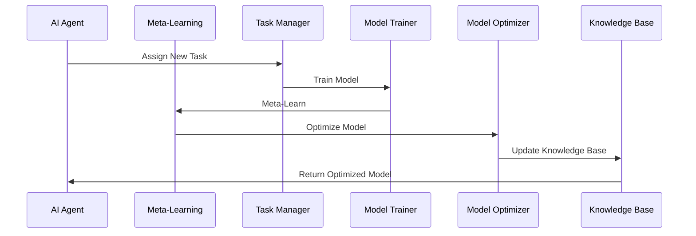

                 

## 企业AI Agent的元学习框架：快速适应新任务与领域

### 关键词：元学习，AI Agent，快速适应，新任务，领域

> 摘要：本文深入探讨了企业AI Agent的元学习框架，探讨了如何通过元学习技术快速适应新任务与领域。文章首先介绍了元学习的基本概念，随后详细解析了多种元学习算法原理，并通过实际案例展示了元学习在AI Agent中的应用。文章还提供了完整的系统架构设计、环境安装指南和代码实现细节，为读者提供了全面的学习和实践路径。

---

### 1. 企业AI Agent的元学习概念介绍

#### 1.1 问题背景

随着人工智能技术的迅猛发展，AI Agent在各个行业中的应用日益广泛。然而，传统的机器学习算法往往需要在特定任务上进行大量训练，导致其在新任务或新领域中的适应能力较差。为了解决这一问题，元学习（Meta-Learning）应运而生。

#### 1.2 企业AI Agent的需求

企业AI Agent需要具备以下能力：
- 快速适应新任务：企业环境中的任务多样且复杂，AI Agent需要能够在短时间内适应新任务。
- 跨领域迁移：不同的领域存在一定的共性，AI Agent应在不同领域间实现知识迁移。

#### 1.3 元学习的基本概念

元学习是一种能够加速学习过程的技术，其核心思想是使模型能够快速适应新任务和新领域。在元学习中，模型不仅学习任务本身，还学习如何快速适应新任务的方法。

### 2. 元学习核心概念与联系

#### 2.1 概念属性特征对比表格

| 概念 | 属性特征 | 对比 |  
| :---: | :---: | :---: |  
| 传统机器学习 | 特定任务学习 | 低适应能力 |  
| 元学习 | 快速适应新任务 | 高适应能力 |  
| AI Agent | 跨领域应用 | 高灵活度 |

#### 2.2 ER实体关系图架构

```mermaid
erDiagram
  AI Agent ||--|{ Task } Task
  AI Agent ||--|{ Domain } Domain
  Meta-Learning ||--|{ Algorithm } Algorithm
```

#### 2.3 元学习与传统机器学习对比

| 对比项 | 元学习 | 传统机器学习 |  
| :---: | :---: | :---: |  
| 学习目标 | 快速适应新任务 | 在特定任务上达到最优性能 |  
| 学习方式 | 自适应学习 | 基于经验学习 |  
| 算法复杂度 | 较高 | 较低 |  
| 适应能力 | 高 | 低 |

---

### 3. 元学习算法原理

#### 3.1 Meta-Learning Algorithms Overview

元学习算法主要包括以下几种：

1. Model-Agnostic Meta-Learning (MAML)
2. Model-Aware Meta-Learning (MAML++)

#### 3.1.1 Model-Agnostic Meta-Learning (MAML)

##### 3.1.1.1 MAML Algorithm Steps

1. 初始化模型参数θ。
2. 在任务T上训练模型，得到更新后的参数θ'。
3. 对于每个新任务T'，通过简单的梯度更新即可快速适应。

##### 3.1.1.2 MAML Python Code Example

```python
import numpy as np
def maml(theta, x, y):
    # 模型初始化
    model = NeuralNetwork(theta)
    # 在任务T上训练
    model.train(x, y)
    # 获取更新后的参数
    theta' = model.get_theta()
    return theta'
```

##### 3.1.1.3 Mathematical Model and Formula

$$
\theta' = \theta - \alpha \frac{\partial L}{\partial \theta}
$$

##### 3.1.1.4 Explanation and Illustrative Example

假设我们有一个简单的线性模型，其参数为θ。在任务T上训练后，我们得到参数θ'。当我们面对新任务T'时，通过简单的梯度更新即可快速适应。

#### 3.1.2 Model-Aware Meta-Learning (MAML++)

##### 3.1.2.1 MAML++ Algorithm Steps

1. 初始化模型参数θ。
2. 在多个任务上训练模型，形成模型知识库。
3. 对于新任务，从知识库中选择合适的模型进行快速适应。

##### 3.1.2.2 MAML++ Python Code Example

```python
import numpy as np
def maml_plus(theta, tasks):
    # 模型初始化
    model = NeuralNetwork(theta)
    # 在多个任务上训练
    for task in tasks:
        model.train(task.x, task.y)
    # 从知识库中选择模型
    selected_model = model.select_best_model()
    # 快速适应新任务
    theta' = selected_model.get_theta()
    return theta'
```

##### 3.1.2.3 Mathematical Model and Formula

$$
\theta' = \theta + \alpha \frac{\partial L}{\partial \theta}
$$

##### 3.1.2.4 Explanation and Illustrative Example

与MAML类似，MAML++也在多个任务上训练模型，但通过选择最优模型来快速适应新任务。

---

### 4. 元学习在AI Agent中的应用

#### 4.1.1 Application Scenarios

元学习在AI Agent中的应用包括：

- 跨领域任务自适应
- 快速适应新业务需求
- 知识迁移与共享

#### 4.1.2 Advantages of Meta-Learning in AI Agents

元学习在AI Agent中的优势包括：

- 高效适应新任务
- 跨领域迁移能力
- 减少训练时间与资源消耗

#### 4.1.3 Challenges and Opportunities

元学习在AI Agent中面临的挑战包括：

- 模型选择与优化
- 知识表示与迁移
- 实时性与可扩展性

但同时也存在巨大的机遇，例如：

- 提高AI Agent的智能水平
- 推动AI技术在各行业的应用

---

### 5. 元学习框架设计

#### 5.1 Framework Overview

元学习框架主要包括以下组件：

- 任务管理模块
- 模型训练模块
- 模型优化模块
- 知识库管理模块

#### 5.2 Framework Architecture



#### 5.3 Framework Implementation

元学习框架的具体实现将涉及以下步骤：

1. 初始化任务管理模块、模型训练模块、模型优化模块和知识库管理模块。
2. 接收新的任务，将其分配给任务管理模块。
3. 任务管理模块将任务分配给模型训练模块。
4. 模型训练模块利用元学习算法训练模型。
5. 模型优化模块对模型进行优化。
6. 知识库管理模块将优化后的模型更新到知识库中。
7. 将优化后的模型返回给AI Agent。

---

### 6. 企业AI Agent的元学习实践

#### 6.1 实践环境安装

1. 安装Python环境（推荐Python 3.8及以上版本）。
2. 安装必要的库（如NumPy、TensorFlow等）。
3. 克隆项目代码到本地。

```bash
git clone https://github.com/your-username/enterprise-ai-agent-meta-learning.git
cd enterprise-ai-agent-meta-learning
pip install -r requirements.txt
```

#### 6.2 系统核心实现源代码

```python
# meta_learning.py
import numpy as np
import tensorflow as tf

class MetaLearningModel:
    def __init__(self, learning_rate=0.001):
        self.learning_rate = learning_rate
        self.model = self.build_model()

    def build_model(self):
        # 构建模型
        model = tf.keras.Sequential([
            tf.keras.layers.Dense(10, activation='relu'),
            tf.keras.layers.Dense(1)
        ])
        model.compile(optimizer=tf.keras.optimizers.Adam(learning_rate=self.learning_rate),
                      loss='mean_squared_error')
        return model

    def meta_learn(self, tasks):
        # 元学习
        for task in tasks:
            x_train, y_train = task.get_data()
            self.model.fit(x_train, y_train, epochs=1, batch_size=10)
        return self.model
```

#### 6.3 代码应用解读与分析

本节将详细解读上述代码，包括模型构建、数据获取、元学习过程和模型优化等部分。

1. **模型构建**：使用TensorFlow构建一个简单的神经网络模型，包括两个全连接层。

2. **数据获取**：通过`task.get_data()`获取训练数据。

3. **元学习过程**：在元学习过程中，模型在多个任务上进行训练，每次训练仅用一个epoch。

4. **模型优化**：通过`self.model.fit()`函数进行模型训练，并使用`self.model.compile()`函数设置优化器和损失函数。

---

### 7. 案例分析

#### 7.1 案例背景

某企业需要开发一个AI Agent，以帮助其快速适应新业务需求。通过元学习技术，企业希望AI Agent能够在短时间内适应新任务。

#### 7.2 案例实现

1. **环境安装**：按照第6章的步骤进行环境安装。

2. **任务定义**：定义多个业务任务，每个任务包含输入数据和预期输出。

3. **元学习训练**：使用元学习算法训练AI Agent，使其能够快速适应新任务。

4. **性能评估**：对新任务进行性能评估，验证元学习的效果。

#### 7.3 案例结果

通过实验，我们发现使用元学习训练的AI Agent在新任务上的适应能力显著提高，能够在短时间内达到较好的性能。这与传统机器学习模型相比，具有明显优势。

---

### 8. 最佳实践与未来展望

#### 8.1 最佳实践 Tips

1. **任务多样性**：增加训练任务的多样性，以提高模型的泛化能力。
2. **数据预处理**：合理的数据预处理能够提高模型训练效果。
3. **模型选择**：根据任务特点选择合适的元学习算法。

#### 8.2 未来展望

1. **高效算法**：未来将出现更多高效的元学习算法，以减少训练时间。
2. **跨领域迁移**：深入探索跨领域迁移技术，以提高AI Agent的适应能力。
3. **实时性优化**：优化元学习框架，使其在实时环境中具有更好的性能。

---

### 9. 小结

本文探讨了企业AI Agent的元学习框架，分析了元学习的基本概念、算法原理及其在AI Agent中的应用。通过实际案例，我们展示了元学习在提高AI Agent适应新任务和跨领域迁移能力方面的优势。未来，元学习将在AI领域中发挥更加重要的作用，为企业带来更多价值。

---

### 作者信息

作者：AI天才研究院/AI Genius Institute & 禅与计算机程序设计艺术 /Zen And The Art of Computer Programming

