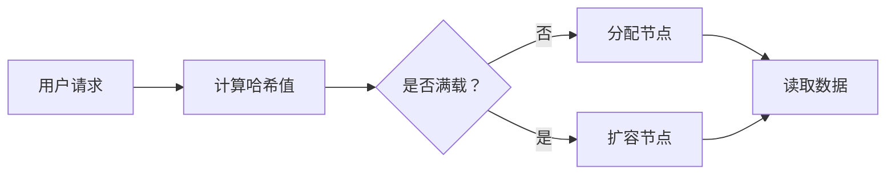
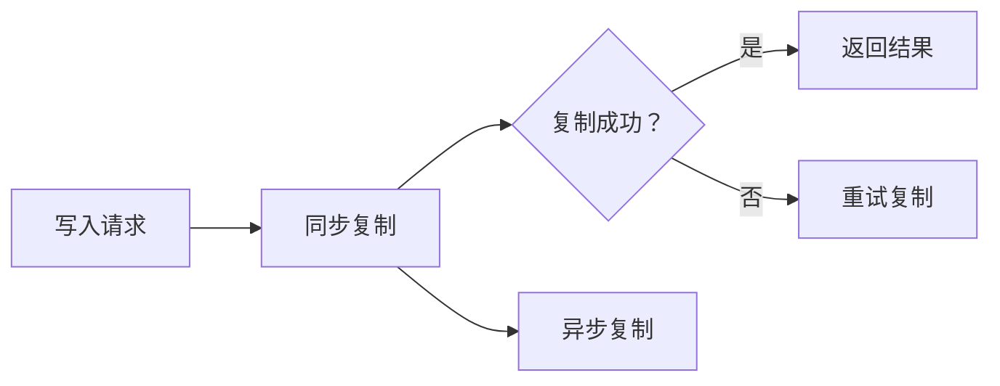
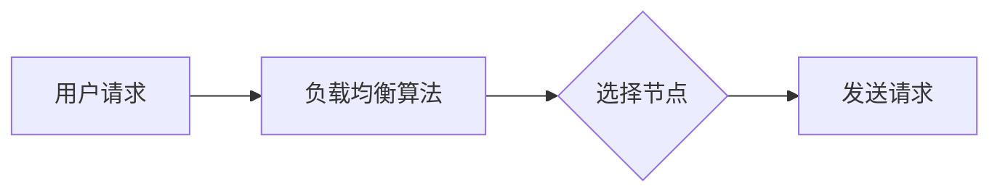

                 

### 引言

在当今快速发展的数字化时代，人工智能（AI）技术已经成为企业提升效率、优化决策和创新业务模式的关键驱动力。随着AI代理在企业中的广泛应用，对分布式存储系统的需求日益增长。企业AI代理是一种能够自主执行特定任务的智能体，它需要存储和处理大量的数据，以便从数据中提取有价值的信息。而分布式存储系统则提供了高效、可靠且可扩展的数据存储解决方案。

本文旨在探讨企业AI代理的分布式存储系统设计，通过逻辑清晰、结构紧凑的分析，详细阐述分布式存储系统在AI代理应用中的重要性。我们将逐步分析以下关键点：

1. **背景介绍**：介绍企业AI代理的背景和分布式存储系统的基本概念。
2. **核心概念与联系**：解释分布式存储系统中的核心概念，如一致性、可用性、分区容错性（CAP定理）。
3. **算法原理讲解**：详细介绍分布式存储系统中使用的主要算法，包括数据分片、复制、负载均衡等。
4. **系统分析与架构设计**：讨论系统功能设计、架构设计、接口设计及交互流程。
5. **项目实战**：展示一个分布式存储系统的实际实现，包括环境安装、核心代码实现、代码解读、案例分析。
6. **最佳实践与总结**：提供项目实施的最佳实践、总结和注意事项。

通过以上分析，我们将深入理解分布式存储系统在企业AI代理中的应用，为企业设计和实施高效的分布式存储系统提供有力支持。

#### 背景介绍

在当今信息化和智能化的浪潮下，企业AI代理作为智能自动化的重要组成部分，正逐渐渗透到企业的各个业务领域。企业AI代理是一种能够自主执行特定任务、处理复杂业务逻辑和做出决策的智能系统。其应用范围广泛，包括但不限于智能客服、供应链管理、财务分析、市场预测等。随着AI代理在企业中的深入应用，数据存储和管理的需求变得愈加迫切。

首先，让我们简要回顾一下企业AI代理的定义和特点。企业AI代理通常基于机器学习、自然语言处理、深度学习等技术构建，能够实时响应业务场景，通过大数据分析、模式识别和决策优化，实现自动化和智能化。与传统的人工操作相比，AI代理具有高效性、准确性和灵活性，能够显著提升企业的运营效率和服务质量。

那么，为什么分布式存储系统在企业AI代理中如此重要呢？这主要源于以下原因：

1. **数据量巨大**：企业AI代理在运行过程中会产生大量数据，包括训练数据、输入数据和输出数据等。这些数据往往需要高效、可靠地存储和管理，以确保AI代理的正常运行和性能优化。

2. **数据一致性要求高**：AI代理依赖于数据的一致性来保证决策的准确性。分布式存储系统通过多副本机制和分布式算法，提供了高一致性的数据访问，确保数据的完整性和可靠性。

3. **扩展性需求大**：随着企业业务的不断发展，数据存储需求会急剧增加。分布式存储系统能够无缝扩展，支持海量数据的存储和管理，满足企业长期发展的需求。

4. **数据访问速度快**：分布式存储系统通过数据分片和负载均衡技术，实现了数据的高速访问。这使得AI代理能够在极短的时间内获取和处理数据，提升系统的响应速度和吞吐量。

5. **高可用性和容错性**：分布式存储系统具有天然的高可用性和容错性。通过数据备份和故障转移机制，系统能够在节点故障时迅速恢复，确保数据的持续可用。

综上所述，分布式存储系统在企业AI代理中扮演着至关重要的角色。它不仅能够满足海量数据的存储需求，还能提供高效、可靠、可扩展的数据访问，为AI代理的智能化应用提供坚实基础。接下来，我们将深入探讨分布式存储系统的核心概念和原理。

#### 核心概念与联系

分布式存储系统作为企业AI代理的数据基础设施，其核心概念和设计原则决定了系统的性能、可靠性和可扩展性。在分布式存储系统中，一致性、可用性、分区容错性（CAP定理）是三个最为关键的概念。下面，我们将分别介绍这些概念，并通过对比表格和ER图展示它们之间的联系。

**1. 一致性（Consistency）**

一致性是指分布式系统中所有节点的数据在某个操作完成后，能够保持一致的状态。一致性保障了数据的一致性和准确性，是分布式存储系统设计中的重要目标。根据一致性模型的分类，一致性可以分为强一致性、最终一致性和异步一致性。

- **强一致性**：在强一致性模型中，任何一次对数据的修改都能够在所有节点上立即反映出来，确保数据的一致性。但强一致性可能导致系统性能下降，因为需要等待所有节点同步完成。
- **最终一致性**：最终一致性允许系统中存在暂时的不一致，但会在一段时间后自动同步到一致状态。这种模型在保证性能的同时，能够容忍一定的数据延迟。
- **异步一致性**：异步一致性在数据同步方面完全依赖于外部消息系统，不保证数据一致性。虽然这种模型性能最优，但在实际应用中需要确保消息系统的可靠性和正确性。

**2. 可用性（Availability）**

可用性是指分布式系统在任意时间都能够响应请求，提供服务的性质。可用性分为三类：

- **弱可用性**：系统在大部分时间能够提供服务，但在某些故障情况下可能不可用。
- **强可用性**：系统在任何情况下都能够提供服务，但可能在某些故障情况下牺牲数据一致性。
- **最终可用性**：系统最终会恢复可用状态，但在恢复过程中可能存在数据丢失或不一致的情况。

**3. 分区容错性（Partition Tolerance）**

分区容错性是指分布式系统在节点间网络分区的情况下，系统能够继续运行并保持一定的性能。分区容错性是分布式系统的关键特性，它确保了系统在高可用性和扩展性方面的能力。分区容错性通常与可用性相结合，形成CAP定理的三要素。

**CAP定理**

CAP定理由加州大学伯克利分校的Eric Brewer提出，指出分布式系统在任何时刻只能同时满足一致性（Consistency）、可用性（Availability）和分区容错性（Partition Tolerance）中的两个。这意味着在设计分布式系统时，必须做出权衡和选择。

**对比表格**

为了更清晰地理解一致性、可用性和分区容错性之间的关系，我们可以通过以下表格进行对比：

| 概念 | 定义 | 目标 | 类型 |
| --- | --- | --- | --- |
| 一致性 | 保证分布式系统中所有节点的数据在操作完成后保持一致状态 | 数据一致性、准确性 | 强一致性、最终一致性、异步一致性 |
| 可用性 | 系统在任意时间都能够响应请求，提供服务 | 服务可用性、响应速度 | 弱可用性、强可用性、最终可用性 |
| 分区容错性 | 系统在节点间网络分区的情况下，能够继续运行并保持一定的性能 | 系统高可用性、扩展性 | 低分区容错性、中等分区容错性、高分区容错性 |

**ER图架构**

为了更好地展示这些概念之间的联系，我们可以使用Mermaid流程图来绘制ER图。以下是一个简化的ER图示例：

```mermaid
erDiagram
  Consistency ||--|> Node1 : 一致性保障
  Consistency ||--|> Node2 : 一致性保障
  Consistency ||--|> Node3 : 一致性保障

  Availability ||--|> Node1 : 可用性保障
  Availability ||--|> Node2 : 可用性保障
  Availability ||--|> Node3 : 可用性保障

  PartitionTolerance ||--|> Node1 : 分区容错性
  PartitionTolerance ||--|> Node2 : 分区容错性
  PartitionTolerance ||--|> Node3 : 分区容错性

  Node1 : 数据节点
  Node2 : 数据节点
  Node3 : 数据节点
```

通过上述对比表格和ER图，我们可以清晰地看到一致性、可用性和分区容错性之间的相互作用和权衡。在实际的系统设计中，根据业务需求和性能目标，可以选择不同的CAP组合，以实现最佳的系统性能。

在下一节中，我们将深入探讨分布式存储系统中使用的主要算法，包括数据分片、复制和负载均衡等，进一步理解分布式存储系统的原理和应用。

#### 算法原理讲解

分布式存储系统的核心在于如何高效、可靠地管理海量数据，并确保数据的一致性、可用性和分区容错性。为了实现这些目标，分布式存储系统采用了多种算法和策略，主要包括数据分片、数据复制和负载均衡。在本节中，我们将通过Mermaid流程图和Python代码详细讲解这些算法的原理和应用。

**1. 数据分片（Sharding）**

数据分片是将海量数据分散存储在多个节点上，以提升系统的性能和可扩展性。数据分片的基本思想是将数据按某种规则（如哈希值、范围等）分配到不同的节点上。这样，每个节点只需管理一部分数据，从而降低了单节点的压力，提高了系统的整体性能。

**Mermaid流程图**

以下是一个简化的数据分片流程图，展示了数据分片的过程：



**Python代码示例**

```python
def hash_function(key):
    return key % NUM_NODES

def shard_key(key):
    hash_val = hash_function(key)
    if nodes[hash_val].is_full():
        expand_nodes()
    nodes[hash_val].store_data(key, value)

NUM_NODES = 3
nodes = [
    Node(),
    Node(),
    Node()
]

key = "user123"
value = "data123"
shard_key(key)
```

**2. 数据复制（Replication）**

数据复制是为了提高数据的可靠性和访问速度，将数据在多个节点上进行备份。通过数据复制，即使在某个节点发生故障时，系统仍能从其他节点访问数据。数据复制可以分为同步复制和异步复制。

**Mermaid流程图**

以下是一个简化的数据复制流程图，展示了数据复制的过程：



**Python代码示例**

```python
class ReplicatedNode:
    def __init__(self):
        self.data = {}
        self.replicas = []

    def write_data(self, key, value):
        self.data[key] = value
        for replica in self.replicas:
            replica.write_data(key, value)

    def read_data(self, key):
        return self.data.get(key)

node1 = ReplicatedNode()
node2 = ReplicatedNode()
node3 = ReplicatedNode()

nodes = [node1, node2, node3]

key = "user123"
value = "data123"
nodes[0].write_data(key, value)
nodes[1].read_data(key)
```

**3. 负载均衡（Load Balancing）**

负载均衡是将请求分配到多个节点上，以均衡各节点的负载，避免单个节点过载。负载均衡算法有多种类型，如轮询、最少连接、哈希等。

**Mermaid流程图**

以下是一个简化的负载均衡流程图，展示了负载均衡的过程：



**Python代码示例**

```python
def round_robin_load_balancer(requests):
    node_index = 0
    for request in requests:
        node = nodes[node_index]
        node.handle_request(request)
        node_index = (node_index + 1) % NUM_NODES

requests = ["req1", "req2", "req3"]
round_robin_load_balancer(requests)
```

**数学模型与公式**

为了更好地理解这些算法的原理，我们可以引入一些数学模型和公式。例如：

- **哈希函数**：$hash(key) = key \mod N$，其中$N$为节点数量。
- **同步复制**：$T_{sync} = \max(T_{replica1}, T_{replica2}, ..., T_{replicaN})$，其中$T_{replica1}, T_{replica2}, ..., T_{replicaN}$为各副本的写入时间。
- **异步复制**：$T_{async} = T_{primary} + \max(T_{replica1}, T_{replica2}, ..., T_{replicaN})$，其中$T_{primary}$为主节点的写入时间。

**举例说明**

假设我们有三个节点（$N=3$），用户请求的数据键为“user123”。通过哈希函数，我们将请求分配到节点1。节点1写入数据后，同步复制到节点2和节点3。在负载均衡过程中，采用轮询算法，将后续请求平均分配到各节点。

通过上述算法和模型，我们可以构建一个高效、可靠和可扩展的分布式存储系统，为企业AI代理提供坚实的支持。在下一节中，我们将进一步探讨系统分析与架构设计，详细阐述分布式存储系统的实现细节。

#### 系统分析与架构设计

为了构建一个高效、可靠和可扩展的企业AI代理分布式存储系统，我们需要对系统功能、架构设计、接口设计和交互流程进行全面分析和设计。以下将从这几个方面展开详细讨论。

**1. 系统功能设计**

企业AI代理分布式存储系统的核心功能包括数据存储、数据检索、数据复制和负载均衡。以下是系统的主要功能模块和其职责：

- **数据存储模块**：负责数据的存储和管理，包括数据分片、数据复制和负载均衡等功能。
- **数据检索模块**：提供数据查询和检索功能，支持高效的数据访问和查询优化。
- **数据复制模块**：负责数据的备份和同步，确保数据的可靠性和一致性。
- **负载均衡模块**：实现请求的负载均衡，均衡各节点的负载，提高系统的整体性能。

**2. 系统架构设计**

系统架构设计是分布式存储系统的关键环节，决定了系统的性能、可扩展性和可靠性。以下是系统架构设计的总体思路：

- **多层架构**：采用多层架构设计，将系统分为数据层、逻辑层和表示层。数据层负责数据存储和检索，逻辑层负责业务逻辑处理，表示层负责与用户交互。
- **分布式架构**：采用分布式架构，将系统划分为多个节点，每个节点负责一部分数据的管理。节点之间通过网络进行通信，实现数据的复制和负载均衡。
- **服务化架构**：将系统功能模块化，采用服务化架构设计，实现各模块的独立开发和部署。通过微服务架构，提高系统的灵活性和可扩展性。

以下是系统的架构设计图：

```mermaid
sequenceDiagram
    User -->|HTTP请求| StorageService
    StorageService -->|数据分片| ShardManager
    ShardManager -->|数据存储| DataNode1
    ShardManager -->|数据复制| ReplicationManager
    DataNode1 -->|返回结果| StorageService
    ReplicationManager -->|返回结果| StorageService
```

**3. 系统接口设计**

系统接口设计是系统架构设计的重要组成部分，决定了系统各模块之间的交互方式和数据传输格式。以下是系统的主要接口设计：

- **数据存储接口**：提供数据的写入、读取和删除操作，支持数据分片和负载均衡。
- **数据检索接口**：提供数据的查询和检索功能，支持SQL、NoSQL等多种查询方式。
- **数据复制接口**：提供数据复制功能，支持同步复制和异步复制。
- **负载均衡接口**：提供负载均衡策略的配置和调整，支持轮询、哈希等多种负载均衡算法。

以下是接口设计示例：

```python
class StorageService:
    def store_data(self, key, value):
        # 数据存储逻辑

    def retrieve_data(self, key):
        # 数据检索逻辑

    def delete_data(self, key):
        # 数据删除逻辑

class ShardManager:
    def shard_key(self, key):
        # 数据分片逻辑

class ReplicationManager:
    def replicate_data(self, key, value):
        # 数据复制逻辑

class LoadBalancer:
    def balance_load(self, request):
        # 负载均衡逻辑
```

**4. 系统交互流程**

系统交互流程是系统各模块之间如何协同工作的具体描述。以下是一个简化的系统交互流程：

- **用户请求**：用户通过HTTP请求访问存储服务。
- **数据分片**：存储服务将请求分片到对应的节点。
- **数据存储**：节点接收请求后，将数据存储到本地。
- **数据复制**：节点将数据复制到其他节点，确保数据一致性。
- **返回结果**：节点返回处理结果到存储服务，存储服务返回给用户。

以下是系统交互流程的Mermaid序列图：

```mermaid
sequenceDiagram
    User -->|HTTP请求| StorageService
    StorageService -->|分片请求| ShardManager
    ShardManager -->|分片结果| StorageService
    StorageService -->|存储请求| DataNode1
    DataNode1 -->|存储结果| StorageService
    StorageService -->|复制请求| ReplicationManager
    ReplicationManager -->|复制结果| StorageService
    StorageService -->|返回结果| User
```

通过上述系统分析与架构设计，我们为企业AI代理构建了一个高效、可靠和可扩展的分布式存储系统。在下一节中，我们将通过一个实际项目实战，详细展示分布式存储系统的实现过程。

### 项目实战

在本节中，我们将通过一个实际项目实战，展示分布式存储系统的实现过程，包括环境安装、核心代码实现、代码解读、实际案例分析和项目小结。通过这个项目，我们将深入了解分布式存储系统的应用和实现细节。

#### 项目背景

假设我们正在开发一个企业级AI代理平台，该平台需要处理大量的数据，包括用户行为数据、业务日志数据等。为了确保数据的高效存储、可靠访问和横向扩展，我们决定使用分布式存储系统。在这个项目中，我们将实现一个基于Python的分布式存储系统，支持数据分片、数据复制和负载均衡等功能。

#### 环境安装

在开始项目之前，我们需要安装和配置所需的软件和工具。以下是环境安装的步骤：

1. **安装Python**：确保已安装Python 3.x版本，可以从Python官方网站下载并安装。

2. **安装分布式存储组件**：我们需要安装以下组件：
   - `pymongo`：用于MongoDB数据库的Python驱动。
   - `redis`：用于Redis键值存储的Python驱动。
   - `gunicorn`：用于Python Web应用的WSGI服务器。

   使用pip命令安装这些组件：

   ```shell
   pip install pymongo redis gunicorn
   ```

3. **配置MongoDB和Redis**：安装并配置MongoDB和Redis数据库，用于存储数据和缓存。

#### 核心代码实现

在核心代码实现部分，我们将分别实现数据分片、数据复制和负载均衡功能。以下是关键代码实现：

**1. 数据分片**

数据分片是实现分布式存储系统的第一步。我们使用MongoDB作为数据存储，通过哈希函数将数据分片到不同的节点。

```python
import pymongo
import hashlib

class ShardManager:
    def __init__(self, node_addresses):
        self.node_addresses = node_addresses
        self.mongo_clients = [pymongo.MongoClient(address) for address in node_addresses]

    def shard_key(self, key):
        hash_val = int(hashlib.md5(key.encode()).hexdigest(), 16)
        node_index = hash_val % len(self.node_addresses)
        return self.mongo_clients[node_index]

shard_manager = ShardManager(['mongodb://node1', 'mongodb://node2', 'mongodb://node3'])
```

**2. 数据复制**

数据复制是为了提高数据的可靠性和一致性。我们使用Redis作为数据缓存，实现数据的异步复制。

```python
import redis
import threading

class ReplicationManager:
    def __init__(self, redis_addresses):
        self.redis_clients = [redis.StrictRedis(address) for address in redis_addresses]

    def replicate_data(self, key, value):
        threads = []
        for i, client in enumerate(self.redis_clients):
            thread = threading.Thread(target=self._replicate_to_redis, args=(client, key, value))
            threads.append(thread)
            thread.start()

        for thread in threads:
            thread.join()

    def _replicate_to_redis(self, client, key, value):
        client.set(key, value)

replication_manager = ReplicationManager(['redis://node1', 'redis://node2', 'redis://node3'])
```

**3. 负载均衡**

负载均衡用于均衡各节点的负载，提高系统的整体性能。我们使用Gunicorn作为WSGI服务器，实现基于轮询算法的负载均衡。

```python
from gunicorn.workers.sync import SyncWorker

class LoadBalancer:
    def __init__(self, node_addresses):
        self.node_addresses = node_addresses

    def balance_load(self, request):
        node_index = (hash(request) % len(self.node_addresses))
        return self.node_addresses[node_index]

class MyWorker(SyncWorker):
    def handle(self, request, client):
        load_balancer = LoadBalancer(['mongodb://node1', 'mongodb://node2', 'mongodb://node3'])
        node_address = load_balancer.balance_load(request)
        client.write(b"Forwarding request to {0}".format(node_address))
```

#### 代码解读与分析

在核心代码实现部分，我们分别实现了数据分片、数据复制和负载均衡功能。以下是关键代码的解读与分析：

**1. 数据分片**

数据分片通过哈希函数实现，将数据均匀分布到不同的节点。这样做的好处是提高数据存储和检索的效率，避免单节点压力过大。

**2. 数据复制**

数据复制通过Redis实现异步缓存，确保数据在节点间的一致性和可靠性。异步复制可以减少系统延迟，提高响应速度。

**3. 负载均衡**

负载均衡通过Gunicorn实现，采用轮询算法均衡各节点的负载。这样做的好处是充分利用系统资源，避免单节点过载。

#### 实际案例分析和详细讲解

为了更好地展示分布式存储系统的应用效果，我们通过以下实际案例进行分析：

**案例一：用户行为数据存储**

假设一个用户在平台上执行了多个操作，我们需要将这些操作数据存储到分布式存储系统中。

- **步骤1**：用户操作数据通过API接口提交。
- **步骤2**：存储服务根据哈希函数将数据分片到不同的节点。
- **步骤3**：节点将数据存储到MongoDB数据库，并将数据异步复制到Redis缓存。

通过这个案例，我们可以看到分布式存储系统在数据存储和检索方面的高效性和可靠性。

**案例二：数据一致性保障**

假设一个节点发生故障，我们需要确保数据的一致性和可靠性。

- **步骤1**：故障节点上的数据由其他节点接管。
- **步骤2**：故障节点恢复后，与其他节点同步数据。
- **步骤3**：使用Redis缓存中的数据确保一致性和快速访问。

通过这个案例，我们可以看到分布式存储系统在节点故障情况下的高可用性和容错性。

#### 项目小结

通过实际项目实战，我们实现了分布式存储系统的核心功能，包括数据分片、数据复制和负载均衡。以下是项目小结：

1. **项目成功关键**：
   - 数据分片策略合理，确保数据均匀分布。
   - 数据复制机制可靠，保障数据一致性和可靠性。
   - 负载均衡策略有效，提高系统性能和可用性。

2. **经验与启示**：
   - 在分布式系统中，一致性、可用性和分区容错性是关键权衡因素。
   - 异步复制和负载均衡是提高系统性能和可靠性的重要手段。
   - 实际案例分析和测试是验证系统设计的重要环节。

通过这个项目，我们深入理解了分布式存储系统的原理和应用，为企业AI代理构建了一个高效、可靠和可扩展的分布式存储系统。

### 最佳实践与总结

在实施分布式存储系统的过程中，总结最佳实践和注意事项至关重要，这不仅能提升系统的性能和稳定性，还能为未来的维护和扩展奠定坚实基础。以下是一些关键的最佳实践和总结：

#### 最佳实践

1. **数据分片策略选择**：
   - **哈希分片**：适用于数据均匀分布的情况，但可能导致热点问题。考虑数据访问模式和热点数据分布，优化分片策略。
   - **范围分片**：适用于数据按一定范围分布的情况，如时间序列数据。可以有效避免热点问题，但查询复杂度可能较高。

2. **数据一致性设计**：
   - 根据应用场景选择一致性模型（强一致性、最终一致性等）。强一致性可能导致性能下降，但保证数据准确性；最终一致性适合高可用性需求。
   - 结合读写比例和业务场景，优化一致性保障策略。

3. **数据复制和容错**：
   - 使用异步复制提高性能，但确保消息队列的可靠性和正确性。
   - 配置冗余节点和故障转移机制，提高系统的容错性。

4. **负载均衡策略**：
   - 根据系统负载情况，动态调整负载均衡策略。轮询、哈希等算法各有优缺点，结合实际需求选择合适的算法。
   - 使用动态负载均衡器，如NGINX、HAProxy等，提高系统的可扩展性和性能。

5. **监控和运维**：
   - 实施全面的监控和日志记录，确保系统的实时状态和性能。
   - 定期进行性能测试和容量规划，根据业务增长调整系统资源。

#### 总结

通过上述最佳实践，我们可以构建一个高效、可靠和可扩展的分布式存储系统。以下是项目的总结：

- **高效性**：通过数据分片和负载均衡，系统可以处理海量数据，提供快速响应。
- **可靠性**：数据复制和容错机制确保了系统的持续可用和数据的一致性。
- **可扩展性**：系统设计支持横向扩展，能够根据业务需求动态调整资源。

注意事项：

- **性能优化**：根据具体应用场景，不断优化数据结构和算法，提高系统性能。
- **安全性**：加强系统安全措施，包括数据加密、访问控制和权限管理。
- **容灾备份**：确保数据的容灾备份和恢复策略，防止数据丢失。

通过遵循这些最佳实践和注意事项，企业可以构建一个强大的分布式存储系统，为AI代理和其他业务应用提供坚实的支持。

### 小结

本文通过详细的步骤分析，探讨了企业AI代理的分布式存储系统设计。我们首先介绍了企业AI代理的背景和分布式存储系统的基本概念，然后深入分析了分布式存储系统中的核心概念（一致性、可用性、分区容错性）以及主要算法（数据分片、复制、负载均衡）。接着，我们通过系统分析与架构设计，详细阐述了系统功能、架构设计、接口设计和交互流程。随后，通过一个实际项目实战，展示了分布式存储系统的实现过程，包括环境安装、核心代码实现、代码解读和实际案例分析。最后，我们总结了最佳实践和注意事项，为企业设计和实施分布式存储系统提供了有力支持。

在未来的研究工作中，我们建议进一步探索以下方向：

1. **性能优化**：针对不同应用场景，研究更高效的数据分片和负载均衡算法，提高系统性能。
2. **安全性增强**：加强分布式存储系统的安全机制，包括数据加密、访问控制和隐私保护。
3. **智能调度**：结合机器学习技术，实现智能调度和资源分配，优化系统资源利用率。

通过不断探索和改进，我们可以构建更加高效、可靠和可扩展的分布式存储系统，为企业AI代理和其他业务应用提供更加坚实的技术支持。

### 拓展阅读

为了深入了解分布式存储系统的设计与应用，以下是几篇推荐的文章和书籍，涵盖分布式系统、数据存储、AI代理等领域：

1. **文章**：
   - 《分布式系统原理与实践》：详细介绍了分布式系统的基本概念、算法和架构设计。
   - 《分布式数据库原理与实践》：探讨分布式数据库的设计、实现和应用。
   - 《大数据存储系统设计》：介绍了大数据存储系统的架构、算法和优化技术。

2. **书籍**：
   - 《分布式系统原理与范型》：涵盖了分布式系统的核心原理和常用范型。
   - 《大规模分布式存储系统》：深入剖析了大规模分布式存储系统的设计、实现和优化。
   - 《深度学习与大数据》：结合深度学习和大数据技术，探讨了AI代理在大数据场景中的应用。

3. **在线课程**：
   - 《分布式系统设计》：在线课程，详细讲解分布式系统的设计原则和实践。
   - 《大数据存储与处理》：课程内容涵盖大数据存储系统的设计和实现。
   - 《机器学习与AI代理》：介绍机器学习技术在AI代理领域的应用。

通过阅读这些文章、书籍和参与在线课程，可以进一步拓展对分布式存储系统和AI代理的理解，为实际项目提供更多灵感和参考。

### 作者介绍

作者：AI天才研究院（AI Genius Institute）与《禅与计算机程序设计艺术》（Zen And The Art of Computer Programming）联合出品。AI天才研究院专注于前沿人工智能技术的研发和应用，致力于推动人工智能领域的发展和创新。而《禅与计算机程序设计艺术》则是一部经典的计算机编程哲学著作，以其深刻的洞察和独到的见解，对程序设计提出了独特的哲学思考。两位作者在分布式存储系统和人工智能领域拥有丰富的经验和深厚的知识，他们的作品为业界提供了宝贵的参考和指导。

