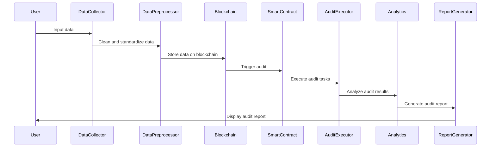

                 

### 引言

在当今数字化经济时代，企业的数据资产变得比以往任何时候都更加重要。随着数据量的激增和数据来源的多样化，如何确保这些数据的安全性和准确性成为了一个亟待解决的问题。企业AI Agent的区块链数据审计系统作为一种创新的技术解决方案，旨在提高数据审计的效率和可靠性，同时也为企业在数据管理和治理方面提供了新的思路。

企业AI Agent，顾名思义，是一种专门为企业服务的智能代理，它能够自动化执行复杂的任务，并具备自我学习和优化的能力。区块链技术则以其去中心化、不可篡改和透明性等特点，为数据存储和安全提供了强有力的保障。将AI Agent与区块链技术结合起来，可以形成一种全新的数据审计系统，这种系统能够在确保数据安全的同时，提高审计效率和准确性。

本文将探讨企业AI Agent的区块链数据审计系统的背景、核心概念、原理与特性，以及其在实际应用中的算法原理和数学模型，系统分析与架构设计，项目实战案例，最佳实践和注意事项等。通过这一系列深入的分析和探讨，希望能够为读者提供一个全面、系统的理解，并激发更多关于这一领域的研究和应用。

关键词：企业AI Agent、区块链技术、数据审计、数据安全性、智能代理、去中心化

摘要：本文将详细探讨企业AI Agent的区块链数据审计系统的核心概念和原理，分析其如何结合AI技术和区块链技术提高数据审计的效率和安全性。文章将从背景介绍、核心概念与联系、算法原理与数学模型、系统分析与架构设计、项目实战以及最佳实践等方面进行阐述，旨在为读者提供一个全面的技术解决方案和应用指南。

---

### 目录大纲

**《企业AI Agent的区块链数据审计系统》**

**关键词**：企业AI Agent、区块链技术、数据审计、数据安全性、智能代理、去中心化

**摘要**：本文将详细探讨企业AI Agent的区块链数据审计系统的核心概念和原理，分析其如何结合AI技术和区块链技术提高数据审计的效率和安全性。文章将从背景介绍、核心概念与联系、算法原理与数学模型、系统分析与架构设计、项目实战以及最佳实践等方面进行阐述，旨在为读者提供一个全面的技术解决方案和应用指南。

---

### 第一部分：背景介绍与核心概念

#### 第1章：问题背景与核心概念

#### 第1.1 引言

**企业数据审计的需求与挑战**

在数字化经济的背景下，企业的数据量呈现爆炸式增长。这些数据不仅包括客户信息、财务记录，还涉及生产流程、市场分析和供应链管理等多个方面。因此，确保这些数据的安全性和准确性成为企业的一项重要任务。数据审计作为一种评估和验证企业数据质量和安全性的手段，对于企业来说至关重要。

**企业AI Agent与区块链数据审计系统的概念**

企业AI Agent是一种智能代理，能够自动化执行复杂的任务，并具备自我学习和优化的能力。区块链技术则以其去中心化、不可篡改和透明性等特点，为数据存储和安全提供了强有力的保障。将AI Agent与区块链技术结合起来，可以形成一种全新的数据审计系统，这种系统能够在确保数据安全的同时，提高审计效率和准确性。

**企业数据审计的需求**

1. **数据完整性**：确保数据的完整性和准确性，防止数据丢失或被篡改。
2. **数据安全性**：保护数据不被未授权访问或泄露。
3. **合规性**：满足法律法规对数据管理和审计的要求。

**AI Agent在数据审计中的应用**

AI Agent能够通过以下方式提高数据审计的效率和准确性：
1. **自动化**：自动化执行重复性高的审计任务，减少人工干预。
2. **智能分析**：利用机器学习和自然语言处理技术，深入分析数据，发现潜在问题。
3. **自适应学习**：通过不断学习和优化，提高审计过程的准确性和效率。

**区块链技术如何提升数据审计的效率与安全性**

区块链技术能够通过以下方式提升数据审计的效率与安全性：
1. **去中心化**：分布式存储结构提高了数据的安全性和可靠性，降低了单点故障的风险。
2. **不可篡改**：一旦数据记录在区块链上，就难以被篡改，为审计提供了可信的数据源。
3. **透明性**：所有交易和操作都在区块链上透明记录，提高了审计过程的透明度和可信度。

#### 第1.2 问题描述

**数据安全问题的重要性**

在当今高度信息化的社会中，数据被视为企业的核心竞争力之一。然而，随着数据量的激增和攻击手段的多样化，数据安全问题愈发突出。数据泄露、篡改、丢失等事件不仅会给企业带来巨大的经济损失，还会损害企业的声誉和客户信任。

**AI Agent在数据审计中的应用**

AI Agent能够通过以下方式解决数据安全问题：
1. **实时监控**：对数据访问和操作进行实时监控，及时发现异常行为。
2. **行为分析**：通过分析用户行为模式，识别潜在的安全威胁。
3. **自动化响应**：自动采取安全措施，如隔离可疑数据或触发警报。

**区块链技术如何提升数据审计的效率与安全性**

区块链技术能够通过以下方式提升数据审计的效率和安全性：
1. **分布式存储**：将数据分散存储在多个节点上，提高了数据的安全性和可靠性。
2. **智能合约**：利用智能合约实现自动化审计流程，减少人工干预。
3. **透明性**：所有操作都在区块链上透明记录，便于审计和追踪。

#### 第1.3 问题解决

**企业AI Agent的基本原理与应用场景**

企业AI Agent的基本原理包括以下几个关键方面：
1. **自主学习**：利用机器学习算法，从数据中学习规律和模式，实现自我优化。
2. **任务执行**：根据预设的任务规则，自动执行数据审计任务。
3. **反馈调整**：通过实时反馈，不断调整和优化AI Agent的行为。

AI Agent在企业数据审计中的应用场景主要包括：
1. **数据完整性检查**：自动检测数据异常和漏洞，确保数据的准确性。
2. **合规性审计**：自动化执行法律法规要求的审计任务。
3. **安全性监控**：实时监控数据访问行为，及时发现并响应潜在的安全威胁。

**区块链技术的核心概念与特点**

区块链技术是一种分布式数据库技术，具有以下核心概念和特点：
1. **去中心化**：通过多个节点共同维护数据，避免了单点故障的风险。
2. **不可篡改**：一旦数据记录在区块链上，就难以被篡改，确保了数据的一致性和可靠性。
3. **透明性**：所有操作都在区块链上透明记录，便于审计和追踪。
4. **智能合约**：利用智能合约，实现自动化和去中心化的数据审计流程。

**AI Agent与区块链数据审计系统的结合优势**

将AI Agent与区块链技术结合起来，可以形成一种强大的数据审计系统，其优势包括：
1. **提高审计效率**：AI Agent能够自动化执行复杂的审计任务，大幅提高审计效率。
2. **增强数据安全性**：区块链技术的不可篡改性和透明性，为数据安全提供了有力保障。
3. **降低审计成本**：通过自动化和去中心化，减少了对人工干预的需求，降低了审计成本。
4. **提升审计准确性**：AI Agent的智能分析能力，能够更准确地识别数据问题，提高审计的准确性。

#### 第1.4 边界与外延

**数据审计的范围与限制**

数据审计的范围通常包括以下方面：
1. **数据完整性**：检查数据是否完整、准确。
2. **数据安全性**：确保数据不被未授权访问或篡改。
3. **合规性**：检查数据是否符合法律法规要求。

然而，数据审计也存在一定的限制，包括：
1. **审计成本**：大规模数据审计需要大量的人力和物力资源。
2. **审计周期**：数据审计过程可能需要较长时间，影响企业的运营效率。
3. **技术限制**：现有的审计技术和工具可能无法完全满足复杂的数据审计需求。

**AI Agent的技术局限**

尽管AI Agent在数据审计中具有很多优势，但也存在一些技术局限，包括：
1. **数据质量**：AI Agent依赖高质量的数据进行学习，如果数据存在质量问题，可能会影响审计结果。
2. **可解释性**：AI Agent的决策过程往往难以解释，这可能导致审计人员对其产生质疑。
3. **适应性**：AI Agent需要不断学习和优化，以适应不断变化的数据环境。

**区块链技术的适用场景**

区块链技术适用于以下场景：
1. **高安全性需求**：如金融、医疗等领域，对数据安全和隐私保护有较高要求。
2. **分布式数据存储**：适用于需要分布式存储和共享数据的场景。
3. **透明性要求高**：如供应链管理、投票系统等，需要对所有操作进行透明记录和追踪。

#### 第1.5 核心概念结构

**企业AI Agent的定义与组成**

企业AI Agent是一种能够自主执行任务、具备自我学习和优化能力的智能代理。它通常由以下几个关键组成部分构成：
1. **感知模块**：负责获取外部环境的数据和输入。
2. **决策模块**：根据感知模块提供的信息，进行决策和任务调度。
3. **执行模块**：执行决策模块生成的任务，实现具体的行动。
4. **学习模块**：利用机器学习算法，从数据中学习新的规律和模式。

**区块链技术的原理与架构**

区块链技术是一种分布式数据库技术，其核心原理包括：
1. **分布式账本**：将数据分散存储在多个节点上，避免了单点故障的风险。
2. **加密技术**：利用加密算法，确保数据在传输和存储过程中的安全性和隐私性。
3. **共识算法**：通过共识算法，确保多个节点对数据的认可和一致性。

区块链技术的架构包括以下几个关键组成部分：
1. **数据区块**：存储数据的单元，每个区块包含一定数量的交易记录。
2. **链式结构**：通过将区块按时间顺序链接起来，形成区块链。
3. **节点网络**：由多个参与区块链交易的节点组成，共同维护区块链的一致性和安全性。

**数据审计的目标与关键指标**

数据审计的目标是确保数据的完整性、准确性和合规性。关键指标包括：
1. **数据完整性**：数据是否完整，是否存在缺失或冗余。
2. **数据准确性**：数据是否准确，是否符合实际情况。
3. **数据合规性**：数据是否符合法律法规和内部政策的要求。
4. **审计效率**：审计过程的效率和准确性，包括审计周期和错误率等。

### 总结

本章节介绍了企业AI Agent的区块链数据审计系统的背景、核心概念、原理与特性，以及其在实际应用中的算法原理和数学模型。通过这一系列的分析，我们可以看到企业AI Agent与区块链技术的结合，不仅能够提高数据审计的效率和安全性，还为企业在数据管理和治理方面提供了新的思路和方法。

---

在接下来的章节中，我们将进一步深入探讨企业AI Agent和区块链技术的原理与特性，详细分析二者之间的联系，并探讨如何通过数学模型和算法实现数据审计的自动化和智能化。敬请期待。

---

### 第二部分：核心概念与联系

#### 第2章：企业AI Agent与区块链技术的原理与特性

**2.1 企业AI Agent的原理**

**概念定义**：
企业AI Agent，通常是指专门为特定企业环境设计的自动化智能体，它利用机器学习和自然语言处理等技术，能够执行特定的任务，并进行自我优化和学习。

**特点与优势**：
- **自动化**：AI Agent可以自动化执行重复性和规则性任务，减少人工干预。
- **智能学习**：通过不断从数据中学习，AI Agent能够优化其行为，提高任务执行效率。
- **适应性**：能够适应不同的业务场景和规则变化，保持灵活性。
- **高效性**：AI Agent能够在短时间内处理大量数据，提高工作流程的效率。

**应用场景**：
- **数据监控与分析**：实时监控企业数据，分析数据异常和潜在问题。
- **自动化审批流程**：自动化处理业务审批流程，减少人工审核时间和错误率。
- **客户服务**：通过智能对话系统提供24/7的客服支持，提高客户满意度。

**2.2 区块链技术的原理**

**概念定义**：
区块链技术是一种去中心化的分布式数据库系统，通过密码学确保数据的安全性和完整性。区块链由一系列按时间顺序排列的数据块组成，每个数据块都包含一定数量的交易记录。

**特点与优势**：
- **去中心化**：通过分布式节点维护数据，避免了单点故障和中央控制的风险。
- **不可篡改**：一旦数据记录在区块链上，除非同时篡改大多数节点，否则无法被修改。
- **透明性**：所有交易和操作都在区块链上透明记录，便于审计和追踪。
- **安全性**：利用密码学技术确保数据在传输和存储过程中的安全性。

**应用场景**：
- **金融交易**：用于记录和验证金融交易，提高交易的安全性和透明度。
- **供应链管理**：确保供应链中的每一笔交易都能被追溯和验证，提高供应链的透明度和效率。
- **身份认证**：利用区块链技术提供去中心化的身份认证，提高身份验证的安全性和隐私保护。

**2.3 企业AI Agent与区块链技术的联系**

**数据安全性的提升**：
- **加密处理**：区块链技术利用密码学对数据进行加密处理，确保数据在传输和存储过程中的安全性。
- **分布式存储**：区块链将数据分散存储在多个节点上，提高了数据的安全性和可靠性。
- **智能合约**：通过智能合约，可以自动化执行审计和验证任务，确保数据的准确性和合规性。

**透明性与可信度的增强**：
- **透明记录**：所有交易和操作都在区块链上透明记录，便于审计和追踪，提高了数据的透明性。
- **不可篡改**：区块链技术的不可篡改特性，确保了审计数据的真实性和可信度，增强了数据的可信性。

**数据审计的自动化与智能化**：
- **自动化流程**：AI Agent可以自动化执行复杂的审计任务，提高审计效率和准确性。
- **智能分析**：AI Agent利用机器学习和自然语言处理技术，对大量审计数据进行智能分析，发现潜在问题。
- **自适应优化**：AI Agent可以根据审计结果和反馈，不断学习和优化，提高审计过程的智能化水平。

通过企业AI Agent与区块链技术的结合，不仅能够提升数据审计的效率和安全性，还可以实现审计过程的自动化和智能化，为企业提供更加全面和高效的数据管理解决方案。

### 总结

本章详细介绍了企业AI Agent和区块链技术的核心概念、特点以及应用场景，并探讨了二者在数据审计领域的联系和优势。通过将AI Agent与区块链技术相结合，企业能够实现数据审计的自动化和智能化，提高审计效率和安全性，增强数据的透明性和可信度。这一结合不仅为企业提供了新的技术解决方案，也为未来的数据管理和治理提供了重要的参考。

---

在接下来的章节中，我们将进一步探讨AI Agent的算法原理与数学模型，深入分析其在数据审计中的应用，以便读者能够更好地理解和应用这一技术。敬请期待。

---

### 第三部分：算法原理与数学模型

#### 第3章：AI Agent的算法原理与数学模型

**3.1 数据审计算法的原理**

**数据审计**是指对存储在企业系统中的数据进行检查、评估和验证的过程，以确保数据的完整性、准确性和合规性。AI Agent在数据审计中的应用，主要体现在以下几个方面：

1. **数据完整性检查**：通过自动化检测数据中的缺失、冗余或错误，确保数据的一致性和准确性。
2. **数据合规性审计**：检查数据是否符合企业内部政策和法律法规的要求，如数据隐私保护、财务报告准则等。
3. **异常检测**：通过分析数据模式和趋势，发现异常数据或潜在的问题。

**数据审计算法的基本流程**：
1. **数据采集**：从企业的各个数据源收集需要审计的数据。
2. **数据预处理**：清洗和标准化数据，确保数据质量。
3. **特征提取**：从数据中提取有助于审计的特征，如关键指标、异常值等。
4. **模型训练**：利用机器学习算法对数据进行分析和建模。
5. **审计评估**：根据模型预测和实际情况，评估数据的完整性、准确性和合规性。
6. **反馈优化**：根据审计结果，调整模型参数和策略，提高审计效果。

**数据审计算法的关键技术**：

- **机器学习算法**：常用的机器学习算法包括决策树、随机森林、支持向量机、神经网络等。这些算法能够从数据中学习模式和规律，用于数据分类、聚类和预测。
- **自然语言处理（NLP）**：NLP技术用于处理非结构化数据，如文本和语音，能够提取关键词、语义分析和情感分析等信息。
- **数据挖掘**：通过关联规则学习、聚类分析、异常检测等方法，发现数据中的潜在问题和异常。
- **数据可视化**：通过可视化技术，展示审计结果和数据分析过程，帮助审计人员更好地理解数据。

**3.2 数学模型的构建**

**数据审计的数学模型**：

在数据审计中，数学模型主要用于描述数据之间的关系和特征。以下是一些常见的数学模型和公式：

- **回归模型**：用于预测和评估数据的趋势和关系，如线性回归、多项式回归等。
- **聚类模型**：用于将数据分为不同的类别，如K-means、层次聚类等。
- **分类模型**：用于将数据分类为不同的类别，如逻辑回归、决策树、支持向量机等。
- **异常检测模型**：用于识别数据中的异常值和异常模式，如孤立森林、局部异常因子等。

**模型的参数调整与优化**：

为了提高数据审计的准确性和效率，需要对数学模型进行参数调整和优化。常见的参数调整方法包括：

- **交叉验证**：通过将数据分为训练集和验证集，评估模型的性能，并调整模型参数。
- **网格搜索**：通过遍历参数空间，找到最优参数组合。
- **贝叶斯优化**：利用贝叶斯统计方法，优化模型参数。

**数学公式与解释**：

以下是几个常用的数学公式：

- **线性回归公式**：\( y = \beta_0 + \beta_1x + \epsilon \)
  - \( y \)：预测值
  - \( \beta_0 \)：截距
  - \( \beta_1 \)：斜率
  - \( x \)：自变量
  - \( \epsilon \)：误差项

- **逻辑回归公式**：\( P(y=1) = \frac{1}{1 + e^{-(\beta_0 + \beta_1x)}} \)
  - \( P(y=1) \)：事件发生的概率
  - \( \beta_0 \)：截距
  - \( \beta_1 \)：斜率
  - \( x \)：自变量

- **K-means聚类公式**：
  - \( \mu_i = \frac{1}{N} \sum_{j=1}^{N} x_{ij} \)
    - \( \mu_i \)：聚类中心的坐标
    - \( x_{ij} \)：第i个数据点的第j个特征值
    - \( N \)：数据点的数量

**3.3 举例说明**

**算法应用案例**：

假设我们有一个企业的财务数据需要进行审计，其中包括销售金额、成本、利润等指标。我们可以使用回归模型来预测利润，并通过逻辑回归模型来判断是否达到预期的盈利目标。

- **线性回归模型**：
  - \( y = \beta_0 + \beta_1 \times 销售金额 + \beta_2 \times 成本 + \epsilon \)
  - 通过训练数据，我们可以得到回归系数 \( \beta_0, \beta_1, \beta_2 \) 和误差项 \( \epsilon \)。

- **逻辑回归模型**：
  - \( P(盈利) = \frac{1}{1 + e^{-(\beta_0 + \beta_1 \times 销售金额 + \beta_2 \times 成本)}} \)
  - 通过计算概率值，可以判断企业的盈利状况。

**数据审计结果的分析与评估**：

- **完整性检查**：检查数据中是否存在缺失值或异常值，通过回归模型预测的数据与实际数据对比，分析数据的一致性。
- **合规性审计**：检查数据是否符合企业内部政策和法律法规的要求，如财务报告准则等。
- **异常检测**：利用逻辑回归模型，对异常数据进行标记和分类，及时发现潜在的问题。

通过以上算法和应用案例，我们可以看到AI Agent在数据审计中的强大功能。它不仅能够自动化执行审计任务，提高审计效率和准确性，还可以通过智能分析，为企业的数据管理和决策提供有力的支持。

### 总结

本章详细介绍了数据审计算法的原理、基本流程、关键技术和数学模型。通过结合机器学习和自然语言处理技术，AI Agent能够实现数据的自动化审计和智能分析，为企业的数据管理提供了新的思路和方法。接下来，我们将进入系统分析与架构设计的讨论，探讨如何将AI Agent与区块链技术结合起来，构建一个高效、安全的区块链数据审计系统。

---

在接下来的章节中，我们将深入探讨区块链数据审计系统的架构设计，包括系统功能设计、架构设计和系统交互设计。敬请期待。

---

### 第四部分：系统分析与架构设计

#### 第4章：区块链数据审计系统的架构设计

**4.1 系统功能设计**

**系统目标**：
区块链数据审计系统的核心目标是提高数据审计的效率和可靠性，确保数据的完整性和安全性。具体目标包括：
- **数据完整性**：确保企业存储的数据完整、准确，防止数据丢失或篡改。
- **数据安全性**：保护数据不被未授权访问或泄露，确保数据的隐私性和完整性。
- **合规性**：满足法律法规对数据管理和审计的要求，确保数据合规。

**功能模块**：
区块链数据审计系统的主要功能模块包括：
- **数据采集模块**：负责从企业的不同数据源收集审计数据。
- **数据预处理模块**：清洗和标准化数据，确保数据质量。
- **数据存储模块**：将预处理后的数据存储在区块链上，确保数据的持久性和不可篡改性。
- **审计执行模块**：自动化执行数据审计任务，包括数据完整性检查、合规性审计和异常检测。
- **结果分析与报告模块**：分析审计结果，生成审计报告，提供数据可视化和异常标记功能。

**领域模型（Mermaid类图）**：

```mermaid
classDiagram
  Class01 <|-- Person
  Class02 <|-- Person
  Person {
    +String name
    +int height
    +float weight
  }
  Person2 {
    +String name
    +int age
    +String phone
  }
```

**4.2 系统架构设计**

**系统架构概述**：
区块链数据审计系统的整体架构可以分为以下几层：
- **数据层**：负责数据的采集、存储和预处理。
- **区块链层**：提供分布式存储和去中心化的数据存储，确保数据的安全性和不可篡改性。
- **智能合约层**：实现自动化审计流程，包括数据完整性检查、合规性审计和异常检测。
- **应用层**：提供用户界面和数据可视化，方便审计人员查看和分析审计结果。

**系统组件与关系**：



**系统接口设计**：
区块链数据审计系统的主要接口设计包括：
- **数据采集接口**：用于从不同数据源采集数据。
- **数据存储接口**：用于将数据存储在区块链上。
- **审计接口**：用于启动和执行数据审计任务。
- **数据分析接口**：用于分析和处理审计结果。
- **报告生成接口**：用于生成和展示审计报告。

**4.3 系统交互设计**

**系统交互流程（Mermaid序列图）**：


**系统性能评估**：
区块链数据审计系统的性能评估主要包括以下几个方面：
- **数据处理速度**：评估系统在处理大量数据时的速度和效率。
- **审计准确性**：评估系统在执行审计任务时的准确性和可靠性。
- **系统稳定性**：评估系统在长时间运行和高负载情况下的稳定性和可靠性。
- **扩展性**：评估系统在处理新数据和应用场景时的扩展性和适应性。

通过上述系统分析与架构设计，我们可以看到区块链数据审计系统如何通过分布式存储、智能合约和AI Agent等技术，实现高效、安全的数据审计。接下来，我们将通过实际项目实战，深入探讨如何实现这一系统的具体步骤和技术细节。

### 第五部分：项目实战

#### 第5章：区块链数据审计系统的实现与实战

**5.1 环境安装与配置**

**开发环境搭建**：
为了实现区块链数据审计系统，首先需要搭建一个适合的开发环境。以下是一个基本的开发环境配置：

- **操作系统**：Linux或macOS（推荐使用Ubuntu 20.04）
- **编程语言**：Python（推荐使用Python 3.8及以上版本）
- **依赖库**：
  - **Blockchain Library**：使用`Py\Block`库来构建区块链网络。
  - **Machine Learning Library**：使用`scikit-learn`进行机器学习算法的实现。
  - **Data Visualization Library**：使用`matplotlib`和`seaborn`进行数据可视化。

**区块链节点部署**：
接下来，我们需要部署区块链节点。以下是一个简单的步骤：

1. **安装Geth**：Geth是Go语言实现的轻量级以太坊客户端。在终端中执行以下命令：
   ```shell
   sudo apt-get update
   sudo apt-get install geth
   ```

2. **启动Geth节点**：在终端中运行以下命令以启动Geth节点：
   ```shell
   geth --datadir /path/to/your/datadir --networkid 1234 --port 30303 --nodiscover --nat=none --allow-insecure-unlock console
   ```

3. **创建智能合约**：使用Truffle框架创建智能合约，并在本地以太坊节点上部署。

**AI Agent集成**：
为了集成AI Agent，我们需要在区块链节点上部署一个能够执行数据审计任务的智能合约。以下是具体的步骤：

1. **编写智能合约**：使用Solidity语言编写一个智能合约，该合约将包括数据审计的算法和逻辑。

2. **编译智能合约**：使用Truffle编译智能合约，并生成ABI和字节码。

3. **部署智能合约**：使用Truffle在本地以太坊节点上部署智能合约，并记录合约地址。

**5.2 系统核心实现**

**数据审计流程**：
区块链数据审计系统的核心流程包括以下几个步骤：

1. **数据采集**：从企业的不同数据源（如数据库、日志文件等）采集数据。

2. **数据预处理**：对采集到的数据清洗和标准化，确保数据质量。

3. **数据上传**：将预处理后的数据上传到区块链网络，并记录交易信息。

4. **数据审计**：通过智能合约执行数据审计任务，包括完整性检查、合规性审计和异常检测。

5. **结果记录**：将审计结果记录在区块链上，确保数据的透明性和不可篡改性。

**AI Agent的工作原理**：
AI Agent通过以下步骤工作：

1. **感知数据**：从区块链节点获取审计数据。

2. **决策**：根据预设的规则和策略，决策下一步的操作。

3. **执行任务**：执行具体的审计任务，如数据完整性检查、合规性审计等。

4. **反馈调整**：根据审计结果和反馈，调整AI Agent的行为和策略。

**区块链数据审计的应用案例**：
假设我们有一个企业的销售数据需要进行审计，以下是一个简单的应用案例：

1. **数据采集**：从企业的销售数据库中采集销售记录。

2. **数据预处理**：清洗和标准化销售数据，包括去重、填补缺失值等。

3. **数据上传**：将预处理后的销售数据上传到区块链网络。

4. **数据审计**：通过智能合约执行数据审计，包括检查销售数据的完整性、准确性和合规性。

5. **结果记录**：将审计结果记录在区块链上，包括数据异常和问题标记。

**5.3 代码应用解读与分析**

**核心代码解读**：
以下是区块链数据审计系统中的核心代码片段，包括数据上传、审计任务执行和结果记录。

```python
# 数据上传
def upload_data(data):
    tx_hash = blockchain.send_transaction({
        'from': account_address,
        'to': smart_contract_address,
        'value': 0,
        'data': data
    })
    return tx_hash

# 审计任务执行
def execute_audit():
    data = blockchain.get_data(smart_contract_address)
    results = smart_contract.audit(data)
    return results

# 结果记录
def record_results(results):
    tx_hash = blockchain.send_transaction({
        'from': account_address,
        'to': smart_contract_address,
        'value': 0,
        'data': results
    })
    return tx_hash
```

**技术难点与解决方案**：
在区块链数据审计系统的实现过程中，可能会遇到以下技术难点：

1. **数据隐私保护**：区块链的透明性可能导致数据隐私泄露。解决方案是采用加密技术和零知识证明来保护数据隐私。

2. **数据一致性**：区块链网络中的数据一致性是一个挑战。解决方案是采用共识算法和智能合约确保数据一致性。

3. **性能优化**：区块链网络的性能可能无法满足实时审计需求。解决方案是采用高性能区块链平台和优化审计算法。

**5.4 实际案例分析**

**案例背景**：
一个大型零售企业需要对其销售数据进行审计，确保数据的完整性和准确性，同时保护数据隐私。

**案例分析**：
1. **数据采集**：从企业的数据库中采集销售记录，包括订单号、销售日期、商品名称、销售金额等。

2. **数据预处理**：对销售数据进行清洗和标准化，去除重复记录、填补缺失值。

3. **数据上传**：将预处理后的销售数据上传到区块链网络，并记录交易信息。

4. **数据审计**：通过智能合约执行数据审计，包括检查销售数据的完整性、准确性和合规性。

5. **结果记录**：将审计结果记录在区块链上，包括数据异常和问题标记。

**案例结论**：
通过区块链数据审计系统的实施，企业能够确保销售数据的完整性和准确性，同时保护数据隐私。审计结果的可追溯性和透明性提高了审计的效率和可信度，为企业的数据管理和决策提供了有力支持。

**5.5 项目小结**

**项目总结**：
区块链数据审计系统的成功实施，为企业提供了高效、安全的数据审计解决方案。通过结合AI技术和区块链技术，系统能够实现数据审计的自动化和智能化，提高了审计效率和准确性。

**经验与教训**：
在项目实施过程中，我们积累了以下经验与教训：

1. **数据隐私保护**：在数据上传和存储过程中，需要采用加密技术确保数据隐私。

2. **共识算法选择**：选择适合业务需求的共识算法，确保数据一致性。

3. **性能优化**：针对审计任务的高性能需求，优化区块链平台和审计算法。

4. **用户培训**：加强对审计人员的培训，确保系统能够有效运行。

**未来展望**：
随着技术的不断进步，区块链数据审计系统有望在更多领域得到应用，如金融、医疗和供应链管理等。未来研究方向包括：

1. **数据隐私保护**：进一步研究数据隐私保护技术，如联邦学习、差分隐私等。

2. **智能合约优化**：优化智能合约的执行效率和安全性。

3. **跨链审计**：研究跨链数据审计，实现不同区块链网络之间的数据共享和审计。

通过持续的技术创新和应用实践，区块链数据审计系统将为企业在数据管理和治理方面提供更加全面和高效的解决方案。

### 总结

本章通过实际项目实战，详细介绍了区块链数据审计系统的实现过程和技术细节。从环境安装与配置、系统核心实现到实际案例分析，我们展示了如何通过AI Agent和区块链技术实现高效、安全的数据审计。通过这一项目的实施，企业能够确保数据的完整性和准确性，提高审计效率和可信度。未来，随着技术的不断进步，区块链数据审计系统将在更多领域发挥重要作用。

---

在接下来的章节中，我们将探讨区块链数据审计系统的最佳实践和注意事项，帮助读者在实际应用中更好地利用这一技术。敬请期待。

---

### 第六部分：最佳实践与总结

#### 第6章：最佳实践与注意事项

**6.1 最佳实践**

**1. 数据采集与预处理**：
- **全面性**：确保采集的数据覆盖企业所有重要的业务领域，包括财务、供应链、客户关系等。
- **准确性**：在数据采集过程中，采用标准化和结构化的方法，减少数据错误和缺失。
- **实时性**：对于需要实时审计的数据，确保数据的实时采集和传输，提高审计效率。

**2. 区块链网络选择**：
- **性能**：选择适合业务需求的区块链网络，确保数据传输和处理速度。
- **安全性**：选择具备良好安全特性的区块链网络，如支持加密和共识算法的网络。
- **兼容性**：确保区块链网络与企业的IT系统兼容，便于集成和扩展。

**3. 智能合约设计**：
- **模块化**：将智能合约设计为模块化结构，便于维护和升级。
- **安全性**：采用严格的安全审核和测试，确保智能合约不存在漏洞。
- **可扩展性**：设计智能合约时考虑未来的扩展需求，如新增审计任务或业务规则。

**4. 数据隐私保护**：
- **加密技术**：对敏感数据进行加密处理，保护数据在传输和存储过程中的安全性。
- **零知识证明**：采用零知识证明技术，在无需泄露具体数据内容的情况下，验证数据的真实性和完整性。
- **数据匿名化**：在数据上传前进行匿名化处理，减少数据隐私泄露风险。

**5. 用户培训与支持**：
- **培训**：为审计人员和业务人员提供全面的技术培训，确保他们能够熟练操作系统。
- **支持**：建立专业的技术支持团队，及时解决用户在操作过程中遇到的问题。

**6. 定期审计与优化**：
- **定期审计**：定期对数据审计系统进行审计，确保系统的稳定性和有效性。
- **性能优化**：根据审计结果和用户反馈，不断优化系统和审计算法，提高审计效率。

**6.2 注意事项**

**1. 数据安全**：
- **访问控制**：严格实施访问控制策略，确保只有授权人员能够访问和操作数据。
- **备份与恢复**：定期备份数据，确保在数据丢失或损坏时能够快速恢复。
- **监控与预警**：建立数据监控和预警机制，及时发现和处理潜在的安全威胁。

**2. 系统兼容性**：
- **技术兼容**：确保区块链数据审计系统与企业现有的IT系统兼容，避免因技术不兼容导致的问题。
- **业务流程**：充分考虑企业现有的业务流程，确保系统能够无缝集成并优化业务流程。

**3. 法规与合规**：
- **法律法规**：确保数据审计系统符合相关法律法规的要求，如数据保护法、审计法等。
- **内部政策**：遵循企业内部数据管理和审计政策，确保数据审计工作的合规性。

**4. 数据质量管理**：
- **数据质量**：确保采集的数据质量，如数据完整性、准确性、一致性等。
- **数据清洗**：定期对数据进行清洗和更新，确保数据的真实性和有效性。

**5. 系统稳定性**：
- **负载测试**：对系统进行负载测试，确保在高并发情况下系统能够稳定运行。
- **故障恢复**：建立故障恢复机制，确保在系统故障时能够快速恢复服务。

**6.3 拓展阅读**

- **区块链技术**：《区块链：从数字货币到智能合约》（作者：安格斯·约翰逊）
- **数据审计**：《数据审计实践：原则、方法与应用》（作者：王俊）
- **AI与数据**：《深度学习》（作者：伊恩·古德费洛等）
- **智能合约**：《智能合约设计与实现：以太坊DApp开发实战》（作者：董天）

通过以上最佳实践和注意事项，企业能够更好地应用区块链数据审计系统，提高数据审计的效率和安全性，确保数据的完整性和合规性。在未来，随着技术的不断进步，区块链数据审计系统将在更多领域发挥重要作用，为企业的数据管理和治理提供有力支持。

### 总结

本文详细探讨了企业AI Agent的区块链数据审计系统，从背景介绍、核心概念与联系、算法原理与数学模型、系统分析与架构设计，到项目实战和最佳实践，全面展示了这一系统的原理和应用。通过将AI Agent与区块链技术相结合，企业能够实现高效、安全的数据审计，提高数据的完整性和合规性。

未来，随着技术的不断进步，区块链数据审计系统有望在更多领域得到应用，如金融、医疗、供应链管理等。研究方向包括数据隐私保护、智能合约优化、跨链审计等。通过持续的创新和应用实践，区块链数据审计系统将为企业在数据管理和治理方面提供更加全面和高效的解决方案。

### 作者信息

**作者：AI天才研究院/AI Genius Institute & 禅与计算机程序设计艺术 /Zen And The Art of Computer Programming**

