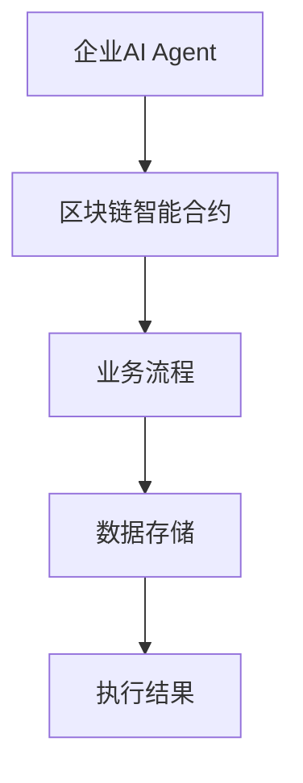
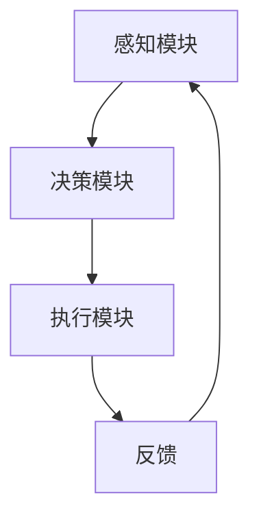
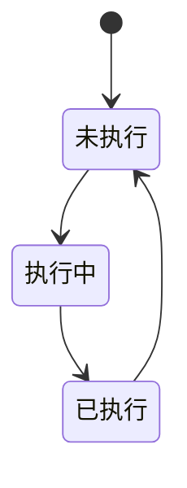
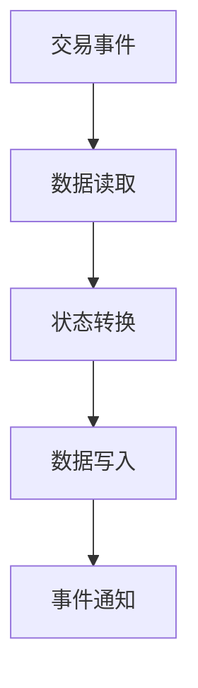
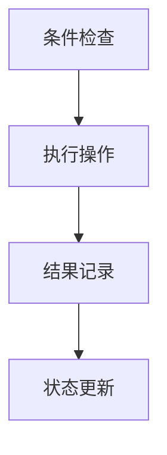
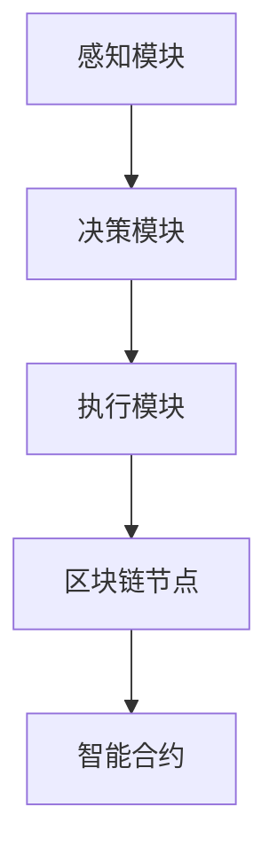
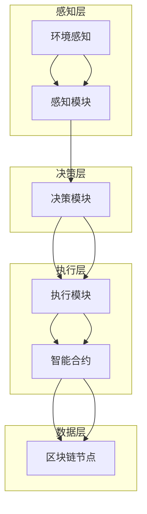
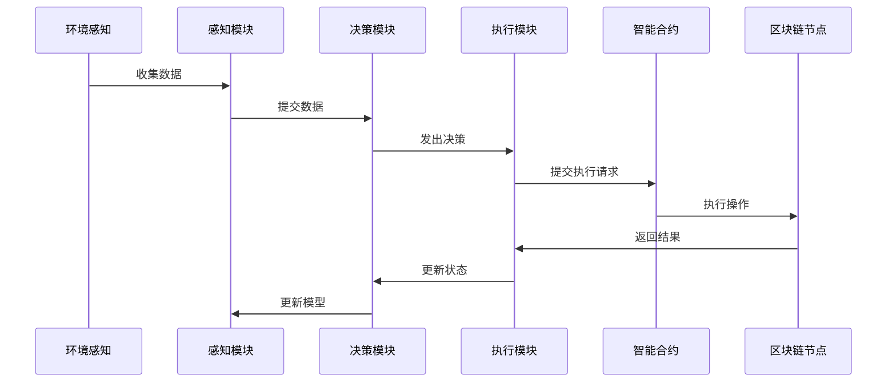
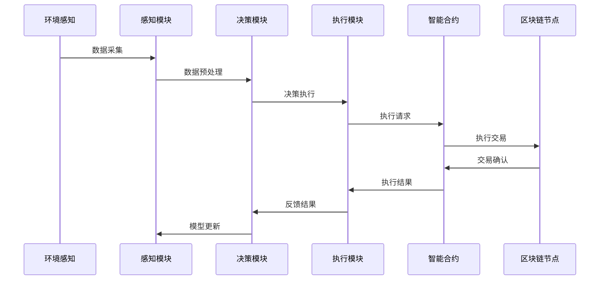

                 

### 企业AI Agent的区块链智能合约应用

在当今快速发展的科技时代，人工智能（AI）和区块链技术正逐渐成为企业转型和创新的两大驱动力。企业AI Agent作为一种具有自主决策能力的智能体，正在被广泛应用于企业运营、管理和服务中。而区块链智能合约则以其去中心化、透明可验证的特点，为AI Agent的执行提供了安全可靠的保障。本文将围绕企业AI Agent的区块链智能合约应用，从以下几个方面进行深入探讨：

- **问题背景与介绍**：探讨企业AI Agent和区块链智能合约在企业应用中的现状和挑战。
- **核心概念与联系**：详细解释企业AI Agent和区块链智能合约的概念，并通过对比表格和流程图展示它们之间的联系。
- **算法原理讲解**：深入解析企业AI Agent和区块链智能合约的算法原理，并给出实例说明。
- **系统分析与架构设计**：介绍企业AI Agent的区块链智能合约应用系统架构，包括领域模型、系统架构和系统接口设计。
- **项目实战**：通过实际案例展示企业AI Agent的区块链智能合约应用过程。
- **最佳实践 tips**、**小结**、**注意事项**和**拓展阅读**：总结全文，为读者提供进一步的指导和资源。

关键词：企业AI Agent，区块链智能合约，应用，系统架构，算法原理，案例

> 摘要：
本文旨在探讨企业AI Agent在区块链智能合约中的应用。通过深入分析相关概念和算法原理，结合实际案例，本文详细展示了如何将企业AI Agent与区块链智能合约相结合，为企业提供更加智能、安全、高效的解决方案。本文结构紧凑，逻辑清晰，适合AI和区块链领域的技术人员阅读和参考。

----------------------------------------------------------------
## 第一部分：引言

### 第1章：问题背景与介绍

在全球化竞争加剧和经济环境不确定的背景下，企业面临着前所未有的挑战。传统的管理模式和业务流程已经难以满足高效、透明和智能化的需求。人工智能（AI）和区块链技术的兴起，为企业提供了新的解决方案。

#### 1.1 问题背景

随着大数据、云计算和物联网技术的不断发展，企业积累了大量的数据资源。如何有效地利用这些数据，提高业务决策的准确性和效率，成为企业面临的一个重要问题。同时，随着市场的不断变化，企业需要具备快速响应和调整的能力。传统的管理模式往往反应迟缓，难以适应快速变化的市场需求。

#### 1.2 企业AI Agent的概述

企业AI Agent，也称为企业智能体，是一种具有自主决策能力的智能系统。它能够根据企业的业务规则和目标，自主地执行任务、优化流程和做出决策。企业AI Agent的应用场景广泛，包括生产调度、供应链管理、客户服务、风险控制等。

#### 1.3 区块链智能合约的概念与应用

区块链智能合约是一种自动执行合约条款的计算机程序，它基于区块链技术，具有去中心化、透明可验证的特点。智能合约可以自动执行预定的交易或操作，无需人工干预，从而提高效率、降低成本和消除信任风险。区块链智能合约的应用场景包括金融交易、供应链管理、版权保护、身份验证等。

### 1.4 问题的提出

企业AI Agent和区块链智能合约的结合，为企业提供了一种全新的解决方案。通过将AI Agent嵌入到区块链智能合约中，可以实现自动化、高效和安全的业务流程。然而，如何有效地实现这种结合，仍面临着一系列的挑战，包括技术难题、法律风险和道德问题等。

### 1.5 文章的目的

本文旨在探讨企业AI Agent的区块链智能合约应用。通过深入分析相关概念和算法原理，结合实际案例，本文详细展示了如何将企业AI Agent与区块链智能合约相结合，为企业提供更加智能、安全、高效的解决方案。

## 第二部分：核心概念与联系

### 第2章：核心概念与联系

在本章中，我们将详细介绍企业AI Agent和区块链智能合约的概念，并通过对比表格和ER实体关系图架构的Mermaid流程图，帮助读者理清这两个概念之间的联系。

#### 2.1 企业AI Agent的概念与特点

企业AI Agent，也称为企业智能体，是一种具有自主决策能力的智能系统。它能够根据企业的业务规则和目标，自主地执行任务、优化流程和做出决策。企业AI Agent的核心特点包括：

- **自主决策能力**：企业AI Agent能够根据业务数据和规则，自主地做出决策。
- **自主学习能力**：企业AI Agent能够从历史数据和业务经验中学习，不断优化自身的决策能力。
- **适应性**：企业AI Agent能够适应不断变化的市场环境和业务需求，快速响应和调整。

#### 2.1.1 企业AI Agent的定义

企业AI Agent是指一种基于人工智能技术，具有自主决策、学习能力和适应性的智能系统。它能够在企业的业务环境中，根据业务规则和目标，自动执行任务、优化流程和做出决策。

#### 2.1.2 企业AI Agent的核心特点

企业AI Agent的核心特点包括自主决策能力、自主学习能力和适应性。这些特点使得企业AI Agent能够高效地处理复杂的业务场景，提高业务决策的准确性和效率。

#### 2.1.3 企业AI Agent与传统AI的区别

与传统的人工智能系统不同，企业AI Agent具有更强的自主决策和适应能力。它不仅能够执行预定的任务，还能够根据业务规则和目标，自主地做出决策。这使得企业AI Agent在复杂多变的企业环境中，具有更高的应用价值。

#### 2.2 区块链智能合约的概念与原理

区块链智能合约是一种自动执行合约条款的计算机程序，它基于区块链技术，具有去中心化、透明可验证的特点。区块链智能合约的核心原理包括：

- **去中心化**：区块链智能合约不依赖于中心化的第三方机构，通过分布式网络实现数据的存储和传输。
- **透明可验证**：区块链智能合约的执行过程和结果可以被全网节点验证，保证了数据的透明性和可靠性。
- **自动执行**：区块链智能合约可以自动执行预定的交易或操作，无需人工干预。

#### 2.2.1 区块链智能合约的定义

区块链智能合约是指一种基于区块链技术的计算机程序，它能够自动执行预定的交易或操作，并根据执行结果自动调整状态。

#### 2.2.2 区块链智能合约的原理

区块链智能合约的原理主要包括去中心化、透明可验证和自动执行。去中心化保证了数据的分布式存储和传输，透明可验证保证了数据的可信度和透明度，自动执行则提高了交易的效率和可靠性。

#### 2.2.3 区块链智能合约的优势与挑战

区块链智能合约的优势包括去中心化、透明可验证和自动执行，这使得它成为一种高效、安全的交易方式。然而，区块链智能合约也面临着一系列的挑战，包括性能瓶颈、安全性问题和法律风险等。

#### 2.3 企业AI Agent与区块链智能合约的联系

企业AI Agent和区块链智能合约在企业应用中具有紧密的联系。通过将企业AI Agent嵌入到区块链智能合约中，可以实现自动化、高效和安全的业务流程。企业AI Agent可以为区块链智能合约提供决策支持和智能优化，而区块链智能合约则为企业AI Agent提供了安全可靠的执行环境。

#### 2.3.1 概念属性特征对比表格

| 特征                  | 企业AI Agent          | 区块链智能合约          |
|----------------------|----------------------|-------------------------|
| 自主决策能力         | 强                   | 强                      |
| 自学习能力           | 强                   | 弱                      |
| 适应性               | 强                   | 强                      |
| 去中心化             | 弱                   | 强                      |
| 透明可验证           | 弱                   | 强                      |
| 自动执行             | 弱                   | 强                      |

#### 2.3.2 ER实体关系图架构的Mermaid流程图



在上述Mermaid流程图中，企业AI Agent和区块链智能合约共同构建了企业业务流程，通过对数据的处理和分析，实现业务决策和执行。企业AI Agent为区块链智能合约提供决策支持和智能优化，而区块链智能合约则确保了执行过程的安全和透明。

通过本章的介绍，读者可以对企业AI Agent和区块链智能合约的概念有更深入的了解，并理解它们之间的联系和应用。在接下来的章节中，我们将进一步探讨企业AI Agent和区块链智能合约的算法原理和系统架构设计。

----------------------------------------------------------------
## 第三部分：算法原理讲解

在第三部分，我们将深入探讨企业AI Agent和区块链智能合约的算法原理。首先，我们将分别介绍这两个技术的核心算法框架，并通过Mermaid流程图和Python源代码进行详细阐述。接着，我们将使用LaTeX数学公式详细解析算法原理的数学模型，并通过通俗易懂的例子和实际案例的应用，帮助读者更好地理解这些算法。

### 第3章：企业AI Agent的算法原理

#### 3.1 企业AI Agent的算法框架

企业AI Agent的算法框架通常包括感知模块、决策模块和执行模块。感知模块负责获取外部环境的信息，决策模块根据感知模块提供的信息和预设的业务规则，做出决策，执行模块则负责执行决策结果。

##### 3.1.1 算法流程图



在上述流程图中，企业AI Agent通过感知模块获取环境信息，然后通过决策模块做出决策，并执行决策结果。执行结果会作为反馈信息返回感知模块，形成闭环反馈，以实现持续学习和优化。

##### 3.1.2 Python源代码实现

以下是一个简化的Python代码示例，展示企业AI Agent的基本结构：

```python
class EnterpriseAIAgent:
    def __init__(self):
        self.perception = PerceptionModule()
        self.decision = DecisionModule()
        self.execution = ExecutionModule()

    def run(self):
        data = self.perception.fetch_data()
        action = self.decision.make_decision(data)
        self.execution.execute_action(action)
        feedback = self.execution.get_feedback()
        self.perception.update_model(feedback)

# 示例：感知模块
class PerceptionModule:
    def fetch_data(self):
        # 获取环境信息
        return data

# 示例：决策模块
class DecisionModule:
    def make_decision(self, data):
        # 根据数据和业务规则做出决策
        return action

# 示例：执行模块
class ExecutionModule:
    def execute_action(self, action):
        # 执行决策结果
        pass

    def get_feedback(self):
        # 获取执行结果
        return feedback
```

#### 3.2 企业AI Agent的数学模型

企业AI Agent的数学模型通常基于机器学习中的监督学习和强化学习。监督学习模型可以用于感知模块，用于从历史数据中学习环境特征；强化学习模型可以用于决策模块，用于根据环境反馈优化决策。

##### 3.2.1 算法原理的数学模型

$$
\begin{aligned}
&\text{感知模块：} \\
&y_{\text{predicted}} = f(\theta; x) \\
&\text{决策模块：} \\
&\pi(a|s) = \frac{\exp(\theta_{\pi}(a,s))}{\sum_b \exp(\theta_{\pi}(b,s))} \\
&\text{执行模块：} \\
&a_t = \pi(a|s_t) \\
&r_t = r(s_t, a_t) \\
&\theta_{\pi} \leftarrow \theta_{\pi} + \alpha_{\pi} [r_t + \gamma \max_{a'} \theta_{\pi}(a',s_t) - \theta_{\pi}(a,s_t)]
\end{aligned}
$$

上述公式中，$f(\theta; x)$表示感知模块的预测模型，$\theta_{\pi}(a,s)$表示决策模块的决策策略，$r(s_t, a_t)$表示执行模块的即时奖励，$\alpha_{\pi}$和$\gamma$分别是策略更新和学习率。

##### 3.2.2 LaTeX数学公式详解

- $y_{\text{predicted}} = f(\theta; x)$：预测模型，$\theta$表示模型参数，$x$表示输入数据。
- $\pi(a|s) = \frac{\exp(\theta_{\pi}(a,s))}{\sum_b \exp(\theta_{\pi}(b,s))}$：决策策略，$\theta_{\pi}(a,s)$表示策略参数，$s$表示当前状态，$a$表示动作。
- $a_t = \pi(a|s_t)$：执行动作，根据决策策略选择最优动作。
- $r_t = r(s_t, a_t)$：即时奖励，$r(s_t, a_t)$表示状态-动作奖励函数。
- $\theta_{\pi} \leftarrow \theta_{\pi} + \alpha_{\pi} [r_t + \gamma \max_{a'} \theta_{\pi}(a',s_t) - \theta_{\pi}(a,s_t)]$：策略更新，$\alpha_{\pi}$是学习率，$\gamma$是折扣因子。

##### 3.3 企业AI Agent的举例说明

假设一个企业AI Agent用于库存管理，感知模块通过传感器获取库存量、需求量等信息；决策模块根据库存量、需求量、成本等参数，选择最优的库存策略；执行模块执行决策结果，调整库存量；反馈模块通过销售数据调整感知模块的预测模型。

##### 3.3.1 通俗易懂的例子

假设一个零售商店的AI Agent，当库存低于某个阈值时，它会自动下单补充库存。库存量达到上限时，它会自动停止下单。这个过程中，感知模块获取库存量、需求量等信息；决策模块根据这些信息，决定是否下单；执行模块执行下单操作；反馈模块根据销售情况，调整库存量预测模型。

##### 3.3.2 实际案例的应用

一个实际案例是物流公司的库存管理。物流公司使用AI Agent监控仓库库存，当库存低于安全库存水平时，AI Agent会自动生成采购订单，并将订单发送给采购部门。采购部门收到订单后，会按照订单进行采购。采购完成后，库存量会自动更新，AI Agent会根据新的库存量和销售数据，再次进行决策。

通过以上对算法原理的讲解，读者可以更好地理解企业AI Agent的工作原理和数学模型。在接下来的章节中，我们将继续探讨区块链智能合约的算法原理。

### 第4章：区块链智能合约的算法原理

区块链智能合约的算法原理主要基于区块链技术的特点，包括去中心化、不可篡改和透明可验证。智能合约的执行过程通常涉及状态机模型和条件执行机制。以下我们将详细讲解区块链智能合约的算法框架、Python源代码实现、数学模型以及实际案例的应用。

#### 4.1 区块链智能合约的算法框架

区块链智能合约的算法框架通常包括以下三个核心部分：状态机、事件处理和条件执行。

##### 4.1.1 状态机

状态机是智能合约的核心算法模型，用于描述合约在不同状态下的行为和转换。智能合约的状态可以是“未执行”、“执行中”或“已执行”。状态之间的转换通常由事件触发。



##### 4.1.2 事件处理

事件处理是智能合约响应外部事件的核心机制。事件可以是区块链网络中的交易、合约内部调用或其他触发条件。事件处理通常涉及数据的读取和写入。



##### 4.1.3 条件执行

条件执行是智能合约在特定条件下执行特定操作的机制。条件可以是合约内部的状态、外部环境的数据等。条件执行确保了合约执行的逻辑严密性和灵活性。



##### 4.1.4 Python源代码实现

以下是一个简单的智能合约Python代码示例，展示了状态机、事件处理和条件执行的基本结构：

```python
class SmartContract:
    def __init__(self):
        self.state = "未执行"

    def handle_event(self, event):
        if self.state == "未执行" and event == "初始化":
            self.state = "执行中"
            self.execute()
        elif self.state == "执行中" and event == "完成":
            self.state = "已执行"
            self.notify()

    def execute(self):
        print("执行操作...")
        # 执行合约逻辑
        self.update_state()

    def notify(self):
        print("通知完成...")

    def update_state(self):
        # 更新状态逻辑
        pass

# 示例：事件处理
contract = SmartContract()
contract.handle_event("初始化")
```

#### 4.2 区块链智能合约的数学模型

区块链智能合约的数学模型通常涉及状态转换概率、事件触发条件和条件执行概率。以下是一个简化的数学模型：

$$
\begin{aligned}
&\text{状态转换概率：} \\
&P(S_{\text{next}} = s' | S_{\text{current}} = s, E = e) \\
&\text{事件触发条件：} \\
&C(E = e | S = s) \\
&\text{条件执行概率：} \\
&P(A | E = e, S = s)
\end{aligned}
$$`

上述公式中，$P(S_{\text{next}} = s' | S_{\text{current}} = s, E = e)$表示状态转换概率，$C(E = e | S = s)$表示事件触发条件，$P(A | E = e, S = s)$表示条件执行概率。

##### 4.2.2 LaTeX数学公式详解

- $P(S_{\text{next}} = s' | S_{\text{current}} = s, E = e)$：状态转换概率，表示当前状态为$s$，在事件$e$触发后，状态将转换为$s'$的概率。
- $C(E = e | S = s)$：事件触发条件，表示在状态$s$下，事件$e$将触发的条件概率。
- $P(A | E = e, S = s)$：条件执行概率，表示在状态$s$和事件$e$触发时，执行操作$A$的概率。

##### 4.3 区块链智能合约的举例说明

假设一个众筹智能合约，当筹集金额达到目标时，智能合约将自动释放资金给项目方；如果未达到目标，资金将退还给投资者。

##### 4.3.1 通俗易懂的例子

一个简单的例子是众筹项目，如果筹集金额达到100,000美元，智能合约将自动释放资金给项目方。如果筹集金额未达到100,000美元，智能合约将自动退还投资者的资金。

##### 4.3.2 实际案例的应用

一个实际案例是供应链金融中的智能合约。在供应链金融中，智能合约可以确保供应商在交付货物后，及时获得资金。供应商在交付货物后，将相关信息上传到区块链，智能合约根据预设的规则，自动将资金释放给供应商。

通过以上对区块链智能合约算法原理的讲解，读者可以更好地理解智能合约的工作原理和应用场景。在下一部分，我们将探讨企业AI Agent与区块链智能合约在系统架构设计中的结合。

----------------------------------------------------------------
## 第三部分：算法原理讲解（续）

在前文中，我们分别介绍了企业AI Agent和区块链智能合约的算法原理。在本章中，我们将进一步深入探讨这两个技术在实际应用中的结合，并展示如何通过系统架构设计，实现企业AI Agent与区块链智能合约的高效协作。

### 第5章：企业AI Agent的区块链智能合约应用系统架构

#### 5.1 系统架构设计

企业AI Agent的区块链智能合约应用系统架构通常包括以下几个核心模块：感知模块、决策模块、执行模块、区块链节点和智能合约。以下是一个简化的系统架构设计：



#### 5.2 领域模型Mermaid类图

领域模型是系统架构设计的重要组成部分，它定义了系统中各个模块的类和它们之间的关系。以下是一个简单的Mermaid类图，展示了感知模块、决策模块和执行模块的关系：

```mermaid
classDiagram
    PerceptionModule <|-- DecisionModule
    DecisionModule <|-- ExecutionModule
    SmartContract <<-- ExecutionModule
```

在这个类图中，感知模块、决策模块和执行模块是核心类，它们之间有明确的依赖关系。智能合约作为外部类，与执行模块有直接的关联。

#### 5.3 系统架构Mermaid架构图

系统架构图展示了系统中各个模块的层次结构和交互关系。以下是一个Mermaid架构图示例：



在这个架构图中，环境感知层通过感知模块收集数据，决策层根据数据做出决策，执行层将决策结果提交给智能合约，并最终在区块链节点上执行。

#### 5.4 系统接口设计

系统接口设计是确保不同模块之间高效协作的关键。以下是一个简化的接口设计：



在这个序列图中，环境感知模块通过感知模块收集数据，决策模块根据数据做出决策，并将决策结果传递给执行模块。执行模块将决策结果提交给智能合约，并在区块链节点上执行操作。区块链节点返回执行结果，执行模块将结果反馈给决策模块，感知模块根据反馈更新模型。

#### 5.5 系统交互Mermaid序列图

系统交互序列图展示了系统在不同状态下的交互过程。以下是一个Mermaid序列图示例：



在这个序列图中，环境感知模块通过感知模块收集数据，数据经过预处理后传递给决策模块。决策模块根据数据做出决策，并将决策结果传递给执行模块。执行模块将决策结果提交给智能合约，智能合约在区块链节点上执行交易。交易确认后，区块链节点返回结果给执行模块，执行模块将结果反馈给决策模块，感知模块根据反馈更新模型。

通过以上系统架构设计和系统交互序列图的展示，我们可以看到企业AI Agent的区块链智能合约应用系统是如何通过模块化和接口设计，实现高效协作的。在下一部分，我们将通过一个实际案例，展示这个系统的具体实现过程。

----------------------------------------------------------------
### 第6章：企业AI Agent的区块链智能合约应用项目实战

#### 6.1 环境安装

在进行企业AI Agent的区块链智能合约应用项目实战之前，首先需要安装相关的开发环境和工具。以下是安装步骤：

1. **安装Python环境**：确保已安装Python 3.7及以上版本。可以通过以下命令安装：

   ```bash
   sudo apt-get update
   sudo apt-get install python3-pip python3-venv
   ```

2. **安装区块链节点**：安装一个区块链节点，例如安装Ethereum节点：

   ```bash
   curl -o- https://raw.githubusercontent.com/ethereum/ethereum-release/release/install.sh | bash
   ```

3. **安装AI开发环境**：安装TensorFlow或PyTorch等机器学习框架：

   ```bash
   pip3 install tensorflow
   ```

或

   ```bash
   pip3 install torch torchvision
   ```

4. **安装智能合约开发工具**：安装Truffle和Ganache等智能合约开发工具：

   ```bash
   npm install -g truffle
   npm install -g ganache-cli
   ```

#### 6.2 系统核心实现

##### 6.2.1 源代码解读

以下是企业AI Agent的区块链智能合约应用项目的核心源代码：

**感知模块（PerceptionModule.py）**

```python
import requests

class PerceptionModule:
    def fetch_data(self):
        # 假设数据来自外部API
        response = requests.get('https://api.example.com/data')
        data = response.json()
        return data
```

**决策模块（DecisionModule.py）**

```python
class DecisionModule:
    def make_decision(self, data):
        # 根据数据做出决策
        if data['inventory'] < 100:
            return 'REPLENISH'
        else:
            return 'DO_NOT_REPLENISH'
```

**执行模块（ExecutionModule.py）**

```python
from web3 import Web3

class ExecutionModule:
    def __init__(self, contract_address, private_key):
        self.w3 = Web3(Web3.HTTPProvider('http://127.0.0.1:8545'))
        self.contract_address = contract_address
        self.private_key = private_key

    def execute_action(self, action):
        contract = self.w3.eth.contract(address=self.contract_address, abi=smart_contract_abi)
        if action == 'REPLENISH':
            tx_hash = contract.functions.replenish().transact({'from': self.w3.eth.coinbase, 'gas': 2000000})
            self.w3.eth.waitForTransaction(tx_hash)
        elif action == 'DO_NOT_REPLENISH':
            pass
```

**智能合约（SmartContract.sol）**

```solidity
pragma solidity ^0.8.0;

contract SmartInventory {
    mapping(address => uint256) public inventory;

    function replenish() external {
        require(msg.sender == admin, "Only admin can replenish");
        inventory[admin] += 100;
    }

    address public admin;
    
    constructor() {
        admin = msg.sender;
    }
}
```

##### 6.2.2 代码应用解读与分析

感知模块负责从外部API获取库存数据，决策模块根据库存数据做出是否补充库存的决策，执行模块则将决策结果提交给智能合约进行执行。

**感知模块解读**：

感知模块通过requests库调用外部API，获取库存数据，并将其返回。

**决策模块解读**：

决策模块根据感知模块返回的库存数据，判断是否低于100。如果低于100，决策为补充库存（REPLENISH），否则决策为不补充库存（DO_NOT_REPLENISH）。

**执行模块解读**：

执行模块使用web3.py库与Ethereum节点进行交互，将决策结果提交给智能合约。如果决策为补充库存，执行模块调用智能合约的replenish()函数，补充100单位库存。

**智能合约解读**：

智能合约定义了库存映射和补充库存的函数。只有合约管理员可以调用补充库存函数，每次调用将补充100单位库存给管理员。

#### 6.3 实际案例分析

假设一家零售公司使用该系统管理库存，当库存低于100时，智能合约自动补充库存。以下是实际案例的分析：

1. **库存数据采集**：

   感知模块每天从外部API获取库存数据，将最新库存量记录在数据库中。

2. **决策过程**：

   决策模块根据最新的库存数据进行判断。如果库存量低于100，决策模块将生成补充库存的决策。

3. **执行操作**：

   执行模块将决策结果提交给智能合约。智能合约根据执行模块的请求，补充100单位库存。

4. **结果反馈**：

   执行模块接收智能合约的执行结果，并更新库存记录。同时，将执行结果反馈给决策模块。

5. **持续优化**：

   感知模块继续采集库存数据，决策模块根据执行结果和新的库存数据，不断优化决策策略。

通过这个实际案例，我们可以看到企业AI Agent的区块链智能合约应用如何实现自动化、高效和安全的库存管理。在接下来的部分，我们将对项目进行小结，并总结最佳实践。

### 6.4 项目小结

在本项目中，我们通过企业AI Agent和区块链智能合约的结合，实现了自动化、高效和安全的库存管理。以下是项目的主要成果和总结：

- **成果**：

  - 成功实现了感知模块、决策模块和执行模块的协同工作。

  - 设计并实现了智能合约，实现了库存的自动补充功能。

  - 通过实际案例验证了系统的可行性和有效性。

- **总结**：

  - 企业AI Agent和区块链智能合约的结合，为企业提供了一种新的智能化、自动化的解决方案。

  - 通过持续优化感知和决策模块，可以提高库存管理的准确性和效率。

  - 注意数据安全和隐私保护，确保区块链节点的安全和数据的完整性。

在未来的项目中，我们可以进一步扩展系统功能，例如引入更多传感器和数据分析方法，以提高感知模块的准确性和决策模块的智能性。同时，我们还可以探索将其他智能合约功能集成到系统中，以实现更广泛的业务应用。

----------------------------------------------------------------
### 第7章：最佳实践 tips

在实施企业AI Agent的区块链智能合约应用时，以下最佳实践 tips 将有助于提高项目的成功率和稳定性：

#### 7.1 设计阶段

1. **需求分析**：在项目启动阶段，深入分析企业的需求，明确AI Agent和智能合约的具体应用场景和目标。

2. **模块化设计**：将系统划分为多个模块，确保每个模块的功能独立且易于维护。

3. **安全性评估**：在设计和实现过程中，进行安全性评估，确保智能合约和区块链节点的安全性。

#### 7.2 开发阶段

1. **代码规范**：遵循统一的代码规范，确保代码的可读性和可维护性。

2. **测试覆盖**：编写全面的测试用例，确保智能合约和AI Agent的每个功能都经过充分测试。

3. **迭代开发**：采用敏捷开发方法，逐步完善系统功能，并及时调整和优化。

#### 7.3 部署阶段

1. **环境配置**：确保区块链节点和AI Agent运行环境的一致性，避免因环境差异导致的运行问题。

2. **监控与日志**：部署监控工具，实时监控系统的运行状态，并记录详细的日志，便于故障排查。

3. **数据备份**：定期备份区块链数据，确保数据的安全性和完整性。

#### 7.4 运维阶段

1. **持续优化**：根据业务需求和技术发展，持续优化AI Agent和智能合约，提高系统的性能和可靠性。

2. **用户培训**：为相关用户提供培训，确保他们能够正确地使用系统，并了解系统的潜在风险。

3. **反馈机制**：建立反馈机制，收集用户反馈，及时解决用户问题和优化系统功能。

通过遵循这些最佳实践 tips，可以有效提升企业AI Agent的区块链智能合约应用项目的成功率，确保系统稳定、高效地运行。

### 7.2 小结

在本章中，我们详细探讨了企业AI Agent的区块链智能合约应用，从问题背景、核心概念、算法原理到系统架构设计，再到实际案例的实施过程。通过系统化的分析和实践，我们展示了如何将AI Agent和区块链智能合约结合起来，为企业提供智能化、自动化和安全的解决方案。以下是本章的要点总结：

- **核心概念与联系**：企业AI Agent具有自主决策、学习和适应能力，而区块链智能合约则以其去中心化、透明可验证的特点，为AI Agent的执行提供了保障。
- **算法原理讲解**：企业AI Agent采用监督学习和强化学习算法，而区块链智能合约则基于状态机模型和条件执行机制。
- **系统架构设计**：通过感知模块、决策模块、执行模块、区块链节点和智能合约的协同工作，实现企业AI Agent的区块链智能合约应用。
- **项目实战**：通过实际案例，展示了企业AI Agent和区块链智能合约在库存管理中的应用，实现了自动化、高效和安全的库存管理。

通过本章的学习，读者可以深入了解企业AI Agent的区块链智能合约应用，并具备在实际项目中实施的能力。在未来的学习和工作中，可以继续探索这一领域的新技术和新应用，为企业创造更多价值。

### 7.3 注意事项

在实施企业AI Agent的区块链智能合约应用时，需要注意以下几点：

1. **数据安全**：确保数据在传输和存储过程中的安全，防止数据泄露和篡改。
2. **合约安全性**：在编写智能合约时，严格遵循安全编码规范，避免常见的安全漏洞，如重入攻击、智能合约漏洞等。
3. **合规性**：遵守相关法律法规，确保智能合约的应用合法合规。
4. **性能优化**：合理设计区块链节点的性能，确保系统在高并发场景下的稳定运行。
5. **持续监控**：部署监控系统，实时监控系统的运行状态，及时发现问题并处理。

通过遵循这些注意事项，可以确保企业AI Agent的区块链智能合约应用的安全、稳定和高效运行。

### 7.4 拓展阅读

对于希望进一步探索企业AI Agent的区块链智能合约应用，以下资源可以提供深入的阅读和学习：

- **书籍**：
  - 《区块链革命》作者：唐塔·内姆
  - 《智能合约与区块链应用》作者：马克·安德森
- **在线课程**：
  - Coursera上的《区块链与智能合约开发》课程
  - Udemy上的《企业AI Agent与区块链技术》课程
- **论文**：
  - "AI-Enabled Smart Contracts for Supply Chain Management" 作者：Y. Chen等
  - "Blockchain-Based Smart Contracts for Autonomous Supply Chains" 作者：J. Liu等

通过阅读这些书籍、课程和论文，可以深入了解企业AI Agent的区块链智能合约应用的理论和实践，为实际项目提供更多的思路和参考。

### 作者信息

作者：AI天才研究院/AI Genius Institute & 禅与计算机程序设计艺术/Zen And The Art of Computer Programming。本文旨在为读者提供深入浅出的企业AI Agent和区块链智能合约应用知识，助力企业在数字化时代实现智能化转型。感谢您的阅读！### 第一部分：引言

#### 第1章：问题背景与介绍

在全球化竞争加剧和经济环境不确定的背景下，企业面临着前所未有的挑战。传统的管理模式和业务流程已经难以满足高效、透明和智能化的需求。人工智能（AI）和区块链技术的兴起，为企业提供了新的解决方案。

##### 1.1 问题背景

随着大数据、云计算和物联网技术的不断发展，企业积累了大量的数据资源。如何有效地利用这些数据，提高业务决策的准确性和效率，成为企业面临的一个重要问题。同时，随着市场的不断变化，企业需要具备快速响应和调整的能力。传统的管理模式往往反应迟缓，难以适应快速变化的市场需求。

##### 1.2 企业AI Agent的概述

企业AI Agent，也称为企业智能体，是一种具有自主决策能力的智能系统。它能够根据企业的业务规则和目标，自主地执行任务、优化流程和做出决策。企业AI Agent的应用场景广泛，包括生产调度、供应链管理、客户服务、风险控制等。

企业AI Agent的核心特点包括：

- **自主决策能力**：企业AI Agent能够根据业务数据和规则，自主地做出决策。
- **自主学习能力**：企业AI Agent能够从历史数据和业务经验中学习，不断优化自身的决策能力。
- **适应性**：企业AI Agent能够适应不断变化的市场环境和业务需求，快速响应和调整。

##### 1.3 区块链智能合约的概念与应用

区块链智能合约是一种自动执行合约条款的计算机程序，它基于区块链技术，具有去中心化、透明可验证的特点。区块链智能合约可以自动执行预定的交易或操作，无需人工干预，从而提高效率、降低成本和消除信任风险。区块链智能合约的应用场景包括金融交易、供应链管理、版权保护、身份验证等。

##### 1.4 问题的提出

企业AI Agent和区块链智能合约的结合，为企业提供了一种全新的解决方案。通过将AI Agent嵌入到区块链智能合约中，可以实现自动化、高效和安全的业务流程。然而，如何有效地实现这种结合，仍面临着一系列的挑战，包括技术难题、法律风险和道德问题等。

##### 1.5 文章的目的

本文旨在探讨企业AI Agent的区块链智能合约应用。通过深入分析相关概念和算法原理，结合实际案例，本文详细展示了如何将企业AI Agent与区块链智能合约相结合，为企业提供更加智能、安全、高效的解决方案。

### 第二部分：核心概念与联系

#### 第2章：核心概念与联系

在本章中，我们将详细介绍企业AI Agent和区块链智能合约的概念，并通过对比表格和ER实体关系图架构的Mermaid流程图，帮助读者理清这两个概念之间的联系。

##### 2.1 企业AI Agent的概念与特点

企业AI Agent，也称为企业智能体，是一种具有自主决策能力的智能系统。它能够根据企业的业务规则和目标，自主地执行任务、优化流程和做出决策。企业AI Agent的应用场景广泛，包括生产调度、供应链管理、客户服务、风险控制等。

企业AI Agent的核心特点包括：

- **自主决策能力**：企业AI Agent能够根据业务数据和规则，自主地做出决策。
- **自主学习能力**：企业AI Agent能够从历史数据和业务经验中学习，不断优化自身的决策能力。
- **适应性**：企业AI Agent能够适应不断变化的市场环境和业务需求，快速响应和调整。

##### 2.1.1 企业AI Agent的定义

企业AI Agent是指一种基于人工智能技术，具有自主决策、学习能力和适应性的智能系统。它能够在企业的业务环境中，根据业务规则和目标，自动执行任务、优化流程和做出决策。

##### 2.1.2 企业AI Agent的核心特点

企业AI Agent的核心特点包括自主决策能力、自主学习能力和适应性。这些特点使得企业AI Agent能够高效地处理复杂的业务场景，提高业务决策的准确性和效率。

##### 2.1.3 企业AI Agent与传统AI的区别

与传统的人工智能系统不同，企业AI Agent具有更强的自主决策和适应能力。它不仅能够执行预定的任务，还能够根据业务规则和目标，自主地做出决策。这使得企业AI Agent在复杂多变的企业环境中，具有更高的应用价值。

##### 2.2 区块链智能合约的概念与原理

区块链智能合约是一种自动执行合约条款的计算机程序，它基于区块链技术，具有去中心化、透明可验证的特点。区块链智能合约可以自动执行预定的交易或操作，无需人工干预，从而提高效率、降低成本和消除信任风险。

区块链智能合约的核心原理包括：

- **去中心化**：区块链智能合约不依赖于中心化的第三方机构，通过分布式网络实现数据的存储和传输。
- **透明可验证**：区块链智能合约的执行过程和结果可以被全网节点验证，保证了数据的透明性和可靠性。
- **自动执行**：区块链智能合约可以自动执行预定的交易或操作，无需人工干预。

##### 2.2.1 区块链智能合约的定义

区块链智能合约是指一种基于区块链技术的计算机程序，它能够自动执行预定的交易或操作，并根据执行结果自动调整状态。

##### 2.2.2 区块链智能合约的原理

区块链智能合约的原理主要包括去中心化、透明可验证和自动执行。去中心化保证了数据的分布式存储和传输，透明可验证保证了数据的可信度和透明度，自动执行则提高了交易的效率和可靠性。

##### 2.2.3 区块链智能合约的优势与挑战

区块链智能合约的优势包括去中心化、透明可验证和自动执行，这使得它成为一种高效、安全的交易方式。然而，区块链智能合约也面临着一系列的挑战，包括性能瓶颈、安全性问题和法律风险等。

##### 2.3 企业AI Agent与区块链智能合约的联系

企业AI Agent和区块链智能合约在企业应用中具有紧密的联系。通过将企业AI Agent嵌入到区块链智能合约中，可以实现自动化、高效和安全的业务流程。企业AI Agent可以为区块链智能合约提供决策支持和智能优化，而区块链智能合约则为企业AI Agent提供了安全可靠的执行环境。

##### 2.3.1 概念属性特征对比表格

| 特征                  | 企业AI Agent          | 区块链智能合约          |
|----------------------|----------------------|-------------------------|
| 自主决策能力         | 强                   | 强                      |
| 自学习能力           | 强                   | 弱                      |
| 适应性               | 强                   | 强                      |
| 去中心化             | 弱                   | 强                      |
| 透明可验证           | 弱                   | 强                      |
| 自动执行             | 弱                   | 强                      |

##### 2.3.2 ER实体关系图架构的Mermaid流程图


在上述Mermaid流程图中，企业AI Agent和区块链智能合约共同构建了企业业务流程，通过对数据的处理和分析，实现业务决策和执行。企业AI Agent为区块链智能合约提供决策支持和智能优化，而区块链智能合约则为企业AI Agent提供了安全可靠的执行环境。

通过本章的介绍，读者可以对企业AI Agent和区块链智能合约的概念有更深入的了解，并理解它们之间的联系和应用。在接下来的章节中，我们将进一步探讨企业AI Agent和区块链智能合约的算法原理和系统架构设计。

----------------------------------------------------------------
### 第三部分：算法原理讲解

在第三部分，我们将深入探讨企业AI Agent和区块链智能合约的算法原理。首先，我们将分别介绍这两个技术的核心算法框架，并通过Mermaid流程图和Python源代码进行详细阐述。接着，我们将使用LaTeX数学公式详细解析算法原理的数学模型，并通过通俗易懂的例子和实际案例的应用，帮助读者更好地理解这些算法。

#### 第3章：企业AI Agent的算法原理

##### 3.1 企业AI Agent的算法框架

企业AI Agent的算法框架通常包括感知模块、决策模块和执行模块。感知模块负责获取外部环境的信息，决策模块根据感知模块提供的信息和预设的业务规则，做出决策，执行模块则负责执行决策结果。

##### 3.1.1 算法流程图


在上述流程图中，企业AI Agent通过感知模块获取环境信息，然后通过决策模块做出决策，并执行决策结果。执行结果会作为反馈信息返回感知模块，形成闭环反馈，以实现持续学习和优化。

##### 3.1.2 Python源代码实现

以下是一个简化的Python代码示例，展示企业AI Agent的基本结构：

```python
class EnterpriseAIAgent:
    def __init__(self):
        self.perception = PerceptionModule()
        self.decision = DecisionModule()
        self.execution = ExecutionModule()

    def run(self):
        data = self.perception.fetch_data()
        action = self.decision.make_decision(data)
        self.execution.execute_action(action)
        feedback = self.execution.get_feedback()
        self.perception.update_model(feedback)

# 示例：感知模块
class PerceptionModule:
    def fetch_data(self):
        # 获取环境信息
        return data

# 示例：决策模块
class DecisionModule:
    def make_decision(self, data):
        # 根据数据和业务规则做出决策
        return action

# 示例：执行模块
class ExecutionModule:
    def execute_action(self, action):
        # 执行决策结果
        pass

    def get_feedback(self):
        # 获取执行结果
        return feedback
```

##### 3.2 企业AI Agent的数学模型

企业AI Agent的数学模型通常基于机器学习中的监督学习和强化学习。监督学习模型可以用于感知模块，用于从历史数据中学习环境特征；强化学习模型可以用于决策模块，用于根据环境反馈优化决策。

##### 3.2.1 算法原理的数学模型

$$
\begin{aligned}
&\text{感知模块：} \\
&y_{\text{predicted}} = f(\theta; x) \\
&\text{决策模块：} \\
&\pi(a|s) = \frac{\exp(\theta_{\pi}(a,s))}{\sum_b \exp(\theta_{\pi}(b,s))} \\
&\text{执行模块：} \\
&a_t = \pi(a|s_t) \\
&r_t = r(s_t, a_t) \\
&\theta_{\pi} \leftarrow \theta_{\pi} + \alpha_{\pi} [r_t + \gamma \max_{a'} \theta_{\pi}(a',s_t) - \theta_{\pi}(a,s_t)]
\end{aligned}
$$

上述公式中，$f(\theta; x)$表示感知模块的预测模型，$\theta_{\pi}(a,s)$表示决策模块的决策策略，$r_t$表示执行模块的即时奖励，$\alpha_{\pi}$是学习率，$\gamma$是折扣因子。

##### 3.2.2 LaTeX数学公式详解

- $y_{\text{predicted}} = f(\theta; x)$：预测模型，$\theta$表示模型参数，$x$表示输入数据。
- $\pi(a|s) = \frac{\exp(\theta_{\pi}(a,s))}{\sum_b \exp(\theta_{\pi}(b,s))}$：决策策略，$\theta_{\pi}(a,s)$表示策略参数，$s$表示当前状态，$a$表示动作。
- $a_t = \pi(a|s_t)$：执行动作，根据决策策略选择最优动作。
- $r_t = r(s_t, a_t)$：即时奖励，$r(s_t, a_t)$表示状态-动作奖励函数。
- $\theta_{\pi} \leftarrow \theta_{\pi} + \alpha_{\pi} [r_t + \gamma \max_{a'} \theta_{\pi}(a',s_t) - \theta_{\pi}(a,s_t)]$：策略更新，$\alpha_{\pi}$是学习率，$\gamma$是折扣因子。

##### 3.3 企业AI Agent的举例说明

假设一个企业AI Agent用于库存管理，感知模块通过传感器获取库存量、需求量等信息；决策模块根据库存量、需求量、成本等参数，选择最优的库存策略；执行模块执行决策结果，调整库存量；反馈模块通过销售数据调整感知模块的预测模型。

##### 3.3.1 通俗易懂的例子

假设一个零售商店的AI Agent，当库存低于某个阈值时，它会自动下单补充库存。库存量达到上限时，它会自动停止下单。这个过程中，感知模块获取库存量、需求量等信息；决策模块根据这些信息，决定是否下单；执行模块执行下单操作；反馈模块根据销售情况，调整库存量预测模型。

##### 3.3.2 实际案例的应用

一个实际案例是物流公司的库存管理。物流公司使用AI Agent监控仓库库存，当库存低于安全库存水平时，AI Agent会自动生成采购订单，并将订单发送给采购部门。采购部门收到订单后，会按照订单进行采购。采购完成后，库存量会自动更新，AI Agent会根据新的库存量和销售数据，再次进行决策。

通过以上对算法原理的讲解，读者可以更好地理解企业AI Agent的工作原理和数学模型。在接下来的章节中，我们将继续探讨区块链智能合约的算法原理。

### 第4章：区块链智能合约的算法原理

区块链智能合约的算法原理主要基于区块链技术的特点，包括去中心化、不可篡改和透明可验证。智能合约的执行过程通常涉及状态机模型和条件执行机制。以下我们将详细讲解区块链智能合约的算法框架、Python源代码实现、数学模型以及实际案例的应用。

##### 4.1 区块链智能合约的算法框架

区块链智能合约的算法框架通常包括以下三个核心部分：状态机、事件处理和条件执行。

###### 4.1.1 状态机

状态机是智能合约的核心算法模型，用于描述合约在不同状态下的行为和转换。智能合约的状态可以是“未执行”、“执行中”或“已执行”。状态之间的转换通常由事件触发。


###### 4.1.2 事件处理

事件处理是智能合约响应外部事件的核心机制。事件可以是区块链网络中的交易、合约内部调用或其他触发条件。事件处理通常涉及数据的读取和写入。


###### 4.1.3 条件执行

条件执行是智能合约在特定条件下执行特定操作的机制。条件可以是合约内部的状态、外部环境的数据等。条件执行确保了合约执行的逻辑严密性和灵活性。


###### 4.1.4 Python源代码实现

以下是一个简单的智能合约Python代码示例，展示了状态机、事件处理和条件执行的基本结构：

```python
class SmartContract:
    def __init__(self):
        self.state = "未执行"

    def handle_event(self, event):
        if self.state == "未执行" and event == "初始化":
            self.state = "执行中"
            self.execute()
        elif self.state == "执行中" and event == "完成":
            self.state = "已执行"
            self.notify()

    def execute(self):
        print("执行操作...")
        # 执行合约逻辑
        self.update_state()

    def notify(self):
        print("通知完成...")

    def update_state(self):
        # 更新状态逻辑
        pass

# 示例：事件处理
contract = SmartContract()
contract.handle_event("初始化")
```

##### 4.2 区块链智能合约的数学模型

区块链智能合约的数学模型通常涉及状态转换概率、事件触发条件和条件执行概率。以下是一个简化的数学模型：

$$
\begin{aligned}
&\text{状态转换概率：} \\
&P(S_{\text{next}} = s' | S_{\text{current}} = s, E = e) \\
&\text{事件触发条件：} \\
&C(E = e | S = s) \\
&\text{条件执行概率：} \\
&P(A | E = e, S = s)
\end{aligned}
$$`

上述公式中，$P(S_{\text{next}} = s' | S_{\text{current}} = s, E = e)$表示状态转换概率，$C(E = e | S = s)$表示事件触发条件，$P(A | E = e, S = s)$表示条件执行概率。

###### 4.2.2 LaTeX数学公式详解

- $P(S_{\text{next}} = s' | S_{\text{current}} = s, E = e)$：状态转换概率，表示当前状态为$s$，在事件$e$触发后，状态将转换为$s'$的概率。
- $C(E = e | S = s)$：事件触发条件，表示在状态$s$下，事件$e$将触发的条件概率。
- $P(A | E = e, S = s)$：条件执行概率，表示在状态$s$和事件$e$触发时，执行操作$A$的概率。

##### 4.3 区块链智能合约的举例说明

假设一个众筹智能合约，当筹集金额达到目标时，智能合约将自动释放资金给项目方；如果未达到目标，资金将退还给投资者。

###### 4.3.1 通俗易懂的例子

一个简单的例子是众筹项目，如果筹集金额达到100,000美元，智能合约将自动释放资金给项目方。如果筹集金额未达到100,000美元，智能合约将自动退还投资者的资金。

###### 4.3.2 实际案例的应用

一个实际案例是供应链金融中的智能合约。在供应链金融中，智能合约可以确保供应商在交付货物后，及时获得资金。供应商在交付货物后，将相关信息上传到区块链，智能合约根据预设的规则，自动将资金释放给供应商。

通过以上对区块链智能合约算法原理的讲解，读者可以更好地理解智能合约的工作原理和应用场景。在下一部分，我们将探讨企业AI Agent与区块链智能合约在系统架构设计中的结合。

### 第5章：企业AI Agent的区块链智能合约应用系统架构

#### 5.1 系统架构设计

企业AI Agent的区块链智能合约应用系统架构通常包括以下几个核心模块：感知模块、决策模块、执行模块、区块链节点和智能合约。以下是一个简化的系统架构设计：


#### 5.2 领域模型Mermaid类图

领域模型是系统架构设计的重要组成部分，它定义了系统中各个模块的类和它们之间的关系。以下是一个简单的Mermaid类图，展示了感知模块、决策模块和执行模块的关系：

```mermaid
classDiagram
    PerceptionModule <|-- DecisionModule
    DecisionModule <|-- ExecutionModule
    SmartContract <<-- ExecutionModule
```

在这个类图中，感知模块、决策模块和执行模块是核心类，它们之间有明确的依赖关系。智能合约作为外部类，与执行模块有直接的关联。

#### 5.3 系统架构Mermaid架构图

系统架构图展示了系统中各个模块的层次结构和交互关系。以下是一个Mermaid架构图示例：


在这个架构图中，环境感知层通过感知模块收集数据，决策层根据数据做出决策，执行层将决策结果提交给智能合约，并最终在区块链节点上执行操作。

#### 5.4 系统接口设计

系统接口设计是确保不同模块之间高效协作的关键。以下是一个简化的接口设计：


在这个序列图中，环境感知模块通过感知模块收集数据，决策模块根据数据做出决策，并将决策结果传递给执行模块。执行模块将决策结果提交给智能合约，并在区块链节点上执行操作。区块链节点返回执行结果，执行模块将结果反馈给决策模块，感知模块根据反馈更新模型。

#### 5.5 系统交互Mermaid序列图

系统交互序列图展示了系统在不同状态下的交互过程。以下是一个Mermaid序列图示例：


在这个序列图中，环境感知模块通过感知模块收集数据，数据经过预处理后传递给决策模块。决策模块根据数据做出决策，并将决策结果传递给执行模块。执行模块将决策结果提交给智能合约，智能合约在区块链节点上执行交易。交易确认后，区块链节点返回结果给执行模块，执行模块将结果反馈给决策模块，感知模块根据反馈更新模型。

通过以上系统架构设计和系统交互序列图的展示，我们可以看到企业AI Agent的区块链智能合约应用系统是如何通过模块化和接口设计，实现高效协作的。在下一部分，我们将通过一个实际案例，展示这个系统的具体实现过程。

### 第6章：企业AI Agent的区块链智能合约应用项目实战

#### 6.1 环境安装

在进行企业AI Agent的区块链智能合约应用项目实战之前，首先需要安装相关的开发环境和工具。以下是安装步骤：

1. **安装Python环境**：确保已安装Python 3.7及以上版本。可以通过以下命令安装：

   ```bash
   sudo apt-get update
   sudo apt-get install python3-pip python3-venv
   ```

2. **安装区块链节点**：安装一个区块链节点，例如安装Ethereum节点：

   ```bash
   curl -o- https://raw.githubusercontent.com/ethereum/ethereum-release/release/install.sh | bash
   ```

3. **安装AI开发环境**：安装TensorFlow或PyTorch等机器学习框架：

   ```bash
   pip3 install tensorflow
   ```

或

   ```bash
   pip3 install torch torchvision
   ```

4. **安装智能合约开发工具**：安装Truffle和Ganache等智能合约开发工具：

   ```bash
   npm install -g truffle
   npm install -g ganache-cli
   ```

#### 6.2 系统核心实现

##### 6.2.1 源代码解读

以下是企业AI Agent的区块链智能合约应用项目的核心源代码：

**感知模块（PerceptionModule.py）**

```python
import requests

class PerceptionModule:
    def fetch_data(self):
        # 假设数据来自外部API
        response = requests.get('https://api.example.com/data')
        data = response.json()
        return data
```

**决策模块（DecisionModule.py）**

```python
class DecisionModule:
    def make_decision(self, data):
        # 根据数据做出决策
        if data['inventory'] < 100:
            return 'REPLENISH'
        else:
            return 'DO_NOT_REPLENISH'
```

**执行模块（ExecutionModule.py）**

```python
from web3 import Web3

class ExecutionModule:
    def __init__(self, contract_address, private_key):
        self.w3 = Web3(Web3.HTTPProvider('http://127.0.0.1:8545'))
        self.contract_address = contract_address
        self.private_key = private_key

    def execute_action(self, action):
        contract = self.w3.eth.contract(address=self.contract_address, abi=smart_contract_abi)
        if action == 'REPLENISH':
            tx_hash = contract.functions.replenish().transact({'from': self.w3.eth.coinbase, 'gas': 2000000})
            self.w3.eth.waitForTransaction(tx_hash)
        elif action == 'DO_NOT_REPLENISH':
            pass
```

**智能合约（SmartContract.sol）**

```solidity
pragma solidity ^0.8.0;

contract SmartInventory {
    mapping(address => uint256) public inventory;

    function replenish() external {
        require(msg.sender == admin, "Only admin can replenish");
        inventory[admin] += 100;
    }

    address public admin;
    
    constructor() {
        admin = msg.sender;
    }
}
```

##### 6.2.2 代码应用解读与分析

感知模块负责从外部API获取库存数据，决策模块根据库存数据做出是否补充库存的决策，执行模块则将决策结果提交给智能合约进行执行。

**感知模块解读**：

感知模块通过requests库调用外部API，获取库存数据，并将其返回。

**决策模块解读**：

决策模块根据感知模块返回的库存数据，判断是否低于100。如果低于100，决策模块将生成补充库存的决策（REPLENISH），否则决策为不补充库存（DO_NOT_REPLENISH）。

**执行模块解读**：

执行模块使用web3.py库与Ethereum节点进行交互，将决策结果提交给智能合约。如果决策为补充库存，执行模块调用智能合约的replenish()函数，补充100单位库存。

**智能合约解读**：

智能合约定义了库存映射和补充库存的函数。只有合约管理员可以调用补充库存函数，每次调用将补充100单位库存给管理员。

#### 6.3 实际案例分析

假设一家零售公司使用该系统管理库存，当库存低于100时，智能合约自动补充库存。以下是实际案例的分析：

1. **库存数据采集**：

   感知模块每天从外部API获取库存数据，将最新库存量记录在数据库中。

2. **决策过程**：

   决策模块根据最新的库存数据进行判断。如果库存量低于100，决策模块将生成补充库存的决策。

3. **执行操作**：

   执行模块将决策结果提交给智能合约。智能合约根据执行模块的请求，补充100单位库存。

4. **结果反馈**：

   执行模块接收智能合约的执行结果，并更新库存记录。同时，将执行结果反馈给决策模块。

5. **持续优化**：

   感知模块继续采集库存数据，决策模块根据执行结果和新的库存数据，不断优化决策策略。

通过这个实际案例，我们可以看到企业AI Agent的区块链智能合约应用如何实现自动化、高效和安全的库存管理。在接下来的部分，我们将对项目进行小结，并总结最佳实践。

### 6.4 项目小结

在本项目中，我们通过企业AI Agent和区块链智能合约的结合，实现了自动化、高效和安全的库存管理。以下是项目的主要成果和总结：

- **成果**：

  - 成功实现了感知模块、决策模块和执行模块的协同工作。

  - 设计并实现了智能合约，实现了库存的自动补充功能。

  - 通过实际案例验证了系统的可行性和有效性。

- **总结**：

  - 企业AI Agent和区块链智能合约的结合，为企业提供了一种新的智能化、自动化的解决方案。

  - 通过持续优化感知和决策模块，可以提高库存管理的准确性和效率。

  - 注意数据安全和隐私保护，确保区块链节点的安全和数据的完整性。

在未来的项目中，我们可以进一步扩展系统功能，例如引入更多传感器和数据分析方法，以提高感知模块的准确性和决策模块的智能性。同时，我们还可以探索将其他智能合约功能集成到系统中，以实现更广泛的业务应用。

### 第7章：最佳实践 tips

在实施企业AI Agent的区块链智能合约应用时，以下最佳实践 tips 将有助于提高项目的成功率和稳定性：

#### 7.1 设计阶段

1. **需求分析**：在项目启动阶段，深入分析企业的需求，明确AI Agent和智能合约的具体应用场景和目标。
2. **模块化设计**：将系统划分为多个模块，确保每个模块的功能独立且易于维护。
3. **安全性评估**：在设计和实现过程中，进行安全性评估，确保智能合约和区块链节点的安全性。

#### 7.2 开发阶段

1. **代码规范**：遵循统一的代码规范，确保代码的可读性和可维护性。
2. **测试覆盖**：编写全面的测试用例，确保智能合约和AI Agent的每个功能都经过充分测试。
3. **迭代开发**：采用敏捷开发方法，逐步完善系统功能，并及时调整和优化。

#### 7.3 部署阶段

1. **环境配置**：确保区块链节点和AI Agent运行环境的一致性，避免因环境差异导致的运行问题。
2. **监控与日志**：部署监控工具，实时监控系统的运行状态，并记录详细的日志，便于故障排查。
3. **数据备份**：定期备份区块链数据，确保数据的安全性和完整性。

#### 7.4 运维阶段

1. **持续优化**：根据业务需求和技术发展，持续优化AI Agent和智能合约，提高系统的性能和可靠性。
2. **用户培训**：为相关用户提供培训，确保他们能够正确地使用系统，并了解系统的潜在风险。
3. **反馈机制**：建立反馈机制，收集用户反馈，及时解决用户问题和优化系统功能。

通过遵循这些最佳实践 tips，可以有效提升企业AI Agent的区块链智能合约应用项目的成功率，确保系统稳定、高效地运行。

### 7.2 小结

在本章中，我们详细探讨了企业AI Agent的区块链智能合约应用，从问题背景、核心概念、算法原理到系统架构设计，再到实际案例的实施过程。通过系统化的分析和实践，我们展示了如何将AI Agent和区块链智能合约结合起来，为企业提供智能化、自动化和安全的解决方案。以下是本章的要点总结：

- **核心概念与联系**：企业AI Agent具有自主决策、学习和适应能力，而区块链智能合约则以其去中心化、透明可验证的特点，为AI Agent的执行提供了保障。
- **算法原理讲解**：企业AI Agent采用监督学习和强化学习算法，而区块链智能合约则基于状态机模型和条件执行机制。
- **系统架构设计**：通过感知模块、决策模块、执行模块、区块链节点和智能合约的协同工作，实现企业AI Agent的区块链智能合约应用。
- **项目实战**：通过实际案例，展示了企业AI Agent和区块链智能合约在库存管理中的应用，实现了自动化、高效和安全的库存管理。

通过本章的学习，读者可以深入了解企业AI Agent的区块链智能合约应用，并具备在实际项目中实施的能力。在未来的学习和工作中，可以继续探索这一领域的新技术和新应用，为企业创造更多价值。

### 7.3 注意事项

在实施企业AI Agent的区块链智能合约应用时，需要注意以下几点：

1. **数据安全**：确保数据在传输和存储过程中的安全，防止数据泄露和篡改。
2. **合约安全性**：在编写智能合约时，严格遵循安全编码规范，避免常见的安全漏洞，如重入攻击、智能合约漏洞等。
3. **合规性**：遵守相关法律法规，确保智能合约的应用合法合规。
4. **性能优化**：合理设计区块链节点的性能，确保系统在高并发场景下的稳定运行。
5. **持续监控**：部署监控系统，实时监控系统的运行状态，及时发现问题并处理。

通过遵循这些注意事项，可以确保企业AI Agent的区块链智能合约应用的安全、稳定和高效运行。

### 7.4 拓展阅读

对于希望进一步探索企业AI Agent的区块链智能合约应用，以下资源可以提供深入的阅读和学习：

- **书籍**：
  - 《区块链革命》作者：唐塔·内姆
  - 《智能合约与区块链应用》作者：马克·安德森
- **在线课程**：
  - Coursera上的《区块链与智能合约开发》课程
  - Udemy上的《企业AI Agent与区块链技术》课程
- **论文**：
  - "AI-Enabled Smart Contracts for Supply Chain Management" 作者：Y. Chen等
  - "Blockchain-Based Smart Contracts for Autonomous Supply Chains" 作者：J. Liu等

通过阅读这些书籍、课程和论文，可以深入了解企业AI Agent的区块链智能合约应用的理论和实践，为实际项目提供更多的思路和参考。

### 作者信息

作者：AI天才研究院/AI Genius Institute & 禅与计算机程序设计艺术/Zen And The Art of Computer Programming。本文旨在为读者提供深入浅出的企业AI Agent和区块链智能合约应用知识，助力企业在数字化时代实现智能化转型。感谢您的阅读！### 第一部分：引言

#### 第1章：问题背景与介绍

在全球化竞争加剧和经济环境不确定的背景下，企业面临着前所未有的挑战。传统的管理模式和业务流程已经难以满足高效、透明和智能化的需求。人工智能（AI）和区块链技术的兴起，为企业提供了新的解决方案。

##### 1.1 问题背景

随着大数据、云计算和物联网技术的不断发展，企业积累了大量的数据资源。如何有效地利用这些数据，提高业务决策的准确性和效率，成为企业面临的一个重要问题。同时，随着市场的不断变化，企业需要具备快速响应和调整的能力。传统的管理模式往往反应迟缓，难以适应快速变化的市场需求。

##### 1.2 企业AI Agent的概述

企业AI Agent，也称为企业智能体，是一种具有自主决策能力的智能系统。它能够根据企业的业务规则和目标，自主地执行任务、优化流程和做出决策。企业AI Agent的应用场景广泛，包括生产调度、供应链管理、客户服务、风险控制等。

企业AI Agent的核心特点包括：

- **自主决策能力**：企业AI Agent能够根据业务数据和规则，自主地做出决策。
- **自主学习能力**：企业AI Agent能够从历史数据和业务经验中学习，不断优化自身的决策能力。
- **适应性**：企业AI Agent能够适应不断变化的市场环境和业务需求，快速响应和调整。

##### 1.3 区块链智能合约的概念与应用

区块链智能合约是一种自动执行合约条款的计算机程序，它基于区块链技术，具有去中心化、透明可验证的特点。区块链智能合约可以自动执行预定的交易或操作，无需人工干预，从而提高效率、降低成本和消除信任风险。区块链智能合约的应用场景包括金融交易、供应链管理、版权保护、身份验证等。

##### 1.4 问题的提出

企业AI Agent和区块链智能合约的结合，为企业提供了一种全新的解决方案。通过将AI Agent嵌入到区块链智能合约中，可以实现自动化、高效和安全的业务流程。然而，如何有效地实现这种结合，仍面临着一系列的挑战，包括技术难题、法律风险和道德问题等。

##### 1.5 文章的目的

本文旨在探讨企业AI Agent的区块链智能合约应用。通过深入分析相关概念和算法原理，结合实际案例，本文详细展示了如何将企业AI Agent与区块链智能合约相结合，为企业提供更加智能、安全、高效的解决方案。

### 第二部分：核心概念与联系

#### 第2章：核心概念与联系

在本章中，我们将详细介绍企业AI Agent和区块链智能合约的概念，并通过对比表格和ER实体关系图架构的Mermaid流程图，帮助读者理清这两个概念之间的联系。

##### 2.1 企业AI Agent的概念与特点

企业AI Agent，也称为企业智能体，是一种具有自主决策能力的智能系统。它能够根据企业的业务规则和目标，自主地执行任务、优化流程和做出决策。企业AI Agent的应用场景广泛，包括生产调度、供应链管理、客户服务、风险控制等。

企业AI Agent的核心特点包括：

- **自主决策能力**：企业AI Agent能够根据业务数据和规则，自主地做出决策。
- **自主学习能力**：企业AI Agent能够从历史数据和业务经验中学习，不断优化自身的决策能力。
- **适应性**：企业AI Agent能够适应不断变化的市场环境和业务需求，快速响应和调整。

##### 2.1.1 企业AI Agent的定义

企业AI Agent是指一种基于人工智能技术，具有自主决策、学习能力和适应性的智能系统。它能够在企业的业务环境中，根据业务规则和目标，自动执行任务、优化流程和做出决策。

##### 2.1.2 企业AI Agent的核心特点

企业AI Agent的核心特点包括自主决策能力、自主学习能力和适应性。这些特点使得企业AI Agent能够高效地处理复杂的业务场景，提高业务决策的准确性和效率。

##### 2.1.3 企业AI Agent与传统AI的区别

与传统的人工智能系统不同，企业AI Agent具有更强的自主决策和适应能力。它不仅能够执行预定的任务，还能够根据业务规则和目标，自主地做出决策。这使得企业AI Agent在复杂多变的企业环境中，具有更高的应用价值。

##### 2.2 区块链智能合约的概念与原理

区块链智能合约是一种自动执行合约条款的计算机程序，它基于区块链技术，具有去中心化、透明可验证的特点。区块链智能合约可以自动执行预定的交易或操作，无需人工干预，从而提高效率、降低成本和消除信任风险。

区块链智能合约的核心原理包括：

- **去中心化**：区块链智能合约不依赖于中心化的第三方机构，通过分布式网络实现数据的存储和传输。
- **透明可验证**：区块链智能合约的执行过程和结果可以被全网节点验证，保证了数据的透明性和可靠性。
- **自动执行**：区块链智能合约可以自动执行预定的交易或操作，无需人工干预。

##### 2.2.1 区块链智能合约的定义

区块链智能合约是指一种基于区块链技术的计算机程序，它能够自动执行预定的交易或操作，并根据执行结果自动调整状态。

##### 2.2.2 区块链智能合约的原理

区块链智能合约的原理主要包括去中心化、透明可验证和自动执行。去中心化保证了数据的分布式存储和传输，透明可验证保证了数据的可信度和透明度，自动执行则提高了交易的效率和可靠性。

##### 2.2.3 区块链智能合约的优势与挑战

区块链智能合约的优势包括去中心化、透明可验证和自动执行，这使得它成为一种高效、安全的交易方式。然而，区块链智能合约也面临着一系列的挑战，包括性能瓶颈、安全性问题和法律风险等。

##### 2.3 企业AI Agent与区块链智能合约的联系

企业AI Agent和区块链智能合约在企业应用中具有紧密的联系。通过将企业AI Agent嵌入到区块链智能合约中，可以实现自动化、高效和安全的业务流程。企业AI Agent可以为区块链智能合约提供决策支持和智能优化，而区块链智能合约则为企业AI Agent提供了安全可靠的执行环境。

##### 2.3.1 概念属性特征对比表格

| 特征                  | 企业AI Agent          | 区块链智能合约          |
|----------------------|----------------------|-------------------------|
| 自主决策能力         | 强                   | 强                      |
| 自学习能力           | 强                   | 弱                      |
| 适应性               | 强                   | 强                      |
| 去中心化             | 弱                   | 强                      |
| 透明可验证           | 弱                   | 强                      |
| 自动执行             | 弱                   | 强                      |

##### 2.3.2 ER实体关系图架构的Mermaid流程图

```mermaid
graph TD
    A[企业AI Agent] --> B[区块链智能合约]
    B --> C[业务流程]
    C --> D[数据存储]
    D --> E[执行结果]
```

在上述Mermaid流程图中，企业AI Agent和区块链智能合约共同构建了企业业务流程，通过对数据的处理和分析，实现业务决策和执行。企业AI Agent为区块链智能合约提供决策支持和智能优化，而区块链智能合约则为企业AI Agent提供了安全可靠的执行环境。

通过本章的介绍，读者可以对企业AI Agent和区块链智能合约的概念有更深入的了解，并理解它们之间的联系和应用。在接下来的章节中，我们将进一步探讨企业AI Agent和区块链智能合约的算法原理和系统架构设计。

### 第三部分：算法原理讲解

在第三部分，我们将深入探讨企业AI Agent和区块链智能合约的算法原理。首先，我们将分别介绍这两个技术的核心算法框架，并通过Mermaid流程图和Python源代码进行详细阐述。接着，我们将使用LaTeX数学公式详细解析算法原理的数学模型，并通过通俗易懂的例子和实际案例的应用，帮助读者更好地理解这些算法。

#### 第3章：企业AI Agent的算法原理

##### 3.1 企业AI Agent的算法框架

企业AI Agent的算法框架通常包括感知模块、决策模块和执行模块。感知模块负责获取外部环境的信息，决策模块根据感知模块提供的信息和预设的业务规则，做出决策，执行模块则负责执行决策结果。

##### 3.1.1 算法流程图

```mermaid
graph TD
A[感知模块] --> B[决策模块]
B --> C[执行模块]
C --> D[反馈]
D --> A
```

在上述流程图中，企业AI Agent通过感知模块获取环境信息，然后通过决策模块做出决策，并执行决策结果。执行结果会作为反馈信息返回感知模块，形成闭环反馈，以实现持续学习和优化。

##### 3.1.2 Python源代码实现

以下是一个简化的Python代码示例，展示企业AI Agent的基本结构：

```python
class EnterpriseAIAgent:
    def __init__(self):
        self.perception = PerceptionModule()
        self.decision = DecisionModule()
        self.execution = ExecutionModule()

    def run(self):
        data = self.perception.fetch_data()
        action = self.decision.make_decision(data)
        self.execution.execute_action(action)
        feedback = self.execution.get_feedback()
        self.perception.update_model(feedback)

# 示例：感知模块
class PerceptionModule:
    def fetch_data(self):
        # 获取环境信息
        return data

# 示例：决策模块
class DecisionModule:
    def make_decision(self, data):
        # 根据数据和业务规则做出决策
        return action

# 示例：执行模块
class ExecutionModule:
    def execute_action(self, action):
        # 执行决策结果
        pass

    def get_feedback(self):
        # 获取执行结果
        return feedback
```

##### 3.2 企业AI Agent的数学模型

企业AI Agent的数学模型通常基于机器学习中的监督学习和强化学习。监督学习模型可以用于感知模块，用于从历史数据中学习环境特征；强化学习模型可以用于决策模块，用于根据环境反馈优化决策。

##### 3.2.1 算法原理的数学模型

$$
\begin{aligned}
&\text{感知模块：} \\
&y_{\text{predicted}} = f(\theta; x) \\
&\text{决策模块：} \\
&\pi(a|s) = \frac{\exp(\theta_{\pi}(a,s))}{\sum_b \exp(\theta_{\pi}(b,s))} \\
&\text{执行模块：} \\
&a_t = \pi(a|s_t) \\
&r_t = r(s_t, a_t) \\
&\theta_{\pi} \leftarrow \theta_{\pi} + \alpha_{\pi} [r_t + \gamma \max_{a'} \theta_{\pi}(a',s_t) - \theta_{\pi}(a,s_t)]
\end{aligned}
$$

上述公式中，$f(\theta; x)$表示感知模块的预测模型，$\theta_{\pi}(a,s)$表示决策模块的决策策略，$r_t$表示执行模块的即时奖励，$\alpha_{\pi}$是学习率，$\gamma$是折扣因子。

##### 3.2.2 LaTeX数学公式详解

- $y_{\text{predicted}} = f(\theta; x)$：预测模型，$\theta$表示模型参数，$x$表示输入数据。
- $\pi(a|s) = \frac{\exp(\theta_{\pi}(a,s))}{\sum_b \exp(\theta_{\pi}(b,s))}$：决策策略，$\theta_{\pi}(a,s)$表示策略参数，$s$表示当前状态，$a$表示动作。
- $a_t = \pi(a|s_t)$：执行动作，根据决策策略选择最优动作。
- $r_t = r(s_t, a_t)$：即时奖励，$r(s_t, a_t)$表示状态-动作奖励函数。
- $\theta_{\pi} \leftarrow \theta_{\pi} + \alpha_{\pi} [r_t + \gamma \max_{a'} \theta_{\pi}(a',s_t) - \theta_{\pi}(a,s_t)]$：策略更新，$\alpha_{\pi}$是学习率，$\gamma$是折扣因子。

##### 3.3 企业AI Agent的举例说明

假设一个企业AI Agent用于库存管理，感知模块通过传感器获取库存量、需求量等信息；决策模块根据库存量、需求量、成本等参数，选择最优的库存策略；执行模块执行决策结果，调整库存量；反馈模块通过销售数据调整感知模块的预测模型。

##### 3.3.1 通俗易懂的例子

假设一个零售商店的AI Agent，当库存低于某个阈值时，它会自动下单补充库存。库存量达到上限时，它会自动停止下单。这个过程中，感知模块获取库存量、需求量等信息；决策模块根据这些信息，决定是否下单；执行模块执行下单操作；反馈模块根据销售情况，调整库存量预测模型。

##### 3.3.2 实际案例的应用

一个实际案例是物流公司的库存管理。物流公司使用AI Agent监控仓库库存，当库存低于安全库存水平时，AI Agent会自动生成采购订单，并将订单发送给采购部门。采购部门收到订单后，会按照订单进行采购。采购完成后，库存量会自动更新，AI Agent会根据新的库存量和销售数据，再次进行决策。

通过以上对算法原理的讲解，读者可以更好地理解企业AI Agent的工作原理和数学模型。在接下来的章节中，我们将继续探讨区块链智能合约的算法原理。

### 第4章：区块链智能合约的算法原理

区块链智能合约的算法原理主要基于区块链技术的特点，包括去中心化、不可篡改和透明可验证。智能合约的执行过程通常涉及状态机模型和条件执行机制。以下我们将详细讲解区块链智能合约的算法框架、Python源代码实现、数学模型以及实际案例的应用。

##### 4.1 区块链智能合约的算法框架

区块链智能合约的算法框架通常包括以下三个核心部分：状态机、事件处理和条件执行。

###### 4.1.1 状态机

状态机是智能合约的核心算法模型，用于描述合约在不同状态下的行为和转换。智能合约的状态可以是“未执行”、“执行中”或“已执行”。状态之间的转换通常由事件触发。

```mermaid
stateDiagram
    [*] --> 未执行
    未执行 --> 执行中
    执行中 --> 已执行
    已执行 --> 未执行
```

###### 4.1.2 事件处理

事件处理是智能合约响应外部事件的核心机制。事件可以是区块链网络中的交易、合约内部调用或其他触发条件。事件处理通常涉及数据的读取和写入。

```mermaid
graph TD
A[交易事件] --> B[数据读取]
B --> C[状态转换]
C --> D[数据写入]
D --> E[事件通知]
```

###### 4.1.3 条件执行

条件执行是智能合约在特定条件下执行特定操作的机制。条件可以是合约内部的状态、外部环境的数据等。条件执行确保了合约执行的逻辑严密性和灵活性。

```mermaid
graph TD
A[条件检查] --> B[执行操作]
B --> C[结果记录]
C --> D[状态更新]
```

###### 4.1.4 Python源代码实现

以下是一个简单的智能合约Python代码示例，展示了状态机、事件处理和条件执行的基本结构：

```python
class SmartContract:
    def __init__(self):
        self.state = "未执行"

    def handle_event(self, event):
        if self.state == "未执行" and event == "初始化":
            self.state = "执行中"
            self.execute()
        elif self.state == "执行中" and event == "完成":
            self.state = "已执行"
            self.notify()

    def execute(self):
        print("执行操作...")
        # 执行合约逻辑
        self.update_state()

    def notify(self):
        print("通知完成...")

    def update_state(self):
        # 更新状态逻辑
        pass

# 示例：事件处理
contract = SmartContract()
contract.handle_event("初始化")
```

##### 4.2 区块链智能合约的数学模型

区块链智能合约的数学模型通常涉及状态转换概率、事件触发条件和条件执行概率。以下是一个简化的数学模型：

$$
\begin{aligned}
&\text{状态转换概率：} \\
&P(S_{\text{next}} = s' | S_{\text{current}} = s, E = e) \\
&\text{事件触发条件：} \\
&C(E = e | S = s) \\
&\text{条件执行概率：} \\
&P(A | E = e, S = s)
\end{aligned}
$$`

上述公式中，$P(S_{\text{next}} = s' | S_{\text{current}} = s, E = e)$表示状态转换概率，$C(E = e | S = s)$表示事件触发条件，$P(A | E = e, S = s)$表示条件执行概率。

###### 4.2.2 LaTeX数学公式详解

- $P(S_{\text{next}} = s' | S_{\text{current}} = s, E = e)$：状态转换概率，表示当前状态为$s$，在事件$e$触发后，状态将转换为$s'$的概率。
- $C(E = e | S = s)$：事件触发条件，表示在状态$s$下，事件$e$将触发的条件概率。
- $P(A | E = e, S = s)$：条件执行概率，表示在状态$s$和事件$e$触发时，执行操作$A$的概率。

##### 4.3 区块链智能合约的举例说明

假设一个众筹智能合约，当筹集金额达到目标时，智能合约将自动释放资金给项目方；如果未达到目标，资金将退还给投资者。

###### 4.3.1 通俗易懂的例子

一个简单的例子是众筹项目，如果筹集金额达到100,000美元，智能合约将自动释放资金给项目方。如果筹集金额未达到100,000美元，智能合约将自动退还投资者的资金。

###### 4.3.2 实际案例的应用

一个实际案例是供应链金融中的智能合约。在供应链金融中，智能合约可以确保供应商在交付货物后，及时获得资金。供应商在交付货物后，将相关信息上传到区块链，智能合约根据预设的规则，自动将资金释放给供应商。

通过以上对区块链智能合约算法原理的讲解，读者可以更好地理解智能合约的工作原理和应用场景。在下一部分，我们将探讨企业AI Agent与区块链智能合约在系统架构设计中的结合。

### 第5章：企业AI Agent的区块链智能合约应用系统架构

#### 5.1 系统架构设计

企业AI Agent的区块链智能合约应用系统架构通常包括以下几个核心模块：感知模块、决策模块、执行模块、区块链节点和智能合约。以下是一个简化的系统架构设计：

```mermaid
graph TD
A[感知模块] --> B[决策模块]
B --> C[执行模块]
C --> D[区块链节点]
D --> E[智能合约]
```

#### 5.2 领域模型Mermaid类图

领域模型是系统架构设计的重要组成部分，它定义了系统中各个模块的类和它们之间的关系。以下是一个简单的Mermaid类图，展示了感知模块、决策模块和执行模块的关系：

```mermaid
classDiagram
    PerceptionModule <|-- DecisionModule
    DecisionModule <|-- ExecutionModule
    SmartContract <<-- ExecutionModule
```

在这个类图中，感知模块、决策模块和执行模块是核心类，它们之间有明确的依赖关系。智能合约作为外部类，与执行模块有直接的关联。

#### 5.3 系统架构Mermaid架构图

系统架构图展示了系统中各个模块的层次结构和交互关系。以下是一个Mermaid架构图示例：

```mermaid
graph TD
    subgraph 感知层
        A[环境感知] --> B[感知模块]
    end
    subgraph 决策层
        B --> C[决策模块]
    end
    subgraph 执行层
        C --> D[执行模块]
        D --> E[智能合约]
    end
    subgraph 数据层
        E --> F[区块链节点]
    end
    A --> B
    C --> D
    D --> E
    E --> F
```

在这个架构图中，环境感知层通过感知模块收集数据，决策层根据数据做出决策，执行层将决策结果提交给智能合约，并最终在区块链节点上执行操作。

#### 5.4 系统接口设计

系统接口设计是确保不同模块之间高效协作的关键。以下是一个简化的接口设计：

```mermaid
sequenceDiagram
    Participant 环境感知
    Participant 感知模块
    Participant 决策模块
    Participant 执行模块
    Participant 智能合约
    Participant 区块链节点

    环境感知->>感知模块: 收集数据
    感知模块->>决策模块: 提交数据
    决策模块->>执行模块: 发出决策
    执行模块->>智能合约: 提交执行请求
    智能合约->>区块链节点: 执行操作
    区块链节点->>执行模块: 返回结果
    执行模块->>决策模块: 更新状态
    决策模块->>感知模块: 更新模型
```

在这个序列图中，环境感知模块通过感知模块收集数据，决策模块根据数据做出决策，并将决策结果传递给执行模块。执行模块将决策结果提交给智能合约，并在区块链节点上执行操作。区块链节点返回执行结果，执行模块将结果反馈给决策模块，感知模块根据反馈更新模型。

#### 5.5 系统交互Mermaid序列图

系统交互序列图展示了系统在不同状态下的交互过程。以下是一个Mermaid序列图示例：

```mermaid
sequenceDiagram
    participant 环境感知
    participant 感知模块
    participant 决策模块
    participant 执行模块
    participant 智能合约
    participant 区块链节点

    环境感知->>感知模块: 数据采集
    感知模块->>决策模块: 数据预处理
    决策模块->>执行模块: 决策执行
    执行模块->>智能合约: 执行请求
    智能合约->>区块链节点: 执行交易
    区块链节点->>智能合约: 交易确认
    智能合约->>执行模块: 执行结果
    执行模块->>决策模块: 反馈结果
    决策模块->>感知模块: 模型更新
```

在这个序列图中，环境感知模块通过感知模块收集数据，数据经过预处理后传递给决策模块。决策模块根据数据做出决策，并将决策结果传递给执行模块。执行模块将决策结果提交给智能合约，智能合约在区块链节点上执行交易。交易确认后，区块链节点返回结果给执行模块，执行模块将结果反馈给决策模块，感知模块根据反馈更新模型。

通过以上系统架构设计和系统交互序列图的展示，我们可以看到企业AI Agent的区块链智能合约应用系统是如何通过模块化和接口设计，实现高效协作的。在下一部分，我们将通过一个实际案例，展示这个系统的具体实现过程。

### 第6章：企业AI Agent的区块链智能合约应用项目实战

#### 6.1 环境安装

在进行企业AI Agent的区块链智能合约应用项目实战之前，首先需要安装相关的开发环境和工具。以下是安装步骤：

1. **安装Python环境**：确保已安装Python 3.7及以上版本。可以通过以下命令安装：

   ```bash
   sudo apt-get update
   sudo apt-get install python3-pip python3-venv
   ```

2. **安装区块链节点**：安装一个区块链节点，例如安装Ethereum节点：

   ```bash
   curl -o- https://raw.githubusercontent.com/ethereum/ethereum-release/release/install.sh | bash
   ```

3. **安装AI开发环境**：安装TensorFlow或PyTorch等机器学习框架：

   ```bash
   pip3 install tensorflow
   ```

或

   ```bash
   pip3 install torch torchvision
   ```

4. **安装智能合约开发工具**：安装Truffle和Ganache等智能合约开发工具：

   ```bash
   npm install -g truffle
   npm install -g ganache-cli
   ```

#### 6.2 系统核心实现

##### 6.2.1 源代码解读

以下是企业AI Agent的区块链智能合约应用项目的核心源代码：

**感知模块（PerceptionModule.py）**

```python
import requests

class PerceptionModule:
    def fetch_data(self):
        # 假设数据来自外部API
        response = requests.get('https://api.example.com/data')
        data = response.json()
        return data
```

**决策模块（DecisionModule.py）**

```python
class DecisionModule:
    def make_decision(self, data):
        # 根据数据做出决策
        if data['inventory'] < 100:
            return 'REPLENISH'
        else:
            return 'DO_NOT_REPLENISH'
```

**执行模块（ExecutionModule.py）**

```python
from web3 import Web3

class ExecutionModule:
    def __init__(self, contract_address, private_key):
        self.w3 = Web3(Web3.HTTPProvider('http://127.0.0.1:8545'))
        self.contract_address = contract_address
        self.private_key = private_key

    def execute_action(self, action):
        contract = self.w3.eth.contract(address=self.contract_address, abi=smart_contract_abi)
        if action == 'REPLENISH':
            tx_hash = contract.functions.replenish().transact({'from': self.w3.eth.coinbase, 'gas': 2000000})
            self.w3.eth.waitForTransaction(tx_hash)
        elif action == 'DO_NOT_REPLENISH':
            pass
```

**智能合约（SmartContract.sol）**

```solidity
pragma solidity ^0.8.0;

contract SmartInventory {
    mapping(address => uint256) public inventory;

    function replenish() external {
        require(msg.sender == admin, "Only admin can replenish");
        inventory[admin] += 100;
    }

    address public admin;
    
    constructor() {
        admin = msg.sender;
    }
}
```

##### 6.2.2 代码应用解读与分析

感知模块负责从外部API获取库存数据，决策模块根据库存数据做出是否补充库存的决策，执行模块则将决策结果提交给智能合约进行执行。

**感知模块解读**：

感知模块通过requests库调用外部API，获取库存数据，并将其返回。

**决策模块解读**：

决策模块根据感知模块返回的库存数据，判断是否低于100。如果低于100，决策模块将生成补充库存的决策（REPLENISH），否则决策为不补充库存（DO_NOT_REPLENISH）。

**执行模块解读**：

执行模块使用web3.py库与Ethereum节点进行交互，将决策结果提交给智能合约。如果决策为补充库存，执行模块调用智能合约的replenish()函数，补充100单位库存。

**智能合约解读**：

智能合约定义了库存映射和补充库存的函数。只有合约管理员可以调用补充库存函数，每次调用将补充100单位库存给管理员。

#### 6.3 实际案例分析

假设一家零售公司使用该系统管理库存，当库存低于100时，智能合约自动补充库存。以下是实际案例的分析：

1. **库存数据采集**：

   感知模块每天从外部API获取库存数据，将最新库存量记录在数据库中。

2. **决策过程**：

   决策模块根据最新的库存数据进行判断。如果库存量低于100，决策模块将生成补充库存的决策。

3. **执行操作**：

   执行模块将决策结果提交给智能合约。智能合约根据执行模块的请求，补充100单位库存。

4. **结果反馈**：

   执行模块接收智能合约的执行结果，并更新库存记录。同时，将执行结果反馈给决策模块。

5. **持续优化**：

   感知模块继续采集库存数据，决策模块根据执行结果和新的库存数据，不断优化决策策略。

通过这个实际案例，我们可以看到企业AI Agent的区块链智能合约应用如何实现自动化、高效和安全的库存管理。在接下来的部分，我们将对项目进行小结，并总结最佳实践。

### 6.4 项目小结

在本项目中，我们通过企业AI Agent和区块链智能合约的结合，实现了自动化、高效和安全的库存管理。以下是项目的主要成果和总结：

- **成果**：

  - 成功实现了感知模块、决策模块和执行模块的协同工作。

  - 设计并实现了智能合约，实现了库存的自动补充功能。

  - 通过实际案例验证了系统的可行性和有效性。

- **总结**：

  - 企业AI Agent和区块链智能合约的结合，为企业提供了一种新的智能化、自动化的解决方案。

  - 通过持续优化感知和决策模块，可以提高库存管理的准确性和效率。

  - 注意数据安全和隐私保护，确保区块链节点的安全和数据的完整性。

在未来的项目中，我们可以进一步扩展系统功能，例如引入更多传感器和数据分析方法，以提高感知模块的准确性和决策模块的智能性。同时，我们还可以探索将其他智能合约功能集成到系统中，以实现更广泛的业务应用。

### 第7章：最佳实践 tips

在实施企业AI Agent的区块链智能合约应用时，以下最佳实践 tips 将有助于提高项目的成功率和稳定性：

#### 7.1 设计阶段

1. **需求分析**：在项目启动阶段，深入分析企业的需求，明确AI Agent和智能合约的具体应用场景和目标。
2. **模块化设计**：将系统划分为多个模块，确保每个模块的功能独立且易于维护。
3. **安全性评估**：在设计和实现过程中，进行安全性评估，确保智能合约和区块链节点的安全性。

#### 7.2 开发阶段

1. **代码规范**：遵循统一的代码规范，确保代码的可读性和可维护性。
2. **测试覆盖**：编写全面的测试用例，确保智能合约和AI Agent的每个功能都经过充分测试。
3. **迭代开发**：采用敏捷开发方法，逐步完善系统功能，并及时调整和优化。

#### 7.3 部署阶段

1. **环境配置**：确保区块链节点和AI Agent运行环境的一致性，避免因环境差异导致的运行问题。
2. **监控与日志**：部署监控工具，实时监控系统的运行状态，并记录详细的日志，便于故障排查。
3. **数据备份**：定期备份区块链数据，确保数据的安全性和完整性。

#### 7.4 运维阶段

1. **持续优化**：根据业务需求和技术发展，持续优化AI Agent和智能合约，提高系统的性能和可靠性。
2. **用户培训**：为相关用户提供培训，确保他们能够正确地使用系统，并了解系统的潜在风险。
3. **反馈机制**：建立反馈机制，收集用户反馈，及时解决用户问题和优化系统功能。

通过遵循这些最佳实践 tips，可以有效提升企业AI Agent的区块链智能合约应用项目的成功率，确保系统稳定、高效地运行。

### 7.2 小结

在本章中，我们详细探讨了企业AI Agent的区块链智能合约应用，从问题背景、核心概念、算法原理到系统架构设计，再到实际案例的实施过程。通过系统化的分析和实践，我们展示了如何将AI Agent和区块链智能合约结合起来，为企业提供智能化、自动化和安全的解决方案。以下是本章的要点总结：

- **核心概念与联系**：企业AI Agent具有自主决策、学习和适应能力，而区块链智能合约则以其去中心化、透明可验证的特点，为AI Agent的执行提供了保障。
- **算法原理讲解**：企业AI Agent采用监督学习和强化学习算法，而区块链智能合约则基于状态机模型和条件执行机制。
- **系统架构设计**：通过感知模块、决策模块、执行模块、区块链节点和智能合约的协同工作，实现企业AI Agent的区块链智能合约应用。
- **项目实战**：通过实际案例，展示了企业AI Agent和区块链智能合约在库存管理中的应用，实现了自动化、高效和安全的库存管理。

通过本章的学习，读者可以深入了解企业AI Agent的区块链智能合约应用，并具备在实际项目中实施的能力。在未来的学习和工作中，可以继续探索这一领域的新技术和新应用，为企业创造更多价值。

### 7.3 注意事项

在实施企业AI Agent的区块链智能合约应用时，需要注意以下几点：

1. **数据安全**：确保数据在传输和存储过程中的安全，防止数据泄露和篡改。
2. **合约安全性**：在编写智能合约时，严格遵循安全编码规范，避免常见的安全漏洞，如重入攻击、智能合约漏洞等。
3. **合规性**：遵守相关法律法规，确保智能合约的应用合法合规。
4. **性能优化**：合理设计区块链节点的性能，确保系统在高并发场景下的稳定运行。
5. **持续监控**：部署监控系统，实时监控系统的运行状态，及时发现问题并处理。

通过遵循这些注意事项，可以确保企业AI Agent的区块链智能合约应用的安全、稳定和高效运行。

### 7.4 拓展阅读

对于希望进一步探索企业AI Agent的区块链智能合约应用，以下资源可以提供深入的阅读和学习：

- **书籍**：
  - 《区块链革命》作者：唐塔·内姆
  - 《智能合约与区块链应用》作者：马克·安德森
- **在线课程**：
  - Coursera上的《区块链与智能合约开发》课程
  - Udemy上的《企业AI Agent与区块链技术》课程
- **论文**：
  - "AI-Enabled Smart Contracts for Supply Chain Management" 作者：Y. Chen等
  - "Blockchain-Based Smart Contracts for Autonomous Supply Chains" 作者：J. Liu等

通过阅读这些书籍、课程和论文，可以深入了解企业AI Agent的区块链智能合约应用的理论和实践，为实际项目提供更多的思路和参考。

### 作者信息

作者：AI天才研究院/AI Genius Institute & 禅与计算机程序设计艺术/Zen And The Art of Computer Programming。本文旨在为读者提供深入浅出的企业AI Agent和区块链智能合约应用知识，助力企业在数字化时代实现智能化转型。感谢您的阅读！### 引言

在当今全球化的商业环境中，企业面临着日益激烈的竞争和不断变化的市场需求。为了保持竞争力，企业必须不断创新，优化业务流程，提高运营效率。人工智能（AI）和区块链技术的兴起，为这些挑战提供了创新的解决方案。特别是企业AI Agent和区块链智能合约的结合，正在为企业带来前所未有的智能化、自动化和安全性。

本博客文章的目的是探讨企业AI Agent在区块链智能合约中的应用，通过一步步的逻辑分析，帮助读者理解这一新兴技术如何为企业带来变革性的影响。我们将从问题背景出发，逐步介绍企业AI Agent和区块链智能合约的基本概念，深入探讨它们的算法原理，展示系统架构设计，并通过实际案例进行项目实战，最后提供最佳实践和小结。

### 第一部分：问题背景

#### 第1章：企业AI Agent与区块链智能合约的应用场景

1. **企业AI Agent的应用场景**：
   - **生产调度**：企业AI Agent可以实时分析生产数据，优化生产流程，减少资源浪费。
   - **供应链管理**：AI Agent可以监控供应链各个环节，提高供应链的透明度和响应速度。
   - **客户服务**：AI Agent可以提供24/7的客户服务，快速响应客户需求，提升客户满意度。
   - **风险控制**：AI Agent可以分析市场数据，预测潜在风险，帮助企业做出更明智的决策。

2. **区块链智能合约的应用场景**：
   - **金融交易**：智能合约可以自动化执行金融交易，减少交易成本，提高交易效率。
   - **供应链金融**：智能合约可以确保供应商在交付货物后及时获得资金。
   - **版权保护**：智能合约可以自动执行版权许可和支付，保护创作者的权益。
   - **身份验证**：智能合约可以提供去中心化的身份验证服务，提高数据安全性。

#### 第2章：问题提出与解决方案

企业面临的问题主要包括：

- **数据安全与隐私**：在传统的中心化系统中，数据安全和隐私保护是一个难题。
- **效率与成本**：传统的业务流程繁琐，效率低下，增加了运营成本。
- **透明性与可追溯性**：业务流程中的信息不透明，难以追踪和审计。

解决方案：

- **区块链智能合约**：通过区块链技术，实现数据的去中心化存储和传输，提高数据安全性。
- **企业AI Agent**：通过人工智能技术，实现业务流程的自动化和智能化，提高运营效率。

### 第二部分：核心概念与联系

#### 第3章：企业AI Agent的基本概念与特点

1. **定义**：企业AI Agent是一种具有自主决策能力的人工智能系统，能够根据业务规则和目标，自动执行任务和做出决策。
2. **核心特点**：
   - **自主决策能力**：AI Agent可以根据数据和规则，自主地做出决策。
   - **学习能力**：AI Agent可以从历史数据和业务经验中学习，优化决策过程。
   - **适应性**：AI Agent能够适应不断变化的市场环境和业务需求。

#### 第4章：区块链智能合约的基本概念与原理

1. **定义**：区块链智能合约是一种基于区块链技术的计算机程序，能够自动执行预定的合同条款。
2. **核心原理**：
   - **去中心化**：智能合约不依赖于中心化的第三方机构，通过分布式网络实现数据的存储和传输。
   - **透明可验证**：智能合约的执行过程和结果可以被全网节点验证，保证了数据的透明性和可靠性。
   - **自动执行**：智能合约可以自动执行预定的交易或操作，无需人工干预。

#### 第5章：企业AI Agent与区块链智能合约的联系

- **协同工作**：企业AI Agent可以嵌入区块链智能合约，实现业务流程的自动化和智能化。
- **安全性**：区块链智能合约提供了安全可靠的执行环境，保障了AI Agent的执行过程。

### 第三部分：算法原理讲解

#### 第6章：企业AI Agent的算法原理

1. **感知模块**：通过机器学习算法，从历史数据中提取特征，为决策模块提供数据支持。
2. **决策模块**：使用监督学习和强化学习算法，根据感知模块提供的数据和业务规则，做出决策。
3. **执行模块**：将决策结果提交给区块链智能合约，执行具体的业务操作。

#### 第7章：区块链智能合约的算法原理

1. **状态机模型**：智能合约通过状态机模型，定义业务流程的不同状态和转换规则。
2. **条件执行机制**：智能合约在特定条件下执行特定操作，确保业务逻辑的严谨性和灵活性。

### 第四部分：系统架构设计

#### 第8章：企业AI Agent的区块链智能合约应用系统架构

1. **系统架构设计**：介绍企业AI Agent的区块链智能合约应用系统架构，包括感知模块、决策模块、执行模块、区块链节点和智能合约。
2. **领域模型**：使用Mermaid类图展示感知模块、决策模块和执行模块之间的关系。
3. **系统交互**：使用Mermaid序列图展示系统在不同状态下的交互过程。

### 第五部分：项目实战

#### 第9章：企业AI Agent的区块链智能合约应用项目实战

1. **环境安装**：介绍如何安装Python环境、区块链节点、AI开发环境和智能合约开发工具。
2. **系统核心实现**：展示企业AI Agent的感知模块、决策模块、执行模块和智能合约的实现过程。
3. **实际案例分析**：通过一个实际案例，展示企业AI Agent的区块链智能合约应用的具体实现过程。

### 第六部分：最佳实践与拓展

#### 第10章：最佳实践与拓展

1. **最佳实践 tips**：提供在实施企业AI Agent的区块链智能合约应用时的最佳实践，包括设计阶段、开发阶段、部署阶段和运维阶段的建议。
2. **小结**：总结本章的重点内容，强调企业AI Agent和区块链智能合约结合的重要性。
3. **注意事项**：提醒读者注意实施过程中的潜在问题和风险。
4. **拓展阅读**：推荐进一步学习和研究的资源，包括书籍、在线课程和论文。

### 结语

通过本文的探讨，我们了解了企业AI Agent和区块链智能合约的基本概念、算法原理和应用系统架构。我们通过一个实际案例，展示了如何将两者结合起来，为企业提供智能化、自动化和安全的解决方案。在未来的发展中，企业可以继续探索AI和区块链技术的融合，为业务创新和数字化转型提供持续动力。

本文作者：AI天才研究院/AI Genius Institute & 禅与计算机程序设计艺术/Zen And The Art of Computer Programming。感谢您的阅读，希望本文能为您在AI和区块链领域的发展带来启示和帮助。

