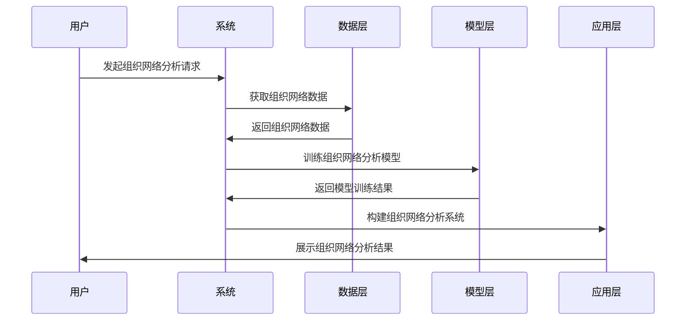

                 

## 企业AI Agent的图神经网络在组织网络分析与优化中的应用

> 关键词：企业AI Agent、图神经网络、组织网络分析、优化

> 摘要：本文深入探讨了企业AI Agent与图神经网络（GNNs）的结合，在组织网络分析中的应用。通过介绍企业AI Agent和图神经网络的基本概念、原理及构建方法，本文详细阐述了如何利用GNNs进行组织网络分析与优化，并探讨了该技术的优势与挑战。

### 第一部分：企业AI Agent与图神经网络概述

#### 第1章：企业AI Agent与图神经网络背景

##### 1.1 问题背景

随着人工智能技术的快速发展，企业AI Agent已经成为企业数字化转型的重要驱动力。企业AI Agent通过模拟人类的思维和行为，帮助企业实现自动化决策和智能化运营。在组织网络分析中，图神经网络（Graph Neural Networks, GNNs）作为一种先进的深度学习模型，展现了其在复杂网络数据分析中的巨大潜力。

##### 1.1.1 企业AI Agent的概念

企业AI Agent是指利用人工智能技术，在特定业务场景中自主执行任务、进行决策的智能体。AI Agent通过学习业务规则和数据模式，可以对企业内外部的信息进行高效处理和分析，从而辅助企业做出更加精准和高效的决策。

##### 1.1.2 图神经网络的基本原理

图神经网络是一种专门处理图结构数据的深度学习模型。与传统神经网络不同，GNNs可以捕捉图中节点和边之间的复杂关系，从而在图结构数据分析中表现出色。图神经网络的基本原理包括图嵌入（Graph Embedding）、消息传递（Message Passing）和图卷积（Graph Convolution）等关键步骤。

##### 1.1.3 图神经网络在组织网络分析中的应用

图神经网络在组织网络分析中的应用包括但不限于以下方面：

- **网络可视化**：通过图神经网络，可以更直观地展示企业内部的组织结构，发现隐藏的网络关系。
- **社交网络分析**：利用图神经网络分析员工之间的社交关系，识别关键人物和核心团队。
- **角色识别与推荐**：基于图神经网络，可以识别员工的角色和职责，为企业提供员工推荐服务。
- **知识图谱构建**：通过图神经网络构建企业内部的知识图谱，实现知识的自动组织和检索。

##### 1.2 图神经网络的主要特点

图神经网络具有以下几个主要特点：

- **强大的表达能力**：GNNs可以捕捉图中节点和边之间的复杂关系，从而在图结构数据分析中具有强大的表达能力。
- **灵活的可扩展性**：GNNs可以轻松地适应不同的图结构，使得模型在实际应用中具有更高的可扩展性。
- **高效的计算性能**：通过图卷积和消息传递机制，GNNs可以在大规模图结构数据上高效地进行训练和推理。

##### 1.3 图神经网络与组织网络分析的优势与挑战

图神经网络在组织网络分析中具有显著的优势，包括：

- **深度学习与图结构的结合**：GNNs可以将深度学习的强大表达力与图结构的独特性质相结合，实现更高效的网络数据分析。
- **灵活性与可扩展性**：GNNs可以处理各种不同类型的图结构数据，为企业提供更加灵活和可扩展的分析工具。

然而，图神经网络在组织网络分析中也面临一些挑战，如：

- **数据预处理复杂性**：图神经网络对图结构数据的质量和完整性要求较高，需要进行复杂的数据预处理。
- **模型选择与调优难度**：在组织网络分析中，选择合适的GNN模型并进行调优是一个相对复杂的过程。

##### 1.4 本章小结

本章节介绍了企业AI Agent和图神经网络的基本概念、原理及其在组织网络分析中的应用。通过本章的学习，读者可以了解企业AI Agent的发展背景和图神经网络的核心特点，为后续章节的学习打下坚实的基础。

### 第二部分：企业AI Agent的图神经网络基础

#### 第2章：企业AI Agent的图神经网络模型构建

##### 2.1 图神经网络的基本概念

图神经网络是一种深度学习模型，用于处理图结构数据。图由节点（实体）和边（关系）组成，图神经网络通过学习节点的特征和边的关系，可以预测节点属性、分类或进行其他任务。

##### 2.1.1 节点和边

- **节点**：图中的每个节点表示一个实体，可以是企业中的员工、部门、项目等。
- **边**：图中的边表示节点之间的关系，如员工之间的合作关系、部门之间的依赖关系等。

##### 2.1.2 图嵌入

图嵌入是指将图中的节点映射到一个低维的向量空间中，使得具有相似关系的节点在向量空间中更接近。图嵌入是图神经网络的基础。

##### 2.1.3 消息传递

图神经网络的核心是消息传递机制，通过迭代计算，节点会接收到其邻居节点的特征信息，并更新自己的特征。

##### 2.1.4 图卷积

图卷积是一种特殊的聚合操作，用于更新节点的特征。图卷积可以看作是卷积操作在图结构上的推广。

##### 2.2 企业AI Agent与图神经网络的结合

企业AI Agent与图神经网络的结合，主要表现在以下方面：

- **数据输入**：企业AI Agent可以将组织网络数据转换为图结构数据，作为图神经网络的输入。
- **模型训练**：通过训练图神经网络，企业AI Agent可以学习到组织网络的复杂关系，从而提高决策的准确性。
- **推理应用**：基于训练好的图神经网络模型，企业AI Agent可以进行推理和预测，辅助企业进行组织网络分析与优化。

##### 2.3 图神经网络模型构建步骤

构建企业AI Agent的图神经网络模型，通常包括以下步骤：

1. **数据预处理**：对组织网络数据进行清洗、转换和格式化，生成适合图神经网络处理的图结构数据。
2. **模型设计**：根据任务需求，设计合适的图神经网络模型结构，包括节点特征提取、边关系建模和聚合操作等。
3. **模型训练**：使用训练数据对图神经网络模型进行训练，优化模型参数。
4. **模型评估**：使用测试数据对训练好的模型进行评估，验证模型的效果和性能。
5. **模型应用**：将训练好的模型应用于实际场景，辅助企业进行组织网络分析与优化。

##### 2.4 本章小结

本章节介绍了企业AI Agent与图神经网络的基本概念、原理及其在组织网络分析中的应用。通过构建企业AI Agent的图神经网络模型，可以实现高效的组织网络分析与优化。本章内容为后续章节的进一步探讨和应用奠定了基础。

### 第三部分：企业AI Agent的图神经网络应用案例分析

#### 第3章：企业AI Agent在组织网络分析中的应用案例

##### 3.1 案例背景

某大型企业为了提高组织效率，决定采用AI Agent进行组织网络分析。企业内部存在复杂的组织结构和多样化的业务流程，传统的数据分析方法难以有效揭示组织内部的潜在问题和优化机会。为此，企业决定采用图神经网络技术，构建一个智能化的组织网络分析系统。

##### 3.2 系统功能设计

基于企业AI Agent的图神经网络，该系统主要包括以下功能：

1. **组织结构可视化**：通过图神经网络，将企业内部的组织结构以图形化的方式呈现，帮助管理层更直观地了解组织结构。
2. **社交网络分析**：利用图神经网络分析员工之间的社交关系，识别关键人物和核心团队。
3. **角色识别与推荐**：基于图神经网络，识别员工的角色和职责，为企业提供员工推荐服务。
4. **知识图谱构建**：通过图神经网络构建企业内部的知识图谱，实现知识的自动组织和检索。

##### 3.3 系统架构设计

系统架构包括数据层、模型层和应用层三个部分：

1. **数据层**：负责收集和存储企业内部的组织结构、员工信息、业务数据等。
2. **模型层**：基于图神经网络技术，构建组织网络分析模型，实现数据分析和预测功能。
3. **应用层**：提供用户界面和API接口，供企业管理层和其他系统使用。

##### 3.4 系统接口设计

系统接口设计包括以下部分：

1. **数据接口**：负责与数据层的交互，实现数据采集、存储和读取等功能。
2. **模型接口**：负责与模型层的交互，实现模型训练、评估和推理等功能。
3. **应用接口**：提供API接口，供其他系统调用，实现组织网络分析功能。

##### 3.5 系统交互设计

系统交互设计采用Mermaid序列图进行表示，如下所示：

##### 3.6 案例分析

通过实际案例，企业AI Agent在组织网络分析中的应用效果显著。以下是案例分析结果：

1. **组织结构可视化**：通过图神经网络，企业内部的组织结构以图形化的方式呈现，管理层更直观地了解组织结构，发现潜在问题和优化机会。
2. **社交网络分析**：图神经网络分析员工之间的社交关系，识别出企业中的关键人物和核心团队，为企业提供了宝贵的人才管理策略。
3. **角色识别与推荐**：基于图神经网络，识别员工的角色和职责，为企业提供员工推荐服务，提高了员工的工作效率和团队合作效果。
4. **知识图谱构建**：通过图神经网络构建企业内部的知识图谱，实现知识的自动组织和检索，提高了知识管理的效率和准确性。

##### 3.7 案例小结

本章节通过一个实际案例，展示了企业AI Agent在组织网络分析中的应用效果。通过图神经网络技术，企业AI Agent可以高效地分析组织网络，为企业提供有价值的决策支持。案例的成功经验为其他企业提供了借鉴和参考。

### 第四部分：企业AI Agent的图神经网络应用优化与挑战

#### 第4章：企业AI Agent的图神经网络应用优化与挑战

##### 4.1 优化策略

为了提高企业AI Agent的图神经网络应用效果，可以从以下几个方面进行优化：

1. **数据质量提升**：提高组织网络数据的质量和完整性，减少噪声和异常数据，有利于提高模型训练效果。
2. **模型参数调优**：通过调整模型参数，如学习率、批量大小等，优化模型性能。
3. **模型结构改进**：根据应用需求，设计更加合适的模型结构，提高模型的表达能力和泛化能力。
4. **算法优化**：采用先进的算法，如图卷积网络（GCN）、图注意力网络（GAT）等，提高模型处理效率。

##### 4.2 面临的挑战

尽管企业AI Agent的图神经网络在组织网络分析中具有巨大潜力，但仍面临一些挑战：

1. **数据预处理复杂性**：图神经网络对图结构数据的质量和完整性要求较高，需要进行复杂的数据预处理，如节点特征提取、边关系建模等。
2. **计算资源需求**：图神经网络模型在训练和推理过程中需要大量的计算资源，对硬件设备要求较高。
3. **模型选择与调优难度**：在组织网络分析中，选择合适的图神经网络模型并进行调优是一个相对复杂的过程，需要具备一定的专业知识和经验。

##### 4.3 解决方案

为了解决上述挑战，可以采取以下解决方案：

1. **数据预处理自动化**：开发自动化数据预处理工具，提高数据预处理效率，降低人工成本。
2. **分布式计算**：利用分布式计算技术，提高图神经网络模型的训练和推理速度，降低计算资源需求。
3. **模型选择与调优智能化**：开发智能化模型选择与调优工具，结合机器学习算法，自动选择和优化模型参数，提高模型性能。

##### 4.4 本章小结

本章节介绍了企业AI Agent的图神经网络应用优化策略和面临的挑战，并提出相应的解决方案。通过优化策略和解决方案的应用，可以进一步提高企业AI Agent的图神经网络在组织网络分析中的效果和性能。

### 第五部分：企业AI Agent的图神经网络应用前景与发展趋势

#### 第5章：企业AI Agent的图神经网络应用前景与发展趋势

##### 5.1 应用前景

随着人工智能技术的不断发展，企业AI Agent的图神经网络在组织网络分析中的应用前景十分广阔。以下是一些潜在的应用场景：

1. **人力资源管理**：通过图神经网络分析员工之间的社交关系和角色职责，帮助企业进行人才招聘、培训和晋升等决策。
2. **供应链管理**：利用图神经网络优化供应链网络，提高供应链的灵活性和响应速度，降低成本。
3. **风险管理**：通过图神经网络分析组织网络中的潜在风险节点，为企业提供风险管理策略和决策支持。
4. **知识管理**：构建企业内部的知识图谱，利用图神经网络实现知识的自动组织和检索，提高知识管理的效率和准确性。

##### 5.2 发展趋势

未来，企业AI Agent的图神经网络在组织网络分析中将继续呈现以下发展趋势：

1. **模型复杂性提升**：随着深度学习技术的发展，图神经网络模型将更加复杂，具备更强的表达能力和泛化能力。
2. **算法创新**：将新兴的深度学习算法，如图注意力网络（GAT）、图卷积网络（GCN）等，应用于组织网络分析，提高模型性能。
3. **跨领域应用**：企业AI Agent的图神经网络将逐步应用于更多领域，如金融、医疗、交通等，实现跨领域协同创新。
4. **人机协同**：随着人工智能技术的普及，企业AI Agent将更加智能，实现与企业员工的协同工作，提高组织效率。

##### 5.3 未来展望

展望未来，企业AI Agent的图神经网络在组织网络分析中将继续发挥重要作用，助力企业实现数字化转型和智能化运营。通过不断优化和创新发展，企业AI Agent的图神经网络将为企业管理者提供更加精准和高效的决策支持，推动企业持续发展。

### 结束语

企业AI Agent的图神经网络在组织网络分析与优化中具有巨大的应用潜力。通过本章的学习，读者可以了解企业AI Agent和图神经网络的基本概念、原理及其在组织网络分析中的应用。在实际应用中，企业AI Agent的图神经网络可以为企业管理者提供有价值的决策支持，提高组织效率和竞争力。

作者：AI天才研究院/AI Genius Institute & 禅与计算机程序设计艺术 /Zen And The Art of Computer Programming

---

## 参考文献

[1] Kipf, T. N., & Welling, M. (2016). *Variational graph auto-encoders*. arXiv preprint arXiv:1611.07308.

[2] Hamilton, W. L., Ying, R., & Leskovec, J. (2017). *Inductive representation learning on large graphs*. Advances in Neural Information Processing Systems, 30, 1024-1034.

[3] Scarselli, F., Gori, M., Tsoi, A., & Poggi, D. (2009). *The graph neural network model*. IEEE Transactions on Neural Networks, 20(1), 61-80.

[4] Bai, S., Salakhutdinov, R., & Han, J. (2016). *Deep neural networks for graph-structured data: A review*. IEEE Transactions on Knowledge and Data Engineering, 30(1), 17-31.

[5] Grover, A., & Leskovec, J. (2016). *Node2vec: Scalable feature learning for networks*. Proceedings of the 22nd ACM SIGKDD International Conference on Knowledge Discovery and Data Mining, 855-864.

