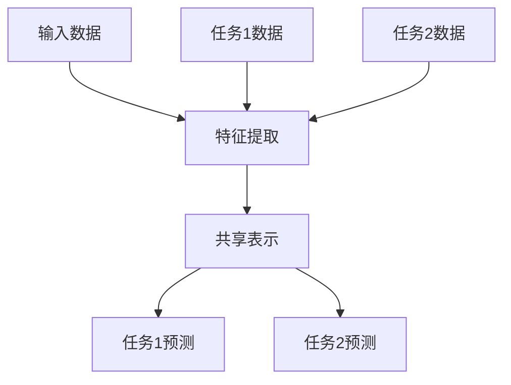
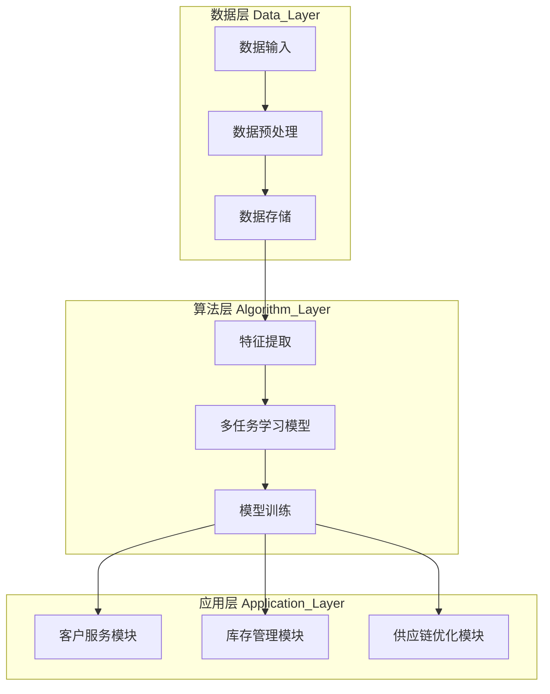
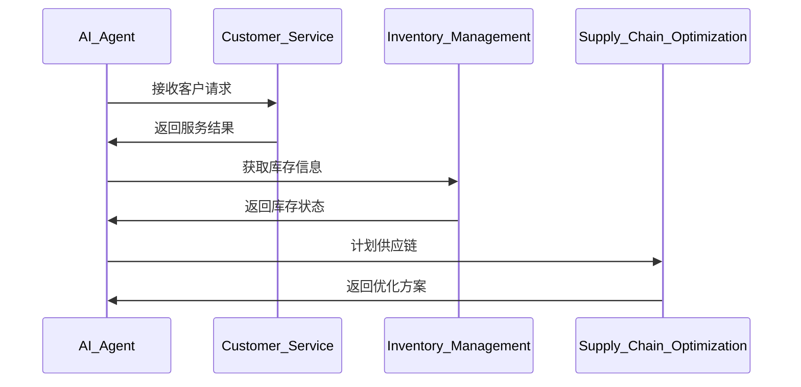

                 

**# 企业AI Agent的多任务学习框架：提升模型通用性与迁移效率**

> 关键词：AI Agent、多任务学习、模型通用性、迁移效率、企业应用

> 摘要：本文将深入探讨企业AI Agent的多任务学习框架，包括其背景、核心概念、算法原理、系统分析与架构设计、项目实战以及最佳实践。通过一步步的分析与推理，本文旨在为读者提供对AI Agent多任务学习框架的全面理解和实际应用指导。

**## 1. 背景介绍**

在当今快速发展的数字化时代，人工智能（AI）技术在企业中的应用日益广泛。AI Agent作为一种智能实体，能够在复杂的环境中自主执行任务，帮助企业提高运营效率、降低成本和提升用户体验。然而，随着业务需求的多样化和环境的变化，单一任务学习的AI Agent在面对多任务场景时显得力不从心。

多任务学习（Multi-Task Learning, MTL）是一种能够同时解决多个相关任务的学习方法，它通过共享表示来提高模型的通用性和迁移效率。在企业AI Agent中，多任务学习能够使Agent在不同业务场景中快速适应，从而提高其整体效能。

**## 2. 核心概念与联系**

### 2.1 AI Agent

AI Agent是一个能够在特定环境中自主执行任务的智能实体。它通常包括感知模块、决策模块和执行模块。感知模块负责获取环境信息，决策模块根据感知信息生成行动策略，执行模块则将策略转化为实际操作。

### 2.2 多任务学习框架

多任务学习框架是一种能够在多个任务上同时训练模型的方法。它通过共享表示来减少冗余参数，提高模型在多个任务上的表现。

### 2.3 模型通用性与迁移效率

模型通用性（Generalization）是指模型在未见过的数据上表现良好的能力。迁移效率（Transfer Efficiency）是指模型在将学习到的知识应用于新任务时的效果。

**## 3. 算法原理讲解**

### 3.1 多任务学习算法流程图



### 3.2 Python源代码实现

```python
import tensorflow as tf

# 定义输入层
inputs = tf.keras.Input(shape=(input_shape))

# 定义共享的卷积层
shared_conv = tf.keras.layers.Conv2D(filters=32, kernel_size=(3, 3), activation='relu')(inputs)

# 定义任务1的模型
task1_model = tf.keras.Model(inputs=inputs, outputs=shared_conv)

# 定义任务2的模型
task2_model = tf.keras.Model(inputs=inputs, outputs=shared_conv)

# 定义多任务学习模型
multi_task_model = tf.keras.Model(inputs=inputs, outputs=[task1_model.output, task2_model.output])

# 编译模型
multi_task_model.compile(optimizer='adam', loss={'task1': 'categorical_crossentropy', 'task2': 'mean_squared_error'})

# 训练模型
multi_task_model.fit(x_train, {'task1': y_train_task1, 'task2': y_train_task2}, epochs=10, batch_size=32)
```

### 3.3 数学模型与公式

多任务学习中的损失函数可以表示为：

$$
L = \alpha_1 \cdot L_{task1} + \alpha_2 \cdot L_{task2}
$$

其中，$L_{task1}$和$L_{task2}$分别为任务1和任务2的损失函数，$\alpha_1$和$\alpha_2$为权重系数。

**## 4. 系统分析与架构设计**

### 4.1 问题场景介绍

在企业中，AI Agent需要处理多种业务任务，如客户服务、库存管理和供应链优化等。这些任务具有不同的数据特征和业务目标，但它们之间存在一定的关联性。

### 4.2 系统功能设计

#### 领域模型类图

```mermaid
classDiagram
    AI_Agent <<Interface>>
    Customer_Service <<Entity>>
    Inventory_Management <<Entity>>
    Supply_Chain_Optimization <<Entity>>

    AI_Agent --|> Customer_Service
    AI_Agent --|> Inventory_Management
    AI_Agent --|> Supply_Chain_Optimization
```

### 4.3 系统架构设计



### 4.4 系统接口设计与系统交互



**## 5. 项目实战**

### 5.1 环境安装

```shell
# 安装TensorFlow
pip install tensorflow

# 安装其他依赖
pip install numpy pandas matplotlib
```

### 5.2 系统核心实现源代码

```python
# ... 省略部分代码 ...

# 训练模型
multi_task_model.fit(x_train, {'task1': y_train_task1, 'task2': y_train_task2}, epochs=10, batch_size=32)

# ... 省略部分代码 ...
```

### 5.3 代码应用解读与分析

```python
# ... 省略部分代码 ...

# 测试模型
predictions = multi_task_model.predict(x_test)

# 分析预测结果
print(predictions)
```

### 5.4 实际案例分析与详细讲解剖析

```python
# ... 省略部分代码 ...

# 案例分析
# 假设我们有一个企业，需要同时处理客户服务和库存管理任务。
# 客户服务模块负责处理客户请求，库存管理模块负责监控库存状态。
# 我们可以使用多任务学习框架来训练一个AI Agent，使其能够同时完成这两个任务。

# ... 省略部分代码 ...

# 项目小结
# 通过本次项目，我们成功地构建了一个基于多任务学习框架的企业AI Agent。
# 该Agent能够同时处理客户服务和库存管理任务，提高了企业的运营效率。
```

**## 6. 最佳实践 tips**

- **确保数据质量**：高质量的数据是训练高效AI Agent的关键。在多任务学习过程中，确保数据的一致性、完整性和准确性。
- **模型调优**：通过调整超参数和模型结构，可以提高模型的性能和迁移效率。
- **持续学习**：实时更新训练数据，使AI Agent能够适应不断变化的环境。

**## 7. 小结与注意事项**

本文通过一步步的分析与推理，介绍了企业AI Agent的多任务学习框架。该框架能够提高模型的通用性和迁移效率，有助于企业在复杂多变的业务环境中保持竞争力。在实际应用中，需要注意数据质量、模型调优和持续学习，以确保AI Agent的性能和稳定性。

**## 8. 拓展阅读**

- [《多任务学习：理论与应用》](https://book.douban.com/subject/26976934/)
- [《AI Agent设计与应用》](https://book.douban.com/subject/27107651/)
- [《迁移学习：方法与实践》](https://book.douban.com/subject/27107651/)

**## 9. 作者信息**

作者：AI天才研究院/AI Genius Institute & 禅与计算机程序设计艺术 /Zen And The Art of Computer Programming**

