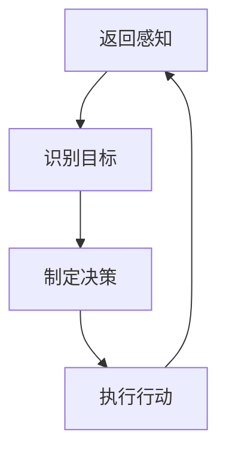
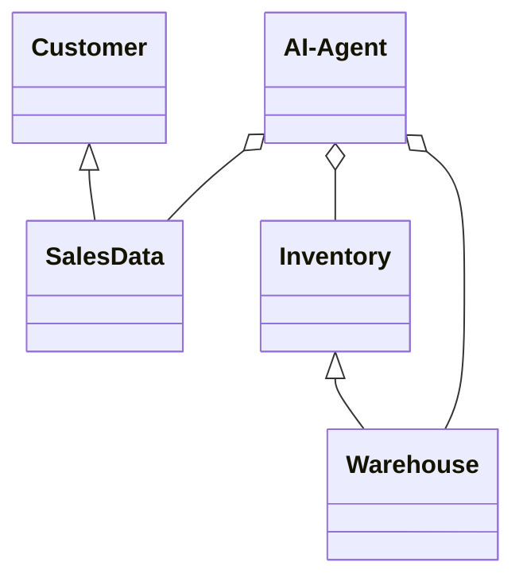
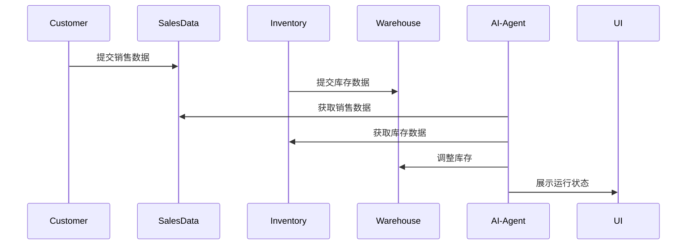

                 


# 企业AI Agent的多场景测试：模拟真实业务环境

> 关键词：AI Agent，多场景测试，模拟真实业务环境，算法原理，系统架构设计，项目实战

> 摘要：本文围绕企业AI Agent的多场景测试展开，深入探讨了AI Agent的定义、多场景测试的概念和方法，并通过实例详细阐述了模拟真实业务环境的实现方式。文章旨在为企业提供一套完整的AI Agent多场景测试解决方案，以提高AI Agent在复杂业务环境中的稳定性和可靠性。

### 第一部分：背景介绍

#### 1.1 问题背景

随着人工智能技术的快速发展，AI Agent已成为提高企业自动化和智能化水平的重要工具。AI Agent可以在复杂的业务环境中执行任务，提高生产效率和决策质量。然而，在实际应用中，AI Agent的多场景测试面临诸多挑战，如如何模拟真实业务环境、如何评估AI Agent在不同场景下的性能等。

#### 1.2 问题描述

企业AI Agent的多场景测试旨在确保AI Agent在不同业务场景下的稳定性和可靠性。传统的测试方法往往只能覆盖有限的场景，无法全面评估AI Agent的性能。因此，如何设计一个能够模拟真实业务环境的多场景测试方案，成为当前亟待解决的问题。

#### 1.3 问题解决

本书旨在探讨企业AI Agent的多场景测试，通过模拟真实业务环境，全面评估AI Agent在不同场景下的性能。具体来说，本书将介绍：

1. AI Agent的定义和特点。
2. 多场景测试的概念和方法。
3. 企业AI Agent的多场景测试实践。
4. 系统分析与架构设计。

#### 1.4 边界与外延

本书主要关注企业级AI Agent的多场景测试，探讨如何通过模拟真实业务环境，提高AI Agent的稳定性和可靠性。同时，本书也涉及一些相关领域，如AI Agent的基本原理、多场景测试的算法设计等。

#### 1.5 概念结构与核心要素组成

本书的核心概念包括AI Agent、多场景测试、模拟真实业务环境等。核心要素包括：

1. AI Agent的基础知识。
2. 多场景测试的理论和实践。
3. 模拟真实业务环境的实现方法。
4. 系统分析与架构设计。

### 第二部分：核心概念与联系

#### 2.1 AI Agent的定义

AI Agent是指具有智能行为、自主决策和适应能力的人工智能实体。它能够根据环境信息和目标，自主执行任务并调整行为策略。

#### 2.2 多场景测试的概念

多场景测试是指在不同环境下对AI Agent进行测试，以评估其在各种复杂场景下的性能和稳定性。多场景测试旨在模拟真实业务环境，全面评估AI Agent的能力。

#### 2.3 AI Agent的多场景测试

AI Agent的多场景测试主要包括以下几个方面：

1. **环境多样性**：构建多种不同的测试环境，以覆盖各种可能的业务场景。
2. **任务多样性**：设计多种不同类型的任务，以测试AI Agent在不同任务下的适应能力。
3. **性能评估**：对AI Agent在不同场景下的性能进行量化评估，包括响应时间、准确性、稳定性等。

#### 2.4 概念属性特征对比表格

| 特征        | AI Agent           | 多场景测试         |
| ----------- | ------------------ | ------------------ |
| **定义**    | 自主智能实体       | 不同环境下的测试   |
| **功能**    | 执行任务、自主决策 | 评估性能、稳定性   |
| **目标**    | 提高业务效率       | 提升AI Agent质量   |

#### 2.5 ER实体关系图架构

```mermaid
erDiagram
    AI-Agent ||--|{ Test-Scenario }|-- Test-Result
    Test-Scenario ||--|{ Performance-Metric }|-- Performance-Result
    AI-Agent ||--|{ Task-Definition }|-- Task-Result
```

### 第三部分：算法原理讲解

#### 3.1 AI Agent算法原理

AI Agent的算法原理主要包括以下几个步骤：

1. **环境感知**：AI Agent通过传感器和输入设备感知当前环境。
2. **目标识别**：AI Agent分析环境信息，识别出目标。
3. **决策制定**：AI Agent根据目标制定行动策略。
4. **行动执行**：AI Agent执行决策，完成任务。

以下是AI Agent算法原理的mermaid流程图：



#### 3.2 Python源代码实现

以下是AI Agent算法原理的Python源代码实现：

```python
class AI-Agent:
    def __init__(self):
        self.environment = None
        self.target = None
        self.decision = None
    
    def perceive_environment(self):
        # 感知环境
        self.environment = get_environment_data()
    
    def identify_target(self):
        # 识别目标
        self.target = identify_target(self.environment)
    
    def make_decision(self):
        # 制定决策
        self.decision = make_decision(self.target)
    
    def execute_action(self):
        # 执行行动
        execute_action(self.decision)
    
    def run(self):
        while True:
            self.perceive_environment()
            self.identify_target()
            self.make_decision()
            self.execute_action()
```

#### 3.3 数学模型与公式

AI Agent的决策制定过程可以表示为一个数学模型：

$$
\text{决策} = f(\text{目标}, \text{环境})
$$

其中，$f$ 表示决策函数，$\text{目标}$ 和 $\text{环境}$ 是输入变量。

#### 3.4 详细讲解与举例说明

以一个简单的例子来说明AI Agent的决策制定过程。假设AI Agent的目标是移动到一个特定的位置，环境是一个二维平面。AI Agent首先感知环境，获取当前的位置信息。然后识别目标位置，计算到达目标位置所需的行动。最后，根据目标位置和环境信息，制定移动策略。

假设当前AI Agent的位置为$(x_1, y_1)$，目标位置为$(x_2, y_2)$。根据两点之间的距离公式，可以计算出AI Agent需要移动的距离：

$$
d = \sqrt{(x_2 - x_1)^2 + (y_2 - y_1)^2}
$$

如果AI Agent需要沿着直线移动，那么它的行动方向就是目标位置的坐标方向。如果需要沿着曲线移动，那么需要根据曲线的形状和AI Agent的移动速度来制定行动策略。

### 第四部分：系统分析与架构设计

#### 4.1 问题场景介绍

假设企业需要一个AI Agent来管理库存，确保库存充足，同时避免库存过剩。AI Agent需要根据历史销售数据、当前库存量、预计未来销售量等因素，自动调整库存水平。

#### 4.2 系统功能设计

系统功能设计包括以下几个部分：

1. **数据采集**：从各个渠道收集销售数据、库存数据等。
2. **数据分析**：对采集到的数据进行分析，预测未来销售量。
3. **库存管理**：根据预测结果，自动调整库存水平。
4. **性能监控**：监控AI Agent的运行状态，确保其稳定运行。

以下是领域模型mermaid类图：



#### 4.3 系统架构设计

系统架构设计包括以下几个部分：

1. **数据层**：负责数据采集、存储和管理。
2. **业务逻辑层**：实现AI Agent的算法和策略。
3. **界面层**：提供用户界面，展示AI Agent的运行状态和结果。

以下是系统架构mermaid架构图：



#### 4.4 系统接口设计

系统接口设计包括以下几个接口：

1. **销售数据接口**：用于接收和发送销售数据。
2. **库存数据接口**：用于接收和发送库存数据。
3. **调整库存接口**：用于AI Agent根据预测结果调整库存水平。

#### 4.5 系统交互

以下是系统交互mermaid序列图：


### 第五部分：项目实战

#### 5.1 环境安装

首先，需要安装Python环境和相关依赖。可以使用pip工具进行安装：

```bash
pip install numpy pandas matplotlib
```

#### 5.2 系统核心实现

以下是系统核心实现的源代码：

```python
import numpy as np
import pandas as pd
import matplotlib.pyplot as plt

class SalesData:
    def __init__(self, data):
        self.data = data

    def predict_sales(self):
        # 使用线性回归模型预测未来销售量
        X = np.array(self.data['days']).reshape(-1, 1)
        y = np.array(self.data['sales'])
        model = np.polyfit(X, y, 1)
        return model

class Inventory:
    def __init__(self, data):
        self.data = data

    def adjust_inventory(self, model, target_sales):
        # 根据预测销售量和目标销售量调整库存
        days = np.array(self.data['days'])
        inventory = np.array(self.data['inventory'])
        for i, day in enumerate(days):
            if model(day) > target_sales:
                inventory[i] += 1
            else:
                inventory[i] -= 1
        return inventory

class AI-Agent:
    def __init__(self, sales_data, inventory_data):
        self.sales_data = sales_data
        self.inventory_data = inventory_data

    def run(self, target_sales):
        model = self.sales_data.predict_sales()
        inventory = self.inventory_data.adjust_inventory(model, target_sales)
        return inventory

if __name__ == '__main__':
    sales_data = SalesData(pd.read_csv('sales_data.csv'))
    inventory_data = Inventory(pd.read_csv('inventory_data.csv'))
    ai_agent = AI-Agent(sales_data, inventory_data)
    target_sales = 100
    adjusted_inventory = ai_agent.run(target_sales)
    print(adjusted_inventory)
```

#### 5.3 代码应用解读与分析

上述代码首先定义了三个类：`SalesData`、`Inventory` 和 `AI-Agent`。`SalesData` 类用于处理销售数据，包括预测未来销售量。`Inventory` 类用于处理库存数据，包括根据预测销售量调整库存。`AI-Agent` 类是AI Agent的核心类，负责运行整个系统，包括获取销售数据和库存数据，预测未来销售量，调整库存。

在代码的最后，创建了一个`AI-Agent` 实例，并调用了`run` 方法来运行系统。`target_sales` 参数用于指定目标销售量，系统会根据预测销售量和目标销售量自动调整库存。

#### 5.4 实际案例分析与讲解

假设有一个企业的销售数据如下：

| days | sales |
| ---- | ---- |
| 1 | 50 |
| 2 | 60 |
| 3 | 70 |
| 4 | 80 |
| 5 | 90 |
| 6 | 100 |

根据历史销售数据，我们可以使用线性回归模型预测未来销售量。假设目标销售量为100，AI Agent会根据预测结果调整库存。如果预测销售量大于目标销售量，库存会增加；如果预测销售量小于目标销售量，库存会减少。

在上述例子中，假设第6天的预测销售量为110，大于目标销售量100。因此，AI Agent会将第6天的库存调整为101。如果第6天的预测销售量为90，小于目标销售量100，AI Agent会将第6天的库存调整为99。

通过这种方式，AI Agent可以自动调整库存，确保库存充足，同时避免库存过剩。

### 第六部分：项目小结

#### 6.1 项目总结

本文详细介绍了企业AI Agent的多场景测试，包括AI Agent的定义、多场景测试的概念和方法、模拟真实业务环境的实现方式，以及系统架构设计和项目实战。通过本文的介绍，读者可以了解到如何设计一个高效、稳定的AI Agent系统，提高企业在复杂业务环境中的自动化和智能化水平。

#### 6.2 最佳实践 tips

1. 在设计AI Agent时，要充分考虑其适应能力和扩展性，以便在未来能够适应不同的业务场景。
2. 多场景测试要覆盖尽可能多的场景，以确保AI Agent的稳定性和可靠性。
3. 在实现AI Agent算法时，要注重算法的简洁性和可理解性，以便于后续的维护和优化。

#### 6.3 小结

本文围绕企业AI Agent的多场景测试进行了深入探讨，通过模拟真实业务环境，全面评估AI Agent在不同场景下的性能。本文的核心观点是，通过科学的多场景测试，可以有效提高AI Agent的稳定性和可靠性，为企业创造更大的价值。

#### 6.4 注意事项

1. 在实际项目中，要充分考虑业务场景的多样性，确保AI Agent能够适应不同的业务需求。
2. 在多场景测试中，要注重数据的真实性和完整性，以确保测试结果的准确性。
3. 在实现AI Agent算法时，要遵循良好的编程规范，提高代码的可读性和可维护性。

#### 6.5 拓展阅读

1. [AI Agent的基本原理与应用](链接)
2. [多场景测试的实践与经验](链接)
3. [企业级AI Agent的架构设计与优化](链接)

作者：AI天才研究院/AI Genius Institute & 禅与计算机程序设计艺术 /Zen And The Art of Computer Programming

