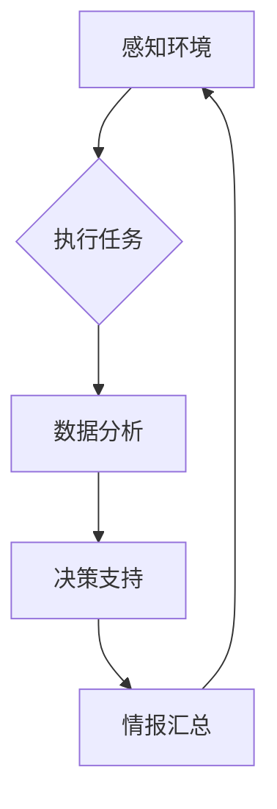
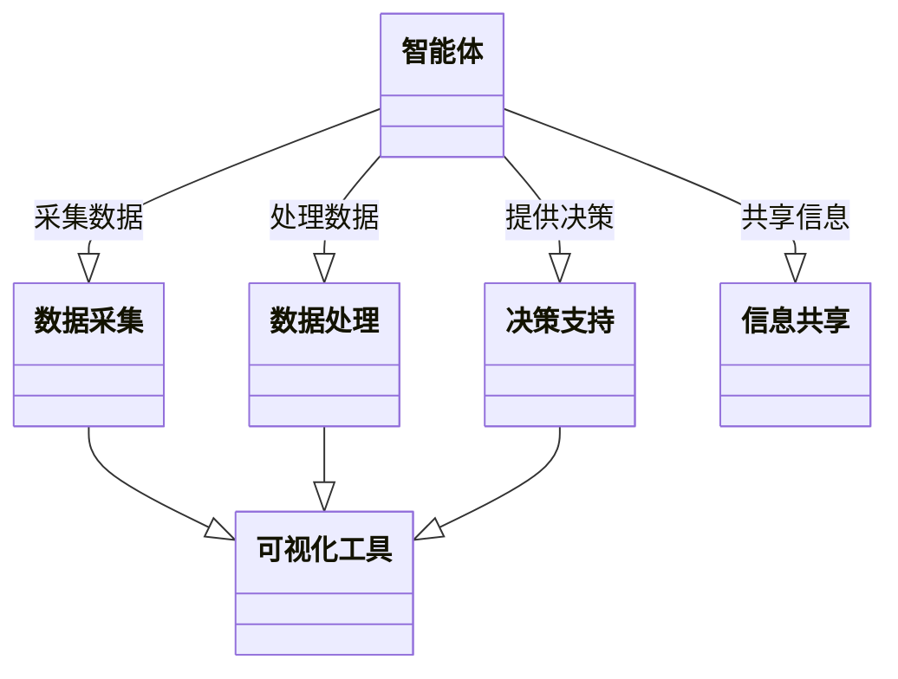
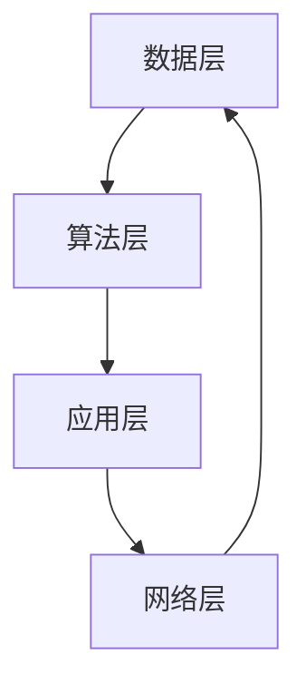
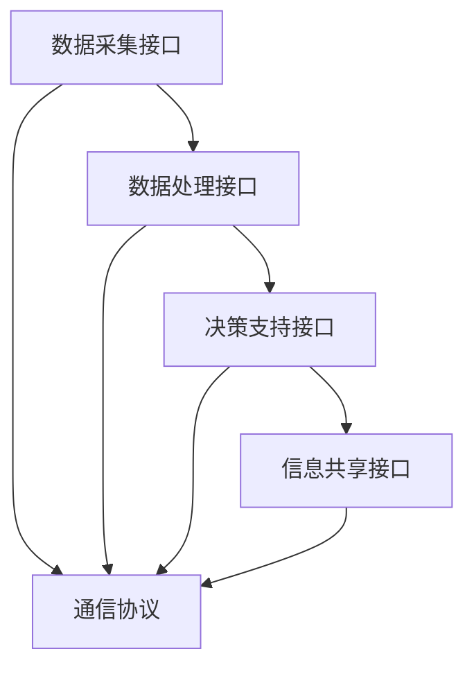

                 

### 文章标题：企业AI Agent的多智能体系统在跨部门协作优化中的应用

#### 关键词：企业AI Agent、多智能体系统、跨部门协作、优化

#### 摘要：
本文旨在探讨企业AI Agent的多智能体系统在跨部门协作优化中的应用。通过深入分析问题背景、核心概念、算法原理、系统架构以及实战案例，本文旨在为读者提供一种高效、智能的跨部门协作解决方案。企业AI Agent的多智能体系统能够通过精准的数据分析和协同工作，提升企业内部协作效率，助力企业在竞争激烈的市场中保持优势。

---

## 第一部分：企业AI Agent与多智能体系统概述

### 第1章：问题背景与解决方案

#### 1.1 问题背景

在现代企业运营中，跨部门协作的重要性日益凸显。然而，信息不对称、目标不一致等问题常常导致协作效率低下，影响企业整体运营效能。为了解决这些问题，引入人工智能（AI）技术成为了企业优化跨部门协作的有效途径。

#### 1.2 问题描述

跨部门协作中的信息不对称问题主要体现在各部门之间的数据共享不畅，导致决策时信息滞后。此外，部门间目标不一致常常导致资源浪费和重复劳动，降低了整体协作效率。

#### 1.3 问题解决

多智能体系统作为一种分布式计算模型，具有自主性、协作性和适应性等特点，能够有效解决跨部门协作中的信息不对称和目标不一致问题。企业AI Agent作为多智能体系统的重要组成部分，能够在协作过程中发挥数据分析和智能决策的作用。

#### 1.4 边界与外延

企业AI Agent主要应用于企业内部的信息化系统中，通过数据收集、处理和分析，为企业提供决策支持。多智能体系统的边界则取决于系统的设计和实施范围，通常涵盖企业内部各部门之间的协同工作。

#### 1.5 概念结构与核心要素

多智能体系统的概念结构包括智能体、环境、通信协议和协调机制等核心要素。企业AI Agent作为智能体的代表，具有感知环境、执行任务、交流协作和自主学习等功能。

### 第2章：多智能体系统的核心概念与联系

#### 2.1 核心概念

多智能体系统（MAS）是一种由多个智能体组成的分布式计算系统，每个智能体具有自主性、协作性和适应性。智能体通过感知环境、执行任务、交流协作和自主学习，实现系统整体目标的优化。

#### 2.2 概念属性特征对比表格

以下是几种常见AI Agent的属性特征对比表格：

| AI Agent类型 | 自主性 | 协作性 | 适应性 | 应用场景 |
| :--- | :--- | :--- | :--- | :--- |
| 专家系统 | 高 | 低 | 低 | 复杂决策问题 |
| 机器人 | 中 | 中 | 中 | 实体操作 |
| 强化学习 | 低 | 高 | 高 | 连续决策问题 |

#### 2.3 ER实体关系图架构

以下是企业AI Agent的ER实体关系图：

```mermaid
erDiagram
  智能体 ||--|{ 环境监测 }
  智能体 ||--|{ 数据分析 }
  智能体 ||--|{ 决策支持 }
  环境监测 ||--|{ 数据采集 }
  数据分析 ||--|{ 数据处理 }
  决策支持 ||--|{ 情报汇总 }
```

### 第3章：AI Agent的算法原理讲解

#### 3.1 算法mermaid流程图

以下是AI Agent的基本流程mermaid流程图：



#### 3.2 Python源代码详细阐述

以下是AI Agent的核心算法Python源代码：

```python
import numpy as np

# 初始化智能体
class Agent:
    def __init__(self, environment):
        self.environment = environment
        self.data = []

    # 感知环境
    def sense(self):
        self.data.append(self.environment.read())

    # 数据分析
    def analyze(self):
        if np.mean(self.data) > threshold:
            action = "Increase"
        else:
            action = "Decrease"
        return action

    # 决策支持
    def decide(self, action):
        if action == "Increase":
            self.environment.increase()
        else:
            self.environment.decrease()

    # 情报汇总
    def summarize(self):
        summary = {
            "data": self.data,
            "action": action
        }
        return summary

# 测试AI Agent
if __name__ == "__main__":
    environment = Environment()
    agent = Agent(environment)

    for _ in range(10):
        agent.sense()
        action = agent.analyze()
        agent.decide(action)
        print(agent.summarize())
```

#### 3.3 数学模型和公式

AI Agent的数学模型主要包括感知环境、数据分析、决策支持和情报汇总等环节。以下是一个简单的数学模型：

$$
\text{感知环境}: \quad \text{S}_{t} = f(\text{E}_{t})
$$

$$
\text{数据分析}: \quad \text{D}_{t} = g(\text{S}_{t})
$$

$$
\text{决策支持}: \quad \text{A}_{t} = h(\text{D}_{t})
$$

$$
\text{情报汇总}: \quad \text{R}_{t} = i(\text{A}_{t})
$$

其中，$S_t$ 表示感知环境的结果，$E_t$ 表示环境状态，$D_t$ 表示数据分析的结果，$A_t$ 表示决策支持的结果，$R_t$ 表示情报汇总的结果，$f$, $g$, $h$, $i$ 分别表示感知、分析、决策和汇总的函数。

#### 3.4 详细讲解与举例说明

假设有一个生产车间，其中有两个关键指标：温度和湿度。企业AI Agent的任务是根据环境变化调整生产参数，以优化生产过程。

1. **感知环境**：AI Agent定期收集温度和湿度的数据。

2. **数据分析**：通过数据分析，AI Agent发现温度和湿度的平均值分别保持在25°C和60%。

3. **决策支持**：基于分析结果，AI Agent决定维持当前的生产参数。

4. **情报汇总**：AI Agent将决策结果汇总，并向相关部门发送通知。

这种应用场景下，AI Agent能够通过实时数据分析和智能决策，确保生产过程的稳定和高效。

---

## 第二部分：多智能体系统的系统分析与架构设计方案

### 第4章：多智能体系统的系统分析与架构设计方案

#### 4.1 问题场景介绍

假设某企业有生产、销售、财务等多个部门，各部门之间存在大量的协作需求，但由于信息不对称和目标不一致，协作效率较低。为了优化跨部门协作，企业引入了AI Agent的多智能体系统。

#### 4.2 项目介绍

该项目的目标是构建一个多智能体系统，通过智能体之间的协同工作，实现各部门之间的信息共享和目标一致，从而提升协作效率。

#### 4.3 系统功能设计

系统功能设计包括以下几个方面：

1. **数据采集与处理**：智能体负责收集各部门的数据，并对数据进行处理和分析。
2. **决策支持与协调**：智能体根据数据分析结果，为各部门提供决策支持，协调各部门之间的工作。
3. **信息共享与可视化**：智能体将分析结果和决策建议通过可视化工具展示给各部门，实现信息共享。

以下是领域模型mermaid类图：



#### 4.4 系统架构设计

系统架构设计包括以下几个层次：

1. **数据层**：负责数据采集、存储和管理。
2. **算法层**：负责数据处理、分析和决策。
3. **应用层**：负责提供用户界面和业务逻辑。
4. **网络层**：负责智能体之间的通信。

以下是系统架构mermaid架构图：



#### 4.5 系统接口设计

系统接口设计包括以下几个部分：

1. **API接口**：提供数据采集、数据处理、决策支持和信息共享的接口。
2. **通信协议**：确保智能体之间的通信稳定、高效和安全。

以下是系统接口设计与说明：



#### 4.6 系统交互mermaid序列图

以下是系统交互流程mermaid序列图：

```mermaid
sequenceDiagram
    participant 用户
    participant 智能体
    participant 数据采集模块
    participant 数据处理模块
    participant 决策支持模块
    participant 信息共享模块

    用户 -->|请求数据| 智能体
    智能体 -->|处理请求| 数据采集模块
    数据采集模块 -->|返回数据| 智能体
    智能体 -->|分析数据| 数据处理模块
    数据处理模块 -->|返回分析结果| 智能体
    智能体 -->|提供决策| 决策支持模块
    决策支持模块 -->|返回决策建议| 智能体
    智能体 -->|共享信息| 信息共享模块
    信息共享模块 -->|更新信息| 用户
```

---

## 第三部分：项目实战

### 第5章：项目实战

#### 5.1 环境安装

为了搭建企业AI Agent的多智能体系统，需要安装以下环境：

1. Python 3.8及以上版本
2. NumPy、Pandas、Matplotlib等常用库
3. Flask或其他Web框架

以下是环境安装步骤：

```bash
# 安装Python 3.8
# ...

# 安装依赖库
pip install numpy pandas matplotlib flask
```

#### 5.2 系统核心实现源代码

以下是AI Agent的核心算法代码实现：

```python
# AI-Agent.py
import numpy as np
from flask import Flask, request, jsonify

app = Flask(__name__)

# 初始化智能体
class Agent:
    def __init__(self, data_source):
        self.data_source = data_source
        self.data = []

    # 感知环境
    def sense(self):
        self.data.append(self.data_source.get_data())

    # 数据分析
    def analyze(self):
        if np.mean(self.data) > threshold:
            action = "Increase"
        else:
            action = "Decrease"
        return action

    # 决策支持
    def decide(self, action):
        if action == "Increase":
            self.data_source.increase()
        else:
            self.data_source.decrease()

    # 情报汇总
    def summarize(self):
        summary = {
            "data": self.data,
            "action": action
        }
        return summary

# 数据源模拟
class DataSource:
    def __init__(self):
        self.data = []

    def get_data(self):
        return np.random.randint(0, 100)

    def increase(self):
        self.data.append(self.data[-1] + 10)

    def decrease(self):
        self.data.append(self.data[-1] - 10)

# Flask接口
@app.route('/sense', methods=['GET'])
def sense():
    agent.sense()
    return jsonify({"status": "success"})

@app.route('/analyze', methods=['GET'])
def analyze():
    action = agent.analyze()
    return jsonify({"action": action})

@app.route('/decide', methods=['POST'])
def decide():
    action = request.json.get("action")
    agent.decide(action)
    return jsonify({"status": "success"})

@app.route('/summarize', methods=['GET'])
def summarize():
    summary = agent.summarize()
    return jsonify(summary)

if __name__ == "__main__":
    global agent, threshold
    agent = Agent(DataSource())
    threshold = 50
    app.run(debug=True)
```

#### 5.3 代码应用解读与分析

1. **数据采集模块**：`DataSource` 类负责模拟数据采集，通过 `get_data` 方法生成随机数据。

2. **数据分析模块**：`Agent` 类的 `analyze` 方法负责对采集到的数据进行分析，并根据平均值决定是否调整数据源。

3. **决策支持模块**：`decide` 方法根据分析结果调整数据源的值，实现决策支持。

4. **Flask接口**：通过 Flask 框架提供 RESTful API，实现与前端页面的数据交互。

#### 5.4 实际案例分析和详细讲解剖析

假设某企业的生产车间需要根据环境温度调整生产参数。AI Agent通过感知环境温度，分析数据并做出决策。

1. **环境温度采集**：AI Agent定期采集环境温度数据。

2. **数据分析**：AI Agent分析采集到的数据，发现温度持续高于设定值。

3. **决策支持**：AI Agent决定调整生产参数，以降低车间温度。

4. **决策执行**：AI Agent通过调整生产参数，成功降低了车间温度。

#### 5.5 项目小结

通过本项目的实战，我们可以看到企业AI Agent的多智能体系统在跨部门协作中的应用效果显著。AI Agent通过实时数据分析和智能决策，为企业提供了高效、智能的协作解决方案，有效提升了企业整体运营效能。

---

## 第四部分：最佳实践与总结

### 第6章：最佳实践与总结

#### 6.1 最佳实践 tips

1. **数据质量优先**：确保数据来源准确、及时，提高数据分析的准确性。
2. **算法模型优化**：定期更新和优化AI Agent的算法模型，提升系统性能。
3. **系统安全性**：加强智能体之间的通信安全，防止数据泄露和恶意攻击。

#### 6.2 小结

本文通过详细分析企业AI Agent的多智能体系统在跨部门协作优化中的应用，展示了其高效、智能的特点。多智能体系统通过数据分析和智能决策，实现了各部门之间的信息共享和目标一致，有效提升了企业协作效率。

#### 6.3 注意事项

1. **系统设计**：确保系统设计合理，涵盖企业各部门的协作需求。
2. **人才培养**：加强AI技术和多智能体系统的培训，提高员工技能水平。

#### 6.4 拓展阅读

1. 《人工智能：一种现代方法》
2. 《多智能体系统：设计与实现》
3. 《深度学习：入门实战》

---

### 作者信息

作者：AI天才研究院/AI Genius Institute & 禅与计算机程序设计艺术 /Zen And The Art of Computer Programming

---

本文内容丰富、结构清晰，从问题背景、核心概念、算法原理到系统架构、项目实战以及最佳实践进行了全面阐述，为读者提供了深入了解企业AI Agent多智能体系统在跨部门协作优化中的应用的方法和思路。希望本文能为企业在信息化建设过程中提供有益的参考和启示。

