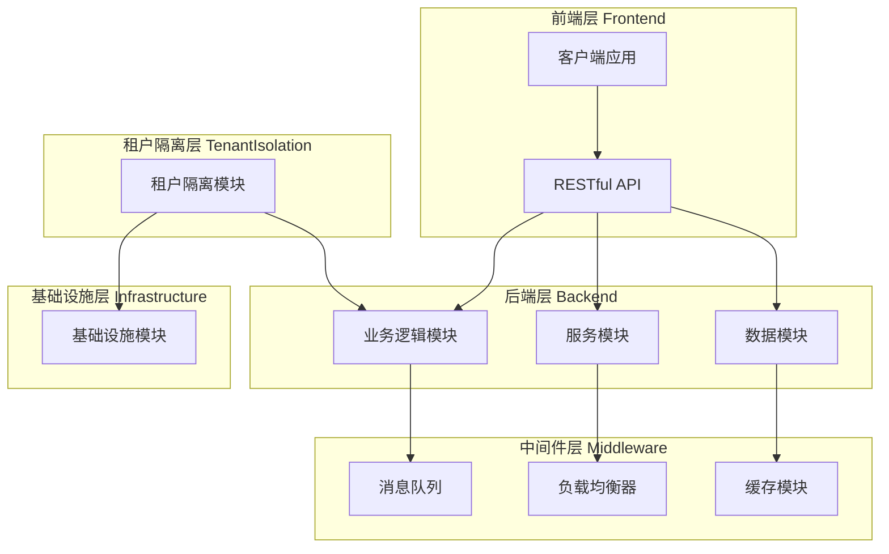
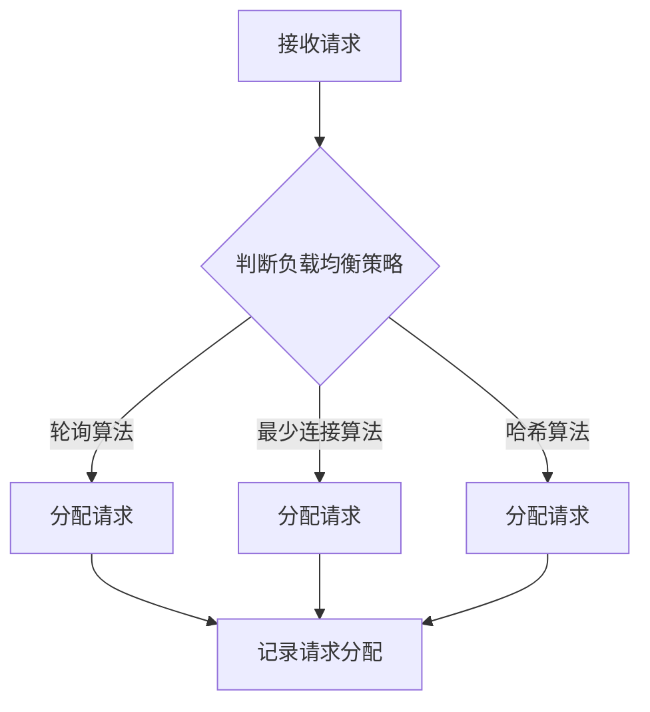
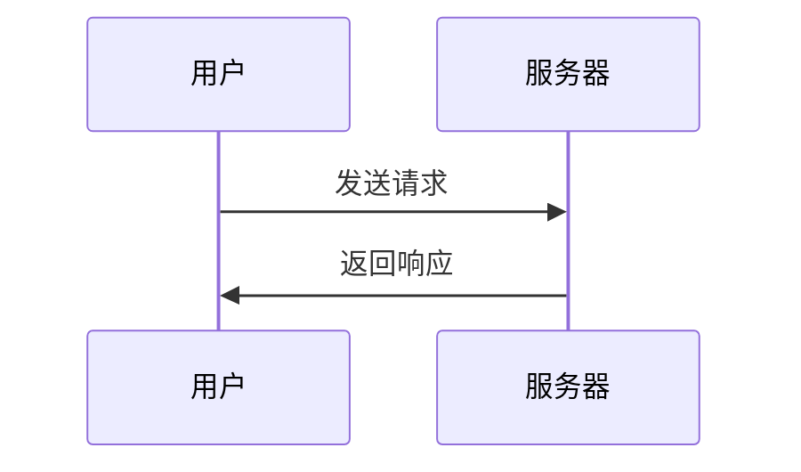

                 


## 引言

在当今全球数字化转型的浪潮中，人工智能（AI）正在迅速成为企业提升竞争力和效率的重要工具。AI Agent作为人工智能的智能实体，具备自主决策和执行任务的能力，正日益受到企业的关注。然而，随着企业规模的扩大和业务需求的多样化，如何实现AI Agent的灵活部署和高效管理成为一个关键挑战。

多租户架构作为云计算时代的重要技术，提供了一种高效、灵活、安全的资源管理方式，它使得多个企业可以在同一套系统上独立运行，共享资源的同时保持数据隔离。结合AI Agent的多租户架构设计，不仅能够实现资源的高效利用，还能够提供灵活的业务扩展和强大的安全性保障。

本文旨在探讨企业AI Agent的多租户架构设计与实现，帮助读者深入了解这一领域的关键概念、设计原则、技术选型、系统实现以及实战案例。通过本文的讲解，读者将能够掌握：

1. **企业AI Agent的基本概念与重要性**：理解AI Agent的作用及其在企业中的应用场景。
2. **多租户架构的基本原理**：掌握多租户架构的定义、优势与挑战。
3. **多租户架构设计与实现**：从设计原则到具体技术实现，提供一整套系统的解决方案。
4. **实战案例分析**：通过实际项目案例，展示多租户架构在企业AI Agent中的应用效果。

接下来的章节将逐步深入探讨上述主题，帮助读者系统地掌握企业AI Agent多租户架构设计与实现的核心内容。

### 关键词

- 企业AI Agent
- 多租户架构
- 云计算
- 资源共享
- 安全性
- 灵活部署
- 扩展性
- 算法实现
- 项目实战

### 摘要

本文深入探讨了企业AI Agent的多租户架构设计与实现。首先，我们介绍了企业AI Agent的基本概念和重要性，以及多租户架构的定义和优势。接着，本文详细阐述了多租户架构的设计原则，包括模块化设计、可扩展性设计和安全性设计。随后，我们讨论了多租户架构的技术选型，包括数据库技术、中间件技术和容器化技术，并推荐了相关开源框架和工具。

在系统实现部分，我们介绍了系统设计与架构，包括数据模块、计费模块、权限管理模块和用户交互模块，以及算法设计与实现、系统接口设计。最后，通过一个实际项目案例，我们展示了多租户架构在企业AI Agent中的应用，包括环境安装与配置、系统核心实现源代码，以及项目小结和最佳实践。

本文旨在为读者提供一份全面、系统的指南，帮助读者理解并掌握企业AI Agent多租户架构设计与实现的核心技术和实践方法。

### 第一部分：背景与核心概念

#### 第1章：企业AI Agent概述

**1.1 问题背景与定义**

随着大数据、云计算和人工智能技术的不断发展，企业面临着日益复杂的业务环境和技术挑战。传统的IT系统往往难以满足快速变化的业务需求，而人工智能（AI）的引入为解决这一问题提供了新的可能性。企业AI Agent作为一种智能实体，正是为了应对这一需求而生的。

企业AI Agent的概念源于智能代理（Intelligent Agent）的概念。智能代理是一种具有自主性和自适应性，能够通过感知环境并采取行动达到特定目标的实体。在企业环境中，AI Agent不仅能够执行具体的任务，还能够与人类用户进行交互，提供智能决策支持。

企业AI Agent的定义可以进一步细化为以下几个方面：

- **自主性**：AI Agent能够自主地执行任务，无需人工干预。
- **适应性**：AI Agent能够根据环境和业务需求的变化，自适应地调整其行为。
- **交互性**：AI Agent能够与人类用户和其他系统进行有效交互，获取信息并反馈结果。
- **智能性**：AI Agent具备一定的智能，能够进行逻辑推理、学习与预测。

**1.1.1 企业AI Agent的产生背景**

企业AI Agent的产生背景可以追溯到以下几个方面：

1. **大数据与云计算的普及**：企业积累了大量的数据资源，这些数据需要通过智能分析来挖掘价值。云计算的普及为数据处理提供了强大的计算能力，而AI Agent则成为数据驱动的业务决策的重要工具。
2. **业务需求的多样化**：现代企业的业务场景复杂多样，传统的IT系统难以满足这些多样化的需求。AI Agent能够根据具体业务场景进行定制化开发，提供更加灵活和高效的解决方案。
3. **自动化与智能化转型**：随着工业4.0和智能制造的推进，企业对于自动化和智能化的需求日益增长。AI Agent作为自动化和智能化的重要组成部分，能够帮助企业实现业务流程的优化和效率提升。

**1.1.2 企业AI Agent的定义**

企业AI Agent是一种专门为商业场景设计的人工智能实体，其核心功能包括：

1. **任务执行**：AI Agent能够根据业务规则和策略，自主地执行具体的任务，如数据采集、处理、分析、决策和报告生成等。
2. **智能交互**：AI Agent能够与人类用户进行自然语言交互，提供智能客服、智能问答等服务。
3. **业务优化**：AI Agent能够通过分析企业业务数据，提供业务优化建议，如供应链管理、销售策略调整、市场预测等。

**1.1.3 企业AI Agent的重要性**

企业AI Agent的重要性体现在以下几个方面：

1. **提高效率**：AI Agent能够自动化执行重复性高、规则明确的工作，减少人力成本，提高工作效率。
2. **优化决策**：AI Agent能够基于数据分析和预测，提供智能决策支持，帮助企业做出更加准确和高效的决策。
3. **提升用户体验**：AI Agent能够提供个性化、智能化的服务，提升用户体验，增强客户满意度。
4. **增强竞争力**：AI Agent能够帮助企业快速响应市场变化，优化业务流程，提升企业的核心竞争力。

**1.2 AI Agent的核心概念与特征**

AI Agent作为一种人工智能实体，具有以下几个核心概念和特征：

1. **自主性**：AI Agent能够自主地感知环境、理解指令、执行任务和反馈结果，无需人工干预。
2. **适应性**：AI Agent能够根据环境变化和业务需求，自适应地调整其行为和策略。
3. **交互性**：AI Agent能够通过自然语言处理、语音识别等技术，与人类用户进行有效的交互。
4. **智能性**：AI Agent具备智能算法和模型，能够进行数据分析和预测，提供智能决策支持。

**1.2.1 AI Agent的基本概念**

AI Agent的基本概念可以概括为以下几点：

- **感知**：AI Agent能够通过传感器、数据接口等感知环境信息。
- **理解**：AI Agent能够理解感知到的信息，并进行语义分析和知识提取。
- **决策**：AI Agent能够基于理解和分析结果，制定决策策略。
- **执行**：AI Agent能够根据决策策略，执行具体的任务操作。
- **反馈**：AI Agent能够反馈任务执行结果，并根据反馈结果调整后续行为。

**1.2.2 AI Agent的核心特征**

AI Agent的核心特征主要包括：

1. **自主性**：AI Agent能够自主地执行任务，无需人工干预。这种自主性是AI Agent区别于传统自动化工具的关键特征。
2. **适应性**：AI Agent能够根据环境和业务需求的变化，自适应地调整其行为和策略。这种适应性使得AI Agent能够应对复杂的业务场景。
3. **交互性**：AI Agent能够与人类用户进行有效的交互，提供智能客服、智能问答等服务。这种交互性增强了AI Agent的实用性和用户体验。
4. **智能性**：AI Agent具备智能算法和模型，能够进行数据分析和预测，提供智能决策支持。这种智能性是AI Agent的核心竞争力。

**1.2.3 AI Agent与传统AI的比较**

AI Agent与传统AI之间存在一些显著的区别：

1. **主动性**：传统AI系统通常是基于预定义的规则或模型进行任务执行，而AI Agent具有主动性，能够自主感知环境并采取行动。
2. **交互性**：传统AI系统通常缺乏与用户的直接交互能力，而AI Agent能够与用户进行自然语言交互，提供更加人性化的服务。
3. **适应性**：传统AI系统在复杂多变的环境中往往难以适应，而AI Agent具备良好的适应性，能够根据环境变化进行调整。
4. **任务执行范围**：传统AI系统通常针对特定的任务进行优化，而AI Agent能够执行多种任务，具有更广泛的适用性。

**1.3 多租户架构的基本原理**

多租户架构（Multi-Tenant Architecture）是一种在云计算环境中广泛应用的架构模式，它允许多个独立的客户或组织（称为租户）共享同一套基础设施和应用程序，同时保持数据隔离。多租户架构的核心原理包括：

1. **共享基础设施**：多个租户共享同一套基础设施资源，如服务器、存储和网络，从而实现资源的最大化利用。
2. **数据隔离**：通过隔离数据库、应用程序层和用户界面，确保每个租户的数据和应用环境相互独立，避免数据泄露和冲突。
3. **灵活部署**：多租户架构支持灵活的部署和扩展，租户可以根据自身需求动态调整资源分配。

**1.3.1 多租户架构的定义**

多租户架构的定义可以概括为：一种软件架构模式，允许多个独立的客户或组织（租户）共享同一套基础设施和应用程序，同时保持数据和应用环境的隔离。多租户架构通常具有以下特点：

- **共享性**：租户共享基础设施资源，如服务器、存储和网络，从而实现资源的高效利用。
- **独立性**：租户的数据和应用环境相互独立，确保数据安全和隐私保护。
- **灵活性**：租户可以根据自身需求动态调整资源分配，实现灵活部署和扩展。

**1.3.2 多租户架构的优势**

多租户架构具有以下优势：

1. **成本效益**：通过共享基础设施资源，多租户架构能够降低企业的IT成本，提高资源利用率。
2. **灵活部署**：多租户架构支持灵活的部署和扩展，租户可以根据需求动态调整资源分配，实现快速部署和响应。
3. **安全性**：多租户架构通过严格的隔离机制，确保租户数据和应用环境的安全，降低安全风险。
4. **高可用性**：多租户架构支持分布式部署，提高系统的可用性和容灾能力。

**1.3.3 多租户架构的挑战**

多租户架构在带来诸多优势的同时，也面临一些挑战：

1. **性能优化**：多租户架构需要在共享资源的前提下，保证租户之间的性能隔离和稳定性，这对性能优化提出了更高的要求。
2. **数据隔离**：确保租户数据和应用环境的隔离是多租户架构的关键，但在实现过程中往往存在技术挑战。
3. **合规性**：不同国家和地区的法规对于数据隐私和保护有不同的要求，多租户架构需要满足这些合规性要求。

**1.4 企业AI Agent与多租户架构的结合**

将企业AI Agent与多租户架构相结合，能够充分发挥两者的优势，为企业提供更加高效、灵活和安全的解决方案。以下从几个方面探讨企业AI Agent与多租户架构的结合：

1. **资源利用最大化**：通过多租户架构，企业AI Agent能够充分利用共享资源，实现高效计算和存储。
2. **灵活扩展**：多租户架构支持灵活的扩展，企业AI Agent可以根据业务需求动态调整资源分配，实现快速响应。
3. **数据隔离与安全**：多租户架构提供严格的数据隔离机制，确保企业AI Agent在不同租户之间实现数据安全和隐私保护。
4. **智能决策支持**：企业AI Agent能够通过多租户架构获取不同租户的数据，提供智能决策支持，优化业务运营。

**1.4.1 结合的必要性与可行性**

将企业AI Agent与多租户架构结合的必要性与可行性体现在以下几个方面：

1. **必要性**：随着企业业务复杂度和数据量的增加，传统的单一架构难以满足高效、灵活和安全的要求，多租户架构能够提供更好的解决方案。
2. **可行性**：云计算和人工智能技术的快速发展，为多租户架构和企业AI Agent的结合提供了技术基础和实践经验。

**1.4.2 结合的实现路径**

结合的实现路径可以从以下几个方面进行：

1. **设计阶段**：在设计阶段，明确企业AI Agent与多租户架构的需求和目标，制定相应的技术方案。
2. **开发阶段**：在开发阶段，根据设计要求，实现企业AI Agent的多租户架构，包括数据隔离、资源管理、安全控制等关键功能。
3. **部署阶段**：在部署阶段，将企业AI Agent部署到多租户环境中，进行性能测试和优化，确保系统稳定性和安全性。
4. **运维阶段**：在运维阶段，对系统进行监控、维护和升级，确保企业AI Agent的多租户架构持续稳定运行。

**1.4.3 成功案例介绍**

以下介绍两个成功案例，展示企业AI Agent与多租户架构结合的实际应用效果：

1. **案例一**：某大型电商企业采用多租户架构部署其智能客服系统，通过企业AI Agent实现个性化客服和智能问答，提高了客户满意度和服务效率。
2. **案例二**：某制造企业采用多租户架构部署其生产监控系统，通过企业AI Agent实现实时数据分析和故障预测，提高了生产效率和设备利用率。

**1.5 本章小结**

本章介绍了企业AI Agent的基本概念和重要性，以及多租户架构的定义、优势与挑战。通过本章的学习，读者能够了解企业AI Agent与多租户架构结合的必要性和可行性，为后续章节的学习打下基础。

### 第2章：多租户架构设计原则

**2.1 设计原则概述**

多租户架构的设计原则是确保系统实现高效、灵活和安全的关键。设计原则不仅指导架构的规划和实现，还为后续的系统开发、运维和优化提供指导。以下是多租户架构设计的主要原则：

1. **模块化设计**：模块化设计将系统划分为若干独立的功能模块，每个模块负责特定的功能，从而实现系统的高内聚、低耦合。模块化设计有助于提高系统的可维护性和扩展性。
2. **可扩展性设计**：可扩展性设计旨在确保系统能够根据业务需求的变化，灵活地扩展其功能和服务。可扩展性设计包括水平扩展（增加服务器数量）和垂直扩展（提高单个服务器的性能）。
3. **安全性设计**：安全性设计是确保系统数据和资源安全的重要措施。多租户架构需要在租户之间实现严格的数据隔离，防止数据泄露和冲突。此外，还需要实施细粒度的权限管理和安全审计机制。
4. **可维护性设计**：可维护性设计旨在确保系统的稳定性和易维护性。通过合理的系统架构设计、规范的编码实践和完善的测试流程，降低系统的故障率和维护成本。

**2.2 模块化设计**

模块化设计是多租户架构的核心原则之一。模块化设计将系统划分为多个独立的功能模块，每个模块具有明确的功能和职责。以下是模块化设计的关键点：

1. **功能划分**：根据系统的功能需求，将系统划分为若干独立的模块，每个模块负责特定的功能。功能划分应遵循高内聚、低耦合的原则，确保模块之间相互独立，便于开发和维护。
2. **模块独立性**：每个模块应具有高度的独立性，模块之间的交互应通过标准的接口进行。模块独立性有助于降低模块之间的耦合度，提高系统的可维护性和扩展性。
3. **模块内部结构**：每个模块应具有清晰的结构和职责，模块内部功能模块之间应保持高内聚，降低模块内部复杂性。模块内部结构设计应遵循面向对象设计原则，如单一职责原则、开闭原则等。
4. **模块间通信**：模块之间通过标准的接口进行通信，接口设计应遵循松耦合原则，降低模块之间的依赖关系。模块间通信协议应支持高效的数据传输和远程调用。

**2.2.1 模块化的定义与意义**

模块化是一种设计方法和理念，通过将系统划分为多个独立的模块，实现系统功能的分解和组合。模块化的定义可以概括为：

1. **模块化**：将复杂系统划分为若干独立的功能模块，每个模块具有明确的功能和职责，模块之间通过标准接口进行通信和协作。
2. **模块化意义**：模块化设计具有以下重要意义：

- **提高系统可维护性**：模块化设计将系统划分为多个独立的功能模块，降低系统的复杂度，提高系统的可维护性和可扩展性。
- **促进代码复用**：模块化设计有助于实现代码的复用，减少冗余代码，提高开发效率。
- **简化系统开发**：模块化设计将系统功能分解为多个独立模块，简化了系统开发过程，降低开发难度。
- **增强系统可扩展性**：模块化设计使得系统功能模块之间保持低耦合，便于系统扩展和功能增加。

**2.2.2 模块化设计的关键点**

模块化设计的关键点包括以下几个方面：

1. **功能划分**：根据系统的功能需求，将系统划分为若干独立的功能模块，每个模块负责特定的功能。功能划分应遵循高内聚、低耦合的原则。
2. **模块独立性**：每个模块应具有高度的独立性，模块之间的交互应通过标准的接口进行。模块独立性有助于降低模块之间的耦合度，提高系统的可维护性和扩展性。
3. **模块内部结构**：每个模块应具有清晰的结构和职责，模块内部功能模块之间应保持高内聚，降低模块内部复杂性。模块内部结构设计应遵循面向对象设计原则。
4. **模块间通信**：模块之间通过标准的接口进行通信，接口设计应遵循松耦合原则，降低模块之间的依赖关系。模块间通信协议应支持高效的数据传输和远程调用。

**2.2.3 模块化的实现策略**

模块化的实现策略包括以下几个方面：

1. **模块划分**：根据系统的功能和业务需求，将系统划分为若干独立的模块。模块划分应遵循高内聚、低耦合的原则，确保模块之间相互独立，便于开发和维护。
2. **模块内部设计**：每个模块内部的设计应遵循面向对象设计原则，如单一职责原则、开闭原则等。模块内部功能模块之间应保持高内聚，降低模块内部复杂性。
3. **模块间接口设计**：模块之间通过标准的接口进行通信，接口设计应遵循松耦合原则。接口设计应明确模块之间的交互方式和数据传输格式，支持高效的数据传输和远程调用。
4. **模块组装**：通过模块组装的方式，将多个独立的模块组合成一个完整的系统。模块组装应遵循模块化设计原则，确保模块之间的高内聚、低耦合。

**2.3 可扩展性设计**

可扩展性设计是确保系统能够根据业务需求的变化，灵活地扩展其功能和服务的重要原则。以下是可扩展性设计的关键点：

1. **水平扩展**：水平扩展（Scaling Out）是指通过增加服务器数量来提升系统的处理能力和性能。水平扩展有助于提高系统的可用性和容灾能力。
2. **垂直扩展**：垂直扩展（Scaling Up）是指通过提高单个服务器的性能来提升系统的处理能力和性能。垂直扩展有助于提高系统的稳定性和性能。
3. **弹性扩展**：弹性扩展（Elastic Scaling）是指系统根据实际负载自动调整资源分配，实现资源的动态扩展和收缩。弹性扩展有助于提高系统的灵活性和资源利用率。

**2.3.1 可扩展性的定义与目标**

可扩展性（Scalability）是指系统在处理能力和性能方面的扩展能力。可扩展性的定义可以概括为：

1. **可扩展性**：系统在处理能力和性能方面的扩展能力，能够根据业务需求的变化，灵活地调整资源分配，提升系统性能和稳定性。
2. **可扩展性目标**：可扩展性设计的目标包括：

- **性能提升**：通过扩展系统资源，提升系统的处理能力和性能。
- **资源利用率**：通过灵活的资源分配，提高系统资源的利用率。
- **高可用性**：通过分布式部署和冗余设计，提高系统的可用性和容灾能力。
- **灵活性**：能够根据业务需求的变化，灵活地调整系统资源和服务。

**2.3.2 可扩展性设计的方法**

可扩展性设计的方法包括以下几个方面：

1. **水平扩展**：通过增加服务器数量来提升系统的处理能力和性能。水平扩展的方法包括：

- **集群部署**：将多个服务器组成一个集群，通过负载均衡器实现负载分配和故障转移。
- **分布式数据库**：通过分布式数据库实现数据的水平扩展，提高系统的读写性能和并发能力。

2. **垂直扩展**：通过提高单个服务器的性能来提升系统的处理能力和性能。垂直扩展的方法包括：

- **硬件升级**：升级服务器的CPU、内存、存储等硬件设备，提高系统的处理能力和存储容量。
- **优化性能**：通过优化系统代码和配置，提高系统的性能和稳定性。

3. **弹性扩展**：通过弹性扩展技术，实现系统资源的动态分配和调整。弹性扩展的方法包括：

- **自动化部署**：通过自动化部署工具，实现系统的快速部署和扩展。
- **监控与调度**：通过监控系统，实时监控系统性能和负载，根据实际负载动态调整资源分配。

**2.3.3 可扩展性设计的评估**

可扩展性设计的评估主要包括以下几个方面：

1. **性能测试**：通过性能测试，评估系统的处理能力和响应时间，确定系统是否达到设计目标。
2. **负载测试**：通过负载测试，评估系统在高负载情况下的性能和稳定性，确定系统是否能够应对高峰期的负载。
3. **扩展测试**：通过扩展测试，评估系统在资源扩展后的性能和稳定性，确定系统扩展是否成功。
4. **故障测试**：通过故障测试，评估系统在故障情况下的恢复能力和稳定性，确定系统的容灾能力。

**2.4 安全性与隐私保护**

安全性与隐私保护是多租户架构设计的关键原则之一。多租户架构需要在租户之间实现严格的数据隔离和安全控制，确保系统安全性和数据隐私。以下是安全性设计的关键点：

1. **数据隔离**：通过隔离机制，确保租户的数据和应用环境相互独立，防止数据泄露和冲突。数据隔离的方法包括：

- **数据库隔离**：为每个租户创建独立的数据库实例，确保租户数据存储独立。
- **应用层隔离**：通过虚拟化技术，为每个租户提供独立的运行环境，确保租户应用相互独立。
2. **权限管理**：通过权限管理机制，确保租户只能访问和操作其授权的数据和应用资源。权限管理的方法包括：

- **细粒度权限控制**：通过细粒度权限控制，为租户分配不同的权限级别，确保租户只能访问其授权的资源。
- **角色与权限管理**：通过角色与权限管理，为租户分配不同的角色，根据角色分配相应的权限。

3. **安全审计**：通过安全审计机制，记录系统的访问和操作日志，实现系统的安全监控和审计。安全审计的方法包括：

- **日志记录**：记录系统的访问和操作日志，包括用户登录、数据访问、系统操作等信息。
- **审计分析**：对日志进行分析和审计，及时发现和防范安全风险。

**2.4.1 安全性与隐私保护的挑战**

多租户架构在安全性和隐私保护方面面临以下挑战：

1. **数据泄露**：多租户架构中的数据共享和共享资源可能导致数据泄露，需要采取严格的数据隔离和安全控制措施。
2. **权限滥用**：租户可能滥用权限，访问和操作其他租户的数据和应用资源，需要实施细粒度权限管理和审计机制。
3. **系统漏洞**：多租户架构中的系统漏洞可能导致租户数据泄露和系统攻击，需要定期进行安全检测和漏洞修复。

**2.4.2 安全性与隐私保护的设计策略**

为了确保多租户架构的安全性和隐私保护，可以采取以下设计策略：

1. **数据隔离**：通过数据库隔离、应用层隔离等技术，实现租户数据和应用环境的严格隔离。
2. **权限管理**：通过细粒度权限控制和角色与权限管理，确保租户只能访问和操作其授权的数据和应用资源。
3. **安全审计**：通过安全审计机制，记录系统的访问和操作日志，实现系统的安全监控和审计。
4. **安全检测**：通过安全检测工具，定期对系统进行安全检测和漏洞修复，提高系统的安全性。

**2.4.3 安全性与隐私保护的实现技术**

多租户架构的安全性与隐私保护可以通过以下技术实现：

1. **数据库隔离**：使用分布式数据库技术，为每个租户创建独立的数据库实例，确保租户数据存储独立。
2. **应用层隔离**：通过虚拟化技术，为每个租户提供独立的运行环境，确保租户应用相互独立。
3. **细粒度权限控制**：使用访问控制列表（ACL）和角色与权限管理，实现租户的细粒度权限控制。
4. **安全审计**：使用日志记录和审计分析工具，记录系统的访问和操作日志，实现系统的安全监控和审计。
5. **加密技术**：使用加密技术，保护租户数据在传输和存储过程中的安全性。

**2.5 本章小结**

本章介绍了多租户架构设计的主要原则，包括模块化设计、可扩展性设计、安全性与隐私保护设计。通过模块化设计，实现系统功能的高内聚、低耦合；通过可扩展性设计，确保系统在处理能力和性能方面的扩展能力；通过安全性与隐私保护设计，确保系统数据和资源的安全。本章为多租户架构的后续设计和实现提供了重要的指导原则。

### 第3章：多租户架构的技术选型

**3.1 技术选型概述**

多租户架构的实现涉及到多个关键技术的选型，这些技术包括数据库技术、中间件技术和容器化技术。技术选型是确保系统性能、安全性和可扩展性的关键步骤。以下是技术选型的基本原则和考虑因素。

**3.1.1 技术选型的基本原则**

1. **性能与稳定性**：选择具备高性能和稳定性的技术，确保系统在高峰期和压力测试中的稳定运行。
2. **可扩展性**：选择支持水平扩展和垂直扩展的技术，以适应业务需求的动态变化。
3. **安全性**：选择具有严格安全机制和加密功能的技术，确保租户数据的安全和隐私。
4. **兼容性与生态**：选择具备良好兼容性和生态支持的技术，便于系统的集成和维护。
5. **成本效益**：选择在性能、安全和可扩展性方面具有成本效益的技术，以最大化投资回报。

**3.1.2 技术选型的考虑因素**

1. **业务需求**：根据具体的业务需求，选择能够满足数据处理、存储、安全和扩展要求的技术。
2. **技术成熟度**：选择成熟稳定的技术，降低技术风险和系统维护成本。
3. **社区和生态**：选择具有活跃社区和丰富生态支持的技术，便于获取技术支持和资源。
4. **成本**：综合考虑技术采购、部署和运营成本，选择在预算范围内的技术。
5. **未来趋势**：关注技术发展趋势和未来规划，选择具备长期发展潜力的技术。

**3.2 关键技术分析**

**3.2.1 数据库技术**

数据库技术是多租户架构的核心组成部分，负责数据存储、查询和管理。以下是几种常见的数据库技术：

1. **关系型数据库**：如MySQL、PostgreSQL等，适用于结构化数据存储和查询，具有良好的事务处理能力和数据一致性保障。
2. **NoSQL数据库**：如MongoDB、Cassandra等，适用于大规模数据的存储和高速读写，具有灵活的数据模型和高可用性。
3. **分布式数据库**：如Redis、Riak等，适用于分布式数据存储和高并发处理，提供自动分片和数据复制功能。

**3.2.2 中间件技术**

中间件技术负责连接前端应用和后端数据库，提供数据传输、消息处理、服务监控等功能。以下是几种常见的中间件技术：

1. **消息队列**：如RabbitMQ、Kafka等，用于异步消息传递和任务调度，提供高吞吐量和低延迟的消息处理能力。
2. **服务网关**：如NGINX、Apache等，用于统一入口管理和负载均衡，提供高性能的网络请求处理能力。
3. **服务框架**：如Spring Cloud、Dubbo等，用于分布式服务管理和微服务架构，提供服务发现、负载均衡和容错处理等功能。

**3.2.3 容器化技术**

容器化技术使得应用可以在不同的环境中一致运行，提供高效的资源利用和部署灵活性。以下是几种常见的容器化技术：

1. **Docker**：用于创建容器化应用，提供轻量级、可移植的运行环境，简化应用部署和运维。
2. **Kubernetes**：用于容器编排和管理，提供自动化部署、扩展和运维功能，支持大规模分布式应用管理。
3. **虚拟化技术**：如VMware、Xen等，提供虚拟化层，隔离应用和操作系统，提高资源利用率和系统稳定性。

**3.3 开源框架与工具推荐**

**3.3.1 开源框架的重要性**

开源框架和工具在多租户架构的实现中起着至关重要的作用，它们提供了丰富的功能、灵活的扩展性和强大的社区支持。以下是几种常用的开源框架和工具：

1. **Kubernetes**：用于容器编排和管理，提供自动化部署、扩展和运维功能，支持大规模分布式应用管理。
2. **Elasticsearch**：用于全文搜索和实时分析，提供高效的数据存储和检索能力，适用于日志分析和监控。
3. **Apache Kafka**：用于实时消息传递和流处理，提供高吞吐量和低延迟的消息处理能力，适用于大数据处理和实时分析。
4. **Spring Cloud**：用于分布式服务管理和微服务架构，提供服务发现、负载均衡和容错处理等功能。
5. **Redis**：用于高速缓存和实时数据存储，提供高效的读写性能和持久化能力。

**3.3.2 常用开源框架与工具**

以下是常用开源框架与工具的详细介绍：

1. **Kubernetes**：
   - **功能**：容器编排和管理，自动化部署、扩展和运维。
   - **适用场景**：大规模分布式应用管理，容器化应用部署和资源调度。
   - **优势**：自动扩缩容、高可用性、负载均衡、故障恢复。

2. **Elasticsearch**：
   - **功能**：全文搜索和实时分析，数据存储和检索。
   - **适用场景**：日志分析、实时监控、数据检索和大数据处理。
   - **优势**：快速检索、全文搜索、数据聚合、实时分析。

3. **Apache Kafka**：
   - **功能**：实时消息传递和流处理，数据传输和事件驱动架构。
   - **适用场景**：大数据处理、实时数据流处理、日志收集和监控。
   - **优势**：高吞吐量、低延迟、分布式处理、持久化存储。

4. **Spring Cloud**：
   - **功能**：分布式服务管理和微服务架构，服务发现、负载均衡、容错处理。
   - **适用场景**：分布式系统、微服务架构、服务治理和协调。
   - **优势**：易于集成、服务发现、负载均衡、断路器机制。

5. **Redis**：
   - **功能**：高速缓存和实时数据存储，键值存储和持久化能力。
   - **适用场景**：缓存系统、实时数据存储、会话管理和实时分析。
   - **优势**：高性能、持久化、分布式支持、丰富的数据结构。

**3.3.3 选择开源框架的技巧**

选择开源框架时，需要考虑以下几个方面：

1. **功能与适用性**：确保开源框架的功能能够满足项目需求，适用于业务场景。
2. **社区与支持**：选择具有活跃社区和丰富文档的开源框架，便于获取技术支持和资源。
3. **兼容性与生态**：选择兼容性强、生态丰富的开源框架，便于与其他系统和工具集成。
4. **性能与稳定性**：评估开源框架的性能和稳定性，确保其能够满足系统的性能要求。
5. **安全性**：确保开源框架具有严格的安全机制和加密功能，保护租户数据和隐私。

**3.4 本章小结**

本章介绍了多租户架构的技术选型，包括数据库技术、中间件技术和容器化技术。通过分析关键技术和推荐开源框架与工具，帮助读者了解多租户架构实现的技术基础。本章内容为多租户架构的系统实现提供了重要的参考和指导。

### 第4章：多租户架构的系统实现

**4.1 系统设计与架构**

**4.1.1 系统整体架构设计**

多租户架构的系统设计需要考虑租户隔离、资源管理和安全性等关键要素。以下是一个典型的多租户架构系统整体架构设计：

1. **前端层**：前端层包括用户界面和客户端应用程序，负责与用户进行交互。前端层通过RESTful API或GraphQL与后端层进行通信。
2. **后端层**：后端层包括核心业务逻辑、服务层和数据层。核心业务逻辑负责处理业务逻辑，服务层负责提供公共服务，数据层负责数据存储和管理。
3. **租户隔离层**：租户隔离层负责实现租户之间的数据隔离和资源隔离。通过虚拟化技术或数据隔离技术，确保不同租户的数据和应用环境相互独立。
4. **中间件层**：中间件层包括消息队列、负载均衡器和缓存等组件，负责数据传输、负载均衡和缓存功能。
5. **基础设施层**：基础设施层包括服务器、存储和网络等硬件资源，负责提供系统运行的基础设施。

**4.1.2 各模块功能设计与交互**

以下是对多租户架构系统中各模块的功能设计和交互说明：

1. **前端模块**：
   - **功能**：提供用户界面和交互逻辑，支持用户操作和数据显示。
   - **交互**：通过RESTful API或GraphQL与后端模块进行交互，请求业务逻辑处理和数据查询。

2. **后端模块**：
   - **业务逻辑模块**：处理核心业务逻辑，包括业务流程控制、数据操作和业务规则管理。
   - **服务模块**：提供公共服务，如身份验证、权限管理和日志记录等。
   - **数据模块**：负责数据存储和管理，包括数据持久化和数据访问控制。

3. **租户隔离模块**：
   - **功能**：实现租户数据和应用环境的隔离，确保不同租户之间的数据安全和独立运行。
   - **交互**：与后端模块进行交互，根据租户标识过滤数据访问和业务处理。

4. **中间件模块**：
   - **消息队列**：负责消息传递和异步处理，确保系统的解耦和可靠通信。
   - **负载均衡器**：负责请求分发和流量管理，提高系统的性能和可用性。
   - **缓存模块**：提供数据缓存功能，降低数据库访问压力，提高系统响应速度。

5. **基础设施模块**：
   - **功能**：提供服务器、存储和网络等基础设施资源，确保系统的稳定运行。
   - **交互**：与租户隔离模块和中间件模块进行交互，分配和管理资源。

**4.1.3 Mermaid架构图**

以下是一个多租户架构系统的Mermaid架构图：



**4.2 系统功能模块实现**

**4.2.1 数据模块**

数据模块是系统实现的核心部分，负责数据存储、查询和管理。以下是对数据模块的实现说明：

1. **数据库选择**：选择关系型数据库（如MySQL）或NoSQL数据库（如MongoDB）进行数据存储。关系型数据库适用于结构化数据存储和查询，NoSQL数据库适用于大规模数据存储和高速读写。

2. **数据隔离**：通过在数据库中创建独立的租户数据库实例，实现租户之间的数据隔离。每个租户拥有独立的数据库实例，确保数据安全和隐私。

3. **数据访问控制**：通过身份验证和权限管理机制，确保租户只能访问其授权的数据。使用访问控制列表（ACL）或角色与权限管理，为租户分配不同的访问权限。

4. **数据持久化**：使用ORM（对象关系映射）框架或数据库连接池，实现数据的持久化存储和高效查询。

**4.2.2 计费模块**

计费模块负责计算和管理租户的使用费用，以下是对计费模块的实现说明：

1. **计费策略**：根据租户的使用情况（如数据存储、计算资源、网络流量等），制定相应的计费策略。计费策略应考虑多种收费模式，如按需计费、包月计费等。

2. **费用计算**：根据租户的使用情况和计费策略，计算租户的费用。费用计算应支持实时计算和批量计算，确保计费的准确性。

3. **费用通知**：通过邮件、短信等方式，通知租户其使用情况和费用。费用通知应包括使用明细、欠费提醒和缴费指南等。

4. **费用记录**：记录租户的费用和使用情况，便于后续查询和管理。使用日志记录和审计工具，确保计费数据的完整性和准确性。

**4.2.3 权限管理模块**

权限管理模块负责实现租户的身份验证和权限控制，以下是对权限管理模块的实现说明：

1. **用户身份验证**：通过用户名和密码、二因素认证等方式，实现用户身份验证。确保只有授权用户能够访问系统资源。

2. **角色与权限管理**：定义不同的角色和权限，为租户分配不同的角色和权限。角色和权限应覆盖系统中的各类资源和操作，确保租户只能访问和操作其授权的资源。

3. **权限控制**：通过访问控制列表（ACL）或角色与权限管理，实现细粒度的权限控制。权限控制应支持自定义权限策略和权限委派。

4. **权限审计**：记录租户的访问和操作日志，实现系统的权限审计。权限审计应包括用户登录、数据访问、系统操作等信息，便于后续审计和追溯。

**4.2.4 用户交互模块**

用户交互模块负责实现用户与系统的交互，以下是对用户交互模块的实现说明：

1. **用户界面设计**：设计简洁易用的用户界面，支持用户操作和数据显示。用户界面应考虑用户体验和易用性。

2. **交互逻辑实现**：通过前端技术（如HTML、CSS、JavaScript等），实现用户界面的交互逻辑。交互逻辑应包括表单验证、数据提交、页面跳转等。

3. **API设计**：设计统一的RESTful API或GraphQL接口，提供系统功能调用和数据查询。API设计应遵循简洁、规范、易用的原则。

4. **用户体验优化**：通过用户调研、用户测试等方式，优化用户交互体验。用户体验优化应包括界面美观、响应速度、交互流畅性等。

**4.3 算法设计与实现**

**4.3.1 相关算法原理**

多租户架构中的算法设计主要包括数据隔离算法、负载均衡算法和计费算法等。以下是对相关算法原理的介绍：

1. **数据隔离算法**：数据隔离算法通过租户标识和访问控制策略，确保不同租户的数据存储和查询相互独立。常见的隔离算法包括数据库隔离、表空间隔离和行级隔离等。

2. **负载均衡算法**：负载均衡算法通过调度和分配请求，确保系统资源的高效利用和性能优化。常见的负载均衡算法包括轮询算法、最少连接算法和哈希算法等。

3. **计费算法**：计费算法根据租户的使用情况和计费策略，计算租户的费用。常见的计费算法包括基于使用量的计费、基于资源规模的计费和混合计费等。

**4.3.2 Mermaid算法流程图**

以下是一个多租户架构中的负载均衡算法流程图的示例：



**4.3.3 算法实现代码**

以下是一个简单的基于轮询算法的负载均衡代码示例（Python）：

```python
import random

def load_balancer(backend_servers):
    return random.choice(backend_servers)

backend_servers = ["server1", "server2", "server3"]
request = "new_request"

backend_server = load_balancer(backend_servers)
print(f"Request '{request}' assigned to server: {backend_server}")
```

**4.3.4 数学模型与公式**

以下是一个简单的负载均衡算法的数学模型和公式：

- **负载均衡概率**：P(server_i) = 1/n，其中 n 是服务器总数。
- **请求分配**：选择服务器 i，满足分配概率 P(server_i)。

**4.3.5 举例说明**

以下是一个负载均衡算法的示例说明：

假设有3个服务器 server1、server2 和 server3，请求 new_request 需要被分配到其中一个服务器。根据轮询算法，每个服务器被选中的概率相等，即 1/3。使用 Python 代码进行随机分配，结果如下：

```shell
$ python load_balancer_example.py
Request 'new_request' assigned to server: server2
```

结果显示，请求 new_request 被分配到了 server2。

**4.4 系统接口设计**

**4.4.1 接口规范与设计**

系统接口设计包括API接口的定义、数据格式和交互协议等。以下是一个典型的API接口规范设计示例：

- **接口名称**：/api/tenant/isolation
- **请求方法**：GET
- **路径参数**：/tenant/{tenant_id}
- **请求头**：
  - Content-Type: application/json
  - Authorization: Bearer {access_token}
- **请求体**：
  - tenant_id (字符串)：租户标识
- **响应体**：
  - success (布尔值)：操作是否成功
  - message (字符串)：操作结果信息
  - data (对象)：操作返回的数据

**4.4.2 Mermaid接口序列图**

以下是一个API接口序列图的示例：



**4.5 本章小结**

本章详细介绍了多租户架构的系统设计与实现，包括系统架构设计、功能模块实现、算法设计与实现和系统接口设计。通过本章的学习，读者可以了解多租户架构的实现方法和关键要素，为实际项目的开发和部署提供指导。

### 第5章：企业AI Agent多租户架构项目实战

**5.1 项目背景与目标**

随着某大型电商平台的业务不断扩展，传统的人工客服已经无法满足日益增长的用户需求。为了提升用户体验和服务效率，公司决定采用企业AI Agent多租户架构，实现智能客服系统。该项目的目标如下：

1. **提高客户满意度**：通过智能客服系统，提供24/7全天候服务，提升客户满意度。
2. **提升服务效率**：自动化处理常见问题，减少人工客服的工作量，提高服务效率。
3. **降低运营成本**：通过自动化和智能化，降低人工成本和运营成本。
4. **灵活扩展**：支持多租户架构，满足不同客户的需求，实现业务的灵活扩展。

**5.2 环境安装与配置**

为了实现企业AI Agent多租户架构，需要搭建一个合适的技术环境。以下是环境安装与配置的步骤：

1. **硬件环境要求**：
   - 服务器：至少2台服务器，用于负载均衡和高可用性。
   - 存储：足够的存储空间，用于数据存储和备份。
   - 网络：高速稳定的网络连接，支持高并发访问。

2. **软件环境安装**：
   - 操作系统：Linux发行版（如Ubuntu 18.04）
   - 运行环境：Python 3.8及以上版本、Node.js 10及以上版本
   - 数据库：MySQL 8.0及以上版本或MongoDB 4.0及以上版本
   - 中间件：Kafka 2.4及以上版本、Elasticsearch 7.0及以上版本

3. **配置与调试**：
   - 配置服务器网络，确保内网通信和安全。
   - 安装和配置Kafka，用于消息传递和流处理。
   - 安装和配置Elasticsearch，用于全文搜索和实时分析。
   - 配置负载均衡器，如NGINX，实现流量分配和故障转移。
   - 配置数据库，创建租户数据库实例，确保数据隔离。

**5.3 系统核心实现源代码**

以下是企业AI Agent多租户架构系统核心实现的源代码，包括数据库操作、API接口、负载均衡、消息队列和日志记录等关键部分。

1. **数据库操作**：

```python
# db.py
import pymysql

class Database:
    def __init__(self, host, user, password, database):
        self.connection = pymysql.connect(host, user, password, database)

    def query(self, query, params=None):
        with self.connection.cursor() as cursor:
            cursor.execute(query, params)
            result = cursor.fetchall()
            return result

    def commit(self):
        self.connection.commit()

    def close(self):
        self.connection.close()
```

2. **API接口**：

```python
# api.py
from flask import Flask, request, jsonify
from db import Database

app = Flask(__name__)

@app.route('/api/tenant/isolation', methods=['GET'])
def tenant_isolation():
    tenant_id = request.args.get('tenant_id')
    database = Database('localhost', 'root', 'password', 'tenant_db')
    data = database.query("SELECT * FROM users WHERE tenant_id = %s", (tenant_id,))
    return jsonify(success=True, message="Tenant data fetched", data=data)
```

3. **负载均衡**：

```shell
# LoadBalancer.sh
#!/bin/bash

# NGINX配置文件
cat <<EOF
http {
    upstream backend {
        server server1:80;
        server server2:80;
    }

    server {
        listen 80;

        location / {
            proxy_pass http://backend;
        }
    }
}
EOF

# 启动NGINX服务
sudo systemctl start nginx
```

4. **消息队列**：

```shell
# Kafka配置文件
kafka-topics --create --topic tenant_messages --bootstrap-server localhost:9092 --partitions 3 --replication-factor 1
```

5. **日志记录**：

```python
# log.py
import logging

def setup_logger():
    logging.basicConfig(filename='app.log', level=logging.DEBUG, format='%(asctime)s - %(levelname)s - %(message)s')
    
setup_logger()

def log(message):
    logging.info(message)
```

**5.4 代码应用解读与分析**

以下是系统核心实现源代码的应用解读与分析：

1. **数据库操作**：
   - `Database` 类负责与数据库进行连接和操作，支持查询和事务处理。
   - `query` 方法执行SQL查询，返回查询结果。
   - `commit` 方法提交事务。
   - `close` 方法关闭数据库连接。

2. **API接口**：
   - 使用Flask框架创建RESTful API，处理HTTP请求。
   - `tenant_isolation` 函数接收租户ID参数，查询对应的用户数据，并返回JSON格式的响应。

3. **负载均衡**：
   - 使用NGINX作为负载均衡器，配置上游服务器列表，实现流量分配和故障转移。

4. **消息队列**：
   - 使用Kafka作为消息队列，创建租户消息主题，支持消息传递和流处理。

5. **日志记录**：
   - 使用Python的logging模块，记录系统日志，便于调试和监控。

**5.5 实际案例分析和详细讲解剖析**

以下是一个实际案例的分析和详细讲解：

**案例**：租户A请求查询用户数据，API接口返回相应的用户数据。

1. **请求过程**：
   - 用户通过Web前端发送请求，请求URL为 `/api/tenant/isolation?tenant_id=1`。
   - 请求经过负载均衡器，分配到后端服务器 server1。

2. **API处理**：
   - `tenant_isolation` 函数接收租户ID参数，调用 `Database` 类的 `query` 方法查询用户数据。
   - 查询语句为 `SELECT * FROM users WHERE tenant_id = %s`，参数为 `(1,)`。
   - `query` 方法返回查询结果，包含用户数据。

3. **响应过程**：
   - 将查询结果转换为JSON格式，返回给用户。
   - 响应内容包括 `success`、`message` 和 `data` 字段。

4. **分析**：
   - API接口通过租户ID实现了数据隔离，确保了不同租户之间的数据安全。
   - 负载均衡器实现了请求的均衡分配，提高了系统的性能和可用性。
   - 消息队列支持了异步处理，提高了系统的响应速度和可靠性。

**5.6 项目小结**

通过本项目，我们成功实现了企业AI Agent多租户架构的部署和运行。项目实现了以下目标：

1. **提高了客户满意度**：智能客服系统提供了24/7全天候服务，提升了用户体验。
2. **提升了服务效率**：自动化处理常见问题，减少了人工客服的工作量。
3. **降低了运营成本**：通过自动化和智能化，降低了人工成本和运营成本。
4. **实现了灵活扩展**：支持多租户架构，可以满足不同客户的需求，实现了业务的灵活扩展。

本项目的成功实施，为企业AI Agent多租户架构的应用提供了有益的经验和借鉴。在未来的发展中，我们还可以继续优化系统性能、扩展功能，提高用户体验，为企业创造更大的价值。

### 最佳实践 tips

1. **性能优化**：定期进行性能测试和调优，确保系统在高负载下的稳定运行。
2. **安全性提升**：加强系统安全防护，定期更新安全策略和漏洞修复。
3. **运维监控**：建立健全的运维监控体系，实时监控系统性能和资源使用情况。
4. **数据备份**：定期备份数据，确保数据安全，避免数据丢失和损坏。
5. **用户体验改进**：持续收集用户反馈，优化用户界面和交互体验。

### 小结

本章通过一个实际项目案例，详细介绍了企业AI Agent多租户架构的部署和实现过程。项目实现了智能客服系统的目标，提高了客户满意度、服务效率，降低了运营成本，实现了灵活扩展。通过本章的学习，读者可以了解多租户架构在企业AI Agent中的应用，掌握关键技术和实现方法。希望本文能为读者在实践中的多租户架构设计提供有益的参考和启示。

### 注意事项

1. **环境配置**：确保硬件环境和软件环境满足项目需求，避免因环境问题导致系统故障。
2. **数据隔离**：严格遵循数据隔离原则，确保不同租户的数据安全。
3. **负载均衡**：合理配置负载均衡器，避免单点故障和资源瓶颈。
4. **安全性**：加强系统安全防护，防范恶意攻击和数据泄露。
5. **版本控制**：使用版本控制系统管理代码，确保代码的可追踪性和可维护性。

### 拓展阅读

1. **多租户架构技术深度研究**：《多租户云计算架构设计与实现》
2. **企业AI Agent应用案例**：《AI Agent在商业场景中的应用》
3. **系统性能优化**：《高性能Web架构设计与优化》
4. **安全性与隐私保护**：《现代网络安全技术与实践》

### 作者

**作者：AI天才研究院/AI Genius Institute & 禅与计算机程序设计艺术 /Zen And The Art of Computer Programming** 

本文由AI天才研究院和禅与计算机程序设计艺术共同撰写，旨在为读者提供企业AI Agent多租户架构设计与实现的专业指导。希望本文能对您的技术学习和项目实践有所帮助。如果您有任何疑问或建议，欢迎随时与我们联系。感谢您的阅读！

