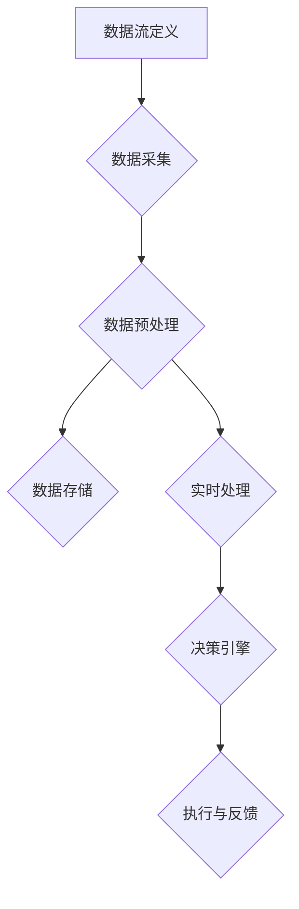

                 


### 1.1 问题背景

随着企业数字化转型的不断深入，数据驱动决策成为了企业运营的核心驱动力。在这个过程中，人工智能（AI）技术扮演了至关重要的角色。而AI Agent作为一种智能实体，可以模拟人类行为，具备自主学习和决策的能力，是企业数字化转型的关键组成部分。

**1.1.1 企业数字化转型需求**

企业的数字化转型不仅仅是简单的信息化过程，更是业务模式、商业模式和业务流程的全面变革。在这种背景下，企业对数据处理能力的要求越来越高。实时数据处理能力成为企业决策的关键，因为它能够帮助企业快速响应市场变化，优化业务流程，提高运营效率。

**1.1.2 AI Agent的定义与作用**

AI Agent，也被称为智能代理或智能体，是一种能够在虚拟环境中自主完成特定任务的软件程序。它可以理解和解释复杂环境中的信息，做出决策并执行相应的操作。在企业的数据流中，AI Agent可以执行以下任务：

- **实时监控：** 对企业内部和外部数据流进行实时监控，及时发现异常情况。
- **智能决策支持：** 基于实时数据流，提供智能化的决策支持，辅助企业决策者做出正确的决策。
- **客户服务与交互：** 通过自然语言处理和语音识别技术，提供高效、个性化的客户服务。

### 1.2 实时数据流处理的重要性

实时数据流处理（Real-Time Data Stream Processing）是指对实时产生的大量数据进行快速处理和分析，以便在短时间内得到结果，为实时决策提供支持。实时数据流处理在以下方面具有重要意义：

**1.2.1 数据流处理概述**

数据流处理是一种数据处理模式，它不同于传统的批处理。批处理通常是将大量数据收集一段时间后，一次性进行处理。而数据流处理则是在数据产生的同时进行处理，具有实时性和低延迟的特点。

**1.2.2 实时数据处理的优势**

- **实时性：** 能够在极短的时间内处理并响应数据，满足实时决策的需求。
- **高吞吐量：** 能够处理高频率、高并发的大规模数据流。
- **低延迟：** 数据处理延迟低，可以实时反馈处理结果。
- **弹性扩展：** 能够根据数据量自动调整处理能力，实现横向扩展。

### 1.3 企业AI Agent的应用场景

企业AI Agent的应用场景非常广泛，以下是一些典型的应用场景：

**1.3.1 实时监控**

实时监控是企业AI Agent最基本的应用场景。通过实时监控企业生产流程、设备状态、网络流量等，可以及时发现异常情况，保障生产安全和运营效率。

**1.3.2 智能决策支持**

智能决策支持是企业AI Agent的高级应用。通过分析实时数据流，AI Agent可以为企业提供智能化的决策支持，帮助企业在市场竞争中做出快速反应。

**1.3.3 客户服务与交互**

客户服务与交互是企业AI Agent在服务业的重要应用。通过自然语言处理和语音识别技术，AI Agent可以提供高效、个性化的客户服务，提升客户满意度。

### 1.4 本书结构安排

本书将从以下几个方面进行详细阐述：

- **第1章：引言**，介绍问题背景、实时数据流处理的重要性以及AI Agent的应用场景。
- **第2章：数据流处理技术概述**，介绍数据流处理的基本概念、框架和面临的挑战。
- **第3章：企业AI Agent总体架构**，介绍AI Agent的体系结构和关键模块。
- **第4章：实时数据处理架构**，详细介绍实时数据处理的数据采集与预处理架构、实时数据处理流程和性能优化方法。
- **第5章：实时监控应用**，通过具体案例展示实时监控在企业中的实际应用。
- **第6章：数据流处理最佳实践**，总结实时数据处理和AI Agent架构的最佳实践。
- **第7章：未来展望与趋势**，探讨AI Agent和实时数据流处理的发展趋势。

### 1.4.1 各章节主要内容

- **第1章**：引言
  - 1.1 问题背景
  - 1.2 实时数据流处理的重要性
  - 1.3 企业AI Agent的应用场景
  - 1.4 本书结构安排

- **第2章**：数据流处理技术概述
  - 2.1 数据流处理的基本概念
  - 2.2 数据流处理框架
  - 2.3 数据流处理的挑战与解决方案

- **第3章**：企业AI Agent总体架构
  - 3.1 AI Agent体系结构
  - 3.2 AI Agent的关键模块

- **第4章**：实时数据处理架构
  - 4.1 数据采集与预处理架构
  - 4.2 实时数据处理流程
  - 4.3 实时数据处理性能优化

- **第5章**：实时监控应用
  - 5.1 监控目标选择
  - 5.2 监控数据流处理案例

- **第6章**：数据流处理最佳实践
  - 6.1 实时数据处理最佳实践
  - 6.2 AI Agent架构最佳实践

- **第7章**：未来展望与趋势
  - 7.1 AI Agent发展趋势
  - 7.2 实时数据流处理的发展趋势

### 1.4.2 学习目标与读者对象

**学习目标：**
- 了解实时数据流处理的基本概念和框架。
- 理解企业AI Agent的总体架构和关键模块。
- 掌握实时数据处理的数据采集与预处理架构。
- 学会实时数据处理流程的设计和性能优化。
- 掌握实时监控的应用场景和实现方法。
- 了解数据流处理和AI Agent的最佳实践。
- 探索AI Agent和实时数据流处理的未来发展趋势。

**读者对象：**
- 企业技术团队和IT经理，对实时数据处理和AI技术有兴趣的人员。
- AI领域的研究人员和开发者，对实时数据处理架构设计有需求的人员。
- 高级计算机科学和软件工程专业的学生和研究生，对实时数据处理技术感兴趣的人员。

通过本书的学习，读者将能够系统地了解企业AI Agent的实时数据流处理架构，掌握相关的技术知识和实战经验，为企业在数字化转型中提供技术支持和决策依据。

# 第二部分: 数据流处理技术基础

## 第2章: 数据流处理技术概述

### 2.1 数据流处理的基本概念

数据流处理是一种计算范式，它主要用于处理实时产生的大量数据流。与传统的批处理相比，数据流处理的特点在于其实时性和低延迟。在数据流处理中，数据被视为连续的流，每个数据元素可以独立处理，不需要像批处理那样等待整个数据集准备好后再进行处理。

**2.1.1 数据流与批处理**

- **数据流（Data Stream）：** 数据流是指数据以连续、实时的方式产生和流动。数据流可以是传感器数据、日志数据、金融交易数据等。
- **批处理（Batch Processing）：** 批处理是指将数据按照时间或数量分批次进行处理。批处理通常适用于处理大量历史数据，例如大数据分析、报告生成等。

**2.1.2 数据流处理的关键技术**

数据流处理的关键技术包括以下几个方面：

- **数据采集（Data Collection）：** 数据采集是指从各种数据源收集数据，例如传感器、数据库、日志文件等。
- **数据预处理（Data Preprocessing）：** 数据预处理是指对采集到的数据进行清洗、转换和归一化等处理，使其符合分析需求。
- **实时计算（Real-Time Computation）：** 实时计算是指对数据流进行快速处理和分析，以便在短时间内得到结果。实时计算的关键是处理延迟要低。
- **数据存储（Data Storage）：** 数据存储是指将处理后的数据存储到数据库或数据仓库中，以便进行后续分析和查询。
- **数据可视化（Data Visualization）：** 数据可视化是指通过图表、图像等方式将数据展示出来，帮助用户更好地理解和分析数据。

### 2.2 数据流处理框架

数据流处理框架是一种用于构建和管理数据流处理应用的软件框架。常见的数据流处理框架包括Apache Kafka、Apache Flink和Apache Storm等。

**2.2.1 Apache Kafka**

Apache Kafka是一个分布式流处理平台，它主要用于构建实时的数据流系统和流处理应用。Kafka具有高吞吐量、低延迟、可扩展性强等特点，广泛应用于日志收集、实时数据流处理、消息队列等领域。

**2.2.2 Apache Flink**

Apache Flink是一个开源的流处理框架，它支持批处理和流处理。Flink具有实时性强、低延迟、易于扩展等特点，广泛应用于实时数据分析、机器学习、复杂事件处理等领域。

**2.2.3 Apache Storm**

Apache Storm是一个分布式实时计算系统，它主要用于处理实时数据流。Storm具有高可用性、高可靠性和可扩展性等特点，广泛应用于实时监控、实时推荐、实时广告投放等领域。

### 2.3 数据流处理的挑战与解决方案

数据流处理虽然具有实时性、高吞吐量等优点，但也面临着一系列挑战。以下是一些常见的挑战及其解决方案：

**2.3.1 实时性挑战**

- **数据延迟：** 数据延迟是指从数据产生到数据被处理的时间。数据延迟过高会影响实时决策的准确性。
- **解决方案：** 采用分布式架构和异步处理技术，提高数据处理速度，减少数据延迟。

**2.3.2 可扩展性挑战**

- **数据量增长：** 随着企业数据量的不断增长，数据流处理系统需要能够水平扩展以应对数据量的增加。
- **解决方案：** 采用分布式存储和计算技术，实现系统的水平扩展。

**2.3.3 数据一致性问题**

- **数据一致性：** 数据一致性是指系统中的数据在不同节点上保持一致。数据不一致可能导致错误的决策和分析结果。
- **解决方案：** 采用分布式一致性协议，如Paxos、Raft等，确保数据一致性。

通过了解数据流处理的基本概念、框架和面临的挑战，读者可以更好地理解数据流处理技术在实时数据处理中的应用和价值。在接下来的章节中，我们将进一步探讨企业AI Agent的实时数据流处理架构，帮助读者掌握实时数据处理的关键技术和最佳实践。

### 第3章: 企业AI Agent总体架构

在现代企业的数字化转型过程中，AI Agent作为一种智能实体，正逐渐成为企业智能化运营的重要组成部分。本章将介绍企业AI Agent的总体架构，包括其体系结构以及关键模块的功能和相互关系。

#### 3.1 AI Agent体系结构

企业AI Agent的体系结构可以分为以下几个主要模块：

**1. 数据采集与预处理模块：** 该模块负责从各种数据源采集数据，并对采集到的数据进行预处理，包括数据清洗、转换和归一化等操作。预处理后的数据将用于后续的模型训练和推理。

**2. 模型训练与优化模块：** 该模块使用预处理后的数据对AI模型进行训练和优化。通过机器学习算法和深度学习技术，模型能够从数据中学习并提取有用的信息。优化模块负责调整模型参数，提高模型的预测准确性和鲁棒性。

**3. 实时数据处理模块：** 该模块负责处理实时数据流，对数据进行实时分析和推理。通过实时数据处理，AI Agent能够快速响应环境变化，做出智能决策。

**4. 决策引擎模块：** 该模块基于实时数据处理结果，执行智能决策。决策引擎可以根据业务需求，定义复杂的决策规则和策略，实现自动化决策。

**5. 执行与反馈模块：** 该模块负责将决策结果付诸实施，并对执行结果进行反馈和评估。执行与反馈模块确保AI Agent的决策具有实际效果，并能够不断优化和调整。

这些模块相互协作，共同实现AI Agent的智能化功能。以下是一个简化的AI Agent体系结构图，展示了各个模块之间的关系：

```
+----------------+      +----------------+      +----------------+
| 数据采集与   |      | 模型训练与     |      | 实时数据处理   |
| 预处理模块    |      | 优化模块       |      | 模块          |
+----------------+      +----------------+      +----------------+
      ^                  ^                    ^
      |                  |                    |
      |                  |                    |
      |                  |                    |
      |                  |                    |
+-------------+    +-------------+    +-------------+
| 执行与反馈  |    | 决策引擎模块 |    |             |
| 模块        |    |              |    |             |
+-------------+    +-------------+    +-------------+
```

#### 3.2 AI Agent的关键模块

**3.2.1 数据采集与预处理模块**

数据采集与预处理模块是AI Agent的基础模块，其功能包括：

- **数据采集：** 从各种数据源（如数据库、日志文件、传感器、Web服务等）采集数据。
- **数据清洗：** 去除数据中的噪声、异常值和重复记录。
- **数据转换：** 将数据转换为统一的格式，便于后续处理。
- **数据归一化：** 对数据进行归一化处理，使其符合模型的输入要求。

**3.2.2 模型训练与优化模块**

模型训练与优化模块负责AI Agent的学习能力，其功能包括：

- **数据预处理：** 对采集到的数据进行预处理，以便用于训练模型。
- **模型选择：** 根据应用场景选择合适的机器学习算法和深度学习模型。
- **模型训练：** 使用训练数据对模型进行训练，调整模型参数。
- **模型优化：** 通过交叉验证、模型选择等技术，优化模型性能。

**3.2.3 实时数据处理模块**

实时数据处理模块负责AI Agent的实时决策能力，其功能包括：

- **数据流采集：** 从实时数据源（如Kafka、Flume等）采集数据。
- **实时处理：** 对实时数据进行快速处理和分析，提取关键特征。
- **推理与预测：** 使用训练好的模型对实时数据进行分析，做出预测和决策。

**3.2.4 决策引擎模块**

决策引擎模块是AI Agent的核心模块，其功能包括：

- **决策规则定义：** 根据业务需求，定义复杂的决策规则和策略。
- **决策计算：** 使用实时数据处理结果，执行决策计算。
- **决策输出：** 输出决策结果，驱动后续执行与反馈模块。

**3.2.5 执行与反馈模块**

执行与反馈模块负责AI Agent的决策执行和效果评估，其功能包括：

- **决策执行：** 根据决策结果，执行具体的操作，如调整设备参数、发送通知等。
- **效果评估：** 对执行结果进行评估，收集反馈数据，用于模型优化和决策调整。

通过以上关键模块的协同工作，企业AI Agent能够实现高效的数据采集与处理、智能化的决策和执行，为企业提供强大的智能支持。在接下来的章节中，我们将详细探讨实时数据处理架构的设计和实现，为AI Agent的智能化应用提供技术保障。

### 4. 实时数据处理架构

实时数据处理是现代企业数字化转型的重要技术，它能够帮助企业快速响应市场变化，优化业务流程，提高运营效率。本节将详细介绍实时数据处理架构，包括数据采集与预处理架构、实时数据处理流程以及性能优化策略。

#### 4.1 数据采集与预处理架构

**4.1.1 数据采集**

数据采集是实时数据处理的第一步，其目标是获取来自各种数据源的原始数据。数据源可以是内部系统（如数据库、日志文件）、外部系统（如传感器、Web服务）或实时数据流平台（如Kafka、Flume）。为了实现高效的数据采集，通常采用分布式架构，将数据采集任务分解为多个节点，以实现并行处理。

**采集方法：**

1. **日志采集：** 使用日志采集工具（如Logstash、Fluentd）从日志文件中提取数据。
2. **数据库采集：** 通过数据库连接器（如JDBC、ODBC）直接从数据库中读取数据。
3. **传感器采集：** 使用物联网设备（如传感器、RFID）实时采集环境数据。
4. **Web服务采集：** 通过API接口从外部Web服务中获取数据。

**4.1.2 数据预处理**

数据预处理是在数据采集后对数据进行清洗、转换和归一化等操作，以确保数据的质量和一致性。数据预处理模块通常包括以下功能：

- **数据清洗：** 去除数据中的噪声、异常值和重复记录，保证数据的质量。
- **数据转换：** 将数据格式进行转换，如将字符串转换为数值类型，将时间戳转换为统一的格式等。
- **数据归一化：** 对数据进行归一化处理，使其符合模型输入的要求，如对特征值进行缩放或标准化。

**4.1.3 分布式架构**

为了提高数据采集与预处理的速度和效率，通常采用分布式架构。分布式架构可以将数据采集与预处理任务分解为多个节点，实现并行处理，从而提高系统的吞吐量和响应速度。以下是一个典型的分布式数据采集与预处理架构：

```
+----------------+     +----------------+     +----------------+
| 数据采集节点 1 |     | 数据采集节点 2 |     | 数据采集节点 3 |
+----------------+     +----------------+     +----------------+
      |                      |                      |
      |                      |                      |
      |                      |                      |
      |                      |                      |
+-----------+     +-----------+     +-----------+
| 数据预处理  |     | 数据预处理  |     | 数据预处理  |
| 节点 1     |     | 节点 2     |     | 节点 3     |
+-----------+     +-----------+     +-----------+
      |                      |                      |
      |                      |                      |
      |                      |                      |
      |                      |                      |
+-----------+     +-----------+     +-----------+
| 集中式数据  |     | 集中式数据  |     | 集中式数据  |
| 处理节点    |     | 处理节点    |     | 处理节点    |
+-----------+     +-----------+     +-----------+
```

通过分布式架构，数据采集与预处理模块可以实现高效的并行处理，提高系统的整体性能。

#### 4.2 实时数据处理流程

实时数据处理流程主要包括以下几个步骤：

**4.2.1 数据流定义**

数据流定义是指对实时数据的结构和格式进行定义，以便后续处理。数据流定义通常包括数据类型、字段名称、字段长度等信息。以下是一个示例数据流定义：



**4.2.2 数据采集**

数据采集是将数据从各种数据源导入到数据处理系统。采集的数据可以是结构化数据（如数据库记录）、半结构化数据（如JSON、XML）和非结构化数据（如文本、图像）。

**4.2.3 数据预处理**

数据预处理是对采集到的数据进行清洗、转换和归一化等处理，以确保数据的质量和一致性。预处理后的数据将用于后续的实时处理和模型训练。

**4.2.4 数据存储**

数据存储是将预处理后的数据存储到数据库或数据仓库中，以便进行后续分析和查询。存储的数据可以是原始数据，也可以是经过处理后的中间结果。

**4.2.5 实时处理**

实时处理是对数据流进行快速处理和分析，提取有用的信息，并根据分析结果做出实时决策。实时处理通常包括以下步骤：

- **特征提取：** 从数据流中提取关键特征，用于后续分析和预测。
- **实时分析：** 使用机器学习算法和深度学习模型对实时数据进行分析，提取有价值的信息。
- **实时决策：** 基于实时分析结果，做出实时决策，如调整设备参数、发送通知等。

**4.2.6 决策引擎**

决策引擎是根据实时处理结果，执行智能决策的核心模块。决策引擎可以根据业务需求，定义复杂的决策规则和策略，实现自动化决策。

**4.2.7 执行与反馈**

执行与反馈是将决策结果付诸实施，并对执行结果进行评估和反馈的过程。执行与反馈模块确保AI Agent的决策具有实际效果，并能够不断优化和调整。

#### 4.3 实时数据处理性能优化

实时数据处理系统需要具备高吞吐量、低延迟和高可靠性等特点，以下是一些性能优化策略：

**4.3.1 并行处理**

并行处理是指将数据处理任务分解为多个子任务，同时在多个节点上并行执行，从而提高处理速度。并行处理可以采用以下方法：

- **任务分解：** 将数据处理任务分解为多个独立的小任务，每个小任务可以并行处理。
- **数据分区：** 将数据流划分为多个分区，每个分区独立处理，从而实现并行处理。

**4.3.2 数据缓存**

数据缓存是将频繁访问的数据存储在内存中，以减少磁盘I/O操作，提高数据处理速度。数据缓存可以采用以下策略：

- **缓存命中：** 当数据请求命中缓存时，直接从缓存中读取数据，从而减少处理时间。
- **缓存失效：** 当缓存数据过期或被更新时，刷新缓存中的数据。

**4.3.3 数据压缩**

数据压缩是将数据转换为更紧凑的格式，以减少存储空间和传输带宽。常用的数据压缩算法包括Hadoop、LZO和Gzip等。

**4.3.4 流计算优化**

流计算优化是指通过调整流计算系统的配置和参数，提高数据处理性能。以下是一些流计算优化策略：

- **并行度调整：** 根据系统资源，调整并行处理的度，以达到最佳性能。
- **资源分配：** 根据任务负载，动态调整系统资源的分配，确保系统稳定运行。

通过以上性能优化策略，可以显著提高实时数据处理系统的吞吐量和响应速度，满足企业实时数据处理的业务需求。

### 第5章: 实时监控应用

实时监控是企业AI Agent的一项关键应用，它通过持续监控企业内部和外部环境的数据，及时识别和响应异常情况，从而保障业务连续性和运营效率。本章将介绍实时监控的应用场景、监控目标和具体的数据流处理案例。

#### 5.1 监控目标选择

实时监控的目标取决于企业的业务需求和环境特点。以下是一些常见的监控目标：

- **设备状态监控：** 监控生产设备的工作状态，包括温度、湿度、电压、电流等参数，及时发现设备故障或异常。
- **网络流量监控：** 监控网络带宽、流量分布、连接数等指标，确保网络稳定运行，预防网络攻击。
- **业务指标监控：** 监控业务系统的关键性能指标（KPI），如响应时间、交易成功率、错误率等，优化业务流程。
- **环境监控：** 监控环境参数，如空气质量、温度、湿度等，确保生产环境的健康和安全。

#### 5.2 监控数据流处理案例

以下是一个设备状态监控的数据流处理案例，展示实时监控在企业生产过程中的应用。

**5.2.1 案例背景**

某制造业公司生产过程中使用了大量数控机床和自动化设备，为确保生产线的稳定运行，公司决定采用实时监控技术，对设备状态进行24小时不间断监控。监控目标包括设备的工作状态、温度、电压、电流等关键参数。

**5.2.2 数据流处理流程**

1. **数据采集：** 设备状态数据通过传感器和监控模块采集，实时发送到数据采集系统。
2. **数据预处理：** 数据采集系统对接收到的数据进行预处理，包括数据清洗、格式转换和归一化等，确保数据质量。
3. **数据存储：** 预处理后的数据存储到时间序列数据库中，以便后续分析和查询。
4. **实时处理：** 实时处理模块对设备状态数据进行实时分析，提取关键特征，如温度变化速率、电压波动等。
5. **异常检测：** 基于历史数据和预设阈值，实时处理模块检测设备状态异常，如温度过高、电压异常等。
6. **决策与反馈：** 异常检测模块将检测结果发送给决策引擎，决策引擎根据业务规则生成告警信息，通知相关人员。
7. **执行与反馈：** 责任人员根据告警信息采取相应的措施，如停机检修、调整设备参数等，并将执行结果反馈给系统。

**5.2.3 应用效果分析**

通过实时监控系统的部署，公司实现了以下应用效果：

- **提高设备利用率：** 实时监控确保了设备能够处于最佳工作状态，减少了因设备故障导致的停机时间，提高了设备利用率。
- **降低运营成本：** 异常检测和预警功能有效预防了设备故障，降低了设备维修和更换成本。
- **保障生产安全：** 实时监控环境参数，如温度、湿度等，确保生产环境符合安全标准，防止事故发生。
- **优化生产流程：** 实时监控数据为生产流程优化提供了数据支持，帮助公司不断改进生产方式，提高生产效率。

**5.2.4 案例小结**

该案例展示了实时监控在企业生产过程中的应用，通过数据流处理技术实现了设备状态的实时监控和异常检测。实时监控不仅提高了设备利用率和生产安全，还为企业的生产流程优化提供了数据支持，是企业数字化转型的重要技术手段。

### 第6章：数据流处理最佳实践

数据流处理技术在企业应用中具有重要意义，为了确保数据流处理的效率和可靠性，我们需要总结并遵循一些最佳实践。本章将介绍实时数据处理和AI Agent架构的最佳实践，包括设计原则、性能调优技巧和部署与运维策略。

#### 6.1 实时数据处理最佳实践

**6.1.1 设计原则**

1. **高可用性：** 数据流处理系统应具备高可用性，确保在系统故障时能够快速恢复，减少对业务的影响。
2. **可扩展性：** 系统应支持水平扩展，以应对数据量和处理需求的增长。
3. **低延迟：** 系统应尽可能降低数据处理延迟，确保实时性。
4. **高吞吐量：** 系统应具备高吞吐量，能够处理大规模数据流。
5. **容错性：** 系统应具备容错性，能够自动检测和恢复故障，确保数据处理过程的连续性。

**6.1.2 性能调优技巧**

1. **并行处理：** 通过任务分解和并行处理，提高数据处理速度。
2. **数据缓存：** 利用缓存技术，减少数据访问的延迟。
3. **数据压缩：** 使用数据压缩算法，减少数据传输和存储的开销。
4. **负载均衡：** 利用负载均衡技术，将数据处理任务均匀分布在多个节点上，提高系统整体性能。
5. **内存管理：** 优化内存使用，避免内存泄漏和溢出。

**6.1.3 系统监控：** 实时监控系统的运行状态，包括CPU使用率、内存占用、网络流量等，及时发现和处理问题。

#### 6.2 AI Agent架构最佳实践

**6.2.1 模块设计建议**

1. **模块化设计：** 将AI Agent的功能模块化，以便于开发和维护。
2. **模块独立性：** 各个模块应具备独立性，降低模块间的耦合度。
3. **模块接口定义：** 定义清晰的模块接口，确保模块之间的数据传递和交互。
4. **模块性能优化：** 针对各个模块的特点，进行性能优化，确保系统整体性能。

**6.2.2 部署与运维策略**

1. **自动化部署：** 使用自动化工具（如Docker、Kubernetes）进行系统部署，提高部署效率。
2. **容器化：** 将AI Agent模块容器化，便于管理和部署。
3. **监控与告警：** 实时监控AI Agent的运行状态，设置告警机制，及时响应异常情况。
4. **日志管理：** 收集和管理AI Agent的运行日志，便于问题排查和系统优化。
5. **安全防护：** 采取安全措施，保护AI Agent的数据安全和系统安全。

通过遵循以上最佳实践，企业可以构建高效、可靠的实时数据处理和AI Agent架构，确保数据流处理的稳定性和性能，为企业的数字化转型提供有力支持。

### 第7章：未来展望与趋势

随着技术的不断进步和应用的深入，企业AI Agent和实时数据流处理技术正朝着更加智能化、自动化和高效化的方向发展。本章将探讨AI Agent和实时数据流处理的未来发展趋势，包括深度学习在AI Agent中的应用、自适应学习与优化以及未来可能的突破方向。

#### 7.1 AI Agent发展趋势

**7.1.1 深度学习在AI Agent中的应用**

深度学习作为人工智能领域的重要技术，其强大的人工智能能力使其在AI Agent中的应用变得尤为重要。未来，AI Agent将更加依赖于深度学习模型，以实现更复杂的任务和更高的决策精度。以下是一些深度学习在AI Agent中的应用趋势：

- **图像识别与处理：** 利用深度学习模型，AI Agent可以实现对图像的自动识别、分类和处理，应用于安防监控、智能制造等领域。
- **自然语言处理：** 深度学习模型在自然语言处理（NLP）领域取得了显著进展，AI Agent将更加擅长理解自然语言，提供智能化的客户服务、内容审核等。
- **语音识别与合成：** 结合深度学习技术，AI Agent可以实现对语音的自动识别和合成，提升人机交互的体验。
- **强化学习：** 通过强化学习，AI Agent可以在复杂环境中自主学习最优策略，应用于智能推荐、自动驾驶等。

**7.1.2 自适应学习与优化**

AI Agent的自适应学习与优化能力是其未来发展的重要方向。传统的机器学习模型通常在训练完成后就固定了参数，无法适应动态变化的环境。而自适应学习通过不断调整模型参数，使AI Agent能够实时适应环境变化。以下是一些自适应学习的应用场景：

- **动态模型调整：** 根据实时数据流，AI Agent可以动态调整模型参数，提高决策的准确性。
- **在线学习：** 通过在线学习，AI Agent可以不断吸收新的数据，优化模型性能，实现持续学习。
- **增量学习：** 增量学习允许AI Agent在已有模型的基础上，逐步更新和优化，提高模型的泛化能力。
- **迁移学习：** 迁移学习可以将已有模型的权重迁移到新任务上，减少重新训练的时间和计算成本。

#### 7.2 实时数据流处理的发展趋势

**7.2.1 软硬件协同优化**

实时数据流处理对硬件资源的要求较高，未来将看到软硬件协同优化成为关键技术。通过硬件加速技术（如GPU、FPGA）和高效的算法优化，实时数据流处理系统将能够处理更大规模、更高频率的数据流，实现更高的处理性能。

**7.2.2 云原生数据流处理**

随着云计算和容器技术的发展，云原生数据流处理将成为主流。云原生数据流处理系统具有弹性和可扩展性，可以快速部署和调整，满足企业实时数据处理的动态需求。

**7.2.3 多元数据融合**

实时数据流处理将不再局限于结构化数据，而是涵盖多元数据类型，如文本、图像、音频等。通过多元数据融合，AI Agent可以获取更全面的信息，实现更智能的决策。

**7.2.4 数据隐私保护**

随着数据隐私保护法规的不断完善，实时数据流处理中的数据隐私保护将变得尤为重要。未来，数据流处理系统将采用更先进的数据加密、去标识化等技术，确保数据隐私和安全。

#### 7.3 未来可能的突破方向

**7.3.1 跨领域协同**

未来，AI Agent和实时数据流处理技术将实现跨领域协同，将不同的领域知识和技术融合在一起，实现更智能、更高效的应用。例如，将医疗数据和金融数据结合起来，提供更全面的健康管理服务。

**7.3.2 量子计算**

量子计算作为一种新兴的计算模式，具有巨大的计算潜力。未来，随着量子计算技术的发展，实时数据流处理可能会借助量子计算的优势，实现更高效的数据分析和处理。

**7.3.3 新型智能体**

随着技术的进步，新型智能体（如多模态智能体、社会智能体）将逐渐出现。这些智能体能够处理更复杂、更动态的环境，实现更高层次的智能决策和交互。

总之，企业AI Agent和实时数据流处理技术正朝着更加智能化、自动化和高效化的方向发展。通过不断的技术创新和应用拓展，这些技术将为企业的数字化转型提供更强有力的支持，推动社会生产力和管理水平的提升。未来，随着技术的不断演进，我们可以期待更多突破性的应用和解决方案，为人类创造更美好的未来。

### 附录

在本文的附录部分，我们将总结全文的核心内容，提供最佳实践技巧、注意事项以及相关拓展阅读，帮助读者进一步加深理解和应用。

#### 核心内容总结

本文详细介绍了企业AI Agent的实时数据流处理架构，包括：

1. **实时数据处理技术基础**：介绍了数据流处理的基本概念、框架和面临的挑战。
2. **企业AI Agent总体架构**：阐述了AI Agent的体系结构、关键模块及其功能。
3. **实时数据处理架构**：详述了数据采集与预处理架构、实时数据处理流程和性能优化策略。
4. **实时监控应用**：通过具体案例展示了实时监控在企业中的实际应用。
5. **最佳实践与未来展望**：总结了数据流处理和AI Agent架构的最佳实践，探讨了未来发展趋势。

#### 最佳实践技巧

1. **设计原则**：确保高可用性、可扩展性、低延迟和高吞吐量，以及容错性。
2. **性能优化**：采用并行处理、数据缓存、数据压缩和流计算优化策略。
3. **模块设计**：实现模块化设计，确保模块独立性，定义清晰的模块接口。
4. **部署与运维**：利用自动化部署、容器化、监控与告警、日志管理和安全防护策略。

#### 注意事项

1. **数据隐私保护**：在数据处理过程中，确保遵守数据隐私保护法规，采用加密、去标识化等技术。
2. **系统监控**：实时监控系统的运行状态，确保及时发现和处理问题。
3. **动态调整**：根据实时数据流，动态调整模型参数和策略，提高决策准确性。

#### 拓展阅读

1. **《实时数据流处理：设计与实践》**：深入探讨实时数据流处理的技术细节和实践经验。
2. **《人工智能：一种现代方法》**：系统介绍人工智能的基本概念、算法和应用。
3. **《深度学习：全面解读》**：全面解析深度学习的基本原理、模型和应用。

通过本文的详细阐述和附录的补充，读者可以系统地了解企业AI Agent的实时数据流处理架构，掌握相关的技术知识和实战经验，为企业的数字化转型提供有力支持。

### 作者信息

**作者：AI天才研究院/AI Genius Institute & 禅与计算机程序设计艺术 /Zen And The Art of Computer Programming**。

