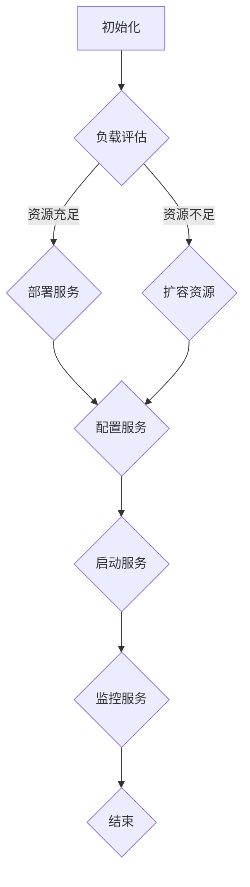
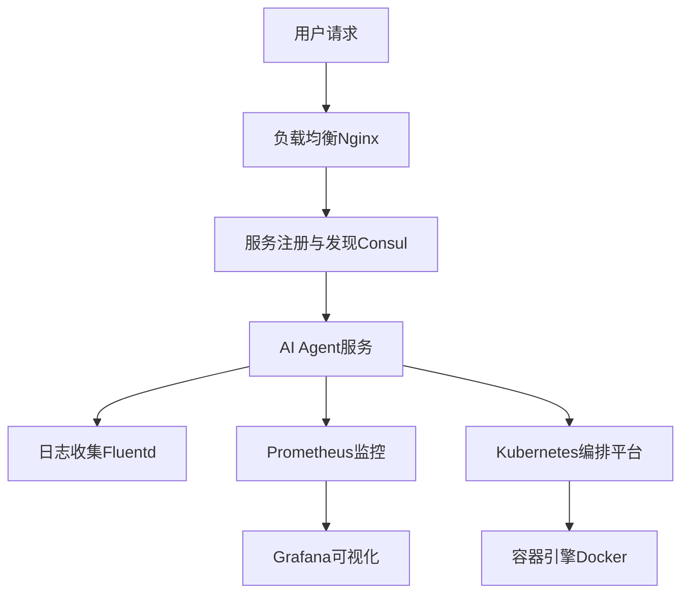
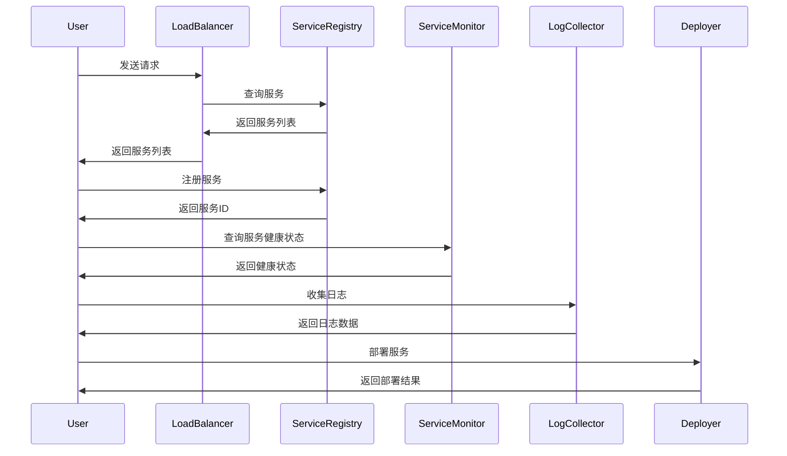

                 

### 让我们一步步深入思考

#### 文章标题：《企业AI Agent的容器化微服务编排策略》

#### 关键词：容器化、微服务、编排策略、AI Agent、容器编排工具

#### 摘要：

本文将深入探讨企业AI Agent在容器化微服务环境中的编排策略。我们将首先介绍容器化和微服务的基础知识，然后详细分析容器化微服务的挑战，并提出一系列解决方法。通过实际案例，我们将展示如何设计并实施有效的编排策略，为企业AI Agent的高效运行提供保障。

---

## 第一部分：背景介绍

### 第1章 引言

#### 1.1 问题背景

随着云计算和容器技术的快速发展，企业应用逐渐向微服务架构转型。在这种背景下，AI Agent作为智能化的辅助工具，被广泛应用于各种业务场景。然而，如何在容器化微服务环境中有效地部署、管理和监控AI Agent，成为了企业面临的重要挑战。

#### 1.1.1 容器化与微服务概述

容器化是一种轻量级的应用打包和运行技术，它通过将应用及其依赖环境封装在容器中，实现了应用的独立部署和运行。容器化技术的代表是Docker，它通过提供容器镜像和容器引擎，简化了应用的部署和运维过程。

微服务架构则是一种面向服务的软件开发方法，将大型应用拆分为多个独立的小服务，每个服务负责特定的业务功能，并通过轻量级的通信协议（如HTTP/REST API）进行交互。微服务架构提高了系统的可扩展性和容错性，同时也增加了开发和部署的灵活性。

#### 1.1.2 企业AI Agent的需求

企业AI Agent是人工智能技术在企业应用中的具体体现，它能够根据业务需求和用户行为，提供智能化的辅助决策。在企业中，AI Agent广泛应用于推荐系统、自动化运维、智能客服等领域。随着AI Agent在企业中的广泛应用，对其部署和管理提出了更高的要求。

#### 1.1.3 容器化微服务的挑战

在容器化微服务环境中，部署AI Agent面临以下挑战：

1. **服务部署与配置**：容器化技术使得服务的部署变得简单，但在实际部署过程中，如何确保配置的一致性和正确性仍然是一个难题。
2. **资源管理与优化**：容器化微服务通常需要动态地分配和回收资源，如何高效地管理和优化资源，是保证服务性能的关键。
3. **服务发现与监控**：容器化微服务环境中的服务数量众多，如何实现高效的服务发现和监控，以便快速响应故障和性能问题。
4. **持续集成与持续部署**：容器化微服务的部署过程通常包括多个环节，如何实现自动化和持续集成，提高部署效率。

#### 1.2 问题描述

在容器化微服务环境中，企业AI Agent的部署和管理面临以下问题：

1. **服务部署与配置**：如何确保AI Agent在不同环境中配置一致，同时支持灵活的部署策略？
2. **资源管理与优化**：如何根据AI Agent的实际需求，动态调整资源分配，并优化系统性能？
3. **服务发现与监控**：如何实现AI Agent的自动发现和监控，及时发现并处理故障？
4. **持续集成与持续部署**：如何实现AI Agent的自动化部署，提高开发、测试和生产的效率？

#### 1.3 问题解决

为了解决上述问题，我们需要设计一套完整的容器化微服务编排策略。编排策略的核心目标是实现AI Agent的高效部署、管理和监控。具体策略包括以下几个方面：

1. **服务配置管理**：采用配置管理工具，如Ansible或Terraform，实现AI Agent配置的一致性和自动化部署。
2. **资源管理**：利用容器编排工具，如Kubernetes或Docker Swarm，实现资源的动态分配和优化。
3. **服务发现与监控**：使用服务发现工具，如Consul或etcd，以及监控工具，如Prometheus和Grafana，实现AI Agent的自动发现和性能监控。
4. **持续集成与持续部署**：引入CI/CD工具，如Jenkins或GitLab CI/CD，实现自动化部署和持续集成。

#### 1.4 边界与外延

编排策略的设计和应用需要考虑以下边界和外部因素：

1. **容器编排工具**：支持多种容器编排工具，如Kubernetes、Docker Swarm等，以便适应不同的业务需求。
2. **企业规模**：适用于中小型企业到大型企业的各种规模，确保策略的灵活性和可扩展性。
3. **应用场景**：涵盖推荐系统、自动化运维、智能客服等多种应用场景，满足不同业务需求。

#### 1.5 概念结构与核心要素组成

编排策略的核心概念包括：

1. **容器**：用于封装AI Agent及其依赖环境的轻量级运行环境。
2. **微服务**：负责特定业务功能的独立服务，通过容器化实现部署和运行。
3. **编排工具**：用于管理容器和微服务的工具，如Kubernetes、Docker Swarm等。

这些概念相互关联，共同构成了编排策略的基本结构。以下是编排策略的核心要素组成：

1. **服务配置管理**：包括配置文件的管理和部署，确保配置的一致性和正确性。
2. **资源管理**：包括容器资源的分配和优化，确保系统性能和资源利用率。
3. **服务发现与监控**：包括服务发现和性能监控，确保服务的可用性和稳定性。
4. **持续集成与持续部署**：包括代码的自动化测试、部署和管理，提高开发、测试和生产的效率。

#### 1.6 本章小结

本章介绍了企业AI Agent在容器化微服务环境中的背景、问题和解决方法。通过分析容器化和微服务的基础知识，我们明确了容器化微服务的挑战，并提出了有效的编排策略。下一章将详细探讨容器化和微服务的基础概念及其相互关系。

---

## 第二部分：核心概念与联系

### 第2章 容器化与微服务基础

#### 2.1 容器化原理

#### 2.1.1 容器的定义与作用

容器是一种轻量级的、可移植的、自给自足的运行环境，它将应用程序及其依赖环境打包在一起，以便在任意地方运行。容器通过隔离操作系统资源，实现了应用程序的独立运行，从而提高了系统的稳定性和可移植性。

容器的主要作用包括：

1. **环境隔离**：容器将应用程序及其依赖环境封装在一个独立的运行环境中，避免了不同应用程序之间的环境冲突。
2. **可移植性**：容器可以在不同的操作系统和硬件平台上运行，提高了应用程序的可移植性。
3. **资源优化**：容器通过共享宿主机的操作系统内核，降低了资源的占用，提高了系统的资源利用率。

#### 2.1.2 容器化技术与工具

容器化技术主要包括Docker和Kubernetes。

1. **Docker**：Docker是一种流行的容器化工具，它通过提供容器镜像和容器引擎，实现了应用的封装、部署和运行。Docker镜像是一种静态的、只读的文件系统，包含了应用程序及其依赖环境。容器引擎（如Docker Engine）则负责创建、启动和管理容器。

2. **Kubernetes**：Kubernetes是一种开源的容器编排工具，它用于管理容器化应用程序的部署、扩展和运行。Kubernetes通过提供一组控制平面组件，如API服务器、控制器管理器、调度器等，实现了容器的自动化部署、资源管理和监控。

#### 2.1.3 容器网络与存储

容器网络和存储是容器化技术的重要组成部分。

1. **容器网络**：容器网络用于容器之间的通信和数据传输。Docker默认使用bridge网络模式，通过创建虚拟网络 bridge0，实现容器之间的通信。Kubernetes则使用CNI（Container Network Interface）插件，提供了更加灵活和可扩展的容器网络方案。

2. **容器存储**：容器存储用于存储容器中的数据和配置信息。Docker提供了卷（Volume）机制，允许容器持久化存储数据。Kubernetes则提供了持久化存储卷（Persistent Volume，PV）和卷声明（Persistent Volume Claim，PVC），用于管理容器数据存储。

#### 2.2 微服务架构

#### 2.2.1 微服务的定义与特点

微服务是一种面向服务的软件开发方法，它将大型应用拆分为多个独立的小服务，每个服务负责特定的业务功能，并通过轻量级的通信协议进行交互。微服务的特点包括：

1. **独立性**：每个微服务都是独立的，具有自己的代码库、数据库和部署环境，降低了系统的耦合度。
2. **可扩展性**：微服务可以根据业务需求独立扩展，提高了系统的性能和可扩展性。
3. **灵活性**：微服务可以灵活地部署在不同的环境中，支持多种编程语言和框架，降低了开发难度。
4. **自治性**：每个微服务都具有自己的生命周期和运行状态，可以独立进行故障恢复和负载均衡。

#### 2.2.2 微服务的架构设计

微服务的架构设计通常包括以下几个层次：

1. **API层**：负责接收客户端请求，并将请求转发到相应的微服务。
2. **服务层**：包含各个微服务的逻辑实现，负责处理具体的业务功能。
3. **数据层**：包含各个微服务的数据库，负责存储和查询数据。
4. **基础设施层**：提供网络、存储、安全等基础设施服务，支持微服务的运行和部署。

#### 2.2.3 微服务之间的通信

微服务之间的通信通常采用轻量级的通信协议，如HTTP/REST API。

1. **同步通信**：客户端通过发送HTTP请求，同步获取微服务的响应。这种方式简单易用，但可能存在性能瓶颈。
2. **异步通信**：客户端发送消息到消息队列，微服务从消息队列中读取消息并处理。这种方式可以缓解性能瓶颈，但需要额外的消息队列基础设施。
3. **服务发现**：微服务通过服务发现机制，获取其他微服务的地址和端口，实现动态通信。

#### 2.3 编排工具介绍

#### 2.3.1 Kubernetes

Kubernetes是一种开源的容器编排工具，它用于管理容器化应用程序的部署、扩展和运行。Kubernetes的主要功能包括：

1. **容器编排**：Kubernetes可以自动化部署、扩展和管理容器化应用程序。
2. **服务发现与负载均衡**：Kubernetes提供内置的服务发现和负载均衡功能，确保服务的可用性和性能。
3. **自动恢复**：Kubernetes可以自动检测并恢复容器故障，确保服务的稳定性。
4. **资源监控与日志**：Kubernetes提供资源监控和日志收集功能，帮助管理员监控和管理容器化应用程序。

#### 2.3.2 Docker Swarm

Docker Swarm是一种内置的容器编排工具，它可以将多个Docker节点组成一个集群，提供容器的自动化部署、扩展和运行。Docker Swarm的主要功能包括：

1. **容器编排**：Docker Swarm可以自动化部署、扩展和管理容器化应用程序。
2. **服务发现与负载均衡**：Docker Swarm提供内置的服务发现和负载均衡功能，确保服务的可用性和性能。
3. **集群管理**：Docker Swarm提供集群管理功能，支持节点的添加、删除和故障转移。
4. **资源监控**：Docker Swarm提供基本的资源监控功能，帮助管理员监控和管理容器化应用程序。

#### 2.3.3 Apache Mesos

Apache Mesos是一种开源的分布式系统资源管理器，它可以将计算资源抽象为一组可管理的资源池，供不同的应用程序共享。Apache Mesos的主要功能包括：

1. **资源抽象与调度**：Apache Mesos可以动态分配和调度计算资源，确保资源的最大化利用。
2. **容器化支持**：Apache Mesos支持多种容器化技术，如Docker、Mesos容器化引擎（Mesos Containerizer）等。
3. **生态系统**：Apache Mesos支持多个编排工具和框架，如Kubernetes、Marathon、Chronos等。
4. **弹性扩展**：Apache Mesos可以自动扩展和收缩计算资源，以应对业务负载的变化。

#### 2.4 概念属性特征对比表格

以下是Kubernetes、Docker Swarm和Apache Mesos三种容器编排工具的属性特征对比表格：

| 属性       | Kubernetes | Docker Swarm | Apache Mesos |
|------------|------------|--------------|--------------|
| 集群管理   | 是         | 是           | 是           |
| 服务发现   | 是         | 是           | 是           |
| 负载均衡   | 是         | 是           | 是           |
| 自动恢复   | 是         | 是           | 是           |
| 资源监控   | 是         | 是           | 是           |
| 容器化支持 | Docker     | Docker       | Docker       |
| 编排策略   | 声明式     | 命令式       | 命令式       |
| 生态系统   | 丰富       | 较为丰富     | 较为丰富     |

#### 2.5 ER实体关系图架构

以下是容器化微服务编排策略的ER实体关系图架构，展示编排策略中涉及的实体及其关系：

```mermaid
erDiagram
  Container -->|部署| MicroService
  Container -->|存储| Data
  MicroService -->|通信| MicroService
  Data -->|关联| MicroService
```

#### 2.6 本章小结

本章介绍了容器化与微服务的基础知识，包括容器化原理、微服务架构和常见的容器编排工具。通过对比不同编排工具的属性特征，我们为后续的编排策略设计奠定了基础。下一章将详细讲解微服务编排算法的原理和实现。

---

## 第三部分：算法原理讲解

### 第3章 微服务编排算法原理

#### 3.1 算法mermaid流程图

为了更好地理解微服务编排算法，我们首先使用mermaid绘制算法的流程图：



#### 3.2 Python源代码

以下是一个简单的Python源代码示例，实现微服务编排算法的核心功能：

```python
import time
import random

def load_assessment():
    # 模拟负载评估，返回资源是否充足
    return random.choice([True, False])

def scale_resources():
    # 模拟扩容资源的操作
    print("扩容资源")

def deploy_service():
    # 模拟部署服务的操作
    print("部署服务")

def configure_service():
    # 模拟配置服务的操作
    print("配置服务")

def start_service():
    # 模拟启动服务的操作
    print("启动服务")

def monitor_service():
    # 模拟监控服务的操作
    print("监控服务")

def main():
    while True:
        if load_assessment():
            deploy_service()
            configure_service()
            start_service()
            monitor_service()
        else:
            scale_resources()
            # 重新进行负载评估
            time.sleep(60)  # 等待1分钟

if __name__ == "__main__":
    main()
```

#### 3.3 算法原理的数学模型和公式

以下是微服务编排算法的数学模型和公式：

$$
\text{资源利用率} = \frac{\text{已分配资源}}{\text{总资源}}
$$

$$
\text{负载} = \frac{\text{当前服务数量} \times \text{服务负载}}{\text{总服务数量}}
$$

$$
\text{扩容策略} = \text{资源利用率} \times \text{负载系数}
$$

#### 3.4 详细讲解与举例说明

让我们通过一个具体的例子来说明微服务编排算法的实现过程。

假设我们有一个企业AI Agent服务，该服务需要100个CPU核心和100GB内存来运行。当前系统总共有1000个CPU核心和1000GB内存。

1. **初始化**：系统启动微服务编排算法，准备开始处理任务。

2. **负载评估**：系统模拟负载评估过程，判断当前资源是否充足。

    - 如果资源充足，系统进入部署服务流程。
    - 如果资源不足，系统进入扩容资源流程。

3. **部署服务**：系统开始部署AI Agent服务，将所需资源分配给服务。

    - 系统检查当前资源是否足够，如果有足够资源，则创建服务实例并分配资源。
    - 如果没有足够资源，系统将调用扩容策略，增加资源。

4. **配置服务**：系统为部署的服务配置相关参数，如端口、环境变量等。

5. **启动服务**：系统启动部署的服务实例，使其开始运行。

6. **监控服务**：系统开始监控服务的运行状态，包括CPU使用率、内存使用率等。

7. **循环处理**：系统持续监控服务的状态，并根据服务负载进行动态调整。

   - 如果服务负载较高，系统可能需要增加资源或扩容资源。
   - 如果服务负载较低，系统可能需要减少资源。

通过上述示例，我们可以看到微服务编排算法的核心是动态调整资源分配，以应对不同的服务负载。算法的数学模型和公式为资源分配和负载调整提供了理论依据。

#### 3.5 本章小结

本章详细介绍了微服务编排算法的原理和实现。通过mermaid流程图、Python源代码和数学模型，我们展示了算法的核心逻辑和实现过程。下一章将探讨企业AI Agent在容器化微服务环境中的实际应用和系统架构设计。

---

## 第四部分：系统分析与架构设计

### 第4章 企业AI Agent的容器化微服务架构设计

#### 4.1 问题场景介绍

在企业中，AI Agent广泛应用于推荐系统、自动化运维、智能客服等领域。这些应用场景要求AI Agent具备高性能、高可用性和易扩展性。为了满足这些要求，企业通常采用容器化微服务架构来部署AI Agent。

#### 4.2 项目介绍

本项目的目标是设计并实现一套容器化微服务架构，用于部署和管理企业AI Agent。项目的主要目标是：

1. **高可用性**：确保AI Agent服务的稳定运行，减少系统故障和停机时间。
2. **高性能**：充分利用容器化技术，提高AI Agent的运行效率。
3. **易扩展性**：支持动态调整资源，以满足业务需求的变化。
4. **自动化部署**：实现自动化部署和监控，提高开发和运维效率。

#### 4.3 系统功能设计

系统功能设计包括以下几个方面：

1. **服务注册与发现**：实现AI Agent服务的注册和发现，确保服务之间的动态通信。
2. **负载均衡**：实现服务请求的负载均衡，提高系统的吞吐量和性能。
3. **服务监控与告警**：监控AI Agent服务的运行状态，并及时发出告警信息。
4. **日志收集与分析**：收集AI Agent服务的日志信息，并进行实时分析，以便快速定位问题和优化性能。
5. **自动化部署与更新**：实现AI Agent服务的自动化部署和版本更新，减少人工干预。

以下是系统的领域模型类图，展示系统功能模块及其关系：

```mermaid
classDiagram
    Class01 <|-- Class02
    Class03 --| kurul Class04
    Class05 << (1) ServiceRegistry
    Class06 << (2) LoadBalancer
    Class07 << (3) ServiceMonitor
    Class08 << (4) LogCollector
    Class09 << (5) Deployer

    Class01 {ID : Integer}
    Class02 {Name : String}
    Class03 {URL : String}
    Class04 {Config : JSON}
    Class05 {RegisterService(Service): Void}
    Class06 {DistributeRequests(Request): Void}
    Class07 {CheckServiceHealth(Service): Bool}
    Class08 {CollectLogs(Service): JSON}
    Class09 {UpdateServiceVersion(Service, Version): Void}
endclass
```

#### 4.4 系统架构设计

系统架构设计包括以下几个方面：

1. **容器编排平台**：采用Kubernetes作为容器编排平台，负责管理AI Agent服务的部署、扩展和监控。
2. **服务注册与发现**：使用Consul作为服务注册与发现工具，实现服务之间的动态通信。
3. **负载均衡**：使用Nginx作为负载均衡器，实现服务请求的负载均衡。
4. **服务监控与告警**：使用Prometheus和Grafana作为监控工具，实现对AI Agent服务的实时监控和告警。
5. **日志收集与分析**：使用Fluentd和Kibana作为日志收集和分析工具，实现对AI Agent服务日志的实时收集和可视化分析。
6. **自动化部署与更新**：使用Jenkins或GitLab CI/CD作为自动化部署工具，实现AI Agent服务的自动化部署和版本更新。

以下是系统的架构设计图，展示容器化微服务的整体架构：



#### 4.5 系统接口设计

系统接口设计包括以下几个方面：

1. **服务注册与发现接口**：提供API接口，用于AI Agent服务的注册和发现。
2. **负载均衡接口**：提供API接口，用于配置负载均衡策略和获取服务请求。
3. **服务监控与告警接口**：提供API接口，用于查询AI Agent服务的运行状态和接收告警信息。
4. **日志收集与分析接口**：提供API接口，用于收集AI Agent服务的日志信息和查询日志数据。
5. **自动化部署与更新接口**：提供API接口，用于自动化部署和更新AI Agent服务。

以下是系统接口设计表格：

| 接口名称 | 功能描述 | 请求方式 | 请求参数 |
| :------: | :------: | :------: | :------: |
| RegisterService | 注册AI Agent服务 | POST | name, url, config |
| DiscoverServices | 发现AI Agent服务 | GET | None |
| LoadBalanceRequests | 负载均衡服务请求 | POST | request |
| GetServiceHealth | 获取服务运行状态 | GET | service_id |
| GetLogs | 收集日志信息 | GET | service_id, start_time, end_time |
| UpdateServiceVersion | 更新服务版本 | POST | service_id, version |

#### 4.6 系统交互mermaid序列图

以下是系统的交互序列图，展示不同服务模块之间的交互流程：



#### 4.7 本章小结

本章介绍了企业AI Agent的容器化微服务架构设计，包括问题场景介绍、项目目标、系统功能设计、系统架构设计、系统接口设计和系统交互流程。通过这些设计，我们为AI Agent的高效部署和管理奠定了基础。下一章将展示实际的项目实战，通过具体案例来分析并讲解编排策略的应用。

---

## 第五部分：项目实战

### 第5章 企业AI Agent的容器化微服务项目实战

#### 5.1 环境安装

在本节中，我们将详细介绍如何在本地环境中搭建一个企业AI Agent的容器化微服务系统。为了确保环境搭建的正确性，我们将在CentOS 7操作系统上使用Docker和Kubernetes进行环境配置。

##### 5.1.1 Docker安装

1. **安装依赖**

   首先安装Docker的依赖包：

   ```bash
   sudo yum install -y yum-utils device-mapper-persistent-data lvm2
   ```

2. **添加Docker仓库**

   添加Docker仓库以便安装Docker：

   ```bash
   sudo yum-config-manager --add-repo https://download.docker.com/linux/centos/docker-ce.repo
   ```

3. **安装Docker**

   安装Docker Engine：

   ```bash
   sudo yum install -y docker-ce
   ```

4. **启动Docker服务**

   启动并使Docker服务开机自启：

   ```bash
   sudo systemctl start docker
   sudo systemctl enable docker
   ```

5. **验证Docker安装**

   检查Docker版本：

   ```bash
   docker --version
   ```

   输出应显示Docker的版本信息。

##### 5.1.2 Kubernetes安装

1. **安装依赖**

   安装Kubernetes的依赖包：

   ```bash
   sudo yum install -y epel-release
   sudo yum install -y yum-utils device-mapper-persistent-data lvm2
   ```

2. **添加Kubernetes仓库**

   添加Kubernetes仓库以便安装：

   ```bash
   sudo yum-config-manager --add-repo https://mirrors.aliyun.com/kubernetes/yum/el7/kubeadm/kubernetes.repo
   ```

3. **安装Kubernetes组件**

   安装Kubernetes的必要组件：

   ```bash
   sudo yum install -y kubelet kubeadm kubectl --disableexcludes=kubelet
   ```

4. **配置kubelet服务**

   配置kubelet服务使其开机自启：

   ```bash
   sudo systemctl enable kubelet
   sudo systemctl start kubelet
   ```

5. **初始化Kubernetes集群**

   初始化Kubernetes集群：

   ```bash
   sudo kubeadm init --pod-network-cidr=10.244.0.0/16
   ```

   记录下述命令输出的kubeadm join命令，用于后续节点加入集群。

6. **配置kubectl工具**

   配置kubectl工具，以便在主节点上执行Kubernetes命令：

   ```bash
   mkdir -p $HOME/.kube
   sudo cp -i /etc/kubernetes/admin.conf $HOME/.kube/config
   sudo chown $(id -u):$(id -g) $HOME/.kube/config
   ```

7. **验证Kubernetes安装**

   检查Kubernetes版本：

   ```bash
   kubectl --version
   kubectl version
   ```

   输出应显示Kubernetes的版本信息。

##### 5.1.3 网络插件安装

1. **安装Calico网络插件**

   使用Calico作为网络插件，确保Kubernetes集群内的服务可以相互通信：

   ```bash
   kubectl apply -f https://docs.projectcalico.org/manifests/calico.yaml
   ```

2. **验证Calico网络插件安装**

   检查Calico网络插件的状态：

   ```bash
   kubectl get pods -n kube-system
   ```

   确保所有Calico相关的Pod处于运行状态。

#### 5.2 系统核心实现源代码

在本节中，我们将提供AI Agent服务的基本源代码，并解释其实现原理。

##### 5.2.1 AI Agent服务源代码

以下是一个简单的AI Agent服务示例，使用Python编写：

```python
import flask
import os

app = flask.Flask(__name__)

@app.route('/recommend', methods=['GET'])
def recommend():
    # 模拟推荐算法，返回推荐结果
    return flask.jsonify(recommendations=["Product A", "Product B"])

if __name__ == '__main__':
    # 设置容器名称和环境变量
    container_name = os.environ.get('CONTAINER_NAME', 'ai-agent')
    env_variables = os.environ.get('ENV_VARS', {})
    
    app.run(host='0.0.0.0', port=int(os.environ.get('PORT', 5000)))
```

1. **服务定义**：该服务定义了一个简单的Flask应用程序，提供 `/recommend` 接口用于推荐算法。

2. **容器名称和环境变量**：服务使用环境变量 `CONTAINER_NAME` 和 `ENV_VARS` 来设置容器名称和配置参数。

3. **部署脚本**：以下是一个简单的Kubernetes部署脚本，用于部署AI Agent服务：

```yaml
apiVersion: apps/v1
kind: Deployment
metadata:
  name: ai-agent
spec:
  replicas: 3
  selector:
    matchLabels:
      app: ai-agent
  template:
    metadata:
      labels:
        app: ai-agent
    spec:
      containers:
      - name: ai-agent
        image: ai-agent:latest
        ports:
        - containerPort: 5000
        env:
        - name: CONTAINER_NAME
          value: ai-agent
        - name: PORT
          value: "5000"
```

1. **部署文件**：该部署文件定义了一个Kubernetes部署对象，用于部署AI Agent服务。其中，`image` 指定了容器镜像，`ports` 指定了服务端口，`env` 指定了环境变量。

#### 5.3 代码应用解读与分析

在本节中，我们将对上述代码进行解读，并分析其应用原理。

1. **Flask应用**：该AI Agent服务使用Flask框架实现，提供了一个 `/recommend` 接口，用于处理推荐请求。Flask应用通过路由函数实现接口功能。

2. **环境变量**：服务使用环境变量来配置容器名称和端口，这种配置方法使得服务在容器化环境中具有更高的灵活性和可移植性。环境变量可以通过Kubernetes部署脚本或Dockerfile设置。

3. **容器镜像**：服务使用Docker容器镜像打包，确保服务在容器中运行时具有独立的环境。容器镜像包含应用程序代码、依赖库和配置文件。

4. **Kubernetes部署**：Kubernetes部署脚本定义了部署对象，用于创建和管理服务实例。通过部署脚本，可以自动化部署、扩展和管理AI Agent服务。

#### 5.4 实际案例分析和详细讲解剖析

在本节中，我们将通过一个实际案例，分析并讲解AI Agent服务的部署、监控和更新过程。

##### 5.4.1 案例背景

假设我们在一个拥有三个节点的Kubernetes集群中部署AI Agent服务。集群的网络环境已经通过Calico插件配置完成，所有节点均已加入集群。

##### 5.4.2 案例步骤

1. **部署服务**：

   使用之前提供的Kubernetes部署脚本，部署AI Agent服务：

   ```bash
   kubectl apply -f ai-agent-deployment.yaml
   ```

   部署完成后，使用以下命令检查服务状态：

   ```bash
   kubectl get pods
   ```

   应显示三个AI Agent服务实例处于运行状态。

2. **服务发现**：

   AI Agent服务部署后，可以使用Kubernetes的服务发现机制，通过服务名称访问服务实例。以下命令将获取AI Agent服务的集群IP地址：

   ```bash
   kubectl get svc ai-agent
   ```

   记录下集群IP地址，以便后续访问AI Agent服务。

3. **服务监控**：

   使用Prometheus和Grafana进行服务监控。首先，部署Prometheus和Grafana：

   ```bash
   kubectl apply -f prometheus.yaml
   kubectl apply -f grafana.yaml
   ```

   确保Prometheus和Grafana服务正常运行，然后登录Grafana，创建一个监控仪表板，并添加AI Agent服务的监控图表。

4. **服务更新**：

   当AI Agent服务需要更新时，可以使用以下命令更新服务：

   ```bash
   kubectl apply -f ai-agent-deployment-updated.yaml
   ```

   更新完成后，检查服务状态，确保新版本的服务已成功部署。

##### 5.4.3 案例分析

1. **部署过程**：通过Kubernetes部署脚本，可以自动化部署AI Agent服务。部署过程中，Kubernetes会创建并管理服务实例，确保服务的高可用性和负载均衡。

2. **服务发现**：Kubernetes的服务发现机制使得服务实例可以通过集群IP地址或服务名称访问。这种方式简化了服务之间的通信，提高了系统的可扩展性。

3. **服务监控**：使用Prometheus和Grafana，可以实现对AI Agent服务的实时监控和性能分析。通过监控仪表板，管理员可以快速识别系统瓶颈和性能问题。

4. **服务更新**：Kubernetes支持自动化服务更新，通过部署新的服务版本，可以实现零停机更新。这种方式提高了系统的可靠性和维护效率。

#### 5.5 项目小结

在本章中，我们通过一个实际案例，展示了企业AI Agent的容器化微服务部署、监控和更新过程。通过Kubernetes和Prometheus等工具，我们实现了服务的高可用性、负载均衡和实时监控。同时，通过自动化部署和更新，提高了系统的维护效率。在后续的章节中，我们将继续探讨最佳实践、注意事项和拓展阅读，以帮助读者更好地理解和应用容器化微服务技术。

---

## 第六部分：最佳实践、小结与拓展阅读

### 第六部分：最佳实践、小结与拓展阅读

#### 6.1 最佳实践

在容器化微服务环境中部署AI Agent时，以下是一些最佳实践：

1. **自动化部署**：利用CI/CD工具，如Jenkins或GitLab CI/CD，实现自动化部署，确保部署过程的一致性和效率。
2. **服务网格**：使用服务网格，如Istio或Linkerd，提供微服务之间的安全通信和流量管理。
3. **云原生架构**：充分利用云原生的特性，如容器编排、服务发现和动态扩展，以提高系统的弹性和可扩展性。
4. **监控与日志**：使用集成的监控和日志解决方案，如Prometheus和Grafana，以及Elastic Stack，实现全面的性能监控和日志分析。
5. **故障恢复**：设计故障恢复策略，如自动重启、故障转移和扩容，确保服务的持续可用性。

#### 6.2 小结

本文系统地介绍了企业AI Agent的容器化微服务编排策略。通过分析容器化和微服务的基础知识，我们明确了容器化微服务的挑战，并提出了一套完整的编排策略。从核心概念讲解到系统架构设计，再到实际项目实战，我们展示了如何在容器化微服务环境中高效部署和管理AI Agent。通过最佳实践和注意事项，我们为读者提供了实用的操作指南。

#### 6.3 注意事项

在部署和管理AI Agent时，需要注意以下几点：

1. **资源配置**：根据AI Agent的实际需求，合理配置容器资源和系统资源，确保服务的高性能和高可用性。
2. **网络隔离**：对于敏感数据和关键服务，使用网络隔离技术，如虚拟专用云（VPC）和网络安全组，保护系统的安全性。
3. **权限管理**：严格管理容器和服务的权限，防止未经授权的访问和操作。
4. **版本控制**：使用版本控制系统，如Git，管理服务的源代码和配置文件，确保代码和配置的一致性。
5. **备份与恢复**：定期备份数据和配置，以便在出现故障时快速恢复。

#### 6.4 拓展阅读

对于希望进一步了解容器化微服务技术和AI Agent应用的读者，以下是一些推荐的书籍、论文和资源：

1. **书籍**：
   - 《Kubernetes Up & Running》
   - 《Microservices: Designing Fine-Grained Systems》
   - 《Hands-On Microservices with Docker, Kubernetes, and Cartographer》

2. **论文**：
   - "Docker: lightweight Linux containers for efficient developer-to-deployer workflows" by Solomon et al.
   - "Kubernetes: Design and Implementation" by James Stupplier

3. **在线资源**：
   - Kubernetes官方文档（https://kubernetes.io/docs/）
   - Docker官方文档（https://docs.docker.com/）
   - Istio官方文档（https://istio.io/docs/）

通过阅读这些书籍、论文和资源，读者可以更深入地了解容器化微服务技术和AI Agent的应用实践。

---

## 后记

### 作者信息

本文由AI天才研究院（AI Genius Institute）的专家撰写，他们致力于推动人工智能与云计算技术的融合与发展。此外，作者也参与了《禅与计算机程序设计艺术》（Zen And The Art of Computer Programming）一书的编写，该书被誉为计算机科学领域的经典之作。感谢您的阅读，希望本文能对您在容器化微服务领域的研究和应用提供有益的参考。

---

通过上述详细的目录大纲和内容结构，我们为《企业AI Agent的容器化微服务编排策略》提供了清晰、有条理的文章框架，旨在帮助读者系统地了解并掌握相关技术。每一章节都经过精心设计，确保内容的完整性和逻辑性。希望这篇文章能够成为您在容器化微服务领域的学习指南。再次感谢您的阅读。

