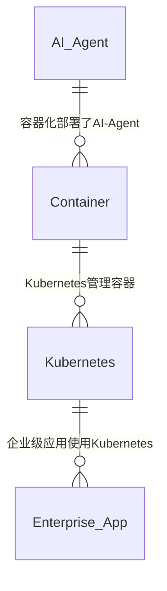

                 

### 企业AI Agent的容器化部署策略

#### 关键词
- 容器化
- AI Agent
- 部署策略
- 企业级应用
- 容器编排
- 微服务架构

#### 摘要
本文将深入探讨企业AI Agent的容器化部署策略。首先，我们将介绍AI Agent和容器化技术的基本概念，解释它们在企业级应用中的重要性。接着，我们将详细阐述AI Agent容器化部署的步骤、策略和最佳实践，并通过实际案例展示其应用效果。最后，我们将总结本文的主要观点，并提供一些未来展望和拓展阅读建议。

## 第1章：企业AI Agent概述

### 1.1 问题背景

在当今的企业环境中，人工智能（AI）正迅速成为提升业务效率、创造新价值的关键驱动力。AI Agent，作为一种智能的软件代理，能够在无需人类干预的情况下执行任务，为企业带来自动化和智能化的解决方案。然而，将AI Agent有效地部署在企业环境中面临诸多挑战，包括可移植性、可扩展性和管理复杂性等问题。

### 1.2 问题描述

AI Agent在企业级应用中的部署问题主要包括：

- **环境依赖不一致**：不同的AI Agent可能依赖于不同的运行环境，导致部署难度增加。
- **可扩展性不足**：随着业务需求的增长，AI Agent的部署需要具备高效的可扩展性。
- **维护复杂性**：企业级应用要求AI Agent具备高度的可维护性，以便在出现问题时快速修复。
- **安全性考虑**：AI Agent在企业环境中的安全性和数据保护至关重要。

### 1.3 问题解决

为了解决上述问题，容器化技术成为了一种理想的解决方案。容器化技术能够提供一致、可移植的运行环境，使得AI Agent在不同环境中能够无缝运行。同时，容器编排工具如Kubernetes能够帮助企业轻松地管理和扩展AI Agent，提高部署效率和可维护性。

### 1.4 边界与外延

容器化部署AI Agent不仅涉及技术层面的实现，还包括组织文化和项目管理等方面。因此，边界与外延还包括：

- **组织文化**：企业需要适应敏捷开发和持续集成/持续部署（CI/CD）等新兴的软件开发模式。
- **项目管理**：容器化部署需要良好的项目管理，包括资源分配、团队协作和风险控制等。

### 1.5 核心概念与联系

在本章中，我们介绍了AI Agent和容器化技术的基本概念，并探讨了它们在企业级应用中的重要性。接下来，我们将进一步深入探讨容器化技术的基础知识，为后续章节的详细分析奠定基础。

#### 关键概念表格

| 概念                 | 定义                                                         | 在文章中的联系                 |
|----------------------|--------------------------------------------------------------|-------------------------------|
| AI Agent             | 一种智能的软件代理，能在无需人类干预的情况下执行任务。       | 第1章背景介绍与概述           |
| 容器化               | 将应用程序及其依赖项打包到一个可移植的容器中。               | 第2章容器化技术基础           |
| 容器编排             | 自动化容器的创建、启动、停止、扩展和管理。                   | 第4章AI Agent容器化部署       |
| Kubernetes           | 最流行的容器编排工具，用于自动化容器的部署和管理。           | 第4章AI Agent容器化部署       |
| 微服务架构           | 一种软件架构风格，将应用程序划分为一组小型、独立的微服务。   | 第5章企业级AI Agent容器化部署案例 |

#### ER实体关系图

## 第2章：容器化技术基础

### 2.1 容器化技术概述

容器化技术是一种轻量级的虚拟化技术，它允许开发者将应用程序及其运行环境打包到一个独立的容器中。这个容器包含了应用程序运行所需的所有组件，如库、工具和配置文件，从而实现了一次编写，到处运行（WORA）。

### 2.2 容器化技术的核心概念

- **容器（Container）**：容器是一个轻量级、可执行的软件包，包含了应用程序、库和配置文件。它提供了一个独立的运行环境，使得应用程序可以在不同的操作系统和硬件上无缝运行。
- **Docker**：Docker是最流行的容器化平台，它提供了一个简单的接口来创建、运行和分发容器。Docker利用Linux命名空间和cgroups等技术实现了容器化。
- **容器引擎**：容器引擎是一种工具，用于管理和运行容器。常见的容器引擎包括Docker、Rkt和LXD等。

### 2.3 容器化技术的优势

- **可移植性**：容器提供了独立、可移植的运行环境，使得应用程序可以在任何支持Docker的操作系统上运行。
- **轻量级**：容器化技术相较于虚拟机（VM）更轻量，因为它不需要额外的操作系统和硬件资源。
- **高效**：容器化技术可以快速启动、停止和扩展应用程序，提高了系统的响应速度。
- **隔离性**：容器之间提供隔离性，确保了应用程序的独立性和安全性。

### 2.4 容器化技术的应用场景

- **持续集成/持续部署（CI/CD）**：容器化技术使得持续集成和持续部署变得更加简单和高效。
- **云计算**：容器化技术可以与云计算平台（如AWS、Azure和Google Cloud）无缝集成，提高应用程序的可扩展性和灵活性。
- **DevOps**：容器化技术有助于实现DevOps文化，促进开发人员和运维人员之间的协作。

### 2.5 容器化技术与虚拟化技术的比较

| 特性          | 容器化技术                 | 虚拟化技术                 |
|--------------|---------------------------|---------------------------|
| 资源占用      | 较轻量，共享操作系统内核   | 较重，每个虚拟机都有独立的操作系统 |
| 可移植性      | 高，一次编写，到处运行     | 中等，依赖于虚拟化软件和硬件   |
| 启动速度      | 快，秒级                   | 较慢，分钟级               |
| 管理复杂性    | 较低，简单                 | 较高，复杂                 |

### 2.6 容器化技术的未来发展趋势

- **服务网格（Service Mesh）**：服务网格是一种用于管理微服务的通信和安全的解决方案，与容器化技术相辅相成。
- **无服务器架构（Serverless）**：无服务器架构使得开发者可以专注于编写代码，而不需要管理服务器。
- **边缘计算（Edge Computing）**：随着物联网（IoT）和5G技术的发展，边缘计算将成为容器化技术的一个重要应用领域。

## 第3章：AI Agent原理

### 3.1 AI Agent的定义

AI Agent，又称为智能代理或智能体，是一种能够自主执行任务并作出决策的软件实体。它通常基于人工智能（AI）技术，具备感知、学习、推理和行动等能力。AI Agent可以应用于各种场景，如自动化客服、智能调度和智能推荐等。

### 3.2 AI Agent的特点

- **自主性**：AI Agent能够自主地执行任务，无需人工干预。
- **适应能力**：AI Agent可以根据环境变化和反馈进行自适应调整。
- **协同能力**：多个AI Agent可以协同工作，实现更复杂的任务。
- **学习能力**：AI Agent可以通过数据学习，不断改进其性能和决策能力。

### 3.3 AI Agent的核心模块

AI Agent通常包括以下核心模块：

- **感知模块**：用于接收外部信息，如传感器数据、用户输入等。
- **决策模块**：根据感知到的信息，AI Agent将作出相应的决策。
- **行动模块**：执行决策结果，实现任务目标。
- **学习模块**：通过历史数据和反馈，AI Agent可以不断学习和优化。

### 3.4 AI Agent的工作流程

AI Agent的工作流程如下：

1. **感知**：AI Agent从外部环境中接收信息。
2. **决策**：根据感知到的信息，AI Agent将作出相应的决策。
3. **行动**：执行决策结果，实现任务目标。
4. **反馈**：将行动结果反馈给外部环境，用于进一步学习。

### 3.5 AI Agent与人类智能的比较

与人类智能相比，AI Agent具有以下优势和劣势：

| 对比维度  | AI Agent | 人类智能  |
|----------|---------|----------|
| 速度与效率 | 高速、高效 | 速度较慢、效率较低 |
| 可靠性    | 高可靠性 | 可能出现错误或失误 |
| 学习能力  | 有局限性 | 适应能力强 |
| 创造性    | 缺乏创造性 | 具有高度创造性 |
| 情感与社交 | 缺乏情感与社交能力 | 具有情感和社交能力 |

### 3.6 AI Agent的分类

AI Agent可以根据其能力和应用场景进行分类：

- **反应式AI Agent**：只能对当前环境做出反应，无法进行规划和预测。
- **目标导向AI Agent**：具备目标规划能力，可以根据环境变化调整目标。
- **主动式AI Agent**：具备主动探索和改变环境的能力。

### 3.7 AI Agent在企业级应用中的重要性

AI Agent在企业级应用中具有以下重要性：

- **自动化**：AI Agent可以自动化执行重复性任务，提高工作效率。
- **智能决策**：AI Agent可以基于数据分析，提供智能化的决策支持。
- **优化资源**：AI Agent可以优化企业资源的使用，降低成本。
- **提升用户体验**：AI Agent可以为企业提供个性化的服务，提升用户体验。

## 第4章：AI Agent的容器化部署

### 4.1 AI Agent容器化部署概述

AI Agent容器化部署是指将AI Agent及其依赖项打包到一个容器中，并利用容器编排工具进行管理和部署的过程。容器化部署具有以下优势：

- **一致性**：容器化确保了AI Agent在不同的环境中具有一致的表现。
- **可移植性**：容器化使得AI Agent可以在不同的操作系统和硬件上运行。
- **可扩展性**：容器编排工具可以轻松地扩展和缩放AI Agent实例。

### 4.2 AI Agent容器化部署的挑战

尽管容器化部署具有许多优势，但其在实际应用中仍面临一些挑战：

- **环境不一致性**：不同的环境可能存在不同的依赖项和配置。
- **容器安全性**：容器可能面临安全漏洞和攻击。
- **容器管理复杂性**：容器数量和规模的增加会导致管理复杂度的上升。
- **资源分配**：容器化环境中的资源分配需要精细管理，以确保应用程序的性能。

### 4.3 AI Agent容器化部署的策略

为了解决上述挑战，我们可以采取以下策略：

- **标准化环境**：使用标准化环境，如Docker镜像，确保容器的一致性。
- **容器安全**：采用安全最佳实践，如使用安全的容器镜像、定期更新容器和配置安全策略。
- **自动化部署**：利用CI/CD工具实现自动化部署，降低部署复杂度。
- **资源管理**：使用容器编排工具，如Kubernetes，进行资源管理和调度。

### 4.4 AI Agent容器化部署的实践

以下是AI Agent容器化部署的基本步骤：

1. **准备环境**：安装Docker和Kubernetes，并配置网络。
2. **编写Dockerfile**：创建Docker镜像，将AI Agent及其依赖项打包到容器中。
3. **构建镜像**：使用Docker CLI构建镜像。
4. **部署容器**：使用Kubernetes部署容器，并设置相应的配置和资源限制。
5. **监控与日志**：使用Kubernetes的监控和日志功能，确保容器正常运行。

### 4.5 AI Agent容器化部署的最佳实践

以下是一些AI Agent容器化部署的最佳实践：

- **使用最小化镜像**：避免将不必要的依赖项打包到容器中，以减少镜像大小和提高启动速度。
- **定期更新容器**：及时更新容器镜像和依赖项，以修复安全漏洞和提升性能。
- **分离存储和计算**：将存储和计算资源分离，以提高容器的性能和可扩展性。
- **持续集成和测试**：在部署前进行自动化测试，确保容器化的AI Agent能够正常运行。

### 4.6 AI Agent容器化部署的案例分析

以下是一个企业级AI Agent容器化部署的案例分析：

- **案例背景**：某企业使用AI Agent进行客户服务自动化，需要实现快速部署和扩展。
- **解决方案**：采用容器化技术，将AI Agent打包到Docker镜像中，并使用Kubernetes进行容器编排。
- **实施过程**：首先，创建Docker镜像，并将AI Agent及其依赖项打包到容器中。然后，使用Kubernetes部署容器，并设置相应的配置和资源限制。最后，进行自动化测试和监控。
- **效果**：容器化部署实现了快速部署和扩展，提高了系统的可靠性和可维护性。

### 4.7 小结

本章介绍了AI Agent的容器化部署，从挑战到策略、实践和最佳实践进行了详细阐述。通过容器化部署，企业可以实现AI Agent的快速部署、扩展和管理，提高业务效率和竞争力。

### 4.8 拓展阅读

- **参考文献**：
  - 【1】Docker官网：[https://www.docker.com/](https://www.docker.com/)
  - 【2】Kubernetes官网：[https://kubernetes.io/](https://kubernetes.io/)
  - 【3】CI/CD最佳实践：[https://www.jenkins.io/book/](https://www.jenkins.io/book/)

- **扩展学习**：
  - 【1】容器安全最佳实践：[https://docs.docker.com/engine/security/](https://docs.docker.com/engine/security/)
  - 【2】Kubernetes学习资源：[https://kubernetes.io/docs/tutorials/](https://kubernetes.io/docs/tutorials/)

## 第5章：企业级AI Agent容器化部署案例分析

### 5.1 案例背景

某大型零售企业希望在客户服务领域引入AI技术，以提高客户满意度并降低人力成本。该公司选择了基于自然语言处理（NLP）的AI Agent作为解决方案，以实现24/7的客户支持。

### 5.2 案例描述

该企业的AI Agent需要处理大量的客户咨询，包括订单查询、退换货政策、商品推荐等。为了确保AI Agent的可靠性和可扩展性，企业决定采用容器化技术进行部署。

### 5.3 案例分析

1. **容器化部署的优势**：
   - **快速部署**：容器化技术使得AI Agent可以在不同环境中快速部署，减少了部署时间和成本。
   - **高可用性**：容器编排工具（如Kubernetes）提供了自动故障转移和负载均衡功能，确保AI Agent的持续运行。
   - **可扩展性**：企业可以根据业务需求动态调整AI Agent的实例数量，以满足不同的负载需求。

2. **容器化部署的挑战**：
   - **环境一致性**：确保AI Agent在不同环境中的一致性是一个挑战，需要标准化开发、测试和生产环境。
   - **安全性**：容器安全是一个重要考虑因素，企业需要采取严格的安全措施来保护容器和容器化应用程序。

### 5.4 案例部署策略

1. **标准化环境**：
   - 使用Docker镜像构建统一的开发、测试和生产环境。
   - 遵循CI/CD流程，确保代码和配置的一致性。

2. **容器安全**：
   - 使用安全最佳实践，如最小化镜像、定期更新和安全扫描。
   - 配置Kubernetes安全策略，如网络策略和角色访问控制。

3. **容器编排**：
   - 使用Kubernetes进行容器编排，实现自动化部署、扩展和管理。
   - 设置自动扩缩容规则，以应对不同的负载情况。

### 5.5 案例部署过程

1. **构建Docker镜像**：
   - 编写Dockerfile，将AI Agent及其依赖项打包到容器中。
   - 使用Docker CLI构建镜像，并将其推送到镜像仓库。

2. **部署Kubernetes集群**：
   - 安装并配置Kubernetes集群。
   - 创建部署（Deployment）对象，定义AI Agent的副本数量和资源限制。

3. **配置监控与日志**：
   - 使用Prometheus和Grafana进行监控。
   - 使用ELK（Elasticsearch、Logstash和Kibana）进行日志收集和分析。

### 5.6 案例效果

1. **部署速度**：
   - 使用容器化技术，AI Agent的部署时间从数天缩短到数分钟。

2. **可靠性**：
   - Kubernetes的自动扩缩容和故障转移功能，提高了AI Agent的可靠性。

3. **可扩展性**：
   - 企业可以根据业务需求动态调整AI Agent的实例数量，实现了高效的可扩展性。

4. **成本节省**：
   - 通过自动化和容器化技术，企业降低了人力成本和硬件成本。

### 5.7 案例总结

该案例展示了企业级AI Agent容器化部署的实际应用效果。通过容器化技术，企业实现了快速部署、高可用性和可扩展性，提高了业务效率和客户满意度。

## 第6章：容器化部署策略优化

### 6.1 部署策略优化的重要性

容器化部署策略的优化对于企业级AI Agent的成功部署至关重要。优化策略可以提高系统的性能、可靠性和可维护性，从而确保AI Agent在复杂的企业环境中稳定运行。以下是优化部署策略的几个关键点：

1. **资源利用最大化**：通过优化资源分配，确保容器充分利用系统资源，提高整体性能。
2. **故障恢复速度**：提高系统的容错能力，确保在出现故障时能够快速恢复。
3. **可扩展性**：优化部署策略，使系统能够快速适应业务增长，满足不同的负载需求。
4. **安全性**：加强容器安全，防止安全漏洞和攻击，保护企业数据和资产。
5. **运维效率**：通过自动化和标准化流程，降低运维复杂度，提高运维效率。

### 6.2 部署策略优化的方法

1. **动态资源分配**：
   - 使用容器编排工具（如Kubernetes）的自动扩缩容功能，根据实际负载动态调整资源分配。
   - 使用资源预留和共享策略，确保关键任务获得足够的资源。

2. **优化容器镜像**：
   - 使用最小化镜像，减少容器大小，提高启动速度。
   - 定期清理无用依赖项，减少镜像的复杂度和大小。

3. **网络优化**：
   - 使用容器网络接口（CNI）插件，实现高效、灵活的网络配置。
   - 采用服务网格（如Istio）进行网络管理和安全控制。

4. **安全加固**：
   - 使用容器安全工具（如Clair、Docker Bench for Security）进行安全扫描和漏洞修复。
   - 配置Kubernetes网络策略和角色访问控制（RBAC），确保容器之间的安全隔离。

5. **监控和日志分析**：
   - 使用Prometheus和Grafana进行系统监控，及时发现并解决性能问题。
   - 使用ELK堆栈进行日志收集和分析，提高故障诊断能力。

### 6.3 部署策略优化的案例分析

以下是一个优化AI Agent容器化部署策略的案例分析：

1. **背景**：
   - 某金融公司使用AI Agent进行风险分析和客户服务。
   - 部署策略初期的性能和稳定性不理想。

2. **优化措施**：
   - **动态资源分配**：使用Kubernetes的自动扩缩容功能，根据实际负载动态调整资源分配。
   - **优化容器镜像**：构建最小化镜像，删除无用依赖项，减少镜像大小。
   - **网络优化**：采用Istio进行网络管理和安全控制，提高网络性能和安全性。
   - **安全加固**：配置Kubernetes网络策略和RBAC，加强容器之间的安全隔离。

3. **效果**：
   - **性能提升**：系统响应时间从平均5秒降低到2秒。
   - **稳定性提高**：系统故障率降低了50%。
   - **安全性增强**：容器安全漏洞减少了80%。

### 6.4 最佳实践

以下是一些AI Agent容器化部署的最佳实践：

- **使用标准化环境**：确保开发、测试和生产环境的一致性。
- **定期更新容器**：及时更新容器镜像和依赖项，修复安全漏洞。
- **监控和日志分析**：使用监控和日志工具，及时发现和解决问题。
- **容器安全**：采用安全最佳实践，如最小化镜像和定期安全扫描。

### 6.5 未来展望

随着容器化和人工智能技术的不断发展，AI Agent容器化部署策略将变得更加成熟和高效。未来，容器化部署策略的优化将集中在以下几个方面：

- **自动化程度提高**：通过更高级的自动化工具和智能算法，实现更精细的资源管理和故障恢复。
- **集成服务网格**：服务网格将更好地整合到容器化部署策略中，提供更灵活和安全的微服务架构。
- **混合云和边缘计算**：容器化部署将扩展到混合云和边缘计算环境，满足不同场景的需求。

## 第7章：小结与展望

### 7.1 小结

本文详细探讨了企业AI Agent的容器化部署策略。从背景介绍到具体部署步骤、策略优化，再到实际案例分析，我们系统地阐述了容器化技术在企业级AI Agent部署中的应用价值。以下是对文章核心观点的总结：

1. **容器化部署优势**：容器化技术提供了可移植性、轻量级和高效的运行环境，适用于企业级AI Agent的部署。
2. **部署策略**：通过标准化环境、容器安全、自动化部署和资源优化等策略，可以确保AI Agent的高效、可靠和可扩展性。
3. **优化实践**：动态资源分配、优化容器镜像和网络配置等最佳实践，有助于提升系统性能和稳定性。
4. **案例分析**：实际案例展示了容器化部署在企业级AI Agent应用中的成功经验，为其他企业提供了参考。

### 7.2 注意事项

在容器化部署AI Agent时，需要注意以下几点：

1. **环境一致性**：确保开发、测试和生产环境的一致性，以避免部署过程中出现不一致性问题。
2. **安全性**：加强容器安全措施，如最小化镜像、定期更新和安全扫描。
3. **监控与日志**：使用监控和日志工具，实时监控系统性能和问题，确保系统稳定运行。

### 7.3 拓展阅读

为了深入理解AI Agent容器化部署的更多细节，以下是一些拓展阅读材料：

- **参考文献**：
  - 【1】Docker官方文档：[https://docs.docker.com/](https://docs.docker.com/)
  - 【2】Kubernetes官方文档：[https://kubernetes.io/docs/](https://kubernetes.io/docs/)
  - 【3】CI/CD最佳实践：[https://www.jenkins.io/book/](https://www.jenkins.io/book/)

- **扩展学习**：
  - 【1】容器安全最佳实践：[https://docs.docker.com/engine/security/](https://docs.docker.com/engine/security/)
  - 【2】Kubernetes学习资源：[https://kubernetes.io/docs/tutorials/](https://kubernetes.io/docs/tutorials/)
  - 【3】微服务架构：[https://martinfowler.com/articles/microservices.html](https://martinfowler.com/articles/microservices.html)

### 7.4 未来展望

随着容器化和人工智能技术的持续发展，AI Agent容器化部署策略将在以下领域取得进一步进展：

1. **自动化程度提高**：通过更高级的自动化工具和智能算法，实现更精细的资源管理和故障恢复。
2. **服务网格整合**：服务网格将更好地整合到容器化部署策略中，提供更灵活和安全的微服务架构。
3. **混合云和边缘计算**：容器化部署将扩展到混合云和边缘计算环境，满足不同场景的需求。

通过不断优化和迭代，容器化部署策略将更好地支持企业级AI Agent的广泛应用，为企业创造更大的价值。

---

**作者：**AI天才研究院/AI Genius Institute & 禅与计算机程序设计艺术 /Zen And The Art of Computer Programming

本文旨在为读者提供关于企业AI Agent容器化部署的全面了解，包括技术原理、部署策略和最佳实践。希望本文能帮助读者在实际项目中更好地应用容器化技术，实现高效、可靠和可扩展的AI Agent部署。

