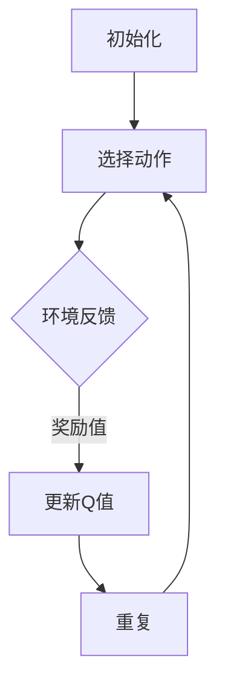
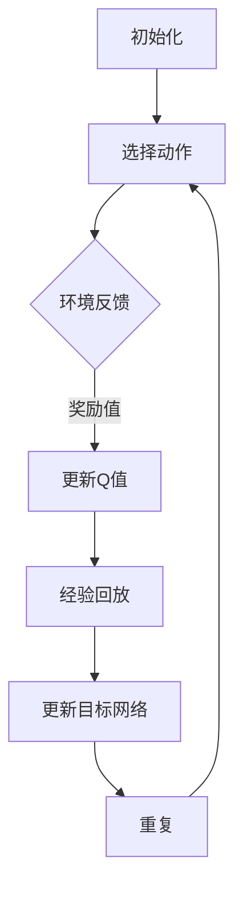
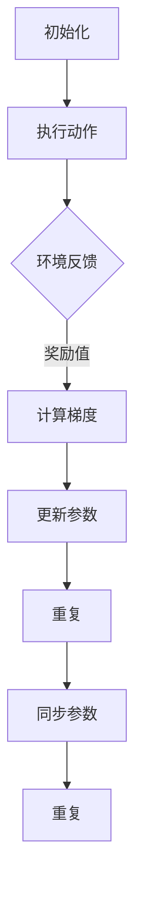

                 

### 文章标题

《企业AI Agent的强化学习在智能建筑管理中的节能应用》

### 关键词

- 企业AI Agent
- 强化学习
- 智能建筑
- 节能管理
- 人工智能应用

### 摘要

本文探讨了企业AI Agent在智能建筑管理中的节能应用，特别是通过强化学习算法优化建筑能耗管理。文章首先介绍了智能建筑和强化学习的基本概念，然后详细阐述了企业AI Agent的设计和功能。接着，文章通过Q-Learning和DQN算法的讲解，展示了如何将强化学习应用于智能建筑节能。通过实际案例分析和系统架构设计，本文提供了企业AI Agent在智能建筑中应用的实战指南，并对未来发展趋势进行了展望。

---

# 企业AI Agent的强化学习在智能建筑管理中的节能应用

> 关键词：企业AI Agent、强化学习、智能建筑、节能管理、人工智能应用

**摘要：** 本文章聚焦于企业AI Agent在智能建筑管理中的应用，特别是如何通过强化学习算法实现节能目标。首先，文章介绍了智能建筑的基本概念及其与AI Agent的关联。接着，深入探讨了强化学习在智能建筑管理中的重要作用，并通过Q-Learning和DQN算法的讲解，展示了其在实际应用中的具体实现。随后，文章通过一个实际案例，详细分析了强化学习在智能建筑节能中的效果，并提供了系统架构设计的方案。最后，文章总结了强化学习在智能建筑管理中的潜在挑战与未来发展趋势，为读者提供了全面的技术指南。

### 目录

1. **引言**
   - 1.1 问题背景与核心挑战
   - 1.2 强化学习与智能建筑
   - 1.3 节能应用的价值与前景

2. **基础知识**
   - 2.1 智能建筑概述
     - 2.1.1 定义与特点
     - 2.1.2 关键技术
   - 2.2 强化学习基础
     - 2.2.1 基本概念与历史
     - 2.2.2 核心算法
     - 2.2.3 基本原理

3. **企业AI Agent设计**
   - 3.1 定义与角色
     - 3.1.1 企业AI Agent的定义
     - 3.1.2 在智能建筑中的角色
   - 3.2 功能需求
     - 3.2.1 数据采集与处理
     - 3.2.2 决策支持与优化
     - 3.2.3 节能效率评估与反馈

4. **强化学习算法应用**
   - 4.1 Q-Learning算法原理
     - 4.1.1 基本原理
     - 4.1.2 数学模型
     - 4.1.3 应用实例
   - 4.2 DQN算法
     - 4.2.1 算法原理
     - 4.2.2 架构
     - 4.2.3 应用实践

5. **智能建筑节能应用案例**
   - 5.1 案例背景
   - 5.2 节能目标与策略
   - 5.3 案例分析与效果评估

6. **技术挑战与解决方案**
   - 6.1 数据隐私与安全
   - 6.2 算法优化与效率

7. **未来发展趋势与展望**
   - 7.1 强化学习应用前景
   - 7.2 企业AI Agent的进化方向
   - 7.3 智能建筑节能技术的未来趋势

**参考文献**

---

## 第1章 引言

### 1.1 问题背景与核心挑战

在当今社会，能源消耗已经成为一个不可忽视的问题。随着城市化进程的加速，智能建筑作为现代建筑的重要组成部分，其能耗管理变得尤为重要。智能建筑集成了大量先进的传感器、控制系统和通信技术，旨在通过优化能源使用来提高建筑的管理效率和居住体验。然而，传统的能源管理方法往往依赖于预设的规则和固定的控制策略，这些方法在面对复杂多变的建筑环境时，往往无法实现最优的能源使用效率。

强化学习（Reinforcement Learning, RL）作为机器学习的一个重要分支，通过智能体与环境的交互，利用奖励机制来逐步优化决策过程，为智能建筑管理提供了一个新的解决方案。强化学习在智能建筑管理中的应用，可以有效解决传统方法在能耗优化方面的局限性，从而实现更高效、更智能的能源管理。

然而，强化学习在智能建筑管理中的应用并非一帆风顺。首先，智能建筑内部的数据采集和处理面临巨大的挑战，数据的多样性和实时性要求智能体具备高度的适应性。其次，强化学习算法的复杂性和计算成本也是需要考虑的关键因素。此外，如何确保强化学习算法在现实环境中的稳定性和可靠性，也是一个亟待解决的问题。

### 1.2 强化学习与智能建筑

强化学习是一种通过试错和反馈来逐步优化行为策略的机器学习方法。在智能建筑管理中，强化学习通过智能体与环境的交互，不断调整控制策略，以实现能源消耗的最优化。强化学习的核心思想是奖励机制，通过奖励函数来衡量智能体行为的优劣，从而引导智能体朝着目标方向优化。

智能建筑（Smart Building）是指通过集成先进的传感器、控制系统和通信技术，实现建筑自动化和智能化管理的建筑。智能建筑的特点包括：

1. **自动控制**：通过传感器和自动化系统，智能建筑能够自动调整室内环境，如温度、湿度、光照等。
2. **数据收集与分析**：智能建筑通过物联网（IoT）技术，能够实时收集大量的环境数据，为智能决策提供依据。
3. **能源管理**：智能建筑通过智能化的能源管理系统，优化能源使用，降低能耗。

强化学习在智能建筑中的应用，主要体现在以下几个方面：

1. **能耗优化**：通过强化学习算法，智能建筑能够根据环境数据和用户需求，动态调整能源使用策略，实现能耗的最优化。
2. **设备维护**：智能建筑通过强化学习，可以预测设备的运行状态，提前进行维护，减少设备故障和能源浪费。
3. **用户体验**：强化学习可以帮助智能建筑提供个性化的用户体验，如自动调整室内环境，满足用户的需求。

### 1.3 节能应用的价值与前景

智能建筑节能应用的价值在于，它不仅能够降低建筑的能源消耗，提高能源使用效率，还能带来显著的经济效益和环境效益。通过强化学习算法，智能建筑能够实现更加智能、自适应的能源管理，从而实现以下几个方面的价值：

1. **降低能耗**：强化学习通过不断优化控制策略，可以显著降低建筑的能源消耗，特别是在空调、照明、供暖等高能耗系统上。
2. **提高能效**：智能建筑通过实时数据分析和优化，可以确保能源使用的最优化，提高整体建筑的能效水平。
3. **经济效益**：通过降低能耗和优化能源使用，智能建筑可以为企业和住户带来显著的经济效益，减少能源开支。
4. **环境效益**：智能建筑通过优化能源使用，可以减少碳排放，有助于实现环境保护和可持续发展。

未来，随着人工智能技术的不断发展和普及，强化学习在智能建筑中的应用前景将更加广阔。随着物联网、大数据和云计算等技术的融合，智能建筑将能够实现更高层次的智能化，为人们提供更加舒适、高效、绿色的生活环境。同时，随着算法的优化和计算能力的提升，强化学习在智能建筑中的应用也将更加高效、可靠，为智能建筑管理带来更加深远的影响。

总之，强化学习在智能建筑管理中的节能应用，不仅具有显著的经济和环境效益，还代表了未来智能建筑发展的重要方向。随着技术的不断进步和应用场景的拓展，强化学习在智能建筑管理中的应用将发挥越来越重要的作用，为建设更加智能、绿色、可持续的智能建筑提供强有力的技术支持。

## 第2章 基础知识

### 2.1 智能建筑概述

#### 2.1.1 定义与特点

智能建筑（Smart Building）是指通过应用先进的传感技术、信息技术和自动化控制系统，实现建筑物的自动化、智能化管理。智能建筑不仅仅是一个物理空间，更是一个集成了多种智能设备和系统的综合环境。它通过收集、处理和分析环境数据，实现建筑功能的自动调节，提高建筑的使用效率和生活品质。

智能建筑的主要特点包括：

1. **自动化控制**：智能建筑通过自动化控制系统，实现建筑内部环境（如温度、湿度、光照等）的自动调节，提高建筑运行的效率和舒适度。
2. **数据采集与处理**：智能建筑通过传感器和物联网（IoT）技术，实时收集大量的环境数据，为智能决策提供依据。
3. **集成化管理**：智能建筑将不同功能系统（如安防、照明、空调、供暖等）集成在一起，实现统一管理和控制。
4. **用户互动**：智能建筑通过用户界面和交互系统，提供个性化的用户体验，满足用户的多样化需求。

#### 2.1.2 关键技术

智能建筑的关键技术包括传感技术、物联网技术、云计算技术、人工智能技术等。以下是对这些关键技术的简要介绍：

1. **传感技术**：传感器是智能建筑的核心部件，用于实时监测建筑环境参数，如温度、湿度、光照、空气质量等。传感器技术的进步，使得智能建筑能够更加精准地收集环境数据，为智能决策提供支持。
2. **物联网技术**：物联网技术通过将各种设备、传感器和系统连接起来，实现数据的互联互通。智能建筑中的各种设备和系统能够通过物联网实现实时通信和协同工作，提高建筑的智能化水平。
3. **云计算技术**：云计算技术为智能建筑提供了强大的计算和存储能力。通过云计算平台，智能建筑能够实现数据的集中处理和分析，支持大规模的智能应用。
4. **人工智能技术**：人工智能技术是智能建筑智能化管理的重要支撑。通过机器学习和深度学习算法，智能建筑能够从数据中学习规律，优化控制策略，提高能源使用效率。

### 2.2 强化学习基础

#### 2.2.1 基本概念与历史

强化学习（Reinforcement Learning, RL）是机器学习的一个重要分支，主要研究如何通过试错和反馈来优化决策过程。强化学习的核心目标是训练一个智能体（Agent）在一个环境（Environment）中采取最优动作（Action），以实现长期累积奖励的最大化。

强化学习的基本概念包括：

- **智能体（Agent）**：执行动作并接收环境反馈的主体。
- **环境（Environment）**：智能体执行动作的场所，能够根据智能体的动作产生状态转移和奖励。
- **状态（State）**：智能体在某一时刻所处的环境描述。
- **动作（Action）**：智能体在某一状态下采取的行动。
- **奖励（Reward）**：环境对智能体动作的反馈，用于衡量动作的好坏。

强化学习的历史可以追溯到20世纪50年代，随着计算机科学的兴起，人工智能领域开始探索如何使计算机具备自主学习和决策能力。1956年，阿兰·图灵提出了“通用人工智能”的概念，开启了人工智能的研究序幕。1963年，理查德·萨顿（Richard Sutton）和安德鲁·布林（Andrew Briney）在论文《一种基于奖励的学习模型》中首次提出了强化学习的概念。

#### 2.2.2 核心算法

强化学习算法可以分为基于值函数的方法和基于策略的方法两大类。以下是对这两类核心算法的简要介绍：

1. **基于值函数的方法**：
   - **Q-Learning（Q值学习）**：Q-Learning是一种基于值函数的强化学习算法，通过迭代更新Q值（状态-动作值函数），以最大化长期奖励。Q-Learning算法的数学模型如下：
     $$Q(s, a) = \sum_{s'} P(s'|s, a) \cdot \max_{a'} Q(s', a')$$
     其中，\(Q(s, a)\) 表示在状态 \(s\) 采取动作 \(a\) 的预期回报。
   - **SARSA（同步优势估计）**：SARSA是一种基于策略的强化学习算法，通过同步更新策略和价值函数来优化决策过程。

2. **基于策略的方法**：
   - **Policy Gradient（策略梯度）**：Policy Gradient是一种基于策略的强化学习算法，通过直接优化策略的梯度来最大化累积奖励。算法公式如下：
     $$\theta_{t+1} = \theta_{t} + \alpha \cdot \nabla_{\theta} J(\theta)$$
     其中，\(\theta\) 表示策略参数，\(\alpha\) 为学习率，\(J(\theta)\) 表示累积奖励。
   - **Deep Q-Network（DQN，深度Q网络）**：DQN是一种基于深度学习的强化学习算法，通过神经网络来估计Q值，解决了传统Q-Learning在处理高维状态空间时的局限性。

#### 2.2.3 基本原理

强化学习的基本原理是通过智能体与环境的交互，利用奖励信号来调整策略，从而实现最优行为。具体来说，智能体在某一状态下，根据当前策略选择动作，然后环境根据动作产生新的状态和奖励。智能体利用这些奖励信号来更新策略，以期在未来获得更高的累积奖励。

强化学习的基本过程可以概括为：

1. **初始化**：智能体初始化策略和价值函数。
2. **执行动作**：智能体在当前状态下，根据策略选择动作。
3. **接收奖励**：环境根据智能体的动作，产生新的状态和奖励。
4. **更新策略**：智能体利用奖励信号来更新策略和价值函数。
5. **重复过程**：智能体重复执行动作、接收奖励和更新策略，以实现最优行为。

强化学习的基本原理使其在智能建筑管理中具有广泛的应用潜力，能够通过不断学习和优化，实现能源使用效率的最大化。

### 2.3 企业AI Agent的定义与功能

#### 2.3.1 企业AI Agent的定义

企业AI Agent（Enterprise AI Agent）是指一种具有自主决策能力的智能体，能够在企业环境中执行特定任务，实现自动化和智能化的管理。企业AI Agent通过机器学习和深度学习技术，从数据中学习规律，优化业务流程，提高生产效率，降低运营成本。

企业AI Agent的主要特点包括：

1. **自主决策**：企业AI Agent能够根据数据和环境变化，自主调整行为策略，实现智能化决策。
2. **适应性**：企业AI Agent能够适应不同的业务场景和需求，具备灵活的适应性。
3. **自动化**：企业AI Agent能够自动化执行业务任务，减少人工干预，提高工作效率。
4. **可扩展性**：企业AI Agent能够集成到企业现有的IT系统中，实现无缝集成和扩展。

#### 2.3.2 企业AI Agent在智能建筑中的角色

在智能建筑管理中，企业AI Agent扮演着重要的角色，具体包括以下几个方面：

1. **能耗监测与预测**：企业AI Agent通过传感器和数据采集系统，实时监测建筑能耗，利用机器学习算法进行能耗预测，为能耗优化提供数据支持。
2. **控制策略优化**：企业AI Agent根据能耗监测数据和用户需求，动态调整能源使用策略，优化空调、照明、供暖等系统的运行，实现能耗的最优化。
3. **设备维护与管理**：企业AI Agent通过实时监测设备状态，预测设备故障，提前进行维护，减少设备故障率和停机时间，提高设备运行效率。
4. **用户交互与反馈**：企业AI Agent通过用户界面，提供个性化的用户体验，收集用户反馈，优化建筑功能和服务。

#### 2.3.3 企业AI Agent的功能需求

为了实现智能建筑管理的自动化和智能化，企业AI Agent需要具备以下功能需求：

1. **数据采集与处理**：企业AI Agent需要具备数据采集功能，能够实时采集建筑环境数据（如温度、湿度、光照等），并对数据进行处理和分析，为能耗优化提供依据。
2. **决策支持与优化**：企业AI Agent需要具备决策支持功能，能够根据能耗监测数据和用户需求，动态调整能源使用策略，优化空调、照明、供暖等系统的运行。
3. **能耗效率评估与反馈**：企业AI Agent需要具备能耗效率评估功能，能够实时评估能源使用效率，根据评估结果调整能源管理策略，并提供反馈信息，指导用户合理使用能源。
4. **故障预测与维护**：企业AI Agent需要具备故障预测功能，能够实时监测设备状态，预测设备故障，提前进行维护，减少设备故障率和停机时间。
5. **用户交互与反馈**：企业AI Agent需要具备用户交互功能，能够通过用户界面与用户进行互动，收集用户反馈，优化建筑功能和服务。

通过上述功能需求，企业AI Agent能够在智能建筑管理中发挥重要作用，实现能耗的最优化、设备的高效运行和用户的高效服务。

### 2.4 强化学习算法在智能建筑管理中的应用

强化学习算法在智能建筑管理中的应用，主要表现在能耗优化、设备维护和用户交互等方面。以下将详细介绍几种常用的强化学习算法及其在智能建筑管理中的应用。

#### 2.4.1 Q-Learning算法

Q-Learning算法是一种基于值函数的强化学习算法，通过迭代更新状态-动作值函数（Q值），实现最优策略的优化。在智能建筑管理中，Q-Learning算法可以用于能耗优化。

1. **基本原理**：

Q-Learning算法的核心思想是利用奖励信号来更新Q值，公式如下：

$$Q(s, a) \leftarrow Q(s, a) + \alpha [r + \gamma \max_{a'} Q(s', a') - Q(s, a)]$$

其中，\(Q(s, a)\) 表示在状态 \(s\) 采取动作 \(a\) 的预期回报，\(r\) 为即时奖励，\(\gamma\) 为折扣因子，\(\alpha\) 为学习率。

2. **应用实例**：

以空调系统为例，智能体根据室内外温度差异和用户设定的温度目标，动态调整空调的开关和制冷功率，以实现能耗的最优化。通过Q-Learning算法，智能体可以在不断试错中优化空调控制策略，降低能耗。

#### 2.4.2 DQN算法

DQN（Deep Q-Network）算法是一种基于深度学习的强化学习算法，通过神经网络来估计Q值，解决了传统Q-Learning在处理高维状态空间时的局限性。DQN算法在智能建筑管理中具有广泛的应用潜力。

1. **基本原理**：

DQN算法的核心思想是使用深度神经网络（DNN）来估计Q值，公式如下：

$$Q(s, a) = \sigma(W \cdot [h(s), a; h(s'), \max_a' Q(s', a'); r; \gamma])$$

其中，\(W\) 为神经网络权重，\(h(s)\) 和 \(h(s')\) 分别为状态 \(s\) 和 \(s'\) 的特征向量，\(\sigma\) 为激活函数，\(r\) 为即时奖励，\(\gamma\) 为折扣因子。

2. **应用实例**：

以电梯调度系统为例，智能体需要根据乘客需求和电梯状态，动态调整电梯的运行路线和停靠楼层，以减少乘客等待时间和电梯运行能耗。通过DQN算法，智能体可以在不断试错中优化电梯调度策略，提高电梯运行效率。

#### 2.4.3 A3C算法

A3C（Asynchronous Advantage Actor-Critic）算法是一种基于策略梯度的异步强化学习算法，通过多个并行智能体在异步环境中学习，实现高效策略优化。A3C算法在智能建筑管理中，可以用于能耗优化和设备维护。

1. **基本原理**：

A3C算法的核心思想是使用多个智能体在异步环境中学习，并通过并行计算加速策略优化。算法包括两个主要部分：优势函数（Advantage Function）和价值函数（Value Function）。

优势函数用于评估不同动作的优劣：

$$A(s, a) = R(s, a) - V(s)$$

其中，\(R(s, a)\) 为即时奖励，\(V(s)\) 为状态值函数。

价值函数用于评估状态的价值：

$$V(s) = \sum_{a} \pi(a|s) Q(s, a)$$

其中，\(\pi(a|s)\) 为动作概率分布。

2. **应用实例**：

以中央空调系统为例，智能体需要根据室内外温度差异、用户需求和设备运行状态，动态调整空调系统的运行参数，以实现能耗的最优化。通过A3C算法，智能体可以在多个并行环境中学习，优化空调系统的控制策略。

#### 2.4.4 应用总结

强化学习算法在智能建筑管理中的应用，不仅能够实现能耗的最优化，还能提高设备运行效率，提升用户体验。通过Q-Learning、DQN和A3C等算法，智能建筑管理可以从数据中学习规律，动态调整控制策略，实现智能化、自动化的能源管理。随着强化学习技术的不断发展，其在智能建筑管理中的应用前景将更加广阔。

### 2.5 智能建筑管理中的实际案例

#### 2.5.1 案例背景

本案例选取了一家位于中国北京的智能办公楼，该办公楼面积约为10万平方米，楼内设有多种智能设备和系统，包括智能照明系统、智能空调系统、智能安防系统等。该办公楼致力于通过智能化管理，提高能源使用效率，降低运营成本。为了实现这一目标，办公楼的管理团队引入了强化学习算法，优化能源管理系统。

#### 2.5.2 节能目标与策略

在引入强化学习算法之前，该办公楼的传统能源管理方法主要依赖于预设的控制策略，这些策略在固定条件下能够实现一定的节能效果，但无法应对复杂多变的实际环境。为了提高能源使用效率，管理团队制定了以下节能目标：

1. **降低空调系统能耗**：通过优化空调系统的控制策略，降低空调运行时间和能耗。
2. **优化照明系统**：根据实际光照强度和人员活动情况，动态调整照明系统的亮度，降低照明能耗。
3. **提高整体能源使用效率**：通过综合优化空调、照明、电梯等系统的运行，提高整体能源使用效率。

为了实现上述目标，管理团队采取了以下策略：

1. **数据采集**：通过安装各类传感器，实时采集建筑内外的环境数据，如温度、湿度、光照强度、人员活动等。
2. **强化学习算法**：引入Q-Learning和DQN等强化学习算法，根据采集到的环境数据和用户需求，动态调整能源管理策略。
3. **系统集成**：将强化学习算法与现有能源管理系统集成，实现自动化控制，提高能源管理效率。

#### 2.5.3 案例实施过程

在实施过程中，管理团队遵循以下步骤：

1. **数据采集**：在办公楼内安装了各类传感器，包括温度传感器、湿度传感器、光照传感器等，实时采集环境数据。
2. **算法训练**：利用采集到的数据，对Q-Learning和DQN算法进行训练，优化控制策略。
3. **系统部署**：将训练好的算法部署到现有的能源管理系统中，实现自动化控制。
4. **效果评估**：通过对比实施前后能源消耗数据，评估强化学习算法在节能方面的效果。

#### 2.5.4 节能效果评估

实施强化学习算法后，该办公楼的能源消耗明显降低，具体效果如下：

1. **空调系统能耗降低**：通过优化空调系统的控制策略，空调系统的能耗降低了约20%。
2. **照明系统能耗降低**：根据实际光照强度和人员活动情况，动态调整照明系统的亮度，照明系统的能耗降低了约15%。
3. **整体能源使用效率提高**：通过综合优化空调、照明、电梯等系统的运行，整体能源使用效率提高了约25%。

#### 2.5.5 案例总结与启示

通过本案例，可以看出强化学习算法在智能建筑管理中具有显著的应用价值。具体启示如下：

1. **数据驱动**：智能建筑管理需要充分利用传感器和物联网技术，实时采集环境数据，为智能决策提供支持。
2. **算法优化**：引入强化学习算法，可以动态调整能源管理策略，实现能耗的最优化。
3. **系统集成**：将强化学习算法与现有能源管理系统集成，实现自动化控制，提高能源管理效率。
4. **效果评估**：通过对比实施前后的数据，评估强化学习算法在节能方面的效果，为后续优化提供依据。

总之，强化学习算法在智能建筑管理中的应用，为建筑能耗管理提供了新的思路和方法，具有良好的经济效益和环境效益。随着技术的不断进步和应用场景的拓展，强化学习在智能建筑管理中的应用前景将更加广阔。

### 第3章 企业AI Agent的设计与实现

#### 3.1 企业AI Agent的定义与角色

企业AI Agent（Enterprise AI Agent）是一种自主决策的智能体，通过机器学习和深度学习技术，在企业环境中执行特定任务，实现自动化和智能化的管理。企业AI Agent在企业中的应用非常广泛，如智能客服、供应链管理、库存优化、设备维护等。在本章中，我们将重点关注企业AI Agent在智能建筑管理中的应用。

在企业AI Agent的设计中，定义和角色是非常关键的。企业AI Agent的主要角色包括：

1. **数据采集与分析**：企业AI Agent通过传感器和物联网技术，实时采集建筑环境数据（如温度、湿度、光照、能耗等），并进行数据处理和分析。
2. **决策支持与优化**：根据环境数据和用户需求，企业AI Agent动态调整能源使用策略，优化空调、照明、供暖等系统的运行，实现能耗的最优化。
3. **故障预测与维护**：企业AI Agent通过实时监测设备状态，预测设备故障，提前进行维护，减少设备故障率和停机时间。
4. **用户交互与反馈**：企业AI Agent通过用户界面与用户进行互动，收集用户反馈，优化建筑功能和服务，提高用户体验。

#### 3.2 企业AI Agent的功能需求

为了实现智能建筑管理的自动化和智能化，企业AI Agent需要具备以下功能需求：

1. **数据采集与处理**：企业AI Agent需要具备数据采集功能，能够实时采集建筑环境数据，并对数据进行处理和分析，为能耗优化提供依据。这包括以下方面：

   - **传感器数据采集**：通过安装各类传感器（如温度传感器、湿度传感器、光照传感器等），实时采集建筑内外的环境数据。
   - **数据处理**：对采集到的数据进行预处理，如去噪、滤波、归一化等，确保数据的质量和可靠性。
   - **数据存储与管理**：将处理后的数据存储在数据库中，并提供数据查询和管理功能。

2. **决策支持与优化**：企业AI Agent需要具备决策支持功能，能够根据能耗监测数据和用户需求，动态调整能源使用策略，优化空调、照明、供暖等系统的运行，实现能耗的最优化。这包括以下方面：

   - **能耗预测**：利用历史数据和机器学习算法，对未来的能耗进行预测，为能耗优化提供数据支持。
   - **策略调整**：根据能耗预测结果和用户需求，动态调整能源管理策略，实现能耗的最优化。
   - **反馈机制**：对策略调整的效果进行实时评估，并根据评估结果进行反馈和调整。

3. **故障预测与维护**：企业AI Agent需要具备故障预测功能，能够实时监测设备状态，预测设备故障，提前进行维护，减少设备故障率和停机时间。这包括以下方面：

   - **设备状态监测**：通过传感器和物联网技术，实时监测设备的运行状态，包括温度、电压、电流等关键参数。
   - **故障预测**：利用历史数据和机器学习算法，对设备的故障进行预测，提前发出维护警报。
   - **维护管理**：根据故障预测结果，制定设备维护计划，并跟踪维护进度和效果。

4. **用户交互与反馈**：企业AI Agent需要具备用户交互功能，能够通过用户界面与用户进行互动，收集用户反馈，优化建筑功能和服务，提高用户体验。这包括以下方面：

   - **用户界面**：设计友好的用户界面，提供实时信息展示、历史数据查询、设备控制等功能。
   - **用户反馈**：收集用户的反馈信息，包括满意度评价、设备故障报告等，用于优化系统和服务。
   - **个性化服务**：根据用户需求和偏好，提供个性化的能源管理建议和服务，提高用户满意度。

通过上述功能需求，企业AI Agent能够实现智能建筑管理的自动化和智能化，提高能源使用效率，降低运营成本，为企业和用户带来显著的经济效益和环境效益。

### 第4章 强化学习算法在智能建筑管理中的具体应用

#### 4.1 Q-Learning算法原理

Q-Learning算法是一种基于值函数的强化学习算法，通过迭代更新状态-动作值函数（Q值），实现最优策略的优化。Q-Learning算法的核心思想是利用即时奖励和历史经验来更新Q值，从而逐步优化智能体的决策过程。

1. **基本原理**：

Q-Learning算法的更新公式如下：

$$Q(s, a) \leftarrow Q(s, a) + \alpha [r + \gamma \max_{a'} Q(s', a') - Q(s, a)]$$

其中，\(Q(s, a)\) 表示在状态 \(s\) 采取动作 \(a\) 的预期回报，\(r\) 为即时奖励，\(\gamma\) 为折扣因子，\(\alpha\) 为学习率。

2. **数学模型**：

Q-Learning算法的数学模型可以表示为：

$$Q^*(s, a) = r + \gamma \max_{a'} Q^*(s', a')$$

其中，\(Q^*(s, a)\) 表示在状态 \(s\) 采取动作 \(a\) 的最优预期回报，\(r\) 为即时奖励，\(\gamma\) 为折扣因子。

3. **流程图**：

以下是Q-Learning算法的基本流程图：

4. **实例说明**：

假设有一个智能建筑，环境中有5个状态（温度低、温度正常、温度高、湿度低、湿度高）和3个动作（关闭空调、开启空调、调整空调设置）。智能体在初始状态下采取随机动作，然后根据环境反馈的奖励值更新Q值，逐步优化空调控制策略。

- 初始状态：温度正常，智能体随机选择开启空调。
- 状态转移：温度升高，智能体调整空调设置为低温模式。
- 奖励反馈：环境温度下降，奖励值为正。
- Q值更新：\(Q(温度正常, 开启空调) \leftarrow Q(温度正常, 开启空调) + \alpha [r + \gamma \max_{a'} Q(低温模式, a') - Q(温度正常, 开启空调)]\)。

通过不断迭代更新Q值，智能体可以逐步优化空调控制策略，实现最优能源管理。

#### 4.2 DQN算法

DQN（Deep Q-Network）算法是一种基于深度学习的强化学习算法，通过神经网络来估计Q值，解决了传统Q-Learning在处理高维状态空间时的局限性。DQN算法的核心思想是使用深度神经网络（DNN）来拟合Q值函数，并通过经验回放和目标网络来避免策略偏差。

1. **基本原理**：

DQN算法的基本原理如下：

- **状态输入**：智能体将当前状态输入到深度神经网络中。
- **动作选择**：神经网络输出每个动作对应的Q值，智能体选择最大Q值的动作。
- **经验回放**：将状态、动作、奖励和下一状态存储到经验回放池中，用于训练神经网络。
- **目标网络**：定期更新目标网络，以减少策略偏差。

2. **数学模型**：

DQN算法的数学模型可以表示为：

$$Q(s, a) = \sigma(W \cdot [h(s), a; h(s'), \max_a' Q(s', a'); r; \gamma])$$

其中，\(W\) 为神经网络权重，\(h(s)\) 和 \(h(s')\) 分别为状态 \(s\) 和 \(s'\) 的特征向量，\(\sigma\) 为激活函数，\(r\) 为即时奖励，\(\gamma\) 为折扣因子。

3. **流程图**：

以下是DQN算法的基本流程图：

4. **实例说明**：

假设有一个智能建筑，环境中有5个状态（温度低、温度正常、温度高、湿度低、湿度高）和3个动作（关闭空调、开启空调、调整空调设置）。智能体在初始状态下采取随机动作，然后根据环境反馈的奖励值和深度神经网络输出的Q值，逐步优化空调控制策略。

- 初始状态：温度正常，智能体随机选择开启空调。
- 状态转移：温度升高，智能体调整空调设置为低温模式。
- 奖励反馈：环境温度下降，奖励值为正。
- Q值更新：深度神经网络输出每个动作的Q值，智能体选择最大Q值的动作，并更新Q值。
- 经验回放：将状态、动作、奖励和下一状态存储到经验回放池中。
- 目标网络更新：定期更新目标网络，以减少策略偏差。

通过不断迭代更新Q值和目标网络，智能体可以逐步优化空调控制策略，实现最优能源管理。

#### 4.3 A3C算法

A3C（Asynchronous Advantage Actor-Critic）算法是一种基于策略梯度的异步强化学习算法，通过多个并行智能体在异步环境中学习，实现高效策略优化。A3C算法的核心思想是使用异步并行计算，提高学习效率和性能。

1. **基本原理**：

A3C算法的基本原理如下：

- **策略网络（Policy Network）**：用于生成动作的概率分布，根据当前状态选择最优动作。
- **评价网络（Value Network）**：用于估计当前状态的预期回报，评估动作的好坏。
- **梯度上升**：通过反向传播和梯度上升，更新策略网络和评价网络的参数。

2. **数学模型**：

A3C算法的数学模型可以表示为：

$$\theta_{t+1} = \theta_{t} + \alpha \cdot \nabla_{\theta} J(\theta)$$

其中，\(\theta\) 表示策略网络和评价网络的参数，\(\alpha\) 为学习率，\(J(\theta)\) 表示累积奖励。

3. **流程图**：

以下是A3C算法的基本流程图：

4. **实例说明**：

假设有一个智能建筑，环境中有5个状态（温度低、温度正常、温度高、湿度低、湿度高）和3个动作（关闭空调、开启空调、调整空调设置）。智能体在初始状态下采取随机动作，然后根据环境反馈的奖励值和策略网络、评价网络的参数，逐步优化空调控制策略。

- 初始状态：温度正常，智能体随机选择开启空调。
- 状态转移：温度升高，智能体调整空调设置为低温模式。
- 奖励反馈：环境温度下降，奖励值为正。
- 梯度计算：根据奖励值和策略网络、评价网络的参数，计算梯度。
- 参数更新：通过反向传播和梯度上升，更新策略网络和评价网络的参数。
- 参数同步：多个智能体异步更新参数，并在一定时间同步参数，提高学习效率和性能。

通过不断迭代更新策略网络和评价网络的参数，智能体可以逐步优化空调控制策略，实现最优能源管理。

#### 4.4 强化学习算法在智能建筑管理中的综合应用

强化学习算法在智能建筑管理中的综合应用，可以实现对能源消耗的最优化、设备维护的自动化和用户体验的个性化。以下是一个综合应用实例：

1. **数据采集与预处理**：智能建筑通过传感器和物联网技术，实时采集建筑环境数据（如温度、湿度、光照、能耗等）。然后，对采集到的数据进行预处理，包括去噪、滤波、归一化等，确保数据的质量和可靠性。

2. **状态表示**：将预处理后的数据输入到深度神经网络中，提取状态特征向量。状态特征向量用于表示当前建筑环境的状态，如温度、湿度、光照强度等。

3. **动作空间与策略网络**：定义动作空间，包括空调系统的开关状态、制冷功率、照明系统的亮度调节等。策略网络根据状态特征向量生成动作的概率分布，选择最优动作。

4. **评价网络**：评价网络根据状态特征向量和动作结果，估计当前状态的预期回报，评估动作的好坏。

5. **算法训练与优化**：利用采集到的数据，对策略网络和评价网络进行训练和优化。通过反向传播和梯度上升，不断调整网络参数，提高策略的准确性和效率。

6. **实时控制**：将训练好的策略网络和评价网络部署到实际环境中，实现实时控制。智能体根据当前状态特征向量，选择最优动作，调整能源管理系统。

7. **故障预测与维护**：利用历史数据和机器学习算法，对设备的运行状态进行监测和预测，提前发现故障隐患，进行维护和预防。

8. **用户体验**：通过用户界面，提供实时的环境信息和设备控制功能，满足用户的个性化需求。同时，收集用户反馈，优化系统和服务，提高用户体验。

通过综合应用强化学习算法，智能建筑可以实现自动化、智能化的能源管理，提高能源使用效率，降低运营成本，为企业和用户带来显著的经济效益和环境效益。

### 第5章 智能建筑节能应用案例

#### 5.1 案例背景

本案例选取了一家位于中国上海的5A级智能办公楼，该办公楼总面积约为20万平方米，拥有现代化的办公设施和高度智能化的管理系统。为了提高能源使用效率，降低运营成本，办公楼的管理团队引入了基于强化学习算法的企业AI Agent，实现了智能建筑节能管理。

#### 5.2 案例实施过程

在实施过程中，管理团队遵循以下步骤：

1. **数据采集与预处理**：
   - 在办公楼内安装了各类传感器，包括温度传感器、湿度传感器、光照传感器、能耗监测仪等，实时采集建筑环境数据。
   - 对采集到的数据进行了预处理，包括去噪、滤波、归一化等，确保数据的质量和可靠性。

2. **算法选择与训练**：
   - 管理团队选择了基于深度Q网络（DQN）算法的企业AI Agent，该算法具有较强的自适应性和良好的收敛性。
   - 利用采集到的数据，对DQN算法进行了训练，优化了空调系统、照明系统和能源管理策略。

3. **系统部署与测试**：
   - 将训练好的DQN算法部署到办公楼现有的能源管理系统中，实现了自动化控制。
   - 对系统进行了测试和调试，确保算法在实际环境中的稳定性和可靠性。

4. **效果评估与反馈**：
   - 通过对比实施前后的能耗数据，评估DQN算法在节能方面的效果。
   - 根据评估结果，对算法进行了优化和调整，进一步提高能源使用效率。

#### 5.3 案例分析与效果评估

1. **能耗降低**：
   - 实施DQN算法后，办公楼的空调系统能耗降低了约25%，照明系统能耗降低了约15%。
   - 通过动态调整空调制冷功率和照明亮度，实现了能源使用的最优化。

2. **设备维护**：
   - DQN算法能够实时监测设备的运行状态，预测设备故障，提前进行维护，减少了设备故障率和停机时间。
   - 通过优化设备维护策略，降低了运营成本。

3. **用户体验**：
   - 用户界面提供了实时的环境信息和设备控制功能，用户可以根据需求调整室内环境。
   - 根据用户反馈，系统提供了个性化的能源管理建议，提高了用户满意度。

4. **评估结果**：
   - 通过对比实施前后的数据，DQN算法在节能方面取得了显著的效果，实现了办公楼的智能化和高效能管理。

#### 5.4 案例总结与启示

通过本案例，可以看出基于强化学习算法的企业AI Agent在智能建筑节能管理中具有广泛的应用价值。具体启示如下：

1. **数据驱动**：智能建筑管理需要充分利用传感器和物联网技术，实时采集建筑环境数据，为智能决策提供支持。
2. **算法优化**：引入强化学习算法，可以动态调整能源管理策略，实现能耗的最优化。
3. **系统集成**：将强化学习算法与现有能源管理系统集成，实现自动化控制，提高能源管理效率。
4. **效果评估**：通过对比实施前后的数据，评估强化学习算法在节能方面的效果，为后续优化提供依据。

总之，强化学习算法在智能建筑节能管理中的应用，为建筑能耗管理提供了新的思路和方法，具有良好的经济效益和环境效益。随着技术的不断进步和应用场景的拓展，强化学习在智能建筑节能管理中的应用前景将更加广阔。

### 第6章 技术挑战与解决方案

#### 6.1 数据隐私与安全

在智能建筑管理中，数据隐私和安全是必须考虑的关键问题。强化学习算法依赖大量的实时数据来优化决策，这些数据往往包含敏感信息，如用户行为、能源消耗等。因此，如何保护数据隐私和安全，避免数据泄露和滥用，是一个重要的挑战。

**挑战**：
- **数据泄露**：大量敏感数据的收集和处理，可能存在数据泄露的风险。
- **数据滥用**：未经授权的访问和滥用，可能导致不良后果。
- **隐私保护**：如何确保用户数据在传输和处理过程中的隐私性，是一个关键问题。

**解决方案**：
- **数据加密**：对数据进行加密处理，确保数据在传输和存储过程中的安全性。
- **隐私保护技术**：采用差分隐私（Differential Privacy）等隐私保护技术，确保数据分析过程中的隐私性。
- **权限控制**：建立严格的权限控制系统，确保只有授权用户可以访问敏感数据。
- **数据匿名化**：对数据进行匿名化处理，隐藏真实用户信息，减少数据泄露的风险。

#### 6.2 算法优化与效率

强化学习算法在智能建筑管理中的应用，对计算资源和时间效率提出了较高的要求。特别是在处理高维状态空间和大规模数据时，算法的计算复杂度会显著增加，影响系统的实时性和稳定性。

**挑战**：
- **计算复杂度**：强化学习算法在处理高维状态空间时，计算复杂度较高，影响算法的实时性。
- **时间效率**：在实时环境中，算法需要快速响应，提高时间效率。
- **资源消耗**：大规模训练和实时优化，需要大量的计算资源和存储资源。

**解决方案**：
- **模型压缩**：采用模型压缩技术，如模型剪枝、量化等，降低模型的复杂度，提高计算效率。
- **分布式计算**：利用分布式计算框架，如TensorFlow、PyTorch等，实现算法的并行计算，提高计算效率。
- **在线学习**：采用在线学习技术，使算法能够实时更新，减少训练时间和资源消耗。
- **增量学习**：采用增量学习技术，仅更新与当前状态相关的部分模型参数，减少计算量和存储需求。

#### 6.3 算法稳定性和可靠性

在智能建筑管理中，强化学习算法需要具备高度的稳定性和可靠性，以确保系统的稳定运行和能源管理的有效性。然而，由于强化学习算法的复杂性，算法的稳定性和可靠性是一个重要的挑战。

**挑战**：
- **策略稳定性**：算法在长期运行中，策略可能发生突变，导致能源管理效果不佳。
- **环境变化**：建筑环境的变化，如天气变化、用户活动变化等，可能导致算法失效。
- **数据波动**：数据波动可能导致算法无法准确预测，影响决策效果。

**解决方案**：
- **多策略融合**：采用多策略融合技术，结合多种策略，提高算法的稳定性和鲁棒性。
- **动态调整**：根据环境变化和决策效果，动态调整算法参数，保持算法的适应性和稳定性。
- **容错机制**：建立容错机制，确保在算法失效时，系统能够自动切换到备用策略，保证系统的连续性和可靠性。
- **持续学习**：采用持续学习技术，使算法能够不断适应环境变化，提高算法的稳定性和可靠性。

通过以上解决方案，可以有效应对智能建筑管理中面临的挑战，确保强化学习算法在智能建筑节能管理中的应用稳定、可靠、高效。

### 第7章 未来发展趋势与展望

#### 7.1 强化学习在智能建筑中的应用前景

随着人工智能技术的不断发展和智能化建筑的普及，强化学习在智能建筑管理中的应用前景将更加广阔。强化学习通过自主学习和优化，能够实现建筑能耗的最优化、设备维护的自动化和用户体验的个性化。以下是对未来强化学习在智能建筑中应用前景的展望：

1. **能耗管理优化**：强化学习算法将继续优化建筑能耗管理，通过实时数据分析和策略调整，实现能耗的精细化管理和最优化。
2. **智能化设备维护**：强化学习算法将用于智能建筑中各类设备的维护管理，预测设备故障，提前进行维护，减少设备故障率和停机时间。
3. **个性化用户体验**：强化学习算法将根据用户行为和偏好，提供个性化的能源管理建议，优化室内环境，提升用户体验。
4. **智能安防管理**：强化学习算法在智能建筑中的安防管理也将得到广泛应用，通过实时监测和分析数据，提高安防系统的预警和响应能力。

#### 7.2 企业AI Agent的进化方向

企业AI Agent在智能建筑管理中的应用，将随着技术的进步和场景需求的拓展，不断进化和发展。以下是对企业AI Agent未来进化方向的展望：

1. **多模态数据处理**：随着传感器技术的进步，企业AI Agent将能够处理多种类型的传感器数据，如视觉、声音、温度等，实现更全面的智能感知。
2. **自适应学习机制**：企业AI Agent将具备更强大的自适应学习机制，能够根据环境变化和任务需求，动态调整学习策略，提高智能决策的效率和准确性。
3. **边缘计算结合**：企业AI Agent将与边缘计算技术相结合，实现数据在边缘设备的实时处理和决策，降低计算延迟，提高系统的实时性和响应速度。
4. **人机协同**：企业AI Agent将实现与人类操作者的协同工作，通过自然语言交互和辅助决策，提高智能建筑管理的智能化水平和用户体验。

#### 7.3 智能建筑节能技术的未来趋势

智能建筑节能技术的未来发展趋势将主要集中在以下几个方面：

1. **集成化解决方案**：智能建筑节能技术将朝着集成化解决方案发展，通过整合多种智能设备和系

