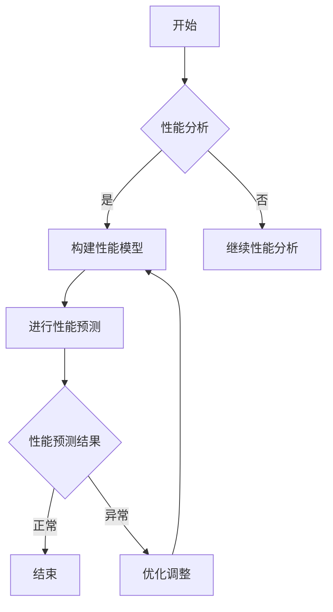

                 

# 企业AI Agent的微服务性能优化策略

## 概述

### 关键词
- 企业AI代理
- 微服务架构
- 性能优化
- 负载均衡
- 缓存策略
- 服务监控与日志分析
- 自动化调优

### 摘要
本篇文章将深入探讨企业AI代理的微服务性能优化策略。随着人工智能技术在企业中的应用日益广泛，企业AI代理作为人工智能的核心组件，其性能优化成为提升企业业务效率和用户体验的关键。文章将从需求分析与性能模型构建、服务拆分与负载均衡、缓存策略与数据一致性、服务监控与日志分析、性能调优与自动化等多个方面，逐步分析推理，详细阐述企业AI代理的微服务性能优化策略，并提供行业最佳实践与案例分析，以期为相关领域的从业人员提供有价值的参考。

## 引言

### 企业AI代理的概念

企业AI代理，通常指在企业环境中，利用人工智能技术，实现自动化、智能化的业务代理。这些代理可以模拟人类决策者的行为，处理复杂业务问题，提高业务运作效率。企业AI代理的核心特点包括：

- **自动化**：通过预定的规则和算法，自动执行业务操作，减少人工干预。
- **智能化**：利用机器学习、自然语言处理等技术，分析海量数据，提供智能决策支持。
- **适应性**：能够根据业务环境的变化，调整自身行为，优化业务流程。

### 微服务架构的挑战与优势

微服务架构是一种将应用程序拆分为多个小型、独立、可复用的服务架构。其优势包括：

- **灵活性与可扩展性**：服务之间独立部署，易于扩展和更新。
- **高可用性**：服务故障不会影响整个系统，降低了系统崩溃的风险。
- **松耦合**：服务之间通过API进行通信，降低服务间的依赖性。

然而，微服务架构也带来了一些挑战，如服务拆分策略、负载均衡、数据一致性等问题。

### 性能优化的重要性

企业AI代理的微服务性能优化至关重要，其直接影响企业的业务效率和用户体验。性能优化包括：

- **响应速度**：减少服务响应时间，提高用户体验。
- **稳定性**：提高系统稳定性，减少故障和中断。
- **资源利用率**：合理分配资源，提高硬件利用率。

本文将逐步分析企业AI代理的微服务性能优化策略，包括需求分析与性能模型构建、服务拆分与负载均衡、缓存策略与数据一致性、服务监控与日志分析、性能调优与自动化等方面，为企业提供一套系统性的性能优化方案。

## 需求分析与性能模型构建

### 需求分析

需求分析是性能优化的第一步，它帮助我们理解系统需要满足的功能和非功能需求。对于企业AI代理，需求分析主要包括以下几个方面：

- **功能需求**：包括数据采集、处理、分析、决策等核心功能。
- **非功能需求**：如响应时间、吞吐量、可用性、可扩展性、安全性等。

### 性能指标

性能指标是衡量系统性能的重要标准。对于企业AI代理，常见的性能指标包括：

- **响应时间**：服务处理请求的时间。
- **吞吐量**：单位时间内系统能够处理的数据量。
- **延迟**：数据从产生到被处理的时间。
- **资源利用率**：CPU、内存、网络等资源的利用率。

### 性能模型构建

性能模型是用于预测和分析系统性能的工具。构建性能模型通常包括以下步骤：

1. **确定性能需求**：根据业务需求，确定需要预测和分析的性能指标。
2. **数据收集**：收集系统的运行数据，包括日志、监控数据等。
3. **模型构建**：使用统计方法或机器学习算法，构建性能预测模型。
4. **模型验证**：通过模拟不同的负载情况，验证模型的准确性和稳定性。

### 性能预测与分析

性能预测与分析可以帮助我们提前发现潜在的性能问题，并采取相应的优化措施。常见的性能分析工具包括：

- **性能分析器**：如VMware vRealize Operations Manager、Microsoft System Center等。
- **日志分析工具**：如ELK（Elasticsearch、Logstash、Kibana）栈。
- **性能监控工具**：如Nagios、Zabbix等。

通过性能预测与分析，我们可以：

- **识别瓶颈**：确定系统性能瓶颈，如CPU过载、内存不足等。
- **优化资源配置**：根据性能分析结果，调整服务器配置、网络带宽等。
- **容量规划**：预测未来的负载需求，提前进行硬件升级和扩展。

### 性能模型的应用场景

1. **负载测试**：通过模拟高负载场景，测试系统的性能和稳定性。
2. **性能调优**：根据性能模型，调整系统配置，优化性能。
3. **运维监控**：实时监控系统性能，及时发现问题并进行处理。

### 总结

需求分析与性能模型构建是微服务性能优化的基础。通过需求分析，我们能够明确系统的功能和非功能需求；通过性能模型构建，我们能够预测和分析系统的性能，为后续的优化工作提供依据。在接下来的章节中，我们将继续探讨服务拆分与负载均衡、缓存策略与数据一致性、服务监控与日志分析等性能优化策略。

## 服务拆分与负载均衡

### 服务拆分的策略

服务拆分是将一个大型单体应用程序分解为多个小型、独立的服务。这种策略在微服务架构中至关重要，因为它有助于提高系统的灵活性和可扩展性。服务拆分的策略包括：

1. **按业务功能拆分**：将应用程序按照不同的业务功能进行拆分，每个服务负责一项具体的功能。
2. **按数据拆分**：将应用程序按照数据模型进行拆分，每个服务负责处理特定类型的数据。
3. **按用户群体拆分**：将应用程序按照不同的用户群体进行拆分，满足不同用户的需求。
4. **按地理位置拆分**：将应用程序按照地理位置进行拆分，提高服务的响应速度。

### 负载均衡算法

负载均衡是将请求分配到多个服务实例，以保证系统的性能和稳定性。常见的负载均衡算法包括：

1. **轮询（Round Robin）**：将请求依次分配到不同的服务实例。
2. **随机（Random）**：随机选择一个服务实例处理请求。
3. **最小连接数（Least Connections）**：将请求分配到连接数最少的服务实例。
4. **最小负载（Least Load）**：将请求分配到负载最小的服务实例。

### 实际案例：服务拆分与负载均衡在AI代理中的应用

以电商领域的AI代理为例，我们可以从以下几个方面进行服务拆分和负载均衡的优化：

1. **用户行为分析服务**：负责收集和分析用户的浏览、购买等行为数据，提供个性化推荐。
2. **库存管理服务**：负责实时监控库存情况，为库存预警和调配提供支持。
3. **订单处理服务**：负责处理订单创建、支付、发货等流程。

在负载均衡方面，我们可以采用最小连接数算法，将请求分配到连接数最少的服务实例，以提高系统的响应速度。同时，为了防止单个服务实例的过载，我们可以在每个服务实例中引入备份机制，确保在主实例故障时能够快速切换到备份实例。

### 服务拆分与负载均衡的优缺点

**优点：**

- **灵活性与可扩展性**：服务拆分提高了系统的灵活性和可扩展性，使得系统可以快速响应业务变化。
- **高可用性**：通过负载均衡，系统可以在服务实例故障时自动切换，保证服务的持续可用。

**缺点：**

- **复杂性**：服务拆分和负载均衡增加了系统的复杂性，需要更多的运维和监控工作。
- **数据一致性**：在服务拆分时，如何保证数据的一致性是一个挑战。

### 总结

服务拆分与负载均衡是微服务架构中至关重要的性能优化策略。通过合理的服务拆分，我们可以提高系统的灵活性和可扩展性；通过负载均衡算法，我们可以保证系统的稳定性和性能。在接下来的章节中，我们将继续探讨缓存策略与数据一致性、服务监控与日志分析等性能优化策略。

## 缓存策略与数据一致性

### 缓存机制

缓存是一种常用的性能优化策略，它通过将频繁访问的数据存储在内存中，减少对后端数据库的访问，从而提高系统的响应速度。缓存机制主要包括以下几种：

1. **内存缓存**：将数据存储在内存中，如Redis、Memcached等。
2. **磁盘缓存**：将数据存储在磁盘上，如Apache HTTP Server的mod_cache模块。
3. **分布式缓存**：在多个节点之间共享缓存数据，如Ehcache、 hazelcast等。

### 数据一致性保障

在分布式系统中，数据一致性是一个重要的问题。特别是在涉及缓存的情况下，如何保证数据的一致性是一个挑战。常见的保障数据一致性的策略包括：

1. **最终一致性**：系统最终达到一致状态，允许暂时的不一致。
2. **强一致性**：系统在任何时候都保持一致状态，但可能会牺牲性能。
3. **读已写一致性**：读取操作返回最新写入的数据。

### 实际案例：缓存策略与数据一致性在AI代理中的应用

以电商领域的AI代理为例，我们可以从以下几个方面进行缓存策略和数据一致性的优化：

1. **商品库存缓存**：将商品库存信息缓存到内存中，减少对数据库的访问。
2. **用户行为缓存**：缓存用户的浏览、购买等行为数据，提高个性化推荐的效率。
3. **缓存一致性策略**：在缓存和数据库之间实现缓存一致性，如使用Redis的 publish/subscribe 模式，当数据库更新时，实时通知缓存进行更新。

### 缓存策略与数据一致性的优缺点

**优点：**

- **提高性能**：通过减少对后端数据库的访问，提高系统的响应速度。
- **降低负载**：缓存可以降低数据库的负载，延长数据库的使用寿命。

**缺点：**

- **数据一致性挑战**：如何保证缓存和数据库之间的一致性是一个复杂的问题。
- **缓存命中率问题**：缓存命中率不高时，缓存的作用会大打折扣。

### 总结

缓存策略与数据一致性是微服务性能优化中的重要环节。通过合理使用缓存机制，我们可以显著提高系统的性能；同时，通过保障数据一致性，我们可以确保系统的稳定性和可靠性。在接下来的章节中，我们将继续探讨服务监控与日志分析等性能优化策略。

## 服务监控与日志分析

### 服务监控体系

服务监控是确保系统稳定性和性能的关键环节。一个完善的服务监控体系包括以下几个方面：

1. **性能监控**：监控系统的CPU、内存、磁盘空间等资源使用情况，以及服务的响应时间、吞吐量等性能指标。
2. **健康检查**：定期对服务进行健康检查，确保服务能够正常工作。
3. **告警机制**：当监控到异常情况时，及时发出告警通知，以便快速响应和处理。
4. **日志收集**：收集系统的日志信息，用于分析和定位问题。

### 日志分析

日志分析是服务监控的重要手段，通过分析日志，我们可以深入了解系统的运行状况和性能问题。日志分析通常包括以下步骤：

1. **日志收集**：将系统的日志信息收集到一个集中的日志存储中，如ELK（Elasticsearch、Logstash、Kibana）栈。
2. **日志解析**：解析日志中的关键信息，如时间戳、请求类型、错误信息等。
3. **日志分析**：使用日志分析工具，如Kibana、Grafana等，对日志数据进行可视化分析和报表生成。
4. **问题定位**：根据日志分析结果，定位系统中的性能瓶颈和故障点。

### 实际案例：服务监控与日志分析在AI代理中的应用

以电商领域的AI代理为例，我们可以从以下几个方面进行服务监控与日志分析的优化：

1. **用户行为监控**：监控用户的浏览、购买等行为，分析用户行为模式，优化推荐算法。
2. **系统性能监控**：监控系统的CPU、内存、磁盘空间等资源使用情况，确保系统的高效运行。
3. **日志分析**：收集和解析系统的日志信息，定位性能瓶颈和故障点，及时进行优化和修复。

### 服务监控与日志分析工具

1. **Prometheus**：开源的性能监控工具，支持多维数据监控和告警。
2. **Grafana**：开源的监控仪表盘工具，可以将Prometheus的数据可视化。
3. **ELK栈**：Elasticsearch、Logstash、Kibana的组合，用于日志收集、分析和可视化。

### 服务监控与日志分析的优势

- **及时性**：通过实时监控和日志分析，可以及时发现问题，减少故障时间。
- **全面性**：可以全面监控系统的各个方面，包括性能、资源使用、日志等。
- **可追溯性**：通过日志分析，可以追溯系统问题的发展过程，有助于问题定位和解决。

### 总结

服务监控与日志分析是微服务性能优化的重要组成部分。通过建立完善的服务监控体系，我们可以实时掌握系统的运行状况；通过日志分析，我们可以深入挖掘系统中的性能问题和故障点，为优化和改进提供依据。在接下来的章节中，我们将继续探讨性能调优与自动化等性能优化策略。

## 性能调优与自动化

### 性能调优方法

性能调优是提高系统性能的重要手段，主要包括以下几个方面：

1. **资源优化**：根据系统的负载情况，合理分配CPU、内存、磁盘等资源。
2. **代码优化**：通过代码优化，减少计算复杂度，提高程序的执行效率。
3. **数据库优化**：优化数据库查询，减少查询时间和数据访问量。
4. **网络优化**：优化网络配置，减少网络延迟和丢包率。

### 自动化调优工具

自动化调优工具可以帮助我们自动化性能调优的过程，提高调优的效率和准确性。常见的自动化调优工具包括：

1. **Ansible**：开源的自动化部署和配置管理工具，可用于自动化部署和配置系统。
2. **Puppet**：开源的自动化配置管理工具，可用于自动化配置和部署系统。
3. **Chef**：开源的自动化部署和管理工具，可用于自动化部署和管理系统。

### 实际案例：性能调优与自动化在AI代理中的应用

以电商领域的AI代理为例，我们可以从以下几个方面进行性能调优与自动化的优化：

1. **自动化部署**：使用Ansible或Chef，自动化部署AI代理的服务，确保服务的快速上线和稳定运行。
2. **资源优化**：根据系统负载，动态调整CPU、内存等资源的分配，确保系统资源的高效利用。
3. **代码优化**：对AI代理的核心代码进行优化，提高计算效率和响应速度。
4. **数据库优化**：优化数据库查询，减少查询时间和数据访问量，提高数据库性能。

### 自动化调优的优势

- **效率提升**：自动化调优可以显著提高调优的效率，减少手动调优的工作量。
- **一致性保证**：通过自动化工具，可以确保每次调优的结果一致，减少人为错误。
- **可重复性**：自动化调优可以重复执行，适用于不同环境和负载情况。

### 总结

性能调优与自动化是微服务性能优化的重要组成部分。通过合理的性能调优方法，我们可以提高系统的性能和稳定性；通过自动化调优工具，我们可以自动化调优的过程，提高调优的效率和准确性。在接下来的章节中，我们将通过行业案例分析，进一步探讨企业AI代理的微服务性能优化策略。

## 行业案例分析

### 案例一：电商领域的AI代理优化

#### 项目介绍

某知名电商平台引入了AI代理，用于用户行为分析和个性化推荐。随着用户规模的不断扩大，系统的性能成为关键问题。

#### 系统功能设计

- 用户行为分析服务：负责收集和分析用户的浏览、购买等行为数据。
- 个性化推荐服务：根据用户行为数据，提供个性化商品推荐。
- 订单处理服务：负责订单创建、支付、发货等流程。

#### 系统架构设计

- 使用微服务架构，将应用程序拆分为多个小型、独立的服务。
- 引入负载均衡，将请求分配到不同的服务实例，提高系统的响应速度。

#### 性能优化措施

- **服务拆分与负载均衡**：采用最小连接数算法，将请求分配到连接数最少的服务实例，提高系统的响应速度。同时，在各个服务实例中引入备份机制，确保在主实例故障时能够快速切换到备份实例。
- **缓存策略与数据一致性**：使用Redis缓存用户行为数据和商品信息，减少对数据库的访问。同时，采用最终一致性策略，确保缓存和数据库之间的数据一致性。
- **服务监控与日志分析**：使用Prometheus和Grafana进行性能监控和日志分析，实时掌握系统的运行状况，及时发现问题并进行处理。

#### 项目小结

通过上述优化措施，系统的性能得到了显著提升，用户响应时间缩短，系统的稳定性提高。同时，通过服务监控和日志分析，及时发现并解决了多个性能瓶颈，进一步优化了系统的性能。

### 案例二：金融领域的AI代理优化

#### 项目介绍

某金融机构引入了AI代理，用于风险控制和投资建议。随着业务的不断扩展，系统的性能成为关键问题。

#### 系统功能设计

- 风险控制服务：负责实时监控交易行为，识别异常交易，降低风险。
- 投资建议服务：基于大数据分析和机器学习算法，为投资者提供投资建议。

#### 系统架构设计

- 使用微服务架构，将应用程序拆分为多个小型、独立的服务。
- 引入负载均衡，将请求分配到不同的服务实例，提高系统的响应速度。

#### 性能优化措施

- **服务拆分与负载均衡**：采用最小连接数算法，将请求分配到连接数最少的服务实例，提高系统的响应速度。同时，在各个服务实例中引入备份机制，确保在主实例故障时能够快速切换到备份实例。
- **缓存策略与数据一致性**：使用Redis缓存风险控制数据和投资建议数据，减少对数据库的访问。同时，采用最终一致性策略，确保缓存和数据库之间的数据一致性。
- **服务监控与日志分析**：使用Prometheus和Grafana进行性能监控和日志分析，实时掌握系统的运行状况，及时发现问题并进行处理。

#### 项目小结

通过上述优化措施，系统的性能得到了显著提升，交易处理速度加快，风险控制效果提高。同时，通过服务监控和日志分析，及时发现并解决了多个性能瓶颈，进一步优化了系统的性能。

### 案例三：医疗领域的AI代理优化

#### 项目介绍

某医疗平台引入了AI代理，用于疾病预测和患者管理。随着患者数量的增加，系统的性能成为关键问题。

#### 系统功能设计

- 疾病预测服务：负责分析患者的病史和体征数据，预测可能的疾病。
- 患者管理服务：负责管理患者的健康数据，提供个性化健康建议。

#### 系统架构设计

- 使用微服务架构，将应用程序拆分为多个小型、独立的服务。
- 引入负载均衡，将请求分配到不同的服务实例，提高系统的响应速度。

#### 性能优化措施

- **服务拆分与负载均衡**：采用最小连接数算法，将请求分配到连接数最少的服务实例，提高系统的响应速度。同时，在各个服务实例中引入备份机制，确保在主实例故障时能够快速切换到备份实例。
- **缓存策略与数据一致性**：使用Redis缓存疾病预测数据和患者管理数据，减少对数据库的访问。同时，采用最终一致性策略，确保缓存和数据库之间的数据一致性。
- **服务监控与日志分析**：使用Prometheus和Grafana进行性能监控和日志分析，实时掌握系统的运行状况，及时发现问题并进行处理。

#### 项目小结

通过上述优化措施，系统的性能得到了显著提升，患者数据的处理速度加快，疾病预测的准确性提高。同时，通过服务监控和日志分析，及时发现并解决了多个性能瓶颈，进一步优化了系统的性能。

## 最佳实践与注意事项

### 最佳实践总结

通过对电商、金融和医疗等领域的案例分析，我们可以总结出以下最佳实践：

- **服务拆分与负载均衡**：采用最小连接数算法，确保请求均衡分配到各个服务实例，提高系统的响应速度。引入备份机制，确保在高可用性方面得到保障。
- **缓存策略与数据一致性**：合理使用Redis等缓存机制，减少对数据库的访问，提高系统的性能。采用最终一致性策略，确保缓存和数据库之间的数据一致性。
- **服务监控与日志分析**：使用Prometheus、Grafana等工具进行性能监控和日志分析，实时掌握系统的运行状况，及时发现问题并进行处理。
- **自动化调优**：使用Ansible、Chef等自动化工具，自动化部署和配置系统，提高调优的效率和准确性。

### 注意事项与风险防范

在实施企业AI代理的微服务性能优化过程中，需要注意以下几点：

- **数据安全**：在数据传输和存储过程中，确保数据的安全性，防止数据泄露和篡改。
- **系统兼容性**：确保优化措施不会影响到系统的兼容性和稳定性，特别是在引入新工具或技术时。
- **人员培训**：加强对运维人员和技术人员的培训，确保他们能够熟练掌握优化工具和策略。
- **风险评估**：在实施优化措施前，进行全面的风险评估，制定相应的应急预案，确保在出现问题时能够快速响应。

### 拓展阅读

- **《微服务设计》**：Martin Fowler 著，深入讲解了微服务架构的设计原则和实践。
- **《性能之巅》**：Brendan Gregg 著，详细介绍了性能分析的工具和技术。
- **《Elasticsearch实战》**：Hussain Ibn Manzar 著，介绍了如何使用Elasticsearch进行大规模日志分析。

## 总结与展望

### 总结

本文从需求分析与性能模型构建、服务拆分与负载均衡、缓存策略与数据一致性、服务监控与日志分析、性能调优与自动化等多个方面，详细探讨了企业AI代理的微服务性能优化策略。通过行业案例分析，我们验证了这些策略在电商、金融和医疗等领域的有效性和实用性。最佳实践与注意事项为实施优化提供了指导和保障。

### 展望

随着人工智能技术的不断进步，企业AI代理的应用场景将更加广泛。未来，性能优化将更加智能化，自动化调优将成为主流。同时，随着边缘计算和5G技术的发展，企业AI代理的实时性能优化将成为新的挑战和机遇。我们期待在未来的研究中，能够进一步探索和优化企业AI代理的微服务性能。

## 参考文献

1. Martin Fowler. *Microservices*. Addison-Wesley, 2017.
2. Brendan Gregg. *性能之巅*. 机械工业出版社，2015.
3. Hussain Ibn Manzar. *Elasticsearch实战*. 电子工业出版社，2019.
4. Redis官方文档. [https://redis.io/documentation](https://redis.io/documentation).
5. Prometheus官方文档. [https://prometheus.io/documentation/](https://prometheus.io/documentation/).
6. Grafana官方文档. [https://grafana.com/docs/grafana/latest/](https://grafana.com/docs/grafana/latest/).

### 作者

- 作者：AI天才研究院/AI Genius Institute & 禅与计算机程序设计艺术 /Zen And The Art of Computer Programming

## 附录

### 附录A：算法流程图



### 附录B：代码示例

```python
# 用户行为分析服务
class UserBehaviorAnalysisService:
    def analyze_behavior(self, user_data):
        # 对用户行为数据进行分析
        pass

# 订单处理服务
class OrderProcessingService:
    def process_order(self, order_data):
        # 处理订单数据
        pass

# 个性化推荐服务
class PersonalizedRecommendationService:
    def generate_recommendations(self, user_data):
        # 生成个性化推荐
        pass
```

### 附录C：性能优化工具使用指南

- **Ansible**：[https://docs.ansible.com/ansible/latest/](https://docs.ansible.com/ansible/latest/)
- **Prometheus**：[https://prometheus.io/docs/prometheus/latest/getting_started/](https://prometheus.io/docs/prometheus/latest/getting_started/)
- **Grafana**：[https://grafana.com/docs/grafana/latest/getting-started/](https://grafana.com/docs/grafana/latest/getting-started/)
- **Redis**：[https://redis.io/documentation](https://redis.io/documentation)

