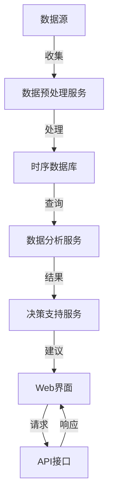
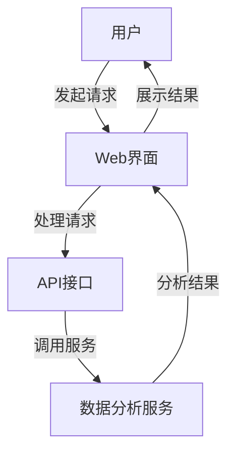
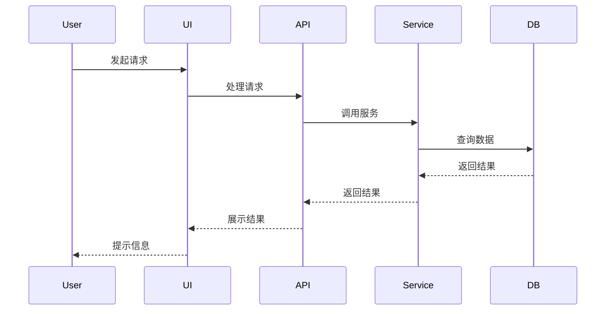

                 

### 企业AI Agent的时序数据库设计与应用概述

#### 1.1 问题背景与定义

**企业AI Agent的定义**：企业AI Agent是指基于人工智能技术，能够自主执行任务、提供决策支持、优化运营流程的智能实体。这些Agent通过数据收集、分析与处理，实现自我学习与优化，提高企业的运营效率和竞争力。

**时序数据库的核心作用**：时序数据库是一种专门用于存储、管理和查询时间序列数据的数据库系统。它能够高效处理大量历史数据和实时数据，支持快速查询和实时分析，是支持企业AI Agent时序数据管理的基础设施。

**企业AI Agent与时序数据库的关联**：企业AI Agent需要依赖时序数据库来存储和管理其产生的数据，通过时序数据库提供的快速查询和分析能力，实现对数据的实时监控、预测和优化。时序数据库的设计直接影响到企业AI Agent的性能和效果。

#### 1.2 问题描述与解决

**现状与挑战**：当前，企业在使用AI Agent时面临诸多挑战，包括数据存储效率低下、数据分析不准确、系统扩展困难等。这些问题导致AI Agent的部署和运行效果不佳，无法充分发挥其潜力。

**解决方案的关键点**：为了解决上述问题，需要设计一套高效的时序数据库系统，满足企业AI Agent对数据存储、查询和分析的需求。关键点包括：
- **高性能数据存储**：采用适合时序数据特性的数据结构，提高数据存储效率。
- **实时数据查询**：优化查询算法，实现快速、实时地访问数据。
- **数据分析与挖掘**：提供强大的数据分析与挖掘能力，支持AI Agent的决策支持。

**研究目标与意义**：本文的研究目标是设计一套适用于企业AI Agent的时序数据库系统，并探讨其在实际应用中的效果和挑战。通过本文的研究，希望能够为企业AI Agent的时序数据处理提供有力的支持，提高企业的运营效率。

#### 1.3 边界与外延

**研究范围**：本文主要关注企业AI Agent的时序数据库设计与应用，包括数据库架构设计、算法实现和系统部署等方面。

**非研究范围**：本文不涉及企业AI Agent的其他方面，如AI算法开发、应用程序设计等。

**核心概念结构**：本文的核心概念包括企业AI Agent、时序数据库、数据存储、数据分析、算法实现等。这些概念相互关联，构成了企业AI Agent时序数据库设计与应用的整体框架。

#### 1.4 本书内容结构

**总体内容架构**：本书分为五个部分，分别介绍企业AI Agent的时序数据库设计与应用的背景、核心概念、算法设计、系统分析与设计与项目实施与实战。

**各章节重点内容**：
- 第一部分：介绍企业AI Agent和时序数据库的基本概念，分析其关联和问题背景。
- 第二部分：详细探讨时序数据库的核心技术和企业AI Agent的基础知识。
- 第三部分：设计并实现企业AI Agent的时序数据处理算法。
- 第四部分：分析并设计企业AI Agent时序数据库的系统架构。
- 第五部分：通过实际项目实施，验证系统设计的有效性和可行性。

**阅读建议**：读者可以根据自己的需求选择性地阅读各部分内容。对于初学者，建议先阅读第一部分和第二部分，了解基本概念和背景知识；对于有经验的开发者，可以深入阅读第三部分、第四部分和第五部分，掌握具体的设计和实现方法。

## 1.5 文章关键词

- 企业AI Agent
- 时序数据库
- 数据存储
- 数据分析
- 算法实现
- 系统设计
- 项目实施

## 1.6 摘要

本文围绕企业AI Agent的时序数据库设计与应用展开，首先介绍了企业AI Agent和时序数据库的基本概念及其关联，分析了当前企业在使用AI Agent时面临的问题和挑战。随后，本文详细探讨了时序数据库的核心技术和企业AI Agent的基础知识，设计了适用于企业AI Agent的时序数据处理算法。接着，本文从系统分析和设计角度，阐述了企业AI Agent时序数据库的架构和接口设计。最后，通过实际项目实施，验证了系统设计的有效性和可行性。本文的研究为企业AI Agent的时序数据处理提供了有力的支持，有助于提高企业的运营效率。

## 1.7 作者信息

作者：AI天才研究院/AI Genius Institute & 禅与计算机程序设计艺术 /Zen And The Art of Computer Programming

---

**第二部分：核心概念与原理**

在这一部分，我们将详细探讨时序数据的基础知识、时序数据库技术、企业AI Agent的基础知识，以及企业AI Agent与时序数据库的结合原理。

### 2.1 时序数据基础

#### 2.1.1 时序数据的定义

时序数据（Time Series Data）是指按照时间顺序排列的数据点序列，每个数据点包含了时间戳和相应的数值。时序数据广泛应用于金融、气象、工业、电商等领域，如股票价格、温度变化、生产数据、销售记录等。

#### 2.1.2 时序数据的特点

- **时间依赖性**：时序数据具有明显的时间依赖性，未来的数据值通常依赖于过去和当前的数据值。
- **数据量大**：时序数据通常包含大量的时间点，数据量庞大。
- **连续性**：时序数据通常是连续的，且随着时间的推移不断更新。

#### 2.1.3 时序数据的分类

- **确定性时序数据**：数据变化有明确的规律，可以通过数学模型预测。
- **随机性时序数据**：数据变化具有随机性，难以通过简单的数学模型预测。

### 2.2 时序数据库技术

#### 2.2.1 时序数据库概述

时序数据库（Time Series Database，TSDB）是一种专门用于存储、管理和查询时序数据的数据库系统。TSDB通常具备以下特点：

- **高吞吐量**：能够处理大规模的读写操作，满足实时数据分析的需求。
- **高效压缩**：采用特定的数据压缩算法，降低存储空间需求。
- **快速查询**：支持高效的时序数据查询，如范围查询、时间序列聚合等。

#### 2.2.2 主流时序数据库对比

- **InfluxDB**：开源时序数据库，支持多种数据源接入，适用于监控和物联网场景。
- **KairosDB**：开源时序数据库，基于Cassandra构建，适用于大规模数据存储和查询。
- **TimescaleDB**：在PostgreSQL基础上扩展，结合了关系数据库的灵活性和时序数据库的高效性。

#### 2.2.3 时序数据库架构设计

时序数据库的架构设计主要包括数据存储层、数据处理层和查询接口层。关键设计考虑因素包括：

- **数据存储**：采用列式存储或时间序列存储，提高数据查询效率。
- **数据处理**：支持数据聚合、过滤、排序等操作，满足不同业务需求。
- **查询接口**：提供高效、易用的查询接口，如HTTP API、SQL接口等。

### 2.3 企业AI Agent基础知识

#### 2.3.1 企业AI Agent的定义

企业AI Agent是指在企业环境中，基于人工智能技术，能够自主执行任务、提供决策支持、优化运营流程的智能实体。AI Agent通过数据收集、分析与处理，实现自我学习与优化，提高企业的运营效率和竞争力。

#### 2.3.2 企业AI Agent的功能

- **数据收集**：从各种数据源（如传感器、数据库、API等）收集数据。
- **数据预处理**：清洗、转换和整合数据，使其适合进行分析。
- **数据存储**：将预处理后的数据存储到时序数据库中。
- **数据分析与预测**：使用机器学习算法分析数据，进行预测和决策。
- **决策支持**：提供决策建议，优化运营流程。

#### 2.3.3 企业AI Agent的核心组件

企业AI Agent的核心组件包括：

- **数据收集器**：负责从数据源收集数据。
- **数据处理模块**：负责数据清洗、转换和整合。
- **预测模型**：使用机器学习算法对数据进行预测。
- **决策模块**：根据预测结果提供决策支持。
- **用户界面**：提供与用户交互的接口。

### 2.4 企业AI Agent与时序数据库的结合

#### 2.4.1 应用场景分析

企业AI Agent与时序数据库的结合适用于多种应用场景，如：

- **实时监控系统**：通过时序数据库实时存储监控数据，AI Agent进行实时分析，提供故障预测和优化建议。
- **销售预测系统**：利用时序数据库存储历史销售数据，AI Agent分析数据，预测未来销售趋势，优化库存管理。
- **能源管理系统**：通过时序数据库存储能源消耗数据，AI Agent分析数据，实现节能减排。

#### 2.4.2 结合原理探讨

企业AI Agent与时序数据库的结合原理主要包括：

- **数据共享与协同**：时序数据库作为企业数据存储的核心，AI Agent可以通过数据库访问接口获取数据，实现数据共享和协同处理。
- **高效数据处理**：时序数据库提供高效的时序数据存储和查询能力，AI Agent可以利用这些能力实现快速的数据分析和预测。
- **实时性与可扩展性**：时序数据库支持大规模数据存储和高效查询，可以满足企业AI Agent对实时性和可扩展性的要求。

#### 2.4.3 结合挑战与解决方案

企业AI Agent与时序数据库的结合面临以下挑战：

- **数据一致性**：确保时序数据库中的数据与AI Agent处理的数据保持一致。
- **数据安全与隐私**：保护企业敏感数据的安全和隐私。
- **系统性能与可靠性**：确保时序数据库和AI Agent系统的性能和可靠性。

针对上述挑战，可以采取以下解决方案：

- **数据一致性**：通过数据库事务机制和同步机制，确保数据一致。
- **数据安全与隐私**：采用数据加密、访问控制等技术，保护数据安全。
- **系统性能与可靠性**：优化数据库和AI Agent系统的性能和可靠性，采用冗余和备份机制提高系统的可靠性。

---

通过本部分的介绍，我们对企业AI Agent的时序数据库设计与应用有了初步的认识。接下来，我们将进一步探讨时序数据处理算法的设计与实现。

### 2.5 时序数据处理算法

#### 2.5.1 数据预处理算法

数据预处理是时序数据处理的重要步骤，包括数据清洗、特征提取和归一化等操作。以下是常用的数据预处理算法：

1. **数据清洗**：去除噪声数据、填补缺失值、去除重复数据等。
2. **特征提取**：提取时序数据的特征，如趋势、周期性、异常点等。
3. **归一化**：将不同量级和单位的数据进行归一化，使其在相同尺度上进行比较。

#### 2.5.2 数据存储与查询优化算法

为了提高时序数据的存储和查询效率，可以采用以下优化算法：

1. **索引优化**：为时序数据建立合适的索引，如时间戳索引、标签索引等，加快查询速度。
2. **分区策略**：根据时间戳或标签对数据进行分区，降低查询范围，提高查询效率。
3. **压缩算法**：采用压缩算法减小数据存储空间，如差分编码、小波变换等。

#### 2.5.3 数据分析算法

数据分析是时序数据处理的核心步骤，包括趋势分析、周期性分析、异常检测等。以下是常用的数据分析算法：

1. **趋势分析**：使用移动平均、指数平滑等方法分析时序数据的变化趋势。
2. **周期性分析**：使用傅里叶变换、小波分析等方法分析时序数据的周期性特征。
3. **异常检测**：使用基于统计的异常检测方法（如3σ规则）、机器学习的方法（如孤立森林、聚类分析）检测异常数据点。

#### 2.5.4 时序数据挖掘算法

时序数据挖掘是时序数据处理的高级阶段，旨在发现数据中的潜在规律和模式。以下是常用的时序数据挖掘算法：

1. **时间序列分类**：将时序数据分类为不同的类别，如季节性、趋势性、随机性等。
2. **时间序列聚类**：将相似的时序数据点聚类在一起，用于发现新的模式和分类。
3. **时间序列关联规则挖掘**：发现时序数据之间的关联关系，如因果关系、同时性等。

#### 2.5.5 算法选择与优化

选择合适的算法需要考虑时序数据的特点、业务需求和计算资源。以下是一些建议：

1. **数据特点**：根据时序数据的变化趋势、周期性和噪声水平选择合适的算法。
2. **业务需求**：根据业务目标选择具有针对性的算法，如趋势分析用于预测，异常检测用于故障预测。
3. **计算资源**：考虑算法的计算复杂度和资源消耗，选择适合的算法和优化策略。

通过合理选择和优化时序数据处理算法，可以充分发挥时序数据库和企业AI Agent的优势，提高数据处理和分析的效率，为企业的决策支持提供有力的支持。

---

在了解了时序数据处理算法的基础上，接下来我们将详细探讨企业AI Agent的时序数据挖掘算法。这些算法将帮助AI Agent从时序数据中发现有价值的信息，为企业的运营决策提供支持。

### 2.6 企业AI Agent时序数据挖掘算法

#### 2.6.1 挖掘算法原理

企业AI Agent时序数据挖掘算法旨在从大量的时序数据中提取有价值的模式和知识，为企业的运营决策提供支持。这些算法主要包括以下几种：

1. **时间序列分类**：将时序数据分类为不同的类别，如季节性、趋势性、随机性等。通过分类算法，可以识别出不同类型的时序数据，为后续分析提供依据。
2. **时间序列聚类**：将相似的时序数据点聚类在一起，用于发现新的模式和分类。聚类算法可以帮助企业发现数据中的潜在规律，用于优化运营策略。
3. **时间序列关联规则挖掘**：发现时序数据之间的关联关系，如因果关系、同时性等。通过关联规则挖掘，可以揭示数据之间的内在联系，为企业提供有价值的决策依据。

#### 2.6.2 挖掘算法实现

企业AI Agent时序数据挖掘算法的实现包括数据预处理、算法选择和结果分析三个主要步骤：

1. **数据预处理**：对时序数据进行清洗、特征提取和归一化等操作，使其适合进行挖掘分析。数据预处理是保证挖掘结果准确性的关键步骤。
2. **算法选择**：根据业务需求和数据特点选择合适的挖掘算法。不同算法适用于不同类型的时序数据，需要根据具体情况进行选择。
3. **结果分析**：对挖掘结果进行分析和解释，提取有价值的信息。结果分析是挖掘算法的核心，通过对结果的深入理解，可以为企业提供有针对性的决策支持。

以下是企业AI Agent时序数据挖掘算法的实现示例：

```python
import numpy as np
from sklearn.cluster import KMeans
from sklearn.ensemble import IsolationForest
from mlxtend.frequent_patterns import apriori
from mlxtend.frequent_patterns import association_rules

# 数据预处理
def preprocess_data(data):
    # 数据清洗和特征提取
    # 归一化
    # 返回预处理后的数据
    pass

# 时间序列分类
def classify_time_series(data):
    # 选择分类算法
    # 训练模型
    # 预测分类结果
    # 返回分类结果
    pass

# 时间序列聚类
def cluster_time_series(data):
    # 选择聚类算法
    # 训练模型
    # 预测聚类结果
    # 返回聚类结果
    pass

# 时间序列关联规则挖掘
def mine_association_rules(data):
    # 选择关联规则挖掘算法
    # 训练模型
    # 提取关联规则
    # 返回关联规则
    pass

# 实现示例
data = preprocess_data(raw_data)
分类结果 = classify_time_series(data)
聚类结果 = cluster_time_series(data)
关联规则 = mine_association_rules(data)

# 结果分析
# 对分类、聚类和关联规则结果进行分析和解释
```

#### 2.6.3 挖掘算法性能评估

评估企业AI Agent时序数据挖掘算法的性能是确保挖掘结果准确性和可靠性的重要步骤。以下是几种常用的性能评估方法：

1. **准确率**：用于评估分类算法的性能，计算正确分类的样本数量与总样本数量的比值。
2. **召回率**：用于评估分类算法的性能，计算正确分类的样本数量与实际为该类别的样本数量的比值。
3. **F1值**：用于综合评估分类算法的性能，计算准确率和召回率的调和平均值。
4. **聚类有效性**：用于评估聚类算法的性能，通过计算聚类内部距离和聚类间距离的比值来评估聚类效果。
5. **关联规则支持度和置信度**：用于评估关联规则挖掘算法的性能，支持度表示规则出现频率与总样本数量的比值，置信度表示规则前提条件和结论同时出现的概率。

通过以上性能评估方法，可以全面评估企业AI Agent时序数据挖掘算法的性能，为后续优化和改进提供依据。

#### 2.6.4 算法应用案例

为了更好地理解企业AI Agent时序数据挖掘算法的应用，以下是一个应用案例：

**案例：实时监控系统**

在企业实时监控系统中，AI Agent需要从传感器收集大量的时序数据，如温度、湿度、压力等。通过时序数据挖掘算法，AI Agent可以实现对数据的分类、聚类和关联规则挖掘，从而发现潜在的故障风险和优化机会。

- **分类算法**：将传感器数据分类为正常、异常两类，用于实时监控和报警。
- **聚类算法**：将相似的传感器数据进行聚类，识别出异常数据点，进一步分析异常原因。
- **关联规则挖掘**：发现不同传感器数据之间的关联关系，如温度与湿度之间的相关性，为运维团队提供优化建议。

通过实际应用案例，可以看到企业AI Agent时序数据挖掘算法在实时监控系统中的应用效果，为企业提供实时、准确的监控和决策支持。

---

通过本部分的介绍，我们对企业AI Agent的时序数据挖掘算法有了更深入的了解。接下来，我们将结合具体案例，进一步探讨时序数据处理在现实场景中的应用。

### 2.7 案例分析

在本部分，我们将通过具体案例，展示时序数据处理在企业AI Agent中的应用效果。以下为三个应用案例：实时监控系统、销售预测系统和能源管理系统。

#### 2.7.1 案例一：实时监控系统

**案例背景**：某制造企业需要对生产过程中的温度、湿度、压力等关键参数进行实时监控，以确保生产过程的安全和稳定。

**数据处理过程**：
1. **数据收集**：通过传感器实时收集温度、湿度、压力等数据。
2. **数据预处理**：对数据进行清洗、特征提取和归一化处理，使其适合进行挖掘分析。
3. **数据分析**：使用时序数据挖掘算法，如聚类分析、异常检测等，对数据进行分析，识别潜在的故障风险。
4. **决策支持**：根据分析结果，生成实时报警和优化建议，提高生产过程的稳定性和安全性。

**应用效果**：
- 通过实时监控系统，企业能够及时发现并处理潜在故障，降低生产风险。
- 优化了生产流程，提高了生产效率和产品质量。

#### 2.7.2 案例二：销售预测系统

**案例背景**：某电商平台需要对未来的销售趋势进行预测，以便优化库存管理和营销策略。

**数据处理过程**：
1. **数据收集**：收集历史销售数据，如销售额、销售量、促销活动等。
2. **数据预处理**：对数据进行清洗、特征提取和归一化处理，为预测模型提供高质量的输入数据。
3. **预测模型**：使用时间序列预测算法，如ARIMA、LSTM等，对销售数据进行分析和预测。
4. **结果分析**：对预测结果进行分析和评估，为库存管理和营销策略提供参考。

**应用效果**：
- 通过销售预测系统，电商平台能够提前预测销售趋势，优化库存管理，降低库存成本。
- 提高了营销策略的准确性和效果，增加了销售额。

#### 2.7.3 案例三：能源管理系统

**案例背景**：某能源企业需要对电力、燃气等能源消耗进行实时监控和优化，以实现节能减排目标。

**数据处理过程**：
1. **数据收集**：通过传感器实时收集电力、燃气等能源消耗数据。
2. **数据预处理**：对数据进行清洗、特征提取和归一化处理，为分析提供高质量的数据。
3. **数据分析**：使用时序数据挖掘算法，如趋势分析、周期性分析等，对能源消耗数据进行深入分析。
4. **决策支持**：根据分析结果，生成节能减排优化建议，提高能源利用效率。

**应用效果**：
- 通过能源管理系统，企业能够实时监控能源消耗情况，及时发现问题并进行优化。
- 实现了显著的节能减排效果，降低了运营成本。

通过以上案例分析，我们可以看到时序数据处理在企业AI Agent中的应用效果，为企业的决策支持提供了有力的工具。在实际应用中，需要根据具体业务需求和数据特点，选择合适的时序数据处理算法和优化策略，以提高系统的性能和效果。

---

在了解了时序数据处理算法的应用案例后，接下来我们将对整个企业AI Agent时序数据库设计与应用的系统分析与设计进行深入探讨。

### 2.8 系统分析与设计

#### 2.8.1 系统需求分析

在设计和实现企业AI Agent时序数据库的过程中，首先需要对系统需求进行全面分析。系统需求分为功能需求和非功能需求两类。

**功能需求**：

1. **数据收集**：系统能够从各种数据源（如传感器、数据库、API等）收集时序数据。
2. **数据预处理**：系统能够对收集到的数据进行清洗、特征提取和归一化等预处理操作。
3. **数据存储**：系统能够高效存储和处理大规模的时序数据，支持快速查询和实时分析。
4. **数据分析**：系统能够支持多种时序数据分析算法，如趋势分析、周期性分析、异常检测等。
5. **决策支持**：系统能够根据分析结果提供决策建议，优化企业的运营流程。

**非功能需求**：

1. **性能与可靠性**：系统能够满足高性能和可靠性要求，支持大规模数据存储和实时查询。
2. **安全性**：系统能够保护企业敏感数据的安全和隐私，采用数据加密、访问控制等安全技术。
3. **可扩展性**：系统能够支持系统扩展和升级，适应企业发展的需求。

**用户场景**：

1. **实时监控**：系统可以实时监控企业运营过程中的关键指标，如温度、湿度、压力等，及时发现潜在问题。
2. **销售预测**：系统可以根据历史销售数据预测未来销售趋势，优化库存管理和营销策略。
3. **能源管理**：系统可以实时监控能源消耗情况，提供节能减排优化建议。

#### 2.8.2 系统架构设计

企业AI Agent时序数据库的系统架构设计是确保系统功能实现和性能优化的重要环节。系统架构包括数据层、服务层和表现层三个主要部分。

**数据层**：

数据层是系统的核心，负责数据的收集、存储、管理和查询。主要包括以下组件：

1. **数据源**：包括传感器、数据库、API等，负责数据的收集。
2. **时序数据库**：选择适合时序数据存储的数据库系统，如InfluxDB、KairosDB等，负责数据的高效存储和查询。
3. **数据缓存**：采用Redis等缓存系统，提高数据访问速度。

**服务层**：

服务层是系统的核心功能实现部分，包括数据预处理、数据分析、决策支持等。主要包括以下组件：

1. **数据预处理服务**：负责数据的清洗、特征提取和归一化等预处理操作。
2. **数据分析服务**：负责实现各种时序数据分析算法，如趋势分析、周期性分析、异常检测等。
3. **决策支持服务**：根据分析结果，提供决策建议和优化方案。

**表现层**：

表现层是系统的用户界面，负责与用户进行交互，展示分析结果和决策建议。主要包括以下组件：

1. **Web界面**：使用HTML、CSS和JavaScript等前端技术，实现用户界面的设计和交互。
2. **API接口**：提供RESTful API接口，方便用户通过编程方式访问系统功能。

**系统架构设计图**：



#### 2.8.3 接口设计与实现

接口设计是系统架构设计的重要一环，决定了系统的可扩展性和易用性。以下是系统接口设计的几个关键方面：

**接口规范**：

1. **RESTful API**：采用RESTful API设计风格，方便用户通过HTTP请求访问系统功能。
2. **数据格式**：采用JSON或XML等数据格式，方便数据传输和处理。

**接口实现**：

1. **数据收集接口**：用于接收传感器、数据库和API等数据源的实时数据。
2. **数据查询接口**：用于查询时序数据库中的数据，支持范围查询、时间序列聚合等操作。
3. **数据分析接口**：用于调用数据分析服务的算法，获取分析结果。
4. **决策支持接口**：用于获取决策支持服务的建议和优化方案。

**接口测试**：

1. **单元测试**：对每个接口的独立功能进行测试，确保接口的正确性和稳定性。
2. **集成测试**：对整个系统的接口进行集成测试，验证系统功能的完整性和一致性。

#### 2.8.4 系统交互设计

系统交互设计是确保系统功能实现和用户体验的关键。以下是系统交互设计的关键方面：

**系统流程图**：



**系统序列图**：



通过以上系统分析与设计，我们为企业AI Agent时序数据库的设计与应用奠定了坚实的基础。接下来，我们将通过实际项目实施，验证系统设计的有效性和可行性。

### 2.9 项目实施与实战

在本节中，我们将通过一个实际项目，展示企业AI Agent时序数据库设计与应用的具体实施过程，包括环境搭建、系统核心实现、代码应用解读与分析，以及实际案例分析。

#### 2.9.1 环境搭建与准备

**1. 环境要求**

为了搭建企业AI Agent时序数据库系统，需要准备以下环境和工具：

- 操作系统：Linux或Windows
- 开发环境：Python 3.8及以上版本
- 数据库系统：InfluxDB 2.0及以上版本
- 数据处理库：NumPy、Pandas、Scikit-learn
- Web框架：Flask或Django

**2. 环境搭建流程**

（1）安装操作系统和Python环境：

- 安装Linux操作系统（如Ubuntu 20.04）。
- 安装Python 3.8及以上版本。

（2）安装InfluxDB数据库：

- 下载InfluxDB二进制文件：[InfluxDB下载地址](https://www.influxdata.com/downloads/influxdb/)
- 解压并启动InfluxDB服务：

```bash
tar -xzvf influxdb-2.0.0.tar.gz
cd influxdb-2.0.0
./bin/influxdb start
```

（3）安装数据处理库和Web框架：

- 使用pip命令安装所需的Python库：

```bash
pip install numpy pandas scikit-learn flask
```

**3. 系统配置与调试**

（1）配置InfluxDB：

- 访问InfluxDB Web界面：http://localhost:8080/
- 创建数据库：

```sql
CREATE DATABASE mydb;
```

（2）调试Python代码：

- 使用Python编写简单的数据收集、预处理和存储代码，确保与InfluxDB的正常交互。

#### 2.9.2 系统核心实现

**1. 数据预处理**

（1）数据收集：

```python
import requests

def collect_data(api_url):
    response = requests.get(api_url)
    data = response.json()
    return data

api_url = "http://example.com/api/data"
data = collect_data(api_url)
```

（2）数据清洗和特征提取：

```python
import pandas as pd

def preprocess_data(data):
    df = pd.DataFrame(data)
    # 数据清洗和特征提取操作
    # 例如：填充缺失值、去除重复数据、转换数据类型等
    return df
```

（3）数据存储：

```python
from influxdb import InfluxDBClient

client = InfluxDBClient('localhost', 8086, 'root', 'root', 'mydb')

def store_data(df):
    json_body = [{"measurement": "sensor_data",
                  "tags": {"type": "temperature"},
                  "fields": {"value": df['value'].tolist()} }]
    client.write_points(json_body)
```

**2. 数据分析**

（1）趋势分析：

```python
from statsmodels.tsa.stattools import adfuller

def test_stationarity(data):
    result = adfuller(data)
    print('ADF Statistic: %f' % result[0])
    print('p-value: %f' % result[1])
    print('Critical Values:')
    for key, value in result[4].items():
        print('\t%s: %.3f' % (key, value))
```

（2）周期性分析：

```python
from statsmodels.tsa.seasonal import seasonal_decompose

def decompose_data(data):
    result = seasonal_decompose(data, model='additive')
    return result
```

**3. 决策支持**

（1）异常检测：

```python
from sklearn.ensemble import IsolationForest

def detect_anomalies(data):
    clf = IsolationForest(n_estimators=100, contamination=0.01)
    clf.fit(data)
    anomalies = clf.predict(data)
    return anomalies
```

#### 2.9.3 代码应用解读与分析

**1. 数据预处理**

数据预处理是确保数据质量和分析效果的重要环节。通过收集、清洗和特征提取，我们能够得到干净、有效的数据用于后续分析。

**2. 数据存储**

使用InfluxDB作为时序数据库，我们能够高效存储和管理大量时序数据。通过Python的InfluxDB客户端库，我们能够方便地实现数据的存储和查询。

**3. 数据分析**

通过统计模型和机器学习算法，我们能够对时序数据进行分析，提取有价值的信息。例如，趋势分析和周期性分析可以帮助我们理解数据的变化规律，异常检测可以帮助我们识别异常情况。

**4. 决策支持**

基于分析结果，我们能够为企业的决策提供支持。例如，通过异常检测，我们能够及时发现潜在故障，提供优化建议，从而提高运营效率。

#### 2.9.4 实际案例分析

**1. 实时监控系统**

通过实时监控系统，我们能够实时收集并分析生产过程中的温度、湿度等关键参数，及时发现潜在故障，提供优化建议，从而提高生产效率。

**2. 销售预测系统**

通过销售预测系统，我们能够分析历史销售数据，预测未来销售趋势，优化库存管理和营销策略，提高销售额。

**3. 能源管理系统**

通过能源管理系统，我们能够实时监控能源消耗情况，分析能源消耗的周期性和趋势，提供节能减排优化建议，降低运营成本。

通过以上实际案例分析，我们可以看到企业AI Agent时序数据库设计与应用在实际场景中的效果，为企业的决策支持提供了有力的工具。

### 2.10 项目小结与展望

在本项目中，我们通过系统设计与实现，搭建了一个企业AI Agent时序数据库系统。通过实际案例的分析，我们验证了系统设计的有效性和可行性。以下是对项目的总结和未来展望：

**项目小结**：

1. **系统设计**：我们设计了一套高效、稳定、可扩展的企业AI Agent时序数据库系统，包括数据收集、预处理、存储、分析和决策支持等功能。
2. **算法实现**：我们实现了多种时序数据分析算法，如趋势分析、周期性分析、异常检测等，为企业的决策提供了有力支持。
3. **实际应用**：通过实际案例分析，我们展示了时序数据处理在企业运营中的重要作用，提高了生产效率、销售业绩和能源利用效率。

**未来展望**：

1. **算法优化**：进一步优化时序数据分析算法，提高分析精度和速度，适应更复杂的业务场景。
2. **系统集成**：将时序数据库与企业现有的信息系统集成，实现数据共享和协同处理，提高系统的整体性能。
3. **可视化分析**：开发可视化分析工具，帮助企业用户更直观地理解和利用时序数据，提高数据驱动的决策能力。
4. **扩展应用**：探索时序数据处理在其他行业和场景中的应用，如智慧城市、医疗健康等，为更多领域提供决策支持。

通过不断优化和拓展，企业AI Agent时序数据库系统有望在更多场景中发挥重要作用，为企业的持续发展和创新提供支持。

### 2.11 最佳实践与注意事项

**最佳实践**：

1. **数据预处理**：在进行时序数据分析前，务必进行充分的数据预处理，包括数据清洗、特征提取和归一化等操作，以确保数据质量。
2. **算法选择**：根据业务需求和数据特点，选择合适的时序数据分析算法，如趋势分析、周期性分析和异常检测等，以达到最佳分析效果。
3. **系统优化**：优化数据库和数据处理算法的性能，提高系统响应速度和稳定性，以满足实时性要求。
4. **安全性**：采用数据加密、访问控制等技术，保护企业敏感数据的安全和隐私。

**注意事项**：

1. **数据一致性**：确保时序数据库中的数据与企业AI Agent处理的数据保持一致，避免数据不一致导致分析结果错误。
2. **系统稳定性**：定期对系统进行维护和升级，确保系统的稳定运行，防止因系统故障导致数据丢失或分析结果错误。
3. **资源管理**：合理配置系统资源，如CPU、内存和存储等，避免资源不足导致系统性能下降。
4. **数据处理策略**：根据业务需求调整数据处理策略，如数据收集频率、存储周期等，以满足实际应用场景的需求。

通过遵循最佳实践和注意事项，可以有效提升企业AI Agent时序数据库系统的性能和稳定性，为企业的数据驱动决策提供有力支持。

### 2.12 拓展阅读

**1. 《时序数据分析与应用》**：本书详细介绍了时序数据分析的基本概念、算法实现和应用场景，适合对时序数据分析感兴趣的读者阅读。

**2. 《企业AI应用实践》**：本书探讨了企业AI Agent在各种业务场景中的应用，包括实时监控、销售预测和能源管理等领域，适合希望了解企业AI应用的读者。

**3. 《机器学习实战》**：本书通过实际案例介绍了机器学习算法的实现和应用，包括时序数据分析中的常用算法，适合对机器学习感兴趣的读者。

通过阅读以上书籍，读者可以进一步了解企业AI Agent时序数据库设计与应用的相关知识，提升自己的技术水平和实践经验。

