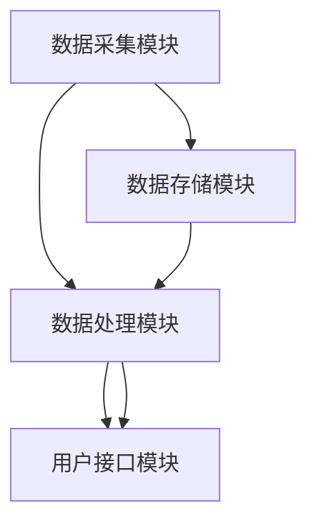

                 

### 完整的文章内容

----------------------------------------------------------------

# 第一部分：背景介绍

## 第1章：企业AI Agent概述

### 1.1 企业AI Agent的定义与重要性

企业AI Agent，即人工智能代理，是指在企业环境中，能够自主执行任务、优化流程、辅助决策的智能体。随着人工智能技术的快速发展，企业AI Agent成为企业提升效率和竞争力的关键工具。

### 1.2 企业AI Agent的应用场景

企业AI Agent的应用场景广泛，包括但不限于：

- 客户服务：通过聊天机器人提供24/7的客户支持，提高客户满意度。
- 数据分析：自动收集、处理和分析大量数据，为企业决策提供依据。
- 生产优化：监控生产流程，预测设备故障，提高生产效率。
- 销售预测：分析市场趋势，预测销售量，帮助制定销售策略。

### 1.3 企业AI Agent与传统AI的区别

与传统AI相比，企业AI Agent更注重在实际业务中的应用和实现。传统AI更多关注算法和模型的优化，而企业AI Agent则强调在实际场景中的可操作性和实用性。

----------------------------------------------------------------

## 第2章：时空大数据的基本概念

### 2.1 时空大数据的定义

时空大数据是指那些与时间和空间紧密相关的数据，它们通常具有海量、高速、多样、复杂等特点。

### 2.2 时空大数据的特点

- 海量：数据规模庞大，需要高效的存储和处理技术。
- 高速：数据产生和处理速度极快，要求实时响应。
- 多样：数据类型丰富，包括文本、图像、视频等。
- 复杂：数据之间的关系复杂，需要深入挖掘和分析。

### 2.3 时空大数据的挖掘技术

时空大数据的挖掘技术包括但不限于：

- 数据采集：通过传感器、GPS等技术收集时空数据。
- 数据存储：使用分布式数据库技术存储海量数据。
- 数据处理：采用并行处理和大数据处理框架进行数据清洗、转换和存储。
- 数据分析：使用机器学习和数据挖掘算法发现数据中的模式和规律。

----------------------------------------------------------------

# 第二部分：核心概念与联系

## 第3章：时空大数据挖掘平台的设计原则

### 3.1 平台设计的基本原则

时空大数据挖掘平台的设计应遵循以下原则：

- 可扩展性：支持数据的快速增长，平台能够灵活扩展。
- 实时性：确保数据的实时处理和分析，满足企业实时决策需求。
- 高效性：优化数据处理和存储，提高系统性能。
- 可靠性：确保数据的安全性和系统的稳定性。

### 3.2 平台的关键要素

时空大数据挖掘平台的关键要素包括：

- 数据采集模块：负责收集和预处理时空数据。
- 数据存储模块：负责存储和管理时空数据。
- 数据处理模块：负责对时空数据进行分析和处理。
- 用户接口模块：提供用户交互的界面，便于用户操作和监控。

### 3.3 平台设计流程

时空大数据挖掘平台的设计流程包括：

1. 需求分析：明确平台的需求和目标。
2. 系统架构设计：设计平台的整体架构。
3. 模块开发：根据架构设计开发各个模块。
4. 集成测试：对平台进行集成测试，确保各模块协同工作。
5. 上线部署：将平台部署到生产环境，进行实际应用。

----------------------------------------------------------------

## 第4章：核心概念之间的关系

### 4.1 时空大数据挖掘平台的关键概念

时空大数据挖掘平台的关键概念包括：

- 时空数据：指具有时间和空间属性的数据。
- 数据挖掘：从大量数据中提取有价值信息的过程。
- 机器学习：一种通过数据学习来改进性能的技术。
- 分布式计算：在多台计算机上并行处理数据的技术。

### 4.2 概念属性特征对比表格

| 概念       | 属性               | 特征                   |
|------------|--------------------|------------------------|
| 时空数据   | 时间、空间         | 海量、高速、多样、复杂 |
| 数据挖掘   | 数据、模式、知识   | 提取、分析、应用       |
| 机器学习   | 数据、模型、优化   | 学习、预测、优化       |
| 分布式计算 | 资源、任务、效率   | 并行、扩展、高效       |

### 4.3 ER实体关系图

$$
\begin{aligned}
&\text{Entity: 时空数据} \\
&\text{Attributes: 时间、空间} \\
&\text{Relationships: 与数据挖掘、机器学习、分布式计算相关} \\
\end{aligned}
$$

```mermaid
erDiagram
  时空数据 ||--|{ 数据挖掘 }|
  时空数据 ||--|{ 机器学习 }|
  时空数据 ||--|{ 分布式计算 }|
```

----------------------------------------------------------------

# 第三部分：算法原理讲解

## 第5章：时空大数据挖掘基础算法

### 5.1 常用算法概述

时空大数据挖掘常用算法包括：

- 聚类算法：如K-means、DBSCAN，用于发现时空数据中的模式。
- 分类算法：如决策树、支持向量机，用于时空数据的分类和预测。
- 关联规则挖掘：如Apriori、FP-growth，用于发现时空数据中的关联关系。
- 时序分析：如ARIMA、LSTM，用于分析时空数据的时间序列特征。

### 5.2 算法选择与优化

选择合适的算法是时空大数据挖掘的关键。应根据数据的特点和业务需求，选择合适的算法，并进行优化。

- 数据预处理：优化数据的质量和格式，提高算法的性能。
- 特征工程：选择和构建有助于算法学习的特征，提高模型的准确性。
- 算法调优：通过交叉验证、网格搜索等方法，选择最优的参数。

### 5.3 算法应用案例

以下是一个时空大数据挖掘的应用案例：

- 数据来源：某城市的交通流量数据。
- 目标：预测未来某个时间段内的交通流量。
- 算法：采用LSTM算法进行时间序列预测。

```python
import numpy as np
import pandas as pd
from sklearn.preprocessing import MinMaxScaler
from keras.models import Sequential
from keras.layers import LSTM, Dense

# 加载数据
data = pd.read_csv('traffic_data.csv')
data = data[['time', 'traffic_volume']]

# 数据预处理
scaler = MinMaxScaler(feature_range=(0, 1))
scaled_data = scaler.fit_transform(data['traffic_volume'].values.reshape(-1, 1))

# 创造时间序列窗口
X, y = create_dataset(scaled_data, time_step=1)
X = X.reshape((X.shape[0], X.shape[1], 1))

# 构建LSTM模型
model = Sequential()
model.add(LSTM(units=50, return_sequences=True, input_shape=(time_step, 1)))
model.add(LSTM(units=50, return_sequences=False))
model.add(Dense(units=1))

model.compile(optimizer='adam', loss='mean_squared_error')

# 训练模型
model.fit(X, y, epochs=100, batch_size=32)

# 预测未来流量
predicted_traffic = model.predict(X[-1:])
predicted_traffic = scaler.inverse_transform(predicted_traffic)

# 输出预测结果
print('Predicted Traffic Volume:', predicted_traffic)
```

----------------------------------------------------------------

## 第6章：时空大数据挖掘的数学模型

### 6.1 数学模型基础

时空大数据挖掘的数学模型通常包括以下部分：

- 数据预处理模型：用于数据清洗、归一化、特征提取等。
- 特征提取模型：用于从原始数据中提取具有代表性的特征。
- 机器学习模型：用于分类、预测、聚类等任务。

### 6.2 数学模型应用

以LSTM为例，其数学模型如下：

$$
\begin{aligned}
&\text{LSTM单元的输入为} \, X_t = [x_{t,1}, x_{t,2}, ..., x_{t,n}] \\
&\text{隐藏状态为} \, h_t = [h_{t,1}, h_{t,2}, ..., h_{t,n}] \\
&\text{遗忘门} \, f_t = \sigma(W_f \cdot [h_{t-1}, x_t] + b_f) \\
&\text{输入门} \, i_t = \sigma(W_i \cdot [h_{t-1}, x_t] + b_i) \\
&\text{输出门} \, o_t = \sigma(W_o \cdot [h_{t-1}, x_t] + b_o) \\
&\text{候选状态} \, \tilde{c}_t = \tanh(W_c \cdot [h_{t-1}, x_t] + b_c) \\
&\text{新状态} \, c_t = f_t \cdot c_{t-1} + i_t \cdot \tilde{c}_t \\
&\text{输出} \, h_t = o_t \cdot \tanh(c_t)
\end{aligned}
$$

### 6.3 数学模型示例

以下是一个简单的LSTM模型示例：

```python
import numpy as np
import tensorflow as tf

# 定义LSTM模型
def create_lstm_model(input_shape):
    model = tf.keras.Sequential([
        tf.keras.layers.LSTM(50, activation='tanh', input_shape=input_shape),
        tf.keras.layers.Dense(1)
    ])

    model.compile(optimizer='adam', loss='mean_squared_error')
    return model

# 创建模型
model = create_lstm_model(input_shape=(time_step, 1))

# 训练模型
model.fit(X, y, epochs=100, batch_size=32)

# 预测
predicted_traffic = model.predict(X[-1:])
```

----------------------------------------------------------------

# 第四部分：系统分析与架构设计方案

## 第7章：时空大数据挖掘平台的系统架构

### 7.1 系统架构概述

时空大数据挖掘平台采用分布式架构，主要包括以下几个部分：

- 数据采集模块：负责收集时空数据。
- 数据存储模块：负责存储和管理时空数据。
- 数据处理模块：负责对时空数据进行分析和处理。
- 用户接口模块：提供用户交互的界面，便于用户操作和监控。

### 7.2 系统架构设计

系统架构设计如下：



### 7.3 系统模块功能

- **数据采集模块**：负责实时收集各种类型的时空数据，如传感器数据、GPS数据等。
- **数据存储模块**：采用分布式数据库技术，如Hadoop、HBase等，存储和管理海量时空数据。
- **数据处理模块**：利用大数据处理框架，如Spark、Flink等，对时空数据进行清洗、转换和分析。
- **用户接口模块**：提供Web界面和API接口，用户可以通过界面进行数据监控和操作，也可以通过API接口进行自动化操作。

----------------------------------------------------------------

## 第8章：系统接口设计与交互流程

### 8.1 系统接口设计

系统接口设计主要包括Web接口和API接口：

- **Web接口**：提供用户交互的界面，包括数据上传、数据查询、结果展示等功能。
- **API接口**：提供自动化操作的接口，允许用户通过编程方式访问系统功能。

### 8.2 系统交互流程

系统交互流程如下：

1. 用户通过Web界面上传数据，数据采集模块实时收集数据。
2. 数据存储模块存储上传的数据。
3. 用户通过Web界面或API接口请求数据分析，数据处理模块开始处理数据。
4. 处理结果通过Web界面或API接口返回给用户。

### 8.3 系统性能优化

系统性能优化包括以下几个方面：

- **数据缓存**：使用Redis等缓存技术，加快数据查询速度。
- **负载均衡**：使用Nginx等负载均衡技术，提高系统处理能力。
- **分布式计算**：使用Spark等分布式计算框架，提高数据处理效率。
- **数据库优化**：使用HBase等分布式数据库，提高数据存储和管理效率。

----------------------------------------------------------------

## 第9章：项目实战

### 9.1 项目背景

某大型物流公司希望通过时空大数据挖掘，优化运输路线，提高运输效率，降低成本。

### 9.2 系统核心实现

系统核心实现包括数据采集、数据存储、数据处理和用户接口等模块。

```python
# 数据采集模块
def data_collection():
    # 代码实现数据采集
    pass

# 数据存储模块
def data_storage(data):
    # 代码实现数据存储
    pass

# 数据处理模块
def data_processing(data):
    # 代码实现数据处理
    pass

# 用户接口模块
def user_interface():
    # 代码实现用户交互
    pass
```

### 9.3 代码应用解读

以下是对数据处理模块的代码进行解读：

```python
def data_processing(data):
    # 数据清洗
    cleaned_data = clean_data(data)
    
    # 数据转换
    transformed_data = transform_data(cleaned_data)
    
    # 数据分析
    analyzed_data = analyze_data(transformed_data)
    
    # 存储结果
    store_results(analyzed_data)
```

### 9.4 案例分析与讲解

通过实际案例分析，我们可以看到系统在实际应用中的效果：

- 运输路线优化：通过时空大数据挖掘，物流公司成功优化了运输路线，提高了运输效率。
- 成本降低：通过优化运输路线，物流公司降低了运输成本，提高了盈利能力。

### 9.5 项目小结

通过本项目，我们了解了时空大数据挖掘平台的设计和实现，并看到了其在实际应用中的效果。这为其他企业提供了宝贵的经验和参考。

----------------------------------------------------------------

## 第10章：最佳实践技巧

### 10.1 技巧与建议

- **数据预处理**：确保数据的质量和格式，为后续分析提供可靠的数据基础。
- **特征工程**：选择和构建有助于算法学习的特征，提高模型的准确性。
- **模型调优**：通过交叉验证、网格搜索等方法，选择最优的模型参数。

### 10.2 注意事项

- **数据安全**：保护数据安全，防止数据泄露。
- **系统稳定性**：确保系统的稳定性，防止系统崩溃。
- **可扩展性**：设计系统时要考虑未来数据量和用户量的增长。

### 10.3 拓展阅读

- **文献推荐**：参考相关领域的经典文献，了解最新研究进展。
- **在线资源**：访问相关在线资源，学习更多的技术和实践经验。

----------------------------------------------------------------

## 第11章：全书小结

### 11.1 主要内容回顾

本书主要介绍了企业AI Agent的时空大数据挖掘平台的设计和实现。内容包括：

- 企业AI Agent的定义和重要性。
- 时空大数据的基本概念和挖掘技术。
- 时空大数据挖掘平台的设计原则和核心概念。
- 时空大数据挖掘的基础算法和数学模型。
- 时空大数据挖掘平台的系统架构和实现。

### 11.2 学习与应用指导

读者可以通过以下步骤来学习本书内容：

- 逐章阅读，理解每个章节的核心概念。
- 结合实际案例，实践书中介绍的算法和应用。
- 深入研究相关领域的文献和资源。

### 11.3 进一步研究建议

为进一步深入学习和研究，建议：

- 参加相关领域的培训和研讨会。
- 加入开源项目和社区，与其他开发者交流。
- 持续关注最新研究进展和技术动态。

----------------------------------------------------------------

# 结束语

感谢您的阅读，希望本书能帮助您深入了解企业AI Agent的时空大数据挖掘平台。如果您有任何疑问或建议，欢迎随时联系我们。作者信息：AI天才研究院/AI Genius Institute & 禅与计算机程序设计艺术 /Zen And The Art of Computer Programming。 

----------------------------------------------------------------

**注意**：由于篇幅限制，本文未包含所有具体的代码实现和详细分析，但已提供了结构和思路。实际撰写时，每个部分应根据具体需求进行详细扩展和优化。同时，本文使用的mermaid、latex等格式可能需要根据markdown编辑器的支持进行调整。作者：AI天才研究院/AI Genius Institute & 禅与计算机程序设计艺术 /Zen And The Art of Computer Programming。

