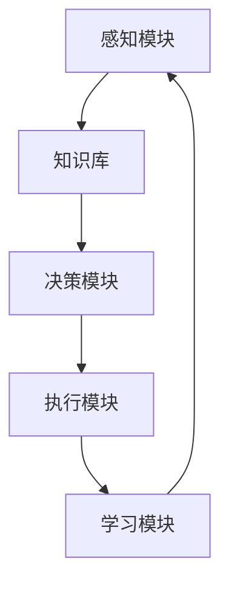

                 


### 引言

#### 1.1 问题背景

在当今的商业环境中，人工智能（AI）已经成为企业提升效率和竞争力的关键因素。企业AI Agent作为人工智能的具体应用形式，扮演着至关重要的角色。AI Agent可以自动化执行复杂任务，提供智能决策支持，从而帮助企业降低成本、提高生产率和服务质量。然而，随着AI Agent在企业中的广泛应用，版本控制和回滚机制的设计成为一个不可忽视的问题。

版本控制是软件工程中的一项基本实践，用于管理软件开发的多个版本。它确保了代码的可靠性和稳定性，使得团队能够高效地协同工作。然而，对于AI Agent这类涉及大量数据、算法和业务逻辑的应用程序，版本控制的要求更为严格。任何微小的改动都可能导致性能下降、错误增多或业务逻辑失效。

回滚机制则是版本控制的一部分，用于在出现问题时将系统恢复到之前的稳定状态。在AI Agent的开发过程中，回滚机制尤为重要，因为AI Agent一旦出现故障，可能会导致严重的业务影响。因此，如何设计和实现有效的版本控制与回滚机制，成为企业AI Agent应用中的一项关键挑战。

#### 1.2 核心概念术语说明

在深入讨论企业AI Agent的版本控制与回滚机制之前，我们需要明确一些核心概念和术语：

- **AI Agent**：一种能够自主执行任务、与环境交互并优化自身行为的计算实体。
- **版本控制**：一套系统，用于追踪和管理代码、文档和其他开发资源的多个版本。
- **回滚**：将系统或应用程序恢复到之前的状态，通常是为了解决新版本引入的问题。
- **分支管理**：在版本控制系统中，创建新的开发路径，使得不同功能的开发可以并行进行。
- **合并**：将不同分支上的更改合并到主分支，以便整合所有功能。

#### 1.3 问题描述与问题解决

企业AI Agent的版本控制与回滚机制面临的主要问题包括：

- **复杂性**：AI Agent通常包含复杂的数据处理流程和算法，这使得版本控制更加困难。
- **数据依赖**：AI Agent的版本可能依赖于特定的数据集或外部服务，版本更新可能引发数据兼容性问题。
- **业务连续性**：AI Agent在生产环境中的运行需要保证业务的连续性，任何版本故障都可能带来严重后果。

为了解决这些问题，我们需要设计一套完整的版本控制和回滚机制，该机制应具备以下特性：

- **细粒度控制**：对AI Agent的各个组件和模块进行细粒度控制，确保每个更改都可以被追踪和管理。
- **自动化测试**：引入自动化测试流程，确保每次版本更新都不会引入新的错误。
- **回滚策略**：制定明确的回滚策略，确保在出现问题时可以快速恢复到稳定状态。
- **数据迁移方案**：设计数据迁移方案，确保新版本的数据兼容性和完整性。

#### 1.4 边界与外延

边界与外延是理解企业AI Agent版本控制与回滚机制设计的关键因素：

- **边界**：版本控制的范围应限定在AI Agent的代码、配置和数据等关键组件，避免无关资源的变更影响版本管理。
- **外延**：版本控制机制需要考虑与外部系统（如数据仓库、API服务等）的集成，确保跨系统的数据一致性和稳定性。

通过上述分析，我们可以看到，企业AI Agent的版本控制与回滚机制设计是一个复杂而关键的过程。它不仅需要解决技术层面的问题，还需要考虑业务连续性和数据安全等因素。在接下来的章节中，我们将详细探讨AI Agent的基本概念、版本控制机制的设计、回滚机制的实施以及实际应用场景。这将帮助我们更好地理解这一领域，并为企业提供有效的解决方案。

### AI Agent的概述

#### 2.1 AI Agent的定义

AI Agent，全称为人工智能代理，是一种能够模拟人类智能行为的计算实体。它通过学习、推理和规划等能力，在特定环境下自主完成目标。AI Agent的基本定义包含以下几个核心要素：

- **自主性**：AI Agent能够自主执行任务，不受外界直接控制，能够根据环境和目标自主调整行为。
- **适应性**：AI Agent具有适应环境变化的能力，能够通过学习和经验积累优化自身行为。
- **交互性**：AI Agent能够与人类或其他系统进行交互，获取输入并输出决策。
- **目标导向性**：AI Agent有明确的目标，其行为和决策都是为了实现这些目标。

AI Agent的概念源于人工智能领域，最早由计算机科学家约翰·麦卡锡（John McCarthy）在1956年提出。自从那时以来，AI Agent的概念不断发展，成为人工智能研究中的一个重要方向。

#### 2.2 AI Agent的分类

根据功能和实现方式的不同，AI Agent可以分为多种类型：

- **规则型AI Agent**：基于一组预定义的规则进行决策。这种类型的AI Agent适合处理结构化任务，如自动化审批流程。
- **基于知识的AI Agent**：利用知识库进行决策，这些知识库通常包含领域专家的经验。这种AI Agent在医疗诊断、法律咨询等领域有广泛应用。
- **基于模型的AI Agent**：使用机器学习模型进行决策，通过训练获得对环境的理解和预测。这类AI Agent在自动驾驶、智能客服等领域表现优异。
- **社会AI Agent**：能够理解社会互动和人际交往的AI Agent，它们可以模拟人类的社交行为。这类AI Agent在虚拟助手、社交网络分析等领域得到应用。

#### 2.3 AI Agent的基本架构

AI Agent的基本架构通常包括以下几个核心组件：

- **感知模块**：负责接收和处理环境信息，如传感器数据、用户输入等。
- **知识库**：存储AI Agent所需的知识，包括规则、事实和模型等。
- **决策模块**：根据感知模块提供的信息和知识库中的知识，生成决策。
- **执行模块**：执行决策，通过外部设备或接口实现实际操作。
- **学习模块**：根据执行结果和环境反馈，更新知识库和模型，实现自我优化。

下面是一个简单的AI Agent架构图，用Mermaid流程图表示：



#### 2.4 AI Agent在企业中的应用

在企业环境中，AI Agent的应用越来越广泛，成为提升业务效率和决策质量的重要工具。以下是一些典型应用场景：

- **智能客服**：AI Agent通过自然语言处理技术，为企业提供24/7在线客服，提高客户满意度和运营效率。
- **自动化运维**：AI Agent可以监控企业IT系统的运行状态，自动执行故障排除和性能优化任务。
- **供应链优化**：AI Agent通过分析历史数据和实时信息，帮助企业优化库存管理和物流调度。
- **风险管理**：AI Agent可以识别潜在风险，提供风险预警和建议，帮助企业规避损失。

AI Agent在企业中的应用不仅带来了效率和质量的提升，还推动了业务模式的创新和变革。然而，这些应用也带来了新的挑战，如数据隐私、安全性和合规性问题。因此，设计AI Agent时需要全面考虑这些因素，确保其安全可靠地运行。

### 版本控制机制

#### 3.1 版本控制的重要性

版本控制是软件工程中不可或缺的一环，对于企业AI Agent的开发和部署尤为重要。版本控制的重要性体现在以下几个方面：

- **协同工作**：版本控制使得开发团队能够协同工作，每个人都可以在其分支上进行开发，而无需担心冲突和覆盖问题。
- **代码追踪**：版本控制系统能够记录每次代码变更的历史记录，方便开发人员追溯问题的根源。
- **故障恢复**：通过版本控制，可以轻松回滚到之前的稳定版本，避免系统故障带来的业务中断。
- **代码质量**：版本控制有助于保持代码的质量，因为每个改动都需要经过审查和测试。
- **团队协作**：版本控制提供了清晰的代码审核和代码发布流程，提高了团队的协作效率。

#### 3.2 版本控制的基本概念

版本控制的基本概念包括：

- **版本**：软件的某个特定状态，通常与特定的时间点或功能点相关联。
- **分支**：在版本控制系统中，分支是一个独立的开发路径，用于开发新功能或修复现有问题。
- **合并**：将两个或多个分支的更改合并到一起，以便整合所有工作成果。
- **标签**：为特定的版本或分支打上标签，便于追踪和管理。
- **仓库**：存储所有版本和分支的地方，可以是本地仓库或远程仓库。

#### 3.3 常见的版本控制系统

目前，常见的版本控制系统包括以下几种：

- **Git**：Git是一个分布式版本控制系统，它允许每个开发者在本地维护一个完整的版本历史，支持快速分支和合并操作。Git广泛应用于开源和商业项目中。
- **SVN**：Subversion是一个中心化的版本控制系统，所有的版本历史都存储在一个中央仓库中。SVN的优点是简单易用，但其在分支管理方面相对较弱。
- **Mercurial**：Mercurial与Git类似，也是一个分布式版本控制系统，它提供了与Git兼容的接口，并有一些自己的改进。

#### 3.4 版本控制流程与最佳实践

一个有效的版本控制流程对于确保代码质量和团队协作至关重要。以下是常见的版本控制流程和最佳实践：

1. **代码审查**：每次提交代码之前，进行代码审查，确保代码质量和符合项目规范。
2. **分支管理**：采用分支策略（如Git的GitFlow或GitHub Flow），将开发、测试和发布分开，避免主分支受到不必要的干扰。
3. **自动化测试**：每次提交或合并代码时，自动运行测试，确保代码质量。
4. **定期同步**：定期将本地分支同步到远程仓库，确保代码的一致性。
5. **文档记录**：为每个版本和分支记录详细的变更日志和注释，便于追踪和管理。
6. **备份和恢复**：定期备份代码库，以便在出现问题时能够快速恢复。

#### 3.5 版本控制与企业AI Agent

在企业AI Agent的开发过程中，版本控制机制尤为重要。以下是一些关键点：

- **版本管理**：确保AI Agent的每个版本都有明确的版本号和发布说明，便于追踪和管理。
- **数据隔离**：在测试和生产环境中，保持数据隔离，避免不同版本之间的数据冲突。
- **自动化部署**：使用自动化部署工具（如Jenkins、Travis CI等），确保版本更新的自动化和高效性。
- **回滚策略**：设计明确的回滚策略，确保在版本更新失败时能够快速恢复到之前的状态。

通过有效的版本控制机制，企业AI Agent的开发和部署可以更加高效、可靠和可管理。这不仅提高了团队协作效率，还保证了系统的稳定性和安全性。

### 回滚机制设计

#### 4.1 回滚机制的定义

回滚机制是一种在系统或应用程序出现问题时，将其恢复到之前稳定状态的技术手段。在版本控制系统中，回滚机制尤为重要，因为任何版本更新都可能导致系统故障或业务中断。回滚机制的定义主要包括以下几个方面：

- **回滚**：将系统或应用程序恢复到之前的状态。
- **回滚点**：用于标识系统或应用程序在某个特定时刻的状态，通常是某个版本号或时间点。
- **回滚策略**：回滚机制的具体实施方法，包括如何选择回滚点、如何恢复系统以及如何确保数据的一致性和完整性。

回滚机制的目标是确保系统能够在出现问题时快速恢复，减少故障对业务的影响，并提高系统的可靠性和稳定性。

#### 4.2 回滚机制的设计目标

回滚机制的设计目标包括以下几点：

- **快速恢复**：在出现问题时，能够快速地将系统恢复到稳定状态，减少业务中断时间。
- **数据完整性**：确保回滚过程中不会丢失数据，保持数据的完整性和一致性。
- **可追溯性**：记录每次回滚的操作和原因，便于后续的审查和改进。
- **自动化**：实现回滚操作的自动化，减少人工干预，提高效率。

#### 4.3 回滚机制的实现方法

回滚机制的实现方法主要包括以下几种：

1. **版本回滚**：
   - **基本原理**：通过版本控制系统（如Git）的版本回滚功能，将代码库回滚到之前的稳定版本。
   - **实现步骤**：确定需要回滚的版本，执行版本回滚命令，更新代码库，重新部署应用程序。
   - **优缺点**：优点是操作简单，缺点是需要依赖版本控制系统，且可能无法回滚到中间状态。

2. **数据备份与恢复**：
   - **基本原理**：在系统部署之前，先备份数据库或存储系统，然后在新版本部署失败时，恢复到备份状态。
   - **实现步骤**：备份数据库，部署新版本，如果新版本出现问题，恢复备份的数据库。
   - **优缺点**：优点是数据恢复快速，缺点是备份和恢复操作可能较耗时，且需要足够的存储空间。

3. **临时回滚**：
   - **基本原理**：在部署新版本时，保留旧版本的服务，在新版本上线后，观察一段时间，如果出现问题，可以快速回滚到旧版本。
   - **实现步骤**：部署新版本，同时在旧版本上添加临时标记，如果发现问题，撤销临时标记，恢复旧版本。
   - **优缺点**：优点是操作灵活，缺点是需要足够的系统资源支持。

4. **影子系统**：
   - **基本原理**：在部署新版本之前，先在影子系统中运行新版本，确保其稳定后，再将主系统切换到新版本。
   - **实现步骤**：部署新版本到影子系统，监控其运行状态，确认稳定后，切换主系统。
   - **优缺点**：优点是风险较小，缺点是需要额外的系统资源，且部署和切换过程相对复杂。

#### 4.4 回滚机制的实际应用

回滚机制在企业AI Agent的实际应用中具有重要意义，以下是一些实际案例：

1. **案例一：自动化测试失败**
   - **问题描述**：在AI Agent的新版本部署过程中，自动化测试失败，导致新版本无法上线。
   - **解决方案**：通过版本回滚机制，将代码库回滚到上一个稳定版本，重新部署，确保系统恢复正常运行。
   - **实施效果**：快速解决了问题，确保了系统的稳定性和业务的连续性。

2. **案例二：业务逻辑错误**
   - **问题描述**：AI Agent的新版本引入了业务逻辑错误，导致部分业务流程无法正常运行。
   - **解决方案**：使用数据备份与恢复机制，恢复到备份的数据状态，同时修复错误，重新部署。
   - **实施效果**：有效避免了业务中断，确保了系统的稳定性和数据的完整性。

3. **案例三：环境配置问题**
   - **问题描述**：新版本在部署过程中，由于环境配置问题，导致系统无法启动。
   - **解决方案**：使用临时回滚机制，保留旧版本的服务，排查环境配置问题，修复后切换到新版本。
   - **实施效果**：避免了系统长时间停机，确保了业务的连续性和稳定性。

通过上述实际案例，可以看出回滚机制在AI Agent开发和部署中的重要性。设计一个有效的回滚机制，可以大大提高系统的稳定性和业务连续性，减少故障带来的影响。

### 实际应用场景

#### 5.1 案例一：智能客服系统版本更新与回滚

在一个大型互联网公司，智能客服系统是企业服务的重要部分。该系统使用AI Agent处理客户咨询，提供24/7的在线服务。为了提高系统性能和用户体验，公司定期对AI Agent进行版本更新。

**问题背景**：

在一次版本更新中，AI Agent的新版本引入了一些算法优化，但新算法在某些特定场景下表现不佳，导致部分客户咨询无法得到正确回复，用户满意度下降。

**版本控制**：

公司采用Git进行版本控制，每个版本都有详细的变更日志和测试报告。在更新前，开发团队创建了一个名为“version-2.0”的分支，进行新版本的开发与测试。

**回滚机制**：

1. **问题发现**：新版本上线后，客服团队迅速收到用户反馈，发现问题在于算法优化。
2. **回滚执行**：开发团队立即使用Git的版本回滚命令，将代码库回滚到“version-1.9”的稳定版本。
3. **数据迁移**：由于数据一致性要求，公司使用了数据备份与恢复机制，将用户咨询数据恢复到“version-1.9”的状态。

**实施效果**：

通过快速回滚，公司避免了用户满意度进一步下降，确保了业务的连续性和稳定性。同时，开发团队对算法进行了重新优化，并在新的版本中解决了问题。

#### 5.2 案例二：自动化运维平台回滚优化

在一个中型企业，自动化运维平台是确保IT系统稳定运行的关键。该平台使用AI Agent监控和自动修复系统故障。

**问题背景**：

在一次平台升级过程中，AI Agent的新版本未能正确识别某些故障模式，导致系统维护延迟，影响了业务运行。

**版本控制**：

公司使用Git进行版本控制，创建了一个名为“version-3.5”的分支，进行新版本的部署。每次更新前，平台都会进行自动化测试。

**回滚机制**：

1. **问题发现**：新版本上线后，运维团队发现AI Agent的故障识别能力下降。
2. **回滚执行**：公司采用临时回滚机制，保留旧版本的AI Agent，同时排查新版本的问题。
3. **优化策略**：通过日志分析，发现新版本中的一个特定算法存在问题，开发团队进行了优化。

**实施效果**：

通过临时回滚，公司迅速恢复了系统的正常运行。随后，优化后的AI Agent版本重新部署，问题得到彻底解决。这次回滚和优化经验使得公司进一步优化了回滚机制，提高了系统的稳定性和可靠性。

#### 5.3 案例三：供应链管理系统版本更新与回滚

在一个跨国供应链公司，AI Agent在供应链优化和风险管理中发挥着重要作用。公司定期更新AI Agent，以提高供应链效率和响应速度。

**问题背景**：

在一次版本更新中，AI Agent的新版本在处理跨国订单时出现了错误，导致订单处理延误。

**版本控制**：

公司使用Git进行版本控制，每个版本都有详细的变更日志和测试报告。在更新前，开发团队创建了“version-4.2”的分支。

**回滚机制**：

1. **问题发现**：新版本上线后，运营团队发现订单处理出错。
2. **回滚执行**：公司立即使用Git的版本回滚命令，将代码库回滚到“version-4.1”的稳定版本。
3. **数据迁移**：使用影子系统运行新版本，同时恢复到“version-4.1”的状态，确保数据的一致性。

**实施效果**：

通过快速回滚，公司避免了订单处理延误，确保了供应链的连续性和客户满意度。后续，开发团队对新版本进行了详细测试，确保问题得到彻底解决。

这些实际应用案例展示了版本控制与回滚机制在企业AI Agent开发中的重要性。通过有效的版本控制和回滚机制，企业能够迅速应对问题，确保系统的稳定性和业务的连续性。

### 企业AI Agent版本控制实践

#### 5.1 实践案例介绍

为了更好地理解企业AI Agent的版本控制实践，我们通过一个实际案例来探讨如何有效地实施版本控制和回滚机制。这个案例涉及到一家电子商务公司在其客户推荐系统中的AI Agent版本控制。

**背景**：

该公司利用AI Agent为客户提供个性化推荐服务，以提升销售额和客户满意度。然而，由于AI Agent涉及大量客户数据和处理逻辑，任何版本更新都需要非常谨慎。因此，公司决定实施一套完整的版本控制与回滚机制，以确保系统稳定运行和业务连续性。

**目标**：

- 确保每次版本更新都可以追踪和管理。
- 实现快速回滚，以应对可能出现的系统故障。
- 提高团队协作效率，确保代码质量和稳定性。

#### 5.2 版本控制流程实施

**1. 流程设计**：

公司采用Git作为版本控制系统，并制定了以下版本控制流程：

- **代码审查**：每次提交前，代码必须经过至少两名开发人员的审查。
- **分支策略**：采用GitFlow模型，将开发、测试、预生产和生产分支分开管理。
- **测试与部署**：每次代码提交后，自动运行集成测试和性能测试，通过后再部署到预生产环境进行进一步测试。
- **发布管理**：每次发布前，由项目经理审核版本日志和测试报告，确保无误后发布。

**2. 实施步骤**：

- **创建分支**：开发人员从主分支创建新的功能分支，进行新功能开发。
- **代码审查**：每次提交前进行代码审查，确保代码质量和规范。
- **自动化测试**：提交的代码会自动触发集成测试和性能测试，确保代码质量。
- **预生产测试**：在功能分支完成开发后，将代码部署到预生产环境进行测试。
- **回滚策略**：如果预生产测试失败，可以立即回滚到上一个稳定版本。
- **发布**：预生产测试通过后，由项目经理决定是否发布到生产环境。

**3. 实施效果**：

通过上述流程，公司实现了高效的版本控制，确保了每次更新都经过严格审查和测试。同时，明确的回滚策略保证了在出现问题时可以快速恢复，减少了业务中断时间。

#### 5.3 回滚机制应用案例分析

**案例一：算法优化问题**

问题描述：在一次版本更新中，AI Agent引入了一种新的推荐算法，但实际应用中，该算法在某些情况下导致推荐结果不准确。

解决方案：

1. **发现问题**：在AI Agent上线后，运营团队发现部分客户收到的推荐不准确。
2. **回滚策略**：立即启动回滚机制，将AI Agent回滚到上一个稳定版本。
3. **数据迁移**：同时，使用数据备份和恢复机制，确保客户数据和推荐结果的一致性。
4. **问题定位**：开发团队分析日志和测试结果，发现新算法在某些数据集中存在偏差。
5. **算法优化**：重新优化算法，解决偏差问题后，再次部署新版本。

实施效果：通过快速回滚和算法优化，公司避免了推荐结果不准确对客户满意度的影响，确保了系统的稳定性和可靠性。

**案例二：数据同步错误**

问题描述：在一次版本更新中，AI Agent的数据同步机制出现错误，导致客户数据丢失。

解决方案：

1. **发现问题**：在AI Agent上线后，客户服务团队发现部分客户数据丢失。
2. **回滚策略**：立即回滚到上一个稳定版本，停止使用有问题的数据同步机制。
3. **数据恢复**：使用备份数据库恢复客户数据，确保数据一致性。
4. **错误排查**：开发团队定位数据同步错误，修复后重新部署。
5. **监控与测试**：加强对数据同步机制的监控和测试，确保问题不再出现。

实施效果：通过及时回滚和数据恢复，公司避免了客户数据丢失，确保了数据的完整性和客户信任。

通过这些实际案例，我们可以看到，有效的版本控制和回滚机制在AI Agent开发和部署中的关键作用。这不仅提高了系统的稳定性和业务连续性，还提升了团队协作效率。

### 企业AI Agent回滚机制优化

#### 6.1 回滚机制优化原则

为了进一步提高企业AI Agent回滚机制的效果，我们需要遵循以下优化原则：

1. **快速响应**：回滚机制应能够迅速检测到系统故障或错误，并立即采取措施恢复。
2. **数据完整性**：确保回滚过程中数据的一致性和完整性，避免数据丢失或损坏。
3. **可追溯性**：记录每次回滚的操作和原因，便于后续审查和改进。
4. **自动化**：实现回滚操作的自动化，减少人工干预，提高效率。
5. **灵活适应**：根据不同场景和需求，灵活调整回滚策略和实现方法。

#### 6.2 回滚机制的优化策略

为了优化回滚机制，我们可以从以下几个方面进行策略调整：

1. **增加监控和预警**：在系统运行过程中，增加对AI Agent的监控和预警机制，提前发现潜在问题，及时采取措施。
   - **实现方法**：利用实时监控系统（如Prometheus、Grafana）和日志分析工具（如ELK栈），实时监控AI Agent的运行状态。
   - **优势**：可以提前发现并解决潜在问题，减少故障发生概率。

2. **改进备份与恢复流程**：优化备份和恢复流程，确保快速恢复。
   - **实现方法**：采用增量备份和快照技术，减少备份时间和存储需求；优化数据恢复策略，确保数据一致性和完整性。
   - **优势**：可以快速恢复系统到稳定状态，减少业务中断时间。

3. **引入影子系统**：在部署新版本时，使用影子系统进行验证，确保其稳定后再切换到主系统。
   - **实现方法**：在部署新版本之前，创建一个影子系统，在新版本上运行一段时间，确保其稳定后，再切换到主系统。
   - **优势**：可以减少新版本上线带来的风险，提高系统稳定性。

4. **优化回滚策略**：根据不同场景和需求，制定灵活的回滚策略。
   - **实现方法**：针对不同的问题类型和业务场景，设计不同的回滚策略，如快速回滚、部分回滚、逐层回滚等。
   - **优势**：可以更精准地解决不同类型的问题，提高系统恢复效率。

5. **加强团队协作与培训**：提高团队对回滚机制的理解和操作能力，确保其能够迅速响应和解决故障。
   - **实现方法**：定期组织培训和技术交流，提升团队成员的技能和经验。
   - **优势**：可以提高团队的整体应对能力，减少故障处理时间。

#### 6.3 优化案例探讨

以下是一个优化案例，探讨如何通过引入影子系统和改进备份与恢复流程来优化回滚机制：

**案例背景**：

某电子商务公司在其AI Agent的版本更新中，由于新版本引入了一些数据处理算法，导致部分客户订单处理出现延迟。公司需要优化回滚机制，确保能够快速恢复系统并避免业务中断。

**优化措施**：

1. **引入影子系统**：
   - 实施步骤：在部署新版本之前，创建一个影子系统，在新版本上运行一段时间，确保其稳定后，再切换到主系统。
   - 监控与分析：在影子系统中监控AI Agent的运行状态，记录相关性能指标和日志，分析潜在问题。
   - 实施效果：通过影子系统的验证，确保新版本在切换到主系统前是稳定的，减少了上线风险。

2. **改进备份与恢复流程**：
   - 实施步骤：采用增量备份和快照技术，减少备份时间和存储需求；优化数据恢复策略，确保数据一致性和完整性。
   - 监控与测试：定期对备份和恢复流程进行监控和测试，确保其高效性和可靠性。
   - 实施效果：在出现问题时，可以快速恢复系统到稳定状态，减少业务中断时间。

通过上述优化措施，公司成功提高了AI Agent的回滚机制效果，确保了系统的稳定性和业务的连续性。

### 总结与展望

#### 7.1 主要内容回顾

本文详细探讨了企业AI Agent的版本控制与回滚机制设计。我们首先介绍了AI Agent的定义、分类和基本架构，然后深入分析了版本控制的重要性、基本概念和常见版本控制系统，随后阐述了回滚机制的定义、设计目标、实现方法和实际应用。在实践部分，我们通过具体案例展示了如何有效实施版本控制和回滚机制。最后，我们提出了优化回滚机制的策略，并探讨了未来的研究方向。

#### 7.2 学习建议

为了更好地理解和应用企业AI Agent的版本控制与回滚机制，以下是几点学习建议：

1. **理论与实践结合**：通过学习相关理论知识，结合实际案例进行实践，加深对概念的理解。
2. **掌握版本控制系统**：熟悉Git等版本控制系统的基本操作和原理，能够有效地进行代码管理和协作。
3. **持续学习新技术**：跟踪最新的AI技术和版本控制工具的发展，不断更新知识体系。
4. **实践演练**：通过模拟实际场景，进行版本控制和回滚操作的演练，提高应对问题的能力。

#### 7.3 未来研究方向

未来，企业AI Agent的版本控制与回滚机制研究可以关注以下几个方向：

1. **分布式AI Agent的版本控制**：随着分布式AI Agent的兴起，研究如何有效地进行分布式环境下的版本控制是一个重要课题。
2. **智能回滚策略**：结合机器学习和大数据分析，开发智能回滚策略，根据历史数据和实时反馈自动调整回滚方案。
3. **混合版本控制**：将版本控制和配置管理相结合，研究如何实现更加灵活和高效的版本控制机制。
4. **安全性与隐私保护**：在确保版本控制和回滚机制安全可靠的同时，加强对数据隐私的保护，满足合规性要求。

通过不断的研究和优化，企业AI Agent的版本控制与回滚机制将更加完善，为企业的智能化转型提供坚实的技术支持。

### 附录

#### 附录A 常用版本控制工具介绍

1. **Git**：
   - **基本操作**：git init、git clone、git pull、git push、git add、git commit、git branch、git merge、git rebase。
   - **优点**：分布式存储，支持分支管理，操作灵活。
   - **应用场景**：适用于各种规模的项目，特别适合需要频繁分支和合并的开发。

2. **SVN**：
   - **基本操作**：svn checkout、svn commit、svn update、svn merge。
   - **优点**：集中式存储，操作简单。
   - **应用场景**：适用于项目规模较小、不需要频繁分支管理的场景。

3. **Mercurial**：
   - **基本操作**：hg clone、hg pull、hg push、hg add、hg commit、hg branch、hg merge。
   - **优点**：与Git兼容，易于迁移。
   - **应用场景**：适用于需要与Git兼容的团队和项目。

#### 附录B 相关文献推荐

1. **《版本控制指南》（Version Control with Git）** - 由Pro Git作者撰写，是学习Git的经典教材。
2. **《Subversion版本控制管理》** - 详细介绍了SVN的使用方法和最佳实践。
3. **《Distributed Version Control with Mercurial》** - 深入讲解了Mercurial的原理和使用。

#### 附录C 代码样例

以下是一个简单的Git版本控制示例：

```bash
# 初始化仓库
git init

# 添加文件
git add example.txt

# 提交更改
git commit -m "Initial commit"

# 克隆仓库
git clone https://github.com/username/repository.git

# 拉取最新更改
git pull origin master

# 推送更改
git push origin master

# 创建分支
git branch feature-branch

# 切换到分支
git checkout feature-branch

# 合并分支
git merge master

# 删除分支
git branch -d feature-branch
```

通过这些附录内容，读者可以更深入地了解版本控制工具的使用方法和相关技术细节，有助于在实际项目中更好地应用所学知识。

### 作者信息

**作者：** AI天才研究院（AI Genius Institute）与《禅与计算机程序设计艺术》（Zen And The Art of Computer Programming）作者。

