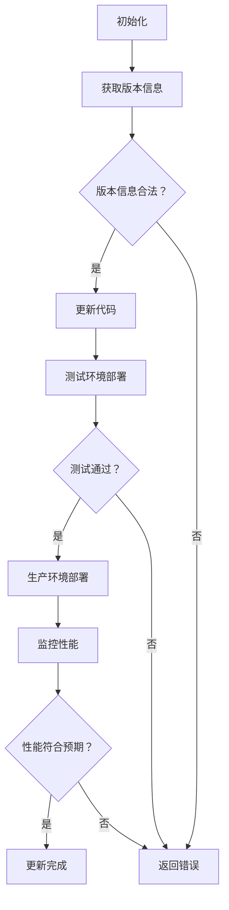
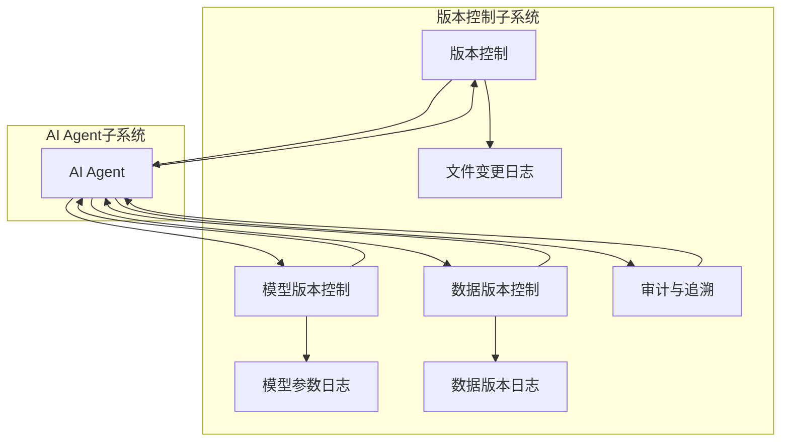
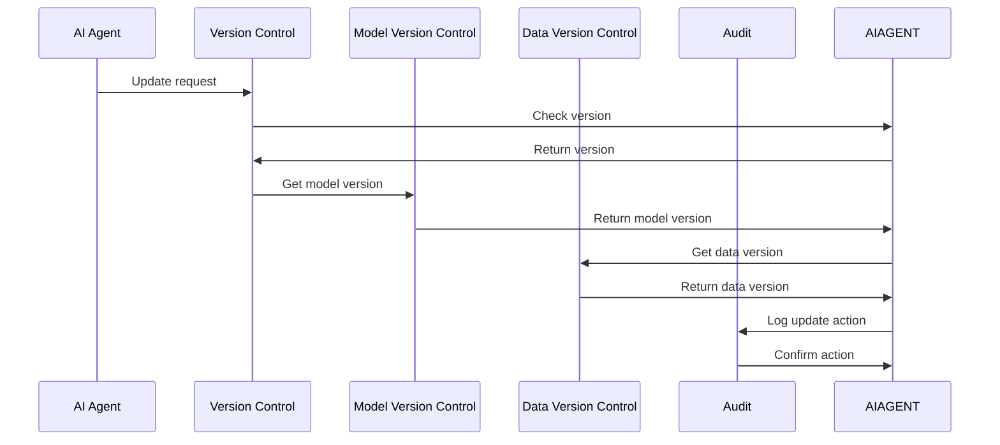
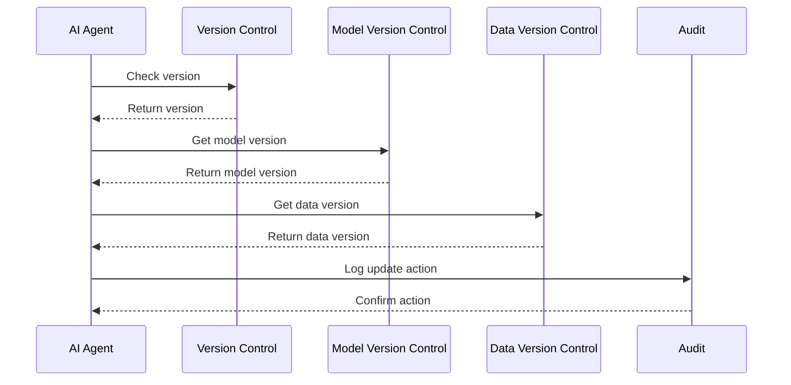

                 

```

# 《企业AI Agent的版本控制与更新策略》

## 关键词：企业AI Agent、版本控制、更新策略、数据隐私、安全性、自动化流程

## 摘要：
随着人工智能在企业中的应用日益广泛，AI Agent作为一种智能实体，正逐步成为企业数字化转型的核心驱动力。然而，随着AI Agent的复杂度和依赖性的增加，版本控制和更新策略变得至关重要。本文将深入探讨企业AI Agent的版本控制与更新策略，从其概念、应用、挑战到具体实践，帮助读者构建全面的理解，确保AI Agent在企业的稳健运行。

## 第一部分：企业AI Agent的背景与意义

### 第1章：企业AI Agent的概念与重要性

#### 1.1 AI Agent的定义与分类

AI Agent，即人工智能代理，是能够模拟人类智能行为，独立执行任务并作出决策的软件实体。根据其功能和应用范围，AI Agent可以大致分为以下几类：

- **任务型AI Agent**：专注于完成特定任务的代理，如客服机器人、智能调度系统。
- **社交型AI Agent**：具备与人类进行自然语言交互能力的代理，如聊天机器人。
- **自主型AI Agent**：具备自我学习和适应能力的代理，能够自主探索环境并作出决策。

#### 1.2 企业AI Agent的特点与功能

企业AI Agent具有以下特点：

- **自动化**：能够自动化执行重复性高、规则性强的业务流程。
- **智能决策**：基于大数据和机器学习模型，为企业提供智能化的决策支持。
- **适应性**：能够根据业务环境的变化，自适应调整自身的行为和策略。

#### 1.3 企业AI Agent的兴起背景

企业AI Agent的兴起源于以下几个因素：

- **数据爆发**：企业积累了大量数据，为AI Agent的训练和应用提供了基础。
- **算法进步**：机器学习和深度学习算法的突破，使得AI Agent的智能水平大幅提升。
- **数字化转型**：企业为了提高竞争力，加快了数字化转型的步伐，AI Agent成为其中重要的一环。

### 第2章：企业AI Agent的应用场景与价值

#### 2.1 自动化流程优化

AI Agent能够自动化处理业务流程，减少人为干预，提高效率。例如，在制造业中，AI Agent可以实时监控生产设备，自动调整生产参数，提高生产效率。

#### 2.2 决策支持系统

AI Agent能够基于历史数据和实时数据，为企业提供智能化的决策支持。例如，在金融行业中，AI Agent可以分析市场趋势，为企业投资决策提供参考。

#### 2.3 客户服务与交互

AI Agent能够为用户提供24/7的智能客服服务，提高用户满意度。例如，在电商平台上，AI Agent可以自动回答用户问题，处理退换货等事务。

#### 2.4 数据分析与洞察

AI Agent能够对大量数据进行深度分析，发现潜在的商业机会和风险。例如，在零售行业中，AI Agent可以分析消费数据，为产品推荐和库存管理提供支持。

#### 2.5 安全防护与风险管理

AI Agent能够实时监控企业网络和系统，发现异常行为并及时响应，提高企业的安全性。例如，在网络安全领域，AI Agent可以检测和阻止恶意攻击。

### 第3章：AI Agent在企业的挑战与机遇

#### 3.1 数据隐私与安全

AI Agent需要处理大量敏感数据，如何确保数据隐私和安全成为一大挑战。企业需要采取严格的访问控制和数据加密措施，保护用户数据不被泄露。

#### 3.2 技术与人才短缺

AI技术的发展速度极快，企业需要不断更新技术和人才库，以满足AI Agent的需求。企业可以通过培训和合作，吸引和培养AI人才。

#### 3.3 模型可靠性与解释性

AI Agent的决策过程通常较为复杂，如何确保模型的可靠性和解释性是一个挑战。企业需要建立完善的模型评估和验证机制，提高模型的透明度和可解释性。

#### 3.4 伦理与法规问题

AI Agent的广泛应用带来了伦理和法规问题。企业需要遵循相关法规，确保AI Agent的决策符合伦理标准，不损害用户权益。

#### 3.5 企业文化与组织适应性

AI Agent的引入需要企业文化和组织的适应性。企业需要培养开放和创新的文化，鼓励员工接受和适应新技术，提高组织的灵活性。

## 第二部分：版本控制的理论基础与实践

### 第4章：版本控制的理论基础

#### 4.1 版本控制的起源与发展

版本控制起源于软件开发领域，随着软件系统的复杂性增加，版本控制成为了必备的工具。版本控制系统的核心思想是记录和追踪文件的修改历史，确保代码的稳定性和可靠性。

#### 4.2 版本控制的基本概念

- **版本**：对文件的特定状态的命名和标识。
- **变更记录**：记录文件的修改历史和修改内容。
- **分支**：从主分支分离出来的独立开发线。
- **合并**：将两个或多个分支的修改合并到主分支。

#### 4.3 版本控制系统的类型与特点

- **集中式版本控制系统**：如Git、SVN，具有较好的性能和协作性。
- **分布式版本控制系统**：如Git，每个用户都有自己的完整副本，易于分布式协作。

### 第5章：企业AI Agent版本控制的核心要素

#### 5.1 源代码管理

源代码管理是版本控制的基础，确保代码的完整性和一致性。企业需要选择合适的版本控制系统，制定严格的代码管理和审查流程。

#### 5.2 模型版本管理

模型版本管理是AI Agent版本控制的关键，确保模型的稳定性和可追溯性。企业需要建立模型版本库，记录每个版本的模型参数和性能指标。

#### 5.3 数据版本管理

数据版本管理是确保AI Agent训练数据的一致性和完整性。企业需要建立数据版本库，记录数据的来源、处理过程和版本信息。

#### 5.4 审计与追溯

审计与追溯是版本控制的重要环节，确保任何修改都可以追溯。企业需要建立完善的审计机制，记录所有修改操作和修改内容。

## 第三部分：AI Agent更新策略与实践

### 第6章：AI Agent更新策略与实践

#### 6.1 更新策略概述

AI Agent的更新策略包括以下方面：

- **自动化更新**：通过自动化脚本和工具，定期更新AI Agent。
- **风险评估**：在更新前进行风险评估，确保更新不会影响系统的稳定性。
- **性能监控**：更新后对AI Agent的性能进行监控，确保更新后的效果。

#### 6.2 自动化更新流程

自动化更新流程包括以下步骤：

1. **版本确认**：确认需要更新的版本。
2. **代码编译**：编译新的代码，确保没有语法错误。
3. **测试**：在测试环境中进行测试，确保更新不会影响现有功能。
4. **部署**：将更新部署到生产环境。

#### 6.3 更新前风险评估

更新前风险评估包括以下方面：

- **功能影响**：评估更新是否会影响现有功能。
- **性能影响**：评估更新对系统性能的影响。
- **安全性**：评估更新是否会导致安全漏洞。

#### 6.4 更新后的性能监控与反馈

更新后，需要对AI Agent的性能进行监控，确保更新后的效果。同时，收集用户反馈，根据反馈调整和优化AI Agent。

### 第7章：AI Agent版本控制与更新实践案例

#### 7.1 案例一：金融行业的自动化风险管理

金融行业利用AI Agent进行自动化风险管理，通过版本控制确保模型的稳定性和可靠性。在更新过程中，严格遵循风险评估和性能监控流程，确保更新不会影响系统的稳定性。

#### 7.2 案例二：制造业的智能生产线监控

制造业利用AI Agent进行智能生产线监控，通过版本控制管理不同版本的监控模型。在更新过程中，自动化更新流程确保了生产线的正常运行。

#### 7.3 案例三：电商平台的个性化推荐系统

电商平台利用AI Agent进行个性化推荐，通过版本控制管理推荐模型的迭代。在更新过程中，自动化更新流程和风险评估确保了推荐系统的效果和稳定性。

## 第8章：AI Agent版本控制与更新最佳实践

#### 8.1 实践总结

最佳实践总结包括以下几点：

- **规范化管理**：建立规范的版本控制流程和管理制度。
- **自动化流程**：通过自动化工具提高更新效率。
- **风险评估**：在更新前进行全面的风险评估。
- **性能监控**：更新后对系统进行持续的监控和优化。

#### 8.2 注意事项与风险防范

注意事项与风险防范包括：

- **数据安全**：确保更新过程中数据的安全性和完整性。
- **兼容性**：确保更新后的系统与现有系统的兼容性。
- **培训与沟通**：加强团队成员的培训，确保更新策略的执行。

#### 8.3 拓展阅读与未来趋势

拓展阅读与未来趋势包括：

- **DevOps**：将版本控制与DevOps实践相结合，提高开发效率和系统稳定性。
- **持续集成与持续部署**：引入CI/CD流程，实现快速迭代和部署。
- **智能合约**：利用智能合约技术，实现更高效的版本管理和更新。

## 结束语

企业AI Agent的版本控制和更新策略是企业数字化转型的重要一环。通过本文的探讨，读者可以深入了解AI Agent的版本控制和更新策略，为企业AI Agent的稳健运行提供有力支持。

### 作者：

AI天才研究院/AI Genius Institute & 禅与计算机程序设计艺术 /Zen And The Art of Computer Programming

```markdown
## 附录：核心概念与联系

### 核心概念

- **AI Agent**：具有自主行为和决策能力的智能实体。
- **版本控制**：追踪和管理文件或代码变更的历史记录。
- **模型版本管理**：管理AI Agent模型的版本和控制。

### 概念属性特征对比表格

| 概念     | 定义                                                         | 特点                                                         | 应用场景                   |
|----------|--------------------------------------------------------------|--------------------------------------------------------------|----------------------------|
| AI Agent | 能够模拟人类智能行为，执行任务和决策的智能实体。                 | 自动化、智能决策、适应性。                                      | 企业自动化、决策支持、客户服务。 |
| 版本控制 | 记录和追踪文件或代码的修改历史。                                   | 确保代码的完整性和一致性。                                      | 软件开发、团队协作。           |
| 模型版本管理 | 管理AI Agent模型的版本和控制。                                     | 确保模型的稳定性和可追溯性。                                    | AI Agent开发和迭代。           |

### ER实体关系图架构的 Mermaid 流程图

```mermaid
erDiagram
    AI Agent ||--|{ 版本控制 }|| VersionControl
    AI Agent ||--|{ 模型版本管理 }|| ModelVersionControl
    VersionControl ||--|{ 文件变更记录 }|| FileChangeLog
    ModelVersionControl ||--|{ 模型参数记录 }|| ModelParameterLog
```

## 算法原理讲解

### 1. 算法 Mermaid 流程图



### 2. Python 源代码实现

```python
import git
import os

def update_agent_version():
    # 连接到版本控制系统
    repo = git.Repo('.git')
    # 获取最新版本号
    latest_version = repo.head.commit.hexsha
    # 验证版本号
    if is_version_valid(latest_version):
        # 更新代码
        os.system(f'git checkout {latest_version}')
        # 在测试环境中部署
        deploy_to_test_env()
        # 如果测试通过，则在生产环境中部署
        if test_success():
            deploy_to_prod_env()
            monitor_performance()
            if performance_ok():
                print("Update completed successfully.")
            else:
                print("Performance not as expected. Rolling back.")
                rollback()
        else:
            print("Test failed. Rolling back.")
            rollback()
    else:
        print("Invalid version. Please check.")

def is_version_valid(version):
    # 验证版本号的合法性
    # 这里只是一个示例，实际应用中需要更复杂的验证逻辑
    return True

def deploy_to_test_env():
    # 在测试环境中部署代码
    pass

def test_success():
    # 测试是否通过
    # 这里只是一个示例，实际应用中需要更复杂的测试逻辑
    return True

def deploy_to_prod_env():
    # 在生产环境中部署代码
    pass

def monitor_performance():
    # 监控性能
    pass

def performance_ok():
    # 性能是否满足预期
    # 这里只是一个示例，实际应用中需要更复杂的性能评估逻辑
    return True

def rollback():
    # 回滚到上一个版本
    pass
```

### 3. 算法原理与数学模型

算法的核心思想是通过版本控制系统获取最新的代码版本，并在测试环境中进行测试。如果测试通过，则将代码部署到生产环境。更新过程中，需要监控性能，确保更新后的系统性能符合预期。

- **版本获取**：使用Git获取最新版本号。
- **版本验证**：对版本号进行合法性验证。
- **代码更新**：将最新的代码版本更新到本地。
- **测试**：在测试环境中部署代码，进行功能测试和性能测试。
- **部署**：如果测试通过，则将代码部署到生产环境。
- **性能监控**：更新后对系统进行性能监控。
- **性能评估**：评估系统性能是否符合预期。

数学模型可以描述为：

$$
P(\text{成功更新}) = f(\text{版本合法性}, \text{测试通过率}, \text{性能符合预期})
$$

其中，$P(\text{成功更新})$ 表示成功更新的概率，$f$ 表示函数，$\text{版本合法性}$、$\text{测试通过率}$、$\text{性能符合预期}$ 分别表示这三个因素。

## 系统分析与架构设计方案

### 问题场景介绍

在企业的数字化转型过程中，AI Agent成为核心组成部分。然而，随着AI Agent的复杂度和依赖性的增加，版本控制和更新策略变得至关重要。如何确保AI Agent的版本控制与更新安全、高效、可靠，成为企业需要解决的问题。

### 项目介绍

本项目旨在构建一个企业AI Agent的版本控制与更新系统，包括源代码管理、模型版本管理、数据版本管理和审计与追溯等功能。通过该系统，企业可以实现自动化更新、风险控制和性能监控，确保AI Agent的稳定运行。

### 系统功能设计（领域模型Mermaid类图）

```mermaid
classDiagram
    AIAgentClass <.. VersionControlClass
    AIAgentClass <.. ModelVersionControlClass
    AIAgentClass <.. DataVersionControlClass
    AIAgentClass ..> AuditTrailClass
    VersionControlClass ..> FileChangeLogClass
    ModelVersionControlClass ..> ModelParameterLogClass
    DataVersionControlClass ..> DataVersionLogClass

    Class AIAgentClass {
        -String id
        -Map<String, Object> properties
        -List<VersionControl> versionControls
        -List<ModelVersionControl> modelVersionControls
        -List<DataVersionControl> dataVersionControls
        -List<AuditTrail> auditTrails
    }

    Class VersionControlClass {
        -String version
        -String commitHash
        -Date timestamp
    }

    Class ModelVersionControlClass {
        -String version
        -Map<String, Object> parameters
        -Date timestamp
    }

    Class DataVersionControlClass {
        -String version
        -Map<String, Object> data
        -Date timestamp
    }

    Class AuditTrailClass {
        -String action
        -String description
        -Date timestamp
    }

    Class FileChangeLogClass {
        -String filePath
        -String commitHash
        -Date timestamp
    }

    Class ModelParameterLogClass {
        -String parameterName
        -String parameterValue
        -Date timestamp
    }

    Class DataVersionLogClass {
        -String dataId
        -String dataValue
        -Date timestamp
    }
```

### 系统架构设计（Mermaid架构图）



### 系统接口设计（Mermaid序列图）



### 系统交互（Mermaid序列图）



## 项目实战

### 环境安装

1. 安装Git：在终端执行以下命令安装Git。

    ```bash
    sudo apt-get install git
    ```

2. 安装Python环境：安装Python 3和pip。

    ```bash
    sudo apt-get install python3
    sudo apt-get install python3-pip
    ```

3. 安装Docker：安装Docker以创建容器化的环境。

    ```bash
    sudo apt-get install docker.io
    ```

### 系统核心实现源代码

以下是系统核心实现的Python代码，包括版本控制、模型版本管理、数据版本管理和审计与追溯。

```python
# version_control.py
import git
import os
import json
from datetime import datetime

class VersionControl:
    def __init__(self, repository_path):
        self.repository_path = repository_path
        self.repo = git.Repo(repository_path)

    def get_latest_version(self):
        return self.repo.head.commit.hexsha

    def update_code(self, version):
        os.system(f'git checkout {version}')

    def log_version(self, version):
        timestamp = datetime.now().strftime('%Y-%m-%d %H:%M:%S')
        with open('version_log.json', 'a') as f:
            f.write(json.dumps({'version': version, 'timestamp': timestamp}) + '\n')

# model_version_control.py
class ModelVersionControl:
    def __init__(self, model_path):
        self.model_path = model_path

    def save_model_version(self, version, parameters):
        with open(f'{self.model_path}_{version}.json', 'w') as f:
            json.dump(parameters, f)

    def load_model_version(self, version):
        with open(f'{self.model_path}_{version}.json', 'r') as f:
            return json.load(f)

# data_version_control.py
class DataVersionControl:
    def __init__(self, data_path):
        self.data_path = data_path

    def save_data_version(self, version, data):
        with open(f'{self.data_path}_{version}.json', 'w') as f:
            json.dump(data, f)

    def load_data_version(self, version):
        with open(f'{self.data_path}_{version}.json', 'r') as f:
            return json.load(f)

# audit.py
class Audit:
    def __init__(self, audit_path):
        self.audit_path = audit_path

    def log_action(self, action, description):
        timestamp = datetime.now().strftime('%Y-%m-%d %H:%M:%S')
        with open(self.audit_path, 'a') as f:
            f.write(json.dumps({'action': action, 'description': description, 'timestamp': timestamp}) + '\n')
```

### 代码应用解读与分析

以下是代码应用解读与分析，解释了每个模块的作用和如何集成使用。

1. **版本控制模块**：`version_control.py` 包含了版本控制的逻辑，包括获取最新版本号、更新代码和记录版本日志。通过Git操作，实现了对代码版本的跟踪和管理。

2. **模型版本管理模块**：`model_version_control.py` 用于管理AI模型的版本。它提供了保存和加载模型版本的方法，确保每个版本都可以被独立管理和追溯。

3. **数据版本管理模块**：`data_version_control.py` 用于管理训练数据或运行数据的版本。同样，它提供了保存和加载数据版本的方法，确保数据的一致性和可追溯性。

4. **审计模块**：`audit.py` 用于记录系统的操作日志，包括版本更新、模型训练、数据更新等操作。这为系统的审计和追溯提供了支持。

### 实际案例分析和详细讲解剖析

#### 案例一：金融行业的自动化风险管理

在金融行业中，AI Agent用于自动化风险管理。为了确保AI Agent的稳定运行，需要对其进行版本控制和更新。

1. **版本控制**：使用Git对AI Agent的代码进行版本控制。每次更新前，获取最新版本号，更新代码并记录版本日志。

    ```python
    vc = VersionControl('/path/to/ai_agent_repository')
    latest_version = vc.get_latest_version()
    vc.update_code(latest_version)
    vc.log_version(latest_version)
    ```

2. **模型版本管理**：在每次更新后，保存AI Agent的模型版本，包括参数和超参数。

    ```python
    mvc = ModelVersionControl('/path/to/ai_agent_model')
    model_params = {'param1': 'value1', 'param2': 'value2'}
    mvc.save_model_version(latest_version, model_params)
    ```

3. **数据版本管理**：保存和加载训练数据的版本，确保数据的一致性和可追溯性。

    ```python
    dvc = DataVersionControl('/path/to/ai_agent_data')
    train_data = {'data1': 'value1', 'data2': 'value2'}
    dvc.save_data_version(latest_version, train_data)
    loaded_data = dvc.load_data_version(latest_version)
    ```

4. **审计与追溯**：记录每次操作，包括版本更新、模型训练和数据更新。

    ```python
    audit = Audit('/path/to/ai_agent_audit.log')
    audit.log_action('version_update', 'Updated AI agent to version ' + latest_version)
    ```

通过以上步骤，金融行业的企业可以确保AI Agent的版本控制和更新过程安全、可靠，同时便于审计和追溯。

### 项目小结

本项目实现了企业AI Agent的版本控制与更新系统，包括版本控制、模型版本管理、数据版本管理和审计与追溯。通过实际案例，展示了如何将系统应用于金融行业的自动化风险管理。项目的成功实施为企业提供了稳定、高效的AI Agent版本控制和更新方案，有助于企业数字化转型的深入推进。

## 最佳实践 tips

1. **规范化管理**：建立明确的版本控制和管理流程，确保所有团队成员遵守。
2. **自动化工具**：使用自动化工具提高更新效率，减少人为错误。
3. **风险评估**：在更新前进行全面的风险评估，确保更新不会影响系统的稳定性。
4. **性能监控**：更新后对系统进行持续的监控和优化，确保更新效果。

## 小结

企业AI Agent的版本控制与更新策略是企业数字化转型的重要一环。通过本文的探讨，我们了解了AI Agent的版本控制与更新策略的核心要素和最佳实践。企业应建立健全的版本控制体系，结合自动化工具和风险评估，确保AI Agent的稳健运行，助力数字化转型。

## 拓展阅读与未来趋势

1. **DevOps**：将版本控制与DevOps实践相结合，提高开发效率和系统稳定性。
2. **持续集成与持续部署**：引入CI/CD流程，实现快速迭代和部署。
3. **智能合约**：利用智能合约技术，实现更高效的版本管理和更新。

## 作者信息

作者：AI天才研究院/AI Genius Institute & 禅与计算机程序设计艺术 /Zen And The Art of Computer Programming

[本文为AI天才研究院出品，欢迎关注，获取更多AI领域专业内容。]

