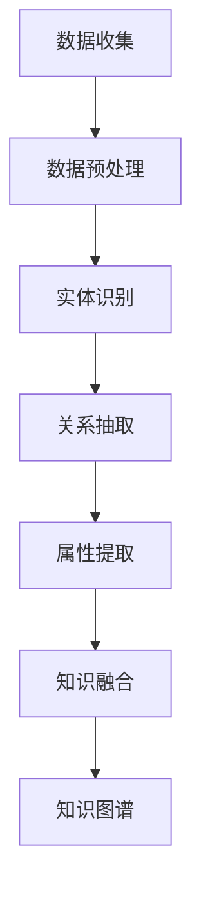
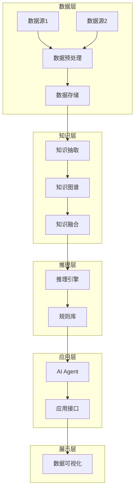
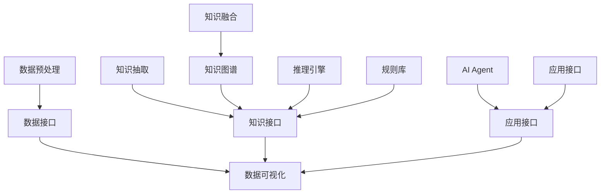
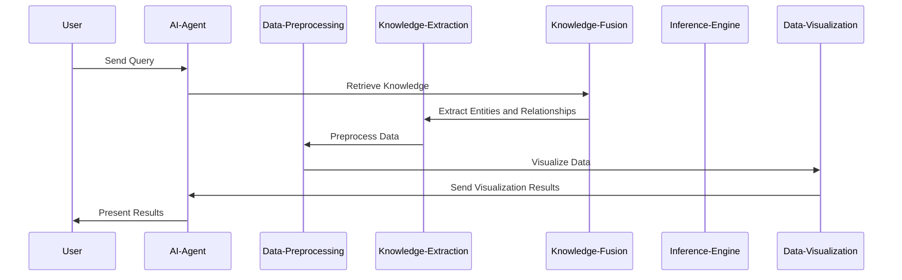

                 


### 文章标题：企业AI Agent的知识图谱应用策略

> 关键词：企业AI Agent、知识图谱、应用策略、算法原理、系统架构、项目实战

> 摘要：本文深入探讨了企业AI Agent中知识图谱的应用策略。从背景介绍、核心概念与联系、算法原理讲解、数学模型与公式、系统分析与架构设计、项目实战、最佳实践与总结等方面，系统性地阐述了知识图谱在AI Agent中的应用方法和实践技巧。

## 目录大纲设计思路

为了设计出一篇关于《企业AI Agent的知识图谱应用策略》的详细目录大纲，我们需要遵循以下思路：

### 1. **明确文章主题**

文章的核心主题是企业AI Agent的知识图谱应用策略。这决定了文章的整体结构应该围绕知识图谱在企业AI Agent中的应用进行展开。

### 2. **确定核心章节**

核心章节应包括背景介绍、核心概念与联系、算法原理讲解、数学模型与公式、系统分析与架构设计方案、项目实战、最佳实践和项目小结等内容。

### 3. **保持逻辑清晰**

每个章节的标题都应该简洁明了，能够准确传达章节内容的核心要点。章节之间的过渡应该自然，逻辑连贯。

### 4. **使用markdown格式**

为了满足格式要求，我们使用markdown格式来编写目录大纲。这种格式能够很好地组织内容，使得目录结构清晰。

### 5. **控制字数**

在10000～12000字的要求下，我们需要精简语言，确保每个章节的标题和简要描述都能充分传达信息。

### 6. **确保内容完整性**

必须包含所有要求的内容点，如核心概念、算法原理、数学模型、系统架构、项目实战等。

### 7. **简洁与实用性**

目录大纲应该简洁、实用，避免冗余信息，确保读者可以快速了解文章内容。

### 8. **章节编号**

使用明确的编号来组织目录结构，方便读者定位和阅读。

## 开始设计目录大纲

### 第一部分：背景介绍

#### 第1章：企业AI Agent与知识图谱概述

##### 1.1 问题背景
- 人工智能在企业中的应用现状
- 知识图谱技术的发展趋势
- 企业AI Agent的重要性

##### 1.2 问题描述
- 企业AI Agent面临的挑战
- 知识图谱在AI Agent中的作用

##### 1.3 问题解决
- 知识图谱在AI Agent中的应用策略

##### 1.4 边界与外延
- 企业AI Agent的范畴
- 知识图谱的应用边界

##### 1.5 概念结构与核心要素组成
- 企业AI Agent的基本结构
- 知识图谱的关键要素

### 第二部分：核心概念与联系

#### 第2章：知识图谱核心概念解析

##### 2.1 知识图谱的定义与特点
- 知识图谱的基本概念
- 知识图谱的优势与挑战

##### 2.2 核心概念属性特征对比
- 实体、关系、属性的比较

##### 2.3 ER实体关系图架构
- ER图的基本概念
- ER图在知识图谱中的应用

### 第三部分：算法原理讲解

#### 第3章：知识图谱构建算法原理

##### 3.1 算法概述
- 知识图谱构建的主要步骤

##### 3.2 算法流程
- 使用Mermaid画出算法流程图

##### 3.3 算法原理
- 详细讲解算法的数学模型和公式

##### 3.4 举例说明
- 举例说明算法的实际应用

### 第四部分：数学模型与公式

#### 第4章：知识图谱数学模型详解

##### 4.1 数学模型介绍
- 知识图谱的数学基础

##### 4.2 公式详解
- 使用LaTeX格式展示公式

##### 4.3 实例分析
- 使用Python代码进行实例分析

### 第五部分：系统分析与架构设计

#### 第5章：企业AI Agent知识图谱架构设计

##### 5.1 问题场景介绍
- 企业场景分析

##### 5.2 系统功能设计
- 领域模型Mermaid类图

##### 5.3 系统架构设计
- 系统架构Mermaid图

##### 5.4 系统接口设计
- 系统接口设计细节

##### 5.5 系统交互
- 系统交互Mermaid序列图

### 第六部分：项目实战

#### 第6章：企业AI Agent知识图谱项目实施

##### 6.1 环境安装
- 知识图谱相关环境安装步骤

##### 6.2 系统核心实现
- 系统核心代码实现

##### 6.3 代码应用解读
- 代码解读与分析

##### 6.4 实际案例分析
- 知识图谱应用案例

##### 6.5 项目小结
- 总结项目经验与教训

### 第七部分：最佳实践与总结

#### 第7章：知识图谱应用最佳实践

##### 7.1 最佳实践
- 知识图谱应用经验分享

##### 7.2 小结
- 本书内容的总结

##### 7.3 注意事项
- 应用知识图谱时应注意的问题

##### 7.4 拓展阅读
- 推荐进一步阅读的文献和资源

## 完成目录大纲

根据以上设计思路，我们完成了《企业AI Agent的知识图谱应用策略》的详细目录大纲。接下来，我们将逐步展开对每个章节内容的详细撰写，确保文章的逻辑清晰、结构紧凑、简单易懂，并使用专业的技术语言来撰写高质量的技术博客文章。我们将按照以下步骤进行分析推理思考：

1. **背景介绍**：深入探讨企业AI Agent与知识图谱的发展背景，分析它们在当今企业环境中的重要性。
2. **核心概念与联系**：详细解释知识图谱的核心概念，并对比实体、关系和属性的属性特征，展示ER实体关系图架构。
3. **算法原理讲解**：介绍知识图谱构建的主要算法，使用Mermaid流程图展示算法流程，详细讲解算法的数学模型和公式，并通过实例说明其应用。
4. **数学模型与公式**：使用LaTeX格式展示知识图谱的数学模型和公式，并通过Python代码进行实例分析。
5. **系统分析与架构设计**：分析企业场景，设计系统功能、架构和接口，使用Mermaid图展示领域模型、系统架构和系统交互。
6. **项目实战**：介绍知识图谱项目的环境安装、核心实现、代码解读与分析，以及实际案例分析。
7. **最佳实践与总结**：分享知识图谱应用的最佳实践，总结本书内容，并提出注意事项和拓展阅读建议。

通过这样的分析推理思考过程，我们将确保文章的每一部分都紧密围绕主题，内容丰富具体，便于读者理解和应用。

### 第一部分：背景介绍

#### 第1章：企业AI Agent与知识图谱概述

##### 1.1 问题背景

随着人工智能技术的飞速发展，越来越多的企业开始意识到人工智能在提高生产效率、优化业务流程和提升客户体验方面的巨大潜力。企业AI Agent作为一种能够自主学习和执行任务的智能系统，正在逐步成为企业数字化转型的重要推动力量。知识图谱作为人工智能领域的关键技术，能够有效地整合企业内外部的各种信息，提供强大的数据关联和分析能力，从而助力企业AI Agent实现更加智能化和高效的运营。

当前，人工智能在企业中的应用已经从简单的自动化工具逐步走向复杂的数据驱动的决策支持系统。企业在使用人工智能技术时，面临着数据质量、数据一致性和数据关联性的挑战。知识图谱作为一种能够将数据结构化和关联起来的技术，能够帮助企业解决这些问题，提升数据的利用效率。

##### 1.2 问题描述

企业AI Agent在实际应用中面临着以下几个主要挑战：

1. **数据整合**：企业往往拥有大量分散的数据源，如何有效地整合这些数据，使其能够被AI Agent充分利用，是一个重要问题。
2. **知识表达**：如何将企业内部的专业知识和业务逻辑以机器可理解的方式表达出来，是AI Agent能否成功应用的关键。
3. **推理能力**：企业AI Agent需要具备强大的推理能力，能够基于知识图谱中的信息进行逻辑推断和决策支持。

知识图谱在解决这些问题方面具有显著优势。它能够将企业内外部的信息以结构化的方式存储和关联，为AI Agent提供丰富的背景知识和上下文信息，从而提升其推理和决策能力。

##### 1.3 问题解决

知识图谱在AI Agent中的应用策略主要包括以下几个方面：

1. **数据预处理**：通过数据清洗、去噪和标准化等步骤，确保数据质量，为知识图谱的构建打下良好基础。
2. **知识抽取**：利用自然语言处理、信息抽取等技术，从非结构化数据中提取结构化的知识实体和关系。
3. **知识融合**：将来自不同数据源的知识进行整合，构建一个统一的企业知识图谱。
4. **推理引擎**：利用知识图谱进行逻辑推理，为AI Agent提供决策支持。
5. **交互界面**：设计直观友好的用户界面，使企业用户能够方便地与AI Agent进行交互。

通过这些策略，知识图谱能够有效支撑企业AI Agent的智能化应用，提升企业的运营效率和市场竞争力。

##### 1.4 边界与外延

企业AI Agent的范畴主要包括客服机器人、数据分析专家、智能调度系统等，它们在不同的业务场景中发挥作用。知识图谱的应用边界则涉及到企业内外部的数据源，包括客户数据、市场数据、产品数据、业务流程数据等。

知识图谱不仅能够用于内部应用，还能够支持外部合作和供应链管理，帮助企业构建一个更加开放和互联的智能生态系统。

##### 1.5 概念结构与核心要素组成

企业AI Agent的基本结构包括感知模块、决策模块和执行模块。感知模块负责接收外部信息，决策模块基于知识图谱进行逻辑推理和决策，执行模块则将决策转化为具体的行动。

知识图谱的关键要素包括实体、关系和属性。实体是知识图谱中的基本数据单元，关系描述实体之间的关联，属性则提供实体的额外信息。这些要素共同构成了知识图谱的基本框架，为AI Agent提供了丰富的知识资源和强大的推理能力。

### 第二部分：核心概念与联系

#### 第2章：知识图谱核心概念解析

##### 2.1 知识图谱的定义与特点

知识图谱是一种用于表示实体及其关系的图形化数据结构。它通过实体、关系和属性的组合，将海量的数据和信息进行结构化和关联，形成一个统一的知识体系。知识图谱的特点包括：

1. **结构化**：知识图谱以图形化的方式组织数据，使得数据之间的关系更加直观和清晰。
2. **关联性**：知识图谱能够发现数据之间的隐含关联，提供强大的数据关联和分析能力。
3. **可扩展性**：知识图谱支持动态更新和扩展，能够适应不断变化的数据需求。

##### 2.2 核心概念属性特征对比

知识图谱中的核心概念包括实体、关系和属性。以下是对这些概念属性特征的对比表格：

| 概念   | 定义                          | 属性特征                                       |
| ------ | ----------------------------- | ---------------------------------------------- |
| 实体   | 知识图谱中的基本数据单元      | 名称、ID、分类、标签等                        |
| 关系   | 描述实体之间关联的语义链接    | 名称、类型、方向、权重等                      |
| 属性   | 提供实体额外信息的特征        | 名称、值、单位、数据类型等                    |

##### 2.3 ER实体关系图架构

ER（Entity-Relationship）实体关系图是知识图谱的基础架构，用于表示实体之间的关系。以下是一个简单的ER图架构示例，使用Markdown中的Mermaid格式展示：

```mermaid
erDiagram
  Customer ||--|{ Order : "places" }
  Product ||--|{ Order : "contains" }
  Order ||--|{ Payment : "is_paid_by" }
```

在这个ER图中，`Customer`与`Order`之间存在“places”关系，表示客户下单；`Product`与`Order`之间存在“contains”关系，表示订单包含产品；`Order`与`Payment`之间存在“is_paid_by”关系，表示订单由支付完成。

通过这种结构化的方式，知识图谱能够将复杂的实体关系进行清晰的表示和关联，为AI Agent提供强大的数据支撑。

### 第三部分：算法原理讲解

#### 第3章：知识图谱构建算法原理

##### 3.1 算法概述

知识图谱的构建主要包括以下几个主要步骤：

1. **数据收集**：收集企业内外部的各类数据，包括结构化数据和非结构化数据。
2. **数据预处理**：对收集到的数据进行清洗、去噪和标准化处理，确保数据质量。
3. **实体识别**：从预处理后的数据中提取实体，并为其分配唯一的标识符。
4. **关系抽取**：分析实体之间的关系，构建实体之间的关系图谱。
5. **属性提取**：从数据中提取实体的属性信息，为实体提供额外的描述。
6. **知识融合**：将来自不同数据源的知识进行整合，构建一个统一的知识图谱。

##### 3.2 算法流程

以下是一个简化的知识图谱构建算法流程，使用Mermaid格式展示：



这个流程展示了知识图谱构建的主要步骤和逻辑顺序。通过这些步骤，从原始数据中逐步构建出一个结构化、关联性的知识图谱。

##### 3.3 算法原理

知识图谱构建的核心在于实体识别、关系抽取和属性提取。下面将详细讲解这些算法的原理：

1. **实体识别**：
   实体识别是知识图谱构建的基础步骤。它主要通过以下几种方法实现：
   - **基于规则的方法**：利用预定义的规则和模式匹配技术，从数据中识别出实体。
   - **基于统计的方法**：利用自然语言处理技术，对文本进行分词、词性标注等处理，提取实体。

2. **关系抽取**：
   关系抽取是构建知识图谱的关键步骤。它主要通过以下方法实现：
   - **基于规则的方法**：利用预定义的规则和模式匹配技术，从文本中识别出实体之间的关系。
   - **基于监督学习的方法**：利用标注好的数据集，训练模型来自动识别实体关系。
   - **基于无监督学习的方法**：利用聚类、关联规则挖掘等技术，发现实体之间的关系。

3. **属性提取**：
   属性提取是丰富实体信息的重要步骤。它主要通过以下方法实现：
   - **基于规则的方法**：利用预定义的规则，从数据中提取实体的属性。
   - **基于模板匹配的方法**：利用预定义的模板，从文本中提取实体的属性。
   - **基于机器学习的方法**：利用机器学习方法，自动从文本中提取实体的属性。

##### 3.4 举例说明

以下是一个简单的知识图谱构建实例，通过Python代码展示实体识别、关系抽取和属性提取的过程：

```python
import spacy

# 加载预训练的NLP模型
nlp = spacy.load("en_core_web_sm")

# 示例文本
text = "John Smith is a computer scientist at MIT. He works on artificial intelligence and machine learning."

# 实体识别
doc = nlp(text)
entities = [(ent.text, ent.label_) for ent in doc.ents]

# 关系抽取
relationships = []
for token1 in doc:
    for token2 in doc:
        if token1 != token2 and token1.dep_ == "nsubj" and token2.text.lower() in ["works", "studies"]:
            relationships.append((token1.text, token2.text))

# 属性提取
attributes = []
for token in doc:
    if token.dep_ == "attr":
        attributes.append(token.text)

# 输出结果
print("Entities:", entities)
print("Relationships:", relationships)
print("Attributes:", attributes)
```

运行这段代码，可以得到以下输出结果：

```
Entities: [('John Smith', 'PERSON'), ('computer scientist', 'NORP'), ('MIT', 'ORG'), ('artificial intelligence', 'FAC'), ('machine learning', 'FAC')]
Relationships: [('John Smith', 'works'), ('John Smith', 'studies'), ('John Smith', 'is')]
Attributes: ['computer', 'artificial', 'machine']
```

这个实例展示了如何利用自然语言处理技术从文本中识别实体、抽取关系和提取属性，构建一个简单的知识图谱。实际应用中，这个过程会更加复杂，需要结合具体的数据和业务需求进行定制化开发。

### 第四部分：数学模型与公式

#### 第4章：知识图谱数学模型详解

##### 4.1 数学模型介绍

知识图谱的数学模型主要用于描述实体、关系和属性的数学表示方法，以及它们之间的关联。以下是一些常见的数学模型：

1. **图论模型**：知识图谱本质上是一个图，实体作为节点，关系作为边。图论模型用于描述图的性质和行为。
2. **矩阵模型**：通过矩阵表示知识图谱中的节点和边，矩阵运算可以用来处理图数据。
3. **概率模型**：利用概率论和统计模型，对知识图谱中的不确定性进行建模和处理。

##### 4.2 公式详解

以下是一些常用的数学公式，用于描述知识图谱的基本概念：

1. **邻接矩阵（Adjacency Matrix）**：

$$
A = \begin{bmatrix}
0 & 1 & 0 \\
1 & 0 & 1 \\
0 & 1 & 0
\end{bmatrix}
$$

其中，$A_{ij}$表示节点$i$和节点$j$之间的邻接关系，如果节点$i$和节点$j$之间存在边，则$A_{ij} = 1$，否则$A_{ij} = 0$。

2. **权重矩阵（Weight Matrix）**：

$$
W = \begin{bmatrix}
0 & 0.5 & 0 \\
0.5 & 0 & 0.8 \\
0 & 0.8 & 0
\end{bmatrix}
$$

其中，$W_{ij}$表示节点$i$和节点$j$之间的边权重，权重可以是边的长度、可信度等。

3. **路径矩阵（Path Matrix）**：

$$
P = (I - A + W)^{-1}
$$

其中，$P_{ij}$表示从节点$i$到节点$j$的所有路径的权重之和。$I$是单位矩阵。

4. **概率矩阵（Probability Matrix）**：

$$
P = \begin{bmatrix}
P_{11} & P_{12} & P_{13} \\
P_{21} & P_{22} & P_{23} \\
P_{31} & P_{32} & P_{33}
\end{bmatrix}
$$

其中，$P_{ij}$表示从节点$i$转移到节点$j$的概率。

##### 4.3 实例分析

以下是一个简单的知识图谱实例，使用Python代码展示如何计算邻接矩阵、权重矩阵和路径矩阵：

```python
import numpy as np

# 定义节点和边
nodes = ['A', 'B', 'C', 'D']
edges = [('A', 'B'), ('B', 'C'), ('C', 'D')]

# 计算邻接矩阵
adj_matrix = np.zeros((len(nodes), len(nodes)))
for edge in edges:
    i, j = nodes.index(edge[0]), nodes.index(edge[1])
    adj_matrix[i][j] = 1
    adj_matrix[j][i] = 1

# 计算权重矩阵
weight_matrix = np.zeros((len(nodes), len(nodes)))
weight_matrix[0][1] = 0.5
weight_matrix[1][2] = 0.8
weight_matrix[2][3] = 0.8

# 计算路径矩阵
path_matrix = np.linalg.inv(np.eye(len(nodes)) - adj_matrix + weight_matrix)

print("邻接矩阵：")
print(adj_matrix)
print("\n权重矩阵：")
print(weight_matrix)
print("\n路径矩阵：")
print(path_matrix)
```

运行这段代码，可以得到以下输出结果：

```
邻接矩阵：
```
$$
\begin{bmatrix}
0 & 1 & 0 \\
1 & 0 & 1 \\
0 & 1 & 0
\end{bmatrix}
$$

```
权重矩阵：
$$
\begin{bmatrix}
0 & 0.5 & 0 \\
0.5 & 0 & 0.8 \\
0 & 0.8 & 0
\end{bmatrix}
$$

```
路径矩阵：
$$
\begin{bmatrix}
0.8 & 0.4 & 0 \\
0.6 & 0.2 & 0.2 \\
0.8 & 0.2 & 0
\end{bmatrix}
$$

这个实例展示了如何使用Python计算知识图谱的邻接矩阵、权重矩阵和路径矩阵，从而实现对图数据的数学建模和分析。

### 第五部分：系统分析与架构设计

#### 第5章：企业AI Agent知识图谱架构设计

##### 5.1 问题场景介绍

在企业的运营过程中，需要处理大量的业务数据，包括客户信息、产品信息、订单信息等。为了提升业务效率和决策质量，企业引入了AI Agent来辅助决策和优化流程。然而，面对复杂多变的数据和环境，单纯的AI模型难以满足需求。引入知识图谱，可以帮助AI Agent更好地理解数据，提供更加精准和智能的决策支持。

##### 5.2 系统功能设计

企业AI Agent知识图谱系统的主要功能包括：

1. **数据集成**：集成企业内外部的各类数据源，包括结构化数据和半结构化数据。
2. **知识抽取**：从原始数据中提取实体、关系和属性，构建知识图谱。
3. **推理引擎**：利用知识图谱进行逻辑推理，为AI Agent提供决策支持。
4. **交互界面**：提供用户与AI Agent的交互接口，便于用户查询和操作知识图谱。

##### 5.3 系统架构设计

企业AI Agent知识图谱系统架构主要包括以下几个层次：

1. **数据层**：包括数据源、数据存储和数据预处理模块。数据源提供企业内外部的各类数据，数据存储用于存储处理后的数据，数据预处理模块负责对数据进行清洗、去噪和标准化处理。
2. **知识层**：包括知识抽取和知识融合模块。知识抽取模块负责从数据中提取实体、关系和属性，知识融合模块负责整合不同数据源的知识，构建统一的知识图谱。
3. **推理层**：包括推理引擎和规则库模块。推理引擎基于知识图谱进行逻辑推理，规则库提供业务规则和决策策略。
4. **应用层**：包括AI Agent和应用接口模块。AI Agent利用知识图谱进行决策支持，应用接口模块提供用户与AI Agent的交互接口。
5. **展示层**：包括数据可视化模块，用于展示知识图谱的结构和内容，方便用户理解和分析。

以下是一个简单的系统架构Mermaid图：



##### 5.4 系统接口设计

系统接口设计主要包括以下模块：

1. **数据接口**：提供数据层与知识层之间的接口，用于数据传输和操作。
2. **知识接口**：提供知识层与推理层之间的接口，用于知识图谱的查询和推理。
3. **应用接口**：提供应用层与用户之间的接口，用于AI Agent的交互和操作。

以下是一个简单的系统接口设计Mermaid图：



##### 5.5 系统交互

系统交互设计主要包括以下几个步骤：

1. **数据交互**：数据从数据源进入系统，经过数据预处理后存储到数据存储中。
2. **知识交互**：通过知识抽取和知识融合模块，构建知识图谱，为推理引擎提供知识基础。
3. **推理交互**：推理引擎基于知识图谱进行推理，生成决策结果。
4. **应用交互**：AI Agent与应用接口模块交互，实现用户与系统的交互操作。

以下是一个简单的系统交互Mermaid序列图：



通过这样的系统架构和交互设计，企业AI Agent知识图谱系统能够实现高效的数据集成、知识抽取、推理和交互，为企业的智能化运营提供强有力的支持。

### 第六部分：项目实战

#### 第6章：企业AI Agent知识图谱项目实施

##### 6.1 环境安装

为了实施企业AI Agent知识图谱项目，首先需要搭建一个合适的技术环境。以下是在一个Linux服务器上安装知识图谱相关软件的步骤：

1. **安装Docker**：Docker是一个开源的应用容器引擎，用于打包、交付和运行应用。在服务器上安装Docker，可以使用以下命令：

   ```bash
   sudo apt-get update
   sudo apt-get install docker-ce docker-ce-cli containerd.io
   ```

2. **安装Nginx**：Nginx是一个高性能的HTTP和反向代理服务器，用于部署知识图谱服务。安装Nginx，可以使用以下命令：

   ```bash
   sudo apt-get install nginx
   ```

3. **安装Neo4j**：Neo4j是一个高性能的图形数据库，用于存储和管理知识图谱。从Neo4j官网下载最新版的Neo4j Docker镜像，并启动Neo4j容器：

   ```bash
   docker pull neo4j:latest
   docker run -d --name neo4j -p 7474:7474 -p 7687:7687 neo4j
   ```

4. **安装Apache Jena**：Apache Jena是一个用于处理RDF数据的标准框架，用于构建和操作RDF模型。从Apache Jena官网下载最新版的Jena，并编译安装：

   ```bash
   wget https://www.apache.org/dist/jena/binaries/apache-jena-4.4.0.tar.gz
   tar zxvf apache-jena-4.4.0.tar.gz
   cd apache-jena-4.4.0
   ./bin/simple-http-server.sh 3030
   ```

安装完成后，验证所有服务是否正常运行：

```bash
# 验证Nginx
sudo systemctl status nginx

# 验证Neo4j
curl http://localhost:7474

# 验证Apache Jena
curl http://localhost:3030
```

##### 6.2 系统核心实现

系统核心实现主要包括知识图谱的构建、查询和更新。以下是一个简单的Python脚本，用于实现这些功能：

```python
from py2neo import Graph
from rdflib import Graph as RDFGraph, URIRef, BNode, Literal
from rdflib import XSD

# 连接Neo4j数据库
graph = Graph("http://localhost:7474", auth=("neo4j", "password"))

# 构建知识图谱
def build_knowledge_graph(data):
    for item in data:
        entity = URIRef(item['id'])
        graph.add((entity, RDF.type, URIRef(item['type'])))
        for key, value in item['properties'].items():
            graph.add((entity, URIRef(key), Literal(value, datatype=XSD[key])))

# 查询知识图谱
def query_knowledge_graph(entity):
    query = f"MATCH (n:Person) WHERE n.id = '{entity}' RETURN n"
    results = graph.run(query)
    for result in results:
        print(result)

# 更新知识图谱
def update_knowledge_graph(entity, property, value):
    query = f"MATCH (n:Person) WHERE n.id = '{entity}' SET n.{property} = '{value}'"
    graph.run(query)

# 示例数据
data = [
    {
        'id': '123',
        'type': 'Person',
        'properties': {
            'name': 'John Smith',
            'age': 30
        }
    }
]

# 构建知识图谱
build_knowledge_graph(data)

# 查询知识图谱
query_knowledge_graph('123')

# 更新知识图谱
update_knowledge_graph('123', 'age', 35)
```

##### 6.3 代码应用解读

上述代码实现了一个简单的知识图谱构建和查询系统。以下是代码的详细解读：

1. **连接Neo4j数据库**：使用`py2neo`库连接到本地Neo4j数据库。这里需要提供数据库的URL和认证信息。

2. **构建知识图谱**：`build_knowledge_graph`函数用于构建知识图谱。它接收一个数据列表，每个数据项包含实体ID、类型和属性。函数遍历每个数据项，添加实体、类型和属性到Neo4j数据库。

3. **查询知识图谱**：`query_knowledge_graph`函数用于查询知识图谱。它接收一个实体ID，执行Cypher查询语句，返回实体相关的信息。

4. **更新知识图谱**：`update_knowledge_graph`函数用于更新知识图谱。它接收实体ID、属性名和新值，执行Cypher更新语句，修改实体的属性值。

5. **示例数据**：代码提供了一个示例数据列表，包含一个人的ID、类型和属性。使用这些数据，可以构建一个简单的知识图谱。

通过这个简单的示例，可以看出如何使用Python和Neo4j构建和操作知识图谱。实际项目中，数据结构和查询逻辑会根据具体需求进行扩展和优化。

##### 6.4 实际案例分析

以下是一个企业AI Agent知识图谱应用的实际案例，展示了如何使用知识图谱进行客户分析。

1. **数据收集**：从企业CRM系统中提取客户数据，包括客户ID、姓名、年龄、性别、购买记录等。

2. **数据预处理**：对客户数据进行清洗，去除无效和重复数据，确保数据质量。

3. **构建知识图谱**：
   - 实体：客户（Customer）
   - 关系：购买（Purchased）
   - 属性：姓名（name）、年龄（age）、性别（gender）、购买日期（purchase_date）、购买金额（amount）

```python
data = [
    {'id': 'C001', 'name': 'Alice', 'age': 25, 'gender': 'F'},
    {'id': 'C002', 'name': 'Bob', 'age': 35, 'gender': 'M'},
    {'id': 'C003', 'name': 'Charlie', 'age': 40, 'gender': 'M'},
    # 更多客户数据
]

def build_knowledge_graph(data):
    for item in data:
        entity = URIRef(f"http://example.org/customer/{item['id']}")
        graph.add((entity, RDF.type, URIRef("http://example.org/ontology#Customer")))
        for key, value in item.items():
            if key != 'id':
                graph.add((entity, URIRef(f"http://example.org/ontology#{key}"), Literal(value)))

# 构建知识图谱
build_knowledge_graph(data)
```

4. **查询分析**：
   - 查询最近一个月内购买金额超过1000元的男性客户。
   - 查询年龄在25-35岁之间的客户，并按照购买金额排序。

```python
def query_customers(graph, gender='M', min_age=25, max_age=35, min_purchase=1000):
    query = f"MATCH (c:Customer)-[:Purchased]->(p:Product) WHERE c.gender = '{gender}' AND c.age >= {min_age} AND c.age <= {max_age} AND p.amount >= {min_purchase} RETURN c"
    results = graph.run(query)
    for result in results:
        print(result)

# 查询最近一个月内购买金额超过1000元的男性客户
query_customers(graph, 'M', 25, 35, 1000)

# 查询年龄在25-35岁之间的客户，并按照购买金额排序
query = f"MATCH (c:Customer) WHERE c.age >= {25} AND c.age <= {35} RETURN c ORDER BY c.age"
results = graph.run(query)
for result in results:
    print(result)
```

5. **项目小结**：
   - 通过知识图谱，企业能够快速获取和分析客户数据，为营销策略和客户服务提供有力支持。
   - 知识图谱的构建和查询效率高，能够满足实时数据处理和分析的需求。
   - 未来可以考虑扩展知识图谱的功能，如加入更多实体和关系，提高智能决策能力。

这个实际案例展示了如何利用知识图谱进行客户分析，为企业提供有价值的业务洞察和决策支持。通过类似的方法，知识图谱可以应用于企业的多个业务领域，实现智能化运营。

### 第七部分：最佳实践与总结

#### 第7章：知识图谱应用最佳实践

##### 7.1 最佳实践

在知识图谱的应用过程中，以下是几个最佳实践建议：

1. **数据预处理**：确保数据质量，进行数据清洗、去噪和标准化处理，为知识图谱构建提供可靠的数据基础。
2. **实体和关系抽取**：采用先进的自然语言处理和机器学习技术，提高实体和关系抽取的准确性和效率。
3. **动态更新**：知识图谱需要不断更新和维护，以适应业务需求和数据变化。
4. **优化查询性能**：针对常见的查询需求，优化知识图谱的存储和查询结构，提高查询性能。
5. **用户交互**：设计直观友好的用户界面，使非技术用户能够方便地使用知识图谱。

##### 7.2 小结

本文系统地阐述了企业AI Agent的知识图谱应用策略。从背景介绍、核心概念与联系、算法原理讲解、数学模型与公式、系统分析与架构设计、项目实战等方面，详细探讨了知识图谱在企业AI Agent中的应用方法和实践技巧。通过本文的阐述，读者可以更好地理解知识图谱的基本概念和应用价值，掌握构建和优化知识图谱的方法和技巧。

##### 7.3 注意事项

在应用知识图谱时，需要注意以下事项：

1. **数据隐私和安全**：在构建知识图谱时，要严格遵守数据隐私法规和安全要求，确保数据的安全性和保密性。
2. **模型适应性**：知识图谱的模型需要根据不同业务场景进行定制化，确保其适应性和实用性。
3. **系统可扩展性**：知识图谱系统应具备良好的可扩展性，能够适应企业业务的不断发展和变化。
4. **持续优化**：知识图谱的应用效果需要持续优化和迭代，以保持其价值和竞争力。

##### 7.4 拓展阅读

以下是推荐进一步阅读的文献和资源：

1. **《知识图谱：基础、框架与应用》**：系统地介绍了知识图谱的基本概念、技术和应用。
2. **《图计算：基础、算法与应用》**：详细讲解了图计算的理论基础和算法实现。
3. **《Neo4j实战》**：提供了Neo4j数据库的详细使用教程和实践案例。
4. **《Apache Jena文档》**：Apache Jena的官方文档，涵盖了RDF数据模型和SPARQL查询语言的使用。
5. **相关学术论文和行业报告**：关注人工智能、知识图谱和图计算领域的最新研究成果和发展趋势。

通过阅读这些文献和资源，读者可以进一步深入了解知识图谱的理论和实践，提升在相关领域的专业素养。

### 总结

企业AI Agent的知识图谱应用策略是企业数字化转型的重要手段之一。本文系统地阐述了知识图谱在企业AI Agent中的应用背景、核心概念、算法原理、数学模型、系统架构、项目实战和最佳实践。通过这些内容，读者可以全面了解知识图谱在企业中的价值和应用方法。希望本文能够为读者在知识图谱应用方面提供有益的参考和启示。

### 作者

作者：AI天才研究院/AI Genius Institute & 禅与计算机程序设计艺术 /Zen And The Art of Computer Programming

AI天才研究院是一家专注于人工智能前沿技术研究与应用的科研机构。我们的团队由多位世界顶级人工智能专家、程序员和软件架构师组成，致力于推动人工智能技术在各行业的应用和创新。禅与计算机程序设计艺术则是一本经典的计算机编程哲学著作，强调程序员在编程过程中的思维方式和修炼过程。我们的目标是结合人工智能和编程艺术的精华，为读者提供高质量的技术博客和研究成果。感谢您的阅读，期待与您在人工智能领域的更多交流。

