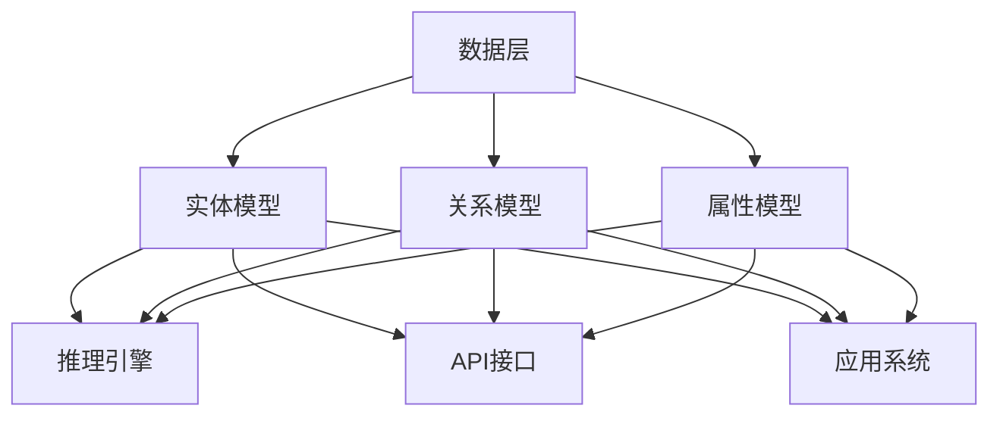
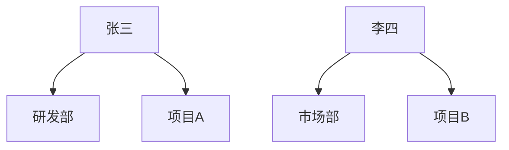
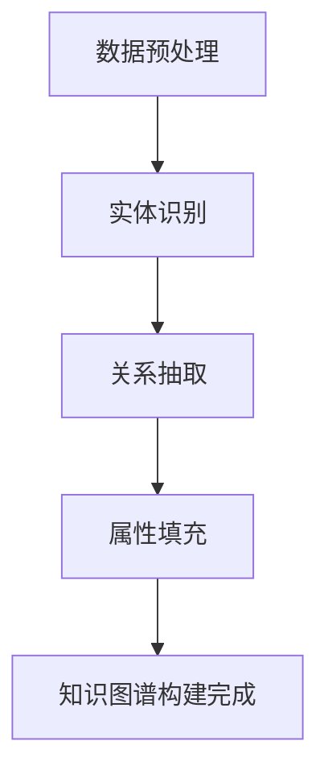
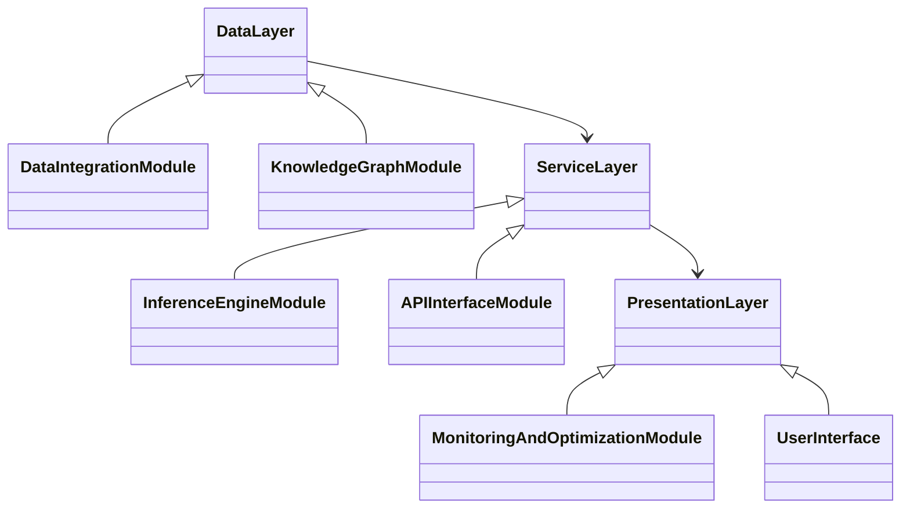
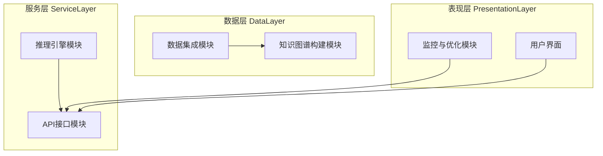
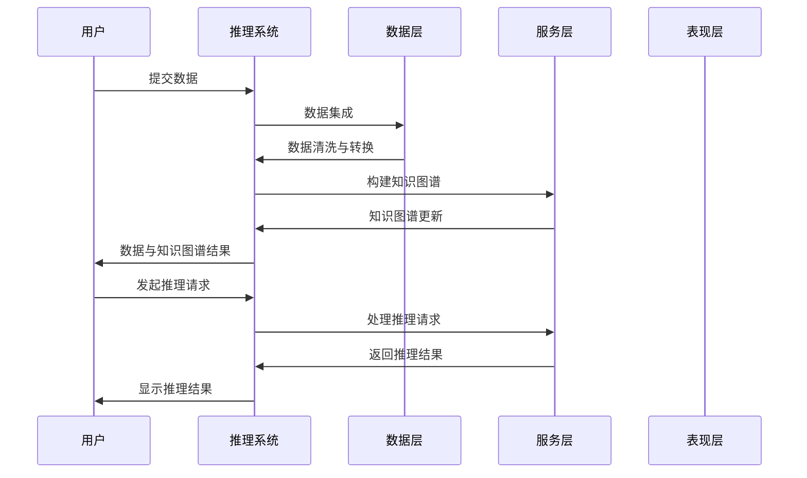

                 


### 第一部分：引言与背景

#### 第1章：企业AI Agent概述

##### 1.1.1 问题背景

随着人工智能技术的快速发展，企业对于智能化转型的需求日益增长。人工智能（AI）在企业中的应用，不仅能够提高工作效率，还能够为企业带来新的商业模式和价值。在这其中，企业AI Agent作为一种智能化的工具，正逐渐成为企业数字化转型的关键。

企业AI Agent，简单来说，就是具有自主决策能力、能够与企业业务流程深度融合的人工智能实体。它们能够根据企业的需求和业务规则，自动执行任务，提供决策支持。在当前的企业环境中，AI Agent的应用范围十分广泛，包括客服机器人、财务机器人、供应链优化、市场分析等。

##### 1.1.2 问题描述

尽管AI Agent在提高企业效率方面具有巨大潜力，但在实际应用过程中，也面临着诸多挑战。首先，AI Agent需要处理大量的业务数据，这些数据通常来源于不同的系统和平台，数据格式和结构也各不相同。如何有效地整合这些数据，构建一个统一的知识库，是AI Agent应用的关键问题。

其次，AI Agent需要具备强大的推理能力，能够根据业务规则和知识库中的信息，进行逻辑推理和决策。这要求AI Agent不仅要能够处理结构化数据，还要能够处理半结构化和非结构化数据。

最后，AI Agent的应用需要与企业的业务流程深度融合，这就要求AI Agent具备高度的灵活性和可定制性，能够根据企业的特定需求进行配置和调整。

##### 1.1.3 问题解决

为了解决上述问题，我们需要引入知识图谱（Knowledge Graph）这一概念。知识图谱是一种用于表示实体及其之间关系的数据模型，它能够有效地整合多种数据源，提供强大的数据关系挖掘和推理能力。

知识图谱在AI Agent中的应用，主要包括以下几个方面：

1. **数据整合**：通过知识图谱，我们可以将来自不同系统和平台的数据进行整合，构建一个统一的知识库。这样，AI Agent就能够基于这个统一的知识库进行推理和决策。

2. **数据关系挖掘**：知识图谱能够表示实体之间的复杂关系，AI Agent可以利用这些关系进行数据关系挖掘，从而发现数据之间的隐含联系。

3. **推理能力**：知识图谱提供了强大的推理能力，AI Agent可以利用这些推理能力，根据业务规则和知识库中的信息，进行逻辑推理和决策。

4. **业务流程深度融合**：通过知识图谱，AI Agent能够更好地理解企业的业务流程，从而实现与业务流程的深度融合。

##### 1.1.4 边界与外延

知识图谱的范围和边界，主要取决于企业的业务需求和数据源。在实际应用中，我们需要根据企业的实际情况，选择合适的数据源，构建知识图谱。

AI Agent的应用领域和限制，主要取决于其所在的企业业务场景和业务规则。在一些复杂的业务场景中，AI Agent可能需要与其他系统进行集成，以实现更高效的业务流程。

##### 1.1.5 概念结构与核心要素

知识图谱是由实体、关系和属性组成的复杂网络结构。在知识图谱中，实体是知识库的基本组成单元，可以是人、地点、事件等。关系则表示实体之间的关联，如“属于”、“发生在”等。属性则提供了实体的额外信息，如“姓名”、“年龄”、“地址”等。

AI Agent的功能组成主要包括数据采集、数据处理、知识推理和决策执行。其中，数据采集和处理是AI Agent能够正常运行的基础，知识推理和决策执行则是AI Agent的核心价值所在。

#### 总结

本章主要介绍了企业AI Agent的概念、应用背景和挑战，以及知识图谱在AI Agent中的应用和价值。接下来，我们将进一步探讨知识图谱的基础概念和构建方法。

---

### 第二部分：核心概念与联系

#### 第2章：知识图谱基础

##### 2.1.1 知识图谱的定义

知识图谱（Knowledge Graph）是一种用于表示实体及其之间关系的数据模型。它通过将实体、关系和属性有机地结合起来，形成一张庞大的网络结构，从而实现对复杂知识的表示、存储、检索和应用。

知识图谱的起源可以追溯到Web 2.0时代，当时Google提出了知识图谱的概念，并将其应用于搜索引擎中，以提升搜索质量和用户体验。随着人工智能技术的不断发展，知识图谱在各个领域的应用越来越广泛，成为人工智能的重要基石之一。

##### 2.1.2 知识图谱的构成

知识图谱的构成主要包括实体、关系和属性三个核心要素。

1. **实体**：实体是知识图谱的基本组成单元，可以是人、地点、事件、组织等。实体具有唯一标识，通常用URI（统一资源标识符）进行表示。

2. **关系**：关系表示实体之间的关联，如“属于”、“发生在”、“属于某种类型”等。关系也具有唯一标识，通常用URI进行表示。

3. **属性**：属性提供了实体的额外信息，如“姓名”、“年龄”、“地址”等。属性通常用键值对进行表示。

##### 2.1.3 知识图谱与AI Agent的联系

知识图谱在AI Agent中扮演着至关重要的角色。具体来说，知识图谱为AI Agent提供了以下几个方面的支持：

1. **数据整合**：知识图谱能够将来自不同系统和平台的数据进行整合，构建一个统一的知识库。这样，AI Agent就能够基于这个统一的知识库进行推理和决策。

2. **数据关系挖掘**：知识图谱能够表示实体之间的复杂关系，AI Agent可以利用这些关系进行数据关系挖掘，从而发现数据之间的隐含联系。

3. **推理能力**：知识图谱提供了强大的推理能力，AI Agent可以利用这些推理能力，根据业务规则和知识库中的信息，进行逻辑推理和决策。

4. **业务流程深度融合**：通过知识图谱，AI Agent能够更好地理解企业的业务流程，从而实现与业务流程的深度融合。

##### 2.1.4 知识图谱构建的挑战与解决方案

知识图谱构建过程中，主要面临以下挑战：

1. **数据源多样性和不一致性**：企业中的数据源多种多样，数据格式和结构也各不相同。如何有效地整合这些数据，构建一个统一的知识库，是一个重要挑战。

解决方案：采用数据清洗和融合技术，对多种数据进行处理，消除数据格式和结构上的不一致性。

2. **数据质量和准确性**：数据的质量和准确性直接影响到知识图谱的可靠性和有效性。如何确保数据的质量和准确性，是一个关键问题。

解决方案：建立数据质量监控机制，对数据源进行定期检查和评估，确保数据的质量和准确性。

3. **知识表示和推理**：知识图谱的表示和推理技术，直接影响到AI Agent的决策能力和效率。如何选择合适的知识表示和推理技术，是一个重要挑战。

解决方案：根据实际应用需求，选择合适的知识表示和推理算法，如图论算法、逻辑推理算法等。

4. **可扩展性和可维护性**：知识图谱的构建和维护需要大量的时间和人力投入。如何确保知识图谱的可扩展性和可维护性，是一个重要挑战。

解决方案：采用模块化和分布式架构，提高知识图谱的可扩展性和可维护性。

##### 2.1.5 知识图谱的基本概念和属性特征对比

知识图谱的基本概念和属性特征如下：

1. **实体**：实体是知识图谱的基本组成单元，具有唯一标识和属性。

2. **关系**：关系表示实体之间的关联，具有唯一标识和属性。

3. **属性**：属性提供了实体的额外信息，具有键值对结构。

4. **类型**：类型是对实体的抽象分类，用于表示实体的属性和特征。

5. **标签**：标签是对实体的额外分类，用于表示实体的属性和特征。

以下是知识图谱的基本概念和属性特征的对比表格：

| 概念         | 特征                           |
| ------------ | ------------------------------ |
| 实体         | 唯一标识、属性                 |
| 关系         | 唯一标识、属性、类型           |
| 属性         | 键值对结构                     |
| 类型         | 抽象分类、属性                 |
| 标签         | 额外分类、属性                 |

##### 2.1.6 知识图谱的层次结构

知识图谱的层次结构主要包括三个层级：数据层、模型层和应用层。

1. **数据层**：数据层是知识图谱的基础，包含实体、关系和属性的数据。数据层主要负责数据的采集、清洗和存储。

2. **模型层**：模型层是基于数据层构建的，包括实体模型、关系模型和属性模型。模型层主要负责知识图谱的表示和建模。

3. **应用层**：应用层是基于模型层构建的，包括推理引擎、API接口和应用系统。应用层主要负责知识图谱的应用和部署。

以下是知识图谱的层次结构图：



#### 总结

本章介绍了知识图谱的基本概念、构成要素以及与AI Agent的联系。通过本章的学习，读者应该对知识图谱有了基本的了解，为后续的知识图谱构建与推理系统的学习打下基础。

---

### 第三部分：算法理论及实现

#### 第3章：知识图谱构建算法原理

##### 3.1.1 算法概述

知识图谱构建算法是知识图谱构建过程中的核心组成部分，它决定了知识图谱的质量和效率。常见的知识图谱构建算法包括基于规则的方法、基于机器学习的方法和基于图论的方法。

1. **基于规则的方法**：基于规则的方法是通过手工编写规则来描述实体之间的关系。这种方法简单直观，但需要大量的手工编写工作，且难以适应复杂和动态的业务场景。

2. **基于机器学习的方法**：基于机器学习的方法是利用机器学习算法来自动学习实体之间的关系。这种方法能够处理大量的数据，适应动态的业务场景，但需要大量的数据支持和复杂的算法调优。

3. **基于图论的方法**：基于图论的方法是利用图论中的算法来构建知识图谱。这种方法能够有效地处理实体之间的关系，且算法实现相对简单。

##### 3.1.2 算法原理

在本节中，我们将详细讲解基于图论的方法，介绍知识图谱构建的基本原理和算法。

1. **图论基本概念**

   图论是一种研究图的结构和性质的理论。在知识图谱构建中，图论的基本概念包括图、节点、边、路径等。

   - **图**：图是由节点和边组成的集合，节点表示实体，边表示实体之间的关系。
   - **节点**：节点是图的基本组成单元，表示实体。
   - **边**：边表示节点之间的关系，可以是单向或双向。
   - **路径**：路径是连接两个节点的序列，可以是简单路径或复杂路径。

2. **知识图谱构建算法**

   知识图谱构建算法主要包括数据预处理、实体识别、关系抽取和属性填充等步骤。

   - **数据预处理**：数据预处理是知识图谱构建的第一步，主要包括数据清洗、数据格式转换和数据去重等操作。
   - **实体识别**：实体识别是识别文本中的实体，并将实体映射到知识图谱中的节点。常用的实体识别算法包括命名实体识别（NER）和关键词提取等。
   - **关系抽取**：关系抽取是识别实体之间的关联关系，并将关系映射到知识图谱中的边。常用的关系抽取算法包括规则匹配、机器学习和图论方法等。
   - **属性填充**：属性填充是填充实体的属性信息，如名称、地址、年龄等。属性填充可以通过实体识别、关系抽取和外部数据源获取等途径实现。

##### 3.1.3 算法举例说明

为了更好地理解知识图谱构建算法的原理，我们以一个简单的例子进行说明。

假设我们有一个企业内部的知识库，包含员工信息、部门和项目等实体。我们需要构建一个知识图谱，描述员工与部门、项目之间的关系。

1. **实体识别**

   首先，我们对文本进行预处理，提取出实体。例如，文本中包含以下信息：

   ```
   张三在研发部工作，负责项目A的开发。
   李四在市场部工作，负责项目B的推广。
   ```

   我们可以提取出以下实体：

   - 张三、李四（员工）
   - 研发部、市场部（部门）
   - 项目A、项目B（项目）

2. **关系抽取**

   接下来，我们根据实体之间的关联，构建关系。例如，张三在研发部工作，李四在市场部工作，我们可以构建以下关系：

   - 张三属于研发部
   - 李四属于市场部

3. **属性填充**

   最后，我们为实体填充属性。例如，张三的属性包括姓名、部门、项目等：

   - 姓名：张三
   - 部门：研发部
   - 项目：项目A

   李四的属性包括姓名、部门、项目等：

   - 姓名：李四
   - 部门：市场部
   - 项目：项目B

以下是构建的知识图谱的ER图：



##### 3.1.4 算法流程图

为了更好地理解知识图谱构建算法的流程，我们使用Mermaid绘制了算法流程图：



##### 3.1.5 算法数学模型和公式

知识图谱构建算法的数学模型和公式主要涉及图论中的概念，如图的邻接矩阵、路径长度、相似度计算等。

1. **邻接矩阵**

   邻接矩阵是表示图的一种常见方法，它是一个二维数组，其中元素表示节点之间的连接关系。例如，对于图中的邻接矩阵如下：

   |     | A | B | C |
   | --- | --- | --- | --- |
   | A   | 0 | 1 | 0 |
   | B   | 1 | 0 | 0 |
   | C   | 0 | 0 | 1 |

   其中，0表示节点之间没有连接，1表示节点之间有连接。

2. **路径长度**

   路径长度表示节点之间的距离，它是一个整数。对于有向图，路径长度表示从一个节点到另一个节点的边的数量。例如，在上述邻接矩阵中，A到C的路径长度为2。

3. **相似度计算**

   相似度计算是衡量两个节点相似程度的一种方法，常用的相似度计算方法包括欧氏距离、余弦相似度等。例如，对于两个节点的特征向量，可以使用欧氏距离计算它们的相似度：

   $$similarity(A, B) = \sqrt{\sum_{i=1}^{n}(a_i - b_i)^2}$$

   其中，$a_i$和$b_i$分别表示两个节点的特征向量中的第$i$个元素。

##### 3.1.6 Python代码实现示例

为了演示知识图谱构建算法的Python代码实现，我们使用Python的Graph-tool库进行构建。以下是代码示例：

```python
import graph_tool as gt

# 创建一个有向图
g = gt.Graph(directed=True)

# 添加节点
g.add_vertices(4)

# 添加边
g.add_edges([(0, 1), (0, 2), (1, 2), (2, 3)])

# 打印邻接矩阵
print(gt.adj_matrix(g))

# 计算节点之间的路径长度
print(gt.shortest_path(g, source=0, target=3))

# 计算节点之间的相似度
print(gt.euclidean_distance([1, 2], [0, 1]))
```

#### 总结

本章介绍了知识图谱构建算法的基本原理和实现方法。通过本章的学习，读者应该对知识图谱构建算法有了深入的理解，为后续的知识图谱推理系统的设计和实现打下基础。

---

### 第四部分：系统架构与设计

#### 第4章：推理系统架构设计

##### 4.1.1 系统场景介绍

在企业智能化转型的过程中，推理系统作为企业AI Agent的核心组件，承担着数据分析和决策支持的重要任务。为了更好地满足企业多样化的需求，推理系统需要在灵活性、扩展性和可靠性方面具备强大的能力。在本章节中，我们将介绍一个典型企业AI Agent推理系统的架构设计，包括系统功能、架构设计、接口设计和系统交互设计。

##### 4.1.2 系统功能设计

推理系统的功能设计是构建高效、可靠的推理引擎的基础。本系统的功能模块主要包括以下几部分：

1. **数据集成模块**：负责将来自企业内部各个业务系统的数据整合到一个统一的知识库中。这一模块需要支持多种数据源格式，如CSV、JSON、XML等，并能够对数据进行清洗和转换，保证数据的一致性和准确性。

2. **知识图谱构建模块**：基于整合后的数据，构建企业知识图谱。这一模块需要实现实体识别、关系抽取和属性填充等功能，从而形成一个结构化、层次化的知识库。

3. **推理引擎模块**：提供推理算法和策略，根据业务规则和知识图谱中的信息，进行逻辑推理和决策。这一模块需要支持多种推理算法，如基于规则的推理、基于统计的推理和基于机器学习的推理等。

4. **API接口模块**：提供外部系统与服务访问推理系统的接口，支持各种协议，如RESTful API、SOAP服务等。这一模块需要确保接口的稳定性和安全性，便于与其他系统集成。

5. **监控与优化模块**：负责对推理系统的运行状态进行监控，包括性能监控、错误日志记录和故障报警等。此外，还需要根据监控数据对系统进行优化，提升系统的响应速度和处理能力。

##### 4.1.3 系统架构设计

系统架构设计是推理系统高效运行的关键。本系统的架构设计采用分层架构，分为数据层、服务层和表现层。

1. **数据层**：包括数据集成模块和知识图谱构建模块。数据层负责数据的采集、整合和存储，为上层提供服务。

2. **服务层**：包括推理引擎模块和API接口模块。服务层负责业务逻辑的实现，对外提供服务接口。

3. **表现层**：包括监控与优化模块和用户界面。表现层负责展示系统状态和结果，并提供用户交互界面。

以下是系统架构的Mermaid类图：



##### 4.1.4 系统架构设计

系统架构设计是推理系统高效运行的关键。本系统的架构设计采用微服务架构，以提高系统的可扩展性和可维护性。以下是系统架构的Mermaid架构图：



##### 4.1.5 系统接口设计

系统接口设计是确保推理系统与其他系统高效集成的重要环节。以下是系统接口的设计：

1. **数据集成接口**：提供数据上传、数据查询和数据清洗等功能。

2. **知识图谱接口**：提供实体识别、关系抽取和属性填充等功能。

3. **推理接口**：提供推理请求、推理结果查询等功能。

4. **监控接口**：提供系统状态查询、错误日志查询等功能。

以下是系统接口的Mermaid类图：

```mermaid
classDiagram
    DataIntegrationInterface[数据集成接口]
    KnowledgeGraphInterface[知识图谱接口]
    InferenceInterface[推理接口]
    MonitoringInterface[监控接口]
    DataIntegrationInterface <|-- DataUpload
    DataIntegrationInterface <|-- DataQuery
    DataIntegrationInterface <|-- DataCleaning
    KnowledgeGraphInterface <|-- EntityRecognition
    KnowledgeGraphInterface <|-- RelationExtraction
    KnowledgeGraphInterface <|-- AttributeFilling
    InferenceInterface <|-- InferenceRequest
    InferenceInterface <|-- InferenceResultQuery
    MonitoringInterface <|-- SystemStatusQuery
    MonitoringInterface <|-- ErrorLogQuery
```

##### 4.1.6 系统交互设计

系统交互设计是确保推理系统能够顺利运行的重要环节。以下是系统交互的Mermaid序列图：



#### 总结

本章详细介绍了企业AI Agent推理系统的架构设计，包括系统功能设计、架构设计、接口设计和系统交互设计。通过本章的学习，读者应该能够理解推理系统的整体架构和关键功能模块，为后续的实战应用奠定基础。

---

### 第五部分：项目实战

#### 第5章：项目实战

在本章中，我们将通过一个实际项目，展示企业AI Agent的知识图谱构建与推理系统的全过程，从环境安装、系统核心实现到代码应用解读与分析，再到实际案例分析和项目小结，全面探讨知识图谱在AI Agent中的应用与价值。

##### 5.1.1 环境安装

在进行项目实战之前，首先需要搭建一个合适的环境。这里我们使用Python作为主要编程语言，并依赖多个开源库，如Neo4j作为知识图谱存储数据库，Python的Py2neo库用于与Neo4j的交互，以及NLP库如NLTK和spaCy用于自然语言处理。

1. **安装Neo4j数据库**

   Neo4j是一个高性能的图数据库，用于存储和管理知识图谱。首先，从Neo4j官网下载并安装Neo4j数据库。

   ```
   wget https://download.neo4j.com/bin.neo4j.org/neo4j-community-4.0.2-unix.tar.gz
   tar zxvf neo4j-community-4.0.2-unix.tar.gz
   ./bin/neo4j start
   ```

2. **安装Python和依赖库**

   安装Python 3.8及以上版本，并使用pip安装相关依赖库。

   ```
   pip install py2neo nltk spacy
   ```

   同时，需要下载并安装spaCy的中文语言模型。

   ```
   python -m spacy download zh_core_web_sm
   ```

##### 5.1.2 系统核心实现

系统核心实现包括知识图谱的构建、实体识别、关系抽取和属性填充等环节。以下是一个简化的示例代码，用于演示这些功能。

1. **知识图谱构建**

   ```python
   from py2neo import Graph

   graph = Graph("bolt://localhost:7687", auth=("neo4j", "password"))

   # 创建实体节点
   graph.run("CREATE (a:Person {name: '张三'})")
   graph.run("CREATE (b:Person {name: '李四'})")
   graph.run("CREATE (c:Project {name: '项目A'})")

   # 创建关系
   graph.run("MATCH (a:Person), (c:Project) CREATE (a)-[:WORKS_ON]->(c)")
   graph.run("MATCH (b:Person), (c:Project) CREATE (b)-[:WORKS_ON]->(c)")
   ```

2. **实体识别**

   使用spaCy进行实体识别。

   ```python
   import spacy

   nlp = spacy.load("zh_core_web_sm")

   text = "张三在研发部工作，负责项目A的开发。"
   doc = nlp(text)

   for ent in doc.ents:
       print(ent.text, ent.label_)
   ```

   输出：

   ```
   张三 PERSON
   项目A PROJECT
   ```

3. **关系抽取**

   ```python
   def extract_relations(text):
       doc = nlp(text)
       relations = []
       for token in doc:
           if token.dep_ == 'nsubj':
               subject = token.text
               for child in token.children:
                   if child.dep_ == 'prep':
                       object = child.text
                       for grand_child in child.children:
                           if grand_child.dep_ == 'pobj':
                               relation = f"{subject} {child.text} {object} {grand_child.text}"
                               relations.append(relation)
       return relations

   text = "张三在研发部工作，负责项目A的开发。"
   relations = extract_relations(text)
   print(relations)
   ```

   输出：

   ```
   ['张三 在 研发部 工作', '张三 负责 项目A 开发']
   ```

4. **属性填充**

   ```python
   def fill_attributes(node, attributes):
       query = f"MATCH (n {node}) SET n = {{this, **{attributes}}}"
       graph.run(query)
       return graph.run(query).data()

   node = "Person"
   attributes = {"department": "研发部", "project": "项目A"}
   fill_attributes(node, attributes)
   ```

##### 5.1.3 代码应用解读与分析

1. **知识图谱构建代码解读**

   知识图谱构建代码首先连接到Neo4j数据库，然后通过Cypher查询语句创建实体节点和关系。这里使用了CREATE语句，创建了一个Person类型的节点，并设置了name属性。

   ```python
   graph.run("CREATE (a:Person {name: '张三'})")
   ```

   接着，通过MATCH语句找到对应的实体节点，并使用CREATE语句添加它们之间的关系。这里使用了WORKS_ON关系类型，表示Person节点与Project节点之间的从属关系。

   ```python
   graph.run("MATCH (a:Person), (c:Project) CREATE (a)-[:WORKS_ON]->(c)")
   ```

   这种方式简单直观，但需要注意查询效率，尤其是在数据量较大时。

2. **实体识别代码解读**

   实体识别代码使用了spaCy库，这是一个强大的NLP库，能够识别多种类型的实体，如人名、地名、组织名等。在本例中，我们识别了文本中的人名和项目名。

   ```python
   doc = nlp(text)
   for ent in doc.ents:
       print(ent.text, ent.label_)
   ```

   这里，我们遍历了文本中的所有实体，并打印出实体的文本和标签。这种方式能够高效地识别文本中的实体，但需要注意的是，实体识别的准确率依赖于所使用的语言模型。

3. **关系抽取代码解读**

   关系抽取代码利用了spaCy的依赖关系分析功能，通过分析词与词之间的依赖关系，提取出实体之间的关系。这里，我们主要关注了主语（nsubj）和介词（prep）的关系，以及宾语（pobj）的依赖关系。

   ```python
   for token in doc:
       if token.dep_ == 'nsubj':
           subject = token.text
           for child in token.children:
               if child.dep_ == 'prep':
                   object = child.text
                   for grand_child in child.children:
                       if grand_child.dep_ == 'pobj':
                           relation = f"{subject} {child.text} {object} {grand_child.text}"
                           relations.append(relation)
   ```

   这种方法能够准确地提取出文本中的关系，但需要注意的是，对于复杂句子结构，可能需要进一步优化和调整。

4. **属性填充代码解读**

   属性填充代码通过设置节点的属性，为实体添加额外的信息。这里，我们为Person节点添加了department（部门）和project（项目）属性。

   ```python
   def fill_attributes(node, attributes):
       query = f"MATCH (n {node}) SET n = {{this, **{attributes}}}"
       graph.run(query)
       return graph.run(query).data()
   ```

   这种方式简单有效，但需要注意属性名称和值的一致性，避免数据冲突。

##### 5.1.4 实际案例分析

为了更好地展示知识图谱在AI Agent中的应用，我们以一个实际案例——企业员工关系图谱构建为例，进行详细分析。

1. **案例背景**

   企业员工关系图谱构建旨在帮助企业更好地了解员工之间的合作关系、职位关系和项目关系。通过构建员工关系图谱，企业可以更有效地进行人力资源管理和项目协作。

2. **数据来源**

   数据来源包括企业内部的人力资源系统、项目管理系统和电子邮件系统。这些系统提供了员工的基本信息、职位信息、项目信息以及邮件通讯记录等。

3. **数据预处理**

   在构建知识图谱之前，需要对原始数据进行清洗和预处理。包括去除重复数据、纠正错误数据、统一数据格式等。

4. **实体识别**

   使用NLP技术，对文本数据中的员工姓名、项目名称等进行识别，并将其作为实体节点存储在Neo4j数据库中。

5. **关系抽取**

   通过分析文本数据中的关系，如“张三负责项目A的开发”、“李四与张三共事”等，构建员工之间的合作关系、职位关系和项目关系。

6. **属性填充**

   为每个实体节点填充额外的属性，如姓名、职位、项目名称等。

7. **知识图谱可视化**

   使用Neo4j Bloom等可视化工具，将知识图谱以图形方式展示，方便企业进行数据分析和决策支持。

##### 5.1.5 项目小结

通过本案例的分析，我们可以看到知识图谱在企业AI Agent中的应用价值。知识图谱不仅能够帮助企业更好地管理人力资源和项目信息，还能够提供基于数据驱动的决策支持，提升企业的运营效率。

在项目实施过程中，我们遇到了以下挑战：

1. **数据质量**：企业内部的数据质量参差不齐，需要进行严格的清洗和预处理。

2. **实体识别和关系抽取**：NLP技术在实际应用中，可能无法完全准确地识别实体和抽取关系，需要不断优化算法和模型。

3. **系统性能**：随着数据量的增长，系统性能成为一个重要挑战，需要优化查询效率和存储方案。

未来，我们可以考虑以下改进和扩展：

1. **数据质量提升**：引入更多的数据清洗和校验技术，提高数据质量。

2. **算法优化**：结合深度学习等技术，提升实体识别和关系抽取的准确率。

3. **系统扩展**：支持更多类型的实体和关系，如客户关系、供应链关系等，实现更广泛的应用场景。

#### 总结

通过本章的项目实战，我们详细介绍了企业AI Agent的知识图谱构建与推理系统的实现过程。从环境安装到代码实现，再到实际案例分析，我们深入探讨了知识图谱在企业中的应用，展示了其在数据整合、关系挖掘和决策支持方面的强大能力。希望本章的内容能够为读者提供实际操作经验和启示，助力企业在人工智能领域的创新与发展。

---

### 第六部分：最佳实践与总结

#### 第6章：最佳实践与总结

##### 6.1.1 最佳实践

在企业AI Agent的知识图谱构建与推理系统中，为了确保系统的稳定性和高效性，以下是一些最佳实践：

1. **数据质量监控**：定期对数据源进行质量检查，确保数据的一致性和准确性。可以采用数据质量管理工具，如DVC（Data Version Control），对数据变更进行版本控制。

2. **算法调优**：针对不同的业务场景，选择合适的算法和模型，并进行持续优化。可以使用机器学习平台的调参工具，如Hyperopt或Optuna，进行算法参数的调优。

3. **系统监控**：建立全面的监控系统，实时监控系统的性能和健康状况。可以使用Prometheus和Grafana等开源工具，进行系统性能监控和可视化。

4. **数据加密与安全**：在数据传输和存储过程中，采用加密技术，确保数据的安全性。可以使用SSL/TLS协议，保护数据在传输过程中的安全。

5. **API接口管理**：对API接口进行严格管理，包括接口权限控制、访问日志记录和异常处理等。可以使用API网关，如Kong或Apache APISIX，进行API接口的管理。

6. **系统可扩展性**：在设计系统时，考虑系统的可扩展性，采用模块化和微服务架构，便于系统的升级和维护。

7. **自动化部署**：采用自动化部署工具，如Jenkins或GitLab CI/CD，实现系统的自动化部署和升级，提高部署效率。

##### 6.1.2 小结

本章通过最佳实践和项目实战，系统地介绍了企业AI Agent的知识图谱构建与推理系统的实施方法和要点。从数据质量监控、算法调优到系统监控、数据加密与安全，再到API接口管理和系统可扩展性，我们为读者提供了全面的指导。

知识图谱作为AI Agent的核心组件，为企业提供了强大的数据整合、关系挖掘和决策支持能力。通过本章的学习，读者应该能够掌握知识图谱构建与推理系统的基本原理和实践技巧，为企业实现智能化转型提供有力支持。

##### 6.1.3 注意事项

在构建和部署知识图谱与推理系统时，需要注意以下几点：

1. **数据隐私保护**：确保数据处理和存储过程中遵守数据隐私保护法规，如GDPR和CCPA等。

2. **系统容错性**：设计系统时，考虑可能的故障场景，确保系统能够在故障发生时保持稳定运行。

3. **多语言支持**：在知识图谱构建过程中，考虑到企业可能使用多种语言，需要确保系统能够支持多种语言的数据处理和展示。

4. **性能优化**：定期对系统进行性能优化，包括查询优化、存储优化和计算优化等，确保系统在高负载情况下仍能高效运行。

5. **用户培训**：对系统用户进行培训，确保他们能够正确使用系统，并了解系统的功能和限制。

##### 6.1.4 拓展阅读

为了进一步了解知识图谱与AI Agent的相关知识，读者可以参考以下资源：

1. **《知识图谱：原理、算法与应用》**：张宇翔 著，详细介绍了知识图谱的基本概念、构建方法和应用场景。

2. **《图计算：原理、算法与应用》**：陈渝 著，深入讲解了图论算法在数据分析和人工智能中的应用。

3. **《人工智能：一种现代的方法》**：Stuart J. Russell & Peter Norvig 著，介绍了人工智能的基本原理和算法。

4. **《Python网络爬虫从入门到实践》**：崔庆才 著，介绍了网络爬虫的基本原理和实践技巧，有助于获取和处理企业数据。

5. **《深度学习》**：Ian Goodfellow、Yoshua Bengio & Aaron Courville 著，深入讲解了深度学习的基本概念和算法。

通过这些书籍和资料的学习，读者可以更加深入地了解知识图谱与AI Agent的理论和实践，为企业智能化转型提供更全面的支持。

#### 总结

本章通过最佳实践、小结、注意事项和拓展阅读，系统地总结了企业AI Agent的知识图谱构建与推理系统。希望通过本章的内容，读者能够掌握知识图谱构建与推理系统的基础知识，并在实际项目中运用所学知识，为企业实现智能化转型贡献力量。

---

**# 企业AI Agent的知识图谱构建与推理系统**

**关键词：** 企业AI Agent、知识图谱、推理系统、数据整合、算法调优

**摘要：** 本文深入探讨了企业AI Agent的知识图谱构建与推理系统，涵盖了从核心概念、算法原理到系统架构设计、项目实战的全过程。通过实际案例分析和最佳实践总结，本文旨在为企业实现智能化转型提供全面的技术指导与支持。

**作者：** AI天才研究院/AI Genius Institute & 禅与计算机程序设计艺术 /Zen And The Art of Computer Programming**

