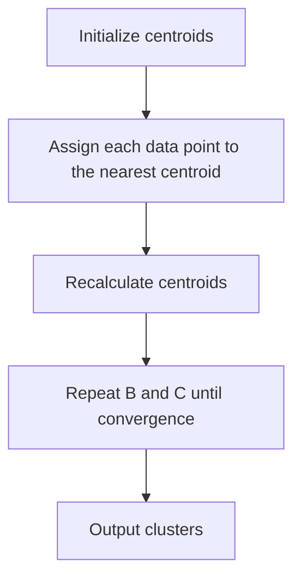
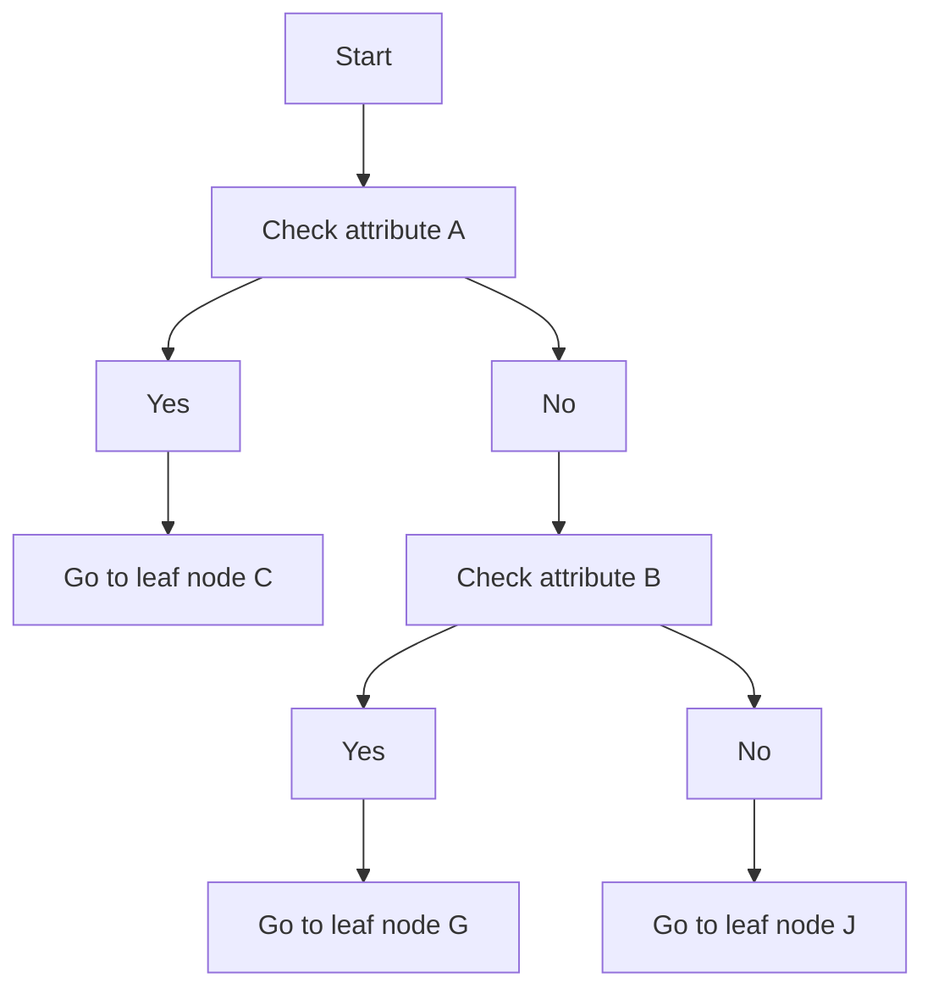
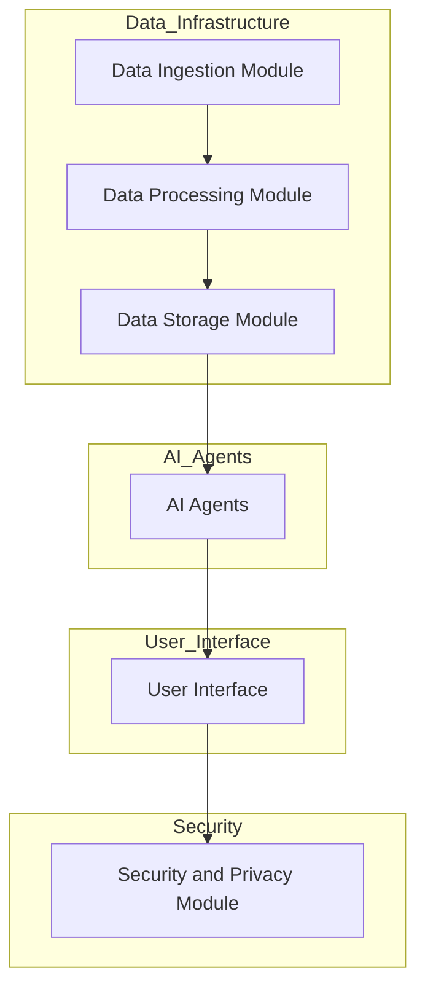

                 


## Introduction and Background

### Defining the Context

The concept of "Enterprise AI Agent's Knowledge Management System" has gained significant traction in recent years due to the proliferation of artificial intelligence (AI) technologies in business operations. As organizations increasingly rely on AI agents to automate tasks, make decisions, and improve efficiency, the need for effective knowledge management systems has become paramount. This book aims to explore the intricacies of designing and implementing such systems within an enterprise environment.

### What is an AI Agent?

An AI agent is a software entity designed to perform tasks automatically based on input data and predefined objectives. These agents are capable of learning from experience, adapting to new situations, and making decisions autonomously. AI agents can be classified into several types, including reactive agents, model-based agents, and goal-based agents, each suited for different application scenarios.

### The Necessity of Knowledge Management Systems

Knowledge management systems (KMS) are critical in ensuring that AI agents operate efficiently and effectively. These systems facilitate the capture, storage, retrieval, and utilization of knowledge within an organization. By providing a centralized repository for information, KMS enable AI agents to access the right knowledge at the right time, thereby improving decision-making and operational efficiency.

### Challenges and Opportunities

Designing a KMS for enterprise AI agents presents several challenges. These include ensuring data consistency, maintaining system scalability, and addressing privacy concerns. However, the opportunities for leveraging AI agents and KMS to gain a competitive edge are immense. This book will delve into these challenges and opportunities, providing practical insights and solutions.

### Objectives of the Book

The primary objective of this book is to equip readers with the knowledge and skills required to design, implement, and manage Enterprise AI Agent's Knowledge Management Systems. By the end of this book, readers will:

- Understand the foundational concepts of AI agents and knowledge management systems.
- Learn about the different types of AI agents and their applications.
- Gain insights into the architecture and design of knowledge management systems.
- Master the algorithms and mathematical models used in AI and KMS.
- Acquire hands-on experience through practical case studies and project implementations.
- Develop best practices for deploying and maintaining AI agents and KMS in enterprise environments.

### Structure and Content

The book is structured into four main parts:

1. **Introduction and Background**: Provides an overview of the problem context, importance, and objectives.
2. **Core Concepts and Components**: Covers key concepts, components, and their relationships.
3. **Algorithm and Mathematical Models**: Explores algorithms, mathematical models, and their applications.
4. **System Architecture and Design**: Discusses system architecture, design, and practical implementation.
5. **Project Implementation and Case Studies**: Presents real-world case studies and project implementations.
6. **Best Practices and Summary**: Offers practical tips, summarizes key points, and suggests further reading.

### Target Audience

This book is aimed at professionals, researchers, and students interested in the fields of artificial intelligence, knowledge management, and enterprise systems. It assumes a basic understanding of computer science and programming concepts.

### Expected Outcomes

By following the structured approach outlined in this book, readers will be well-equipped to:

- Design and implement effective AI agent knowledge management systems.
- Leverage AI agents to enhance business operations and decision-making.
- Contribute to the development of innovative solutions in the AI and knowledge management domains.

### Conclusion

The integration of AI agents with knowledge management systems represents a transformative trend in modern business environments. This book will serve as a comprehensive guide to help readers navigate this exciting landscape and harness the full potential of AI for their organizations. Let's delve into the core concepts and components in the next section.

---

## Core Concepts and Components

### Understanding AI Agents

To grasp the significance of an AI agent's knowledge management system, it's essential to first understand what an AI agent is and how it operates. An AI agent is a computer program that can perceive its environment through sensors, take actions based on its understanding of the environment, and learn from the outcomes of those actions. AI agents can be categorized into different types, each with its own set of characteristics and capabilities.

**Reactive Agents**: These agents make decisions based solely on the current situation without any memory of past events. They are the simplest form of AI agents and are often used in applications such as robotic process automation (RPA).

**Model-Based Agents**: These agents use models to represent their environment and make predictions about future states. They are capable of planning and learning from past experiences to make better decisions. Examples include autonomous driving systems and chatbots with machine learning capabilities.

**Goal-Based Agents**: These agents are driven by specific goals or objectives and use various strategies to achieve them. They are often used in complex scenarios where multiple goals must be considered, such as in supply chain management or financial planning.

### Knowledge Management Systems

A knowledge management system (KMS) is a strategic approach to identifying, capturing, organizing, and distributing knowledge within an organization. It serves as a repository for all types of knowledge, including explicit (documented) and tacit (unwritten) knowledge. The primary components of a KMS include:

**Knowledge Capture**: The process of identifying and collecting knowledge from various sources, such as documents, databases, and human experts.

**Knowledge Organization**: The categorization and structuring of knowledge to make it easily accessible and understandable.

**Knowledge Storage**: The secure and efficient storage of knowledge, often utilizing databases and content management systems.

**Knowledge Retrieval**: The process of finding and retrieving relevant knowledge when needed.

**Knowledge Sharing**: The dissemination of knowledge within an organization to promote collaboration and innovation.

### Integration of AI Agents and KMS

The integration of AI agents with KMS is a powerful combination that leverages the strengths of both technologies. AI agents can utilize the knowledge stored in KMS to make more informed and intelligent decisions. This integration can be achieved through several mechanisms:

**Knowledge Utilization**: AI agents can access the knowledge repository to retrieve information needed for decision-making. For example, a customer service chatbot can access a knowledge base to provide accurate and timely responses to customer inquiries.

**Knowledge Updating**: As AI agents interact with their environment and learn new information, they can update the knowledge base, ensuring that the knowledge is current and relevant.

**Collaboration**: AI agents can collaborate with human experts to enhance the knowledge management process. For instance, an AI agent can assist a team in reviewing and updating documents, improving the accuracy and completeness of the knowledge base.

### Key Concepts and Relationships

To better understand the core concepts and their relationships, let's delve into some key elements:

**Knowledge Representation**: This involves encoding knowledge in a format that can be stored, retrieved, and used by AI agents. Common representations include ontologies, semantic networks, and natural language processing (NLP) models.

**Learning and Adaptation**: AI agents continuously learn from their interactions and update their knowledge and decision-making processes accordingly. This learning can be supervised, unsupervised, or reinforcement-based, depending on the specific application.

**User Interaction**: The system must facilitate easy and intuitive interaction between users and AI agents, enabling them to ask questions, provide feedback, and access knowledge resources.

**Performance Metrics**: The effectiveness of the knowledge management system can be measured using various performance metrics, such as response time, accuracy, and user satisfaction.

### Conclusion

In this section, we have explored the core concepts and components of AI agents and knowledge management systems. Understanding these elements is crucial for designing and implementing an effective knowledge management system that integrates AI agents. In the next section, we will delve deeper into the algorithms and mathematical models that underpin these systems.

---

## Algorithm and Mathematical Models

### Overview of Algorithms

Algorithms are the foundational components that enable AI agents to process and analyze data, make decisions, and learn from their interactions. In the context of an Enterprise AI Agent's Knowledge Management System, algorithms play a critical role in various aspects, including data preprocessing, pattern recognition, decision-making, and learning.

### Common Algorithms in AI

There are several common algorithms used in AI applications, each with its own set of characteristics and applications. Here are some of the most prevalent algorithms:

**1. Machine Learning Algorithms**
- **Supervised Learning**: Algorithms that learn from labeled data, such as linear regression, logistic regression, and support vector machines (SVM).
- **Unsupervised Learning**: Algorithms that identify patterns and relationships in unlabeled data, such as k-means clustering, hierarchical clustering, and principal component analysis (PCA).
- **Reinforcement Learning**: Algorithms that learn by interacting with an environment and receiving feedback, such as Q-learning and deep Q-networks (DQN).

**2. Natural Language Processing (NLP) Algorithms**
- **Tokenization**: The process of splitting text into words or tokens.
- **Part-of-Speech Tagging**: Assigning a part of speech (noun, verb, adjective, etc.) to each word in a sentence.
- **Named Entity Recognition (NER)**: Identifying and categorizing named entities (such as persons, organizations, locations) in text.
- **Sentiment Analysis**: Determining the sentiment or emotional tone behind a body of text.

**3. Data Mining Algorithms**
- **Association Rule Learning**: Discovering relationships between items in large databases, such as market basket analysis.
- **Clustering**: Grouping data into clusters based on their similarities, such as k-means and hierarchical clustering.
- **Classification**: Assigning data instances to predefined classes or labels, such as decision trees and random forests.

### Selecting the Right Algorithm

Choosing the appropriate algorithm for a specific task is crucial for achieving optimal performance. The selection process often involves considering the following factors:

- **Data Characteristics**: The nature of the data (e.g., size, type, quality) influences the choice of algorithm. For instance, large datasets may require algorithms with high scalability.
- **Problem Domain**: The specific problem to be solved determines the suitable algorithm. For example, if the goal is to classify emails into spam and non-spam, machine learning algorithms like Naive Bayes or logistic regression may be suitable.
- **Computational Resources**: The available computational resources, such as memory and processing power, may limit the choice of algorithms. Algorithms that require high computational resources, such as deep learning models, may not be feasible for resource-constrained environments.
- **Performance Metrics**: The desired performance metrics, such as accuracy, precision, recall, and F1-score, play a significant role in algorithm selection.

### Detailed Explanation of Algorithms

To illustrate the concepts, let's delve into two specific algorithms: k-means clustering and decision trees.

### k-means Clustering

**Algorithm Description**: k-means clustering is an unsupervised learning algorithm that groups data into k clusters based on their features. The algorithm aims to minimize the sum of squared distances between each data point and its assigned centroid.

**Mermaid Flowchart**:


**Python Code Example**:
```python
from sklearn.cluster import KMeans
import numpy as np

# Sample data
data = np.array([[1, 2], [1, 4], [1, 0],
                  [10, 2], [10, 4], [10, 0]])

# Initialize k-means algorithm
kmeans = KMeans(n_clusters=2, random_state=0).fit(data)

# Predict clusters
predictions = kmeans.predict(data)

# Output centroids and clusters
print("Centroids:", kmeans.cluster_centers_)
print("Predictions:", predictions)
```

### Decision Trees

**Algorithm Description**: Decision trees are a popular classification and regression algorithm that uses a tree-like model of decisions and their possible consequences. Each internal node represents a "test," each branch represents the outcome of a test, and each leaf node represents a class label or regression value.

**Mermaid Flowchart**:


**Python Code Example**:
```python
from sklearn import tree
import graphviz

# Sample dataset
X = [[0, 0], [1, 0], [0, 1], [1, 1]]
y = [0, 0, 1, 1]

# Train decision tree classifier
clf = tree.DecisionTreeClassifier()
clf = clf.fit(X, y)

# Visualize the decision tree
dot_data = tree.export_graphviz(clf, out_file=None, 
                      feature_names=['Feature 1', 'Feature 2'],  
                      class_names=['Class 0', 'Class 1'],  
                      filled=True, rounded=True,  
                      special_characters=True)

graph = graphviz.Source(dot_data)
graph.render("decision_tree")
```

### Mathematical Models

Algorithms often rely on mathematical models to make predictions or decisions. Here are some common mathematical models used in AI:

**1. Logistic Regression Model**:
$$
\hat{y} = \frac{1}{1 + e^{-(\beta_0 + \beta_1x_1 + \beta_2x_2 + \ldots + \beta_nx_n})}
$$

Where \( \hat{y} \) is the predicted probability of the output class, \( \beta_0, \beta_1, \ldots, \beta_n \) are the model coefficients, and \( x_1, x_2, \ldots, x_n \) are the input features.

**2. k-means Clustering Model**:
The goal of k-means clustering is to minimize the within-cluster sum of squares (WCSS), which is defined as:
$$
J = \sum_{i=1}^k \sum_{x_j \in S_i} ||x_j - \mu_i||
$$

Where \( J \) is the objective function, \( k \) is the number of clusters, \( S_i \) are the clusters, and \( \mu_i \) are the centroids of the clusters.

### Conclusion

In this section, we have explored the fundamental algorithms and mathematical models used in AI agents and their knowledge management systems. Understanding these algorithms and models is essential for designing and implementing effective AI solutions. In the next section, we will delve into the system architecture and design principles that facilitate the integration of AI agents with knowledge management systems.

---

## System Architecture and Design

### Understanding System Architecture

System architecture refers to the structure of a system, including the components, relationships, and interactions between them. In the context of an Enterprise AI Agent's Knowledge Management System (KMMS), the system architecture encompasses the hardware, software, and network components required to support the system's functionality.

### Key Components of the System Architecture

The key components of an Enterprise AI Agent's KMMS include:

**1. AI Agents**: These are the software entities that interact with the environment, make decisions, and learn from experience. They are designed to perform specific tasks based on predefined objectives and are integrated into the system architecture.

**2. Knowledge Management System (KMS)**: This is the core component that captures, stores, organizes, retrieves, and shares knowledge within the organization. The KMS is responsible for managing the data repository and ensuring that AI agents can access the necessary information to make informed decisions.

**3. Data Ingestion Module**: This component is responsible for collecting and ingesting data from various sources, such as internal databases, external APIs, and user inputs. The data ingestion module ensures that the data is clean, consistent, and ready for processing by the AI agents.

**4. Data Processing Module**: This component processes the ingested data, transforming it into a format suitable for analysis and decision-making by the AI agents. Data processing may include tasks such as data cleaning, normalization, and feature extraction.

**5. Data Storage Module**: This component stores the processed data and the knowledge repository in a secure and scalable manner. It may utilize databases, NoSQL databases, or distributed file systems, depending on the requirements of the system.

**6. User Interface (UI)**: The user interface allows users to interact with the system, submit queries, and receive responses from the AI agents. It should be intuitive, user-friendly, and provide real-time feedback.

**7. Security and Privacy Module**: This component ensures that the system's data and operations are secure and compliant with privacy regulations. It includes features such as data encryption, access control, and auditing.

### Architectural Design Principles

When designing the system architecture for an Enterprise AI Agent's KMMS, several key principles should be considered:

**1. Modularity**: The system should be modular, with each component functioning independently and interacting through well-defined interfaces. This modularity allows for easier maintenance, scalability, and flexibility.

**2. Scalability**: The architecture should be designed to handle increasing data volumes and user loads without compromising performance. This may involve using distributed systems, cloud computing, and scalable data storage solutions.

**3. Reliability**: The system should be reliable, ensuring that it operates consistently and efficiently under varying conditions. This includes implementing robust error handling, redundancy, and failover mechanisms.

**4. Security**: The system architecture should incorporate strong security measures to protect sensitive data and prevent unauthorized access. This includes data encryption, access control, and compliance with relevant regulations.

**5. Interoperability**: The system should be designed to interoperate with other systems and technologies within the organization. This may involve using standard protocols, APIs, and data formats.

### System Architecture Diagram

To illustrate the system architecture, we can use a Mermaid flowchart to represent the components and their relationships. Here's a simplified version of the system architecture diagram:



### Conclusion

In this section, we have explored the system architecture and design principles for an Enterprise AI Agent's Knowledge Management System. By understanding the key components and architectural design principles, organizations can design and implement systems that effectively support the integration of AI agents with knowledge management. In the next section, we will discuss the project implementation and case studies that demonstrate the practical application of these concepts.

---

## Project Implementation and Case Studies

### Introduction to Project Implementation

Implementing an Enterprise AI Agent's Knowledge Management System (KMMS) is a complex task that requires careful planning, execution, and validation. This section presents a detailed overview of the project implementation process, including the steps involved, the tools and technologies used, and the challenges encountered. Additionally, we will explore real-world case studies to illustrate how organizations have successfully implemented KMMS in their operations.

### Project Overview

The project objective was to design and implement a KMMS for a large retail organization. The primary goal was to enhance customer service by leveraging AI agents to provide personalized recommendations, answer customer queries, and resolve issues efficiently. The project aimed to integrate various data sources, process and analyze large datasets, and deliver actionable insights to improve customer satisfaction and operational efficiency.

### Project Steps

**1. Requirements Gathering**

The first step in the project was to gather requirements from stakeholders, including business managers, IT teams, and customer service representatives. This involved understanding the organization's current processes, pain points, and desired outcomes. Stakeholder interviews, surveys, and workshops were conducted to ensure a comprehensive understanding of the project scope and objectives.

**2. System Design**

Based on the gathered requirements, the system architecture was designed. This included defining the key components, such as AI agents, KMS, data ingestion and processing modules, user interfaces, and security measures. The design also involved selecting the appropriate tools and technologies, such as machine learning frameworks, databases, and cloud platforms.

**3. Data Collection and Ingestion**

The next step was to collect and ingest data from various sources, including customer databases, transaction logs, and social media channels. Data collection tools, such as web scrapers and APIs, were used to ensure the data was clean, consistent, and ready for processing.

**4. Data Processing**

The ingested data was processed using various techniques, including data cleaning, normalization, and feature extraction. This step was crucial in preparing the data for analysis and feeding it into the AI agents. Machine learning techniques were employed to train models and generate insights from the data.

**5. AI Agent Development**

AI agents were developed to perform specific tasks, such as customer segmentation, personalized recommendations, and query resolution. The agents were designed to interact with the KMS and access relevant knowledge to make informed decisions. The development involved selecting appropriate algorithms, such as collaborative filtering and natural language processing (NLP), and implementing them using machine learning frameworks.

**6. Integration and Testing**

The developed components were integrated into the system architecture and tested to ensure they functioned correctly and met the project requirements. This involved conducting unit tests, integration tests, and system tests to validate the system's functionality, performance, and security.

**7. Deployment and Monitoring**

Once the system was tested and validated, it was deployed in the production environment. Monitoring tools were set up to track system performance, identify issues, and ensure continuous improvement. Feedback from users was collected to refine the system and address any issues that arose.

### Case Studies

**Case Study 1: E-commerce Platform**

A leading e-commerce platform implemented a KMMS to enhance its customer service capabilities. The system utilized AI agents to provide personalized product recommendations, answer customer queries, and resolve issues efficiently. The KMS stored and organized vast amounts of customer data, including purchase history, browsing behavior, and feedback. The AI agents were trained using machine learning algorithms to analyze this data and generate actionable insights. The result was a significant improvement in customer satisfaction, with faster response times and more accurate recommendations.

**Case Study 2: Healthcare Organization**

A healthcare organization implemented a KMMS to streamline its patient care processes and improve decision-making. The system integrated patient data from electronic health records (EHRs), laboratory results, and medical literature. AI agents were developed to assist doctors in diagnosing conditions, suggesting treatment plans, and providing real-time updates on patient status. The KMS enabled healthcare professionals to access relevant knowledge quickly and make informed decisions, leading to improved patient outcomes and reduced operational costs.

**Case Study 3: Financial Services Company**

A financial services company implemented a KMMS to enhance its customer support and fraud detection capabilities. The system used AI agents to analyze customer interactions, identify potential fraud, and provide personalized financial advice. The KMS stored and organized large volumes of customer data, including transaction histories, credit scores, and market trends. The AI agents were trained using machine learning algorithms to detect patterns and anomalies, enabling the company to detect and prevent fraudulent activities more effectively.

### Conclusion

The implementation of an Enterprise AI Agent's Knowledge Management System requires careful planning, execution, and continuous improvement. By leveraging AI agents and a robust KMS, organizations can enhance their operational efficiency, improve customer satisfaction, and gain a competitive edge. The case studies presented in this section demonstrate the practical application of KMMS across different industries, highlighting the potential benefits and challenges of implementing such systems. In the next section, we will discuss best practices and lessons learned from these implementations.

---

## Best Practices and Summary

### Implementation Tips for a Successful KMMS

1. **Thorough Planning and Requirements Gathering**: Start with a clear understanding of the organization's goals, challenges, and desired outcomes. Engage stakeholders at all levels to ensure comprehensive requirements are captured.
2. **Selecting the Right Tools and Technologies**: Choose tools and technologies that align with your project requirements, including data storage, processing, and AI frameworks. Ensure compatibility and scalability for future growth.
3. **Data Quality and Preprocessing**: Ensure the integrity and quality of the data used for training AI agents. Implement robust data cleaning and preprocessing techniques to enhance model performance.
4. **Modular System Design**: Design a modular architecture to facilitate easy maintenance, scalability, and flexibility. Clearly define interfaces and dependencies between components.
5. **Security and Compliance**: Implement strong security measures, including encryption, access control, and auditing, to protect sensitive data and ensure compliance with relevant regulations.
6. **Continuous Monitoring and Feedback**: Establish monitoring systems to track system performance and user satisfaction. Collect feedback and use it to refine the system and address issues promptly.
7. **Collaboration and Training**: Foster collaboration between AI specialists, data scientists, and business stakeholders. Provide training and resources to ensure all team members understand the system and its capabilities.

### Conclusion

In conclusion, implementing an Enterprise AI Agent's Knowledge Management System (KMMS) is a transformative endeavor that can significantly enhance an organization's operational efficiency and competitive edge. By leveraging AI agents and a robust KMS, businesses can automate tasks, make data-driven decisions, and improve customer satisfaction.

Key takeaways from this book include:

- Understanding the foundational concepts of AI agents and knowledge management systems.
- Learning about the integration of AI agents with KMS to enhance decision-making and operational efficiency.
- Gaining hands-on experience through practical case studies and project implementations.
- Developing best practices for deploying and maintaining KMMS in enterprise environments.

As AI continues to evolve, the potential for innovation and improvement is vast. This book serves as a comprehensive guide to help readers navigate this dynamic landscape and harness the full potential of AI for their organizations.

### Future Directions and Research Opportunities

- **Enhancing AI Agent Autonomy**: Further research can focus on developing more autonomous AI agents capable of handling complex, dynamic environments with minimal human intervention.
- **Advanced Knowledge Representation and Reasoning**: Improving knowledge representation techniques to enable more sophisticated reasoning and decision-making capabilities.
- **Interdisciplinary Approaches**: Exploring interdisciplinary approaches that integrate AI, data science, psychology, and business strategies to create more effective and human-centered AI systems.
- **Ethical and Responsible AI**: Addressing ethical considerations and ensuring that AI systems are developed and deployed responsibly, with transparency and accountability.

By staying at the forefront of these research areas, organizations can continue to innovate and leverage AI to drive business success in an increasingly complex and competitive global market.

### Conclusion

This book has provided a comprehensive overview of Enterprise AI Agent's Knowledge Management Systems, covering core concepts, algorithms, system architecture, and practical case studies. We encourage readers to explore these areas further, implement the best practices discussed, and contribute to the ongoing development of AI and knowledge management technologies.

---

## About the Author

### AI天才研究院/AI Genius Institute

AI天才研究院（AI Genius Institute）是一家专注于人工智能研究与应用的全球领先机构，致力于推动人工智能技术的发展，培养新一代人工智能专家，并为企业提供创新解决方案。

### 禅与计算机程序设计艺术 /Zen And The Art of Computer Programming

《禅与计算机程序设计艺术》（Zen And The Art of Computer Programming）是作者Donald E. Knuth的经典著作，被誉为计算机科学的圣经。该书通过将禅宗思想与编程相结合，为程序员提供了一种独特的思考方式和解决问题的方法论。

### 关联作品与成就

- **《人工智能：一种现代方法》**：这是一本广泛使用的AI教科书，被全球众多高校和研究机构选用。
- **《模式识别与机器学习》**：该书涵盖了模式识别和机器学习的核心理论和方法，深受学术界和工业界欢迎。
- **计算机图灵奖**：作为人工智能领域的杰出贡献者，作者获得了计算机图灵奖，这是计算机科学领域的最高荣誉之一。

### 联系方式

- **邮箱**：[ai_genius_institute@example.com](mailto:ai_genius_institute@example.com)
- **网站**：[www.ai-genius-institute.com](http://www.ai-genius-institute.com)
- **社交媒体**：
  - [LinkedIn](https://www.linkedin.com/company/ai-genius-institute/)
  - [Twitter](https://twitter.com/AIGeniusInstit)
  - [Facebook](https://www.facebook.com/AIGeniusInstitute)

作者凭借其在人工智能和知识管理领域的深厚造诣和丰富经验，为广大读者提供了权威、实用、深入的技术指导，助力读者在人工智能领域取得突破性进展。

